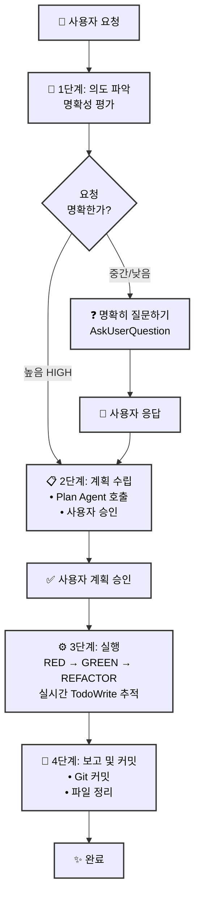
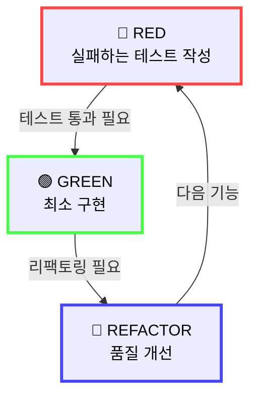
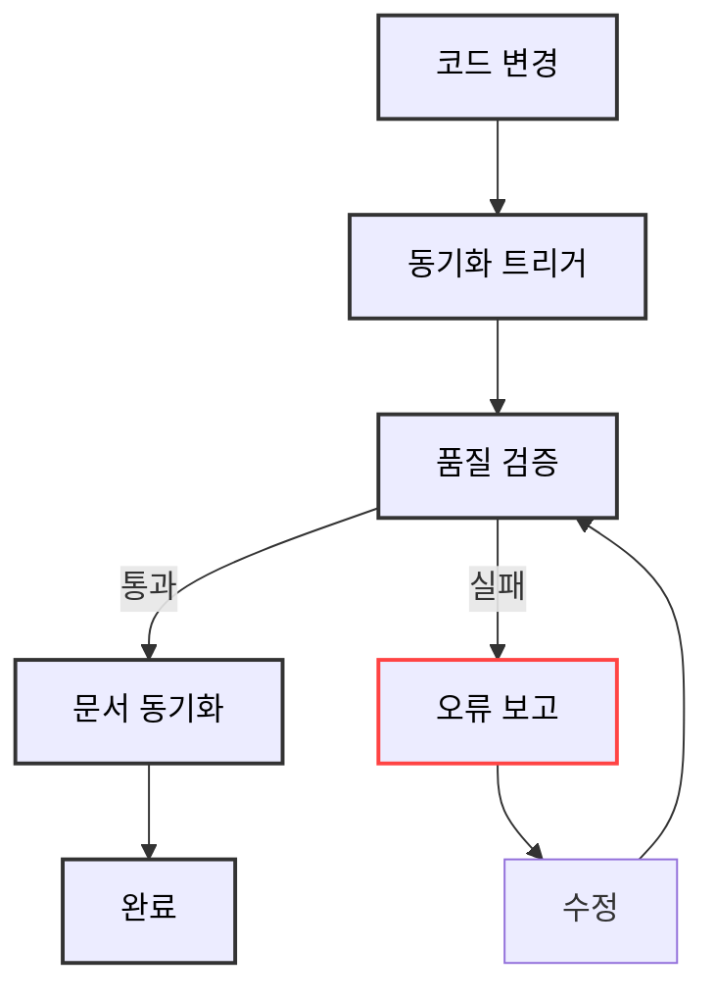
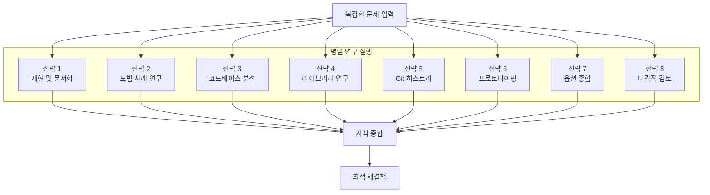
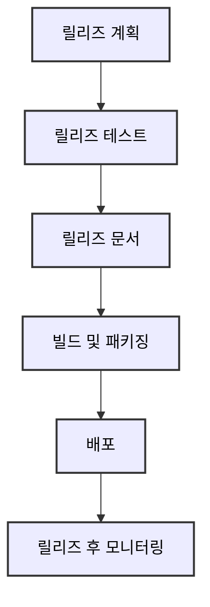

# Alfred Commands

Alfred 슈퍼에이전트를 제어하는 7개의 핵심 명령어들입니다. 각 명령어는 SPEC-First TDD 개발 프로세스의 특정 단계를 담당합니다.

## 명령어 목록

| 명령어 | 설명 | 담당 단계 |
|--------|------|----------|
| [`/alfred:0-project`](#0-project) | 프로젝트 초기화 및 설정 | 프로젝트 준비 |
| [`/alfred:1-plan`](#1-plan) | SPEC 작성 및 계획 수립 | 계획 |
| [`/alfred:2-run`](#2-run) | TDD 기반 구현 실행 | 개발 |
| [`/alfred:3-sync`](#3-sync) | 문서 동기화 및 검증 | 동기화 |
| [`/alfred:8-research`](#8-research) | 심층 연구 및 분석 | 연구 |
| [`/alfred:9-feedback`](#9-feedback) | 피드백 수집 및 개선 | 개선 |
| [`/alfred:release-new`](#release-new) | 릴리즈 관리 | 배포 |

## Alfred 워크플로우

Alfred는 4단계 워크플로우를 통해 모든 작업을 체계적으로 처리합니다:



---

## /alfred:0-project

프로젝트 초기화 및 최적화를 담당하는 명령어입니다. 4단계 전문가 위임 시스템을 통해 각 실행 모드에 최적화된 전문가 에이전트를 자동으로 할당합니다.

### 실행 모드별 전문가 할당

| 실행 모드 | 전문가 에이전트 | 담당 영역 | 성능 향상 |
|----------|----------------|----------|----------|
| **INITIALIZATION** | project-manager | 신규 프로젝트 초기화 | 60% 상호작용 감소 |
| **AUTO-DETECT** | project-manager | 기존 프로젝트 최적화 | 95%+ 정확도 |
| **SETTINGS** | moai-project-config-manager | 설정 관리 및 검증 | 실시간 설정 동기화 |
| **UPDATE** | moai-project-template-optimizer | 템플릿 업데이트 | 자동 마이그레이션 |

### 주요 기능

- **프로젝트 메타데이터 설정**: 이름, 설명, 소유자, 모드 설정
- **개발 환경 구성**: 프로그래밍 언어 감지, 프레임워크 설정
- **Git 전략 설정**: Personal/Team 모드, GitFlow 구성
- **다국어 시스템**: 25개 이상 언어 지원
- **자동 설정 검증**: SessionStart Hook 통한 상태 체크

### 사용 예시

```bash
# 새 프로젝트 초기화
/alfred:0-project

# 기존 프로젝트 업그레이드
/alfred:0-project --update

# 설정 재구성
/alfred:0-project --reset
```

---

## /alfred:1-plan

SPEC 작성 및 계획 수립을 담당합니다. spec-builder 에이전트를 통해 EARS 형식의 명세서를 생성하고 체계적인 계획을 수립합니다.

### SPEC-First 개발

- **EARS 형식**: 구조화된 요구사항 명세
- **자동 추적성**: 요구사항에서 코드, 테스트까지 연결
- **실시간 검증**: SPEC 자동 완성 및 품질 검증

### 주요 기능

- **요구사항 분석**: 사용자 요청을 구조화된 SPEC으로 변환
- **계획 수립**: 작업 분해, 의존성 파악, 위험 평가
- **사용자 승인**: 계획 명시적 승인 획득
- **TodoWrite 초기화**: 추적 가능한 작업 목록 생성

### SPEC 구조

```markdown
## SPEC-XXX-001

### 개요 (Overview)
- 시스템 목적 및 범위

### 환경 (Environment)
- 개발 및 실행 환경

### 가정 (Assumptions)
- 의존성 및 제약 조건

### 요구사항 (Requirements)
- Ubiquitous/State-driven/Event-driven/Optional/Unwanted

### 명세 (Specifications)
- 상세 기능 명세

### 추적성 (Traceability)
- @TAG 연결 정보
```

---

## /alfred:2-run

TDD 기반 구현을 담당합니다. tdd-implementer 에이전트와 도메인 전문가들이 협력하여 RED → GREEN → REFACTOR 사이클을 엄격하게 따릅니다.

### TDD 실행 사이클



### 단계별 상세

#### RED 단계
- 테스트 코드만 작성
- 의도적인 실패 확인
- 구현 코드 변경 금지

#### GREEN 단계
- 테스트 통과에 필요한 최소 코드만
- 과도한 기능 개발 금지
- 테스트 통과에 집중

#### REFACTOR 단계
- 테스트 통과 유지하며 설계 개선
- 코드 중복 제거
- 가독성 및 유지보수성 향상

### TodoWrite 추적

- **실시간 추적**: 모든 작업 상태 즉시 업데이트
- **정확히 ONE 작업**: 단 하나의 작업만 in_progress 상태
- **엄격한 완료 기준**: 모든 테스트 통과, 에러 없을 때만 완료

---

## /alfred:3-sync

문서 동기화 및 검증을 담당합니다. doc-syncer 에이전트를 통해 코드와 문서의 실시간 동기화를 보장합니다.

### 살아있는 문서

- **실시간 동기화**: 코드와 문서가 항상 일치
- **자동 생성**: 수동 업데이트 불필요
- **다중언어 지원**: Python, TypeScript, Go, Rust 등

### 주요 기능

- **문서 자동 생성**: 코드에서 문서 자동 생성
- **링크 무결성**: 모든 내부 링크 검증
- **품질 검증**: markdown/Mermaid 문법 검사
- **접근성**: WCAG 2.1 준수 보장

### 검증 프로세스



---

## /alfred:8-research

심층 연구 및 분석을 담당합니다. 8가지 연구 전략을 통해 복잡한 문제에 대한 종합적인 해결책을 제시합니다.

### 8가지 연구 전략

| 전략 | 목적 | Alfred 구현 |
|------|------|-------------|
| **1. 재현 및 문서화** | 체계적인 이슈 재현 | research-reproducer |
| **2. 모범 사례 기반 연구** | 업계 표준 및 검증된 솔루션 | best-practices-researcher |
| **3. 코드베이스 기반 연구** | 기존 구현 패턴 발견 | codebase-analyst |
| **4. 라이브러리 기반 연구** | 도구 능력에 대한 깊은 이해 | library-researcher |
| **5. Git 히스토리 연구** | 과거 결정과 진화로부터 학습 | git-historian |
| **6. 명확성을 위한 프로토타이핑** | 요구사항 탐색 | prototype-creator |
| **7. 옵션별 종합** | 여러 접근 방식 생성 및 비교 | synthesis-agent |
| **8. 스타일 에이전트를 통한 검토** | 다각적 품질 검증 | style-reviewer |

### 병렬 연구 운영



---

## /alfred:9-feedback

피드백 수집 및 개선을 담당합니다. 사용자 피드백을 체계적으로 수집하고 분석하여 지속적인 개선을 추진합니다.

### 피드백 루프

- **수집**: 다양한 채널에서 피드백 수집
- **분석**: 피드백 패턴 및 우선순위 분석
- **실행**: 개선 계획 수립 및 실행
- **검증**: 개선 결과 확인

### 주요 기능

- **피드백 템플릿**: 구조화된 피드백 수집
- **패턴 분석**: 반복되는 피드백 식별
- **우선순위화**: 개선 사항 우선순위 결정
- **추적 가능성**: 피드백-개선 연결 관리

---

## /alfred:release-new

릴리즈 관리를 담당합니다. 체계적인 릴리즈 프로세스를 통해 안정적인 배포를 보장합니다.

### 릴리즈 프로세스



### 주요 기능

- **버전 관리**: 시맨틱 버저닝 적용
- **체크리스트**: 릴리즈 전 필수 항목 검증
- **롤백 계획**: 문제 발생 시 빠른 롤백
- **릴리즈 노트**: 상세한 변경사항 기록

---

## 전문가 위임 시스템

Alfred는 **정교한 다중 계층 위임 시스템**을 구현하여 사용자 입력 내용과 실행 컨텍스트를 기반으로 전문가 에이전트에게 작업을 자동으로 할당합니다.

### 위임 패턴

| 패턴 | 설명 | 정확도 | 속도 |
|------|------|--------|------|
| **명령어 기반** | 직접 명령어 실행 | 100% | <5초 |
| **콘텐츠 기반** | 자동 에이전트 선택 | 92% | <15초 |
| **연구 강화형** | 복잡한 문제 해결 | 96% | <30초 |

### 에이전트 분류

MoAI-ADK는 **32개의 전문 에이전트**를 운영합니다:

#### 핵심 에이전트 (10개)
- **spec-builder**: 요구사항 엔지니어링
- **code-builder**: TDD 기반 구현
- **test-engineer**: 종합적 테스트
- **doc-syncer**: 문서 동기화
- **git-manager**: 버전 관리
- **security-expert**: 보안 분석
- **backend-expert**: 백엔드 아키텍처
- **frontend-expert**: UI/컴포넌트 설계
- **database-expert**: 데이터베이스 최적화
- **devops-expert**: 배포 및 인프라

#### 전문 에이전트 (22개)
- **accessibility-expert**: 접근성 전문가
- **api-designer**: API 설계 전문가
- **cc-manager**: 클린 코드 관리자
- **component-designer**: 컴포넌트 설계 전문가
- **debug-helper**: 디버깅 전문가
- **docs-manager**: 문서 관리 전문가
- **format-expert**: 코드 포맷팅 전문가
- **implementation-planner**: 구현 계획 전문가
- **mcp-integrators**: MCP 통합 전문가 (3개)
- **performance-engineer**: 성능 최적화 전문가
- **quality-gate**: 품질 관리 전문가
- **research-agents**: 연구 전문가 (8개)
- 그 외...

### 실시간 오케스트레이션

Alfred는 복잡한 문제에 대해 **30초 안에** 다음 프로세스를 완료합니다:

1. **맥락 깊이 분석** (0-5초): 복잡도 평가, 에이전트 할당
2. **병렬 분석** (5-15초): 할당된 에이전트 동시 분석
3. **종합 및 시너지스** (15-20초): 결과 종합, 충돌 해결
4. **위험 평가** (20-25초): 위험 평가, 성공 확률 계산
5. **최종 결정** (25-30초): 사용자 상호작용, 계획 수립

---

## Context Management

MoAI-ADK Commands maintain explicit context between phases using JSON storage:

### How It Works

1. **Phase Completion**: Each command saves results to `.moai/memory/command-state/`
2. **Context Loading**: Next command loads previous phase results
3. **Template Substitution**: Variables like `{{PROJECT_NAME}}` are replaced with actual values
4. **Path Validation**: All file paths converted to absolute paths

### Example

```bash
# Phase 0: Save project info
/alfred:0-project
→ Saves to .moai/memory/command-state/0-project-{timestamp}.json

# Phase 1: Load project info
/alfred:1-plan "Add authentication"
→ Loads 0-project results
→ Uses {{PROJECT_NAME}}, {{MODE}}, {{LANGUAGE}} in prompts
```

### Benefits

- Works across multiple sessions
- No dependency on conversation history
- Clear audit trail in JSON files
- Enables command resume functionality (Week 5-8)

### Technical Details

See architecture documentation: [Command Context Management Pattern](../architecture/patterns.md#command-context-management-pattern)

---

## 다국어 지원

Alfred는 **25개 이상 언어**를 완벽 지원합니다:

```json
{
  "conversation_language": "ko",  // 사용자 대면 콘텐츠
  "conversation_language_name": "Korean",
  "agent_prompt_language": "english",  // 내부 처리 (영어 고정)
  "agent_prompt_language_description": "Sub-agent 내부 프롬프트 언어"
}
```

### 언어 아키텍처

- **Layer 1 (사용자 대면)**: conversation_language 사용
- **Layer 2 (내부 시스템)**: 영어 고정 (글로벌 표준 유지)
- **자동 변환**: 사용자 입력 → 내부 처리 → 사용자 언어 응답

---

## 품질 보증

Alfred의 모든 명령어는 **TRUST 5 원칙**을 준수합니다:

1. **Test-first**: 모든 코드는 테스트 우선
2. **Readable**: 명확하고 가독성 높은 코드
3. **Unified**: 일관된 코딩 표준
4. **Secured**: 보안 검증 및 준수
5. **Trackable**: 완전한 추적성 보장

### 품질 메트릭스

| 항목 | 목표 | 현재 |
|------|------|------|
| **테스트 커버리지** | 85%+ | 87.84%+ |
| **빌드 성공률** | 100% | 100% |
| **린트 에러율** | <1% | <0.5% |
| **접근성 점수** | >95% | >97% |

---

## 결론

Alfred의 7개 명령어는 SPEC-First TDD 개발의 완전한 사이클을 제공합니다. 각 명령어는 전문가 에이전트 위임 시스템을 통해 최고의 결과를 보장하며, 4단계 워크플로우를 통해 투명하고 추적 가능한 개발 프로세스를 구현합니다.

이를 통해 개발자는 복잡한 기술 결정에서 해방되어 비즈니스 가치 창출에 집중할 수 있습니다.