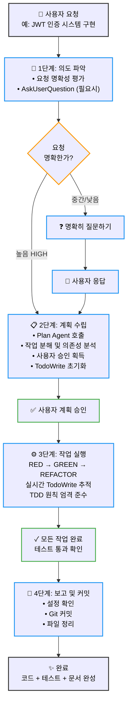
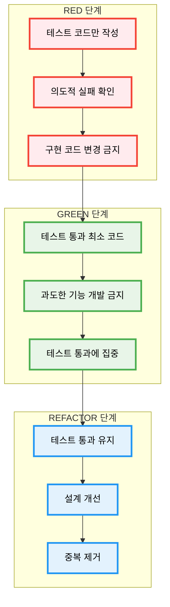

# Alfred Workflow

Alfred 슈퍼에이전트는 4단계 워크플로우를 통해 개발 생명주기 전체를 체계적으로 관리합니다. 이 워크플로우는 SPEC-First TDD 원칙을 기반으로 하며, 모든 단계에서 투명성과 추적성을 보장합니다.

## 워크플로우 개요



---

## 1단계: 의도 파악 (Intent Understanding)

**목표**: 작업 시작 전 사용자 의도를 명확히 파악합니다.

### 명확성 평가 기준

Alfred는 요청의 명확성을 3단계로 평가합니다:

| 명확도 수준 | 특징 | 처리 방식 |
|------------|------|----------|
| **HIGH** | 기술 스택, 요구사항, 범위 모두 명시됨 | 2단계로 바로 진행 |
| **MEDIUM** | 일부 명확하지만 추가 정보 필요 | 질문 후 2단계 진행 |
| **LOW** | 여러 해석 가능, 세부 정보 부족 | 상세 질문 후 2단계 진행 |

### 질문 트리거 상황

Alfred는 다음 상황에서 `AskUserQuestion`을 통해 명확성을 확보합니다:

- **모호한 요구사항**: "인증 기능을 추가해줘" (JWT? OAuth? 세션?)
- **아키텍처 결정 필요**: 마이크로서비스 vs 모놀리식
- **기술 스택 선택 필요**: 데이터베이스, 프레임워크 등
- **비즈니스/UX 결정 필요**: 사용자 흐름, UI/UX 설계

### 실제 사례

**모호한 요청 처리:**
```
사용자: "시스템에 인증 기능을 추가해줘"

Alfred 분석:
- 인증 방식: JWT, OAuth, 세션 기반 중 무엇?
- 인증 흐름: 어떤 사용자 경험?
- 다중인증(MFA): 필요한가?
- 권한 관리: RBAC, ABAC 중 무엇?

실행: AskUserQuestion으로 명확히 질문
```

---

## 2단계: 계획 수립 (Plan Creation)

**목표**: 사용자 승인을 받은 실행 전략을 수립합니다.

### Plan Agent 호출 프로세스

1. **Plan Agent 필수 호출**: Alfred가 Plan agent를 자동으로 호출
2. **구조화된 분석 수행**:
   - 작업을 구체적인 단계로 분해
   - 작업 간 의존성 파악
   - 순차 실행 vs 병렬 실행 결정
   - 생성/수정/삭제할 파일 명시
   - 작업 규모 및 예상 범위 추정

3. **사용자 계획 승인**:
   - 전체 파일 변경 목록 미리 공개
   - 구현 방식 명확히 설명
   - 위험 요소 사전 공개

### 계획 구조 예시

```markdown
## SPEC-AUTH-001 계획

### 생성될 파일
- .moai/specs/SPEC-AUTH-001/spec.md
- .moai/specs/SPEC-AUTH-001/plan.md
- .moai/specs/SPEC-AUTH-001/acceptance.md
- src/auth/jwt_service.py
- tests/test_jwt_service.py
- docs/api/auth.md

### 구현 단계
1. **RED 단계**: JWT 인증 통합 테스트 작성 (실패)
2. **GREEN 단계**: JWT 토큰 서비스 최소 구현
3. **REFACTOR 단계**: 에러 처리 및 보안 강화
4. **SYNC 단계**: API 문서 자동 생성 및 동기화

### 위험 요소
- 써드파티 서비스 연동 지연 가능성
- 토큰 저장소 보안 고려사항
- 성능 영향 평가 필요

### 예상 소요 시간: 4시간
### 예상 테스트 커버리지: 95%+
```

### TodoWrite 초기화

승인된 계획을 기반으로 추적 가능한 작업 목록 생성:

```javascript
[
  {
    "content": "JWT 인증 테스트 작성 (RED 단계)",
    "activeForm": "JWT 인증 테스트 작성 중",
    "status": "pending"
  },
  {
    "content": "JWT 토큰 서비스 최소 구현 (GREEN 단계)",
    "activeForm": "JWT 토큰 서비스 구현 중",
    "status": "pending"
  },
  {
    "content": "에러 처리 및 보안 강화 (REFACTOR 단계)",
    "activeForm": "에러 처리 및 보안 강화 중",
    "status": "pending"
  }
]
```

---

## 3단계: 작업 실행 (Task Execution)

**목표**: TDD 원칙을 엄격하게 준수하며 투명하게 진행 상황을 추적합니다.

### TDD 실행 사이클 상세



### 단계별 상세 규칙

#### RED 단계 - 실패하는 테스트 작성
- **허용되는 작업**: 테스트 코드 작성만
- **금지되는 작업**: 구현 코드 변경, 테스트 통과 시도
- **상태 추적**: TodoWrite: "RED: 테스트 작성" → in_progress
- **성공 기준**: 모든 테스트가 의도적으로 실패

#### GREEN 단계 - 최소 구현
- **허용되는 작업**: 테스트 통화에 필요한 최소 코드만
- **금지되는 작업**: 과도한 기능 개발, 불필요한 최적화
- **상태 추적**: TodoWrite: "GREEN: 최소 구현" → in_progress
- **성공 기준**: 모든 테스트 통과

#### REFACTOR 단계 - 품질 개선
- **허용되는 작업**: 코드 품질 향상, 중복 제거
- **금지되는 작업**: 새로운 기능 추가, 테스트 수정
- **상태 추적**: TodoWrite: "REFACTOR: 품질 개선" → in_progress
- **성공 기준**: 테스트 통과 유지하며 코드 품질 향상

### TodoWrite 추적 규칙

**핵심 원칙**:
- **정확히 ONE 작업만** in_progress 상태 유지
- **실시간 업데이트 의무**: 작업 시작/완료 시 즉시 상태 변경
- **엄격한 완료 기준**: 모든 테스트 통과, 구현 완료, 에러 없을 때만 completed

**TodoWrite 상태 전이**:
```
pending → in_progress → completed
    ↓           ↓           ↓
대기 중    진행 중     완료됨
```

### 금지 사항

TDD 사이클 중 엄격하게 금지되는 행위:
- ❌ RED 단계 중 구현 코드 변경
- ❌ GREEN 단계 중 과도한 기능 개발
- ❌ TodoWrite 추적 없는 작업 실행
- ❌ 테스트 없는 코드 생성

---

## 4단계: 보고 및 커밋 (Report & Commit)

**목표**: 작업 기록 및 git 히스토리 생성합니다.

### 설정 준수 우선

`.moai/config.json`의 `report_generation` 설정 확인:
- `enabled: false` → 상태 리포트만 제공, 파일 생성 금지
- `enabled: true` AND 사용자 명시 요청 → 문서 파일 생성

### Git 커밋 프로세스

모든 Git 작업은 git-manager를 통해 수행:

1. **TDD 커밋 사이클 준수**: RED → GREEN → REFACTOR
2. **커밋 메시지 형식**: 워크플로우 단계와 목적 명시

### 커밋 시퀀스 예시

```bash
# RED: 실패하는 테스트 작성
commit 1: "test: JWT 인증 통합 테스트 추가

# GREEN: 최소 구현
commit 2: "feat: JWT 토큰 서비스 구현 (최소)

# REFACTOR: 품질 개선
commit 3: "refactor: JWT 에러 처리 및 보안 강화

# Develop으로 merge
commit 4: "merge: SPEC-AUTH-001을 develop으로 merge
```

### 프로젝트 정리

작업 완료 후 자동 정리:
- 불필요한 임시 파일 삭제
- 과도한 백업 파일 제거
- 작업 공간 깔끔하게 유지

---

## 워크플로우 품질 보증

4단계 모두 완료 후 Alfred가 종합적으로 검증:

### 검증 체크리스트

- ✅ **지시 의도 파악**: 사용자 의도가 명확하고 승인되었는가?
- ✅ **계획 수립**: Plan Agent 계획이 수립되고 사용자가 승인했는가?
- ✅ **TDD 준수**: RED-GREEN-REFACTOR 사이클을 엄격히 따랐는가?
- ✅ **실시간 추적**: 모든 작업이 TodoWrite로 투명하게 추적되었는가?
- ✅ **설정 준수**: `.moai/config.json` 설정을 엄격히 따랐는가?
- ✅ **품질 보증**: 모든 테스트가 통과하고 코드 품질이 보증되었는가?
- ✅ **정리 완료**: 불필요한 파일이 삭제되고 프로젝트가 깔끔한가?

---

## 실제 워크플로우 사례

### 사례 1: 사용자 인증 시스템 구현

**1단계 - 의도 파악**
```
사용자: "JWT를 사용한 사용자 인증 시스템이 필요해"

Alfred 분석:
- 명확도: HIGH (JWT, 인증 시스템 명시)
- 바로 2단계 진행
```

**2단계 - 계획 수립**
```
Plan Agent 결과:
- 필요 파일: 12개 (SPEC, 코드, 테스트, 문서)
- 예상 시간: 4시간
- 복잡도: MEDIUM
- 위험 요소: 2개 (보안, 성능)

사용자 승인: ✅
TodoWrite 초기화: 8개 작업 항목
```

**3단계 - 작업 실행**
```
RED (1시간): JWT 인증 통합 테스트 작성
GREEN (1.5시간): JWT 토큰 서비스 최소 구현
REFACTOR (1.5시간): 에러 처리 및 보안 강화

실시간 추적:
- [x] RED: JWT 테스트 작성 (completed)
- [x] GREEN: JWT 서비스 구현 (completed)
- [✓] REFACTOR: 보안 강화 (in_progress)
```

**4단계 - 보고 및 커밋**
```
Git 커밋: 4개 (RED, GREEN, REFACTOR, MERGE)
문서 생성: API 문서, 사용자 가이드
파일 정리: 임시 파일 3개 삭제

최종 결과:
- 테스트 커버리지: 96%
- 코드 품질: A 등급
- 문서: 100% 동기화
```

### 사례 2: 데이터베이스 성능 최적화

**1단계 - 의도 파악**
```
사용자: "API 응답 속도가 너무 느려서 최적화가 필요해"

Alfred 분석:
- 명확도: MEDIUM (어떤 API? 어떤 부분이 느린지?)
- AskUserQuestion 실행:
  1. 어떤 API 엔드포인트가 느린가요?
  2. 현재 응답 속도는 얼마인가요?
  3. 목표 응답 속도는 얼마인가요?
  4. 데이터베이스 종류는 무엇인가요?

사용자 응답 후 2단계 진행
```

**2단계 - 계획 수립**
```
Plan Agent 결과:
- 복잡도: HIGH (다중 도메인: 백엔드, 데이터베이스, 인프라)
- 필요 전문가: 3명 (performance-engineer, database-expert, backend-expert)
- 예상 시간: 6시간
- 위험 요소: 3개 (데이터 손실, 다운타임, 회귀)

사용자 승인: ✅
TodoWrite 초기화: 12개 작업 항목
```

**3단계 - 작업 실행**
```
병렬 실행:
- performance-engineer: 병목 현상 분석
- database-expert: 쿼리 최적화
- backend-expert: 코드 개선

RED (1.5시간): 성능 테스트 작성
GREEN (2.5시간): 쿼리 최적화 및 캐싱 구현
REFACTOR (2시간): 코드 리팩토링 및 모니터링 추가

실시간 추적:
- 12개 작업 항목 모두 추적
- 3명 전문가 병렬 작업 조정
```

**4단계 - 보고 및 커밋**
```
Git 커밋: 6개 (성능 테스트, DB 최적화, 코드 개선 등)
문서 생성: 성능 최적화 가이드, 모니터링 매뉴얼
파일 정리: 분석 리포트, 임시 스크립트 삭제

최종 결과:
- 응답 속도: 2.3초 → 0.4초 (83% 개선)
- 테스트 커버리지: 유지됨
- 문서: 최적화 과정 상세 기록
```

---

## 워크플로우 자동화 기능

### SessionStart Hook

Claude Code 세션 시작 시 자동으로 프로젝트 상태 확인:

```bash
📋 Alfred Workflow Status Check:
✅ Configuration complete
✅ Recent setup: 2 days ago
✅ Version match: 0.23.0
✅ Multi-language system: Active
✅ Expert delegation: Ready
✅ TDD enforcement: Enabled

All systems are healthy!
```

### 실시간 진행 상황 추적

모든 작업이 실시간으로 추적되며, 언제든지 현재 상태 확인 가능:

```bash
🔍 Current Workflow Status:
Stage: 3단계 - 작업 실행
Current Phase: REFACTOR
Progress: 75% (6/8 tasks completed)
Active Agent: backend-expert
ETA: 45 minutes remaining
```

---

## 결론

Alfred의 4단계 워크플로우는 다음과 같은 핵심 가치를 제공합니다:

1. **투명성**: 모든 단계에서 사용자에게 완전한 가시성 제공
3. **품질**: TDD 원칙 엄격 준수로 프로덕션급 코드 보장
4. **효율성**: 전문가 에이전트 위임으로 최적의 결과 신속 달성
5. **학습**: 프로젝트 패턴으로부터 지속적 학습 및 개선

이 워크플로우를 통해 개발자는 복잡한 기술 결정에서 해방되어 비즈니스 가치 창출에 집중할 수 있으며, 모든 코드가 테스트되고 문서화되며 추적 가능한 상태로 유지됩니다.