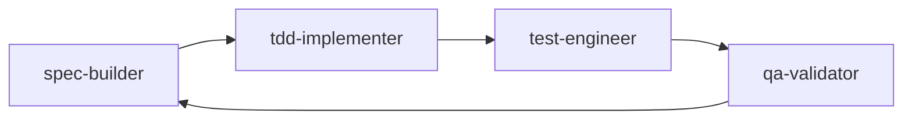
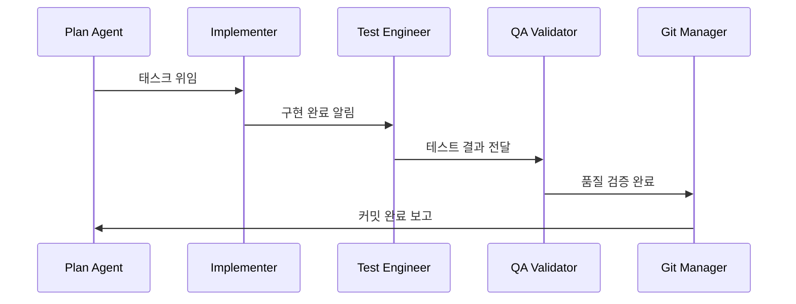
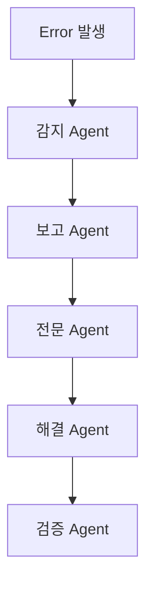

# 아키텍처 패턴

MoAI-ADK는 4계층 아키텍처(Layered Architecture)를 기반으로 한 에이전트 기반 시스템입니다. 이 아키텍처는 관심사 분리(Separation of Concerns), 단일 책임 원칙(Single Responsibility Principle), 개방-폐쇄 원칙(Open-Closed Principle)을 따릅니다.

## 4계층 아키텍처

### Commands (워크플로우 오케스트레이션)
- **역할**: 사용자 진입점으로 Plan → Run → Sync 캐이던스를 강제
- **예시**: `/alfred:0-project`, `/alfred:1-plan`, `/alfred:2-run`, `/alfred:3-sync`
- **특징**: 여러 서브에이전트를 조율하고 승인을 관리하며 진행 상황을 추적

### Agents (심층 추론 및 의사결정)
- **역할**: 태스크 중심의 전문가로 분석, 설계, 검증 수행
- **예시**: spec-builder, tdd-implementer, doc-syncer, tag-agent, git-manager
- **특징**: 상태 보고, 블로커 에스컬레이션, Skills 요청

### Skills (재사용 가능한 지식 캡슐)
- **역할**: 500단어 미만의 플레이북으로 Progressive Disclosure 방식으로 로드
- **예시**: 표준 템플릿, 베스트 프랙티스, 체크리스트
- **특징**: `.claude/skills/`에 저장, 관련성 있을 때만 로드

### Hooks (가드레일 및 Just-in-Time 컨텍스트)
- **역할**: 세션 이벤트에 의해 트리거되는 가벼운(<100ms) 검사
- **예시**: SessionStart 요약, PreToolUse 안전 검사
- **특징**: 파괴적인 명령 차단, 상태 카드 표시, 컨텍스트 포인터 시드

## 패턴 선택 가이드라인

### Hook 사용 조건
- 이벤트에 의해 자동으로 실행되는가? → **Hook**
- 추론이나 대화가 필요한가? → **Sub-agent**
- 재사용 가능한 지식이나 정책을 인코딩하는가? → **Skill**
- 여러 단계나 승인을 조율하는가? → **Command**

## 에이전트 협업 패턴

### 수평적 협업


### 수직적 위임
```mermaid
graph TD
    A[Command Layer] --> B[Agent Layer]
    B --> C[Skill Layer]
    C --> D[Hook Layer]
    B --> E[Task() 호출]
    E --> F[다른 Agent]
```

### 에이전트 체인 패턴


## 데이터 흐름 패턴

### 단방향 데이터 흐름
- **상향**: 데이터 수집 → 분석 → 보고
- **하향**: SPEC → 구현 → 테스트 → 배포

### 상태 관리 패턴
- **TodoWrite**: 워크 추적 및 상태 저장
- **TAG 시스템**: 요구사항 추적 및 연결성 보장
- **Git Flow**: 버전 관리 및 협업 워크플로우

## 에러 처리 및 회복 패턴

### 회복탄력성 패턴
1. **선제적 검증**: Hook 단계에서 오류 방지
2. **즉시 보고**: 에이전트 즉시 문제 보고
3. **전문 에스컬레이션**: debug-helper 에이전트에 전문 에러 처리 위임
4. **상태 보존**: 롤백 관리자로 상태 복원

### 오류 전파 패턴


## 성능 최적화 패턴

### 지연 로딩 (Lazy Loading)
- **Skills**: 필요할 때만 로드 (Progressive Disclosure)
- **Context**: 메모리 최적화를 위한 컨텍스트 버짓 관리
- **Validation**: 빠른 스캔 vs 전체 검증 분리

### 병렬 처리 패턴
- **Multi-Tool Calls**: 독립적 작업 동시 실행
- **Parallel Processing**: 대용량 파일 처리 최적화
- **Cache System**: 반복 작업 캐싱으로 성능 향상

## 확장성 패턴

### 플러그인 아키텍처
- **Skills**: 새로운 지식 영역을 쉽게 추가
- **Agents**: 새로운 전문 분야를 도입
- **Commands**: 새로운 워크플로우를 정의

### 모듈성 원칙
- **독립성**: 각 계층은 독립적으로 테스트 가능
- **인터페이스**: 명확한 API와 프로토콜 정의
- **교체 가능성**: 구현체를 쉽게 교체 가능

## Command Context Management Pattern

### Overview
MoAI-ADK Commands save execution results as JSON files in `.moai/memory/command-state/` for explicit context passing between phases. This enables stateful workflows across sessions and provides clear traceability.

### Phase Result Storage

Each command phase (0-project, 1-plan, 2-run, 3-sync) saves its execution results:

```json
{
  "phase": "0-project",
  "timestamp": "2025-11-12T10:30:00Z",
  "status": "completed",
  "outputs": {
    "project_name": "MyProject",
    "mode": "personal",
    "conversation_language": "ko"
  },
  "files_created": [
    "/absolute/path/to/.moai/config.json",
    "/absolute/path/to/.moai/project/product.md"
  ],
  "next_phase": "1-plan"
}
```


`command_helpers.py` provides reusable patterns for commands:

| Function | Purpose |
|----------|---------|
| `extract_project_metadata()` | Extract project configuration from `.moai/config.json` |
| `detect_tech_stack()` | Auto-detect programming languages in project |
| `build_phase_result()` | Standardize phase output format |
| `validate_phase_files()` | Batch validate file paths (absolute path enforcement) |
| `save_command_context()` | Persist phase state to JSON with error handling |
| `load_previous_phase()` | Load most recent phase results for next command |

### Integration Pattern

Commands use helpers to save context after agent execution:

```python
from moai_adk.core.command_helpers import save_command_context

# After project-manager agent completes in /alfred:0-project
save_command_context(
    phase_name="0-project",
    project_root="/path/to/project",
    outputs={
        "project_name": "MyProject",
        "mode": "personal",
        "conversation_language": "ko"
    },
    files_created=[
        "/absolute/path/.moai/config.json",
        "/absolute/path/.moai/project/product.md"
    ],
    next_phase="1-plan"
)
```

### Data Flow

```
/alfred:0-project
    ↓ (executes)
project-manager agent
    ↓ (returns results)
command_helpers.save_command_context()
    ↓ (persists)
.moai/memory/command-state/0-project-{timestamp}.json
    ↓ (loads)
/alfred:1-plan
    ↓ (uses context)
spec-builder agent
```

### Benefits

- **Explicit Context**: No reliance on session history
- **Resumable**: Commands can resume after interruption
- **Testable**: Integration tests verify end-to-end flow
- **Traceable**: JSON files provide clear audit trail
- **Consistent**: Standardized format across all phases

### Implementation Reference


## 보안 패턴

### 신뢰 경계 (Trust Boundaries)
- **사용자 입력**: 검증 및 정제
- **파일 시스템**: 안전한 접근 패턴
- **Git 작업**: 롤백 및 백업 메커니즘

### 권한 관리
- **최소 권한**: 각 에이전트는 필요한 최소한의 권한만 보유
- **감사 추적**: 모든 작업은 추적 가능한 TAG로 연결
- **안전 실패**: 시스템 손상 없이 안전한 실패 처리