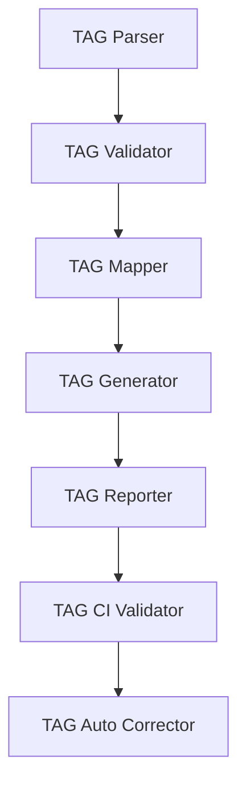
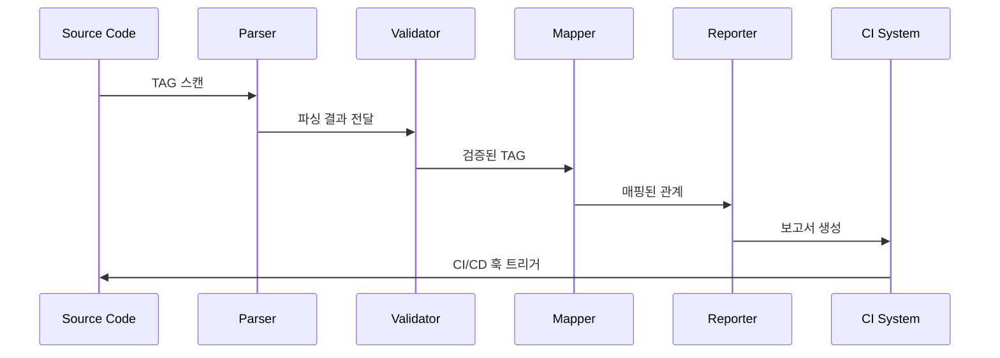

# @TAG 내부 구조

MoAI-ADK의 @TAG 시스템은 코드 기반 요구사항 추적 시스템으로, 12개의 카테고리와 복잡한 내부 아키텍처를 통해 개발 워크플로우 전체에 걸쳐 추적성을 보장합니다.

## 시스템 아키텍처

### 1. 핵심 컴포넌트


### 2. 데이터 흐름


## TAG 카테고리 시스템

### 1. 12개 핵심 카테고리
```json
{
  "categories": [
    "REQ",        // 요구사항
    "DESIGN",     // 설계
    "TASK",       // 작업
    "TEST",       // 테스트
    "FEATURE",    // 기능
    "API",        // API
    "UI",         // 사용자 인터페이스
    "DATA",       // 데이터
    "RESEARCH",   // 연구
    "ANALYSIS",   // 분석
    "KNOWLEDGE",  // 지식
    "INSIGHT"     // 통찰력
  ]
}
```

### 2. 카테고리별 용도
| 카테고리 | 용도 | 예시 |
|---------|------|------|
| REQ | 기능 요구사항 | `@REQ:USER-AUTH-001` |
| DESIGN | 시스템 설계 | `@DESIGN:ARCH-DB-001` |
| TASK | 개발 작업 | `@TASK:IMPLEMENT-API-001` |
| TEST | 테스트 케이스 | `@TEST:UNIT-AUTH-001` |
| FEATURE | 기능 모듈 | `@FEATURE:LOGIN-MODULE` |
| API | API 엔드포인트 | `@API:POST-LOGIN` |
| UI | UI 컴포넌트 | `@UI:LOGIN-FORM` |
| DATA | 데이터 모델 | `@DATA:USER-MODEL` |
| RESEARCH | 연구 활동 | `@RESEARCH:PERF-ANALYSIS` |
| ANALYSIS | 분석 결과 | `@ANALYSIS:BOTTLENECK-001` |
| KNOWLEDGE | 지식 베이스 | `@KNOWLEDGE:BEST-PRACTICE` |
| INSIGHT | 통찰력 | `@INSIGHT:OPTIMIZATION-STRATEGY` |

## 내부 모듈 상세

### 1. TAG Parser (`core/tags/parser.py`)
```python
class TAGParser:
    """TAG 구문 분석기"""

    def parse_tags(self, content: str) -> List[TAG]:
        """콘텐츠에서 TAG 추출"""
        pass

    def validate_syntax(self, tag: str) -> bool:
        """TAG 문법 검증"""
        pass
```

**주요 기능:**
- 정규표현식 기반 TAG 패턴 매칭
- 중첩 TAG 구조 분석
- TAG 형식 검증

### 2. TAG Validator (`core/tags/validator.py`)
```python
class TAGValidator:
    """TAG 유효성 검사기"""

    def validate_chain(self, tag_chain: List[TAG]) -> ValidationResult:
        """TAG 체인 유효성 검사"""
        pass

    def check_completeness(self, tags: List[TAG]) -> CompletenessReport:
        """TAG 완전성 검사"""
        pass
```

**검증 규칙:**
- SPEC → TEST → CODE 필수 체인
- 카테고리 간 종속성 확인
- 중복 TAG 검출

### 3. TAG Mapper (`core/tags/mapper.py`)
```python
class TAGMapper:
    """TAG 관계 매핑"""

    def map_relationships(self, tags: List[TAG]) -> RelationshipGraph:
        """TAG 간 관계 매핑"""
        pass

    def build_dependency_graph(self, tags: List[TAG]) -> DependencyGraph:
        """의존성 그래프 생성"""
        pass
```

**매핑 기능:**
- 부모-자식 관계 설정
- 순환 의존성 검출
- 크로스-레퍼런스 생성

### 4. TAG Generator (`core/tags/generator.py`)
```python
class TAGGenerator:
    """TAG 자동 생성기"""

    def generate_spec_tags(self, spec_content: str) -> List[TAG]:
        """SPEC 문서에서 TAG 자동 생성"""
        pass

    def suggest_test_tags(self, code_content: str) -> List[TAG]:
        """코드 기반 테스트 TAG 제안"""
        pass
```

### 5. TAG Reporter (`core/tags/reporter.py`)
```python
class TAGReporter:
    """TAG 보고서 생성기"""

    def generate_coverage_report(self, tags: List[TAG]) -> CoverageReport:
        """TAG 커버리지 보고서"""
        pass

    def create_traceability_matrix(self, tags: List[TAG]) -> TraceabilityMatrix:
        """추적성 매트릭스 생성"""
        pass
```

## 정책 및 규칙 엔진

### 1. 정책 검증기 (`core/tags/policy_validator.py`)
```python
class PolicyValidator:
    """TAG 정책 검증"""

    def validate_strict_mode(self, tags: List[TAG]) -> PolicyResult:
        """스트릭트 모드 검증"""
        pass

    def check_enforcement_rules(self, tags: List[TAG]) -> EnforcementReport:
        """강제 규칙 검사"""
        pass
```

### 2. 정책 규칙
- **require_spec_before_code**: 코드 전에 SPEC 필수
- **require_test_for_code**: 코드에 테스트 필수
- **enforce_chains**: TAG 체인 강제
- **mandatory_directories**: 필수 디렉토리 TAG 요구

## 자동 수정 시스템

### 1. Auto Corrector (`core/tags/auto_corrector.py`)
```python
class AutoCorrector:
    """TAG 자동 수정기"""

    def fix_missing_tags(self, analysis: TAGAnalysis) -> CorrectionPlan:
        """누락된 TAG 수정 계획"""
        pass

    def resolve_duplicates(self, tags: List[TAG]) -> List[TAG]:
        """중복 TAG 해결"""
        pass
```

### 2. 수정 레벨
- **safe**: 안전한 자동 수정 (활성화)
- **medium_risk**: 중간 위험 수정 (사용자 승인 필요)
- **high_risk**: 고위험 수정 (사용자 승인 필수)

## CI/CD 통합

### 1. CI Validator (`core/tags/ci_validator.py`)
```python
class CIVALIDATOR:
    """CI/CD TAG 검증"""

    def validate_pre_commit(self, changes: List[FileChange]) -> CIResult:
        """Pre-commit TAG 검증"""
        pass

    def check_pr_compliance(self, pr_data: PRData) -> ComplianceResult:
        """PR TAG 준수 검사"""
        pass
```

### 2. Pre-Commit 훅
- 실시간 TAG 검증
- 누락된 TAG 자동 탐지
- 커밋 차단 규칙 적용

### 3. PR 검증
- PR 본문 TAG 검증
- 변경된 파일 TAG 확인
- TAG 체인 완전성 검사

## 성능 최적화

### 1. 캐싱 시스템
- **파일 기반 캐싱**: 분석 결과 캐싱
- **인메모리 캐싱**: 빠른 검색을 위한 캐시
- **증분 분석**: 변경된 파일만 재분석

### 2. 병렬 처리
- **다중 스레드**: 대규모 코드베이스 병렬 처리
- **Chunk 처리**: 대용량 파일 분할 처리
- **비동기 I/O**: 파일 I/O 비동기화

### 3. 최적화 알고리즘
- **AST 기반 분석**: `FastASTVisitor` 활용
- **인덱싱**: TAG 위치 빠른 검색
- **압축 저장**: TAG 데이터 효율적 저장

## 확장성 설계

### 1. 플러그인 아키텍처
- **커스텀 규칙**: 사용자 정의 검증 규칙
- **카테고리 확장**: 새로운 카테고리 추가
- **포맷터**: 다양한 출력 포맷 지원

### 2. API 인터페이스
- **REST API**: 외부 도구와 통합
- **GraphQL**: 유연한 데이터 쿼리
- **WebSocket**: 실시간 TAG 모니터링

## 데이터 모델

### 1. TAG 엔티티
```python
@dataclass
class TAG:
    category: str
    identifier: str
    file_path: str
    line_number: int
    content: str
    metadata: Dict[str, Any]
    relationships: List[TAGReference]
    created_at: datetime
    updated_at: datetime
```

### 2. 관계 모델
```python
@dataclass
class TAGReference:
    source_tag: TAG
    target_tag: TAG
    relationship_type: RelationshipType
    strength: float
    metadata: Dict[str, Any]
```

## 모니터링 및 메트릭

### 1. 성능 메트릭
- **분석 시간**: 코드베이스 분석 소요 시간
- **캐시 히트율**: 캐시 효율성 측정
- **메모리 사용**: 시스템 리소스 사용량

### 2. 품질 메트릭
- **TAG 커버리지**: TAG로 추적되는 코드 비율
- **체인 완전도**: 완전한 TAG 체인 비율
- **정책 준수율**: TAG 정책 준수 정도

## 트러블슈팅

### 1. 일반적인 문제
- **TAG 중복**: 동일한 TAG 다중 사용
- **깨진 체인**: 불완전한 TAG 체인
- **성능 저하**: 대규모 코드베이스 처리

### 2. 진명 도구
- **디버그 로그**: 상세한 처리 로그
- **상태 보고**: 시스템 상태 점검
- **성능 프로파일링**: 병목 지점 식별