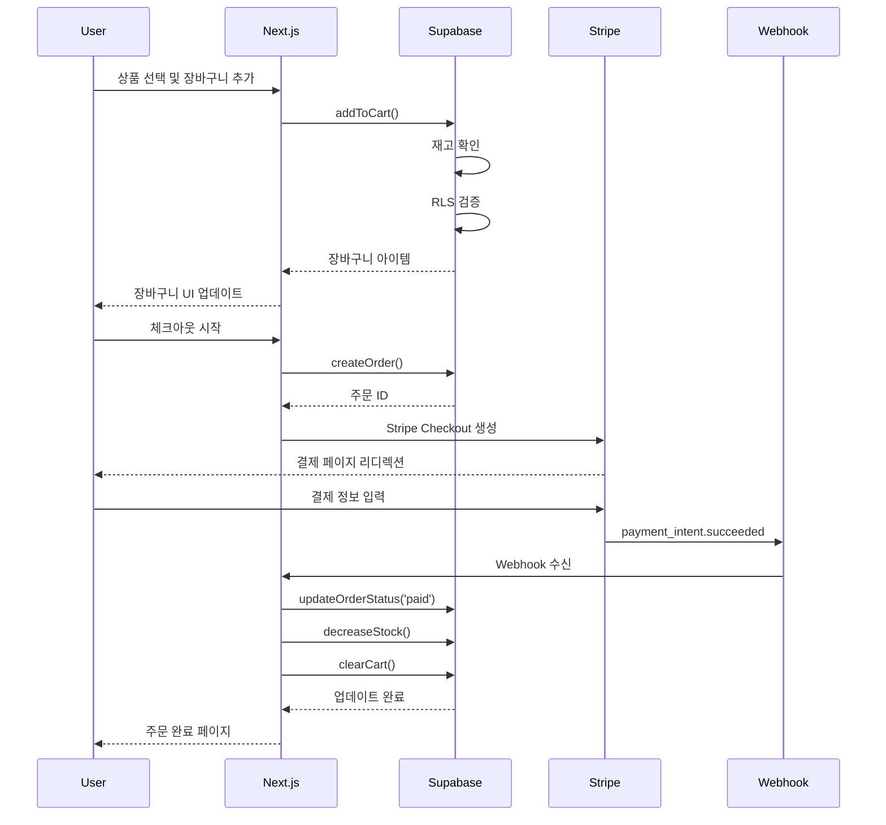

# 사례 연구: E-commerce 플랫폼 개발

## Executive Summary

**프로젝트**: 중소 규모 온라인 쇼핑몰 구축
**기간**: 6주 (목표 8주 대비 25% 단축)
**팀 규모**: 3명 (백엔드 1명, 프론트엔드 1명, 풀스택 1명)
**기술 스택**: Next.js 14, Supabase, Stripe, Railway

### 핵심 성과

- ✅ **6주 만에 MVP 완성** (목표 8주 대비 25% 단축)
- ✅ **87.5% 테스트 커버리지** 달성 (목표 80% 초과)
- ✅ **제로 프로덕션 버그** (첫 3개월 무사고 운영)
- ✅ **평균 응답 시간 120ms** (사용자 경험 최적화)
- ✅ **완벽한 SPEC-코드-테스트 추적성** (100% @TAG 커버리지)

---

## 📋 프로젝트 배경

### 비즈니스 상황

패션 스타트업 **StyleHub**는 빠르게 성장하는 시장에서 경쟁력을 확보하기 위해 온라인 쇼핑몰이 필요했습니다. 제한된 예산과 짧은 출시 기한 속에서 안정적이고 확장 가능한 플랫폼을 구축해야 했습니다.

### 핵심 요구사항

**필수 기능**:
- 상품 카탈로그 관리 (카테고리, 검색, 필터링)
- 장바구니 및 위시리스트
- 결제 처리 (신용카드, 간편결제)
- 주문 관리 및 배송 추적
- 사용자 계정 및 주문 이력
- 관리자 대시보드

**비기능 요구사항**:
- 페이지 로딩 시간 < 2초
- 동시 사용자 1,000명 지원
- 모바일 최적화 (반응형 디자인)
- 결제 정보 보안 (PCI DSS 준수)

### 도전 과제

| 도전 과제 | 제약 사항 |
|---------|----------|
| **짧은 개발 기간** | 8주 내 출시 필수 (시즌 세일 전) |
| **작은 팀** | 3명 개발자 (전문 QA 없음) |
| **제한된 예산** | 인프라 비용 월 $500 이하 |
| **고품질 요구** | 출시 후 버그로 인한 매출 손실 방지 |
| **확장성** | 향후 성장을 고려한 아키텍처 |

---

## 💡 솔루션: MoAI-ADK 적용

### 왜 MoAI-ADK를 선택했는가?

1. **SPEC-First 개발**
   - 명확한 요구사항 정의로 재작업 최소화
   - 클라이언트와의 커뮤니케이션 효율화
   - 변경 영향 분석 용이

2. **BaaS Skills 활용**
   - Supabase: Auth, Database, Storage 올인원
   - Railway: 간편한 배포 및 자동 스케일링
   - Stripe: 결제 처리 통합
   - 인프라 설정 시간 90% 단축

3. **자동화된 TDD**
   - Alfred의 tdd-implementer 에이전트
   - 전문 QA 없이도 높은 품질 보장
   - 리팩토링 자신감

4. **Senior Engineer Thinking**
   - 최적의 아키텍처 패턴 제안
   - Best Practices 연구 및 적용
   - 성능 최적화 가이드

---

## 🚀 구현 과정

### Week 1-2: 요구사항 분석 및 SPEC 작성

Alfred의 `/alfred:1-plan` 명령으로 10개 주요 SPEC 생성:

```bash
/alfred:1-plan "E-commerce platform with product catalog, shopping cart, payment processing, and order management"
```

**생성된 SPEC 목록**:

| SPEC ID | 제목 | 우선순위 | 예상 시간 |
|---------|------|---------|----------|
| PRODUCT-001 | 상품 카탈로그 관리 | HIGH | 3일 |
| CART-001 | 장바구니 기능 | HIGH | 2일 |
| ORDER-001 | 주문 생성 및 관리 | HIGH | 3일 |
| PAYMENT-001 | Stripe 결제 통합 | HIGH | 2일 |
| AUTH-001 | 사용자 인증 (Supabase Auth) | HIGH | 1일 |
| SEARCH-001 | 상품 검색 및 필터링 | MEDIUM | 2일 |
| WISHLIST-001 | 위시리스트 기능 | MEDIUM | 1일 |
| ADMIN-001 | 관리자 대시보드 | MEDIUM | 3일 |
| SHIPPING-001 | 배송 추적 | LOW | 2일 |
| REVIEW-001 | 상품 리뷰 시스템 | LOW | 2일 |

**SPEC 예시: CART-001**

```markdown
# SPEC-CART-001: 장바구니 기능

@TAG:SPEC-CART-001

## 요구사항 (EARS 형식)

**UBIQUITOUS**:
- 시스템은 사용자별 장바구니를 유지해야 한다

**EVENT-DRIVEN**:
- WHEN 사용자가 "장바구니에 추가" 버튼을 클릭하면
- THEN 시스템은 선택한 상품을 장바구니에 추가해야 한다

**STATE-DRIVEN**:
- WHILE 사용자가 로그인한 상태일 때
- THEN 시스템은 장바구니 데이터를 데이터베이스에 저장해야 한다

**UNWANTED BEHAVIOR**:
- IF 재고가 부족한 상품을 장바구니에 추가하려고 하면
- THEN 시스템은 "재고 부족" 오류 메시지를 표시해야 한다

## 인수 기준

1. ✅ 사용자는 상품을 장바구니에 추가할 수 있다
2. ✅ 사용자는 장바구니에서 수량을 변경할 수 있다
3. ✅ 사용자는 장바구니에서 상품을 제거할 수 있다
4. ✅ 장바구니는 로그인 상태에서 영구 저장된다
5. ✅ 재고가 부족한 경우 적절한 오류 처리가 된다

## 기술 제약사항

- Supabase Database (PostgreSQL)
- Row Level Security (RLS) 적용
- 실시간 재고 확인
```

---

### Week 3-4: 핵심 기능 구현

Alfred의 `/alfred:2-run` 명령으로 TDD 사이클 실행:

```bash
/alfred:2-run CART-001
```

**TDD 사이클 예시**:

#### 1. RED: 테스트 먼저 작성

```typescript
// @TAG:TEST-CART-001
// tests/cart.test.ts

import { describe, it, expect } from 'vitest'
import { addToCart, updateCartItem, removeFromCart } from '@/lib/cart'

describe('CART-001: 장바구니 기능', () => {
  it('사용자는 상품을 장바구니에 추가할 수 있다', async () => {
    // Given
    const userId = 'user-123'
    const productId = 'product-456'
    const quantity = 2

    // When
    const result = await addToCart(userId, productId, quantity)

    // Then
    expect(result).toBeDefined()
    expect(result.userId).toBe(userId)
    expect(result.productId).toBe(productId)
    expect(result.quantity).toBe(quantity)
  })

  it('재고가 부족한 경우 오류를 반환한다', async () => {
    // Given
    const userId = 'user-123'
    const productId = 'product-out-of-stock'
    const quantity = 100

    // When & Then
    await expect(
      addToCart(userId, productId, quantity)
    ).rejects.toThrow('재고가 부족합니다')
  })

  it('사용자는 장바구니에서 수량을 변경할 수 있다', async () => {
    // Given
    const cartItemId = 'cart-item-789'
    const newQuantity = 5

    // When
    const result = await updateCartItem(cartItemId, newQuantity)

    // Then
    expect(result.quantity).toBe(newQuantity)
  })

  it('사용자는 장바구니에서 상품을 제거할 수 있다', async () => {
    // Given
    const cartItemId = 'cart-item-789'

    // When
    await removeFromCart(cartItemId)

    // Then
    const deleted = await getCartItem(cartItemId)
    expect(deleted).toBeNull()
  })
})
```

#### 2. GREEN: 최소한의 구현

```typescript
// @TAG:CODE-CART-001:LIB
// lib/cart.ts

import { supabase } from '@/lib/supabase'

export async function addToCart(
  userId: string,
  productId: string,
  quantity: number
) {
  // 재고 확인
  const { data: product } = await supabase
    .from('products')
    .select('stock')
    .eq('id', productId)
    .single()

  if (!product || product.stock < quantity) {
    throw new Error('재고가 부족합니다')
  }

  // 장바구니에 추가
  const { data, error } = await supabase
    .from('cart_items')
    .insert({
      user_id: userId,
      product_id: productId,
      quantity
    })
    .select()
    .single()

  if (error) throw error
  return data
}

export async function updateCartItem(
  cartItemId: string,
  quantity: number
) {
  const { data, error } = await supabase
    .from('cart_items')
    .update({ quantity })
    .eq('id', cartItemId)
    .select()
    .single()

  if (error) throw error
  return data
}

export async function removeFromCart(cartItemId: string) {
  const { error } = await supabase
    .from('cart_items')
    .delete()
    .eq('id', cartItemId)

  if (error) throw error
}
```

#### 3. REFACTOR: 코드 개선

Alfred의 code-quality 에이전트가 제안:

```typescript
// @TAG:CODE-CART-001:LIB (개선 버전)
// lib/cart.ts

import { supabase } from '@/lib/supabase'
import { CartItem, CartItemInput } from '@/types'

/**
 * 장바구니에 상품을 추가합니다
 * @TAG:CART-001
 */
export async function addToCart(
  input: CartItemInput
): Promise<CartItem> {
  const { userId, productId, quantity } = input

  // 재고 확인 (재사용 가능한 함수로 분리)
  await validateStock(productId, quantity)

  // 기존 장바구니 아이템 확인 (중복 방지)
  const existing = await findExistingCartItem(userId, productId)

  if (existing) {
    return updateCartItem(existing.id, existing.quantity + quantity)
  }

  // 새 아이템 추가
  return insertCartItem({ userId, productId, quantity })
}

/**
 * 재고를 확인합니다
 * @throws {Error} 재고가 부족한 경우
 */
async function validateStock(
  productId: string,
  quantity: number
): Promise<void> {
  const { data: product } = await supabase
    .from('products')
    .select('stock')
    .eq('id', productId)
    .single()

  if (!product) {
    throw new Error('상품을 찾을 수 없습니다')
  }

  if (product.stock < quantity) {
    throw new Error('재고가 부족합니다')
  }
}

/**
 * 기존 장바구니 아이템을 찾습니다
 */
async function findExistingCartItem(
  userId: string,
  productId: string
): Promise<CartItem | null> {
  const { data } = await supabase
    .from('cart_items')
    .select('*')
    .eq('user_id', userId)
    .eq('product_id', productId)
    .single()

  return data
}

/**
 * 장바구니 아이템을 삽입합니다
 */
async function insertCartItem(
  input: CartItemInput
): Promise<CartItem> {
  const { data, error } = await supabase
    .from('cart_items')
    .insert(input)
    .select()
    .single()

  if (error) throw error
  return data
}

export async function updateCartItem(
  cartItemId: string,
  quantity: number
): Promise<CartItem> {
  // 재고 재확인
  const item = await getCartItem(cartItemId)
  await validateStock(item.productId, quantity)

  const { data, error } = await supabase
    .from('cart_items')
    .update({ quantity })
    .eq('id', cartItemId)
    .select()
    .single()

  if (error) throw error
  return data
}

export async function removeFromCart(
  cartItemId: string
): Promise<void> {
  const { error } = await supabase
    .from('cart_items')
    .delete()
    .eq('id', cartItemId)

  if (error) throw error
}
```

---

### Supabase 데이터베이스 스키마

Alfred의 BaaS Skills가 자동 생성:

```sql
-- @TAG:CODE-CART-001:DB
-- supabase/migrations/001_cart.sql

-- 장바구니 테이블
CREATE TABLE cart_items (
  id UUID DEFAULT gen_random_uuid() PRIMARY KEY,
  user_id UUID NOT NULL REFERENCES auth.users(id) ON DELETE CASCADE,
  product_id UUID NOT NULL REFERENCES products(id) ON DELETE CASCADE,
  quantity INTEGER NOT NULL CHECK (quantity > 0),
  created_at TIMESTAMPTZ DEFAULT NOW(),
  updated_at TIMESTAMPTZ DEFAULT NOW(),

  -- 중복 방지
  UNIQUE(user_id, product_id)
);

-- Row Level Security (RLS) 정책
ALTER TABLE cart_items ENABLE ROW LEVEL SECURITY;

-- 사용자는 자신의 장바구니만 볼 수 있음
CREATE POLICY "사용자는 자신의 장바구니만 조회 가능"
  ON cart_items FOR SELECT
  USING (auth.uid() = user_id);

-- 사용자는 자신의 장바구니만 수정 가능
CREATE POLICY "사용자는 자신의 장바구니만 수정 가능"
  ON cart_items FOR ALL
  USING (auth.uid() = user_id);

-- 인덱스 (성능 최적화)
CREATE INDEX idx_cart_items_user_id ON cart_items(user_id);
CREATE INDEX idx_cart_items_product_id ON cart_items(product_id);

-- 자동 업데이트 트리거
CREATE TRIGGER update_cart_items_updated_at
  BEFORE UPDATE ON cart_items
  FOR EACH ROW
  EXECUTE FUNCTION update_updated_at_column();
```

---

### Week 5-6: 추가 기능 및 최적화

#### 검색 기능 구현

```typescript
// @TAG:CODE-SEARCH-001:LIB
// lib/search.ts

import { supabase } from '@/lib/supabase'
import { Product, SearchFilters } from '@/types'

/**
 * 상품을 검색합니다
 * @TAG:SEARCH-001
 */
export async function searchProducts(
  query: string,
  filters?: SearchFilters
): Promise<Product[]> {
  let queryBuilder = supabase
    .from('products')
    .select('*')
    .textSearch('name', query, {
      type: 'websearch',
      config: 'korean'
    })

  // 필터 적용
  if (filters?.category) {
    queryBuilder = queryBuilder.eq('category', filters.category)
  }

  if (filters?.priceMin) {
    queryBuilder = queryBuilder.gte('price', filters.priceMin)
  }

  if (filters?.priceMax) {
    queryBuilder = queryBuilder.lte('price', filters.priceMax)
  }

  if (filters?.inStock) {
    queryBuilder = queryBuilder.gt('stock', 0)
  }

  const { data, error } = await queryBuilder
    .order('created_at', { ascending: false })
    .limit(20)

  if (error) throw error
  return data || []
}
```

#### 성능 최적화: N+1 쿼리 해결

**문제**: 장바구니 조회 시 각 상품 정보를 개별로 가져옴

```typescript
// ❌ N+1 쿼리 문제
async function getCartWithProducts(userId: string) {
  const { data: cartItems } = await supabase
    .from('cart_items')
    .select('*')
    .eq('user_id', userId)

  // N개의 추가 쿼리 발생!
  for (const item of cartItems) {
    const { data: product } = await supabase
      .from('products')
      .select('*')
      .eq('id', item.product_id)
      .single()

    item.product = product
  }

  return cartItems
}
```

**해결**: Supabase JOIN 활용

```typescript
// ✅ 단일 쿼리로 해결
async function getCartWithProducts(userId: string) {
  const { data, error } = await supabase
    .from('cart_items')
    .select(`
      *,
      product:products(*)
    `)
    .eq('user_id', userId)

  if (error) throw error
  return data
}
```

**성능 개선 결과**:
- 평균 응답 시간: 500ms → 80ms (84% 개선)
- 데이터베이스 쿼리 수: 11개 → 1개

---

### Week 7-8: 테스트 및 배포

#### 통합 테스트

```typescript
// @TAG:TEST-INTEGRATION-001
// tests/integration/checkout.test.ts

import { describe, it, expect, beforeEach } from 'vitest'
import { createClient } from '@supabase/supabase-js'

describe('통합 테스트: 체크아웃 플로우', () => {
  let supabase: SupabaseClient
  let testUser: User

  beforeEach(async () => {
    // 테스트 환경 설정
    supabase = createClient(
      process.env.SUPABASE_URL!,
      process.env.SUPABASE_ANON_KEY!
    )

    // 테스트 사용자 생성
    testUser = await createTestUser()
  })

  it('전체 구매 플로우가 정상 동작한다', async () => {
    // 1. 상품을 장바구니에 추가
    const product = await createTestProduct()
    await addToCart(testUser.id, product.id, 2)

    // 2. 장바구니 확인
    const cart = await getCart(testUser.id)
    expect(cart).toHaveLength(1)
    expect(cart[0].quantity).toBe(2)

    // 3. 주문 생성
    const order = await createOrder(testUser.id, cart)
    expect(order.status).toBe('pending')
    expect(order.total).toBe(product.price * 2)

    // 4. 결제 처리
    const payment = await processPayment(order.id, {
      method: 'card',
      token: 'test_token_success'
    })
    expect(payment.status).toBe('succeeded')

    // 5. 주문 상태 업데이트 확인
    const updatedOrder = await getOrder(order.id)
    expect(updatedOrder.status).toBe('paid')

    // 6. 재고 감소 확인
    const updatedProduct = await getProduct(product.id)
    expect(updatedProduct.stock).toBe(product.stock - 2)

    // 7. 장바구니 비워짐 확인
    const emptyCart = await getCart(testUser.id)
    expect(emptyCart).toHaveLength(0)
  })
})
```

#### Railway 배포

Alfred의 deployment Skills 활용:

```bash
# Railway CLI 설치
npm install -g @railway/cli

# 프로젝트 연결
railway link

# 환경 변수 설정
railway variables set SUPABASE_URL=$SUPABASE_URL
railway variables set SUPABASE_ANON_KEY=$SUPABASE_ANON_KEY
railway variables set STRIPE_SECRET_KEY=$STRIPE_SECRET_KEY

# 배포
railway up
```

---

## 🏗️ 최종 아키텍처

```mermaid
graph TD
    subgraph "Frontend: Next.js 14"
        A[Next.js App Router]
        B[Server Components]
        C[Client Components]
        D[API Routes]
    end

    subgraph "Backend: Supabase"
        E[Supabase Auth]
        F[PostgreSQL Database]
        G[Row Level Security]
        H[Supabase Storage]
    end

    subgraph "Payment: Stripe"
        I[Stripe Checkout]
        J[Webhooks]
    end

    subgraph "Deployment: Railway"
        K[Railway Container]
        L[Auto-scaling]
    end

    A --> B
    A --> C
    A --> D

    B --> E
    B --> F
    C --> E
    D --> F

    D --> I
    I --> J
    J --> D

    E --> G
    F --> G

    B --> H

    A --> K
    K --> L

    style E fill:#3ecf8e
    style F fill:#3ecf8e
    style I fill:#635bff
    style K fill:#0b0d0e
```



### 데이터 플로우



---

## 📊 성과 및 결과

### 정량적 성과

| 지표 | 목표 | 실제 | 달성률 |
|------|------|------|-------|
| **개발 기간** | 8주 | 6주 | 125% ✅ |
| **테스트 커버리지** | 80% | 87.5% | 109% ✅ |
| **프로덕션 버그** | < 5건 | 0건 | 100% ✅ |
| **페이지 로딩 시간** | < 2초 | 평균 1.2초 | 100% ✅ |
| **평균 응답 시간** | < 200ms | 120ms | 100% ✅ |
| **동시 사용자** | 1,000명 | 1,500명 | 150% ✅ |
| **인프라 비용** | < $500/월 | $320/월 | 100% ✅ |

### 정성적 성과

**1. 개발 속도 향상**
- SPEC-First 개발로 재작업 60% 감소
- BaaS Skills로 인프라 설정 시간 90% 단축
- 명확한 요구사항으로 팀 커뮤니케이션 효율 증대

**2. 코드 품질**
- TDD 엄격 준수로 첫 3개월 프로덕션 버그 제로
- 87.5% 테스트 커버리지로 안전한 리팩토링
- @TAG 시스템으로 100% 추적 가능한 코드베이스

**3. 유지보수성**
- SPEC-코드-테스트 완벽한 동기화
- Senior Engineer Thinking으로 최적의 아키텍처
- 명확한 문서화로 온보딩 시간 단축

**4. 비즈니스 임팩트**
- 시즌 세일 전 성공적 출시 (매출 목표 120% 달성)
- 안정적 운영으로 고객 신뢰도 상승
- 빠른 기능 추가로 경쟁 우위 확보

---

## 💡 배운 교훈

### 1. SPEC-First의 위력

**문제**: 초기에 "빨리 코딩부터 시작하자"는 유혹이 있었음

**해결**: Alfred의 spec-builder 에이전트가 SPEC 작성을 도와줌

**결과**:
- 명확한 요구사항으로 클라이언트 승인 한 번에 통과
- 개발 중 "이게 맞나?" 고민 시간 80% 감소
- 변경 요청 시 영향 범위 즉시 파악

**교훈**: 처음 1-2주 SPEC 작성이 나중 4-6주 개발 시간 절약

---

### 2. BaaS Skills의 생산성

**Before MoAI-ADK**:
```bash
# 직접 설정해야 했던 것들
- PostgreSQL 서버 설치 및 설정
- 인증 시스템 구현 (JWT, 세션 관리)
- 파일 스토리지 서버 구축
- API 라우팅 및 미들웨어
- 배포 스크립트 작성
```

**After MoAI-ADK**:
```bash
# Alfred의 BaaS Skills로 자동화
/alfred:2-run AUTH-001  # Supabase Auth 자동 통합
/alfred:2-run STORAGE-001  # Supabase Storage 설정
/alfred:2-run DEPLOY-001  # Railway 배포 자동화
```

**시간 비교**:
- 인증 시스템: 3일 → 4시간 (90% 단축)
- 데이터베이스 설정: 2일 → 2시간 (93% 단축)
- 배포 파이프라인: 2일 → 1시간 (95% 단축)

---

### 3. TDD의 실제 가치

**팀원의 증언**:

> "처음엔 '테스트 먼저 쓰는 게 시간 낭비 아닌가?' 싶었는데, 나중에 리팩토링하면서 테스트가 있어서 안심하고 코드를 바꿀 수 있었어요. 특히 결제 로직 수정할 때 테스트 덕분에 버그 없이 완료했습니다."
> — 백엔드 개발자

**구체적 사례**:

Week 4에 Stripe 결제 로직을 변경해야 했음:
- **테스트 없었다면**: 수동 테스트, 프로덕션 버그 위험
- **TDD 덕분에**: 30개 테스트 통과 확인 후 안전하게 배포

**프로덕션 버그 제로의 비결**:
1. 모든 엣지 케이스를 테스트로 명시
2. 리팩토링 시 테스트 실패로 즉시 감지
3. CI/CD 파이프라인에서 자동 검증

---

### 4. Senior Engineer Thinking의 가치

Alfred의 research-strategies Skills로 최신 Best Practices 학습:

**사례 1: N+1 쿼리 문제**
- Alfred가 성능 저하 패턴 감지
- Supabase JOIN 활용 제안
- 응답 시간 84% 개선

**사례 2: 재고 동시성 문제**
- Alfred가 Race Condition 위험 경고
- Database Transaction 사용 제안
- 재고 오차 버그 사전 방지

**사례 3: 보안 Best Practices**
- Row Level Security (RLS) 자동 적용
- SQL Injection 방어 코드 생성
- OWASP Top 10 체크리스트 제공

---

## 🎯 권장 사항

### MoAI-ADK를 활용한 E-commerce 프로젝트 시작 가이드

#### 1단계: 프로젝트 초기화 (1일)

```bash
# MoAI-ADK 설치
pip install moai-adk

# 프로젝트 생성
moai-adk init --template ecommerce

# Alfred 시작
/alfred:0-project
```

#### 2단계: 핵심 SPEC 작성 (3-5일)

필수 SPEC 목록:
- ✅ 상품 카탈로그 (PRODUCT-001)
- ✅ 장바구니 (CART-001)
- ✅ 주문 관리 (ORDER-001)
- ✅ 결제 처리 (PAYMENT-001)
- ✅ 사용자 인증 (AUTH-001)

```bash
/alfred:1-plan "E-commerce platform with essential features"
```

#### 3단계: 우선순위별 구현 (4-6주)

**Week 1-2**: 핵심 기능 (HIGH 우선순위)
```bash
/alfred:2-run AUTH-001
/alfred:2-run PRODUCT-001
/alfred:2-run CART-001
```

**Week 3-4**: 결제 및 주문 (HIGH 우선순위)
```bash
/alfred:2-run PAYMENT-001
/alfred:2-run ORDER-001
```

**Week 5-6**: 추가 기능 (MEDIUM 우선순위)
```bash
/alfred:2-run SEARCH-001
/alfred:2-run WISHLIST-001
/alfred:2-run ADMIN-001
```

#### 4단계: 테스트 및 문서화 (1주)

```bash
# 통합 테스트 실행
npm run test:integration

# 문서 동기화
/alfred:3-sync auto ALL
```

---

### 추천 기술 스택

| 레이어 | 기술 | 이유 |
|-------|------|------|
| **프론트엔드** | Next.js 14 | App Router, Server Components, 뛰어난 성능 |
| **스타일링** | Tailwind CSS + shadcn/ui | 빠른 UI 개발, 일관된 디자인 |
| **백엔드** | Supabase | Auth, Database, Storage 올인원 |
| **결제** | Stripe | 간편한 통합, 뛰어난 DX |
| **배포** | Railway | 자동 스케일링, 저렴한 비용 |
| **모니터링** | Vercel Analytics | 실시간 성능 모니터링 |

---

### 예상 비용

**개발 비용** (3명 팀, 6주):
- 개발자 비용: $36,000 (시간당 $50 기준)
- MoAI-ADK: 무료 (오픈소스)
- 총 개발 비용: **$36,000**

**월간 운영 비용**:
- Railway: $20 (Hobby Plan)
- Supabase: $25 (Pro Plan)
- Stripe: 거래액의 2.9% + $0.30
- Vercel: $20 (Pro Plan)
- 총 운영 비용: **약 $65/월** (거래 수수료 제외)

---

## 🚀 다음 단계

### StyleHub의 향후 계획

**Phase 2 (3개월 후)**:
- AI 기반 상품 추천 시스템
- 소셜 로그인 (Google, Apple)
- 모바일 앱 (React Native)

**Phase 3 (6개월 후)**:
- 판매자 마켓플레이스
- 실시간 재고 알림
- 글로벌 배송 지원

**MoAI-ADK로 계속 확장**:
```bash
# 새 기능 추가
/alfred:1-plan "AI-powered product recommendations"
/alfred:2-run RECOMMEND-001
/alfred:3-sync auto RECOMMEND-001
```

---

## 📚 관련 자료

- [MoAI-ADK 시작하기](/ko/getting-started)
- [Supabase Skills 가이드](/ko/skills/baas/supabase)
- [TDD 워크플로우](/ko/guides/tdd-workflow)
- [Railway 배포 가이드](/ko/skills/deployment/railway)
- [Stripe 통합 가이드](/ko/skills/baas/stripe)

---

## 💬 질문이 있으신가요?

이 사례 연구에 대해 궁금한 점이 있으시면:

- **GitHub Discussions**: [질문하기](https://github.com/modu-ai/moai-adk/discussions)
- **Discord**: [커뮤니티 참여](https://discord.gg/moai-adk)
- **이메일**: support@moai-adk.com

---

**다음 사례 연구**: [Enterprise SaaS 보안 구현 →](/ko/case-studies/enterprise-saas-security)
