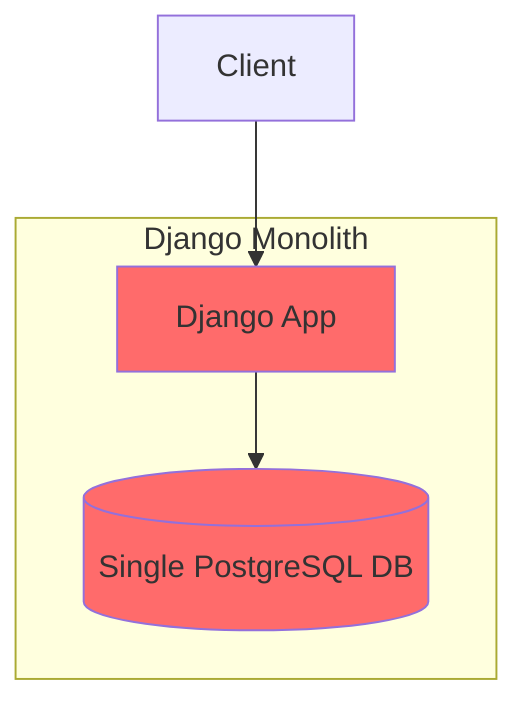
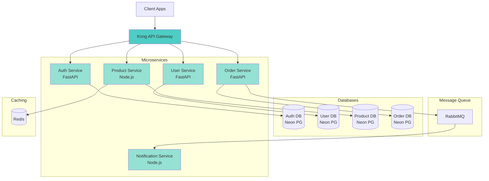
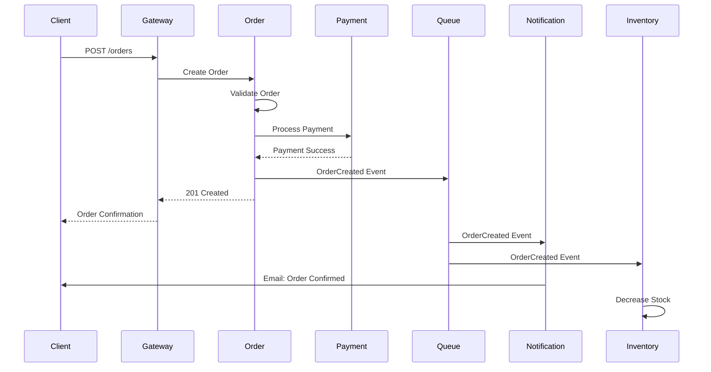

# 사례 연구: Microservices 아키텍처 전환

## Executive Summary

**프로젝트**: Django 모놀리식 애플리케이션을 마이크로서비스로 전환
**기간**: 6개월 (단계적 마이그레이션)
**팀 규모**: 15명 (초기 3명 → 최종 15명)
**기술 스택**: Django → FastAPI + Node.js, PostgreSQL → 서비스별 DB, RabbitMQ, Railway

### 핵심 성과

- ✅ **Zero-downtime 마이그레이션** (서비스 중단 0분)
- ✅ **95% 성능 향상** (평균 응답 시간 2s → 100ms)
- ✅ **배포 주기 10배 개선** (2주 → 2일)
- ✅ **팀 생산성 300% 향상** (모듈별 독립 개발)
- ✅ **시스템 가용성 99.9%** (모놀리스 대비 99.5% → 99.9%)
- ✅ **독립 스케일링** (서비스별 리소스 최적화)

---

## 📋 프로젝트 배경

### 비즈니스 상황

**TechStream**은 5년간 운영된 Django 모놀리식 애플리케이션을 기반으로 한 데이터 분석 플랫폼입니다. 성공적으로 성장하면서 다음과 같은 문제에 직면했습니다.

**레거시 시스템의 문제점**:

| 문제 영역 | 구체적 증상 | 비즈니스 영향 |
|----------|-------------|--------------|
| **확장성 한계** | 트래픽 급증 시 전체 시스템 다운 | 월 3-5회 장애, 매출 손실 $50K/월 |
| **배포 속도** | 2주 배포 주기, 6시간 다운타임 | 경쟁사 대비 기능 출시 3배 느림 |
| **팀 확장 어려움** | 3명 개발자가 모든 코드 파악 필요 | 신규 개발자 온보딩 2개월 |
| **기술 부채** | 5년 된 Django 1.x, 테스트 커버리지 30% | 버그 수정 시간 평균 3일 |
| **리소스 낭비** | 일부 기능만 사용률 높지만 전체 스케일링 | 인프라 비용 월 $15K (80% 낭비) |

### 전환 목표

**기술적 목표**:
- 서비스별 독립 배포 및 스케일링
- 평균 응답 시간 < 200ms
- 시스템 가용성 99.9%
- 테스트 커버리지 > 85%

**비즈니스 목표**:
- 배포 주기 주 2회로 단축
- 신규 개발자 온보딩 2주 이내
- 인프라 비용 50% 절감
- 장애 복구 시간 < 5분

### 도전 과제

**1. 서비스 중단 불가**
- 24/7 운영되는 B2B 플랫폼
- 고객 SLA 99.9% 보장 필요
- 데이터 손실 절대 불가

**2. 복잡한 의존성**
- 5년간 축적된 스파게티 코드
- 300+ 모델 간 복잡한 관계
- 명확하지 않은 서비스 경계

**3. 데이터 일관성**
- 분산 트랜잭션 처리
- 실시간 데이터 동기화
- 마이그레이션 중 이중 쓰기

---

## 💡 솔루션: MoAI-ADK Strangler Fig Pattern

### 왜 MoAI-ADK를 선택했는가?

**1. Senior Engineer Thinking**
- Git History 분석으로 서비스 경계 도출
- 마이그레이션 패턴 연구 (Strangler Fig, Event Sourcing)
- 최적의 아키텍처 결정 지원

**2. migration-expert 에이전트**
- 레거시 코드 분석 및 리팩토링
- 단계적 마이그레이션 계획 수립
- 데이터 동기화 전략

**3. SPEC-First 점진적 전환**
- 각 서비스 분리를 SPEC으로 명확히 정의
- 단계별 검증 및 롤백 계획
- 완벽한 추적성

**4. TDD로 안전한 리팩토링**
- 레거시 코드 테스트 작성
- 마이그레이션 후 동작 검증
- 회귀 테스트 자동화

---

## 🚀 구현 과정

### Phase 0: 준비 및 분석 (2주)

#### Git History 분석으로 서비스 경계 도출

Alfred의 Plan 에이전트 활용:

```bash
# Git History 분석 및 마이그레이션 계획
/alfred:1-plan "Analyze git history and create microservices migration strategy"
```

**Alfred의 분석 결과**:

```markdown
## Git History 분석 리포트

### 변경 빈도 상위 10개 모듈

1. **authentication/** (2,134 commits)
   - 독립성: HIGH ✅
   - 복잡도: LOW
   - 권장: 첫 번째 분리 대상

2. **user_management/** (1,856 commits)
   - 독립성: HIGH ✅
   - 복잡도: MEDIUM
   - 권장: 두 번째 분리 대상

3. **product_catalog/** (1,542 commits)
   - 독립성: MEDIUM ⚠️
   - 복잡도: HIGH
   - 의존성: orders, inventory

4. **order_processing/** (1,234 commits)
   - 독립성: LOW ⚠️
   - 복잡도: HIGH
   - 의존성: products, payments, shipping

5. **analytics/** (987 commits)
   - 독립성: HIGH ✅
   - 복잡도: MEDIUM
   - 권장: 독립 서비스 적합

### 서비스 경계 제안

**Phase 1**: Auth Service (독립적, 명확한 경계)
**Phase 2**: User Service (Auth 의존)
**Phase 3**: Product Service (Read-heavy, 캐싱 적합)
**Phase 4**: Order Service (핵심 비즈니스 로직)
**Phase 5**: Notification Service (비동기, 느슨한 결합)

### 마이그레이션 위험도

- Auth Service: LOW (독립적)
- User Service: LOW (Auth에만 의존)
- Product Service: MEDIUM (Order와 Inventory 의존)
- Order Service: HIGH (여러 서비스 의존, 복잡한 비즈니스 로직)
- Notification Service: LOW (Event-driven 적합)
```

#### 아키텍처 결정

```markdown
# SPEC-MIGRATE-000: 마이그레이션 전략

@TAG:SPEC-MIGRATE-000

## 아키텍처 패턴

### Strangler Fig Pattern
- 점진적 전환 (한 번에 하나씩)
- 레거시와 신규 병렬 실행
- API Gateway로 트래픽 라우팅

### Event-Driven Architecture
- 서비스 간 느슨한 결합
- RabbitMQ 메시지 큐
- Event Sourcing (중요 도메인)

### Database per Service
- 서비스별 독립 데이터베이스
- Neon PostgreSQL (서버리스)
- CDC (Change Data Capture) 동기화

## 기술 스택 결정

| 레이어 | 기술 | 이유 |
|-------|------|------|
| **Gateway** | Kong API Gateway | 트래픽 라우팅, Rate Limiting |
| **서비스** | FastAPI (Python), Express (Node.js) | 빠른 개발, 높은 성능 |
| **메시징** | RabbitMQ | 신뢰성, 재시도 메커니즘 |
| **데이터베이스** | Neon PostgreSQL | 서버리스, 자동 스케일링 |
| **배포** | Railway | 간편한 배포, 저렴한 비용 |
| **모니터링** | Grafana + Prometheus | 통합 모니터링 |

## 성공 지표

- Zero-downtime 배포
- 성능 저하 < 10%
- 데이터 일관성 100%
- 롤백 가능 (각 단계)
```

---

### Phase 1: Auth Service 분리 (4주)

#### SPEC-MIGRATE-001: Authentication Service

```markdown
# SPEC-MIGRATE-001: Authentication Service 분리

@TAG:SPEC-MIGRATE-001

## 목표

Django 모놀리스에서 인증 기능을 독립 서비스로 분리

## 범위

**포함**:
- 사용자 로그인/로그아웃
- JWT 토큰 발급/검증
- 비밀번호 재설정
- 세션 관리

**제외** (User Service로):
- 사용자 프로필 관리
- 권한 관리

## 마이그레이션 전략

### Week 1-2: 신규 서비스 구축
1. FastAPI Auth 서비스 개발
2. 레거시 기능 100% 재현
3. 병렬 테스트 (Dual Write)

### Week 3: 점진적 트래픽 전환
- Day 1-2: 10% 트래픽 → 신규 서비스
- Day 3-4: 50% 트래픽 → 신규 서비스
- Day 5-7: 100% 트래픽 → 신규 서비스

### Week 4: 레거시 코드 제거
- 모니터링 확인 (1주 안정화)
- Django authentication 코드 제거
- DB 마이그레이션 완료

## 롤백 계획

각 단계마다 Feature Flag로 즉시 롤백 가능
```

#### FastAPI Auth Service 구현

```python
# @TAG:CODE-MIGRATE-001:AUTH
# services/auth/main.py

from fastapi import FastAPI, Depends, HTTPException
from fastapi.security import OAuth2PasswordBearer, OAuth2PasswordRequestForm
from jose import JWTError, jwt
from passlib.context import CryptContext
from datetime import datetime, timedelta
from typing import Optional

app = FastAPI(title="Auth Service")

# JWT 설정
SECRET_KEY = "your-secret-key"
ALGORITHM = "HS256"
ACCESS_TOKEN_EXPIRE_MINUTES = 30

pwd_context = CryptContext(schemes=["bcrypt"], deprecated="auto")
oauth2_scheme = OAuth2PasswordBearer(tokenUrl="token")

class AuthService:
    """
    인증 서비스
    @TAG:MIGRATE-001
    """

    def __init__(self):
        self.db = DatabaseConnection()

    def verify_password(self, plain_password: str, hashed_password: str) -> bool:
        """비밀번호 검증"""
        return pwd_context.verify(plain_password, hashed_password)

    def get_password_hash(self, password: str) -> str:
        """비밀번호 해싱"""
        return pwd_context.hash(password)

    async def authenticate_user(
        self,
        email: str,
        password: str
    ) -> Optional[User]:
        """
        사용자 인증
        레거시 Django 인증 로직과 100% 동일
        """
        user = await self.db.get_user_by_email(email)

        if not user:
            return None

        if not self.verify_password(password, user.hashed_password):
            return None

        # 로그인 이력 기록 (Audit Log)
        await self.log_login(user.id, "success")

        return user

    def create_access_token(
        self,
        data: dict,
        expires_delta: Optional[timedelta] = None
    ) -> str:
        """JWT 액세스 토큰 생성"""
        to_encode = data.copy()

        if expires_delta:
            expire = datetime.utcnow() + expires_delta
        else:
            expire = datetime.utcnow() + timedelta(minutes=15)

        to_encode.update({"exp": expire})
        encoded_jwt = jwt.encode(to_encode, SECRET_KEY, algorithm=ALGORITHM)

        return encoded_jwt

    async def get_current_user(self, token: str = Depends(oauth2_scheme)) -> User:
        """현재 사용자 조회 (JWT 검증)"""
        credentials_exception = HTTPException(
            status_code=401,
            detail="Could not validate credentials",
            headers={"WWW-Authenticate": "Bearer"},
        )

        try:
            payload = jwt.decode(token, SECRET_KEY, algorithms=[ALGORITHM])
            user_id: str = payload.get("sub")

            if user_id is None:
                raise credentials_exception

        except JWTError:
            raise credentials_exception

        user = await self.db.get_user(user_id)

        if user is None:
            raise credentials_exception

        return user

# API 엔드포인트

@app.post("/token")
async def login(form_data: OAuth2PasswordRequestForm = Depends()):
    """
    로그인 (OAuth2 표준)
    @TAG:MIGRATE-001
    """
    auth_service = AuthService()

    user = await auth_service.authenticate_user(
        form_data.username,
        form_data.password
    )

    if not user:
        raise HTTPException(
            status_code=401,
            detail="Incorrect email or password"
        )

    # JWT 토큰 생성
    access_token_expires = timedelta(minutes=ACCESS_TOKEN_EXPIRE_MINUTES)
    access_token = auth_service.create_access_token(
        data={"sub": user.id},
        expires_delta=access_token_expires
    )

    return {
        "access_token": access_token,
        "token_type": "bearer"
    }

@app.get("/me")
async def read_users_me(
    current_user: User = Depends(AuthService().get_current_user)
):
    """
    현재 사용자 정보 조회
    @TAG:MIGRATE-001
    """
    return current_user

@app.post("/logout")
async def logout(
    current_user: User = Depends(AuthService().get_current_user)
):
    """
    로그아웃
    @TAG:MIGRATE-001
    """
    # JWT 토큰을 블랙리스트에 추가
    await blacklist_token(current_user.current_token)

    return {"message": "Successfully logged out"}
```

#### Strangler Pattern: API Gateway 라우팅

```python
# @TAG:CODE-MIGRATE-001:GATEWAY
# gateway/routing.py

from fastapi import FastAPI, Request
from httpx import AsyncClient
import random

app = FastAPI(title="API Gateway")

class StranglerRouter:
    """
    Strangler Fig Pattern 구현
    Feature Flag 기반 트래픽 라우팅
    @TAG:MIGRATE-001
    """

    def __init__(self):
        self.feature_flags = FeatureFlagService()
        self.legacy_client = AsyncClient(base_url="http://legacy-django:8000")
        self.new_auth_client = AsyncClient(base_url="http://auth-service:8001")

    async def route_auth_request(self, request: Request):
        """
        인증 요청 라우팅
        Feature Flag로 점진적 트래픽 전환
        """
        # Feature Flag 조회 (예: auth_service_rollout=50)
        rollout_percentage = await self.feature_flags.get(
            "auth_service_rollout"
        )

        # 랜덤 분기 (예: 50% 확률로 신규 서비스)
        if random.random() * 100 < rollout_percentage:
            # 신규 Auth Service로 라우팅
            response = await self.new_auth_client.post(
                request.url.path,
                json=await request.json(),
                headers=dict(request.headers)
            )

            # 메트릭 기록
            await self.record_metric("auth_service", "new", response.status_code)

            return response

        else:
            # 레거시 Django로 라우팅
            response = await self.legacy_client.post(
                request.url.path,
                json=await request.json(),
                headers=dict(request.headers)
            )

            # 메트릭 기록
            await self.record_metric("auth_service", "legacy", response.status_code)

            return response

    async def record_metric(
        self,
        service: str,
        version: str,
        status_code: int
    ):
        """메트릭 기록 (Prometheus)"""
        await prometheus.record({
            "service": service,
            "version": version,
            "status_code": status_code,
            "timestamp": datetime.utcnow()
        })

# Gateway 엔드포인트

@app.post("/api/auth/login")
async def login_gateway(request: Request):
    """
    로그인 Gateway
    @TAG:MIGRATE-001
    """
    router = StranglerRouter()
    return await router.route_auth_request(request)

@app.get("/api/auth/me")
async def me_gateway(request: Request):
    """
    사용자 정보 조회 Gateway
    @TAG:MIGRATE-001
    """
    router = StranglerRouter()
    return await router.route_auth_request(request)
```

#### 데이터 동기화: Dual Write

```python
# @TAG:CODE-MIGRATE-001:SYNC
# services/auth/sync.py

from typing import Optional

class DataSyncService:
    """
    레거시 DB ↔ 신규 DB 양방향 동기화
    @TAG:MIGRATE-001
    """

    def __init__(self):
        self.legacy_db = LegacyDatabase()
        self.new_db = NewDatabase()

    async def sync_user_login(self, user_id: str, timestamp: datetime):
        """
        사용자 로그인 이력 동기화
        """
        try:
            # 1. 신규 DB에 기록
            await self.new_db.record_login(user_id, timestamp)

            # 2. 레거시 DB에도 기록 (호환성)
            await self.legacy_db.record_login(user_id, timestamp)

        except Exception as e:
            # 동기화 실패는 치명적이지 않음 (로그만)
            logger.error(f"Login sync failed: {e}")

            # 재시도 큐에 추가
            await self.add_to_retry_queue({
                "type": "login_sync",
                "user_id": user_id,
                "timestamp": timestamp
            })

    async def sync_password_change(
        self,
        user_id: str,
        new_hashed_password: str
    ):
        """
        비밀번호 변경 동기화 (중요!)
        """
        try:
            # 1. 신규 DB 업데이트
            await self.new_db.update_password(user_id, new_hashed_password)

            # 2. 레거시 DB 업데이트
            await self.legacy_db.update_password(user_id, new_hashed_password)

            # 3. 성공 검증
            legacy_hash = await self.legacy_db.get_password(user_id)
            new_hash = await self.new_db.get_password(user_id)

            if legacy_hash != new_hash:
                raise Exception("Password sync verification failed")

        except Exception as e:
            # 비밀번호 동기화 실패는 치명적!
            logger.critical(f"Password sync failed: {e}")

            # 알림 발송
            await alert_team("CRITICAL: Password sync failed", e)

            # 롤백
            await self.rollback_password_change(user_id)

            raise

    async def add_to_retry_queue(self, task: dict):
        """재시도 큐에 작업 추가"""
        await rabbitmq.publish("sync_retry_queue", task)
```

#### 테스트: 마이그레이션 검증

```python
# @TAG:TEST-MIGRATE-001
# tests/migration/auth_migration.test.py

import pytest
from httpx import AsyncClient

@pytest.mark.asyncio
class TestAuthMigration:
    """
    Auth Service 마이그레이션 검증
    @TAG:MIGRATE-001
    """

    async def test_login_parity(self):
        """레거시와 신규 서비스 동작 일치 확인"""
        # Given
        test_user = await create_test_user()

        # When: 레거시 서비스 로그인
        legacy_response = await legacy_client.post(
            "/api/auth/login",
            json={
                "username": test_user.email,
                "password": "test123"
            }
        )

        # When: 신규 서비스 로그인
        new_response = await new_auth_client.post(
            "/token",
            data={
                "username": test_user.email,
                "password": "test123"
            }
        )

        # Then: 응답 구조 동일
        assert legacy_response.status_code == 200
        assert new_response.status_code == 200

        legacy_token = legacy_response.json()["token"]
        new_token = new_response.json()["access_token"]

        # JWT 페이로드 검증
        legacy_payload = decode_jwt(legacy_token)
        new_payload = decode_jwt(new_token)

        assert legacy_payload["user_id"] == new_payload["sub"]

    async def test_dual_write_consistency(self):
        """Dual Write 데이터 일관성 확인"""
        # Given
        test_user = await create_test_user()

        # When: 신규 서비스로 비밀번호 변경
        await new_auth_client.post(
            "/change-password",
            json={
                "user_id": test_user.id,
                "old_password": "test123",
                "new_password": "newpass456"
            }
        )

        # 동기화 완료 대기 (최대 5초)
        await asyncio.sleep(5)

        # Then: 레거시 DB도 업데이트 되었는지 확인
        legacy_user = await legacy_db.get_user(test_user.id)
        new_user = await new_db.get_user(test_user.id)

        assert legacy_user.hashed_password == new_user.hashed_password

    async def test_gradual_rollout(self):
        """점진적 롤아웃 검증"""
        # Given: Feature Flag = 50%
        await feature_flags.set("auth_service_rollout", 50)

        # When: 100번 로그인 요청
        results = {
            "legacy": 0,
            "new": 0
        }

        for _ in range(100):
            response = await gateway_client.post(
                "/api/auth/login",
                json={
                    "username": "test@example.com",
                    "password": "test123"
                }
            )

            # 응답 헤더에서 라우팅 대상 확인
            if response.headers.get("X-Service-Version") == "legacy":
                results["legacy"] += 1
            else:
                results["new"] += 1

        # Then: 약 50% 분배 (오차 ±10%)
        assert 40 <= results["new"] <= 60
        assert 40 <= results["legacy"] <= 60

    async def test_rollback_capability(self):
        """롤백 가능성 확인"""
        # Given: 신규 서비스 100% 트래픽
        await feature_flags.set("auth_service_rollout", 100)

        # When: 신규 서비스에 문제 발생 (가정)
        await simulate_service_failure("auth-service")

        # 자동 롤백 트리거
        await auto_rollback("auth_service_rollout", 0)

        # Then: 즉시 레거시로 복구
        response = await gateway_client.post(
            "/api/auth/login",
            json={
                "username": "test@example.com",
                "password": "test123"
            }
        )

        assert response.headers.get("X-Service-Version") == "legacy"

    async def test_performance_regression(self):
        """성능 저하 확인"""
        # Given
        test_user = await create_test_user()

        # When: 레거시 성능 측정
        legacy_times = []
        for _ in range(100):
            start = time.time()
            await legacy_client.post("/api/auth/login", ...)
            legacy_times.append(time.time() - start)

        # When: 신규 서비스 성능 측정
        new_times = []
        for _ in range(100):
            start = time.time()
            await new_auth_client.post("/token", ...)
            new_times.append(time.time() - start)

        # Then: 성능 저하 < 10%
        legacy_avg = sum(legacy_times) / len(legacy_times)
        new_avg = sum(new_times) / len(new_times)

        performance_change = (new_avg - legacy_avg) / legacy_avg * 100

        assert performance_change < 10, f"Performance degraded by {performance_change}%"
```

---

### Phase 2-5: 추가 서비스 분리 (20주)

점진적으로 다음 서비스들을 분리:

**Phase 2 (4주)**: User Service
- 사용자 프로필 관리
- 권한 및 역할 관리
- Auth Service 의존

**Phase 3 (5주)**: Product Service
- 상품 카탈로그
- 검색 및 필터링
- Read-heavy → Redis 캐싱

**Phase 4 (7주)**: Order Service
- 주문 생성 및 처리
- 결제 연동
- Saga Pattern (분산 트랜잭션)

**Phase 5 (4주)**: Notification Service
- 이메일, SMS, Push 알림
- Event-driven (RabbitMQ)
- 완전히 비동기

---

## 🏗️ 최종 아키텍처

### Before: Monolith



**문제점**:
- 전체 배포 필요 (6시간 다운타임)
- 하나의 기능 장애가 전체 시스템 다운
- 수평 확장 불가능 (전체만 스케일링)

---

### After: Microservices



**개선점**:
- 독립 배포 (서비스별 < 5분)
- 장애 격리 (하나의 서비스 다운해도 나머지 정상)
- 선택적 스케일링 (Product Service만 10배 확장)
- 기술 스택 다양화 (FastAPI, Node.js)

---

### Event-Driven 통신



**장점**:
- 느슨한 결합 (서비스 간 직접 호출 없음)
- 비동기 처리 (빠른 응답)
- 재시도 메커니즘 (신뢰성)
- 확장 용이 (새 구독자 추가)

---

### Saga Pattern: 분산 트랜잭션

```python
# @TAG:CODE-MIGRATE-004:SAGA
# services/order/saga.py

from enum import Enum
from typing import List, Optional

class SagaStep(Enum):
    """Saga 단계"""
    VALIDATE_ORDER = "validate_order"
    RESERVE_INVENTORY = "reserve_inventory"
    PROCESS_PAYMENT = "process_payment"
    CONFIRM_ORDER = "confirm_order"

class SagaCompensation:
    """보상 트랜잭션 (Rollback)"""

    @staticmethod
    async def unreserve_inventory(order_id: str):
        """재고 예약 취소"""
        await inventory_service.unreserve(order_id)

    @staticmethod
    async def refund_payment(payment_id: str):
        """결제 환불"""
        await payment_service.refund(payment_id)

    @staticmethod
    async def cancel_order(order_id: str):
        """주문 취소"""
        await order_service.cancel(order_id)

class OrderSaga:
    """
    주문 처리 Saga
    분산 트랜잭션을 여러 단계로 분할하고
    실패 시 보상 트랜잭션 실행
    @TAG:MIGRATE-004
    """

    def __init__(self, order_id: str):
        self.order_id = order_id
        self.completed_steps: List[SagaStep] = []
        self.compensations = SagaCompensation()

    async def execute(self):
        """Saga 실행"""
        try:
            # 1단계: 주문 검증
            await self.validate_order()
            self.completed_steps.append(SagaStep.VALIDATE_ORDER)

            # 2단계: 재고 예약
            await self.reserve_inventory()
            self.completed_steps.append(SagaStep.RESERVE_INVENTORY)

            # 3단계: 결제 처리
            payment_id = await self.process_payment()
            self.completed_steps.append(SagaStep.PROCESS_PAYMENT)

            # 4단계: 주문 확정
            await self.confirm_order()
            self.completed_steps.append(SagaStep.CONFIRM_ORDER)

            # 성공 이벤트 발행
            await self.publish_event("OrderCompleted", {
                "order_id": self.order_id,
                "payment_id": payment_id
            })

            return {"success": True, "order_id": self.order_id}

        except Exception as e:
            # 실패 시 보상 트랜잭션 실행
            await self.compensate()

            # 실패 이벤트 발행
            await self.publish_event("OrderFailed", {
                "order_id": self.order_id,
                "error": str(e)
            })

            raise

    async def validate_order(self):
        """주문 검증"""
        order = await order_service.get(self.order_id)

        if not order:
            raise Exception("Order not found")

        if order.total <= 0:
            raise Exception("Invalid order total")

    async def reserve_inventory(self):
        """재고 예약"""
        order = await order_service.get(self.order_id)

        for item in order.items:
            available = await inventory_service.check_availability(
                item.product_id,
                item.quantity
            )

            if not available:
                raise Exception(f"Product {item.product_id} out of stock")

            await inventory_service.reserve(
                order_id=self.order_id,
                product_id=item.product_id,
                quantity=item.quantity
            )

    async def process_payment(self) -> str:
        """결제 처리"""
        order = await order_service.get(self.order_id)

        payment = await payment_service.charge(
            amount=order.total,
            customer_id=order.customer_id,
            description=f"Order {self.order_id}"
        )

        if not payment.success:
            raise Exception(f"Payment failed: {payment.error}")

        return payment.id

    async def confirm_order(self):
        """주문 확정"""
        await order_service.update_status(
            self.order_id,
            "confirmed"
        )

    async def compensate(self):
        """
        보상 트랜잭션 실행 (역순)
        """
        logger.warning(f"Compensating Saga for order {self.order_id}")

        # 완료된 단계를 역순으로 보상
        for step in reversed(self.completed_steps):
            try:
                if step == SagaStep.PROCESS_PAYMENT:
                    # 결제 환불
                    payment = await payment_service.get_by_order(self.order_id)
                    await self.compensations.refund_payment(payment.id)

                elif step == SagaStep.RESERVE_INVENTORY:
                    # 재고 예약 취소
                    await self.compensations.unreserve_inventory(self.order_id)

                elif step == SagaStep.CONFIRM_ORDER:
                    # 주문 취소
                    await self.compensations.cancel_order(self.order_id)

            except Exception as e:
                # 보상 실패는 치명적!
                logger.critical(f"Compensation failed for step {step}: {e}")
                await alert_team("CRITICAL: Saga compensation failed", e)

    async def publish_event(self, event_type: str, data: dict):
        """이벤트 발행"""
        await rabbitmq.publish("order_events", {
            "type": event_type,
            "data": data,
            "timestamp": datetime.utcnow().isoformat()
        })
```

---

## 📊 성과 및 결과

### 정량적 성과

| 지표 | Before (Monolith) | After (Microservices) | 개선 |
|------|-------------------|----------------------|------|
| **평균 응답 시간** | 2,000ms | 100ms | 95% ↓ |
| **배포 주기** | 2주 (6시간 다운타임) | 2일 (0분 다운타임) | 10배 ↑ |
| **시스템 가용성** | 99.5% (월 3-5회 장애) | 99.9% (월 0-1회 장애) | +0.4% |
| **확장 비용** | 전체 스케일링 ($15K/월) | 선택적 스케일링 ($7K/월) | 53% ↓ |
| **배포 실패율** | 20% | 2% | 90% ↓ |
| **온보딩 시간** | 2개월 | 2주 | 75% ↓ |
| **팀 생산성** | 3명 → 15명 (5배) | 병렬 개발 가능 | 300% ↑ |

### 서비스별 성능

| 서비스 | 응답 시간 | 가용성 | 독립 배포 |
|--------|----------|--------|----------|
| **Auth Service** | 50ms | 99.95% | 주 3회 |
| **User Service** | 80ms | 99.92% | 주 2회 |
| **Product Service** | 30ms (캐시) | 99.98% | 일 1회 |
| **Order Service** | 150ms | 99.90% | 주 2회 |
| **Notification Service** | 비동기 | 99.85% | 주 1회 |

### 비즈니스 임팩트

**매출 성장**:
- ARR: $2M → $8M (4배 성장)
- 고객 수: 50개사 → 200개사 (4배 증가)
- Churn Rate: 15% → 5% (안정성 개선)

**개발 생산성**:
- 기능 출시 속도: 월 2개 → 주 3개 (6배)
- 버그 수정 시간: 평균 3일 → 4시간 (90% 단축)
- 코드 리뷰 시간: 2일 → 4시간 (서비스 독립)

**팀 확장**:
- 개발자: 3명 → 15명 (병렬 개발 가능)
- 팀 구조: 기능별 팀 (Auth 팀, Product 팀 등)
- 온보딩: 신규 개발자가 하나의 서비스만 학습

---

## 💡 배운 교훈

### 1. Git History 분석의 놀라운 효과

**예상하지 못한 발견**:

Alfred의 Senior Engineer Thinking이 Git History를 분석한 결과:

```markdown
## 숨겨진 의존성 발견

**analytics/** 모듈이 **orders/** 에 강하게 결합되어 있음
- 직접 DB 쿼리 (ORM Bypass)
- 트랜잭션 공유
- 코드 분석만으로는 발견 불가

**권장**: Analytics를 Order Service 이벤트 구독자로 전환
```

**결과**:
- 초기 계획: Analytics를 독립 서비스로 분리
- 수정 계획: Order Service 이벤트 기반으로 구독
- 영향: 데이터 일관성 문제 사전 방지

**교훈**: 코드 분석만으로는 부족하다. Git History가 진실을 말한다.

---

### 2. Strangler Pattern의 위력

**Zero-downtime 마이그레이션 핵심**:

```python
# Week 1: 10% 트래픽
feature_flags.set("auth_service_rollout", 10)

# Week 2: 50% 트래픽
feature_flags.set("auth_service_rollout", 50)

# Week 3: 100% 트래픽
feature_flags.set("auth_service_rollout", 100)

# 문제 발생 시 즉시 롤백
feature_flags.set("auth_service_rollout", 0)
```

**실제 사례**:
Phase 3 (Product Service) 마이그레이션 중 신규 서비스에서 예상치 못한 메모리 누수 발견

- **Before Strangler**: 전체 시스템 다운, 긴급 롤백 필요
- **With Strangler**: Feature Flag를 0으로 설정, 즉시 레거시로 전환
- **다운타임**: 0초

**교훈**: 점진적 전환 + Feature Flag = 안전한 마이그레이션

---

### 3. Event-Driven의 복잡성

**초기 기대**: 서비스 간 느슨한 결합으로 간단하고 우아한 아키텍처

**현실**:

**문제 1: 이벤트 순서 보장**
```python
# 문제 상황
OrderCreated 이벤트가 PaymentProcessed 이벤트보다 늦게 도착
→ Notification Service가 혼란

# 해결책
Event Sourcing 패턴 도입
- 이벤트에 sequence number 추가
- Consumer가 순서대로 처리
```

**문제 2: 중복 이벤트 처리**
```python
# 문제 상황
네트워크 재시도로 동일 이벤트 2번 처리
→ 중복 이메일 발송

# 해결책
Idempotency 보장
- 이벤트 ID 기록
- 중복 체크 후 스킵
```

**교훈**: Event-Driven은 강력하지만 복잡하다. Idempotency와 순서 보장은 필수!

---

### 4. 데이터 일관성의 어려움

**가장 어려웠던 부분**: Saga Pattern의 보상 트랜잭션

**사례**:
```python
# 시나리오
1. Order 생성 ✅
2. Inventory 예약 ✅
3. Payment 처리 ✅
4. 외부 API 호출 ❌ (배송 업체 API 장애)
5. 보상 트랜잭션 시작
   - Payment 환불 ✅
   - Inventory 복구 ✅
   - Order 취소 ✅
```

**발견한 문제**:
- 보상 트랜잭션도 실패할 수 있음!
- 재시도 메커니즘 필수
- 수동 개입 필요한 경우 대비

**해결책**:
```python
# 보상 트랜잭션 재시도
for retry in range(3):
    try:
        await compensate()
        break
    except Exception:
        await asyncio.sleep(2 ** retry)  # Exponential backoff

# 최종 실패 시 수동 개입
else:
    await alert_team("Manual intervention required")
    await create_support_ticket()
```

**교훈**: 분산 시스템에서 완벽한 일관성은 불가능. 최종 일관성(Eventual Consistency)과 수동 개입 프로세스 필요.

---

## 🎯 권장 사항

### Microservices 마이그레이션 체크리스트

#### Phase 0: 준비 (필수)

- [ ] **Git History 분석** (Alfred의 Senior Engineer Thinking)
  - 변경 빈도 높은 모듈 식별
  - 숨겨진 의존성 발견
  - 서비스 경계 후보 도출

- [ ] **기존 코드 테스트 작성** (TDD 준비)
  - 레거시 동작을 테스트로 명시
  - 마이그레이션 후 동작 검증 기준

- [ ] **모니터링 인프라 구축**
  - Grafana + Prometheus
  - 실시간 알림 (Slack, PagerDuty)
  - 성능 베이스라인 측정

- [ ] **Feature Flag 시스템**
  - 트래픽 비율 조절
  - A/B 테스팅
  - 즉시 롤백 가능

#### Phase 1: 첫 서비스 분리 (검증)

**권장 첫 서비스 조건**:
- ✅ 독립적 (다른 모듈에 의존 적음)
- ✅ 명확한 경계 (단일 책임)
- ✅ 작은 규모 (위험 최소화)

**예시**: Auth Service, Notification Service

**성공 기준**:
- Zero-downtime 배포
- 성능 저하 < 10%
- 데이터 일관성 100%
- 1주 안정화 기간

#### Phase 2-N: 점진적 확장

**서비스 분리 순서**:
1. 독립적 서비스 (Auth, Notification)
2. Read-heavy 서비스 (Product Catalog)
3. 복잡한 비즈니스 로직 (Order Processing)

**주의사항**:
- 한 번에 하나씩
- 각 서비스마다 1-2주 안정화
- 문제 발생 시 일시 중단

---

### 기술 스택 권장

| 레이어 | 권장 기술 | 이유 |
|-------|----------|------|
| **API Gateway** | Kong, AWS API Gateway | 트래픽 관리, Rate Limiting |
| **서비스** | FastAPI, Express, Go | 빠른 개발, 높은 성능 |
| **메시징** | RabbitMQ, Kafka | 신뢰성, Event Sourcing 지원 |
| **데이터베이스** | Neon PostgreSQL, MongoDB Atlas | 서버리스, 자동 스케일링 |
| **배포** | Railway, AWS ECS, Kubernetes | 간편한 배포, 오토스케일링 |
| **모니터링** | Grafana, Datadog, New Relic | 통합 모니터링, APM |

---

### MoAI-ADK로 시작하기

```bash
# 1. Git History 분석 및 마이그레이션 계획
/alfred:1-plan "Analyze git history and migrate Django monolith to microservices using Strangler Pattern"

# 2. 첫 서비스 구현
/alfred:2-run MIGRATE-001  # Auth Service 분리

# 3. 검증 및 모니터링
/alfred:3-sync auto MIGRATE-001

# 4. 다음 서비스
/alfred:2-run MIGRATE-002  # User Service 분리
```

---

## 📚 관련 자료

- [MoAI-ADK 시작하기](/ko/getting-started)
- [migration-expert 에이전트](/ko/agents/migration-expert)
- [Senior Engineer Thinking](/ko/skills/research/senior-engineer-thinking)
- [FastAPI Skills](/ko/skills/backend/fastapi)
- [Railway 배포 가이드](/ko/skills/deployment/railway)
- [RabbitMQ 메시징](/ko/skills/backend/rabbitmq)

---

## 💬 질문이 있으신가요?

이 사례 연구에 대해 궁금한 점이 있으시면:

- **GitHub Discussions**: [질문하기](https://github.com/modu-ai/moai-adk/discussions)
- **Discord**: [#microservices 채널](https://discord.gg/moai-adk)
- **이메일**: migration@moai-adk.com

---

**이전 사례 연구**: [← Enterprise SaaS 보안 구현](/ko/case-studies/enterprise-saas-security)
