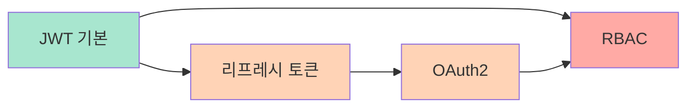
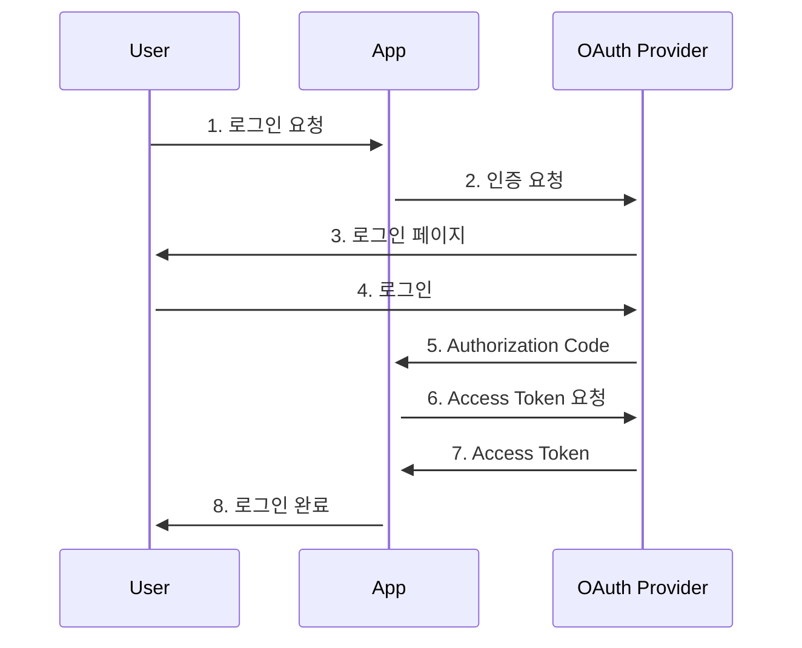

# 인증 예제

FastAPI를 사용한 다양한 인증/인가 시스템 구현 예제입니다.

## 📚 예제 목록

### [JWT 토큰 생성](/ko/examples/authentication/jwt-basic)
**난이도**: 초급 | **태그**: `jwt`, `auth`, `fastapi`

JSON Web Token을 사용한 기본 인증 시스템을 구현합니다.

**배울 내용**:
- JWT 토큰 생성 및 검증
- 로그인/로그아웃
- 보호된 엔드포인트
- 비밀번호 해싱

---

### [리프레시 토큰](/ko/examples/authentication/refresh-tokens)
**난이도**: 중급 | **태그**: `jwt`, `refresh-token`, `security`

장기 세션 관리를 위한 리프레시 토큰 시스템을 구현합니다.

**배울 내용**:
- Access Token / Refresh Token 분리
- 토큰 갱신 메커니즘
- 토큰 블랙리스트
- 보안 강화

---

### [OAuth2 인증](/ko/examples/authentication/oauth2)
**난이도**: 중급 | **태그**: `oauth2`, `social-login`, `google`

Google, GitHub 등 소셜 로그인을 구현합니다.

**배울 내용**:
- OAuth2 플로우
- 소셜 로그인 통합
- 사용자 프로필 연동
- 다중 인증 제공자

---

### [역할 기반 접근 제어](/ko/examples/authentication/rbac)
**난이도**: 고급 | **태그**: `rbac`, `permissions`, `authorization`

Role-Based Access Control (RBAC) 시스템을 구현합니다.

**배울 내용**:
- 역할(Role) 정의
- 권한(Permission) 관리
- 데코레이터 기반 권한 체크
- 리소스 소유권 검증

---

## 🎯 학습 경로



1. **JWT 기본 인증** (필수) - 인증의 기초
2. **리프레시 토큰** (권장) - 장기 세션 관리
3. **OAuth2 인증** (선택) - 소셜 로그인
4. **RBAC** (고급) - 세밀한 권한 관리

## 💡 빠른 시작

```bash
# 의존성 설치
uv pip install fastapi python-jose[cryptography] passlib[bcrypt] python-multipart

# JWT 예제 실행
uvicorn examples.auth.jwt_basic:app --reload
```

## 🔑 핵심 개념

### JWT (JSON Web Token)
```python
# 토큰 생성
token = jwt.encode({"sub": user.id}, SECRET_KEY, algorithm="HS256")

# 토큰 검증
payload = jwt.decode(token, SECRET_KEY, algorithms=["HS256"])
```

### OAuth2 플로우


## 📖 관련 문서

- [Tutorial 02: JWT 인증 시스템](/ko/tutorials/tutorial-02-jwt-auth)
- [보안 예제](/ko/examples/security/)
- [REST API 예제](/ko/examples/rest-api/)

## 🎓 Best Practices

### 보안
- ✅ HTTPS 사용 필수
- ✅ SECRET_KEY는 환경 변수로
- ✅ 비밀번호 해싱 (bcrypt, argon2)
- ✅ 짧은 토큰 만료 시간
- ✅ CORS 설정

### 토큰 관리
- ✅ Access Token: 15-30분
- ✅ Refresh Token: 7-30일
- ✅ 토큰 블랙리스트
- ✅ 로그아웃 시 토큰 무효화

---

**시작하기**: [JWT 기본 인증](/ko/examples/authentication/jwt-basic) 예제부터 시작하세요!
