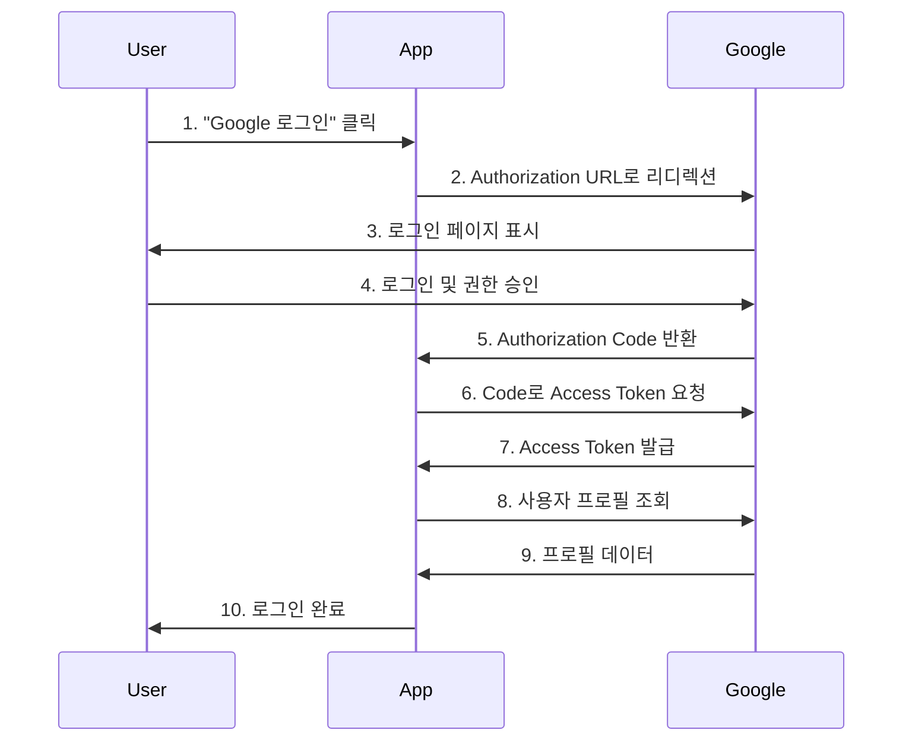

# OAuth2 인증

## 개요

Google, GitHub 등 외부 OAuth2 제공자를 통한 소셜 로그인을 구현합니다.

## 사용 사례

- 소셜 로그인 (Google, GitHub, Facebook)
- 간편 회원가입
- 다중 인증 제공자 지원

## OAuth2 플로우



## 핵심 코드

```python
# SPEC: AUTH-020 - OAuth2 소셜 로그인

from fastapi import FastAPI
from authlib.integrations.starlette_client import OAuth

app = FastAPI()

# OAuth 설정
oauth = OAuth()
oauth.register(
    name='google',
    client_id='YOUR_CLIENT_ID',
    client_secret='YOUR_CLIENT_SECRET',
    server_metadata_url='https://accounts.google.com/.well-known/openid-configuration',
    client_kwargs={'scope': 'openid email profile'}
)

@app.get('/auth/google/login')
async def google_login(request: Request):
    """Google 로그인 시작"""
    redirect_uri = request.url_for('google_callback')
    return await oauth.google.authorize_redirect(request, redirect_uri)

@app.get('/auth/google/callback')
async def google_callback(request: Request):
    """Google 콜백 처리"""
    token = await oauth.google.authorize_access_token(request)
    user_info = token.get('userinfo')

    # 사용자 정보로 로그인 또는 회원가입 처리
    # ...

    return {"email": user_info['email']}
```

## 설정 방법

### 1. Google OAuth 설정

1. [Google Cloud Console](https://console.cloud.google.com/) 접속
2. 프로젝트 생성
3. OAuth 동의 화면 설정
4. 사용자 인증 정보 → OAuth 2.0 클라이언트 ID 생성
5. 승인된 리디렉션 URI 추가: `http://localhost:8000/auth/google/callback`

### 2. 환경 변수 설정

```bash
GOOGLE_CLIENT_ID=your-client-id.apps.googleusercontent.com
GOOGLE_CLIENT_SECRET=your-client-secret
```

## 관련 예제

- [JWT 기본 인증](/ko/examples/authentication/jwt-basic)
- [리프레시 토큰](/ko/examples/authentication/refresh-tokens)
