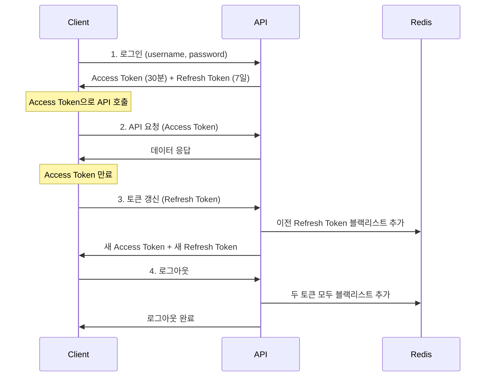

# 리프레시 토큰

## 개요

Access Token과 Refresh Token을 분리하여 장기 세션을 안전하게 관리하는 방법을 구현합니다.

## 사용 사례

- 장기 로그인 유지 ("로그인 상태 유지" 옵션)
- 모바일 앱 인증
- 보안을 유지하면서 사용자 편의성 향상

## 핵심 개념

### 토큰 구조

```
Access Token: 짧은 만료 시간 (15-30분)
└─ API 요청에 사용
└─ 만료 시 Refresh Token으로 갱신

Refresh Token: 긴 만료 시간 (7-30일)
└─ Access Token 갱신에만 사용
└─ 안전하게 저장 (HttpOnly Cookie 또는 Secure Storage)
```

## 완전한 코드 예제

```python
# SPEC: AUTH-010 - 리프레시 토큰 구현
# @TAG:AUTH-010

from datetime import datetime, timedelta
from typing import Optional
from jose import JWTError, jwt
from fastapi import FastAPI, Depends, HTTPException, status
from pydantic import BaseModel
import redis

app = FastAPI()

# Redis 연결 (토큰 블랙리스트)
redis_client = redis.Redis(host='localhost', port=6379, db=0, decode_responses=True)

# 설정
SECRET_KEY = "your-secret-key"
ALGORITHM = "HS256"
ACCESS_TOKEN_EXPIRE_MINUTES = 30
REFRESH_TOKEN_EXPIRE_DAYS = 7

class TokenPair(BaseModel):
    """토큰 쌍"""
    access_token: str
    refresh_token: str
    token_type: str = "bearer"

def create_access_token(data: dict) -> str:
    """액세스 토큰 생성 (짧은 만료 시간)"""
    to_encode = data.copy()
    expire = datetime.utcnow() + timedelta(minutes=ACCESS_TOKEN_EXPIRE_MINUTES)
    to_encode.update({"exp": expire, "type": "access"})
    return jwt.encode(to_encode, SECRET_KEY, algorithm=ALGORITHM)

def create_refresh_token(data: dict) -> str:
    """리프레시 토큰 생성 (긴 만료 시간)"""
    to_encode = data.copy()
    expire = datetime.utcnow() + timedelta(days=REFRESH_TOKEN_EXPIRE_DAYS)
    to_encode.update({"exp": expire, "type": "refresh"})
    return jwt.encode(to_encode, SECRET_KEY, algorithm=ALGORITHM)

def is_token_blacklisted(token: str) -> bool:
    """토큰 블랙리스트 확인"""
    return redis_client.exists(f"blacklist:{token}") > 0

def blacklist_token(token: str, expire_seconds: int):
    """토큰을 블랙리스트에 추가"""
    redis_client.setex(f"blacklist:{token}", expire_seconds, "1")

@app.post("/auth/login", response_model=TokenPair)
def login(username: str, password: str):
    """로그인 - Access & Refresh Token 발급"""
    # 사용자 인증 (생략)
    user_id = 1

    # 토큰 쌍 생성
    access_token = create_access_token({"sub": user_id})
    refresh_token = create_refresh_token({"sub": user_id})

    return TokenPair(
        access_token=access_token,
        refresh_token=refresh_token
    )

@app.post("/auth/refresh", response_model=TokenPair)
def refresh_tokens(refresh_token: str):
    """Refresh Token으로 새 토큰 발급"""
    # 블랙리스트 확인
    if is_token_blacklisted(refresh_token):
        raise HTTPException(
            status_code=status.HTTP_401_UNAUTHORIZED,
            detail="토큰이 무효화되었습니다"
        )

    try:
        # Refresh Token 검증
        payload = jwt.decode(refresh_token, SECRET_KEY, algorithms=[ALGORITHM])

        if payload.get("type") != "refresh":
            raise HTTPException(
                status_code=status.HTTP_401_UNAUTHORIZED,
                detail="Refresh Token이 아닙니다"
            )

        user_id = payload.get("sub")

        # 새 토큰 쌍 생성
        new_access_token = create_access_token({"sub": user_id})
        new_refresh_token = create_refresh_token({"sub": user_id})

        # 이전 Refresh Token 블랙리스트 추가
        remaining_time = payload.get("exp") - datetime.utcnow().timestamp()
        blacklist_token(refresh_token, int(remaining_time))

        return TokenPair(
            access_token=new_access_token,
            refresh_token=new_refresh_token
        )

    except JWTError:
        raise HTTPException(
            status_code=status.HTTP_401_UNAUTHORIZED,
            detail="유효하지 않은 토큰입니다"
        )

@app.post("/auth/logout")
def logout(access_token: str, refresh_token: str):
    """로그아웃 - 토큰 무효화"""
    # 두 토큰 모두 블랙리스트에 추가
    try:
        access_payload = jwt.decode(access_token, SECRET_KEY, algorithms=[ALGORITHM])
        refresh_payload = jwt.decode(refresh_token, SECRET_KEY, algorithms=[ALGORITHM])

        access_remaining = access_payload.get("exp") - datetime.utcnow().timestamp()
        refresh_remaining = refresh_payload.get("exp") - datetime.utcnow().timestamp()

        blacklist_token(access_token, int(access_remaining))
        blacklist_token(refresh_token, int(refresh_remaining))

        return {"message": "로그아웃 완료"}

    except JWTError:
        raise HTTPException(
            status_code=status.HTTP_401_UNAUTHORIZED,
            detail="유효하지 않은 토큰입니다"
        )
```

## 사용 흐름



## Best Practices

### 보안
- ✅ **Refresh Token은 HttpOnly Cookie로 전송**
- ✅ **Refresh Token 재사용 방지**: 한 번 사용 후 새 토큰 발급
- ✅ **블랙리스트 관리**: Redis로 무효화된 토큰 추적
- ✅ **짧은 Access Token**: 15-30분
- ✅ **Refresh Token Rotation**: 매번 새 토큰 발급

### 사용자 경험
- ✅ **자동 토큰 갱신**: 클라이언트에서 만료 전 자동 갱신
- ✅ **Silent Refresh**: 사용자가 인지하지 못하게 백그라운드 갱신
- ✅ **로그아웃 시 즉시 무효화**

## 관련 예제

- [JWT 기본 인증](/ko/examples/authentication/jwt-basic)
- [OAuth2 인증](/ko/examples/authentication/oauth2)
- [Redis 캐싱](/ko/examples/performance/caching)

## 참고 자료

- [RFC 6749 - OAuth 2.0](https://tools.ietf.org/html/rfc6749)
- [JWT Best Practices](https://tools.ietf.org/html/rfc8725)
