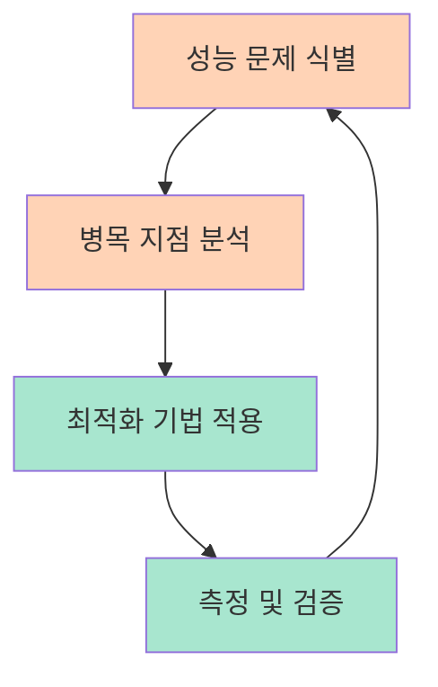

# 성능 예제

애플리케이션 성능을 최적화하는 다양한 기법들을 다룹니다.

## 📚 예제 목록

### [Redis 캐싱](/ko/examples/performance/caching)
**난이도**: 중급 | **태그**: `redis`, `caching`, `performance`

Redis를 사용한 데이터 캐싱으로 응답 속도 향상

### [커넥션 풀링](/ko/examples/performance/connection-pooling)
**난이도**: 초급 | **태그**: `database`, `pooling`, `optimization`

데이터베이스 커넥션 재사용으로 리소스 효율화

### [지연 로딩](/ko/examples/performance/lazy-loading)
**난이도**: 중급 | **태그**: `sqlalchemy`, `lazy-loading`, `n+1`

필요한 시점에 데이터를 로드하여 메모리 최적화

### [배치 처리](/ko/examples/performance/batch-processing)
**난이도**: 고급 | **태그**: `batch`, `async`, `celery`

대량 데이터를 효율적으로 처리하는 배치 작업

---

## 🎯 성능 최적화 전략

## 💡 핵심 지표

- **응답 시간**: 95th percentile < 200ms
- **처리량**: 초당 요청 수 (RPS)
- **동시 접속**: 최대 처리 가능 연결 수
- **에러율**: < 0.1%

## 📖 관련 문서

- [쿼리 최적화](/ko/examples/database/query-optimization)
- [REST API 예제](/ko/examples/rest-api/)

---

**시작하기**: [Redis 캐싱](/ko/examples/performance/caching) 예제부터 시작하세요!
