# REST API 예제

FastAPI 프레임워크를 사용한 REST API 구현 예제입니다. 실무에서 자주 사용되는 패턴과 Best Practices를 다룹니다.

## 📚 예제 목록

### [기본 CRUD 작업](/ko/examples/rest-api/basic-crud)
**난이도**: 초급 | **태그**: `fastapi`, `crud`, `sqlalchemy`

사용자 리소스에 대한 생성(Create), 읽기(Read), 수정(Update), 삭제(Delete) 작업을 구현합니다.

**배울 내용**:
- FastAPI 라우터 설정
- SQLAlchemy 모델 정의
- Pydantic 스키마 검증
- HTTP 상태 코드 처리

---

### [페이지네이션 & 정렬](/ko/examples/rest-api/pagination)
**난이도**: 중급 | **태그**: `fastapi`, `pagination`, `performance`

대용량 데이터를 효율적으로 처리하는 페이지네이션과 정렬 기능을 구현합니다.

**배울 내용**:
- Offset/Limit 기반 페이지네이션
- Cursor 기반 페이지네이션
- 동적 정렬 (ASC/DESC)
- 성능 최적화 기법

---

### [필터링 & 검색](/ko/examples/rest-api/filtering)
**난이도**: 중급 | **태그**: `fastapi`, `filtering`, `search`

쿼리 파라미터를 사용한 동적 필터링과 전문 검색 기능을 구현합니다.

**배울 내용**:
- 쿼리 파라미터 파싱
- SQLAlchemy 동적 쿼리
- Full-text search
- 복합 조건 필터링

---

### [에러 처리 & 검증](/ko/examples/rest-api/error-handling)
**난이도**: 초급 | **태그**: `fastapi`, `validation`, `error-handling`

안전하고 사용자 친화적인 에러 처리 시스템을 구현합니다.

**배울 내용**:
- HTTPException 사용법
- 커스텀 예외 핸들러
- Pydantic 검증 에러
- 에러 응답 표준화

---

## 🎯 학습 경로

```mermaid
graph LR
    A[기본 CRUD] --> B[에러 처리]
    B --> C[페이지네이션]
    C --> D[필터링 & 검색]

    style A fill:#a8e6cf
    style B fill:#a8e6cf
    style C fill:#ffd3b6
    style D fill:#ffd3b6
```



1. **기본 CRUD 작업** (필수) - API 개발의 기초
2. **에러 처리 & 검증** (필수) - 안전한 API 설계
3. **페이지네이션 & 정렬** (권장) - 성능 최적화
4. **필터링 & 검색** (선택) - 고급 쿼리 기능

## 💡 빠른 시작

### 1. 프로젝트 설정

```bash
# MoAI-ADK로 프로젝트 생성
moai-adk init my-api-project

# 디렉토리 이동
cd my-api-project

# 의존성 설치
uv pip install fastapi sqlalchemy pydantic uvicorn
```

### 2. 기본 구조

```
my-api-project/
├── app/
│   ├── __init__.py
│   ├── main.py          # FastAPI 앱
│   ├── models.py        # SQLAlchemy 모델
│   ├── schemas.py       # Pydantic 스키마
│   ├── crud.py          # CRUD 함수
│   └── routers/
│       └── users.py     # 라우터
├── tests/
│   └── test_api.py
└── requirements.txt
```

### 3. 첫 번째 API 실행

```bash
# 개발 서버 시작
uvicorn app.main:app --reload

# API 문서 확인
open http://localhost:8000/docs
```

## 🔑 핵심 개념

### FastAPI 기본 구조

```python
from fastapi import FastAPI, HTTPException, Depends
from sqlalchemy.orm import Session

app = FastAPI(title="My API")

@app.get("/items/{item_id}")
def read_item(item_id: int, db: Session = Depends(get_db)):
    """아이템 조회"""
    item = db.query(Item).filter(Item.id == item_id).first()
    if not item:
        raise HTTPException(status_code=404, detail="Item not found")
    return item
```

### SQLAlchemy 모델

```python
from sqlalchemy import Column, Integer, String
from database import Base

class User(Base):
    """사용자 모델"""
    __tablename__ = "users"

    id = Column(Integer, primary_key=True, index=True)
    email = Column(String, unique=True, index=True, nullable=False)
    name = Column(String, nullable=False)
```

### Pydantic 스키마

```python
from pydantic import BaseModel, EmailStr

class UserCreate(BaseModel):
    """사용자 생성 스키마"""
    email: EmailStr
    name: str

class UserResponse(BaseModel):
    """사용자 응답 스키마"""
    id: int
    email: str
    name: str

    class Config:
        from_attributes = True
```

## 📖 관련 문서

### 튜토리얼
- [Tutorial 01: FastAPI + SQLAlchemy 프로젝트](/ko/tutorials/tutorial-01-fastapi)
- [Tutorial 03: TDD로 API 개발하기](/ko/tutorials/tutorial-03-tdd-api)

### 다른 예제
- [데이터베이스 예제](/ko/examples/database/)
- [테스팅 예제](/ko/examples/testing/)
- [인증 예제](/ko/examples/authentication/)

### 가이드
- [SPEC 작성 가이드](/ko/guides/spec-writing)
- [TDD 개발 가이드](/ko/guides/tdd-development)

## 🎓 Best Practices

### API 설계 원칙
- ✅ RESTful 규칙 준수
- ✅ 명확한 엔드포인트 네이밍
- ✅ 적절한 HTTP 메서드 사용
- ✅ 표준 HTTP 상태 코드
- ✅ API 버저닝 (v1, v2)

### 코드 품질
- ✅ Type hints 사용
- ✅ Docstring 작성
- ✅ 테스트 커버리지 80% 이상
- ✅ Pydantic으로 입력 검증
- ✅ 에러 처리 표준화

### 성능 최적화
- ✅ 데이터베이스 쿼리 최적화
- ✅ N+1 쿼리 문제 방지
- ✅ 인덱스 적절히 사용
- ✅ 페이지네이션 구현
- ✅ 캐싱 전략 수립

## ⚠️ 주의사항

- ❌ 민감한 정보를 로그에 출력하지 마세요
- ❌ SQL 인젝션 취약점 주의
- ❌ 입력 검증 없이 데이터베이스에 저장하지 마세요
- ❌ 에러 메시지에 내부 구조 노출 금지
- ❌ 무한 페이지네이션 허용 금지

---

**시작하기**: [기본 CRUD 작업](/ko/examples/rest-api/basic-crud) 예제부터 시작하세요!
