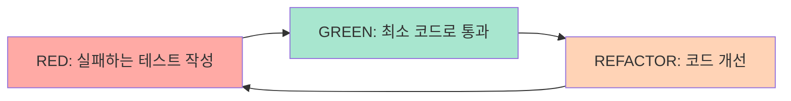

# 테스팅 예제

Pytest를 사용한 TDD (Test-Driven Development) 기반 테스트 작성 예제입니다.

## 📚 예제 목록

### [Pytest 단위 테스트](/ko/examples/testing/unit-tests)
**난이도**: 초급 | **태그**: `pytest`, `unit-test`, `tdd`

개별 함수 및 클래스를 테스트하는 단위 테스트 작성

### [통합 테스트](/ko/examples/testing/integration-tests)
**난이도**: 중급 | **태그**: `pytest`, `integration-test`, `api`

API 엔드포인트, 데이터베이스 등 시스템 전체 테스트

### [테스트 픽스처](/ko/examples/testing/fixtures)
**난이도**: 초급 | **태그**: `pytest`, `fixtures`, `setup`

재사용 가능한 테스트 데이터 및 환경 설정

### [외부 API 모킹](/ko/examples/testing/mocking)
**난이도**: 중급 | **태그**: `pytest`, `mock`, `unittest`

외부 의존성을 격리하여 테스트하는 모킹 기법

---

## 🎯 TDD 사이클



## 💡 빠른 시작

```bash
# Pytest 설치
uv pip install pytest pytest-cov pytest-asyncio

# 테스트 실행
pytest tests/

# 커버리지 포함
pytest --cov=app tests/

# 특정 테스트
pytest tests/test_auth.py::test_login
```

## 🔑 핵심 패턴

### 단위 테스트
```python
def test_calculate_total():
    """금액 계산 테스트"""
    result = calculate_total(price=100, quantity=3)
    assert result == 300
```

### 픽스처
```python
@pytest.fixture
def sample_user():
    """테스트 사용자 픽스처"""
    return User(username="test", email="test@example.com")

def test_user_creation(sample_user):
    assert sample_user.username == "test"
```

## 📖 관련 문서

- [Tutorial 03: TDD로 API 개발](/ko/tutorials/tutorial-03-tdd-api)
- [TDD 개발 가이드](/ko/guides/tdd-development)

---

**시작하기**: [Pytest 단위 테스트](/ko/examples/testing/unit-tests) 예제부터 시작하세요!
