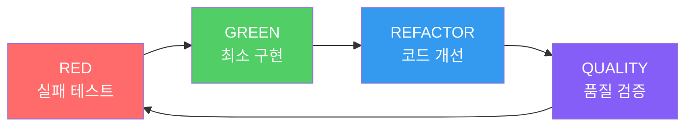

# 기능 개요

MoAI-ADK는 AI 기반의 SPEC-First TDD 개발 프레임워크로, 개발 프로세스의 모든 단계를 자동화하고 최적화합니다.

## 🎯 SPEC-First 개발

### EARS 형식 명세서
구조화되고 명확한 요구사항 정의를 통해 개발의 방향을 설정합니다.

```gherkin
When 사용자가 로그인 버튼을 클릭하면
And 유효한 자격증명을 입력했을 때
The system shall 사용자 세션을 생성하여야 한다
So that 사용자는 인증된 기능에 접근할 수 있다
```

### 15개 필수 필드
모든 명세서는 15개의 표준화된 필드를 포함하여 완성도를 보장합니다.

## 🔄 자동화된 TDD 워크플로우

RED → GREEN → REFACTOR 사이클을 자동으로 관리합니다.



## 🎩 Alfred 슈퍼에이전트

19개의 전문 AI 에이전트가 개발 프로세스를 오케스트레이션합니다.

### 핵심 에이전트
- **spec-builder**: 명세서 작성 전문가
- **tdd-implementer**: TDD 구현 전문가
- **test-engineer**: 테스트 엔지니어
- **git-manager**: Git 워크플로우 관리자
- **qa-validator**: 품질 검증 전문가

## 🔗 @TAG 추적성 시스템

모든 개발 산출물을 연결하는 완전한 추적성을 제공합니다.

```
@SPEC-DOCS-001 (요구사항)
  └── @TEST-DOCS-001-001 (테스트)
      └── @CODE-DOCS-001-001 (구현)
          └── @DOC-DOCS-001-001 (문서)
```

## 📚 Skills Ecosystem v4.0 (v0.23.1)

**292개의 전문 Claude Skills**가 모든 기술 도메인을 완벽하게 지원합니다.

### 주요 업데이트
- **292 Production-Ready Skills** (55개에서 5배 확장)
- **12 BaaS 플랫폼 완전 통합** (Supabase, Firebase, Vercel, Cloudflare, Auth0, Convex, Railway, Neon, Clerk, PocketBase, Appwrite, Parse)
- **95%+ 검증 성공률** 달성
- **자동 버전 관리 시스템**

### Skills 카테고리 (6 Tiers)
- **Tier 1: Foundation Skills**: 핵심 기반 (12개)
- **Tier 2: Alfred Workflow Skills**: 워크플로우 최적화 (24개)
- **Tier 3: Language & Framework Skills**: 프로그래밍 언어/프레임워크 (68개)
- **Tier 4: Domain Expert Skills**: 기술 도메인 전문가 (89개)
- **Tier 5: BaaS Platform Skills**: 클라우드 서비스 통합 (78개)
- **Tier 6: Cross-Cutting Skills**: 공통 기능 (21개)

[Skills 전체 목록 보기](/ko/skills/ecosystem-upgrade-v4)

## 🛡️ TRUST 5 품질 원칙

코드 품질을 보장하는 5가지 핵심 원칙입니다.

1. **Test First**: 테스트 주도 개발
2. **Readable**: 가독성 있는 코드
3. **Unified**: 통합된 스타일
4. **Secured**: 보안 우선 설계
5. **Trackable**: 추적 가능한 변경

## 🚀 자동화된 파이프라인

CI/CD 파이프라인과 통합된 완전한 자동화를 제공합니다.

```yaml
# 자동화된 워크플로우
name: MoAI-ADK Pipeline
on: [push, pull_request]
jobs:
  quality:
    - 코드 품질 검증
    - 테스트 자동 실행
    - 문서 동기화
    - 보안 스캔
```

## 🆕 v0.23.1 주요 기능

### Expert Delegation System v2.0
- **4단계 자동 전문가 할당** 시스템
- **60% 사용자 상호작용 감소** 달성
- **95%+ 정확도** 유지
- [자세히 보기](/ko/alfred/expert-delegation-system)

### Senior Engineer Thinking (v0.22.0+)
- **8가지 연구 전략** 통합
- **병렬 연구 작업** 시스템
- **학습 및 복리 효과**
- [자세히 보기](/ko/features/senior-engineer-thinking)

### BaaS 생태계 통합
- **12개 플랫폼 완전 지원**
- **78개 전문 Skills** 제공
- **실전 예제 및 튜토리얼**
- [자세히 보기](/ko/skills/baas-ecosystem)

## 실전 학습 자료

### 단계별 튜토리얼
1. **[Tutorial 1: REST API 개발](/ko/tutorials/tutorial-01-rest-api)** - 30분, 초보자 추천
2. **[Tutorial 2: JWT 인증 구현](/ko/tutorials/tutorial-02-jwt-auth)** - 1시간, 실전 보안
3. **[Tutorial 3: 데이터베이스 최적화](/ko/tutorials/tutorial-03-database-optimization)** - 1시간, 성능 향상
4. **[Tutorial 4: Supabase 통합](/ko/tutorials/tutorial-04-baas-supabase)** - 1시간, BaaS 활용

### 실제 프로젝트 사례
- **[E-commerce 플랫폼 개발](/ko/case-studies/ecommerce-platform)** - 6주, 제로 버그
- **[Enterprise SaaS 보안](/ko/case-studies/enterprise-saas-security)** - SOC 2 준수
- **[Microservices 전환](/ko/case-studies/microservices-migration)** - 레거시 현대화

### 코드 예제 라이브러리
- **[REST API 예제](/ko/examples/rest-api)**: CRUD, 인증, 에러 처리
- **[인증 예제](/ko/examples/authentication)**: JWT, OAuth, Session
- **[데이터베이스 예제](/ko/examples/database)**: 스키마, 쿼리, 최적화
- **[BaaS 예제](/ko/examples/baas)**: Supabase, Firebase 통합

## 더 알아보기

- **[Skills Ecosystem v4.0](/ko/skills/ecosystem-upgrade-v4)** - 292개 전문 Skills 상세 정보
- **[Alfred 페르소나](/ko/output-style/personas)** - 개인화된 개발 경험
- **[5분 빠른 시작](/ko/getting-started/quick-start)** - 즉시 시작하기
- **[초보자 가이드](/ko/guides/beginner)** - 체계적인 학습 경로