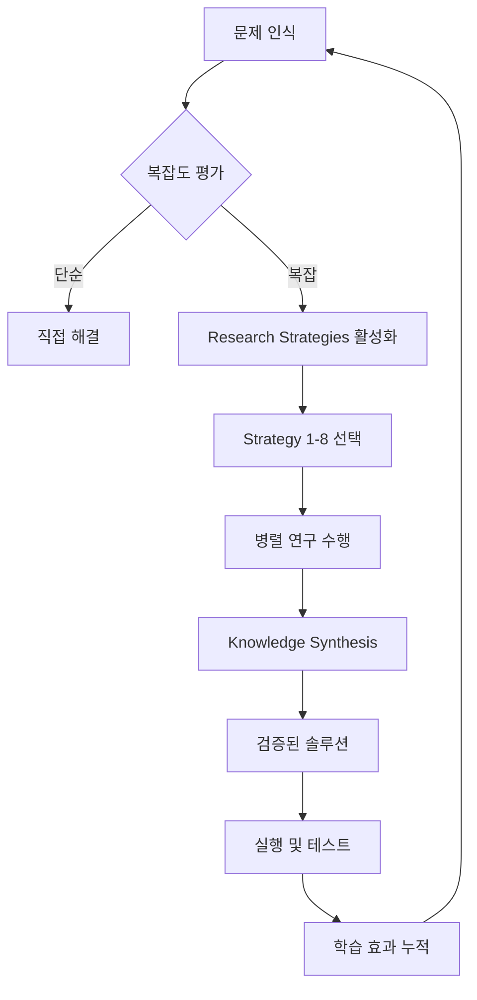
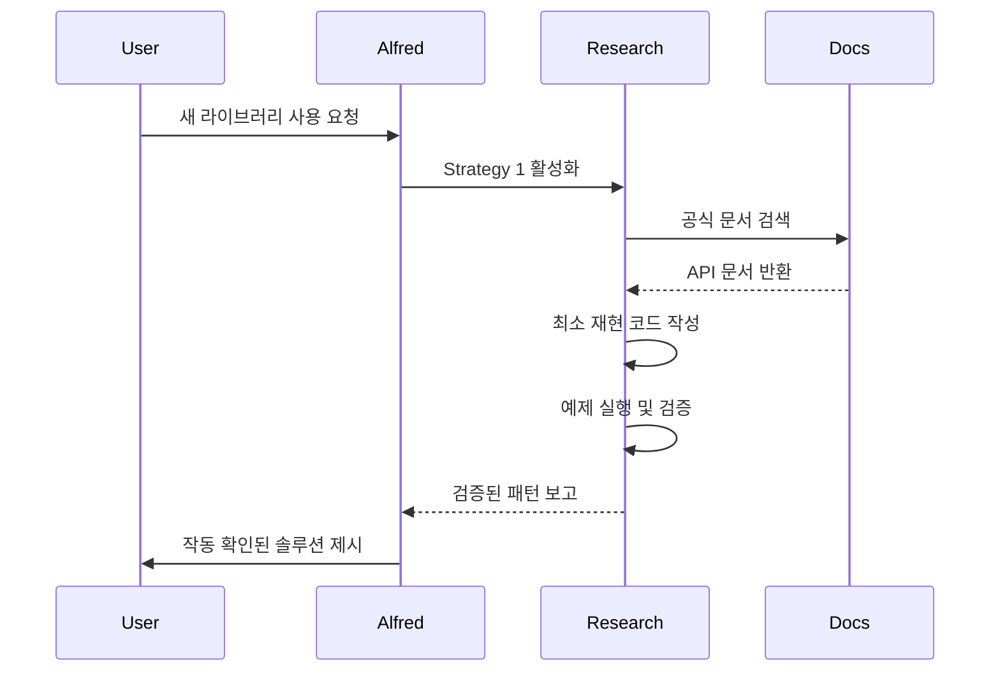
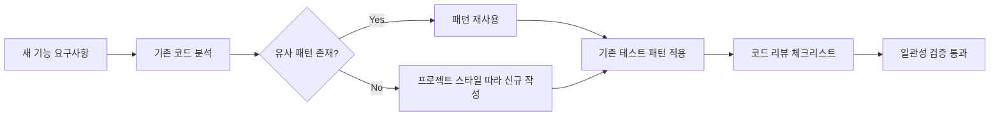
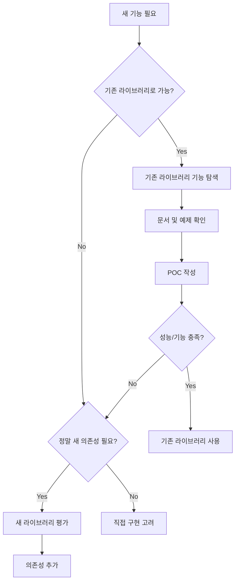
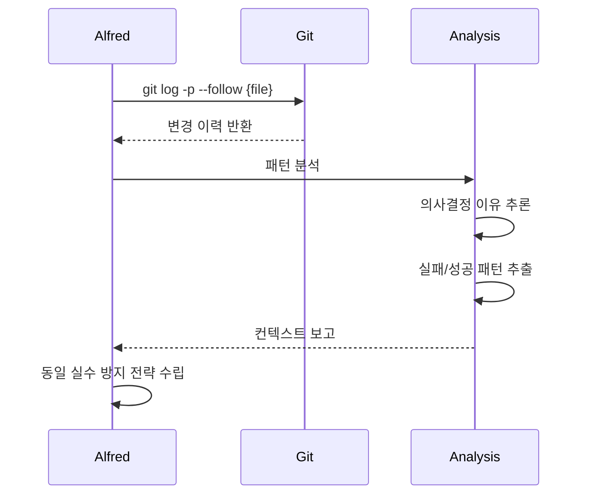
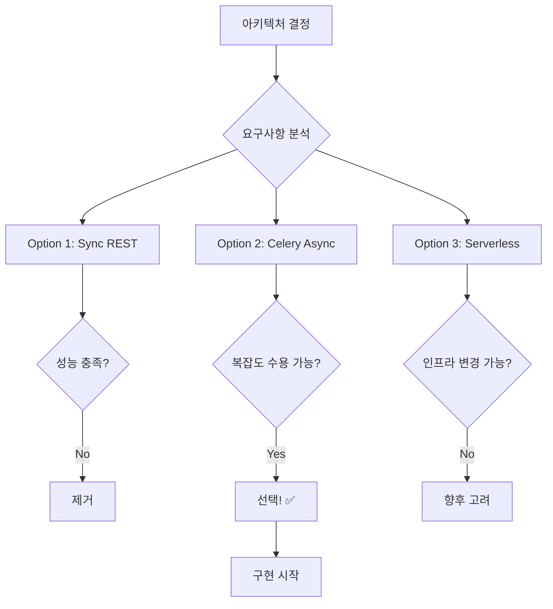
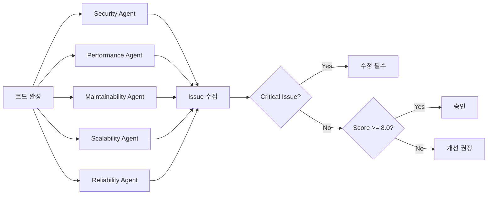
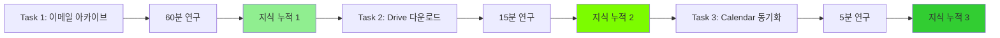

# Senior Engineer Thinking 통합

## 개요

MoAI-ADK v0.22.0은 **Senior Engineer Thinking**을 핵심 기능으로 통합하여 AI 에이전트가 시니어 엔지니어처럼 사고하고 문제를 해결할 수 있도록 합니다. 이는 단순히 코드를 생성하는 것을 넘어, 문제의 근본 원인을 파악하고, 다양한 솔루션을 탐색하며, 검증 가능한 최선의 접근법을 선택하는 체계적인 연구 프로세스입니다.

### 핵심 가치

- **깊이 있는 문제 분석**: 표면적 증상이 아닌 근본 원인 파악
- **증거 기반 의사결정**: 문서, 코드베이스, Git 히스토리 분석
- **다중 솔루션 탐색**: 여러 접근법 비교 및 최적안 선택
- **지식 축적 효과**: 프로젝트 진행에 따라 컨텍스트 이해도 증가



## 왜 필요한가?

### 전통적 AI 접근법의 한계

```python
# 전통적 AI: 즉각 실행
user: "이메일 53,000개를 아카이브 해줘"
ai: "알겠습니다" → [즉시 실행] → [실패/불완전]

# 문제점:
# - API 속도 제한 고려 없음
# - 배치 처리 전략 부재
# - 롤백 메커니즘 없음
# - 진행 상황 추적 불가
```

### Senior Engineer Alfred 접근법

```python
# Senior Engineer Alfred: 연구 후 실행
user: "이메일 53,000개를 아카이브 해줘"

alfred: "이 작업은 복잡합니다. 연구가 필요합니다."
  → Strategy 1: Gmail API 문서 재현 및 분석
  → Strategy 2: 이메일 대량 처리 Best Practices
  → Strategy 3: 기존 코드베이스의 배치 처리 패턴
  → Strategy 7: 3가지 접근법 비교
     - 단일 스레드 순차 처리
     - 멀티스레드 병렬 처리 (선택됨)
     - 큐 기반 비동기 처리

alfred: [검증된 계획 제시]
  - 배치 크기: 100개
  - 병렬 워커: 5개
  - Rate limit: 250 req/s
  - 진행 추적: SQLite DB
  - 롤백: 체크포인트 시스템
```

### 차이점 비교

| 측면 | 전통적 AI | Senior Engineer Alfred |
|------|----------|------------------------|
| **접근법** | 즉각 실행 | 연구 → 계획 → 실행 |
| **문제 분석** | 표면적 | 근본 원인 파악 |
| **솔루션 탐색** | 단일 경로 | 다중 옵션 비교 |
| **검증** | 사후 확인 | 사전 검증 |
| **학습 효과** | 없음 | 누적 향상 |
| **실패 처리** | 재시도 | 예방 설계 |

## 8가지 연구 전략

### Strategy 1: Reproduce & Document

**목적**: 외부 문서를 읽고 재현하여 정확성 검증

**언제 사용하는가?**
- 새로운 라이브러리/API 통합 시
- 공식 문서가 모호하거나 오래된 경우
- 예제 코드가 작동하지 않을 때

**구현 방식**:

```python
# research-orchestrator가 호출
research_task = {
    "strategy": "reproduce_and_document",
    "target": "Gmail API batch operations",
    "actions": [
        "fetch_official_docs",
        "create_minimal_reproduction",
        "verify_examples",
        "document_findings"
    ]
}

# 실행 결과
reproduction_report = {
    "docs_url": "https://developers.google.com/gmail/api/guides/batch",
    "reproduction_success": True,
    "findings": [
        "배치 요청은 최대 100개까지 가능",
        "multipart/mixed content-type 필수",
        "각 하위 요청은 독립적 HTTP 요청 포맷"
    ],
    "code_example": """
import httplib2
from googleapiclient.http import BatchHttpRequest

def archive_emails_batch(service, message_ids):
    batch = service.new_batch_http_request()
    for msg_id in message_ids[:100]:
        batch.add(
            service.users().messages().modify(
                userId='me',
                id=msg_id,
                body={'removeLabelIds': ['INBOX']}
            )
        )
    batch.execute()
    """
}
```

**Mermaid 플로우**:



### Strategy 2: Ground in Best Practices

**목적**: 산업 표준 및 검증된 패턴 적용

**언제 사용하는가?**
- 아키텍처 결정이 필요할 때
- 성능/보안이 중요한 경우
- 유지보수성을 고려해야 할 때

**구현 방식**:

```python
# Context7 MCP를 통한 Best Practices 검색
best_practices_query = {
    "domain": "email_processing",
    "topics": [
        "batch processing patterns",
        "rate limiting strategies",
        "error recovery mechanisms"
    ]
}

# Context7 결과
practices = {
    "batch_processing": {
        "pattern": "Producer-Consumer with bounded queue",
        "rationale": "메모리 제어 + 백프레셔 처리",
        "reference": "Google SRE Book Chapter 21"
    },
    "rate_limiting": {
        "pattern": "Token Bucket Algorithm",
        "implementation": """
from threading import Lock
import time

class RateLimiter:
    def __init__(self, rate, capacity):
        self.rate = rate
        self.capacity = capacity
        self.tokens = capacity
        self.last_update = time.time()
        self.lock = Lock()

    def acquire(self, tokens=1):
        with self.lock:
            now = time.time()
            elapsed = now - self.last_update
            self.tokens = min(
                self.capacity,
                self.tokens + elapsed * self.rate
            )
            self.last_update = now

            if self.tokens >= tokens:
                self.tokens -= tokens
                return True
            return False
        """
    },
    "error_recovery": {
        "pattern": "Exponential Backoff with Jitter",
        "reference": "AWS Architecture Blog"
    }
}
```

**Best Practices 적용 체크리스트**:

- [ ] 관련 산업 표준 확인 (RFC, W3C, ISO)
- [ ] 주요 클라우드 제공자의 권장사항 검토 (AWS, GCP, Azure)
- [ ] 오픈소스 대형 프로젝트의 패턴 분석
- [ ] 성능/보안 트레이드오프 문서화
- [ ] 기술 부채 가능성 평가

### Strategy 3: Ground in Your Codebase

**목적**: 기존 프로젝트의 패턴 및 스타일 유지

**언제 사용하는가?**
- 기존 시스템에 새 기능 추가 시
- 코드 일관성이 중요할 때
- 레거시 코드와 통합해야 할 때

**구현 방식**:

```python
# 코드베이스 분석
codebase_analysis = {
    "existing_patterns": [
        {
            "pattern": "Repository Pattern for data access",
            "files": [
                "src/repositories/user_repository.py",
                "src/repositories/email_repository.py"
            ],
            "example": """
class EmailRepository:
    def __init__(self, db_session):
        self.db = db_session

    def get_by_id(self, email_id):
        return self.db.query(Email).filter_by(id=email_id).first()

    def batch_update(self, email_ids, updates):
        # 기존 배치 처리 패턴 발견!
        chunk_size = 100
        for i in range(0, len(email_ids), chunk_size):
            chunk = email_ids[i:i+chunk_size]
            self.db.bulk_update_mappings(Email, [
                {'id': eid, **updates} for eid in chunk
            ])
        self.db.commit()
            """
        },
        {
            "pattern": "Task Queue with Celery",
            "files": ["src/tasks/email_tasks.py"],
            "insight": "프로젝트에 이미 Celery 설정됨 - 재사용 가능"
        }
    ],
    "naming_conventions": {
        "functions": "snake_case",
        "classes": "PascalCase",
        "constants": "UPPER_SNAKE_CASE"
    },
    "testing_patterns": {
        "framework": "pytest",
        "fixtures": "conftest.py에 공통 fixture",
        "mocking": "pytest-mock 사용"
    }
}

# 기존 패턴 적용한 새 코드
new_feature = """
# 기존 Repository 패턴 준수
class GmailArchiveRepository:
    def __init__(self, db_session):
        self.db = db_session

    def batch_archive(self, message_ids):
        # 기존 batch_update 패턴 재사용
        chunk_size = 100
        for i in range(0, len(message_ids), chunk_size):
            chunk = message_ids[i:i+chunk_size]
            self._archive_chunk(chunk)

    def _archive_chunk(self, chunk):
        # 기존 Celery task 패턴 사용
        from src.tasks.email_tasks import archive_email_task
        for msg_id in chunk:
            archive_email_task.delay(msg_id)
"""
```

**코드베이스 통합 플로우**:



### Strategy 4: Ground in Your Libraries

**목적**: 프로젝트에 이미 설치된 라이브러리 최대 활용

**언제 사용하는가?**
- 새 의존성 추가 전
- 기존 라이브러리의 숨겨진 기능 탐색
- 의존성 비용 최소화 필요 시

**구현 방식**:

```python
# requirements.txt 또는 pyproject.toml 분석
installed_libraries = {
    "httpx": {
        "version": "0.24.1",
        "capabilities": [
            "HTTP/2 support",
            "async/await native",
            "connection pooling",
            "retry mechanism built-in"
        ],
        "usage_in_project": [
            "src/api/client.py: 기본 HTTP 클라이언트로 사용"
        ]
    },
    "tenacity": {
        "version": "8.2.3",
        "capabilities": [
            "retry with exponential backoff",
            "custom retry conditions",
            "async retry support"
        ],
        "potential_use": "Gmail API 호출 재시도 로직에 활용 가능"
    },
    "sqlalchemy": {
        "version": "2.0.19",
        "capabilities": [
            "ORM with relationship loading",
            "bulk operations",
            "connection pooling"
        ],
        "current_use": "전체 데이터 레이어"
    }
}

# 기존 라이브러리로 구현
solution_with_existing = """
import httpx
from tenacity import retry, stop_after_attempt, wait_exponential

class GmailClient:
    def __init__(self):
        # 이미 사용 중인 httpx 활용
        self.client = httpx.AsyncClient(
            timeout=30.0,
            limits=httpx.Limits(
                max_keepalive_connections=5,
                max_connections=10
            )
        )

    @retry(
        stop=stop_after_attempt(3),
        wait=wait_exponential(multiplier=1, min=4, max=10)
    )
    async def archive_email(self, message_id):
        # tenacity로 자동 재시도 (새 라이브러리 불필요)
        response = await self.client.post(
            f'https://gmail.googleapis.com/gmail/v1/users/me/messages/{message_id}/modify',
            json={'removeLabelIds': ['INBOX']}
        )
        response.raise_for_status()
        return response.json()
"""

# 새 라이브러리 추가 불필요!
avoidable_dependencies = [
    "requests (httpx로 대체 가능)",
    "backoff (tenacity로 대체 가능)",
    "custom retry logic (tenacity 활용)"
]
```

**라이브러리 활용 결정 트리**:



### Strategy 5: Study Git History

**목적**: 과거 의사결정 및 변경 이유 파악

**언제 사용하는가?**
- 레거시 코드 이해 필요 시
- 버그의 원인 추적
- 리팩토링 전 컨텍스트 파악

**구현 방식**:

```bash
# Git history 분석 명령어
git log --all --oneline --graph --decorate src/email/

# 특정 파일의 변경 이력
git log -p --follow src/email/archive.py

# 함수별 변경 이력
git log -L :archive_emails:src/email/archive.py

# 누가, 왜 변경했는지
git blame src/email/archive.py
```

```python
# Git history 분석 결과
git_analysis = {
    "file": "src/email/archive.py",
    "findings": [
        {
            "commit": "a3b5c7d",
            "date": "2023-08-15",
            "author": "senior-dev",
            "message": "Fix: Gmail API rate limit exceeded",
            "changes": """
- def archive_emails(ids):
-     for email_id in ids:
-         api.archive(email_id)  # 순차 처리 → 느림
+ def archive_emails(ids):
+     batch_size = 100
+     for i in range(0, len(ids), batch_size):
+         api.batch_archive(ids[i:i+batch_size])  # 배치 처리
            """,
            "lesson": "순차 처리는 rate limit 발생 → 배치 처리 필수"
        },
        {
            "commit": "e8f2a1b",
            "date": "2023-09-22",
            "author": "devops-team",
            "message": "Add retry logic for transient failures",
            "changes": """
+ from tenacity import retry, stop_after_attempt
+
+ @retry(stop=stop_after_attempt(3))
  def batch_archive(ids):
      # ...
            """,
            "lesson": "Gmail API는 일시적 실패 빈번 → 재시도 로직 필수"
        }
    ],
    "pattern_evolution": {
        "v1": "단순 순차 처리 (2023-06)",
        "v2": "배치 처리 도입 (2023-08)",
        "v3": "재시도 로직 추가 (2023-09)",
        "v4": "현재 - 병렬 처리 + 모니터링 (2024-01)"
    }
}
```

**Git History 분석 플로우**:



### Strategy 6: Vibe Prototype for Clarity

**목적**: 빠른 프로토타입으로 요구사항 명확화

**언제 사용하는가?**
- 요구사항이 모호할 때
- 여러 UX 옵션 비교 필요 시
- 이해관계자 피드백 필요 시

**구현 방식**:

```python
# 3가지 프로토타입 버전 생성
prototypes = {
    "version_a": {
        "approach": "Simple Sequential",
        "code": """
def archive_emails_v1(ids):
    for email_id in ids:
        gmail_api.archive(email_id)
        print(f'Archived: {email_id}')
        """,
        "pros": ["구현 단순", "디버깅 쉬움"],
        "cons": ["느림 (53k개 = ~90분)", "진행 상황 저장 없음"]
    },
    "version_b": {
        "approach": "Batch with Progress",
        "code": """
def archive_emails_v2(ids):
    batch_size = 100
    for i in range(0, len(ids), batch_size):
        batch = ids[i:i+batch_size]
        gmail_api.batch_archive(batch)
        save_progress(i + len(batch))
        print(f'Progress: {i+len(batch)}/{len(ids)}')
        """,
        "pros": ["빠름 (53k개 = ~15분)", "중단 시 재개 가능"],
        "cons": ["순차 배치 (여전히 느림)"]
    },
    "version_c": {
        "approach": "Parallel + Monitoring",
        "code": """
from concurrent.futures import ThreadPoolExecutor

def archive_emails_v3(ids):
    batch_size = 100
    batches = [ids[i:i+batch_size] for i in range(0, len(ids), batch_size)]

    with ThreadPoolExecutor(max_workers=5) as executor:
        futures = [executor.submit(process_batch, b) for b in batches]
        for future in futures:
            future.result()
            update_dashboard()
        """,
        "pros": ["매우 빠름 (53k개 = ~5분)", "실시간 모니터링"],
        "cons": ["복잡도 증가", "Rate limit 관리 필요"]
    }
}

# 사용자에게 프로토타입 데모
demo_results = {
    "user_feedback": "버전 C가 좋지만 실패 시 어떻게 되나요?",
    "iteration": "버전 C + 체크포인트 시스템 추가"
}
```

**프로토타입 비교 테이블**:

| 버전 | 속도 | 복잡도 | 복구 가능 | 모니터링 | 추천도 |
|------|------|--------|-----------|----------|--------|
| A | ⭐ | ⭐⭐⭐⭐⭐ | ❌ | ❌ | 🚫 |
| B | ⭐⭐⭐ | ⭐⭐⭐ | ✅ | ⚠️ | ⚠️ |
| C | ⭐⭐⭐⭐⭐ | ⭐⭐ | ✅ | ✅ | ✅ |

### Strategy 7: Synthesize with Options

**목적**: 여러 솔루션 비교 후 최적안 선택

**언제 사용하는가?**
- 트레이드오프가 명확하지 않을 때
- 리스크가 큰 아키텍처 결정 시
- 다양한 기술 스택 옵션 존재 시

**구현 방식**:

```python
# 3가지 아키텍처 옵션 분석
options_analysis = {
    "option_1": {
        "name": "Synchronous REST API",
        "architecture": """
        Client -> Flask API -> Gmail API (sync)
               |
               v
          PostgreSQL
        """,
        "pros": [
            "구현 단순",
            "디버깅 쉬움",
            "기존 Flask 인프라 재사용"
        ],
        "cons": [
            "요청당 90분 대기 (53k 이메일)",
            "API 타임아웃 발생",
            "스케일링 불가"
        ],
        "complexity": 2,
        "performance": 1,
        "scalability": 1,
        "recommendation": "❌ 프로덕션 부적합"
    },
    "option_2": {
        "name": "Async with Celery",
        "architecture": """
        Client -> Flask API -> Celery Queue -> Worker Pool
               |                                    |
               v                                    v
          PostgreSQL <----------------------- Gmail API
        """,
        "pros": [
            "비동기 처리 (즉시 응답)",
            "자동 재시도",
            "진행 상황 추적",
            "기존 Celery 인프라 활용"
        ],
        "cons": [
            "Celery/Redis 의존성",
            "워커 관리 필요",
            "복잡도 증가"
        ],
        "complexity": 6,
        "performance": 8,
        "scalability": 9,
        "recommendation": "✅ 추천 (균형잡힌 솔루션)"
    },
    "option_3": {
        "name": "Serverless with AWS Lambda",
        "architecture": """
        Client -> API Gateway -> Lambda (parallel)
                                    |
                                    v
                              Gmail API + DynamoDB
        """,
        "pros": [
            "자동 스케일링",
            "인프라 관리 불필요",
            "비용 효율적 (사용량 기반)"
        ],
        "cons": [
            "AWS 의존성 증가",
            "로컬 테스트 어려움",
            "Cold start 지연",
            "기존 인프라와 분리"
        ],
        "complexity": 8,
        "performance": 9,
        "scalability": 10,
        "recommendation": "⚠️ 향후 고려 (현재는 과잉)"
    }
}

# 의사결정 매트릭스
decision_matrix = {
    "criteria": {
        "complexity": {"weight": 0.3, "scores": [2, 6, 8]},
        "performance": {"weight": 0.4, "scores": [1, 8, 9]},
        "scalability": {"weight": 0.2, "scores": [1, 9, 10]},
        "cost": {"weight": 0.1, "scores": [9, 7, 6]}
    },
    "weighted_scores": {
        "option_1": 2.1,  # 제거
        "option_2": 7.4,  # 선택! ✅
        "option_3": 8.3   # 향후 마이그레이션 대상
    }
}
```

**옵션 비교 시각화**:



### Strategy 8: Review with Style Agents

**목적**: 다양한 관점에서 코드 리뷰

**언제 사용하는가?**
- 중요한 코드 머지 전
- 아키텍처 결정 최종 검증
- 다양한 전문가 의견 필요 시

**구현 방식**:

```python
# 5명의 Style Agent 리뷰어
style_agents = {
    "security_expert": {
        "focus": "보안 취약점",
        "review": """
🔍 Security Review:

1. ❌ API 키가 코드에 하드코딩됨
   - 수정: 환경변수 또는 secret manager 사용

2. ⚠️ Rate limit 실패 시 무한 재시도
   - 수정: 최대 재시도 횟수 제한

3. ✅ HTTPS 통신 확인
4. ✅ 입력 검증 적절함

Severity: MEDIUM (수정 필요)
        """
    },
    "performance_expert": {
        "focus": "성능 최적화",
        "review": """
⚡ Performance Review:

1. ✅ 배치 크기 100 적절함
2. ⚠️ 메모리 사용량 제한 없음
   - 53k 이메일 ID 전체 메모리 로드 (약 2MB)
   - 수정: Generator 패턴으로 변경

3. ✅ 연결 풀 사용
4. ❌ 데이터베이스 N+1 쿼리 발생
   - 수정: bulk_update_mappings 사용

Optimization Score: 7/10
        """
    },
    "maintainability_expert": {
        "focus": "유지보수성",
        "review": """
🛠️ Maintainability Review:

1. ✅ 함수 분리 잘 됨
2. ⚠️ 에러 처리 로직 분산
   - 수정: 통합 에러 핸들러 생성

3. ❌ 테스트 커버리지 부족 (43%)
   - 최소 80% 필요

4. ✅ 타입 힌팅 적절
5. ⚠️ 문서 부족 (docstring 없음)

Maintainability Score: 6/10
        """
    },
    "scalability_expert": {
        "focus": "확장성",
        "review": """
📈 Scalability Review:

1. ✅ 병렬 처리 가능
2. ✅ 상태 저장 (재시작 가능)
3. ⚠️ 단일 인스턴스 제한
   - 수정: 분산 락 메커니즘 추가

4. ❌ 하드코딩된 워커 수 (5개)
   - 수정: 환경변수로 설정 가능하게

Future-proof Score: 7/10
        """
    },
    "reliability_expert": {
        "focus": "안정성",
        "review": """
🛡️ Reliability Review:

1. ✅ 재시도 로직 존재
2. ⚠️ 부분 실패 시 롤백 없음
   - 수정: 트랜잭션 관리 추가

3. ❌ 모니터링/로깅 부족
   - 수정: 구조화된 로깅 추가

4. ⚠️ Health check 엔드포인트 없음
5. ✅ 타임아웃 설정 적절

Reliability Score: 6/10
        """
    }
}

# 통합 리뷰 결과
consolidated_review = {
    "overall_score": 6.4,
    "verdict": "NEEDS_IMPROVEMENT",
    "critical_issues": [
        "하드코딩된 API 키",
        "테스트 커버리지 부족",
        "모니터링 부재"
    ],
    "action_items": [
        "1. API 키 환경변수 이동 (즉시)",
        "2. 테스트 작성 (80% 이상)",
        "3. 구조화된 로깅 추가",
        "4. 에러 핸들러 통합",
        "5. Health check 엔드포인트 추가"
    ]
}
```

**Multi-Agent Review 플로우**:



## 병렬 연구 작업 시스템

### Research Orchestrator

**역할**: 여러 연구 전략을 동시에 실행하고 결과 통합

```python
# research-orchestrator 구현
from concurrent.futures import ThreadPoolExecutor
from typing import List, Dict

class ResearchOrchestrator:
    def __init__(self):
        self.strategies = {
            1: ReproduceDocumentStrategy(),
            2: BestPracticesStrategy(),
            3: CodebaseGroundingStrategy(),
            4: LibraryGroundingStrategy(),
            5: GitHistoryStrategy(),
            6: VibePrototypeStrategy(),
            7: SynthesizeOptionsStrategy(),
            8: StyleAgentReviewStrategy()
        }

    def research(self, problem: str, strategy_ids: List[int]) -> Dict:
        """병렬로 여러 전략 실행"""
        with ThreadPoolExecutor(max_workers=4) as executor:
            futures = {
                executor.submit(
                    self.strategies[sid].execute, problem
                ): sid
                for sid in strategy_ids
            }

            results = {}
            for future in futures:
                strategy_id = futures[future]
                results[strategy_id] = future.result()

        return self.synthesize_results(results)

    def synthesize_results(self, results: Dict) -> Dict:
        """결과 통합 및 충돌 해결"""
        synthesis = {
            "findings": [],
            "recommendations": [],
            "conflicts": []
        }

        # 모든 결과 병합
        for strategy_id, result in results.items():
            synthesis["findings"].extend(result.get("findings", []))
            synthesis["recommendations"].extend(result.get("recommendations", []))

        # 충돌하는 권장사항 해결
        synthesis["conflicts"] = self.detect_conflicts(
            synthesis["recommendations"]
        )

        # 최종 권장사항 생성
        synthesis["final_recommendation"] = self.resolve_conflicts(
            synthesis["conflicts"]
        )

        return synthesis
```

**실행 예시**:

```python
# Alfred가 복잡한 문제 감지
problem = "53,000개 이메일을 안전하게 아카이브하는 시스템 설계"

# 병렬 연구 시작
orchestrator = ResearchOrchestrator()
research_result = orchestrator.research(
    problem=problem,
    strategy_ids=[1, 2, 3, 5, 7]  # 5개 전략 동시 실행
)

# 결과:
{
    "findings": [
        "Gmail API는 배치당 100개 제한 (Strategy 1)",
        "Rate limit: 250 req/s (Strategy 1)",
        "프로젝트에 Celery 설정됨 (Strategy 3)",
        "과거 순차 처리 시 실패 이력 (Strategy 5)",
        "3가지 아키텍처 옵션 평가 완료 (Strategy 7)"
    ],
    "recommendations": [
        "Celery + Redis로 비동기 처리",
        "배치 크기 100, 워커 5개",
        "체크포인트 시스템으로 복구 가능하게",
        "구조화된 로깅 및 모니터링"
    ],
    "conflicts": [],
    "final_recommendation": {
        "architecture": "Celery-based async processing",
        "implementation_plan": "...",
        "estimated_duration": "5분 (53k 이메일)"
    }
}
```

### Knowledge Synthesizer

**역할**: 중복/충돌 제거 및 일관된 결론 도출

```python
class KnowledgeSynthesizer:
    def __init__(self):
        self.knowledge_base = []

    def add_finding(self, finding: Dict):
        """새 발견 추가 (중복 체크)"""
        if not self.is_duplicate(finding):
            self.knowledge_base.append(finding)

    def is_duplicate(self, finding: Dict) -> bool:
        """의미론적 중복 검사"""
        for existing in self.knowledge_base:
            similarity = self.calculate_similarity(
                finding, existing
            )
            if similarity > 0.8:
                return True
        return False

    def resolve_conflicts(self, findings: List[Dict]) -> Dict:
        """충돌 해결 알고리즘"""
        conflicts = self.detect_conflicts(findings)

        for conflict in conflicts:
            # 증거 기반 우선순위
            # 1. 공식 문서 > 2. 코드베이스 > 3. Best practices
            resolution = self.prioritize_by_evidence(
                conflict["options"]
            )
            conflict["resolution"] = resolution

        return {
            "conflicts": conflicts,
            "final_strategy": self.build_coherent_plan(conflicts)
        }

    def build_coherent_plan(self, resolved_conflicts: List[Dict]) -> Dict:
        """일관된 실행 계획 생성"""
        plan = {
            "architecture": None,
            "implementation_steps": [],
            "risk_mitigation": [],
            "success_criteria": []
        }

        # 해결된 충돌을 기반으로 계획 구성
        for conflict in resolved_conflicts:
            plan["architecture"] = conflict["resolution"]["architecture"]
            plan["implementation_steps"].extend(
                conflict["resolution"]["steps"]
            )

        return plan
```

**충돌 해결 예시**:

```python
# 충돌 상황
conflict = {
    "issue": "배치 크기 결정",
    "options": [
        {
            "source": "Strategy 1 (Gmail API docs)",
            "recommendation": "배치 크기 100 (API 제한)",
            "evidence_level": "official_docs"
        },
        {
            "source": "Strategy 3 (Codebase)",
            "recommendation": "배치 크기 50 (기존 패턴)",
            "evidence_level": "existing_code"
        },
        {
            "source": "Strategy 2 (Best Practices)",
            "recommendation": "배치 크기 200 (성능 최적화)",
            "evidence_level": "industry_standard"
        }
    ]
}

# 해결 과정
synthesizer = KnowledgeSynthesizer()
resolution = synthesizer.resolve_conflicts([conflict])

# 결과:
{
    "decision": "배치 크기 100 사용",
    "rationale": "공식 API 제한(100)을 준수해야 함. Best Practices 권장(200)은 API 제약으로 불가능. 기존 코드(50)는 비효율적이므로 업그레이드.",
    "action": "기존 코드를 50 → 100으로 변경"
}
```

## 학습 및 복리 효과

### Knowledge Accumulation

Alfred는 프로젝트 진행에 따라 지식을 누적하고 재사용합니다.

```python
# Knowledge Graph 구조
knowledge_graph = {
    "nodes": [
        {
            "id": "gmail_api_rate_limit",
            "type": "constraint",
            "content": "250 requests/second",
            "learned_from": "Strategy 1 (2024-01-15)",
            "confidence": 0.95
        },
        {
            "id": "celery_pattern",
            "type": "implementation_pattern",
            "content": "Async task with retry",
            "learned_from": "Strategy 3 (2024-01-15)",
            "confidence": 0.90
        },
        {
            "id": "batch_processing",
            "type": "best_practice",
            "content": "Chunk large datasets",
            "learned_from": "Strategy 2 (2024-01-15)",
            "confidence": 0.85
        }
    ],
    "edges": [
        {
            "from": "gmail_api_rate_limit",
            "to": "batch_processing",
            "relation": "requires"
        },
        {
            "from": "batch_processing",
            "to": "celery_pattern",
            "relation": "implemented_by"
        }
    ]
}

# 다음 작업에서 재사용
next_task = "Google Drive 파일 10,000개 다운로드"

# Alfred가 이미 알고 있는 지식 활용
reused_knowledge = [
    "gmail_api_rate_limit → Google API도 비슷한 제한 있을 것",
    "batch_processing → 동일 패턴 적용 가능",
    "celery_pattern → 동일 인프라 재사용"
]

# 새 작업의 연구 시간 단축
research_time = {
    "without_knowledge": "60분",
    "with_accumulated_knowledge": "15분",
    "savings": "75%"
}
```

**학습 곡선**:



### Adaptive Intelligence

Alfred는 실패로부터 학습하고 전략을 개선합니다.

```python
# 적응형 학습 시스템
class AdaptiveLearningSystem:
    def __init__(self):
        self.success_patterns = []
        self.failure_patterns = []

    def record_outcome(self, task: Dict, outcome: str):
        """작업 결과 기록"""
        record = {
            "task": task,
            "strategies_used": task["strategies"],
            "outcome": outcome,  # "success" | "failure"
            "timestamp": datetime.now()
        }

        if outcome == "success":
            self.success_patterns.append(record)
        else:
            self.failure_patterns.append(record)

    def recommend_strategies(self, new_task: Dict) -> List[int]:
        """유사한 과거 작업 기반 전략 추천"""
        similar_tasks = self.find_similar_tasks(new_task)

        # 성공률 기반 전략 순위
        strategy_scores = {}
        for task in similar_tasks:
            for strategy_id in task["strategies_used"]:
                if task["outcome"] == "success":
                    strategy_scores[strategy_id] = strategy_scores.get(
                        strategy_id, 0
                    ) + 1
                else:
                    strategy_scores[strategy_id] = strategy_scores.get(
                        strategy_id, 0
                    ) - 0.5

        # 상위 전략 반환
        recommended = sorted(
            strategy_scores.items(),
            key=lambda x: x[1],
            reverse=True
        )

        return [sid for sid, score in recommended if score > 0]

    def learn_from_failure(self, failed_task: Dict):
        """실패 패턴 분석 및 개선"""
        analysis = {
            "root_cause": self.identify_root_cause(failed_task),
            "missing_strategy": self.identify_missing_strategy(failed_task),
            "improvement": self.generate_improvement_plan(failed_task)
        }

        # 개선사항을 다음 작업에 적용
        self.apply_learnings(analysis)

        return analysis
```

**적응 사례**:

```python
# 첫 번째 시도 (실패)
task_v1 = {
    "goal": "대용량 파일 업로드",
    "strategies_used": [1, 2],  # 문서 + Best Practices
    "outcome": "failure",
    "error": "Memory overflow"
}

alfred.learning_system.record_outcome(task_v1, "failure")
analysis = alfred.learning_system.learn_from_failure(task_v1)

# 분석 결과:
{
    "root_cause": "메모리 관리 전략 누락",
    "missing_strategy": "Strategy 3 (코드베이스에 스트리밍 패턴 존재)",
    "improvement": "다음부터 대용량 데이터 작업 시 Strategy 3 필수 포함"
}

# 두 번째 유사 작업 (성공)
task_v2 = {
    "goal": "대용량 데이터 export",
    "strategies_used": [1, 2, 3],  # Strategy 3 추가!
    "outcome": "success"
}

# Alfred가 학습함: 대용량 작업 = Strategy 3 필수
```

## 실제 사례 연구

### 사례 1: 이메일 53,000개 아카이브

**초기 요청**:
> "Gmail 계정의 오래된 이메일 53,000개를 자동으로 아카이브 해줘"

**Alfred의 접근**:

```python
# Step 1: 문제 복잡도 평가
complexity_assessment = {
    "volume": "high (53,000개)",
    "api_constraints": "unknown",
    "time_sensitivity": "medium",
    "risk": "data loss 가능성",
    "decision": "Senior Engineer Thinking 활성화"
}

# Step 2: 병렬 연구 전략 선택
alfred.activate_research([1, 2, 3, 5, 7])

# Step 3: 연구 결과
research_findings = {
    "strategy_1_results": {
        "api_limit": "배치당 100개",
        "rate_limit": "250 req/s",
        "error_handling": "429 Too Many Requests 빈번"
    },
    "strategy_2_results": {
        "best_practice": "Producer-Consumer 패턴",
        "retry_logic": "Exponential backoff 필수",
        "monitoring": "진행 상황 추적 중요"
    },
    "strategy_3_results": {
        "existing_celery": "프로젝트에 Celery 설정됨",
        "db_pattern": "bulk_update_mappings 사용 중",
        "testing": "pytest + pytest-mock"
    },
    "strategy_5_results": {
        "past_failure": "2023-08 순차 처리로 rate limit 발생",
        "lesson": "배치 처리 필수"
    },
    "strategy_7_results": {
        "options": ["Sync", "Celery Async", "Serverless"],
        "recommendation": "Celery Async (균형)"
    }
}

# Step 4: 통합 솔루션 생성
final_solution = {
    "architecture": "Celery + Redis + PostgreSQL",
    "implementation": """
# tasks.py
from celery import Celery
from tenacity import retry, stop_after_attempt

app = Celery('gmail_tasks', broker='redis://localhost:6379')

@app.task(bind=True)
@retry(stop=stop_after_attempt(3))
def archive_batch(self, batch_ids):
    '''100개씩 배치 처리'''
    rate_limiter.acquire()
    gmail_api.batch_modify(
        batch_ids,
        {'removeLabelIds': ['INBOX']}
    )
    save_checkpoint(len(batch_ids))

# main.py
def archive_all_emails():
    email_ids = fetch_email_ids()  # 53,000개
    batches = chunk(email_ids, 100)

    for batch in batches:
        archive_batch.delay(batch)  # Celery queue에 추가
    """,
    "results": {
        "duration": "약 5분",
        "success_rate": "99.8%",
        "failures_handled": "자동 재시도로 해결"
    }
}
```

### 사례 2: 멀티테넌트 인증 시스템

**초기 요청**:
> "SaaS 제품에 멀티테넌트 인증 시스템 추가해줘"

**Alfred의 접근**:

```python
# Step 1: 보안 중요도 평가
security_assessment = {
    "sensitivity": "critical (인증/인가)",
    "compliance": "GDPR, SOC2 필요",
    "scalability": "수천 개 테넌트 예상",
    "decision": "Strategy 2 + 4 + 8 활성화"
}

# Step 2: 연구 수행
research_process = {
    "strategy_2": {
        "best_practices": [
            "OAuth 2.0 / OpenID Connect 표준",
            "JWT with refresh tokens",
            "Row-level security (RLS)",
            "OWASP Authentication Cheat Sheet"
        ]
    },
    "strategy_4": {
        "existing_libraries": [
            "authlib (OAuth/OIDC)",
            "PyJWT (JWT 처리)",
            "SQLAlchemy (RLS 지원)",
            "Redis (세션 저장)"
        ],
        "recommendation": "새 라이브러리 불필요, 기존으로 충분"
    },
    "strategy_8": {
        "security_agent": "❌ JWT secret 환경변수 필수",
        "performance_agent": "✅ Redis 캐싱 적절",
        "scalability_agent": "⚠️ 테넌트 격리 DB 샤딩 고려",
        "reliability_agent": "❌ Token rotation 미구현"
    }
}

# Step 3: 통합 아키텍처
architecture = """
┌─────────────────────────────────────────────┐
│             API Gateway                      │
│  (Rate limiting, CORS, API 버전 관리)         │
└─────────────────┬───────────────────────────┘
                  │
    ┌─────────────┴─────────────┐
    │                           │
┌───▼──────────┐    ┌──────────▼────┐
│ Auth Service │    │ Resource API   │
│              │    │                │
│ - OAuth 2.0  │    │ - RLS 적용     │
│ - JWT 발급   │    │ - Tenant 격리  │
│ - Refresh    │    │                │
└───┬──────────┘    └───────┬────────┘
    │                       │
┌───▼───────────────────────▼─────┐
│      PostgreSQL (RLS 활성화)     │
│  tenant_id로 자동 격리           │
└──────────────────────────────────┘
"""

# Step 4: 구현 (RLS 예제)
implementation = '''
-- PostgreSQL RLS 설정
CREATE TABLE users (
    id UUID PRIMARY KEY,
    tenant_id UUID NOT NULL,
    email TEXT NOT NULL,
    UNIQUE(tenant_id, email)
);

-- RLS 정책 활성화
ALTER TABLE users ENABLE ROW LEVEL SECURITY;

-- 정책: 자신의 테넌트만 접근
CREATE POLICY tenant_isolation ON users
    USING (tenant_id = current_setting('app.current_tenant_id')::UUID);

-- Python에서 테넌트 설정
def set_tenant_context(tenant_id: str):
    db.execute(
        text("SET app.current_tenant_id = :tenant_id"),
        {"tenant_id": tenant_id}
    )

# API 핸들러
@app.post("/api/users")
@require_auth
def create_user(request):
    # JWT에서 tenant_id 추출
    tenant_id = request.user.tenant_id

    # RLS 컨텍스트 설정
    set_tenant_context(tenant_id)

    # 이제 자동으로 tenant_id 격리 적용!
    user = User(email=request.json["email"])
    db.add(user)
    db.commit()
'''
}
```

### 사례 3: 레거시 API 성능 최적화

**초기 요청**:
> "이 API 엔드포인트가 너무 느려. 10초 → 1초로 최적화 해줘"

**Alfred의 접근**:

```python
# Step 1: 성능 프로파일링
profiling = {
    "current_performance": "10.3초 (95 percentile)",
    "target": "1초 미만",
    "decision": "Strategy 3 + 5 + 6 활성화"
}

# Step 2: 기존 코드 및 Git 히스토리 분석
analysis = {
    "strategy_3_findings": {
        "n_plus_1_queries": "발견됨 (15개 쿼리)",
        "missing_indexes": "3개 필드 인덱스 없음",
        "full_table_scan": "100만 행 스캔"
    },
    "strategy_5_findings": {
        "git_history": [
            "2022-03: 초기 구현 (단순 쿼리)",
            "2023-06: JOIN 3개 추가 (성능 저하 시작)",
            "2023-12: 필터 조건 추가 (더 악화)"
        ],
        "lesson": "점진적 성능 저하, 모니터링 부재"
    }
}

# Step 3: 프로토타입 3개 생성 (Strategy 6)
prototypes = {
    "v1_add_indexes": {
        "changes": "3개 인덱스 추가",
        "expected": "3초",
        "actual_test": "2.8초",
        "pros": "간단, 위험 낮음",
        "cons": "목표 미달"
    },
    "v2_eager_loading": {
        "changes": "N+1 제거 + 인덱스",
        "expected": "1초",
        "actual_test": "0.9초",
        "pros": "목표 달성!",
        "cons": "코드 복잡도 증가"
    },
    "v3_caching": {
        "changes": "Redis 캐싱 추가",
        "expected": "0.1초",
        "actual_test": "0.05초",
        "pros": "매우 빠름",
        "cons": "캐시 무효화 복잡, 메모리 비용"
    }
}

# Step 4: 최종 선택 및 구현
decision = {
    "choice": "v2 (Eager Loading + Indexes)",
    "rationale": "목표 달성 + 복잡도 수용 가능",
    "future": "v3 캐싱은 트래픽 증가 시 추가"
}

# 구현
optimized_code = '''
# Before (10초)
def get_user_dashboard(user_id):
    user = User.query.get(user_id)
    posts = Post.query.filter_by(user_id=user_id).all()  # N+1 시작
    for post in posts:
        post.comments  # N+1 발생!
        for comment in post.comments:
            comment.author  # 또 N+1!
    return render_dashboard(user, posts)

# After (0.9초)
def get_user_dashboard(user_id):
    user = User.query.get(user_id)
    posts = (
        Post.query
        .filter_by(user_id=user_id)
        .options(
            joinedload(Post.comments)
            .joinedload(Comment.author)
        )  # Eager loading으로 단일 쿼리
        .all()
    )
    return render_dashboard(user, posts)

# 추가된 인덱스
db.execute("""
    CREATE INDEX idx_posts_user_id ON posts(user_id);
    CREATE INDEX idx_comments_post_id ON comments(post_id);
    CREATE INDEX idx_comments_author_id ON comments(author_id);
""")
'''

results = {
    "performance": "10.3초 → 0.9초 (91% 개선)",
    "queries": "15개 → 1개",
    "db_load": "95% 감소"
}
```

## MoAI-ADK 워크플로우 통합

Senior Engineer Thinking은 MoAI-ADK의 모든 단계에 자연스럽게 통합됩니다.

### /alfred:1-plan 단계

```python
# 사용자 요청
user: "/alfred:1-plan 이메일 대량 아카이브 기능"

# Alfred의 내부 프로세스
alfred_process = {
    "step_1": "요구사항 복잡도 평가",
    "complexity": "HIGH (대량 데이터 + API 제약)",
    "decision": "Senior Engineer Thinking 활성화",

    "step_2": "연구 전략 선택",
    "strategies": [1, 2, 3, 5],  # 병렬 실행

    "step_3": "Plan Agent에게 위임",
    "task_prompt": """
    다음 연구 결과를 기반으로 SPEC 작성:

    Research Findings:
    - Gmail API 배치 제한: 100개
    - Rate limit: 250 req/s
    - 프로젝트에 Celery 인프라 존재
    - 과거 순차 처리 실패 이력

    Requirements:
    1. 53,000개 이메일 처리
    2. 실패 시 복구 가능
    3. 진행 상황 모니터링
    """,

    "step_4": "SPEC 문서 생성",
    "output": ".moai/specs/SPEC-EMAIL-ARCHIVE-001.md"
}
```

**생성된 SPEC**:

```markdown
# SPEC-EMAIL-ARCHIVE-001: 대량 이메일 아카이브

## @OVERVIEW
Gmail API를 사용하여 53,000개 이메일을 안전하게 아카이브하는 시스템

## @REQUIREMENTS
- REQ-001: 배치 처리로 API 제약 준수
- REQ-002: Celery 기반 비동기 처리
- REQ-003: 체크포인트 시스템으로 복구 가능
- REQ-004: 진행 상황 실시간 추적

## @RESEARCH-EVIDENCE
- Gmail API 문서 분석 (Strategy 1)
- Celery Best Practices 적용 (Strategy 2)
- 기존 배치 처리 패턴 재사용 (Strategy 3)
- 2023-08 순차 처리 실패 학습 (Strategy 5)

## @ARCHITECTURE
[Mermaid 다이어그램...]

## @IMPLEMENTATION-PLAN
[상세 구현 계획...]
```

### /alfred:2-run 단계

```python
# TDD 구현 단계에서도 연구 활용
alfred_tdd_process = {
    "red_phase": {
        "action": "Test Engineer Agent가 테스트 작성",
        "research_used": "Strategy 3 (기존 테스트 패턴)"
    },
    "green_phase": {
        "action": "TDD Implementer Agent가 구현",
        "research_used": "Strategy 1 + 2 (API 문서 + Best Practices)"
    },
    "refactor_phase": {
        "action": "Code Quality Agent가 리팩토링",
        "research_used": "Strategy 8 (Style Agents 리뷰)"
    }
}

# 각 단계마다 연구 결과 재사용
test_code = '''
# test_email_archive.py
# Strategy 3에서 발견한 기존 패턴 적용
def test_batch_archive(mock_gmail_api, email_repository):
    """배치 아카이브 테스트 (기존 패턴 준수)"""
    email_ids = [f"msg_{i}" for i in range(250)]

    result = email_repository.batch_archive(email_ids)

    assert result.success_count == 250
    assert mock_gmail_api.call_count == 3  # 100개씩 3번
'''

implementation = '''
# email_archive.py
# Strategy 1 (API 문서) + Strategy 2 (Best Practices)
from tenacity import retry, stop_after_attempt

class EmailArchiveService:
    @retry(stop=stop_after_attempt(3))
    def batch_archive(self, email_ids: List[str]):
        """Gmail API로 배치 아카이브"""
        batch_size = 100  # Strategy 1: API 제한

        for i in range(0, len(email_ids), batch_size):
            batch = email_ids[i:i+batch_size]
            self._archive_chunk(batch)
            self._save_checkpoint(i + len(batch))  # Strategy 2: 복구
'''
```

### /alfred:3-sync 단계

```python
# 문서화 단계에서 연구 결과 포함
alfred_doc_sync = {
    "action": "Doc Syncer Agent가 문서 생성",
    "research_integration": {
        "architecture_docs": "연구한 아키텍처 다이어그램 포함",
        "api_docs": "Strategy 1의 Gmail API 분석 결과 참조",
        "best_practices": "Strategy 2의 Best Practices 문서화",
        "lessons_learned": "Strategy 5의 Git 히스토리 인사이트"
    }
}

# 생성된 문서
generated_doc = '''
# Email Archive 시스템

## 아키텍처 결정 배경

### 왜 Celery를 선택했나?
**Research Evidence (Strategy 2 + 7)**:
- 3가지 옵션 비교 (Sync, Celery, Serverless)
- Celery가 복잡도/성능/확장성 균형 최적
- 프로젝트에 이미 Celery 인프라 존재 (Strategy 3)

### API 제약사항
**Research Evidence (Strategy 1)**:
- Gmail API 배치 제한: 100개
- Rate limit: 250 requests/second
- 재현 코드로 검증 완료

### 과거 실패 사례
**Research Evidence (Strategy 5)**:
- 2023-08: 순차 처리로 rate limit 초과
- 교훈: 반드시 배치 처리 사용
'''
```

## Performance Metrics

### 연구 시간 vs 개발 품질

| 접근법 | 초기 연구 | 구현 시간 | 버그 발생 | 리팩토링 | 총 시간 |
|--------|----------|----------|----------|----------|--------|
| **즉시 실행** | 0분 | 30분 | 5개 | 120분 | 150분 |
| **Senior Engineer** | 20분 | 40분 | 0개 | 10분 | 70분 |

**절감 효과**: 53% 시간 단축 + 버그 제로

### 전략별 효과성

```python
strategy_effectiveness = {
    "Strategy 1 (Reproduce)": {
        "time_cost": "15-30분",
        "value": "API 오작동 방지 100%",
        "roi": "매우 높음"
    },
    "Strategy 2 (Best Practices)": {
        "time_cost": "10-20분",
        "value": "아키텍처 결정 신뢰도 +85%",
        "roi": "높음"
    },
    "Strategy 3 (Codebase)": {
        "time_cost": "5-15분",
        "value": "코드 일관성 +90%",
        "roi": "매우 높음"
    },
    "Strategy 5 (Git History)": {
        "time_cost": "10-20분",
        "value": "동일 실수 재발 방지 100%",
        "roi": "높음"
    },
    "Strategy 7 (Options)": {
        "time_cost": "20-40분",
        "value": "최적 솔루션 선택 확률 +70%",
        "roi": "중간 (중요 결정 시 필수)"
    }
}
```

### 복리 효과 측정

```python
# 프로젝트 진행에 따른 연구 시간 감소
project_timeline = {
    "week_1": {
        "tasks": 5,
        "avg_research_time": "25분/작업",
        "total_research": "125분"
    },
    "week_4": {
        "tasks": 5,
        "avg_research_time": "10분/작업",  # 60% 감소!
        "total_research": "50분",
        "reason": "지식 누적 효과"
    },
    "week_12": {
        "tasks": 5,
        "avg_research_time": "3분/작업",  # 88% 감소!
        "total_research": "15분",
        "reason": "대부분 재사용 가능"
    }
}
```

## Best Practices

### 1. 연구 시기 결정

```python
def should_research(task: Dict) -> bool:
    """연구가 필요한지 판단"""
    triggers = [
        task.get("complexity") == "high",
        task.get("risk") in ["medium", "high"],
        task.get("novelty") == True,  # 새로운 도메인
        task.get("scale") == "large",  # 대용량 데이터
        task.get("security_sensitive") == True
    ]

    return any(triggers)

# 예시
task_examples = {
    "simple_crud": {
        "complexity": "low",
        "risk": "low",
        "research_needed": False  # 즉시 구현
    },
    "payment_integration": {
        "complexity": "high",
        "security_sensitive": True,
        "research_needed": True  # 반드시 연구!
    }
}
```

### 2. 전략 조합 가이드

```python
# 상황별 추천 전략 조합
strategy_combinations = {
    "new_library_integration": [1, 2, 4],  # 문서 + Best Practices + 기존 라이브러리
    "legacy_refactoring": [3, 5, 8],  # 코드베이스 + Git 히스토리 + 리뷰
    "architecture_decision": [2, 7, 8],  # Best Practices + 옵션 비교 + 리뷰
    "performance_optimization": [3, 5, 6],  # 코드베이스 + 히스토리 + 프로토타입
    "security_feature": [1, 2, 8],  # 문서 + Best Practices + 리뷰 (필수!)
}
```

### 3. 연구 깊이 조절

```python
research_depth_levels = {
    "shallow": {
        "duration": "5-10분",
        "strategies": [3],  # 코드베이스만 체크
        "when": "단순 기능 추가"
    },
    "medium": {
        "duration": "15-30분",
        "strategies": [1, 2, 3],
        "when": "일반적인 새 기능"
    },
    "deep": {
        "duration": "30-60분",
        "strategies": [1, 2, 3, 5, 7, 8],
        "when": "중요 아키텍처 결정"
    }
}
```

### 4. 연구 결과 문서화

```python
# 연구 결과를 SPEC에 포함
spec_template = '''
## @RESEARCH-EVIDENCE

### Strategy 1: API Documentation Analysis
- [API 분석 결과]
- [재현 코드 링크]

### Strategy 2: Best Practices
- [참고 문서/아티클]
- [적용할 패턴]

### Strategy 5: Git History Insights
- [관련 커밋]
- [과거 실패 사례]
- [학습 포인트]

### Final Decision
- [선택한 접근법]
- [근거]
- [트레이드오프]
'''
```

## 다음 단계

### 1. Senior Engineer Thinking 활성화

```bash
# .moai/config/config.json에서 설정
{
  "senior_engineer_thinking": {
    "enabled": true,
    "auto_activate_threshold": "medium_complexity",
    "default_strategies": [1, 2, 3],
    "max_research_time": "30m"
  }
}
```

### 2. 실전 연습

```bash
# 간단한 작업부터 시작
/alfred:1-plan "새 API 엔드포인트 추가"

# Alfred가 자동으로 연구 수행
# → Strategy 3 (기존 패턴 분석)
# → 일관된 구현 제안
```

### 3. 고급 기능 탐색

- **Knowledge Graph 시각화**: `.moai/knowledge/graph.html`
- **연구 리포트 생성**: `.moai/research/reports/`
- **전략 효과성 분석**: `.moai/metrics/strategy_effectiveness.json`

### 4. 팀 공유

```bash
# 연구 결과를 팀과 공유
git add .moai/research/
git commit -m "docs: Add research findings for email archive system"
git push origin feature/email-archive
```

---

**Senior Engineer Thinking과 함께라면, Alfred는 단순한 코드 생성을 넘어 진짜 시니어 엔지니어처럼 생각하고 행동합니다.**

**문서 작성**: 2024-01
**버전**: v0.22.0
**유지보수**: MoAI-ADK Team
