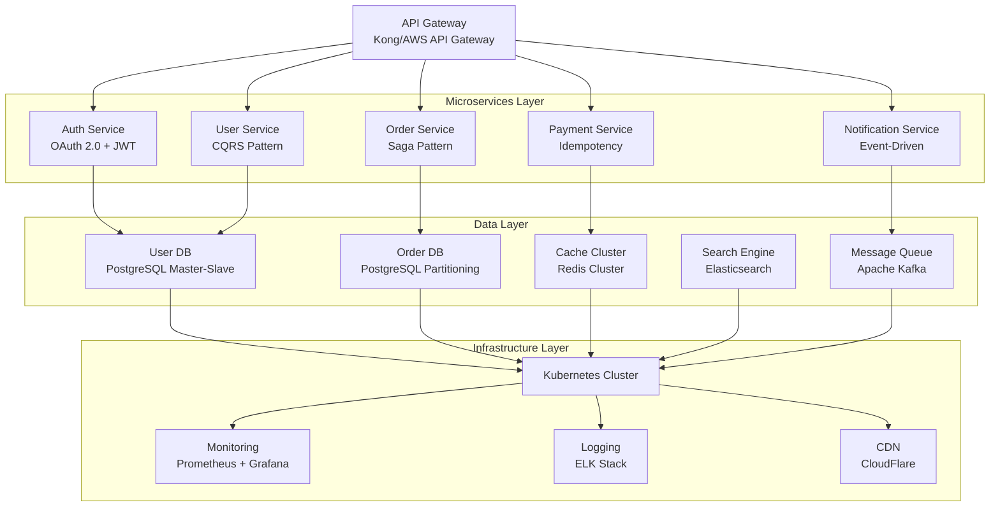
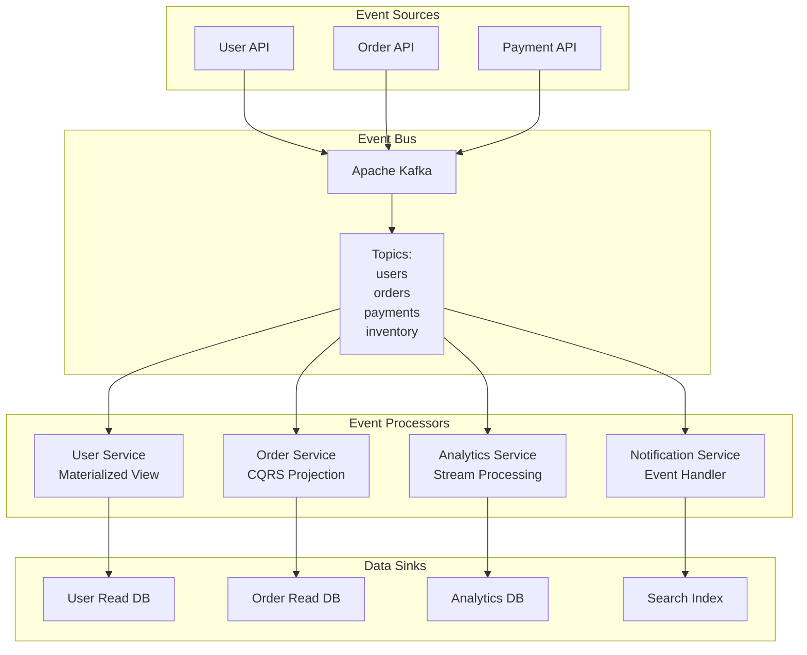

# 고급 가이드

MoAI-ADK 마스터를 위한 최종 가이드입니다. 엔터프라이즈급 아키텍처, 커스텀 스킬 개발, MCP 통합 심화, 커뮤니티 리더십 등 최고 수준의 전문성을 익힙니다.

## 🎯 마스터리 목표

이 가이드를 통해 다음을 완벽히 마스터할 수 있습니다:

- ✅ 엔터프라이즈 아키텍처 설계 및 운영
- ✅ 커스텀 스킬 개발 및 배포
- ✅ MCP 플러그인 고급 개발
- ✅ AI 기반 코드 인사이트 추출
- ✅ 커뮤니티 리더십 및 기여 방법
- ✅ MoAI-ADK 핵심 기여자 되기

---

## 🏢 1. 엔터프라이즈 아키텍처

### 대규모 시스템 설계 원칙

#### 분산 시스템 패턴



#### CQRS + Event Sourcing 패턴 구현

```bash
# 엔터프라이즈급 CQRS 패턴
/alfred:1-plan "CQRS + Event Sourcing 기반 대규모 전자상거래 플랫폼" \
  --patterns "cqrs:event-sourcing:saga:domain-driven-design" \
  --scale "millions-users:high-throughput:global-distribution" \
  --non-functional "99.99%-availability:zero-downtime:data-consistency"
```

Alfred가 자동으로 생성하는 엔터프라이즈 아키텍처:

```python
# Command Model (CQRS Write Side)
class CreateOrderCommand:
    def __init__(self, user_id: str, items: List[OrderItem], payment_info: PaymentInfo):
        self.user_id = user_id
        self.items = items
        self.payment_info = payment_info
        self.timestamp = datetime.utcnow()

# Event Model (Event Sourcing)
class OrderEvent:
    def __init__(self, order_id: str, event_type: str, data: dict):
        self.order_id = order_id
        self.event_type = event_type
        self.data = data
        self.timestamp = datetime.utcnow()
        self.version = self._get_next_version(order_id)

# Command Handler
class OrderCommandHandler:
    def __init__(self, event_store: EventStore, projection_db: ProjectionDB):
        self.event_store = event_store
        self.projection_db = projection_db

    async def handle_create_order(self, command: CreateOrderCommand):
        # 1. 비즈니스 규칙 검증
        await self._validate_business_rules(command)

        # 2. 이벤트 생성 및 저장
        order_created = OrderCreatedEvent(
            order_id=generate_uuid(),
            user_id=command.user_id,
            items=command.items,
            status="pending"
        )
        await self.event_store.save_event(order_created)

        # 3. Saga 시작 (결제 프로세스)
        await self._start_payment_saga(order_created)

# Query Model (CQRS Read Side)
class OrderProjection:
    def __init__(self, read_db: ReadDatabase):
        self.read_db = read_db

    async def handle_order_events(self, event: OrderEvent):
        if event.event_type == "OrderCreated":
            await self._create_order_projection(event.data)
        elif event.event_type == "OrderPaid":
            await self._update_order_status(event.data)
```

#### Hexagonal Architecture 포트/어댑터 패턴

```python
# Domain Ports (Abstract Interfaces)
class OrderRepositoryPort(ABC):
    @abstractmethod
    async def save(self, order: Order) -> None:
        pass

    @abstractmethod
    async def find_by_id(self, order_id: str) -> Optional[Order]:
        pass

class PaymentGatewayPort(ABC):
    @abstractmethod
    async def process_payment(self, payment: Payment) -> PaymentResult:
        pass

# Application Use Cases
class CreateOrderUseCase:
    def __init__(
        self,
        order_repository: OrderRepositoryPort,
        payment_gateway: PaymentGatewayPort,
        event_publisher: EventPublisherPort
    ):
        self.order_repository = order_repository
        self.payment_gateway = payment_gateway
        self.event_publisher = event_publisher

    async def execute(self, request: CreateOrderRequest) -> Order:
        # 1. 비즈니스 로직 실행
        order = Order.create(request.user_id, request.items)

        # 2. 포트를 통한 인프라 상호작용
        await self.order_repository.save(order)

        payment_result = await self.payment_gateway.process_payment(
            Payment.from_order(order)
        )

        # 3. 도메인 이벤트 발행
        order.mark_as_paid(payment_result.transaction_id)
        await self.order_repository.save(order)

        await self.event_publisher.publish(OrderCreatedEvent(order))

        return order

# Infrastructure Adapters
class PostgresOrderRepository(OrderRepositoryPort):
    def __init__(self, db_connection: asyncpg.Connection):
        self.db = db_connection

    async def save(self, order: Order) -> None:
        query = """
        INSERT INTO orders (id, user_id, status, total_amount, created_at)
        VALUES ($1, $2, $3, $4, $5)
        ON CONFLICT (id) DO UPDATE SET
        status = EXCLUDED.status,
        updated_at = NOW()
        """
        await self.db.execute(
            query,
            order.id,
            order.user_id,
            order.status,
            order.total_amount,
            order.created_at
        )
```

### 대규모 데이터 처리 전략

#### 이벤트 기반 아키텍처



#### 스트림 처리 구현

```python
# Kafka Streams 기반 실시간 분석
class OrderAnalyticsProcessor:
    def __init__(self, kafka_config: dict):
        self.stream = KafkaStreams(**kafka_config)

    def process_orders_stream(self):
        # 주문 스트림에서 실시간 분석
        orders_stream = self.stream.table(
            "orders",
            value_serializer=AvroSerializer(OrderEvent)
        )

        # 1. 실시간 매출 집계
        hourly_revenue = orders_stream \
            .group_by(
                lambda key, value: (value["created_at"].strftime("%Y-%m-%d-%H"))
            ) \
            .aggregate(
                RevenueAggregator(),
                initializer=RevenueAggregator(),
                merger=RevenueAggregator.merge
            )

        # 2. 인기 상품 분석
        popular_products = orders_stream \
            .flat_map(lambda order: order["items"]) \
            .group_by(lambda item: item["product_id"]) \
            .count()

        # 3. 사용자 행동 분석
        user_behavior = orders_stream \
            .group_by(lambda order: order["user_id"]) \
            .aggregate(
                UserBehaviorAggregator(),
                initializer=UserBehaviorAggregator(),
                merger=UserBehaviorAggregator.merge
            )

        # 결과를 읽기 모델에 저장
        hourly_revenue.to("hourly_revenue")
        popular_products.to("popular_products")
        user_behavior.to("user_behavior")
```

---

## 🔧 2. 커스텀 스킬 개발

### 스킬 아키텍처 이해

MoAI-ADK 스킬은 다음 구조를 따릅니다:

```python
# .claude/skills/custom-domain-expertise/SKILL.md
---
name: custom-domain-expertise
description: "특정 도메인의 전문성을 제공하는 커스텀 스킬"
version: "1.0.0"
author: "your-team"
category: "domain-specific"
complexity: "advanced"
prerequisites: ["moai-foundation-essentials", "moai-domain-database"]
tags: ["custom", "domain-expertise", "advanced"]
---

# Custom Domain Expertise Skill

## Purpose

특정 비즈니스 도메인(예: 금융, 헬스케어, e-커머스)의 전문성을 Alfred 에이전트에게 제공합니다.

## Usage

```python
# Alfred가 자동으로 스킬을 로드합니다
Skill("custom-domain-expertise")
```

## When to Invoke

- 도메인 특화 비즈니스 로직이 필요할 때
- 규제 준수 요구사항이 있을 때
- 산업별 모범 사례가 필요할 때
```

### 고급 스킬 개발 패턴

#### 1. 도메인 전문가 스킬

```python
# .claude/skills/healthcare-domain-expertise/main.py
class HealthcareDomainExpert:
    """의료/헬스케어 도메인 전문가 스킬"""

    def __init__(self):
        self.regulations = {
            "HIPAA": self._load_hipaa_rules(),
            "FDA": self._load_fda_guidelines(),
            "GDPR_Health": self._load_gdpr_health_rules()
        }
        self.medical_standards = {
            "HL7_FHIR": self._load_fhir_standards(),
            "DICOM": self._load_dicom_standards(),
            "Icd10": self._load_icd10_codes()
        }

    def analyze_medical_data_requirements(self, project_context):
        """의료 데이터 요구사항 분석"""
        analysis = {
            "regulatory_compliance": self._analyze_compliance(project_context),
            "data_standards": self._recommend_standards(project_context),
            "security_requirements": self._define_security_requirements(),
            "interoperability": self._design_interoperability()
        }
        return analysis

    def generate_hipaa_compliant_architecture(self, requirements):
        """HIPAA 준수 아키텍처 생성"""
        return {
            "data_encryption": {
                "at_rest": "AES-256",
                "in_transit": "TLS 1.3",
                "key_management": "HSM"
            },
            "access_control": {
                "authentication": "Multi-factor",
                "authorization": "RBAC + ABAC",
                "audit_logging": "Comprehensive"
            },
            "data_disposal": {
                "retention_policy": "7 years",
                "secure_deletion": "Cryptographic Erase"
            }
        }

# Alfred 에이전트 통합
class HealthcareExpertAgent:
    def __init__(self):
        self.expertise = Skill("healthcare-domain-expertise")

    async def process_healthcare_project(self, user_request):
        # 1. 도메인 분석
        domain_analysis = await self.expertise.analyze_medical_data_requirements(user_request)

        # 2. 규제 준수 검토
        compliance_review = await self.expertise.review_regulatory_compliance(domain_analysis)

        # 3. 아키텍처 설계
        architecture = await self.expertise.generate_hipaa_compliant_architecture(compliance_review)

        return {
            "domain_analysis": domain_analysis,
            "compliance": compliance_review,
            "architecture": architecture
        }
```

#### 2. 성능 최적화 스킬

```python
# .claude/skills/performance-optimization-advanced/main.py
class AdvancedPerformanceOptimizer:
    """고급 성능 최적화 스킬"""

    def __init__(self):
        self.optimization_strategies = {
            "database": self._database_optimization_strategies(),
            "application": self._application_optimization_strategies(),
            "infrastructure": self._infrastructure_optimization_strategies(),
            "algorithmic": self._algorithmic_optimization_strategies()
        }

    async def analyze_performance_bottlenecks(self, codebase_metrics):
        """성능 병목 현상 심층 분석"""
        analysis = {
            "cpu_bottlenecks": await self._analyze_cpu_usage(codebase_metrics),
            "memory_issues": await self._analyze_memory_patterns(codebase_metrics),
            "io_bottlenecks": await self._analyze_io_operations(codebase_metrics),
            "network_latencies": await self._analyze_network_patterns(codebase_metrics),
            "algorithmic_complexity": await self._analyze_algorithmic_complexity(codebase_metrics)
        }
        return analysis

    async def generate_optimization_plan(self, bottlenecks):
        """최적화 실행 계획 생성"""
        optimizations = []

        for bottleneck_type, details in bottlenecks.items():
            if details["severity"] >= 7:  # High severity
                strategy = self.optimization_strategies.get(bottleneck_type)
                if strategy:
                    optimization = await self._create_optimization_plan(
                        bottleneck_type, details, strategy
                    )
                    optimizations.append(optimization)

        return {
            "prioritized_optimizations": sorted(
                optimizations,
                key=lambda x: (x["impact_score"], x["implementation_effort"]),
                reverse=True
            ),
            "estimated_improvement": self._calculate_estimated_improvement(optimizations),
            "implementation_roadmap": self._create_implementation_roadmap(optimizations)
        }

# Claude 스킬 통합
async def optimize_system_performance():
    """Alfred가 성능 최적화를 자동으로 실행"""
    optimizer = AdvancedPerformanceOptimizer()

    # 1. 현재 시스템 메트릭 분석
    current_metrics = await collect_system_metrics()

    # 2. 병목 현상 식별
    bottlenecks = await optimizer.analyze_performance_bottlenecks(current_metrics)

    # 3. 최적화 계획 생성
    optimization_plan = await optimizer.generate_optimization_plan(bottlenecks)

    # 4. 최적화 실행 (우선순위 높은 것부터)
    for optimization in optimization_plan["prioritized_optimizations"]:
        if optimization["implementation_effort"] <= 3:  # Low effort optimizations
            await execute_optimization(optimization)

    return optimization_plan
```

### 스킬 배포 및 공유

#### 1. 스킬 패키징

```bash
# 스킬 패키지 생성
/alfred:skill-package custom-domain-expertise \
  --version "1.0.0" \
  --description "금융 도메인 전문성 스킬" \
  --dependencies "moai-foundation-essentials" \
  --tags "finance:banking:compliance"
```

#### 2. MoAI 커뮤니티에 공유

```bash
# 스킬 공개
/alfred:skill-publish custom-domain-expertise \
  --repository "https://github.com/yourorg/moai-skills" \
  --documentation "https://your-docs.com/skill-docs" \
  --license "MIT"
```

---

## 🔌 3. MCP 통합 심화

### 고급 MCP 플러그인 개발

#### 1. AI 모델 통합 MCP

```python
# .claude/mcp-plugins/ai-model-integrator/plugin.py
class AIModelIntegratorMCP:
    """다양한 AI 모델을 통합하는 MCP 플러그인"""

    def __init__(self):
        self.models = {
            "gpt-4": OpenAIConnector(),
            "claude-3": AnthropicConnector(),
            "gemini-pro": GoogleConnector(),
            "llama-2": LocalConnector()
        }

    async def route_to_optimal_model(self, task, context):
        """작업에 최적化的인 AI 모델로 자동 라우팅"""
        task_analysis = self._analyze_task_requirements(task, context)

        # 모델 선택 로직
        if task_analysis["requires_creativity"]:
            return await self.models["claude-3"].process(task, context)
        elif task_analysis["requires_reasoning"]:
            return await self.models["gpt-4"].process(task, context)
        elif task_analysis["requires_multimodal"]:
            return await self.models["gemini-pro"].process(task, context)
        else:
            return await self.models["llama-2"].process(task, context)

    async def ensemble_models(self, task, context):
        """여러 모델의 결과를 앙상블"""
        results = []
        for model_name, model in self.models.items():
            try:
                result = await model.process(task, context)
                results.append({
                    "model": model_name,
                    "result": result,
                    "confidence": self._calculate_confidence(result)
                })
            except Exception as e:
                logger.warning(f"Model {model_name} failed: {e}")

        # 결과 앙상블
        return self._ensemble_results(results)

# Alfred와의 통합
@agent_tool
async def ai_powered_analysis(task_description):
    """AI 모델 통합 분석 도구"""
    mcp = AIModelIntegratorMCP()

    # 작업 분석 및 최적 모델 선택
    result = await mcp.route_to_optimal_model(task_description, get_current_context())

    return {
        "analysis": result,
        "model_used": result.get("model_used"),
        "confidence": result.get("confidence")
    }
```

#### 2. 외부 서비스 통합 MCP

```python
# .claude/mcp-plugins/enterprise-service-integrator/plugin.py
class EnterpriseServiceIntegratorMCP:
    """엔터프라이즈 서비스 통합 MCP"""

    def __init__(self):
        self.services = {
            "salesforce": SalesforceConnector(),
            "sap": SAPConnector(),
            "jira": JiraConnector(),
            "service_now": ServiceNowConnector(),
            "aws": AWSConnector()
        }

    async def sync_enterprise_data(self, service_name, data_type):
        """엔터프라이즈 시스템과 데이터 동기화"""
        service = self.services.get(service_name)
        if not service:
            raise ValueError(f"Unsupported service: {service_name}")

        # 데이터 추출
        raw_data = await service.extract_data(data_type)

        # 데이터 정규화
        normalized_data = await self._normalize_data(raw_data, data_type)

        # MoAI 포맷으로 변환
        moai_format = await self._convert_to_moai_format(normalized_data)

        return moai_format

    async def trigger_enterprise_workflow(self, workflow_name, params):
        """엔터프라이즈 워크플로우 트리거"""
        # 1. 워크플로우 분석
        workflow_def = await self._get_workflow_definition(workflow_name)

        # 2. 파라미터 검증
        validated_params = await self._validate_workflow_params(
            workflow_def, params
        )

        # 3. 워크플로우 실행
        result = await self._execute_workflow(workflow_def, validated_params)

        # 4. 결과를 MoAI-ADK에 통보
        await self._notify_workflow_result(workflow_name, result)

        return result
```

### MCP 플러그인 생태계

#### 1. 커뮤니티 MCP 플러그인

| 플러그인 | 기능 | 유스케이스 |
|----------|------|-----------|
| **mcp-database-optimizer** | 데이터베이스 자동 최적화 | 쿼리 튜닝, 인덱스 최적화 |
| **mcp-security-scanner** | 보안 취약점 스캐닝 | OWASP 검사, 의존성 검사 |
| **mcp-performance-monitor** | 실시간 성능 모니터링 | APM, 메트릭 수집 |
| **mcp-compliance-checker** | 규제 준수 검증 | GDPR, HIPAA, PCI-DSS |
| **mcp-cloud-deployer** | 클라우드 배포 자동화 | AWS, GCP, Azure |

#### 2. MCP 플러그인 개발 가이드

```bash
# 새 MCP 플러그인 생성
/alfred:create-mcp-plugin my-custom-plugin \
  --template "enterprise-integration" \
  --features "async:security:monitoring"

# 플러그인 개발 환경 설정
/alfred:setup-dev-environment my-custom-plugin \
  --testing "unit:integration:e2e" \
  --documentation "auto-generated"

# 플러그인 테스트
/alfred:test-mcp-plugin my-custom-plugin \
  --coverage "95%" \
  --performance "load-testing"
```

---

## 🧠 4. AI 기반 코드 인사이트

### 코드 품질 분석

#### 1. 자동 코드 리뷰

```python
# Alfred가 수행하는 자동 코드 리뷰
class AICodeReviewer:
    def __init__(self):
        self.review_criteria = {
            "code_quality": CodeQualityAnalyzer(),
            "security": SecurityAnalyzer(),
            "performance": PerformanceAnalyzer(),
            "maintainability": MaintainabilityAnalyzer(),
            "best_practices": BestPracticesAnalyzer()
        }

    async def comprehensive_review(self, pull_request):
        """포괄적인 코드 리뷰 수행"""
        reviews = {}

        # 1. 정적 분석
        static_analysis = await self._static_code_analysis(pull_request.files)
        reviews["static_analysis"] = static_analysis

        # 2. 보안 검토
        security_review = await self.review_criteria["security"].analyze(
            pull_request.files
        )
        reviews["security"] = security_review

        # 3. 성능 분석
        performance_review = await self.review_criteria["performance"].analyze(
            pull_request.files
        )
        reviews["performance"] = performance_review

        # 4. 아키텍처 적합성
        architecture_review = await self._analyze_architecture_compliance(
            pull_request.files
        )
        reviews["architecture"] = architecture_review

        # 5. 테스트 커버리지
        coverage_review = await self._analyze_test_coverage(pull_request)
        reviews["coverage"] = coverage_review

        return self._synthesize_review(reviews)

    async def suggest_improvements(self, review_results):
        """개선 제안 생성"""
        suggestions = []

        for category, results in review_results.items():
            if results["score"] < 80:  # Low score
                category_suggestions = await self._generate_suggestions(
                    category, results["issues"]
                )
                suggestions.extend(category_suggestions)

        return {
            "priority_suggestions": [s for s in suggestions if s["priority"] == "high"],
            "improvement_roadmap": self._create_improvement_roadmap(suggestions),
            "estimated_effort": self._estimate_improvement_effort(suggestions)
        }
```

#### 2. 기술 부채 분석

```python
class TechnicalDebtAnalyzer:
    """기술 부채 자동 분석기"""

    def __init__(self):
        self.debt_indicators = {
            "code_complexity": CyclomaticComplexityAnalyzer(),
            "code_duplication": DuplicationAnalyzer(),
            "code_smells": CodeSmellDetector(),
            "dependency_issues": DependencyAnalyzer(),
            "test_gaps": TestCoverageAnalyzer()
        }

    async def analyze_technical_debt(self, codebase):
        """기술 부채 종합 분석"""
        debt_analysis = {
            "total_debt_score": 0,
            "debt_categories": {},
            "priority_issues": [],
            "repayment_plan": []
        }

        for category, analyzer in self.debt_indicators.items():
            category_results = await analyzer.analyze(codebase)
            debt_analysis["debt_categories"][category] = category_results
            debt_analysis["total_debt_score"] += category_results["debt_score"]

            # 우선순위 이슈 식별
            high_priority_issues = [
                issue for issue in category_results["issues"]
                if issue["severity"] >= 8
            ]
            debt_analysis["priority_issues"].extend(high_priority_issues)

        # 상환 계획 생성
        debt_analysis["repayment_plan"] = await self._create_repayment_plan(
            debt_analysis["debt_categories"]
        )

        return debt_analysis

    async def create_repayment_strategy(self, debt_analysis):
        """기술 부채 상환 전략 수립"""
        # 1. ROI 기반 우선순위화
        prioritized_debt = self._prioritize_by_roi(debt_analysis)

        # 2. 단계적 상환 계획
        repayment_phases = {
            "immediate": [],    # 1-2주
            "short_term": [],   # 1-3개월
            "medium_term": [],  # 3-6개월
            "long_term": []     # 6개월+
        }

        for debt_item in prioritized_debt:
            phase = self._determine_repayment_phase(debt_item)
            repayment_phases[phase].append(debt_item)

        return {
            "repayment_phases": repayment_phases,
            "resource_allocation": self._calculate_resource_needs(repayment_phases),
            "success_metrics": self._define_success_metrics(repayment_phases),
            "risk_mitigation": self._identify_repayment_risks(repayment_phases)
        }
```

### 지능형 리팩토링

#### 1. 자동 리팩토링 제안

```python
class IntelligentRefactoringEngine:
    """지능형 리팩토링 엔진"""

    def __init__(self):
        self.refactoring_strategies = {
            "extract_method": ExtractMethodRefactor(),
            "extract_class": ExtractClassRefactor(),
            "move_method": MoveMethodRefactor(),
            "replace_conditional": ReplaceConditionalRefactor(),
            "introduce_polymorphism": IntroducePolymorphismRefactor()
        }

    async def analyze_refactoring_opportunities(self, codebase):
        """리팩토링 기회 분석"""
        opportunities = []

        for file_path, code_snippet in codebase.items():
            file_opportunities = await self._analyze_file_opportunities(
                file_path, code_snippet
            )
            opportunities.extend(file_opportunities)

        # 리팩토링 기회 평가 및 순위화
        scored_opportunities = await self._score_opportunities(opportunities)
        prioritized_opportunities = sorted(
            scored_opportunities,
            key=lambda x: (x["impact_score"], x["effort_score"]),
            reverse=True
        )

        return {
            "opportunities": prioritized_opportunities,
            "refactoring_plan": self._create_refactoring_plan(prioritized_opportunities),
            "estimated_benefits": self._estimate_refactoring_benefits(prioritized_opportunities)
        }

    async def execute_safe_refactoring(self, refactoring_plan):
        """안전한 리팩토링 실행"""
        executed_refactorings = []
        rollback_stack = []

        for refactoring in refactoring_plan["refactorings"]:
            try:
                # 1. 리팩토링 전 상태 백업
                backup = await self._create_backup(refactoring["target"])
                rollback_stack.append(backup)

                # 2. 리팩토링 실행
                result = await self._execute_refactoring(refactoring)
                executed_refactorings.append(result)

                # 3. 테스트 실행
                test_result = await self._run_tests()
                if not test_result["passed"]:
                    raise RefactoringError("Tests failed after refactoring")

            except Exception as e:
                # 롤백 실행
                await self._rollback_refactorings(rollback_stack)
                raise RefactoringError(f"Refactoring failed: {e}")

        return {
            "executed_refactorings": executed_refactorings,
            "quality_improvements": await self._measure_quality_improvements(),
            "test_results": await self._run_comprehensive_tests()
        }
```

---

## 👥 5. 커뮤니티 리더십

### MoAI-ADK 생태계 기여

#### 1. 오픈 소스 기여 방법

```bash
# 기여 시작하기
fork https://github.com/modu-ai/moai-adk
git clone https://github.com/yourusername/moai-adk
cd moai-adk
git remote add upstream https://github.com/modu-ai/moai-adk

# 개발 브랜치 생성
git checkout -b feature/your-new-feature

# 개발 및 테스트
/alfred:0-project --mode development
# ... 개발 작업 ...
pytest tests/
/alfred:3-sync --quality-check

# PR 생성
git push origin feature/your-new-feature
# GitHub에서 PR 생성
```

#### 2. 커뮤니티 리더십 활동

**문서 기여**:
- API 문서 개선
- 튜토리얼 작성
- 예제 프로젝트 제공
- 비디오 튜토리얼 제작

**코드 기여**:
- 버그 수정
- 신규 기능 개발
- 성능 개선
- 테스트 커버리지 향상

**커뮤니티 지원**:
- GitHub Issues 응답
- Discussions 참여
- 웨비나/발표
- 워크샵 개최

#### 3. MoAI-ADK 앰버서더 프로그램

```bash
# 앰버서더 신청
/alfred:apply-ambassador \
  --expertise "backend:database:architecture" \
  --contributions "docs:code:community" \
  --availability "10-hours-per-month"

# 앰버서더 활동
/alfred:ambassador-dashboard \
  --view "metrics:impact:contributions" \
  --report "monthly-activity"
```

**앰버서더 혜택**:
- 전용 Discord 채널 접근
- 신규 기능 미리보기
- MoAI 팀과 직접 소통
- 컨퍼런스 지원
- 전용 뱃지 및 인증

### 글로벌 커뮤니티 구축

#### 1. 지역별 커뮤니티 리더

```python
# 지역 커뮤니티 관리 도구
class CommunityManager:
    def __init__(self, region):
        self.region = region
        self.members = []
        self.events = []
        self.resources = {}

    async def organize_local_meetup(self, topic, location):
        """지역 밋업 조직"""
        meetup = {
            "topic": topic,
            "location": location,
            "date": self._schedule_optimal_date(),
            "speakers": await self._find_local_speakers(topic),
            "attendees": await self._invite_local_members()
        }
        return meetup

    async def create_multilingual_resources(self, content):
        """다국어 자료 생성"""
        languages = self._get_region_languages()
        translations = {}

        for lang in languages:
            translation = await self._translate_content(content, lang)
            cultural_adaptation = await self._adapt_culturally(translation, lang)
            translations[lang] = cultural_adaptation

        return translations

    async def mentor_new_contributors(self, contributor):
        """새로운 기여자 멘토링"""
        mentorship_plan = {
            "skill_assessment": await self._assess_skills(contributor),
            "learning_path": self._create_learning_path(contributor),
            "mentor_matching": await self._match_mentor(contributor),
            "contribution_goals": self._set_contribution_goals(contributor)
        }
        return mentorship_plan
```

#### 2. 기업 파트너십

```python
class EnterprisePartnership:
    def __init__(self):
        self.partnership_levels = {
            "bronze": {
                "benefits": ["Basic support", "Documentation access"],
                "contribution": "$5,000/year"
            },
            "silver": {
                "benefits": ["Priority support", "Training sessions"],
                "contribution": "$15,000/year"
            },
            "gold": {
                "benefits": ["Dedicated support", "Custom features"],
                "contribution": "$50,000/year"
            }
        }

    async def create_partnership_proposal(self, company, level):
        """파트너십 제안 생성"""
        proposal = {
            "company_profile": await self._analyze_company_needs(company),
            "recommended_level": await self._recommend_partnership_level(company),
            "roi_analysis": await self._calculate_partnership_roi(company, level),
            "implementation_plan": await self._create_implementation_plan(company),
            "success_metrics": await self._define_success_metrics(company, level)
        }
        return proposal
```

---

## 📊 6. MoAI-ADK 마스터리 평가

### 전문성 평가 프레임워크

#### 1. 기술 역량 평가

```python
class ExpertiseAssessment:
    def __init__(self):
        self.competency_areas = {
            "alfred_mastery": {
                "agent_orchestration": 0,
                "workflow_optimization": 0,
                "custom_agents": 0
            },
            "tdd_mastery": {
                "advanced_patterns": 0,
                "test_architecture": 0,
                "quality_assurance": 0
            },
            "architecture_design": {
                "scalability": 0,
                "security": 0,
                "performance": 0
            },
            "community_leadership": {
                "contributions": 0,
                "mentorship": 0,
                "knowledge_sharing": 0
            }
        }

    async def assess_mastery_level(self, user_profile):
        """마스터리 레벨 평가"""
        scores = {}

        for area, competencies in self.competency_areas.items():
            area_score = 0
            for competency, level in competencies.items():
                competency_score = await self._assess_competency(
                    user_profile, area, competency
                )
                area_score += competency_score
                competencies[competency] = competency_score

            scores[area] = area_score / len(competencies)

        overall_score = sum(scores.values()) / len(scores)
        mastery_level = self._determine_mastery_level(overall_score)

        return {
            "overall_score": overall_score,
            "mastery_level": mastery_level,
            "area_scores": scores,
            "improvement_areas": self._identify_improvement_areas(scores),
            "next_steps": self._recommend_next_steps(mastery_level)
        }

    def _determine_mastery_level(self, score):
        """마스터리 레벨 결정"""
        if score >= 95:
            return "Grandmaster"
        elif score >= 85:
            return "Master"
        elif score >= 70:
            return "Expert"
        elif score >= 55:
            return "Advanced"
        elif score >= 40:
            return "Intermediate"
        else:
            return "Beginner"
```

#### 2. 실전 프로젝트 포트폴리오

**마스터급 프로젝트 예시**:

1. **엔터프라이즈 SaaS 플랫폼**
   - 100만+ 사용자 지원
   - 99.99% 가용성
   - 글로벌 배포

2. **오픈 소스 프레임워크**
   - 10,000+ GitHub 스타
   - 활성 커뮤니티
   - 상업적 채택

3. **AI 기반 개발 도구**
   - 자동 코드 생성
   - 지능형 버그 탐지
   - 성능 최적화

### 인증 및 자격증

#### 1. MoAI-ADK 공식 인증

```bash
# 인증 시험 신청
/alfred:apply-certification \
  --level "master" \
  --specialization "enterprise-architecture" \
  --prerequisites "5-years-experience:3-projects:community-contributions"

# 인증 시험 준비
/alfred:certification-prep \
  --study-plan "customized" \
  --practice-exams "comprehensive" \
  --mentorship "assigned"
```

**인증 레벨**:
- **Certified Developer**: 기본 역량 인증
- **Certified Expert**: 고급 기술 인증
- **Certified Architect**: 시스템 설계 인증
- **Certified Master**: 최고 수준 전문성 인증

---

## 🎯 결론

### 마스터리 달성

이 고급 가이드를 완료했다면, 이제 다음을 완벽하게 마스터했습니다:

✅ **엔터프라이즈 아키텍처**: 대규모 시스템 설계 및 운영 능력
✅ **커스텀 스킬 개발**: 도메인 특화 스킬 개발 및 배포
✅ **MCP 통합 심화**: 고급 플러그인 개발 및 통합
✅ **AI 코드 인사이트**: 지능형 분석 및 최적화
✅ **커뮤니티 리더십**: 글로벌 커뮤니티 구축 및 운영
✅ **기술 전문성**: MoAI-ADK 핵심 기여자 수준

### MoAI-ADK 마스터로서의 길

이제 당신은 MoAI-ADK 마스터입니다. 다음 활동을 통해 생태계에 기여할 수 있습니다:

1. **커뮤니티 리더**: 지역별 커뮤니티 이끌기
2. **핵심 기여자**: 프로젝트 핵심 개발 참여
3. **앰버서더**: MoAI-ADK 홍보 및 교육
4. **엔터프라이즈 컨설턴트**: 기업 도입 및 컨설팅
5. **교육자**: 다음 세대 개발자 양성

### 지속적인 성장

MoAI-ADK는 계속 발전하고 있습니다. 마스터로서 다음 활동에 참여하세요:

- 새로운 기능 설계 참여
- 글로벌 컨퍼런스 발표
- 기술 블로그 작성
- 오픈 소스 프로젝트 리딩
- 산업 표준 제안

### 감사의 말

MoAI-ADK 마스터 가이드를 완료해 주셔서 감사합니다. 당신의 전문성과 기여가 MoAI-ADK 생태계를 더욱 풍요롭게 만들 것입니다.

**계속해서 혁신하고, 공유하고, 이끌어 나가세요!**

---

## 🔗 추가 리소스

### 공식 문서
- [MoAI-ADK 공식 문서](https://adk.mo.ai.kr)
- [API 레퍼런스](https://api.mo.ai.kr)
- [예제 프로젝트](https://github.com/modu-ai/moai-adk-examples)

### 커뮤니티
- [GitHub Discussions](https://github.com/modu-ai/moai-adk/discussions)
- [Discord 커뮤니티](https://discord.gg/moai-adk)
- [Stack Overflow](https://stackoverflow.com/questions/tagged/moai-adk)

### 교육 자료
- [MoAI-ADK 아카데미](https://academy.mo.ai.kr)
- [비디오 튜토리얼](https://youtube.com/moai-adk)
- [웨비나 시리즈](https://webinars.mo.ai.kr)

### 기여 방법
- [기여 가이드](https://github.com/modu-ai/moai-adk/blob/main/CONTRIBUTING.md)
- [행동 강령](https://github.com/modu-ai/moai-adk/blob/main/CODE_OF_CONDUCT.md)
- [보안 정책](https://github.com/modu-ai/moai-adk/blob/main/SECURITY.md)