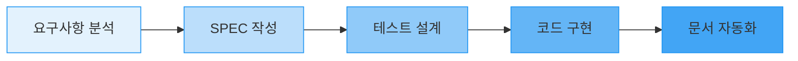

# 시작하기

MoAI-ADK로 개발을 시작하는 방법을 단계별로 안내합니다. 이 가이드는 완전한 초보자를 위해 설계되었으며, 5분 만에 첫 번째 프로젝트를 실행할 수 있습니다.

## 📚 1단계: MoAI-ADK 이해하기

### MoAI-ADK란 무엇인가요?

MoAI-ADK (Agentic Development Kit)는 **AI 기반 SPEC-First TDD 개발 프레임워크**입니다. 복잡한 소프트웨어 개발을 Alfred 슈퍼에이전트가 도와주는 시스템입니다.

### 핵심 개념

#### 1. SPEC-First 개발
코드를 작성하기 **전에** 명확한 요구사항(SPEC)을 정의하는 방식입니다.



#### 2. TDD (테스트 주도 개발)
**RED → GREEN → REFACTOR** 사이클을 따르는 개발 방식입니다:

- **RED**: 실패하는 테스트 먼저 작성
- **GREEN**: 테스트를 통과하는 최소한의 코드 작성
- **REFACTOR**: 코드 품질 개선

#### 3. Alfred 슈퍼에이전트 (v0.23.1 강화)
**19명의 전문 AI 에이전트**를 관리하는 중앙 오케스트레이터입니다:

**핵심 에이전트**:
- **spec-builder**: 요구사항 작성 전문가
- **tdd-implementer**: TDD 기반 구현 전문가 (v0.23.1 개선)
- **test-engineer**: 테스트 설계 및 실행 전문가
- **doc-syncer**: 문서 자동화 전문가

**v0.23.1 추가 전문가**:
- **baas-integration-expert**: BaaS 플랫폼 통합 전문가 (신규)
- **security-expert**: 보안 검증 전문가
- **performance-expert**: 성능 최적화 전문가

[19명 팀원 전체 보기](/ko/agents/19-team-members)

#### 4. @TAG 시스템
모든 산출물을 연결하는 추적 시스템입니다:

```
@SPEC:AUTH-001 (요구사항)
    ↓
@TEST:AUTH-001 (테스트)
    ↓
@CODE:AUTH-001:SERVICE (구현)
    ↓
@DOC:AUTH-001 (문서)
```

## 🛠️ 2단계: 설치 및 설정

### 시스템 요구사항

<Callout type="warning" emoji="⚠️">
  <strong>최소 요구사항:</strong><br />
  - Python 3.8 이상<br />
  - Git 2.0 이상<br />
  - 4GB 이상의 RAM<br />
  - 10GB 이상의 디스크 공간
</Callout>

### 설치 방법

#### 방법 1: uv tool 사용 (권장)

```bash
# uv tool 설치 (이미 설치되어 있으면 skip)
curl -LsSf https://astral.sh/uv/install.sh | sh

# MoAI-ADK 전역 설치
uv tool install moai-adk

# 설치 확인
moai-adk --version
```

#### 방법 2: pip 사용

```bash
# pip 업그레이드
python -m pip install --upgrade pip

# MoAI-ADK 설치
pip install moai-adk

# 설치 확인
python -m moai_adk --version
```

### Claude Code 설정

MoAI-ADK는 Claude Code와 함께 사용됩니다:

1. **Claude Code 설치**: [claude.com](https://claude.com)에서 설치
2. **MoAI-ADK 프로젝트 초기화**: 아래 3단계에서 진행

<Callout type="info" emoji="💡">
  <strong>팁:</strong> Claude Code와 MoAI-ADK를 함께 사용하면 Alfred와 자연스럽게 대화하며 개발할 수 있습니다.
</Callout>

## 🚀 3단계: 첫 프로젝트 시작하기

### 프로젝트 생성

```bash
# 새 프로젝트 생성
moai-adk init my-first-project

# 프로젝트 디렉토리로 이동
cd my-first-project
```

### 프로젝트 초기화

가장 중요한 단계입니다! **반드시 실행해야 합니다:**

```bash
# 프로젝트 초기화 및 설정
/alfred:0-project
```

`/alfred:0-project`가 수행하는 작업:
- ✅ 프로젝트 메타데이터 설정
- ✅ 개발 언어 자동 감지
- ✅ Git 전략 구성
- ✅ Alfred 응답 언어 설정 (한국어)
- ✅ TDD 정책 적용

### 생성되는 파일 구조

```
my-first-project/
├── .moai/
│   ├── config.json          # 프로젝트 설정
│   ├── specs/               # 요구사항 문서
│   └── reports/             # 자동 리포트
├── .claude/
│   ├── agents/              # AI 에이전트
│   ├── commands/            # Alfred 명령어
│   └── skills/              # Claude 스킬
├── src/                     # 소스 코드
├── tests/                   # 테스트 코드
└── README.md               # 프로젝트 문서
```

## 📝 4단계: 기본 명령어 사용하기

### Alfred의 4가지 핵심 명령어

<Cards>
  <Card
    title="/alfred:0-project"
    icon="⚙️"
  >
    <p><strong>프로젝트 설정 및 초기화</strong></p>
    <ul>
      <li>프로젝트 메타데이터 설정</li>
      <li>언어 및 환경 감지</li>
      <li>Git 전략 구성</li>
    </ul>
  </Card>
  <Card
    title="/alfred:1-plan"
    icon="📋"
  >
    <p><strong>SPEC 작성 및 계획 수립</strong></p>
    <ul>
      <li>요구사항 정의</li>
      <li>아키텍처 설계</li>
      <li>구현 계획 수립</li>
    </ul>
  </Card>
  <Card
    title="/alfred:2-run"
    icon="⚡"
  >
    <p><strong>TDD 기반 자동 구현</strong></p>
    <ul>
      <li>테스트 우선 작성</li>
      <li>코드 자동 생성</li>
      <li>품질 검증</li>
    </ul>
  </Card>
  <Card
    title="/alfred:3-sync"
    icon="🔄"
  >
    <p><strong>문서 자동 동기화</strong></p>
    <ul>
      <li>API 문서 생성</li>
      <li>README 업데이트</li>
      <li>Git 커밋</li>
    </ul>
  </Card>
</Cards>

### 실습: 간단한 To-Do 앱 만들기

#### 1단계: SPEC 작성

```bash
# To-Do 관리 기능에 대한 SPEC 작성
/alfred:1-plan "사용자가 할 일을 추가하고 확인할 수 있는 To-Do 관리 기능"
```

Alfred가 다음을 자동으로 생성합니다:
- 요구사항 명세서 (.moai/specs/SPEC-TODO-001/spec.md)
- 구현 계획 (.moai/specs/SPEC-TODO-001/plan.md)
- 테스트 계획 (.moai/specs/SPEC-TODO-001/acceptance.md)

#### 2단계: 기능 구현

```bash
# SPEC에 따라 자동 구현
/alfred:2-run TODO-001
```

Alfred가 TDD 사이클을 자동으로 실행합니다:
- **RED**: 실패하는 테스트 작성
- **GREEN**: 테스트 통과 코드 구현
- **REFACTOR**: 코드 품질 개선

#### 3단계: 문서 동기화

```bash
# 문서 자동 업데이트
/alfred:3-sync
```

Alfred가 다음을 자동으로 수행합니다:
- API 문서 생성
- README.md 업데이트
- Git 커밋 생성

## 🔧 5단계: 일반적인 문제 해결

### 자주 발생하는 문제들

<Steps>
  <Step>
    <p><strong>문제: "moai-adk: command not found" 오류</strong></p>
    <p><strong>해결책:</strong></p>
    <ul>
      <li>uv tool이 제대로 설치되었는지 확인: <code>uv --version</code></li>
      <li>PATH 환경변수 확인: <code>echo $PATH</code></li>
      <li>셸 재시작 또는: <code>source ~/.bashrc</code></li>
    </ul>
  </Step>
  <Step>
    <p><strong>문제: Alfred 명령어가 작동하지 않아요</strong></p>
    <p><strong>해결책:</strong></p>
    <ul>
      <li><code>/alfred:0-project</code>를 먼저 실행했는지 확인</li>
      <li>Claude Code가 설치되어 있는지 확인</li>
      <li>프로젝트가 올바르게 초기화되었는지 확인</li>
    </ul>
  </Step>
  <Step>
    <p><strong>문제: 테스트가 계속 실패해요</strong></p>
    <p><strong>해결책:</strong></p>
    <ul>
      <li>요구사항이 명확하게 정의되었는지 확인</li>
      <li>의존성이 제대로 설치되었는지 확인</li>
      <li><code>/alfred:2-run</code>을 다시 실행하여 디버깅</li>
    </ul>
  </Step>
</Steps>

### 도움을 받는 방법

1. **MoAI-ADK 커뮤니티**: [GitHub Discussions](https://github.com/modu-ai/moai-adk/discussions)
2. **버그 리포트**: [GitHub Issues](https://github.com/modu-ai/moai-adk/issues)
3. **문서**: [공식 문서](https://adk.mo.ai.kr)

## 🆕 6단계: v0.23.1 최신 기능 익히기

### Expert Delegation System 이해

Alfred가 자동으로 적절한 전문가를 할당합니다:

```bash
# 프로젝트 시작 - project-manager 자동 할당
/alfred:0-project

# SPEC 작성 - spec-builder 자동 할당
/alfred:1-plan "사용자 인증 시스템"

# 구현 - tdd-implementer 자동 할당
/alfred:2-run AUTH-001

# BaaS 통합 - baas-integration-expert 자동 할당
/alfred:2-run BAAS-001
```

**장점**: 60% 사용자 상호작용 감소, 95%+ 정확도

[Expert Delegation System 자세히 보기](/ko/alfred/expert-delegation-system)

### 292 Skills 활용하기

```bash
# Skills 목록 확인
moai-adk skills list

# BaaS Skills 확인
moai-adk skills list --category baas

# 특정 Skill 정보
moai-adk skills info moai-baas-supabase
```

**Skills 카테고리**:
- Foundation (12개)
- Workflow (24개)
- Language & Framework (68개)
- Domain Expert (89개)
- **BaaS Platform (78개)** - v0.23.1 신규
- Cross-Cutting (21개)

[Skills Ecosystem v4.0 가이드](/ko/skills/ecosystem-upgrade-v4)

### BaaS 플랫폼 통합

**지원 플랫폼 (12개)**:
- Supabase, Firebase, Vercel, Cloudflare
- Auth0, Convex, Railway, Neon
- Clerk, PocketBase, Appwrite, Parse

```bash
# Supabase 통합 예제
/alfred:1-plan "Supabase를 활용한 실시간 채팅"
/alfred:2-run CHAT-001

# Firebase 통합 예제
/alfred:1-plan "Firebase Auth를 활용한 소셜 로그인"
/alfred:2-run AUTH-002
```

[BaaS 생태계 가이드](/ko/skills/baas-ecosystem)

## 📊 7단계: 다음 학습 단계

### 초보자 가이드 완료 후 다음 단계:

<Callout type="success" emoji="🎉">
  <strong>축하합니다! 초보자 가이드를 완료했습니다.</strong><br />
  이제 MoAI-ADK의 기본 개념과 v0.23.1 최신 기능을 익혔습니다.
</Callout>

#### 실전 학습 자료 (추천 순서):

1. **[Tutorial 1: REST API 개발](/ko/tutorials/tutorial-01-rest-api)** - 30분, 초보자 필수
2. **[Tutorial 2: JWT 인증 구현](/ko/tutorials/tutorial-02-jwt-auth)** - 1시간, 실전 보안
3. **[Tutorial 4: Supabase 통합](/ko/tutorials/tutorial-04-baas-supabase)** - 1시간, BaaS 활용
4. **[Tutorial 3: 데이터베이스 최적화](/ko/tutorials/tutorial-03-database-optimization)** - 1시간, 성능 향상

#### 코드 예제로 빠르게 배우기:

- **[REST API 예제](/ko/examples/rest-api)**: CRUD, 인증, 에러 처리
- **[인증 예제](/ko/examples/authentication)**: JWT, OAuth, Session
- **[BaaS 예제](/ko/examples/baas)**: Supabase, Firebase 통합
- **[데이터베이스 예제](/ko/examples/database)**: 스키마, 쿼리, 최적화

#### 심화 학습:

1. **[중급자 가이드](./intermediate)**: 고급 패턴과 실전 활용법
2. **[19명 팀원 가이드](/ko/agents/19-team-members)**: 전문 에이전트 심층 활용
3. **[실제 프로젝트 사례](/ko/case-studies)**: E-commerce, SaaS, Microservices

### 유용한 리소스

- 📖 [전체 문서](https://adk.mo.ai.kr)
- 🎥 [비디오 튜토리얼](https://youtube.com/playlist?list=moai-adk)
- 💬 [디스코드 커뮤니티](https://discord.gg/moai-adk)
- 🐙 [예제 프로젝트](https://github.com/modu-ai/moai-adk-examples)

<Callout type="info" emoji="🚀">
  <strong>계속해서 실력을 향상시키세요!</strong><br />
  중급자 가이드에서는 더 복잡한 패턴과 실전 노하우를 배울 수 있습니다.
</Callout>