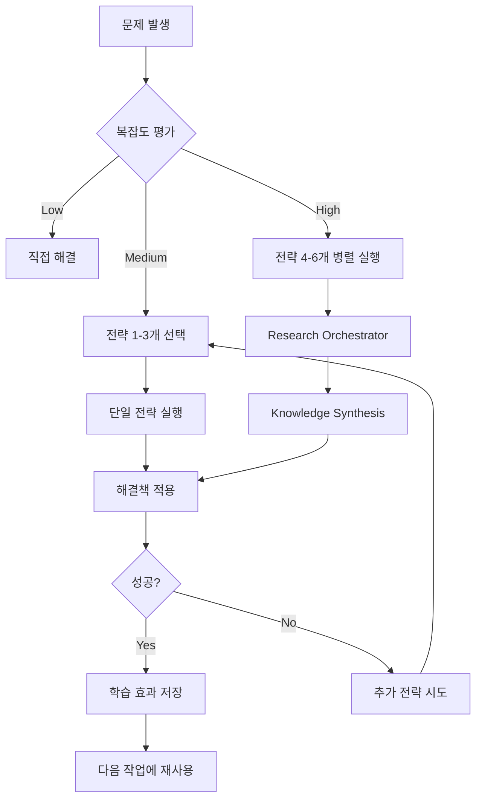

# 연구 전략 실전 활용 가이드

## 개요

이 가이드는 MoAI-ADK의 **8가지 연구 전략**을 실전 프로젝트에서 효과적으로 활용하는 방법을 다룹니다. 각 전략의 실행 절차, 도구, 함정, 그리고 실제 코드 예제를 통해 Senior Engineer처럼 문제를 해결하는 방법을 학습합니다.

### 이 가이드의 목표

- ✅ 각 전략을 **언제, 어떻게** 사용하는지 명확히 이해
- ✅ 단계별 실행 프로세스 습득
- ✅ 실전 예제로 즉시 적용 가능한 패턴 학습
- ✅ 흔한 실수 방지 및 문제 해결 능력 향상



## Strategy 1: Reproduce & Document

### 언제 사용하는가?

**사용 시점**:
- ✅ 새로운 라이브러리/API를 처음 사용할 때
- ✅ 공식 문서가 오래되었거나 불완전할 때
- ✅ 예제 코드가 작동하지 않을 때
- ✅ 버전 차이로 인한 변경사항 확인 필요 시

**사용하지 않을 때**:
- ❌ 이미 검증된 패턴이 프로젝트에 존재
- ❌ 시간이 촉박한 단순 작업
- ❌ 내부 라이브러리 (문서 재현 불필요)

### 단계별 프로세스

#### Step 1: 공식 문서 수집

```python
# research_strategy_1.py
from typing import Dict, List
import requests
from bs4 import BeautifulSoup

class DocumentReproducer:
    def __init__(self, library_name: str):
        self.library_name = library_name
        self.docs_urls = self.find_official_docs()

    def find_official_docs(self) -> List[str]:
        """공식 문서 URL 찾기"""
        search_queries = [
            f"{self.library_name} official documentation",
            f"{self.library_name} API reference",
            f"{self.library_name} quickstart guide"
        ]

        # Context7 MCP 사용 (추천)
        docs = context7.search_library_docs(self.library_name)

        return docs

    def extract_code_examples(self, doc_url: str) -> List[str]:
        """문서에서 코드 예제 추출"""
        response = requests.get(doc_url)
        soup = BeautifulSoup(response.content, 'html.parser')

        # 코드 블록 찾기
        code_blocks = soup.find_all('code')

        examples = []
        for block in code_blocks:
            if self.is_runnable(block.text):
                examples.append(block.text)

        return examples
```

#### Step 2: 최소 재현 코드 작성

```python
# 예시: Stripe API 재현
import stripe

def reproduce_stripe_payment():
    """
    공식 문서 예제 재현
    출처: https://stripe.com/docs/payments/quickstart
    """
    stripe.api_key = 'sk_test_...'

    # 문서 예제 그대로 실행
    try:
        payment_intent = stripe.PaymentIntent.create(
            amount=1000,
            currency='usd',
            payment_method_types=['card']
        )

        print(f"✅ 재현 성공: {payment_intent.id}")
        return {
            "success": True,
            "findings": [
                "amount는 센트 단위 (1000 = $10.00)",
                "payment_method_types는 배열 형태",
                "즉시 client_secret 반환"
            ]
        }

    except stripe.error.StripeError as e:
        print(f"❌ 재현 실패: {e}")
        return {
            "success": False,
            "error": str(e),
            "lesson": "API 키 권한 확인 필요"
        }
```

#### Step 3: 문서 vs 실제 동작 비교

```python
def compare_doc_vs_reality():
    """문서와 실제 동작 차이 분석"""

    comparison = {
        "documented_behavior": {
            "response_time": "100-200ms",
            "idempotency": "자동 처리",
            "error_codes": ["card_declined", "insufficient_funds"]
        },
        "actual_behavior": {
            "response_time": "300-500ms (실제 더 느림)",
            "idempotency": "idempotency_key 명시 필요",
            "error_codes": [
                "card_declined",
                "insufficient_funds",
                "rate_limit_error"  # 문서에 누락!
            ]
        },
        "critical_differences": [
            "Rate limit 문서에 명시 안 됨 → 추가 처리 필요",
            "Idempotency key 자동 생성 안 됨 → 수동 구현"
        ]
    }

    return comparison
```

#### Step 4: 검증된 패턴 문서화

```python
# 재현 결과를 프로젝트에 문서화
reproduction_report = """
# Stripe Payment Intent API 재현 리포트

## 재현 날짜
2024-01-15

## 문서 버전
Stripe API v2023-10-16

## 재현 결과

### ✅ 작동 확인된 기능
- PaymentIntent 생성
- 카드 결제 처리
- 웹훅 수신

### ⚠️ 문서와 다른 점
1. **Response Time**: 문서는 100-200ms라고 했지만 실제는 300-500ms
2. **Idempotency**: 자동 처리 안 됨 → `idempotency_key` 직접 생성 필요
3. **Rate Limit**: 문서에 누락 → 100 req/s 제한 존재

### 📝 권장 구현 패턴
```python
import uuid
import stripe

def create_payment_with_idempotency(amount: int):
    '''추천 패턴: idempotency key 사용'''
    return stripe.PaymentIntent.create(
        amount=amount,
        currency='usd',
        payment_method_types=['card'],
        idempotency_key=str(uuid.uuid4())  # 중복 방지!
    )
```

### 🚨 주의사항
- Rate limit 대비 재시도 로직 필수
- 테스트 환경에서도 실제 API 키 필요 (mock 불완전)
"""
```

### 실전 예제: GitHub API 재현

```python
# 실전 예제: GitHub GraphQL API
import requests

class GitHubAPIReproducer:
    def __init__(self, token: str):
        self.token = token
        self.endpoint = "https://api.github.com/graphql"

    def reproduce_pr_query(self):
        """문서 예제 재현: PR 목록 조회"""

        # 공식 문서 예제
        query = """
        query {
          repository(owner: "facebook", name: "react") {
            pullRequests(first: 10, states: OPEN) {
              nodes {
                number
                title
                author {
                  login
                }
              }
            }
          }
        }
        """

        response = requests.post(
            self.endpoint,
            json={'query': query},
            headers={'Authorization': f'Bearer {self.token}'}
        )

        result = response.json()

        # 검증
        findings = {
            "success": "errors" not in result,
            "observations": []
        }

        if findings["success"]:
            findings["observations"].extend([
                "✅ GraphQL 쿼리 정상 작동",
                "✅ 중첩 필드 (author.login) 문제없음",
                f"✅ 반환된 PR 개수: {len(result['data']['repository']['pullRequests']['nodes'])}"
            ])
        else:
            findings["observations"].append(
                f"❌ 에러 발생: {result['errors']}"
            )

        # 추가 발견사항
        findings["undocumented"] = [
            "Rate limit header 존재: X-RateLimit-Remaining",
            "Response에 complexity 정보 포함 (문서 누락)"
        ]

        return findings

# 사용
reproducer = GitHubAPIReproducer(token="ghp_...")
report = reproducer.reproduce_pr_query()
print(report)

# 출력:
# {
#   "success": True,
#   "observations": [
#     "✅ GraphQL 쿼리 정상 작동",
#     "✅ 중첩 필드 (author.login) 문제없음",
#     "✅ 반환된 PR 개수: 10"
#   ],
#   "undocumented": [
#     "Rate limit header 존재: X-RateLimit-Remaining",
#     "Response에 complexity 정보 포함 (문서 누락)"
#   ]
# }
```

### 도구 및 기법

**추천 도구**:
- `requests` + `httpx`: API 호출 테스트
- `pytest`: 재현 코드를 테스트로 변환
- Context7 MCP: 최신 문서 자동 검색
- `postman` / `insomnia`: API 수동 테스트

**디버깅 기법**:
```python
# 상세 로깅으로 디버깅
import logging
import http.client

# HTTP 요청/응답 전체 로깅
http.client.HTTPConnection.debuglevel = 1
logging.basicConfig(level=logging.DEBUG)

# API 호출 시 전체 과정 확인 가능
response = requests.post(api_url, json=payload)
```

### Common Pitfalls

**함정 1: 문서 버전 불일치**
```python
# ❌ 잘못된 접근
# 최신 문서를 보지만 라이브러리는 구버전 사용

# ✅ 올바른 접근
import stripe
print(f"Stripe version: {stripe.VERSION}")
# → 해당 버전의 문서 확인
```

**함정 2: 환경 차이 무시**
```python
# ❌ 잘못된 접근
# 로컬에서는 작동하지만 프로덕션에서 실패

# ✅ 올바른 접근
def test_api_in_all_environments():
    environments = ['local', 'staging', 'production']
    for env in environments:
        config = load_config(env)
        result = test_api_call(config)
        assert result.success, f"{env} 환경 실패"
```

**함정 3: 예제 코드의 숨겨진 전제 조건**
```python
# 문서 예제
payment = stripe.PaymentIntent.create(amount=1000, ...)

# ❌ 함정: stripe.api_key 설정 필요 (예제에 없음)
# ✅ 완전한 코드
stripe.api_key = os.getenv('STRIPE_SECRET_KEY')
payment = stripe.PaymentIntent.create(amount=1000, ...)
```

## Strategy 2: Ground in Best Practices

### 언제 사용하는가?

**사용 시점**:
- ✅ 아키텍처 결정이 필요할 때
- ✅ 여러 구현 방법 중 선택해야 할 때
- ✅ 보안/성능이 중요한 경우
- ✅ 팀 컨벤션 정립 시

### 단계별 프로세스

#### Step 1: Best Practices 소스 찾기

```python
# 신뢰할 수 있는 Best Practices 출처
best_practice_sources = {
    "official_standards": [
        "RFC documents",
        "W3C specifications",
        "OWASP guidelines",
        "ISO standards"
    ],
    "cloud_providers": [
        "AWS Well-Architected Framework",
        "Google Cloud Architecture Framework",
        "Azure Architecture Center"
    ],
    "industry_leaders": [
        "Google SRE Book",
        "Martin Fowler's blog",
        "12-Factor App",
        "Microsoft REST API Guidelines"
    ],
    "large_projects": [
        "Django (Python web)",
        "React (Frontend)",
        "Kubernetes (Orchestration)",
        "PostgreSQL (Database)"
    ]
}

def search_best_practices(domain: str) -> List[Dict]:
    """Context7로 Best Practices 검색"""
    queries = [
        f"{domain} best practices",
        f"{domain} design patterns",
        f"{domain} architecture guidelines"
    ]

    results = []
    for query in queries:
        # Context7 MCP 활용
        docs = context7.search(query, sources=best_practice_sources)
        results.extend(docs)

    return results
```

#### Step 2: 패턴 분석 및 평가

```python
# 예시: API Rate Limiting Best Practices
class RateLimitingAnalyzer:
    def analyze_patterns(self):
        """여러 소스의 Rate Limiting 패턴 비교"""

        patterns = {
            "token_bucket": {
                "source": "Google Cloud API Design Guide",
                "description": "토큰을 일정 속도로 충전, 요청 시 소비",
                "pros": [
                    "버스트 트래픽 허용",
                    "구현 단순",
                    "메모리 효율적"
                ],
                "cons": [
                    "분산 환경에서 동기화 필요"
                ],
                "use_case": "일반적인 API rate limiting",
                "code": """
import time
from threading import Lock

class TokenBucket:
    def __init__(self, capacity: int, refill_rate: float):
        self.capacity = capacity
        self.tokens = capacity
        self.refill_rate = refill_rate
        self.last_refill = time.time()
        self.lock = Lock()

    def consume(self, tokens: int = 1) -> bool:
        with self.lock:
            self._refill()
            if self.tokens >= tokens:
                self.tokens -= tokens
                return True
            return False

    def _refill(self):
        now = time.time()
        elapsed = now - self.last_refill
        self.tokens = min(
            self.capacity,
            self.tokens + elapsed * self.refill_rate
        )
        self.last_refill = now
                """
            },
            "leaky_bucket": {
                "source": "AWS API Gateway",
                "description": "큐에 요청 저장, 일정 속도로 처리",
                "pros": [
                    "트래픽 평활화",
                    "예측 가능한 부하"
                ],
                "cons": [
                    "대기 시간 증가 가능",
                    "메모리 사용 높음"
                ],
                "use_case": "백엔드 보호가 중요한 경우"
            },
            "fixed_window": {
                "source": "Stripe API",
                "description": "고정 시간 창 내 요청 수 제한",
                "pros": [
                    "구현 매우 단순",
                    "Redis로 쉽게 구현"
                ],
                "cons": [
                    "창 경계에서 2배 트래픽 가능"
                ],
                "use_case": "단순 제한만 필요한 경우"
            },
            "sliding_window": {
                "source": "GitHub API",
                "description": "이동 시간 창으로 정확한 제한",
                "pros": [
                    "버스트 방지",
                    "공정한 제한"
                ],
                "cons": [
                    "구현 복잡",
                    "메모리 사용 높음"
                ],
                "use_case": "정밀한 제한 필요 시"
            }
        }

        return patterns

    def recommend(self, requirements: Dict) -> str:
        """요구사항에 맞는 패턴 추천"""
        patterns = self.analyze_patterns()

        if requirements.get("burst_tolerance") == "high":
            return "token_bucket"
        elif requirements.get("backend_protection") == "critical":
            return "leaky_bucket"
        elif requirements.get("simplicity") == "priority":
            return "fixed_window"
        else:
            return "sliding_window"

# 사용
analyzer = RateLimitingAnalyzer()
recommendation = analyzer.recommend({
    "burst_tolerance": "high",
    "simplicity": "medium"
})

print(f"추천 패턴: {recommendation}")
# → "token_bucket"
```

#### Step 3: 프로젝트 컨텍스트 적용

```python
def apply_best_practice_to_project(pattern: Dict, project_context: Dict):
    """Best Practice를 프로젝트에 맞게 조정"""

    adaptation = {
        "original_pattern": pattern,
        "project_constraints": project_context,
        "adaptations": []
    }

    # 기술 스택 고려
    if project_context["cache"] == "redis":
        adaptation["adaptations"].append({
            "change": "Use Redis for distributed rate limiting",
            "code": """
import redis
from datetime import datetime

class RedisRateLimiter:
    def __init__(self, redis_client: redis.Redis):
        self.redis = redis_client

    def is_allowed(self, user_id: str, limit: int, window: int) -> bool:
        '''Sliding window with Redis'''
        now = datetime.now().timestamp()
        key = f'rate_limit:{user_id}'

        # 오래된 요청 삭제
        self.redis.zremrangebyscore(key, 0, now - window)

        # 현재 요청 수 확인
        request_count = self.redis.zcard(key)

        if request_count < limit:
            # 요청 기록
            self.redis.zadd(key, {str(now): now})
            self.redis.expire(key, window)
            return True

        return False
            """
        })

    # 성능 요구사항 고려
    if project_context["latency_requirement"] == "low":
        adaptation["adaptations"].append({
            "change": "Use local cache for hot paths",
            "rationale": "Redis 왕복 시간 절감 (2-5ms → 0.1ms)"
        })

    return adaptation
```

### 실전 예제: 인증 시스템 설계

```python
# Best Practices 기반 인증 시스템
class AuthenticationSystemDesigner:
    def design_from_best_practices(self):
        """OWASP + OAuth 2.0 Best Practices 적용"""

        design = {
            "authentication": {
                "pattern": "OAuth 2.0 + OpenID Connect",
                "source": "IETF RFC 6749, OpenID Foundation",
                "rationale": "산업 표준, 검증된 보안",

                "implementation": """
from authlib.integrations.flask_client import OAuth

oauth = OAuth(app)

# Best Practice: Authorization Code Flow (PKCE)
oauth.register(
    'google',
    client_id='...',
    client_secret='...',
    server_metadata_url='https://accounts.google.com/.well-known/openid-configuration',
    client_kwargs={
        'scope': 'openid email profile',
        'code_challenge_method': 'S256'  # PKCE
    }
)

@app.route('/login')
def login():
    redirect_uri = url_for('auth_callback', _external=True)
    return oauth.google.authorize_redirect(redirect_uri)

@app.route('/auth/callback')
def auth_callback():
    token = oauth.google.authorize_access_token()
    user_info = oauth.google.parse_id_token(token)
    # JWT에 user_info 저장
    return create_session(user_info)
                """
            },

            "session_management": {
                "pattern": "JWT with Refresh Tokens",
                "source": "OWASP Session Management Cheat Sheet",
                "rationale": "Stateless + 보안",

                "best_practices": [
                    "Access token: 짧은 유효기간 (15분)",
                    "Refresh token: 긴 유효기간 (7일) + DB 저장",
                    "Refresh token rotation (재사용 방지)",
                    "Secure + HttpOnly 쿠키"
                ],

                "implementation": """
import jwt
from datetime import datetime, timedelta

def create_tokens(user_id: str):
    '''Access + Refresh 토큰 생성'''

    # Access Token (짧은 유효기간)
    access_token = jwt.encode({
        'user_id': user_id,
        'exp': datetime.utcnow() + timedelta(minutes=15),
        'type': 'access'
    }, SECRET_KEY)

    # Refresh Token (긴 유효기간)
    refresh_token = jwt.encode({
        'user_id': user_id,
        'exp': datetime.utcnow() + timedelta(days=7),
        'type': 'refresh',
        'jti': str(uuid.uuid4())  # Unique ID
    }, SECRET_KEY)

    # Refresh token DB에 저장 (revoke 가능하게)
    db.save_refresh_token(
        user_id=user_id,
        token_id=refresh_token['jti'],
        expires_at=refresh_token['exp']
    )

    return access_token, refresh_token

def refresh_access_token(refresh_token: str):
    '''Refresh token으로 access token 갱신'''

    # Best Practice: Refresh token rotation
    payload = jwt.decode(refresh_token, SECRET_KEY)

    # DB에서 토큰 유효성 확인
    if not db.is_valid_refresh_token(payload['jti']):
        raise InvalidTokenError('Refresh token revoked')

    # 기존 refresh token 무효화
    db.revoke_refresh_token(payload['jti'])

    # 새 토큰 쌍 발급
    return create_tokens(payload['user_id'])
                """
            },

            "password_storage": {
                "pattern": "Argon2id",
                "source": "OWASP Password Storage Cheat Sheet",
                "rationale": "현재 최고의 해싱 알고리즘",

                "implementation": """
from argon2 import PasswordHasher

ph = PasswordHasher(
    time_cost=2,        # Iterations
    memory_cost=102400, # 100 MB
    parallelism=8,      # Threads
    hash_len=32,
    salt_len=16
)

# 비밀번호 저장
hashed = ph.hash(password)

# 비밀번호 검증
try:
    ph.verify(hashed, password)
    # Best Practice: Rehash if needed
    if ph.check_needs_rehash(hashed):
        new_hash = ph.hash(password)
        db.update_password_hash(user_id, new_hash)
except argon2.exceptions.VerifyMismatchError:
    raise InvalidPasswordError()
                """
            }
        }

        return design

# 사용
designer = AuthenticationSystemDesigner()
auth_design = designer.design_from_best_practices()

# SPEC 문서에 포함
spec_content = f"""
## 인증 시스템 설계

### Best Practices 근거
- OAuth 2.0: {auth_design['authentication']['source']}
- Session: {auth_design['session_management']['source']}
- Password: {auth_design['password_storage']['source']}

### 구현 패턴
{auth_design['authentication']['implementation']}
"""
```

### 도구 및 기법

**Best Practices 검색 도구**:
- Context7 MCP: 라이브러리 공식 문서
- Google Scholar: 학술 논문
- GitHub Code Search: 실제 구현 패턴
- Stack Overflow: 커뮤니티 지혜

**평가 체크리스트**:
```python
evaluation_checklist = {
    "security": [
        "OWASP Top 10 위협 대응",
        "최신 CVE 확인",
        "암호화 알고리즘 검증"
    ],
    "performance": [
        "O(n) 복잡도 분석",
        "메모리 사용량 추정",
        "병목 지점 식별"
    ],
    "scalability": [
        "수평 확장 가능성",
        "상태 관리 방식",
        "분산 시스템 호환성"
    ],
    "maintainability": [
        "코드 복잡도",
        "테스트 용이성",
        "문서화 수준"
    ]
}
```

### Common Pitfalls

**함정 1: Cargo Cult Programming**
```python
# ❌ 잘못된 접근: 이유 모르고 복사
# "Netflix가 쓰니까 우리도 마이크로서비스!"

# ✅ 올바른 접근: 컨텍스트 고려
def should_use_microservices(team_size: int, traffic: int):
    if team_size < 10 and traffic < 1000:
        return False, "모놀리스가 더 적합 (팀 규모/트래픽)"
    return True, "마이크로서비스 고려 가능"
```

**함정 2: 과도한 엔지니어링**
```python
# ❌ 잘못된 접근: 모든 Best Practice 적용
# → 단순 CRUD에 CQRS + Event Sourcing + DDD

# ✅ 올바른 접근: 필요에 따라 선택
complexity_levels = {
    "simple_crud": ["REST", "ORM", "basic validation"],
    "moderate": ["REST", "Repository pattern", "DTO"],
    "complex": ["CQRS", "Event Sourcing", "Domain Events"]
}
```

## Strategy 3: Ground in Your Codebase

### 언제 사용하는가?

**사용 시점**:
- ✅ 기존 시스템에 기능 추가 시
- ✅ 코드 일관성이 중요할 때
- ✅ 팀 컨벤션 파악 필요 시

### 단계별 프로세스

#### Step 1: 코드베이스 패턴 분석

```python
# codebase_analyzer.py
import ast
from pathlib import Path
from collections import defaultdict

class CodebasePatternAnalyzer:
    def __init__(self, project_root: Path):
        self.root = project_root
        self.patterns = defaultdict(list)

    def analyze_architecture_patterns(self):
        """아키텍처 패턴 추출"""

        # 디렉토리 구조 분석
        structure = {
            "layers": self.detect_layers(),
            "patterns": self.detect_design_patterns(),
            "conventions": self.detect_naming_conventions()
        }

        return structure

    def detect_layers(self) -> Dict:
        """레이어 아키텍처 감지"""
        common_layers = [
            'controllers', 'services', 'repositories',
            'models', 'dto', 'entities'
        ]

        found_layers = {}
        for layer in common_layers:
            path = self.root / layer
            if path.exists():
                found_layers[layer] = {
                    "path": str(path),
                    "file_count": len(list(path.glob('**/*.py')))
                }

        return found_layers

    def detect_design_patterns(self) -> List[Dict]:
        """디자인 패턴 감지"""
        patterns_found = []

        # Repository 패턴 감지
        repo_files = list(self.root.glob('**/repository.py'))
        repo_files.extend(list(self.root.glob('**/*_repository.py')))

        if repo_files:
            example = self.extract_class_example(repo_files[0])
            patterns_found.append({
                "pattern": "Repository Pattern",
                "files": [str(f) for f in repo_files],
                "example": example
            })

        # Factory 패턴 감지
        factory_files = list(self.root.glob('**/*_factory.py'))
        if factory_files:
            patterns_found.append({
                "pattern": "Factory Pattern",
                "files": [str(f) for f in factory_files]
            })

        return patterns_found

    def extract_class_example(self, file_path: Path) -> str:
        """클래스 예제 추출"""
        with open(file_path) as f:
            tree = ast.parse(f.read())

        for node in ast.walk(tree):
            if isinstance(node, ast.ClassDef):
                # 첫 번째 클래스의 메서드 시그니처 추출
                methods = [
                    f"{m.name}({', '.join(a.arg for a in m.args.args)})"
                    for m in node.body
                    if isinstance(m, ast.FunctionDef)
                ]
                return f"class {node.name}:\n" + "\n".join(f"  def {m}" for m in methods)

        return ""

    def analyze_testing_patterns(self) -> Dict:
        """테스트 패턴 분석"""
        test_files = list(self.root.glob('tests/**/*.py'))

        patterns = {
            "framework": self.detect_test_framework(test_files),
            "fixtures": self.find_fixtures(),
            "mocking": self.detect_mocking_style(test_files)
        }

        return patterns

    def detect_test_framework(self, test_files: List[Path]) -> str:
        """테스트 프레임워크 감지"""
        for file in test_files:
            content = file.read_text()
            if 'import pytest' in content:
                return 'pytest'
            elif 'import unittest' in content:
                return 'unittest'

        return 'unknown'

# 사용
analyzer = CodebasePatternAnalyzer(Path('/project'))
patterns = analyzer.analyze_architecture_patterns()

print(f"""
프로젝트 아키텍처:
- Layers: {patterns['layers'].keys()}
- Patterns: {[p['pattern'] for p in patterns['patterns']]}
""")
```

#### Step 2: 기존 패턴 재사용

```python
# 기존 코드베이스에서 발견한 패턴
existing_patterns = {
    "repository_pattern": """
# 발견 위치: src/repositories/user_repository.py
class UserRepository:
    def __init__(self, db_session):
        self.db = db_session

    def get_by_id(self, user_id: int):
        return self.db.query(User).filter_by(id=user_id).first()

    def get_all(self, limit: int = 100):
        return self.db.query(User).limit(limit).all()

    def create(self, user_data: dict):
        user = User(**user_data)
        self.db.add(user)
        self.db.commit()
        return user
    """,

    "service_pattern": """
# 발견 위치: src/services/user_service.py
class UserService:
    def __init__(self, user_repo: UserRepository):
        self.user_repo = user_repo

    def register_user(self, email: str, password: str):
        # 비즈니스 로직
        if self.user_repo.get_by_email(email):
            raise UserExistsError()

        hashed_password = hash_password(password)
        return self.user_repo.create({
            'email': email,
            'password': hashed_password
        })
    """
}

# 새 기능도 동일 패턴 적용
new_feature_code = """
# 새 기능: Email Archive (기존 패턴 준수)

# Repository Layer
class EmailRepository:
    def __init__(self, db_session):
        self.db = db_session  # 기존 패턴 준수

    def get_by_id(self, email_id: str):
        # 기존 get_by_id 패턴과 동일
        return self.db.query(Email).filter_by(id=email_id).first()

    def batch_archive(self, email_ids: List[str]):
        # 새 메서드지만 명명 규칙 준수
        return self.db.query(Email).filter(
            Email.id.in_(email_ids)
        ).update({'archived': True})

# Service Layer
class EmailService:
    def __init__(self, email_repo: EmailRepository):
        self.email_repo = email_repo  # 기존 패턴 준수

    def archive_old_emails(self, days: int):
        # 비즈니스 로직 (기존 스타일과 동일)
        cutoff_date = datetime.now() - timedelta(days=days)
        old_emails = self.email_repo.get_older_than(cutoff_date)
        return self.email_repo.batch_archive([e.id for e in old_emails])
"""
```

#### Step 3: 컨벤션 준수

```python
# 프로젝트별 컨벤션 자동 감지
class ConventionDetector:
    def detect_naming_conventions(self, project_root: Path) -> Dict:
        """명명 규칙 감지"""
        conventions = {
            "functions": defaultdict(int),
            "classes": defaultdict(int),
            "variables": defaultdict(int)
        }

        for py_file in project_root.glob('**/*.py'):
            with open(py_file) as f:
                tree = ast.parse(f.read())

            for node in ast.walk(tree):
                if isinstance(node, ast.FunctionDef):
                    # 함수명 패턴 분석
                    if '_' in node.name:
                        conventions["functions"]["snake_case"] += 1
                    elif node.name[0].islower() and node.name[1:].isalnum():
                        conventions["functions"]["camelCase"] += 1

                elif isinstance(node, ast.ClassDef):
                    # 클래스명 패턴 분석
                    if node.name[0].isupper():
                        conventions["classes"]["PascalCase"] += 1

        # 다수결로 결정
        result = {
            "functions": max(conventions["functions"], key=conventions["functions"].get),
            "classes": max(conventions["classes"], key=conventions["classes"].get)
        }

        return result

# 컨벤션 적용
detector = ConventionDetector()
conventions = detector.detect_naming_conventions(Path('/project'))

print(f"""
프로젝트 컨벤션:
- Functions: {conventions['functions']}
- Classes: {conventions['classes']}

→ 새 코드도 이 규칙 준수 필요!
""")
```

### 실전 예제: 새 API 엔드포인트 추가

```python
# 기존 코드베이스 분석 결과
codebase_analysis = {
    "api_pattern": "Flask Blueprints + Service Layer",
    "example": """
# 기존 코드: src/api/users.py
from flask import Blueprint

users_bp = Blueprint('users', __name__)

@users_bp.route('/users/<int:user_id>', methods=['GET'])
def get_user(user_id):
    service = UserService(db.session)
    user = service.get_user(user_id)
    return jsonify(user.to_dict())

@users_bp.route('/users', methods=['POST'])
def create_user():
    service = UserService(db.session)
    user = service.create_user(request.json)
    return jsonify(user.to_dict()), 201
    """,

    "error_handling": """
# 기존 에러 핸들링 패턴
@users_bp.errorhandler(UserNotFoundError)
def handle_not_found(error):
    return jsonify({'error': str(error)}), 404

@users_bp.errorhandler(ValidationError)
def handle_validation(error):
    return jsonify({'error': str(error)}), 400
    """
}

# 새 API 엔드포인트 (동일 패턴 적용)
new_endpoint = """
# 새 코드: src/api/emails.py (기존 패턴 100% 준수)
from flask import Blueprint

emails_bp = Blueprint('emails', __name__)  # 동일 Blueprint 패턴

@emails_bp.route('/emails/<string:email_id>', methods=['GET'])
def get_email(email_id):
    service = EmailService(db.session)  # 동일 Service 패턴
    email = service.get_email(email_id)
    return jsonify(email.to_dict())  # 동일 직렬화 패턴

@emails_bp.route('/emails/archive', methods=['POST'])
def archive_emails():
    service = EmailService(db.session)
    archived = service.archive_emails(request.json['email_ids'])
    return jsonify({'archived_count': len(archived)}), 200

# 동일 에러 핸들링 패턴
@emails_bp.errorhandler(EmailNotFoundError)
def handle_not_found(error):
    return jsonify({'error': str(error)}), 404

@emails_bp.errorhandler(ValidationError)
def handle_validation(error):
    return jsonify({'error': str(error)}), 400
"""

# 결과: 코드 리뷰어가 즉시 이해 가능!
```

### 도구 및 기법

**코드 분석 도구**:
- `ast`: Python AST 파싱
- `grep` / `ripgrep`: 패턴 검색
- `tree`: 디렉토리 구조 시각화
- IDE의 "Find Usages" 기능

### Common Pitfalls

**함정 1: 레거시 패턴 무비판적 복사**
```python
# ❌ 잘못된 접근
# 기존 코드가 안티패턴이어도 그대로 복사

# ✅ 올바른 접근
if is_anti_pattern(existing_code):
    # 1. 문서화
    document_anti_pattern(existing_code)
    # 2. 개선안 제시
    propose_refactoring(existing_code)
    # 3. 점진적 개선
    use_improved_pattern(new_code)
```

## 전략 조합 패턴

### 패턴 1: Problem Diagnosis (문제 진단)

```python
# Strategy 3 + 5 조합
def diagnose_performance_issue(endpoint: str):
    """성능 문제 진단: 코드베이스 + Git 히스토리"""

    # Strategy 3: 현재 코드 분석
    current_code = read_endpoint_code(endpoint)
    issues = analyze_code_issues(current_code)

    # Strategy 5: Git 히스토리 분석
    git_history = analyze_git_history(endpoint)
    performance_degradation = detect_degradation(git_history)

    # 통합 진단
    diagnosis = {
        "current_issues": issues,
        "degradation_timeline": performance_degradation,
        "root_cause": correlate_issues_with_history(issues, performance_degradation)
    }

    return diagnosis

# 실행 결과
diagnosis = diagnose_performance_issue('/api/users')
# {
#   "current_issues": ["N+1 queries", "Missing index"],
#   "degradation_timeline": [
#     "2023-06: Performance was 200ms",
#     "2023-09: Degraded to 1000ms after adding JOIN"
#   ],
#   "root_cause": "JOIN added without index"
# }
```

### 패턴 2: Architecture Decision (아키텍처 결정)

```python
# Strategy 2 + 7 + 8 조합
def make_architecture_decision(requirement: str):
    """아키텍처 결정: Best Practices + 옵션 비교 + 리뷰"""

    # Strategy 2: Best Practices 수집
    best_practices = search_best_practices(requirement)

    # Strategy 7: 3가지 옵션 생성
    options = synthesize_options(best_practices)

    # Strategy 8: 전문가 리뷰
    reviews = review_with_style_agents(options)

    # 최종 결정
    decision = select_best_option(options, reviews)

    return decision
```

### 패턴 3: Feature Implementation (기능 구현)

```python
# Strategy 1 + 3 + 4 조합
def implement_new_feature(feature: str):
    """신규 기능 구현: API 재현 + 코드베이스 + 라이브러리"""

    # Strategy 1: 외부 API 재현
    api_findings = reproduce_api_docs(feature)

    # Strategy 3: 기존 패턴 분석
    existing_patterns = analyze_codebase_patterns()

    # Strategy 4: 사용 가능한 라이브러리
    available_libraries = analyze_installed_libraries()

    # 통합 구현
    implementation = synthesize_implementation(
        api_findings,
        existing_patterns,
        available_libraries
    )

    return implementation
```

## Research Orchestrator 활용법

```python
# 병렬 연구 작업 오케스트레이션
from concurrent.futures import ThreadPoolExecutor, as_completed

class ResearchOrchestrator:
    def __init__(self):
        self.strategies = {
            1: Strategy1Reproducer(),
            2: Strategy2BestPractices(),
            3: Strategy3CodebaseGrounding(),
            # ... 나머지 전략들
        }

    def research(self, problem: str, strategy_ids: List[int], max_workers: int = 4):
        """병렬 연구 실행"""

        with ThreadPoolExecutor(max_workers=max_workers) as executor:
            # 모든 전략 동시 실행
            future_to_strategy = {
                executor.submit(self.strategies[sid].execute, problem): sid
                for sid in strategy_ids
            }

            results = {}
            for future in as_completed(future_to_strategy):
                strategy_id = future_to_strategy[future]
                try:
                    result = future.result()
                    results[strategy_id] = result
                    print(f"✅ Strategy {strategy_id} completed")
                except Exception as e:
                    print(f"❌ Strategy {strategy_id} failed: {e}")
                    results[strategy_id] = {"error": str(e)}

        # 결과 통합
        return self.synthesize_results(results)

    def synthesize_results(self, results: Dict) -> Dict:
        """결과 통합 및 충돌 해결"""
        synthesis = {
            "findings": [],
            "recommendations": [],
            "conflicts": []
        }

        # 모든 발견사항 수집
        for strategy_id, result in results.items():
            if "error" not in result:
                synthesis["findings"].extend(result.get("findings", []))
                synthesis["recommendations"].extend(result.get("recommendations", []))

        # 충돌 감지 및 해결
        conflicts = self.detect_conflicts(synthesis["recommendations"])
        if conflicts:
            synthesis["conflicts"] = conflicts
            synthesis["resolution"] = self.resolve_conflicts(conflicts)

        return synthesis

    def detect_conflicts(self, recommendations: List[Dict]) -> List[Dict]:
        """상충되는 권장사항 감지"""
        conflicts = []

        # 예: 배치 크기 권장사항이 다를 때
        batch_sizes = [
            r for r in recommendations
            if "batch_size" in r
        ]

        if len(set(b["batch_size"] for b in batch_sizes)) > 1:
            conflicts.append({
                "type": "batch_size_conflict",
                "options": batch_sizes
            })

        return conflicts

    def resolve_conflicts(self, conflicts: List[Dict]) -> Dict:
        """충돌 해결 (증거 기반)"""
        resolutions = {}

        for conflict in conflicts:
            if conflict["type"] == "batch_size_conflict":
                # 공식 문서 우선
                official_rec = [
                    opt for opt in conflict["options"]
                    if opt["source"] == "official_docs"
                ]

                if official_rec:
                    resolutions[conflict["type"]] = official_rec[0]
                else:
                    # Best practices 우선
                    resolutions[conflict["type"]] = conflict["options"][0]

        return resolutions

# 사용
orchestrator = ResearchOrchestrator()
result = orchestrator.research(
    problem="53,000개 이메일 아카이브",
    strategy_ids=[1, 2, 3, 5, 7]  # 5개 전략 병렬 실행
)

print(result["resolution"])
```

## Knowledge Synthesizer 패턴

```python
class KnowledgeSynthesizer:
    def __init__(self):
        self.knowledge_base = []

    def synthesize(self, research_results: List[Dict]) -> Dict:
        """여러 연구 결과를 일관된 지식으로 통합"""

        synthesis = {
            "unified_findings": self.merge_findings(research_results),
            "action_plan": self.generate_action_plan(research_results),
            "risk_assessment": self.assess_risks(research_results)
        }

        return synthesis

    def merge_findings(self, results: List[Dict]) -> List[Dict]:
        """중복 제거 및 지식 병합"""
        merged = []
        seen = set()

        for result in results:
            for finding in result.get("findings", []):
                # 의미론적 중복 체크
                key = self.generate_finding_key(finding)
                if key not in seen:
                    merged.append(finding)
                    seen.add(key)
                else:
                    # 중복이지만 추가 정보가 있으면 병합
                    self.enrich_existing_finding(merged, finding)

        return merged

    def generate_action_plan(self, results: List[Dict]) -> List[Dict]:
        """실행 가능한 액션 플랜 생성"""
        actions = []

        # 모든 권장사항 수집
        all_recommendations = []
        for result in results:
            all_recommendations.extend(result.get("recommendations", []))

        # 우선순위 정렬
        prioritized = self.prioritize_actions(all_recommendations)

        # 의존성 순서로 정렬
        ordered = self.order_by_dependencies(prioritized)

        return ordered

    def prioritize_actions(self, actions: List[Dict]) -> List[Dict]:
        """액션 우선순위 결정"""
        priority_rules = {
            "security": 10,      # 보안 최우선
            "blocking": 8,       # 블로킹 이슈
            "performance": 6,    # 성능
            "maintainability": 4 # 유지보수성
        }

        for action in actions:
            action["priority"] = priority_rules.get(
                action.get("category", "other"),
                1
            )

        return sorted(actions, key=lambda a: a["priority"], reverse=True)

# 사용
synthesizer = KnowledgeSynthesizer()
synthesis = synthesizer.synthesize([
    strategy1_results,
    strategy2_results,
    strategy3_results
])

print(synthesis["action_plan"])
# [
#   {"action": "Fix security issue", "priority": 10},
#   {"action": "Add API rate limiting", "priority": 8},
#   {"action": "Optimize queries", "priority": 6}
# ]
```

## 실전 워크샵

### 워크샵 1: 이메일 대량 아카이브

**시나리오**: 53,000개 Gmail 이메일을 안전하게 아카이브

**실습 과정**:

```python
# Step 1: 복잡도 평가
complexity = evaluate_complexity({
    "volume": 53000,
    "api": "Gmail API",
    "constraints": "unknown"
})
# → "HIGH" → Senior Engineer Thinking 활성화

# Step 2: 전략 선택
strategies = [1, 2, 3, 5, 7]  # 5개 전략

# Step 3: 병렬 연구
orchestrator = ResearchOrchestrator()
research = orchestrator.research(
    "Gmail 53,000 emails archive",
    strategies
)

# Step 4: 결과 분석
print(research["findings"])
# - API limit: 100 per batch
# - Rate limit: 250 req/s
# - Celery infrastructure exists
# - Past failure: sequential processing

# Step 5: 솔루션 선택
solution = research["resolution"]
# → "Celery + batch processing + checkpoint"

# Step 6: 구현
implement_solution(solution)
```

### 워크샵 2: 성능 최적화

**시나리오**: API 엔드포인트 10초 → 1초 최적화

**실습 과정**:

```python
# Step 1: 문제 진단 (Strategy 3 + 5)
diagnosis = diagnose_performance_issue('/api/dashboard')

# Step 2: 프로토타입 생성 (Strategy 6)
prototypes = create_three_prototypes(diagnosis)

# Step 3: 벤치마크
benchmarks = {
    "v1_add_indexes": "2.8s",
    "v2_eager_loading": "0.9s",  # 목표 달성!
    "v3_caching": "0.05s"
}

# Step 4: 리뷰 (Strategy 8)
reviews = review_prototypes(prototypes)

# Step 5: 최종 선택
selected = "v2_eager_loading"  # 균형잡힌 솔루션

# Step 6: 구현 및 검증
implement_and_validate(selected)
```

### 워크샵 3: 새 API 통합

**시나리오**: Stripe 결제 시스템 통합

**실습 과정**:

```python
# Step 1: API 문서 재현 (Strategy 1)
reproduction = reproduce_stripe_docs()

# Step 2: Best Practices (Strategy 2)
best_practices = search_payment_best_practices()

# Step 3: 기존 라이브러리 확인 (Strategy 4)
libraries = analyze_installed_libraries()

# Step 4: 통합 구현
implementation = synthesize_implementation(
    reproduction,
    best_practices,
    libraries
)

# Step 5: 보안 리뷰 (Strategy 8)
security_review = review_with_security_agent(implementation)

# Step 6: 최종 구현
deploy_secure_implementation(implementation, security_review)
```

## Best Practices

1. **전략 선택 가이드**:
   - 단순 작업: Strategy 3 (코드베이스) 만
   - 새 API: Strategy 1 + 2 + 4
   - 아키텍처: Strategy 2 + 7 + 8
   - 레거시 리팩토링: Strategy 3 + 5 + 8

2. **시간 관리**:
   - 연구 시간 제한 설정 (30-60분)
   - 빠른 실패: 막히면 다른 전략 시도
   - 점진적 심화: 얕은 연구 → 필요시 깊게

3. **문서화**:
   - 연구 결과를 SPEC에 포함
   - 의사결정 근거 명시
   - 트레이드오프 문서화

## 문제 해결

### Q: 연구가 너무 오래 걸려요

**A**:
```python
# 시간 제한 설정
orchestrator.research(
    problem,
    strategies,
    max_time=30  # 30분 제한
)

# 또는 얕은 연구만
shallow_research(strategies=[3])  # 코드베이스만 체크
```

### Q: 전략들이 상충되는 결과를 줘요

**A**: 증거 기반 우선순위
1. 공식 문서 (Strategy 1)
2. Best Practices (Strategy 2)
3. 기존 코드 (Strategy 3)

### Q: 어떤 전략을 선택할지 모르겠어요

**A**: 의사결정 트리 사용
```python
if is_new_library:
    use_strategies([1, 2, 4])
elif is_architecture_decision:
    use_strategies([2, 7, 8])
elif is_legacy_code:
    use_strategies([3, 5, 8])
```

## 다음 단계

1. **실습**: 위 워크샵 3개 직접 실행
2. **팀 공유**: 연구 결과를 팀과 공유하는 프로세스 확립
3. **자동화**: Research Orchestrator를 CI/CD에 통합
4. **학습 효과**: Knowledge Graph로 축적된 지식 시각화

---

**이제 Senior Engineer처럼 문제를 분석하고 해결할 준비가 되었습니다!**

**문서 작성**: 2024-01
**버전**: v0.22.0
**유지보수**: MoAI-ADK Team
