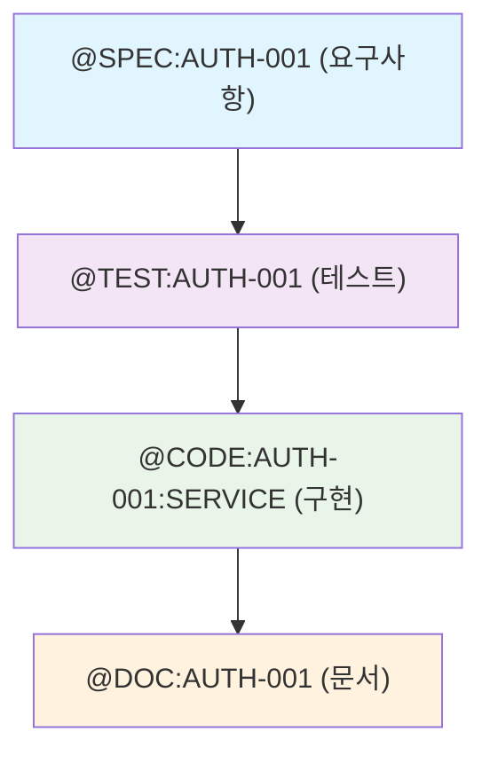
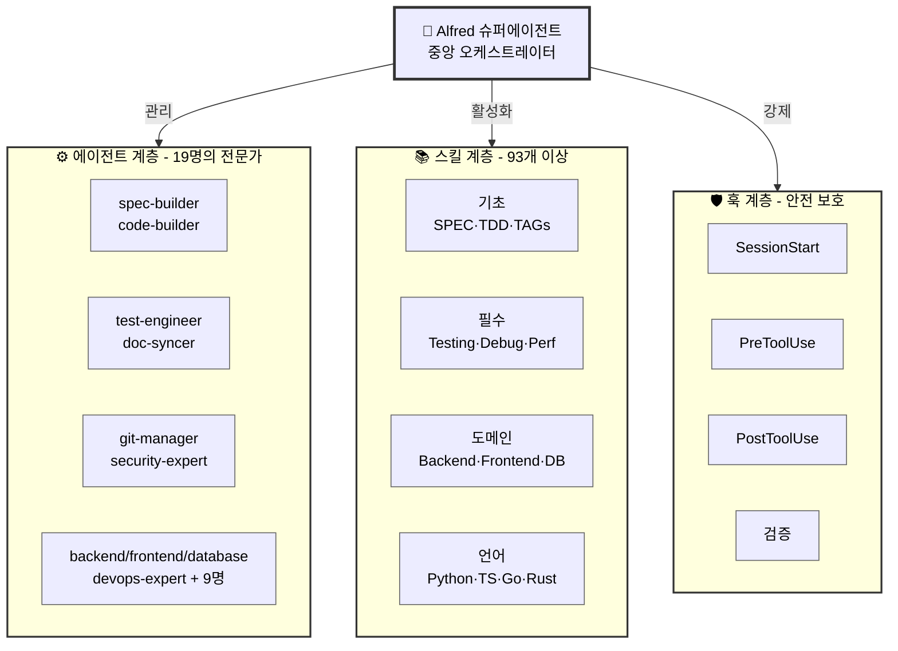

import { Callout, Cards, Card } from 'nextra/components'

# 🗿 MoAI-ADK: AI 기반 SPEC-First TDD 개발 프레임워크

<div style={{ textAlign: 'center', marginBottom: '2rem' }}>
  <p style={{ fontSize: '1.2rem', color: 'var(--nextra-text-color-secondary)', fontWeight: 500 }}>
    신뢰할 수 있고 유지보수하기 쉬운 소프트웨어를 AI의 도움으로 빌드하세요.<br />
    요구사항부터 코드, 문서까지 모든 산출물이 자동으로 추적 가능하고, 테스트되며, 동기화됩니다.
  </p>
</div>

<div style={{ display: 'flex', gap: '1rem', justifyContent: 'center', marginBottom: '3rem', flexWrap: 'wrap' }}>
  <a href="/ko/getting-started" style={{
    background: 'var(--nextra-primary-color)',
    color: 'white',
    padding: '0.75rem 1.5rem',
    borderRadius: '0.5rem',
    textDecoration: 'none',
    fontWeight: 600,
    display: 'inline-flex',
    alignItems: 'center',
    gap: '0.5rem'
  }}>
    🚀 5분 빠른 시작
  </a>
  <a href="/ko/guides/alfred" style={{
    background: 'transparent',
    color: 'var(--nextra-primary-color)',
    padding: '0.75rem 1.5rem',
    borderRadius: '0.5rem',
    textDecoration: 'none',
    fontWeight: 600,
    border: '2px solid var(--nextra-primary-color)',
    display: 'inline-flex',
    alignItems: 'center',
    gap: '0.5rem'
  }}>
    🎩 Alfred 알아보기
  </a>
</div>

## 🎯 사용자 레벨 선택

<Cards style={{ marginBottom: '3rem' }}>
  <Card
    title="🌱 초보자"
    icon="👶"
    href="/ko/getting-started"
  >
    <p>처음 시작하는 분들을 위한 완벽한 가이드</p>
    <ul style={{ marginTop: '0.5rem' }}>
      <li>설치 및 초기 설정</li>
      <li>기본 개념 이해하기</li>
      <li>첫 번째 프로젝트 생성</li>
      <li>Alfred와의 첫 대화</li>
    </ul>
  </Card>
  <Card
    title="🚀 중급자"
    icon="💪"
    href="/ko/guides"
  >
    <p>기초를 넘어 실전 활용 능력 향상</p>
    <ul style={{ marginTop: '0.5rem' }}>
      <li>고급 TDD 패턴</li>
      <li>Alfred 에이전트 활용</li>
      <li>팀 협업 워크플로우</li>
      <li>실제 프로젝트 예제</li>
    </ul>
  </Card>
  <Card
    title="🏆 고급자"
    icon="🎯"
    href="/ko/reference"
  >
    <p>프레임워크 마스터를 위한 심화 내용</p>
    <ul style={{ marginTop: '0.5rem' }}>
      <li>에이전트 커스터마이징</li>
      <li>스킬 확장 개발</li>
      <li>엔터프라이즈 아키텍처</li>
      <li>내부 동작 원리</li>
    </ul>
  </Card>
</Cards>

## ⚡ 핵심 기능

### 1. 🎯 SPEC-First 개발
코드 작성 전 명확한 요구사항 정의를 통해 비용이 큰 재작업을 방지하세요.

- **EARS 형식 명세서**: 구조화되고 명확한 요구사항
- **구현 전 명확화**: 모호함을 제거하는 체계적인 접근
- **자동 추적성**: 요구사항에서 코드, 테스트까지 완벽 연결

### 2. 🔄 자동화된 TDD 워크플로우
RED → GREEN → REFACTOR 사이클을 자동으로 관리하여 87.84%+ 테스트 커버리지를 보장합니다.

- **테스트 우선 보증**: 테스트 없는 코드는 존재할 수 없음
- **실시간 진행 추적**: 모든 단계를 투명하게 모니터링
- **품질 자동화**: 코드 리뷰와 리팩토링 자동화

### 3. 🎩 Alfred 슈퍼에이전트
19개의 전문 AI 에이전트와 93개의 프로덕션급 스킬이 개발을 완벽하게 지원합니다.

- **다중 에이전트 오케스트레이션**: 적절한 전문가에게 자동 할당
- **적응형 학습**: 프로젝트 패턴으로부터 지속적으로 학습
- **실시간 협업**: 병렬 작업과 결과 종합

### 4. 🔗 @TAG 시스템
모든 산출물을 연결하는 완전한 추적성 시스템으로 요구사항 변경의 영향을 즉시 파악할 수 있습니다.



### 5. 📚 살아있는 문서
코드와 문서가 항상 일치하도록 자동으로 동기화됩니다.

- **실시간 동기화**: 코드 변경 시 문서 자동 업데이트
- **수동 업데이트 불필요**: 개발에만 집중하세요
- **다중언어 지원**: Python, TypeScript, Go, Rust 등

### 6. 🛡️ 품질 보증
TRUST 5 원칙(Test-first, Readable, Unified, Secured, Trackable)을 자동으로 강제합니다.

- **자동화된 품질 게이트**: 린팅, 타입 체크, 보안 검사
- **Pre-commit 검증**: 문제가 생기기 전에 차단
- **종합 리포팅**: 실행 가능한 메트릭 제공

## 🚀 5분 빠른 시작

<Callout type="info" emoji="⚡">
  <strong>5분 만에 완전한 개발 환경을 구축할 수 있습니다!</strong>
</Callout>

### 1. 설치
```bash
# uv tool을 사용하여 moai-adk를 전역 명령어로 설치
uv tool install moai-adk

# 새 프로젝트 생성
moai-adk init my-awesome-project
cd my-awesome-project
```

### 2. 프로젝트 초기화
```bash
# 프로젝트 설정 최적화 및 환경 구성
/alfred:0-project
```

### 3. 첫 번째 기능 개발
```bash
# SPEC 작성
/alfred:1-plan "JWT를 사용한 사용자 인증 시스템"

# 자동화된 TDD로 구현
/alfred:2-run AUTH-001

# 문서 자동 동기화
/alfred:3-sync
```

### 완료!
이제 당신은 다음을 얻었습니다:
- ✅ 명확한 SPEC 문서
- ✅ 종합적인 테스트 (87.84%+ 커버리지)
- ✅ 구현 코드
- ✅ 업데이트된 문서
- ✅ @TAG 참조가 포함된 Git 히스토리

## 📊 통계

<div style={{ display: 'grid', gridTemplateColumns: 'repeat(auto-fit, minmax(200px, 1fr))', gap: '1rem', marginBottom: '3rem' }}>
  <div style={{ background: 'var(--nextra-background)', padding: '1.5rem', borderRadius: '0.5rem', textAlign: 'center', border: '1px solid var(--nextra-border-color)' }}>
    <div style={{ fontSize: '2rem', fontWeight: 'bold', color: 'var(--nextra-primary-color)' }}>87.84%+</div>
    <div style={{ color: 'var(--nextra-text-color-secondary)' }}>테스트 커버리지 보증</div>
  </div>
  <div style={{ background: 'var(--nextra-background)', padding: '1.5rem', borderRadius: '0.5rem', textAlign: 'center', border: '1px solid var(--nextra-border-color)' }}>
    <div style={{ fontSize: '2rem', fontWeight: 'bold', color: 'var(--nextra-primary-color)' }}>19</div>
    <div style={{ color: 'var(--nextra-text-color-secondary)' }}>전문 AI 에이전트</div>
  </div>
  <div style={{ background: 'var(--nextra-background)', padding: '1.5rem', borderRadius: '0.5rem', textAlign: 'center', border: '1px solid var(--nextra-border-color)' }}>
    <div style={{ fontSize: '2rem', fontWeight: 'bold', color: 'var(--nextra-primary-color)' }}>93+</div>
    <div style={{ color: 'var(--nextra-text-color-secondary)' }}>프로덕션급 스킬</div>
  </div>
  <div style={{ background: 'var(--nextra-background)', padding: '1.5rem', borderRadius: '0.5rem', textAlign: 'center', border: '1px solid var(--nextra-border-color)' }}>
    <div style={{ fontSize: '2rem', fontWeight: 'bold', color: 'var(--nextra-primary-color)' }}>18</div>
    <div style={{ color: 'var(--nextra-text-color-secondary)' }}>지원 언어</div>
  </div>
</div>

## 🏗️ 시스템 아키텍처



## 💡 MoAI-ADK를 선택하는 이유

<Callout type="warning" emoji="❌">
  <strong>기존 AI 기반 개발의 문제점:</strong><br />
  모호한 요구사항, 부족한 테스트, 동기화되지 않는 문서, 잃어버린 컨텍스트, 불가능한 영향 분석, 일관성 없는 품질
</Callout>

<Callout type="success" emoji="✅">
  <strong>MoAI-ADK의 해결책:</strong><br />
  SPEC-First 개발, 보증된 테스트, 살아있는 문서, 지속적인 컨텍스트, 완전한 추적성, 품질 자동화
</Callout>

### 개인 개발자를 위해
- **컨텍스트 전환 감소**: Alfred가 전체 프로젝트 기억
- **코드 품질 향상**: 자동 TDD로 프로덕션 버그 방지
- **시간 절약**: 자동 문서화로 수동 업데이트 불필요
- **패턴 학습**: 코드베이스로부터 자동 학습

### 팀을 위해
- **통일된 표준**: TRUST 5 원칙을 팀 전체에 강제
- **투명한 워크플로우**: @TAG를 통한 완전한 감사 추적
- **협업**: 공유된 컨텍스트와 명확한 요구사항
- **온보딩**: 신입 팀원이 패턴을 즉시 이해

### 조직을 위해
- **규정 준수 준비**: 보안 및 감사 추적 내장
- **유지보수성**: 코드가 문서화되고, 테스트되며, 추적 가능
- **확장성**: 코드베이스와 함께 성장하는 패턴
- **투자 보호**: 완전한 추적성으로 기술 부채 방지

## 📚 자료 및 지원

<div style={{ display: 'grid', gridTemplateColumns: 'repeat(auto-fit, minmax(250px, 1fr))', gap: '1rem', marginBottom: '3rem' }}>
  <a href="/ko/getting-started" style={{
    background: 'var(--nextra-background)',
    padding: '1.5rem',
    borderRadius: '0.5rem',
    textDecoration: 'none',
    border: '1px solid var(--nextra-border-color)',
    display: 'block',
    transition: 'all 0.2s'
  }}>
    <div style={{ fontSize: '1.5rem', marginBottom: '0.5rem' }}>📖</div>
    <div style={{ fontWeight: 600, marginBottom: '0.5rem' }}>문서</div>
    <div style={{ fontSize: '0.9rem', color: 'var(--nextra-text-color-secondary)' }}>완전한 사용 가이드 및 API 참조</div>
  </a>

  <a href="https://github.com/modu-ai/moai-adk" target="_blank" rel="noopener noreferrer" style={{
    background: 'var(--nextra-background)',
    padding: '1.5rem',
    borderRadius: '0.5rem',
    textDecoration: 'none',
    border: '1px solid var(--nextra-border-color)',
    display: 'block',
    transition: 'all 0.2s'
  }}>
    <div style={{ fontSize: '1.5rem', marginBottom: '0.5rem' }}>💻</div>
    <div style={{ fontWeight: 600, marginBottom: '0.5rem' }}>GitHub</div>
    <div style={{ fontSize: '0.9rem', color: 'var(--nextra-text-color-secondary)' }}>소스 코드 및 기여 가이드</div>
  </a>

  <a href="https://github.com/modu-ai/moai-adk/discussions" target="_blank" rel="noopener noreferrer" style={{
    background: 'var(--nextra-background)',
    padding: '1.5rem',
    borderRadius: '0.5rem',
    textDecoration: 'none',
    border: '1px solid var(--nextra-border-color)',
    display: 'block',
    transition: 'all 0.2s'
  }}>
    <div style={{ fontSize: '1.5rem', marginBottom: '0.5rem' }}>💬</div>
    <div style={{ fontWeight: 600, marginBottom: '0.5rem' }}>커뮤니티</div>
    <div style={{ fontSize: '0.9rem', color: 'var(--nextra-text-color-secondary)' }}>질문, 토론 및 지원</div>
  </a>

  <a href="mailto:support@mo.ai.kr" style={{
    background: 'var(--nextra-background)',
    padding: '1.5rem',
    borderRadius: '0.5rem',
    textDecoration: 'none',
    border: '1px solid var(--nextra-border-color)',
    display: 'block',
    transition: 'all 0.2s'
  }}>
    <div style={{ fontSize: '1.5rem', marginBottom: '0.5rem' }}>📧</div>
    <div style={{ fontWeight: 600, marginBottom: '0.5rem' }}>지원</div>
    <div style={{ fontSize: '0.9rem', color: 'var(--nextra-text-color-secondary)' }}>전문가 지원 및 컨설팅</div>
  </a>
</div>

---

## 🎯 시작해볼까요?

<div style={{ textAlign: 'center', marginTop: '3rem', padding: '2rem', background: 'var(--nextra-background-light)', borderRadius: '0.5rem' }}>
  <h3 style={{ marginBottom: '1rem' }}>지금 바로 신뢰할 수 있는 소프트웨어 개발을 시작하세요!</h3>
  <p style={{ color: 'var(--nextra-text-color-secondary)', marginBottom: '1.5rem' }}>
    MoAI-ADK와 함께라면 복잡한 소프트웨어도 명확한 요구사항, 완벽한 테스트, 자동화된 문서화로 관리할 수 있습니다.
  </p>
  <div style={{ display: 'flex', gap: '1rem', justifyContent: 'center', flexWrap: 'wrap' }}>
    <a href="/ko/getting-started" style={{
      background: 'var(--nextra-primary-color)',
      color: 'white',
      padding: '0.75rem 1.5rem',
      borderRadius: '0.5rem',
      textDecoration: 'none',
      fontWeight: 600,
      display: 'inline-flex',
      alignItems: 'center',
      gap: '0.5rem'
    }}>
      🚀 지금 시작하기
    </a>
    <a href="/ko/guides/alfred" style={{
      background: 'transparent',
      color: 'var(--nextra-primary-color)',
      padding: '0.75rem 1.5rem',
      borderRadius: '0.5rem',
      textDecoration: 'none',
      fontWeight: 600,
      border: '2px solid var(--nextra-primary-color)',
      display: 'inline-flex',
      alignItems: 'center',
      gap: '0.5rem'
    }}>
      🎩 Alfred 알아보기
    </a>
  </div>
</div>

---

<div style={{ textAlign: 'center', marginTop: '3rem', padding: '1rem', borderTop: '1px solid var(--nextra-border-color)' }}>
  <p style={{ color: 'var(--nextra-text-color-secondary)', fontSize: '0.9rem' }}>
    ❤️ <strong>MoAI 팀이 만들었습니다</strong> •
    <a href="https://github.com/modu-ai/moai-adk" target="_blank" rel="noopener noreferrer" style={{ color: 'var(--nextra-primary-color)', textDecoration: 'none' }}>GitHub</a> •
    <a href="https://mo.ai.kr" target="_blank" rel="noopener noreferrer" style={{ color: 'var(--nextra-primary-color)', textDecoration: 'none' }}>웹사이트</a>
  </p>
</div>