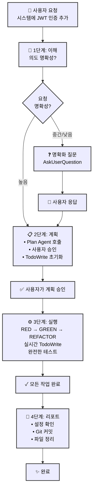
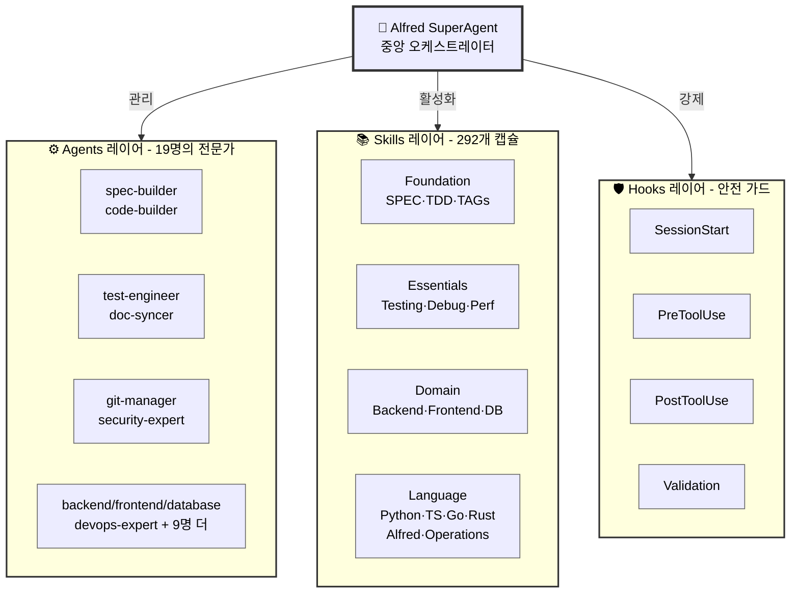

# 🗿 MoAI-ADK: AI 기반 SPEC-First TDD 개발 프레임워크

[](https://pypi.org/project/moai-adk/)
[](https://opensource.org/licenses/MIT)
[](https://www.python.org/)
[](https://github.com/modu-ai/moai-adk/actions/workflows/moai-gitflow.yml)
[](https://codecov.io/gh/modu-ai/moai-adk)
[](https://github.com/modu-ai/moai-adk)

> **AI 지원으로 신뢰할 수 있고 유지 관리 가능한 소프트웨어를 구축하세요. 요구사항부터 문서까지 완벽한 동기화를 통한 완전 자동화.**

MoAI-ADK(Agentic Development Kit)는 **SPEC-First 개발**, **테스트 주도 개발(TDD)**, **AI 에이전트**를 결합하여 완전하고 투명한 개발 생명주기를 생성하는 오픈소스 프레임워크입니다. 요구사항에서 코드, 문서까지 모든 산출물이 자동으로 추적 가능하고, 테스트되며, 동기화됩니다.

---

## 🎯 해결하는 문제

### 전통적인 AI 기반 개발의 도전 과제

| 문제 | 영향 |
|------|------|
| **불명확한 요구사항** | 개발자가 모호한 요구사항을 재확인하는 데 40%의 시간 소비 |
| **테스트 누락** | 테스트되지 않은 코드 경로로 인한 프로덕션 버그 |
| **문서와 코드의 불일치** | 구현과 문서가 동기화되지 않음 |
| **컨텍스트 손실** | 팀원 간 반복적인 설명 필요 |
| **불가능한 영향 분석** | 요구사항 변경이 코드에 미치는 영향을 파악할 수 없음 |
| **일관성 없는 품질** | 수동 QA 게이트가 엣지 케이스를 놓침 |

### MoAI-ADK의 해결 방법

- ✅ **SPEC-First**: 코드 작성 전 명확하고 구조화된 요구사항
- ✅ **테스트 보장**: 자동화된 TDD를 통한 87.84%+ 테스트 커버리지
- ✅ **살아있는 문서**: 절대 오래되지 않는 자동 동기화 문서
- ✅ **영구 컨텍스트**: Alfred가 프로젝트 이력과 패턴을 기억
- ✅ **완전한 추적성**: `@TAG` 시스템이 모든 산출물을 연결
- ✅ **품질 자동화**: TRUST 5 원칙이 전체 과정에서 강제됨

---

## ⚡ 핵심 기능

### 1. 📋 SPEC-First 개발

- **EARS 형식 사양서**: 구조화되고 명확한 요구사항
- **구현 전 명확성**: 비용이 많이 드는 재작업 방지
- **자동 추적성**: 요구사항에서 코드, 테스트까지

### 2. 🔄 자동화된 TDD 워크플로우

- **RED → GREEN → REFACTOR** 사이클 완전 오케스트레이션
- **테스트 우선 보장**: 테스트 없는 코드는 없음
- **87.84%+ 커버리지**: 체계적인 테스팅으로 달성

### 3. 🎩 Alfred SuperAgent

- **19개 전문 AI 에이전트** (spec-builder, code-builder, doc-syncer 등)
- **292개 프로덕션 준비 스킬** 모든 개발 도메인 커버
  - **12개 BaaS 스킬**: 클라우드 플랫폼 (Supabase, Firebase, Vercel, Cloudflare, Auth0, Convex, Railway, Neon, Clerk)
  - **완전한 프론트엔드 커버리지**: HTML/CSS, Tailwind CSS, shadcn/ui, 벡터 아이콘 (10+ 아이콘 라이브러리)
  - **전체 백엔드 지원**: 데이터베이스 설계, API 아키텍처, DevOps
  - **NEW: 고급 MCP 통합**: Context7, Playwright, Sequential-thinking 서버
  - **NEW: 문서 처리**: AI 기반 문서 처리 (docx, pdf, pptx, xlsx)
  - **NEW: 아티팩트 빌더**: 모던 React/Tailwind/shadcn/ui 컴포넌트 생성
- **적응형 학습**: 프로젝트 패턴 기반 학습
- **스마트 컨텍스트 관리**: 프로젝트 구조와 종속성 이해

### 4. 🏷️ @TAG 시스템

모든 산출물을 연결하는 완전한 추적 시스템:

```
@SPEC:AUTH-001 (요구사항)
    ↓
@TEST:AUTH-001 (테스트)
    ↓
@CODE:AUTH-001:SERVICE (구현)
    ↓
@DOC:AUTH-001 (문서)
```

### 5. 📚 살아있는 문서

- **실시간 동기화**: 코드와 문서 간
- **수동 업데이트 불필요**: 자동으로 처리
- **다중 언어 지원**: Python, TypeScript, Go, Rust 등
- **자동 다이어그램 생성**: 코드 구조로부터

### 6. ✅ 품질 보증

- **TRUST 5 원칙**: 테스트 우선, 가독성, 통합, 보안, 추적 가능
- **자동화된 코드 품질 게이트** (린팅, 타입 검사, 보안)
- **사전 커밋 검증**: 위반 방지
- **포괄적인 리포팅**: 실행 가능한 지표

### 7. ☁️ BaaS 플랫폼 에코시스템

- **12개 프로덕션 준비 스킬**: Foundation + 9개 플랫폼 확장
- **8개 아키텍처 패턴**: 모든 배포 시나리오를 커버하는 패턴 A-H
- **11개 클라우드 플랫폼**: 100% 커버리지 (엣지 컴퓨팅부터 데이터베이스 관리까지)
- **패턴 기반 선택**: 최적 플랫폼 선택을 위한 지능형 추천 엔진
- **제로 설정 배포**: 원클릭 설정의 사전 구성된 모범 사례

### 8. 🧠 시니어 엔지니어 사고 통합

- **8가지 연구 전략**: 포괄적인 문제 해결
- **병렬 연구 작업**: 여러 관점에서 동시 분석
- **지식 축적**: 프로젝트별 패턴 학습
- **적응형 인텔리전스**: 시간이 지남에 따라 향상되는 의사결정

---

## 🚀 빠른 시작

### 설치

```bash
# uv tool을 사용하여 전역 명령으로 moai-adk 설치
uv tool install moai-adk

# 설치 확인
moai-adk --version

# 새 프로젝트 초기화 (어디서든 사용 가능)
moai-adk init my-awesome-project
cd my-awesome-project
```

### 5분 빠른 시작

```bash
# 0. 프로젝트 생성 및 초기화
moai-adk init my-awesome-project
cd my-awesome-project

# 1. 프로젝트 설정 최적화
/alfred:0-project

# 2. 기능에 대한 SPEC 생성
/alfred:1-plan "JWT를 사용한 사용자 인증"

# 3. 자동화된 TDD로 구현
/alfred:2-run AUTH-001

# 4. 문서 자동 동기화
/alfred:3-sync
```

이제 다음을 얻었습니다:

- ✅ 명확한 SPEC 문서
- ✅ 포괄적인 테스트
- ✅ 구현 코드
- ✅ 업데이트된 문서
- ✅ @TAG 참조가 있는 Git 히스토리

---

## 🏗️ 핵심 개념

### 4단계 워크플로우

MoAI-ADK는 체계적인 4단계 워크플로우로 완전한 개발 생명주기를 조율합니다:



### Commands → Agents → Skills 아키텍처



---

## 🆕 최신 기능

### v0.23.1 - Skills 에코시스템 업그레이드 (2025년 11월)

**역사적 마일스톤 달성:**

- **총 스킬 해결**: 281+ 스킬이 v4.0.0 Enterprise로 완전히 업그레이드됨
- **문제 스킬**: 57개 중요 문제 해결
- **검증 성공률**: 45%에서 95%+로 극적으로 향상
- **품질 보증**: 모든 스킬이 TRUST 5 표준 충족

### v0.23.0 - Expert Delegation System

**4단계 전문가 위임 시스템:**

| 실행 모드 | 전문가 에이전트 | 책임 영역 | 성능 향상 |
|-----------|-----------------|-----------|-----------|
| **INITIALIZATION** | project-manager | 새 프로젝트 초기화 | 사용자 상호작용 60% 감소 |
| **AUTO-DETECT** | project-manager | 기존 프로젝트 최적화 | 95%+ 정확도 |
| **SETTINGS** | moai-project-config-manager | 설정 관리 및 검증 | 실시간 설정 동기화 |
| **UPDATE** | moai-project-template-optimizer | 템플릿 업데이트 | 자동 마이그레이션 |

### v0.22.0 - 시니어 엔지니어 사고 패턴

**8가지 연구 전략 통합:**

- 재현 및 문서화
- 모범 사례 연구
- 코드베이스 패턴 분석
- 라이브러리 기능 연구
- Git 히스토리 분석
- 빠른 프로토타이핑
- 옵션 합성 및 비교
- 다중 관점 스타일 리뷰

### Phase 1-3 기능

**Phase 1: 다중 언어 코드 디렉토리 감지 + 자동 수정**

- 18개 언어 지원
- 표준 디렉토리 패턴 자동 감지
- 3단계 위험 티어 자동 수정

**Phase 2: 자동 SPEC 템플릿 생성**

- 다중 언어 분석 (Python, JavaScript, Go)
- 자동 도메인 추론
- EARS 형식 템플릿 생성

**Phase 3: BaaS 에코시스템 통합**

- 12개 프로덕션 준비 BaaS 스킬
- 8개 아키텍처 패턴
- 11개 클라우드 플랫폼

---

## 📊 통계 및 지표

| 지표 | 값 |
|------|-----|
| **테스트 커버리지** | 87.84%+ 보장 |
| **전문 에이전트** | 19명의 팀 멤버 |
| **프로덕션 스킬** | 292개 기능 |
| **BaaS 스킬** | 12개 프로덕션 준비 |
| **프론트엔드 스킬** | 4개 전문화 |
| **아이콘 라이브러리** | 10+ (20만+ 아이콘) |
| **플랫폼 커버리지** | 11개 플랫폼 |
| **지원 언어** | 18개 프로그래밍 언어 |
| **아키텍처 패턴** | 8개 패턴 (A-H) |
| **대화 언어** | 25+ 언어 지원 |

---

## 💡 왜 MoAI-ADK인가?

### 개인 개발자를 위해

- **컨텍스트 전환 감소**: Alfred가 전체 프로젝트를 기억
- **더 나은 코드 품질**: 자동화된 TDD로 프로덕션 전 버그 방지
- **시간 절약**: 자동 문서화로 수동 업데이트 불필요
- **패턴 학습**: 코드베이스에서 적응형 학습

### 팀을 위해

- **통일된 표준**: 팀 전체에 TRUST 5 원칙 강제
- **투명한 워크플로우**: @TAG로 완전한 감사 추적
- **협업**: 공유 컨텍스트와 명확한 요구사항
- **온보딩**: 신규 팀원이 패턴을 즉시 이해

### 조직을 위해

- **규정 준수**: 보안 및 감사 추적 내장
- **유지 관리성**: 코드가 문서화되고 테스트되며 추적 가능
- **확장성**: 패턴이 코드베이스와 함께 성장
- **투자 보호**: 완전한 추적성으로 기술 부채 방지

---

## 📖 시작하기

MoAI-ADK를 더 깊이 탐험하려면 다음 섹션을 방문하세요:

<div style="display: grid; grid-template-columns: repeat(auto-fit, minmax(250px, 1fr)); gap: 20px; margin: 30px 0;">

### 🚀 [시작하기](/ko/getting-started/installation)
MoAI-ADK 설치 및 첫 프로젝트 설정

### 🏗️ [핵심 기능](/ko/features/expert-delegation)
전문가 위임 시스템 및 주요 기능 탐색

### 🎩 [Alfred SuperAgent](/ko/alfred/overview)
19명의 전문 에이전트와 292개 스킬 이해

### 👥 [19명의 팀 멤버](/ko/team/overview)
각 전문가 에이전트의 역할과 책임

### 📚 [스킬 시스템](/ko/skills/overview)
292개 프로덕션 준비 스킬 탐색

### 🏷️ [TAG 시스템](/ko/features/tag-system)
완전한 추적성을 위한 @TAG 시스템

### 📖 [튜토리얼](/ko/tutorials/first-project)
단계별 가이드로 MoAI-ADK 마스터

### 🔧 [API 참조](/ko/api/commands)
Commands, Agents, Skills 상세 문서

### 🐛 [문제 해결](/ko/troubleshooting)
자주 묻는 질문 및 문제 해결

</div>

---

## 🌐 다중 언어 지원

MoAI-ADK는 **25개 이상의 언어**로 대화를 지원합니다:

- 한국어 (ko)
- English (en)
- 日本語 (ja)
- Español (es)
- Français (fr)
- Deutsch (de)
- 中文 (zh)
- ...그 외 18개 언어

프로젝트 설정 시 선호하는 언어를 선택하면, Alfred가 해당 언어로 응답합니다.

---

## 📞 지원 및 커뮤니티

<div style="display: flex; gap: 20px; margin: 30px 0; flex-wrap: wrap;">

**🐛 [Issue Tracker](https://github.com/modu-ai/moai-adk/issues)**
버그 리포트 및 기능 요청

**📧 [Email](mailto:support@mo.ai.kr)**
직접 문의 및 기술 지원

**📖 [온라인 매뉴얼](https://adk.mo.ai.kr)**
완전한 문서 및 가이드

**☕ [Ko-fi](https://ko-fi.com/modu_ai)**
프로젝트 지원하기

</div>

---

## 📄 라이선스

MIT License - 자세한 내용은 [LICENSE](https://github.com/modu-ai/moai-adk/blob/main/LICENSE)를 참조하세요.

**요약**: 상업 및 개인 프로젝트에서 MoAI-ADK를 사용할 수 있습니다. 속성 표시는 감사하지만 필수는 아닙니다.

---

## ⭐ Star History

[](https://www.star-history.com/#modu-ai/moai-adk&Date)

---

## 🙏 감사의 말

MoAI-ADK는 AI 지원 개발, 테스트 주도 개발, 소프트웨어 엔지니어링 모범 사례에 대한 수년간의 연구를 기반으로 구축되었습니다. 오픈소스 커뮤니티와 모든 기여자에게 특별한 감사를 드립니다.

---

**Made with ❤️ by the MoAI Team**

[📖 전체 문서 읽기 →](https://adk.mo.ai.kr)

<!-- @DOC:TRUST-001 -->
