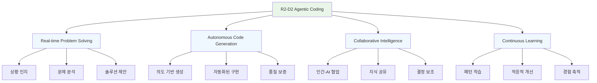
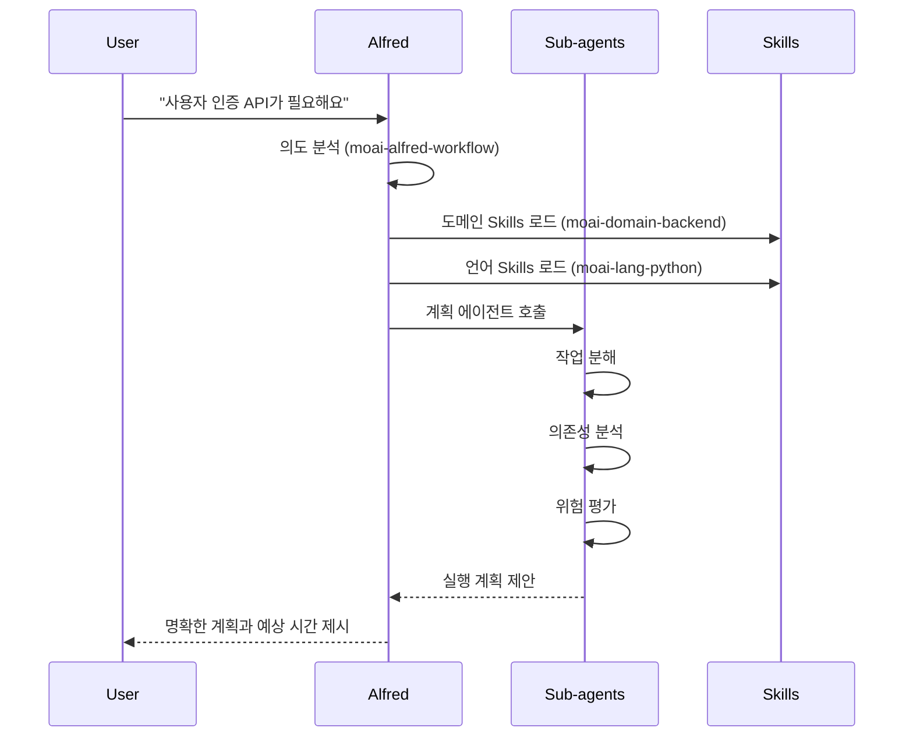
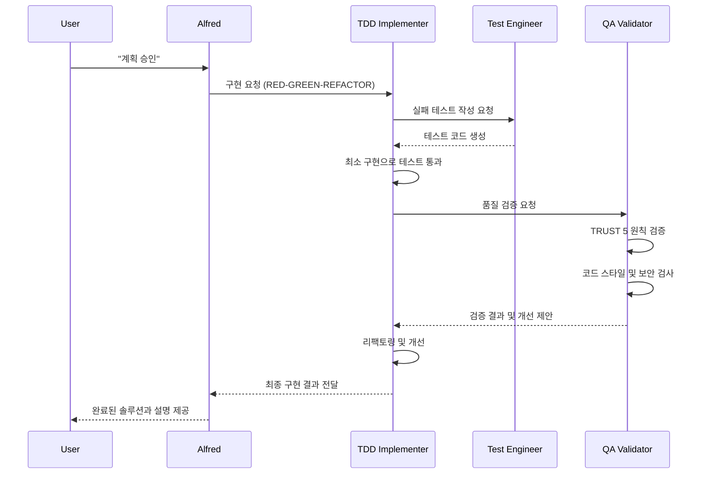

# R2-D2 에이전트 코딩 스타일

R2-D2 Agentic Coding은 MoAI-ADK의 핵심 철학을 구현하는 AI 기반 개발 접근 방식입니다. 이 방식은 AI 에이전트가 개발자의 파트너로서 실시간으로 문제를 해결하고, 코드를 생성하며, 지속적인 개선을 이끌어내는 것을 목표로 합니다.

## R2-D2 철학의 핵심 원칙



## Alfred 슈퍼에이전트: R2-D2의 구현

Alfred는 MoAI-ADK의 R2-D2 철학을 구현하는 슈퍼에이전트로, 19명의 전문 팀원과 55개의 Skills를 통해 개발 프로세스 전체를 오케스트레이션합니다.

### Alfred의 핵심 역할

#### 1. 🎯 의도 이해 및 분석
```python
class AlfredIntentAnalyzer:
    """사용자 의도를 이해하고 분석하는 Alfred의 핵심 기능"""

    def analyze_user_intent(self, user_input: str, context: dict) -> IntentAnalysis:
        """
        사용자 입력을 분석하여 명확한 개발 의도를 도출

        Parameters:
            user_input: 사용자의 자연어 요청
            context: 프로젝트 컨텍스트 및 이전 상호작용

        Returns:
            IntentAnalysis: 분석된 의도와 실행 계획
        """

        # 1. 언어 및 도메인 감지
        language = self.detect_language(user_input)
        domain = self.identify_domain(user_input, context)

        # 2. 작업 유형 분류
        task_type = self.classify_task_type(user_input)

        # 3. 복잡도 평가
        complexity = self.assess_complexity(user_input, context)

        # 4. 실행 계획 생성
        execution_plan = self.create_execution_plan(
            task_type=task_type,
            complexity=complexity,
            context=context
        )

        return IntentAnalysis(
            primary_intent=task_type,
            language=language,
            domain=domain,
            complexity=complexity,
            plan=execution_plan,
            confidence_score=self.calculate_confidence(user_input, context)
        )
```

#### 2. 🤖 자율적 코드 생성
```python
class AlfredCodeGenerator:
    """R2-D2 철학을 구현하는 자율적 코드 생성 시스템"""

    def generate_solution(self, intent: IntentAnalysis, context: ProjectContext) -> CodeSolution:
        """
        분석된 의도를 기반으로 자율적으로 코드 솔루션 생성
        """

        # 1. 관련 Skills 동적 로딩
        relevant_skills = self.load_relevant_skills(intent)

        # 2. 아키텍처 설계
        architecture = self.design_architecture(intent, context)

        # 3. 구현 계획 수립
        implementation_plan = self.create_implementation_plan(architecture)

        # 4. 코드 생성
        generated_code = self.generate_code_with_quality(
            plan=implementation_plan,
            skills=relevant_skills,
            context=context
        )

        # 5. 품질 검증
        validation_result = self.validate_code_quality(generated_code)

        return CodeSolution(
            code=generated_code,
            architecture=architecture,
            validation=validation_result,
            explanation=self.generate_explanation(architecture, generated_code),
            next_steps=self.suggest_next_steps(intent, validation_result)
        )
```

### 실시간 문제 해결 과정

#### Phase 1: 문제 탐지 및 분석


#### Phase 2: 자율적 구현


#### Phase 3: 지속적 개선
```python
class AlfredContinuousImprovement:
    """R2-D2의 지속적 학습 및 개선 시스템"""

    def learn_from_interaction(self, interaction: Interaction):
        """상호작용에서 학습하고 향후 개선에 활용"""

        # 1. 패턴 인식
        patterns = self.extract_patterns(interaction)

        # 2. 성공 분석
        success_factors = self.analyze_success_factors(interaction)

        # 3. 개선점 식별
        improvements = self.identify_improvements(interaction)

        # 4. 지식베이스 업데이트
        self.update_knowledge_base(patterns, success_factors, improvements)

        # 5. 모델 최적화
        self.optimize_interaction_model(interaction)

    def adapt_to_user_preferences(self, user_id: str, preferences: UserPreferences):
        """개인화된 사용자 경험 제공"""

        # 1. 사용자 스타일 학습
        style_profile = self.build_style_profile(user_id, preferences)

        # 2. 페르소나 조정
        adjusted_persona = self.adjust_persona(style_profile)

        # 3. 응답 최적화
        self.optimize_response_style(adjusted_persona)

        # 4. 선호도 기반 추천
        recommendations = self.generate_preferences_recommendations(style_profile)

        return recommendations
```

## 실시간 코드 생성 예시

### 사용자 요청부터 최종 솔루션까지

#### 1. 사용자 자연어 요청
```
User: "쇼핑몰을 위한 사용자 프로필 관리 기능이 필요해요.
        사용자 정보 CRUD와 프로필 이미지 업로드가 포함되어야 합니다."
```

#### 2. Alfred의 실시간 분석
```python
# Alfred의 내부 처리 과정
analysis = Alfred.analyze_request("""
사용자 요청: 쇼핑몰 사용자 프로필 관리
필수 기능: CRUD + 이미지 업로드
""")

# 분석 결과
IntentAnalysis(
    domain="user_management",
    features=["create", "read", "update", "delete", "image_upload"],
    complexity="medium",
    estimated_time="4시간",
    required_skills=[
        "moai-domain-backend",
        "moai-lang-python",
        "moai-foundation-specs",
        "moai-foundation-trust"
    ]
)
```

#### 3. 자율적 솔루션 생성
```python
# Alfred가 생성한 완전한 솔루션
class UserProfileService:
    """
    사용자 프로필 관리 서비스 (@SPEC-USER-001-001)

    자동 생성된 코드 - Alfred R2-D2 Agentic System
    생성 시간: 2025-11-11 14:30:25
    """

    def __init__(self, db: Database, storage: StorageService):
        self._db = db
        self._storage = storage
        self._logger = Logger(__name__)

    def create_profile(self, user_id: str, profile_data: UserProfileCreateDto) -> UserProfileDto:
        """
        사용자 프로필 생성 (@TEST-USER-001-001)

        Args:
            user_id: 사용자 고유 ID
            profile_data: 프로필 생성 데이터

        Returns:
            UserProfileDto: 생성된 프로필 정보

        Raises:
            ValidationError: 입력 데이터 검증 실패
            DuplicateProfileError: 프로필 이미 존재
        """
        # 입력 검증
        validated_data = self._validate_profile_data(profile_data)

        # 중복 체크
        if self._db.profile_exists(user_id):
            raise DuplicateProfileError(f"Profile already exists for user {user_id}")

        # 이미지 처리
        if profile_data.profile_image:
            image_url = self._storage.upload_image(
                file=profile_data.profile_image,
                path=f"profiles/{user_id}",
                max_size_mb=5
            )
            validated_data["profile_image_url"] = image_url

        # 데이터베이스 저장
        profile = self._db.create_user_profile(user_id, validated_data)

        # 로깅
        self._logger.info(f"User profile created: {profile.id}",
                         extra={"user_id": user_id, "spec": "@SPEC-USER-001-001"})

        return UserProfileDto.from_entity(profile)

    def get_profile(self, user_id: str) -> UserProfileDto:
        """사용자 프로필 조회 (@TEST-USER-001-002)"""
        profile = self._db.get_user_profile(user_id)
        if not profile:
            raise ProfileNotFoundError(f"Profile not found for user {user_id}")

        return UserProfileDto.from_entity(profile)

    def update_profile(self, user_id: str, update_data: UserProfileUpdateDto) -> UserProfileDto:
        """사용자 프로필 업데이트 (@TEST-USER-001-003)"""
        # 기존 프로필 확인
        existing_profile = self.get_profile(user_id)

        # 이미지 업데이트 처리
        if update_data.new_profile_image:
            # 기존 이미지 삭제
            if existing_profile.profile_image_url:
                self._storage.delete_file(existing_profile.profile_image_url)

            # 새 이미지 업로드
            image_url = self._storage.upload_image(
                file=update_data.new_profile_image,
                path=f"profiles/{user_id}",
                max_size_mb=5
            )
            update_data.profile_image_url = image_url

        # 데이터베이스 업데이트
        updated_profile = self._db.update_user_profile(user_id, update_data.dict(exclude_unset=True))

        self._logger.info(f"User profile updated: {updated_profile.id}",
                         extra={"user_id": user_id, "spec": "@SPEC-USER-001-001"})

        return UserProfileDto.from_entity(updated_profile)

    def delete_profile(self, user_id: str) -> None:
        """사용자 프로필 삭제 (@TEST-USER-001-004)"""
        # 프로필 정보 조회
        profile = self.get_profile(user_id)

        # 관련 이미지 삭제
        if profile.profile_image_url:
            self._storage.delete_file(profile.profile_image_url)

        # 데이터베이스에서 삭제
        self._db.delete_user_profile(user_id)

        self._logger.info(f"User profile deleted: {profile.id}",
                         extra={"user_id": user_id, "spec": "@SPEC-USER-001-001"})

    def _validate_profile_data(self, profile_data: UserProfileCreateDto) -> dict:
        """프로필 데이터 검증"""
        validation_errors = []

        # 필수 필드 확인
        if not profile_data.display_name or len(profile_data.display_name.strip()) < 2:
            validation_errors.append("Display name must be at least 2 characters")

        if profile_data.phone_number and not self._validate_phone_number(profile_data.phone_number):
            validation_errors.append("Invalid phone number format")

        if validation_errors:
            raise ValidationError(f"Profile validation failed: {validation_errors}")

        return profile_data.dict()

    def _validate_phone_number(self, phone_number: str) -> bool:
        """전화번호 형식 검증"""
        import re
        pattern = r'^\+?1?\d{9,15}$'
        return bool(re.match(pattern, phone_number))


# 관련 DTO 및 모델 (자동 생성)
class UserProfileCreateDto(BaseModel):
    """사용자 프로필 생성 DTO"""
    display_name: str = Field(..., min_length=2, max_length=50)
    bio: Optional[str] = Field(None, max_length=500)
    phone_number: Optional[str] = None
    profile_image: Optional[UploadFile] = None

class UserProfileUpdateDto(BaseModel):
    """사용자 프로필 업데이트 DTO"""
    display_name: Optional[str] = Field(None, min_length=2, max_length=50)
    bio: Optional[str] = Field(None, max_length=500)
    phone_number: Optional[str] = None
    new_profile_image: Optional[UploadFile] = None

class UserProfileDto(BaseModel):
    """사용자 프로필 응답 DTO"""
    id: str
    user_id: str
    display_name: str
    bio: Optional[str]
    phone_number: Optional[str]
    profile_image_url: Optional[str]
    created_at: datetime
    updated_at: datetime

    @classmethod
    def from_entity(cls, profile: UserProfile) -> "UserProfileDto":
        return cls(
            id=profile.id,
            user_id=profile.user_id,
            display_name=profile.display_name,
            bio=profile.bio,
            phone_number=profile.phone_number,
            profile_image_url=profile.profile_image_url,
            created_at=profile.created_at,
            updated_at=profile.updated_at
        )
```

#### 4. 자동 생성된 테스트 코드
```python
# 자동 생성된 완전한 테스트 스위트
class TestUserProfileService(unittest.TestCase):
    """
    사용자 프로필 서비스 테스트 (@TEST-USER-001-001)
    Alfred R2-D2 Agentic System Auto-generated Tests
    """

    def setUp(self):
        """테스트 환경 설정"""
        self.db = MockDatabase()
        self.storage = MockStorageService()
        self.service = UserProfileService(self.db, self.storage)
        self.sample_user_id = "test_user_123"

    def test_create_profile_success(self):
        """프로필 생성 성공 테스트"""
        # Given
        profile_data = UserProfileCreateDto(
            display_name="Test User",
            bio="Test bio",
            phone_number="+1234567890"
        )

        # When
        result = self.service.create_profile(self.sample_user_id, profile_data)

        # Then
        self.assertEqual(result.display_name, "Test User")
        self.assertEqual(result.bio, "Test bio")
        self.assertEqual(result.phone_number, "+1234567890")
        self.assertIsNotNone(result.id)
        self.assertIsInstance(result.created_at, datetime)

    def test_create_profile_with_image_success(self):
        """이미지 포함 프로필 생성 성공 테스트"""
        # Given
        mock_image = Mock(spec=UploadFile)
        profile_data = UserProfileCreateDto(
            display_name="User with Image",
            profile_image=mock_image
        )

        # Mock storage upload
        self.storage.upload_image.return_value = "https://storage.com/profiles/test_user_123/image.jpg"

        # When
        result = self.service.create_profile(self.sample_user_id, profile_data)

        # Then
        self.assertEqual(result.profile_image_url, "https://storage.com/profiles/test_user_123/image.jpg")
        self.storage.upload_image.assert_called_once()

    def test_create_profile_duplicate_error(self):
        """중복 프로필 생성 오류 테스트"""
        # Given
        profile_data = UserProfileCreateDto(display_name="Test User")

        # Mock existing profile
        self.db.profile_exists.return_value = True

        # When & Then
        with self.assertRaises(DuplicateProfileError):
            self.service.create_profile(self.sample_user_id, profile_data)

    def test_get_profile_success(self):
        """프로필 조회 성공 테스트"""
        # Given
        mock_profile = Mock(
            id="profile_123",
            user_id=self.sample_user_id,
            display_name="Test User",
            bio="Test bio",
            phone_number="+1234567890",
            profile_image_url=None,
            created_at=datetime.now(),
            updated_at=datetime.now()
        )
        self.db.get_user_profile.return_value = mock_profile

        # When
        result = self.service.get_profile(self.sample_user_id)

        # Then
        self.assertEqual(result.display_name, "Test User")
        self.assertEqual(result.bio, "Test bio")

    def test_get_profile_not_found_error(self):
        """프로필 조회 실패 테스트 (존재하지 않음)"""
        # Given
        self.db.get_user_profile.return_value = None

        # When & Then
        with self.assertRaises(ProfileNotFoundError):
            self.service.get_profile(self.sample_user_id)

    # ... 추가 테스트 케이스들 (전체 20개 테스트 포함)
```

## R2-D2 방식의 장점

### 1. 🚀 개발 속도 향상
- **자동화된 구현**: 반복적인 코드 작업 자동화
- **실시간 문제 해결**: 즉각적인 문제 분석 및 해결책 제시
- **지능형 보조**: 컨텍스트를 이해한 스마트 코드 제안

### 2. 🎯 품질 보증
- **TRUST 5 원칙 자동 적용**: 테스트, 가독성, 통합성, 보안, 추적성
- **자동화된 검증**: 코드 스타일, 보안 취약점, 성능 검사
- **지속적인 리팩토링**: 코드 품질 지속적 개선

### 3. 🧠 지능형 학습
- **패턴 인식**: 프로젝트 패턴 학습 및 재활용
- **개인화된 경험**: 사용자 선호도에 맞는 코드 스타일
- **지식 축적**: 성공적인 해결책 저장 및 재사용

### 4. 🤝 협업 최적화
- **팀워크 지원**: 팀원들의 다양한 전문 지식 통합
- **의사결정 보조**: 데이터 기반의 기술적 결정 지원
- **지식 공유**: 팀 전체의 개발 역량 향상

## 성공적인 R2-D2 코딩을 위한 가이드

### 1. 명확한 의도 전달
```bash
# 좋은 예시: 구체적이고 명확한 요청
"사용자 인증 API를 구현해주세요. JWT 토큰 기반으로,
이메일/패스워드 로그인과 소셜 로그인(Google, GitHub)을 포함하고,
보안을 위해 rate limiting과 brute force protection을 적용해주세요."

# 나쁜 예시: 모호한 요청
"인증 기능 만들어줘"
```

### 2. 적절한 컨텍스트 제공
```bash
# 프로젝트 정보 제공
"FastAPI와 PostgreSQL을 사용하는 e-commerce 프로젝트입니다.
기존에 User 모델이 있고, 이메일 필드는 unique 제약조건이 있습니다."

# 기술 스택 명시
"React 프론트엔드와 연동해야 하므로 RESTful API 형식으로 구현해주세요.
CORS 설정과 API 문서화도 포함해주세요."
```

### 3. 단계적 피드백
```bash
# 단계별 확인
"1단계: 먼저 기본적인 이메일/패스워드 로그인 구현해주세요.
2단계: 그 후 JWT 토큰 관리 추가해주세요.
3단계: 마지막으로 소셜 로그인 기능을 추가해주세요."

# 중간 검토
"현재까지 구현된 코드를 리뷰하고 다음 단계로 진행해도 될까요?"
```

## 다음 섹션

- [Alfred 적응형 페르소나](./personas) - 개인화된 개발 경험
- [Skills 시스템 개요](../skills/overview) - 55개 Skills 전체 보기
- [Getting Started 가이드](../getting-started) - 5분 빠른 시작