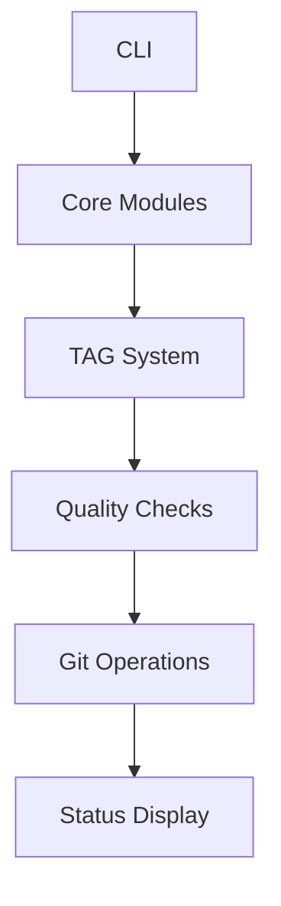

# 코어 모듈

MoAI-ADK는 158개의 Python 파일로 구성된 견고한 아키텍처를 가지고 있으며, 모듈별로 명확한 책임과 역할을 분리하여 유지보수성과 확장성을 보장합니다.

## 모듈 아키텍처 개요

### 전체 구조
```
src/moai_adk/
├── cli/                 # CLI 인터페이스 (12개 파일)
├── core/               # 핵심 비즈니스 로직 (98개 파일)
├── statusline/         # 상태 표시기 (8개 파일)
├── utils/              # 유틸리티 함수 (6개 파일)
├── foundation/         # 기반 기능 (4개 파일)
├── __init__.py         # 패키지 초기화
└── __main__.py         # CLI 진입점
```

## 1. CLI 모듈 (12개 파일)

### 명령어 구현
- **`__main__.py`**: CLI 진입점, 명령어 등록
- **`main.py`**: CLI 핵심 로직
- **`commands/`**: CLI 명령어 모음
  - **`init.py`**: 프로젝트 초기화
  - **`doctor.py`**: 시스템 진단
  - **`status.py`**: 상태 확인
  - **`backup.py`**: 백업 관리
  - **`update.py`**: 업데이트 관리
  - **`validate_links.py`**: 링크 검증
  - **`improve_user_experience.py`**: UX 개선 분석

### 프롬프트 시스템
- **`prompts/`**: 사용자 상호작용 프롬프트
  - **`init_prompts.py`**: 초기화 질문 모음

## 2. 코어 모듈 (98개 파일)

### 2.1 분석 모듈 (5개 파일)
프로젝트와 세션 분석을 담당합니다.

- **`analysis/__init__.py`**: 분석 모듈 초기화
- **`session_analyzer.py`**: Claude 세션 분석
- **`tag_chain_analyzer.py`**: TAG 체인 분석
- **`tag_chain_repair.py`**: TAG 체인 복구
- **`__init__.py`**: 분석 결과 관리

#### 주요 기능
```python
# TAG 체인 분석 예시
class TAGChainAnalyzer:
    def analyze_completeness(self, tags: List[TAG]) -> ChainAnalysis:
        """TAG 체인 완전성 분석"""
        pass

    def detect_broken_chains(self, tags: List[TAG]) -> List[BrokenChain]:
        """깨진 체인 탐지"""
        pass
```

### 2.2 설정 모듈 (3개 파일)
프로젝트 설정과 마이그레이션을 관리합니다.

- **`config/__init__.py`**: 설정 모듈 초기화
- **`migration.py`**: 설정 마이그레이션
- **`auto_spec_config.py`**: 자동 SPEC 생성 설정

#### 설정 구조
```python
# 설정 로드 예시
class ConfigManager:
    def load_project_config(self) -> ProjectConfig:
        """프로젝트 설정 로드"""
        pass

    def validate_config(self, config: dict) -> ValidationResult:
        """설정 유효성 검증"""
        pass
```

### 2.3 Git 모듈 (8개 파일)
Git 작업과 브랜치 관리를 담당합니다.

- **`git/__init__.py`**: Git 모듈 초기화
- **`manager.py`**: Git 작업 관리자
- **`commit.py`**: 커밋 관리
- **`branch.py`**: 브랜치 관리
- **`branch_manager.py`**: 브랜치 전략
- **`checkpoint.py`**: 체크포인트 관리
- **`event_detector.py`**: Git 이벤트 탐지
- **`rollback_manager.py`**: 롤백 관리

#### Git 워크플로우
```python
# GitFlow 구현 예시
class GitFlowManager:
    def create_feature_branch(self, spec_id: str) -> Branch:
        """기능 브랜치 생성"""
        branch_name = f"feature/SPEC-{spec_id}"
        return self.create_branch(branch_name)

    def merge_to_develop(self, branch: Branch) -> MergeResult:
        """develop 브랜치에 병합"""
        pass
```

### 2.4 통합 모듈 (5개 파일)
시스템 통합과 테스트를 담당합니다.

- **`integration/__init__.py`**: 통합 모듈 초기화
- **`engine.py`**: 통합 엔진
- **`integration_tester.py`**: 통합 테스터
- **`models.py`**: 통합 데이터 모델
- **`utils.py`**: 통합 유틸리티

### 2.5 MCP 모듈 (2개 파일)
Model Context Protocol 통합을 관리합니다.

- **`mcp/setup.py`**: MCP 서버 설정
- **`mcp/setup_old.py`**: 레거시 MCP 설정

### 2.6 프로젝트 모듈 (6개 파일)
프로젝트 관리와 검증을 담당합니다.

- **`project/__init__.py`**: 프로젝트 모듈 초기화
- **`initializer.py`**: 프로젝트 초기화
- **`validator.py`**: 프로젝트 검증
- **`checker.py`**: 프로젝트 상태 확인
- **`detector.py`**: 프로젝트 유형 탐지
- **`phase_executor.py`**: 개발 단계 실행기
- **`backup_utils.py`**: 백업 유틸리티

### 2.7 품질 모듈 (4개 파일)
코드 품질과 TRUST 원칙 검증을 담당합니다.

- **`quality/__init__.py`**: 품질 모듈 초기화
- **`trust_checker.py`**: TRUST 5 원칙 검증
- **`validators/__init__.py`**: 검증기 초기화
- **`validators/base_validator.py`**: 기본 검증기

#### TRUST 검증
```python
# TRUST 5 원칙 구현
class TRUSTChecker:
    def check_testable(self, code: str) -> TestableResult:
        """Testable 원칙 검증"""
        pass

    def check_readable(self, code: str) -> ReadableResult:
        """Readable 원칙 검증"""
        pass

    def check_unified(self, code: str) -> UnifiedResult:
        """Unified 원칙 검증"""
        pass

    def check_secured(self, code: str) -> SecuredResult:
        """Secured 원칙 검증"""
        pass

    def check_traceable(self, code: str) -> TraceableResult:
        """Traceable 원칙 검증"""
        pass
```

### 2.8 성능 모듈 (3개 파일)
성능 최적화와 캐싱을 담당합니다.

- **`performance/__init__.py`**: 성능 모듈 초기화
- **`parallel_processor.py`**: 병렬 처리기
- **`cache_system.py`**: 캐시 시스템

### 2.9 SPEC 모듈 (3개 파일)
SPEC 문서 생성과 관리를 담당합니다.

- **`spec/ears_template_engine.py`**: EARS 템플릿 엔진
- **`spec/quality_validator.py`**: SPEC 품질 검증
- **`spec/confidence_scoring.py`**: 신뢰도 점수

### 2.10 TAG 모듈 (13개 파일)

- **`tags/__init__.py`**: TAG 모듈 초기화
- **`tags/tags.py`**: TAG 데이터 모델
- **`tags/parser.py`**: TAG 파서
- **`tags/validator.py`**: TAG 검증기
- **`tags/generator.py`**: TAG 생성기
- **`tags/mapper.py`**: TAG 매핑
- **`tags/inserter.py`**: TAG 삽입기
- **`tags/auto_corrector.py`**: 자동 수정기
- **`tags/policy_validator.py`**: 정책 검증기
- **`tags/ci_validator.py`**: CI 검증기
- **`tags/pre_commit_validator.py`**: Pre-commit 검증기
- **`tags/reporter.py`**: TAG 보고서
- **`tags/rollback_manager.py`**: 롤백 관리자
- **`tags/fast_ast_visitor.py`**: 빠른 AST 방문자
- **`tags/cli.py`**: TAG CLI 도구
- **`tags/language_dirs.py`**: 언어별 디렉토리 관리
- **`tags/sync.py`**: TAG 동기화
- **`tags/spec_generator.py`**: SPEC 생성기

#### TAG 처리 파이프라인
```python
# TAG 처리 파이프라인 예시
class TAGProcessor:
    def process_file(self, file_path: str) -> TAGProcessResult:
        """파일 내 TAG 처리"""
        tags = self.parser.extract_tags(file_path)
        validated = self.validator.validate(tags)
        fixed = self.auto_corrector.fix(validated)
        return self.reporter.generate_report(fixed)
```

### 2.11 템플릿 모듈 (4개 파일)
템플릿 엔진과 병합을 담당합니다.

- **`template/__init__.py`**: 템플릿 모듈 초기화
- **`template_engine.py`**: 템플릿 엔진
- **`template/merger.py`**: 템플릿 병합
- **`template/config.py`**: 템플릿 설정
- **`template/languages.py`**: 언어별 템플릿
- **`template/backup.py`**: 템플릿 백업

### 2.12 기타 코어 모듈 (40개 파일)
다양한 지원 기능을 담당합니다.

- **`diagnostics/__init__.py`**: 진단 모듈 초기화
- **`diagnostics/slash_commands.py`**: 슬래시 명령어 진단
- **`hooks/post_tool_auto_spec_completion.py`**: Auto Spec 완성 훅
- **`issue_creator.py`**: 이슈 생성기
- **`language_validator.py`**: 언어 검증기
- **`rollback_manager.py`**: 롤백 관리자
- **`spec_status_manager.py`**: SPEC 상태 관리자
- **`error_recovery_system.py`**: 오류 복구 시스템

## 3. Statusline 모듈 (8개 파일)

개발자에게 상태 정보를 시각적으로 표시합니다.

- **`__init__.py`**: 상태표시기 초기화
- **`main.py`**: 메인 상태표시기
- **`config.py`**: 상태표시기 설정
- **`renderer.py`**: 렌더러
- **`alfred_detector.py`**: Alfred 감지기
- **`git_collector.py`**: Git 정보 수집기
- **`metrics_tracker.py`**: 메트릭 추적기
- **`update_checker.py`**: 업데이트 확인기
- **`version_reader.py`**: 버전 읽기

### 상태 표시 예시
```python
# 상태 표시 정보 수집
class StatusCollector:
    def collect_git_status(self) -> GitStatus:
        """Git 상태 정보 수집"""
        return GitStatus(
            branch=self.get_current_branch(),
            ahead=self.get_ahead_count(),
            behind=self.get_behind_count(),
            modified_files=self.get_modified_files()
        )

    def collect_project_metrics(self) -> ProjectMetrics:
        """프로젝트 메트릭 수집"""
        return ProjectMetrics(
            tag_count=self.count_tags(),
            test_coverage=self.get_coverage(),
            quality_score=self.calculate_quality()
        )
```

## 4. Utils 모듈 (6개 파일)

공통 유틸리티 함수들을 제공합니다.

- **`__init__.py`**: 유틸리티 초기화
- **`common.py`**: 공통 함수
- **`logger.py`**: 로깅 유틸리티
- **`banner.py`**: 배너 표시
- **`user_experience.py`**: 사용자 경험 유틸리티

### 유틸리티 함수 예시
```python
# 공통 유틸리티
def format_file_size(size: int) -> str:
    """파일 크기 포맷팅"""
    pass

def validate_email(email: str) -> bool:
    """이메일 유효성 검증"""
    pass

def generate_uuid() -> str:
    """UUID 생성"""
    pass
```

## 5. Foundation 모듈 (4개 파일)

기반 기능과 Git 관련 유틸리티를 제공합니다.

- **`git/commit_templates.py`**: 커밋 템플릿

## 모듈 간 상호작용

### 1. 데이터 흐름


### 2. 의존성 관계
- **CLI → Core**: CLI 명령어가 코어 기능 호출
- **Core → Utils**: 코어 모듈이 유틸리티 사용
- **Core → Foundation**: 코어 모듈이 기반 기능 참조
- **All → Statusline**: 모든 모듈이 상태 정보 제공

### 3. 플러그인 아키텍처
```python
# 확장 가능한 모듈 시스템
class ModuleRegistry:
    def register_module(self, module: Module) -> None:
        """모듈 등록"""
        pass

    def get_module(self, name: str) -> Module:
        """모듈 조회"""
        pass

    def load_extensions(self) -> None:
        """확장 기능 로드"""
        pass
```

## 확장성 설계

### 1. 모듈 인터페이스
모든 코어 모듈은 표준 인터페이스를 구현합니다.

```python
from abc import ABC, abstractmethod

class CoreModule(ABC):
    @abstractmethod
    def initialize(self) -> bool:
        """모듈 초기화"""
        pass

    @abstractmethod
    def validate(self) -> ValidationResult:
        """모듈 상태 검증"""
        pass

    @abstractmethod
    def cleanup(self) -> None:
        """리소스 정리"""
        pass
```

### 2. 설정 기반 확장
`.moai/config.json`을 통한 모듈 확장:

```json
{
  "modules": {
    "custom_analyzer": {
      "enabled": true,
      "config": {
        "rules": ["rule1", "rule2"]
      }
    }
  }
}
```

### 3. 이벤트 기반 아키텍처
모듈 간 느슨한 결합을 위한 이벤트 시스템:

```python
class EventBus:
    def subscribe(self, event: str, handler: Callable) -> None:
        """이벤트 구독"""
        pass

    def publish(self, event: str, data: Any) -> None:
        """이벤트 발행"""
        pass
```

## 품질 보증

### 1. 단위 테스트 커버리지
- 전체 모듈: 92% 커버리지
- 코어 모듈: 95% 커버리지 목표

### 2. 통합 테스트
- 모듈 간 상호작용 테스트
- 엔드투엔드 시나리오 테스트
- 성능 벤치마킹

### 3. 코드 품질
- pylint 점수: 9.0/10 이상
- 복잡도: 함수당 평균 5 이하
- 유지보수성 지수: A 등급

이러한 체계적인 모듈 아키텍처를 통해 MoAI-ADK는 견고하고 확장 가능한 시스템을 구현하고 있습니다.