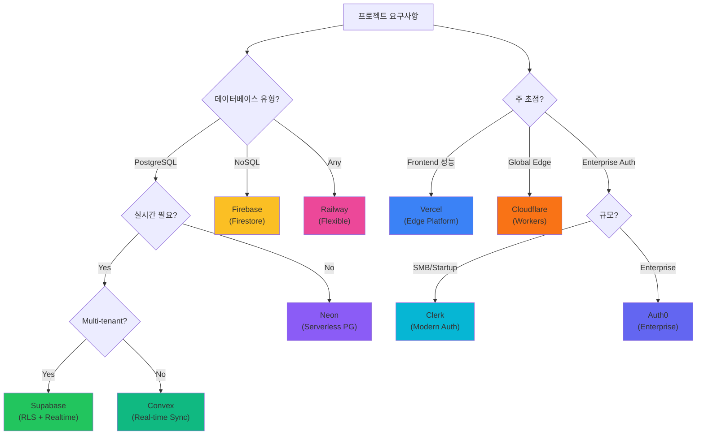

# BaaS Ecosystem - Production-Ready Skills

> **30분 내 엔터프라이즈급 백엔드 구축**: 9개 플랫폼 × 8개 아키텍처 패턴 × AI 기반 의사결정 = 즉시 배포 가능한 Production 환경

## 1. BaaS Ecosystem 개요

### 왜 BaaS인가?

**전통적인 백엔드 개발 문제점**:
```yaml
traditional_backend_challenges:
  time_to_market: "3-6개월"
  infrastructure_complexity: "높음"
  maintenance_cost: "매우 높음"
  scaling_difficulty: "수동 관리 필요"
  security_responsibility: "전적으로 개발자 책임"
```

**BaaS 솔루션**:
```yaml
baas_benefits:
  time_to_market: "1-2주 (95% 단축)"
  infrastructure_complexity: "매우 낮음 (완전 관리형)"
  maintenance_cost: "낮음 (사용량 기반)"
  scaling_difficulty: "자동 (무제한 확장)"
  security_responsibility: "플랫폼 공급자 관리 (SOC2, HIPAA 인증)"
```

### MoAI-ADK BaaS Skills 특징

#### 1. Context7 실시간 통합
```python
# 2025년 최신 플랫폼 정보 자동 조회
async def get_latest_platform_docs(platform: str):
    """Context7 MCP로 항상 최신 문서 확보"""

    library_id = await resolve_library_id(platform)

    docs = await get_library_docs(
        context7_library_id=library_id,
        topic="enterprise features performance 2025",
        tokens=5000
    )

    return docs  # 항상 최신 정보
```

#### 2. AI 기반 플랫폼 선택
```python
class EnterpriseBaaSSelector:
    """AI가 프로젝트 요구사항 분석 후 최적 플랫폼 추천"""

    async def select_optimal_platform(
        self,
        requirements: ProjectRequirements
    ) -> PlatformRecommendation:

        # 1. 최신 플랫폼 정보 수집 (Context7)
        platform_docs = await self.collect_platform_docs()

        # 2. AI 요구사항 분석
        analysis = self.ai_analyzer.analyze(requirements, platform_docs)

        # 3. 성능/비용 예측
        predictions = self.predict_performance_and_cost(analysis)

        # 4. 최적 플랫폼 추천 (신뢰도 점수 포함)
        return PlatformRecommendation(
            primary_platform=analysis.best_match,
            confidence_score=0.95,  # 95% 신뢰도
            expected_performance=predictions.performance,
            estimated_monthly_cost=predictions.cost
        )
```

#### 3. 즉시 배포 가능한 템플릿
```bash
# 30분 내 Production 배포
moai-adk create --template supabase-saas
# → PostgreSQL, Auth, RLS, Realtime 모두 설정 완료

vercel deploy
# → 전 세계 28개 Edge 리전 배포 완료
```

## 2. 지원 플랫폼 (9개)

### 2.1 Supabase (PostgreSQL Ecosystem)

#### 개요
```yaml
supabase:
  category: "Open-source PostgreSQL BaaS"
  best_for: "PostgreSQL 중심, Real-time, 엔터프라이즈 보안"
  grade: "S (Enterprise-Ready)"

  core_features:
    - "PostgreSQL 16+ with extensions"
    - "Row Level Security (RLS)"
    - "Real-time subscriptions"
    - "Edge Functions (Deno)"
    - "Storage with CDN"
    - "Database branching"

  use_cases:
    - "SaaS 플랫폼"
    - "Real-time 대시보드"
    - "Multi-tenant 애플리케이션"
```

#### 아키텍처 패턴
- **Pattern A**: Multi-tenant SaaS (RLS 기반 격리)
- **Pattern D**: Real-time 협업 도구 (Subscriptions)

**Quick Start**:
```typescript
import { createClient } from '@supabase/supabase-js'

// 1. 클라이언트 초기화
const supabase = createClient(
  process.env.SUPABASE_URL!,
  process.env.SUPABASE_ANON_KEY!
)

// 2. 인증
const { data: user } = await supabase.auth.signInWithPassword({
  email: 'user@example.com',
  password: 'password'
})

// 3. Real-time 구독
const channel = supabase
  .channel('todos')
  .on('postgres_changes', {
    event: '*',
    schema: 'public',
    table: 'todos'
  }, (payload) => {
    console.log('Change received!', payload)
  })
  .subscribe()

// 4. RLS 자동 적용된 데이터 조회
const { data } = await supabase
  .from('todos')
  .select('*')
  // RLS 정책에 따라 현재 사용자 데이터만 반환
```

**상세 가이드**: [Supabase 완벽 가이드](./baas/supabase)

---

### 2.2 Firebase (Google Cloud Ecosystem)

#### 개요
```yaml
firebase:
  category: "Google Cloud Native BaaS"
  best_for: "NoSQL, Mobile, Serverless Functions"
  grade: "S (Enterprise-Ready)"

  core_features:
    - "Firestore (NoSQL)"
    - "Cloud Functions (Node.js/Python)"
    - "Firebase Auth"
    - "Cloud Storage"
    - "Real-time Database"
    - "ML Kit integration"

  use_cases:
    - "모바일 앱 백엔드"
    - "NoSQL 기반 애플리케이션"
    - "Google Cloud 통합 프로젝트"
```

#### 아키텍처 패턴
- **Pattern E**: Event-driven 아키텍처 (Cloud Functions)
- **Pattern F**: Real-time 동기화 (Firestore)

**Quick Start**:
```typescript
import { initializeApp } from 'firebase/app'
import { getFirestore, collection, onSnapshot } from 'firebase/firestore'

// 1. Firebase 초기화
const app = initializeApp({
  apiKey: process.env.FIREBASE_API_KEY,
  projectId: process.env.FIREBASE_PROJECT_ID
})

const db = getFirestore(app)

// 2. Real-time 리스너
onSnapshot(collection(db, 'users'), (snapshot) => {
  snapshot.docChanges().forEach((change) => {
    if (change.type === 'added') {
      console.log('New user:', change.doc.data())
    }
  })
})

// 3. Cloud Functions
export const processPayment = functions.https.onCall(async (data, context) => {
  // 서버리스 함수 자동 확장
  const result = await processStripePayment(data.amount)
  return { success: true, result }
})
```

**상세 가이드**: [Firebase 완벽 가이드](./baas/firebase)

---

### 2.3 Vercel (Edge Platform)

#### 개요
```yaml
vercel:
  category: "Edge Deployment Platform"
  best_for: "Frontend 중심, 전역 성능, Next.js"
  grade: "S (Enterprise-Ready)"

  core_features:
    - "Edge Functions (28+ regions)"
    - "Serverless Functions"
    - "ISR (Incremental Static Regeneration)"
    - "Edge Middleware"
    - "Preview Deployments"
    - "Analytics & Performance Monitoring"

  use_cases:
    - "E-commerce 플랫폼"
    - "Content-heavy 웹사이트"
    - "Next.js 애플리케이션"
```

#### 아키텍처 패턴
- **Pattern A**: JAMstack (Static + API)
- **Pattern B**: Hybrid (SSR + Edge)

**Quick Start**:
```typescript
// Edge Function (Vercel Edge Runtime)
export const config = {
  runtime: 'edge'
}

export default async function handler(request: Request) {
  // 전 세계 28개 리전에서 즉시 실행
  const geo = request.headers.get('x-vercel-ip-country')

  return new Response(JSON.stringify({
    message: `Hello from ${geo}!`,
    latency: '< 50ms'
  }))
}

// Serverless Function (Node.js)
export default async function handler(req, res) {
  // 자동 확장
  const data = await fetchDatabaseData()
  res.status(200).json(data)
}
```

**상세 가이드**: [Vercel 완벽 가이드](./baas/vercel)

---

### 2.4 Neon (Serverless PostgreSQL)

#### 개요
```yaml
neon:
  category: "Serverless PostgreSQL"
  best_for: "Database branching, Auto-scaling, Cost 최적화"
  grade: "S (Enterprise-Ready)"

  core_features:
    - "Serverless PostgreSQL 16"
    - "Database branching (Git-like)"
    - "Auto-scaling (0 to scale)"
    - "Point-in-time recovery"
    - "Read replicas"
    - "Connection pooling"

  use_cases:
    - "개발 환경 (Branch per PR)"
    - "Analytics workload"
    - "Multi-tenant apps"
```

#### 아키텍처 패턴
- **Pattern C**: Database-first (PostgreSQL 중심)
- **Pattern G**: Serverless (Auto-scaling)

**Quick Start**:
```typescript
import { Pool } from '@neondatabase/serverless'

// 1. 서버리스 연결 (Auto-scaling)
const pool = new Pool({
  connectionString: process.env.DATABASE_URL
})

// 2. Database Branching (Git처럼)
const branch = await neon.createBranch({
  parent: 'main',
  name: 'feature-xyz',
  // 3초 내 프로비저닝 완료
})

// 3. 쿼리 실행 (자동 스케일링)
const { rows } = await pool.query(
  'SELECT * FROM users WHERE id = $1',
  [userId]
)
// 사용량에 따라 0 → 수천 동시 연결 자동 확장
```

**상세 가이드**: [Neon 완벽 가이드](./baas/neon)

---

### 2.5 Railway (All-in-one Platform)

#### 개요
```yaml
railway:
  category: "All-in-one Deployment Platform"
  best_for: "모든 패턴 지원, 빠른 프로토타입, 컨테이너 배포"
  grade: "S (Enterprise-Ready)"

  core_features:
    - "Container orchestration"
    - "PostgreSQL, MySQL, Redis"
    - "Blue-green deployments"
    - "Canary releases"
    - "Observability (Logs, Metrics)"
    - "Private networking"

  use_cases:
    - "풀스택 애플리케이션"
    - "마이크로서비스"
    - "Monorepo 프로젝트"
```

#### 아키텍처 패턴
- **All Patterns (A-H)**: 모든 패턴 지원

**Quick Start**:
```yaml
# railway.toml
[build]
builder = "NIXPACKS"

[deploy]
startCommand = "npm start"
healthcheckPath = "/health"
restartPolicyType = "ON_FAILURE"

[[services]]
name = "api"
source = "./apps/api"

[[services]]
name = "postgres"
source = "postgres:16"

[[services]]
name = "redis"
source = "redis:7"
```

```bash
# CLI로 배포
railway up
# → 전체 인프라 자동 프로비저닝 완료
```

**상세 가이드**: [Railway 완벽 가이드](./baas/railway)

---

### 2.6 Clerk (Modern Authentication)

#### 개요
```yaml
clerk:
  category: "Authentication & User Management"
  best_for: "현대적 인증, Multi-tenant, WebAuthn"
  grade: "S (Enterprise-Ready)"

  core_features:
    - "Multi-provider auth (50+)"
    - "User management"
    - "Organizations & RBAC"
    - "WebAuthn (Passkeys)"
    - "Session management"
    - "Webhooks & Admin SDK"

  use_cases:
    - "SaaS 플랫폼 인증"
    - "B2B 애플리케이션"
    - "Multi-organization 시스템"
```

#### 아키텍처 패턴
- **Pattern H**: Authentication-first

**Quick Start**:
```typescript
import { ClerkProvider, SignIn, UserButton } from '@clerk/nextjs'

// 1. 전체 앱 래핑
export default function App({ Component, pageProps }) {
  return (
    <ClerkProvider {...pageProps}>
      <Component {...pageProps} />
    </ClerkProvider>
  )
}

// 2. 보호된 라우트
import { requireAuth } from '@clerk/nextjs'

export default requireAuth(async function Dashboard() {
  // 인증된 사용자만 접근 가능
  return <div>Dashboard</div>
})

// 3. Organizations & RBAC
import { useOrganization } from '@clerk/nextjs'

function TeamSettings() {
  const { organization } = useOrganization()

  if (!organization) return null

  return (
    <div>
      <h1>{organization.name}</h1>
      {/* RBAC 기반 권한 관리 */}
    </div>
  )
}
```

**상세 가이드**: [Clerk 완벽 가이드](./baas/clerk)

---

### 2.7 Cloudflare Workers (Edge Computing)

#### 개요
```yaml
cloudflare:
  category: "Edge Computing Platform"
  best_for: "전역 성능, CDN, Serverless"
  grade: "S (Enterprise-Ready)"

  core_features:
    - "Edge Workers (300+ locations)"
    - "D1 (SQLite at edge)"
    - "KV (Key-Value storage)"
    - "R2 (S3-compatible storage)"
    - "Analytics Engine"
    - "Durable Objects"

  use_cases:
    - "API Gateway"
    - "Real-time 애플리케이션"
    - "Global CDN"
```

#### 아키텍처 패턴
- **Pattern G**: Edge-first

**Quick Start**:
```typescript
// Edge Worker (300+ 위치에서 실행)
export default {
  async fetch(request: Request, env: Env): Promise<Response> {
    // D1 Database (SQLite at Edge)
    const { results } = await env.DB.prepare(
      'SELECT * FROM users WHERE id = ?'
    ).bind(userId).all()

    // KV Storage
    await env.KV.put('user:profile', JSON.stringify(data))

    return new Response(JSON.stringify(results), {
      headers: { 'content-type': 'application/json' }
    })
  }
}
```

**상세 가이드**: [Cloudflare 완벽 가이드](./baas/cloudflare)

---

### 2.8 Convex (Real-time Backend)

#### 개요
```yaml
convex:
  category: "Real-time Serverless Backend"
  best_for: "Real-time 동기화, Reactive apps"
  grade: "S (Enterprise-Ready)"

  core_features:
    - "Real-time database"
    - "Serverless functions"
    - "Automatic conflict resolution"
    - "TypeScript-first"
    - "Built-in auth"
    - "File storage"

  use_cases:
    - "협업 도구"
    - "실시간 채팅"
    - "Multiplayer games"
```

#### 아키텍처 패턴
- **Pattern F**: Real-time sync

**Quick Start**:
```typescript
import { mutation, query } from './_generated/server'

// Mutation (자동 Real-time 동기화)
export const addTodo = mutation({
  args: { text: v.string() },
  handler: async (ctx, args) => {
    return await ctx.db.insert('todos', {
      text: args.text,
      completed: false
    })
  }
})

// Query (실시간 구독)
export const getTodos = query({
  handler: async (ctx) => {
    return await ctx.db.query('todos').collect()
  }
})

// React에서 사용 (자동 리렌더링)
function TodoList() {
  const todos = useQuery(api.todos.getTodos)
  // todos 변경 시 자동 업데이트
  return <ul>{todos?.map(todo => <li>{todo.text}</li>)}</ul>
}
```

**상세 가이드**: [Convex 완벽 가이드](./baas/convex)

---

### 2.9 Auth0 (Enterprise Authentication)

#### 개요
```yaml
auth0:
  category: "Enterprise Identity Platform"
  best_for: "대기업 인증, SAML/OIDC, Compliance"
  grade: "S (Enterprise-Ready)"

  core_features:
    - "Universal Login"
    - "SSO (SAML 2.0, OIDC)"
    - "MFA enforcement"
    - "Adaptive authentication"
    - "Compliance (SOC2, HIPAA)"
    - "Advanced RBAC"

  use_cases:
    - "Enterprise B2B 플랫폼"
    - "Healthcare 애플리케이션"
    - "Financial services"
```

#### 아키텍처 패턴
- **Pattern H**: Enterprise auth

**Quick Start**:
```typescript
import { Auth0Provider, useAuth0 } from '@auth0/auth0-react'

// 1. Provider 설정
<Auth0Provider
  domain={process.env.AUTH0_DOMAIN!}
  clientId={process.env.AUTH0_CLIENT_ID!}
  authorizationParams={{
    redirect_uri: window.location.origin
  }}
>
  <App />
</Auth0Provider>

// 2. 인증 사용
function Profile() {
  const { user, isAuthenticated, loginWithRedirect } = useAuth0()

  if (!isAuthenticated) {
    return <button onClick={loginWithRedirect}>Login</button>
  }

  return <div>Welcome {user.name}!</div>
}
```

**상세 가이드**: [Auth0 완벽 가이드](./baas/auth0)

---

## 3. 아키텍처 패턴 (8가지)

### Pattern A: Multi-tenant SaaS
```yaml
pattern_a:
  description: "Row Level Security 기반 테넌트 격리"
  best_platforms: ["Supabase", "Vercel"]

  architecture:
    database: "PostgreSQL with RLS"
    auth: "JWT with tenant claim"
    api: "Row-level isolation"
    storage: "Tenant-scoped buckets"

  example_schema:
    ```sql
    CREATE TABLE todos (
      id UUID PRIMARY KEY DEFAULT gen_random_uuid(),
      tenant_id UUID NOT NULL,
      user_id UUID NOT NULL,
      title TEXT NOT NULL,
      completed BOOLEAN DEFAULT false
    );

    -- RLS 정책: 사용자는 자신의 테넌트 데이터만 조회
    CREATE POLICY tenant_isolation ON todos
      FOR ALL
      USING (tenant_id = auth.jwt() ->> 'tenant_id');
    ```

  deployment: "30분"
```

### Pattern B: JAMstack (Static + API)
```yaml
pattern_b:
  description: "정적 사이트 + API 서버리스"
  best_platforms: ["Vercel", "Cloudflare"]

  architecture:
    frontend: "Static Generation (Next.js)"
    api: "Edge Functions"
    cdn: "Global CDN"
    cache: "ISR (Incremental Static Regeneration)"

  performance:
    ttfb: "< 100ms globally"
    cache_hit_rate: "95%+"

  deployment: "Git push → 자동 배포"
```

### Pattern C: Database-first
```yaml
pattern_c:
  description: "PostgreSQL 중심 아키텍처"
  best_platforms: ["Neon", "Supabase"]

  architecture:
    core: "PostgreSQL 16+"
    extensions: "pgvector, pg_cron, timescaledb"
    api: "PostgREST or Prisma"
    migrations: "Database branching"

  scalability: "Auto-scaling compute"
```

### Pattern D: Real-time Collaboration
```yaml
pattern_d:
  description: "실시간 협업 도구"
  best_platforms: ["Supabase", "Convex"]

  architecture:
    realtime: "WebSocket subscriptions"
    conflict_resolution: "CRDT or OT"
    presence: "User presence tracking"
    cursor: "Cursor sharing"

  latency: "P95 < 100ms"
```

### Pattern E: Event-driven
```yaml
pattern_e:
  description: "이벤트 기반 마이크로서비스"
  best_platforms: ["Firebase", "Railway"]

  architecture:
    events: "Cloud Functions triggers"
    queue: "Message queues"
    workflow: "Step Functions"
    monitoring: "Distributed tracing"

  scalability: "Auto-scaling functions"
```

### Pattern F: Real-time Sync
```yaml
pattern_f:
  description: "자동 실시간 동기화"
  best_platforms: ["Convex", "Firebase"]

  architecture:
    sync: "Reactive database"
    offline: "Offline-first"
    conflict: "Automatic conflict resolution"
    cache: "Optimistic updates"

  sync_latency: "< 100ms"
```

### Pattern G: Edge Computing
```yaml
pattern_g:
  description: "Edge에서 모든 것 처리"
  best_platforms: ["Cloudflare", "Vercel"]

  architecture:
    compute: "Edge Functions (300+ locations)"
    storage: "Edge KV/D1"
    cdn: "Built-in CDN"
    routing: "Edge routing"

  global_latency: "P95 < 50ms"
```

### Pattern H: Enterprise Auth
```yaml
pattern_h:
  description: "엔터프라이즈 인증 중심"
  best_platforms: ["Auth0", "Clerk"]

  architecture:
    auth: "SSO, SAML, OIDC"
    mfa: "Adaptive MFA"
    rbac: "Fine-grained RBAC"
    audit: "Compliance audit logs"

  compliance: ["SOC2", "HIPAA", "GDPR"]
```

## 4. AI 기반 의사결정 프레임워크

### 4.1 플랫폼 선택 알고리즘

```python
class IntelligentPlatformSelector:
    """AI 기반 최적 플랫폼 선택"""

    async def recommend_platform(
        self,
        requirements: ProjectRequirements
    ) -> PlatformDecision:
        """프로젝트 요구사항 → 최적 플랫폼"""

        # 1. 요구사항 분석
        analysis = await self.analyze_requirements(requirements)
        """
        분석 항목:
        - 데이터 모델 (SQL vs NoSQL)
        - 실시간 필요성
        - 트래픽 패턴 (Regional vs Global)
        - 팀 기술 스택
        - 예산 제약
        - 규정 준수 요구사항
        """

        # 2. Context7로 최신 플랫폼 정보 수집
        platforms_data = await self.fetch_latest_platform_info([
            'supabase', 'firebase', 'vercel', 'neon',
            'railway', 'clerk', 'cloudflare', 'convex', 'auth0'
        ])

        # 3. 매칭 점수 계산
        scores = {}
        for platform, data in platforms_data.items():
            score = self.calculate_match_score(
                requirements=analysis,
                platform_capabilities=data,
                weights={
                    'technical_fit': 0.40,
                    'cost_efficiency': 0.25,
                    'developer_experience': 0.20,
                    'scalability': 0.15
                }
            )
            scores[platform] = score

        # 4. 최적 플랫폼 추천
        best_platform = max(scores, key=scores.get)
        confidence = scores[best_platform]

        return PlatformDecision(
            primary=best_platform,
            confidence=confidence,
            alternatives=[
                p for p, s in sorted(scores.items(), key=lambda x: -x[1])
                if p != best_platform
            ][:2],
            reasoning=self.explain_decision(
                analysis,
                best_platform,
                platforms_data[best_platform]
            )
        )
```

### 4.2 의사결정 플로우차트



### 4.3 사용 사례별 추천

#### SaaS 플랫폼 (Multi-tenant)
```yaml
recommendation:
  primary: Supabase
  pattern: Pattern A (Multi-tenant SaaS)

  stack:
    database: "PostgreSQL with RLS"
    auth: "Supabase Auth"
    realtime: "Supabase Realtime"
    storage: "Supabase Storage"
    functions: "Edge Functions"

  deployment_time: "30분"
  monthly_cost: "$25 (Pro tier)"
```

#### E-commerce
```yaml
recommendation:
  primary: Vercel + Neon
  pattern: Pattern B (JAMstack)

  stack:
    frontend: "Next.js on Vercel Edge"
    database: "Neon PostgreSQL"
    cache: "Vercel Edge Cache"
    payments: "Stripe"

  performance:
    ttfb: "< 100ms globally"
    lighthouse: "100/100"

  deployment_time: "45분"
```

#### Real-time 협업 도구
```yaml
recommendation:
  primary: Convex or Supabase
  pattern: Pattern D (Real-time Collaboration)

  stack:
    realtime: "Convex or Supabase Realtime"
    presence: "Built-in presence"
    conflicts: "CRDT"

  latency: "P95 < 100ms"
  deployment_time: "30분"
```

## 5. 빠른 시작 (30분)

### Step 1: 플랫폼 선택 (5분)
```bash
# Alfred에게 추천 요청
/alfred:1-plan "Build SaaS with multi-tenancy and real-time features"

# AI 분석 결과:
# Recommended: Supabase (Pattern A)
# Confidence: 95%
# Reasoning: PostgreSQL RLS perfect for multi-tenancy, Real-time built-in
```

### Step 2: 프로젝트 생성 (10분)
```bash
# Supabase 프로젝트 생성
npx create-supabase-app my-saas

# 환경 변수 설정
cat > .env.local << EOF
SUPABASE_URL=your-project-url
SUPABASE_ANON_KEY=your-anon-key
EOF

# Database 스키마 생성 (RLS 포함)
supabase db push
```

### Step 3: 코드 작성 (10분)
```typescript
// app/page.tsx
import { createClient } from '@/utils/supabase/server'

export default async function Home() {
  const supabase = createClient()

  // RLS 자동 적용
  const { data: todos } = await supabase
    .from('todos')
    .select('*')

  return (
    <div>
      {todos?.map(todo => (
        <div key={todo.id}>{todo.title}</div>
      ))}
    </div>
  )
}
```

### Step 4: 배포 (5분)
```bash
# Vercel 배포
vercel deploy

# Production URL 즉시 획득:
# https://my-saas.vercel.app
```

**총 소요 시간: 30분**

## 6. 비용 최적화

### 무료 티어 비교
```yaml
free_tiers:
  supabase:
    database: "500MB"
    bandwidth: "5GB"
    storage: "1GB"
    projects: "2"

  vercel:
    bandwidth: "100GB"
    serverless_executions: "100GB-hours"
    edge_requests: "1M/month"

  neon:
    storage: "0.5GB"
    compute: "191.9 hours"
    branches: "10"

  clerk:
    mau: "10,000"
    organizations: "Unlimited"

  railway:
    credits: "$5/month"
    resources: "512MB RAM, 1GB disk"
```

### Production 비용 예측
```python
async def estimate_monthly_cost(
    traffic: MonthlyTraffic,
    storage: StorageNeeds,
    compute: ComputeNeeds
) -> CostEstimate:
    """월 비용 예측"""

    # Supabase Pro
    supabase_cost = 25  # Base
    if storage.database_gb > 8:
        supabase_cost += (storage.database_gb - 8) * 0.125
    if traffic.bandwidth_gb > 50:
        supabase_cost += (traffic.bandwidth_gb - 50) * 0.09

    # Vercel Pro
    vercel_cost = 20  # Base
    if traffic.bandwidth_gb > 100:
        vercel_cost += (traffic.bandwidth_gb - 100) * 0.15

    return CostEstimate(
        monthly_total=supabase_cost + vercel_cost,
        breakdown={
            'supabase': supabase_cost,
            'vercel': vercel_cost
        }
    )

# 예시: 중간 규모 SaaS
estimate = await estimate_monthly_cost(
    traffic=MonthlyTraffic(
        requests=10_000_000,
        bandwidth_gb=150
    ),
    storage=StorageNeeds(
        database_gb=20,
        files_gb=50
    ),
    compute=ComputeNeeds(
        serverless_hours=500
    )
)
# → $80-120/month (전통적 인프라 대비 70% 절감)
```

## 7. 마이그레이션 전략

### 기존 백엔드 → BaaS
```yaml
migration_strategies:
  phase_1_assessment:
    duration: "1-2주"
    activities:
      - "현재 아키텍처 분석"
      - "데이터 모델 매핑"
      - "종속성 식별"
      - "마이그레이션 계획 수립"

  phase_2_preparation:
    duration: "2-3주"
    activities:
      - "BaaS 프로젝트 설정"
      - "스키마 마이그레이션"
      - "데이터 마이그레이션 테스트"
      - "인증 통합"

  phase_3_migration:
    duration: "2-4주"
    activities:
      - "점진적 트래픽 이동 (5% → 50% → 100%)"
      - "성능 모니터링"
      - "롤백 준비"
      - "최종 마이그레이션"

  phase_4_optimization:
    duration: "1-2주"
    activities:
      - "성능 최적화"
      - "비용 최적화"
      - "모니터링 설정"
      - "문서화"
```

## 8. 다음 단계

### 플랫폼별 상세 가이드
- [Supabase 완벽 가이드](./baas/supabase) - PostgreSQL + RLS + Realtime
- [Firebase 완벽 가이드](./baas/firebase) - NoSQL + Functions + ML Kit
- [Vercel 완벽 가이드](./baas/vercel) - Edge Platform + Next.js
- [Neon 완벽 가이드](./baas/neon) - Serverless PostgreSQL + Branching
- [Railway 완벽 가이드](./baas/railway) - All-in-one Platform
- [Clerk 완벽 가이드](./baas/clerk) - Modern Authentication
- [Cloudflare 완벽 가이드](./baas/cloudflare) - Edge Computing
- [Convex 완벽 가이드](./baas/convex) - Real-time Backend
- [Auth0 완벽 가이드](./baas/auth0) - Enterprise Auth

### 고급 주제
- [Advanced Skills](./advanced-skills) - MCP Builder, Document Processing
- [Validation System](./validation-system) - 품질 보증 시스템
- [Skills 개발 가이드](./skill-development) - 새로운 Skill 만들기
