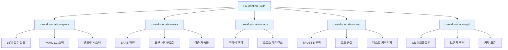
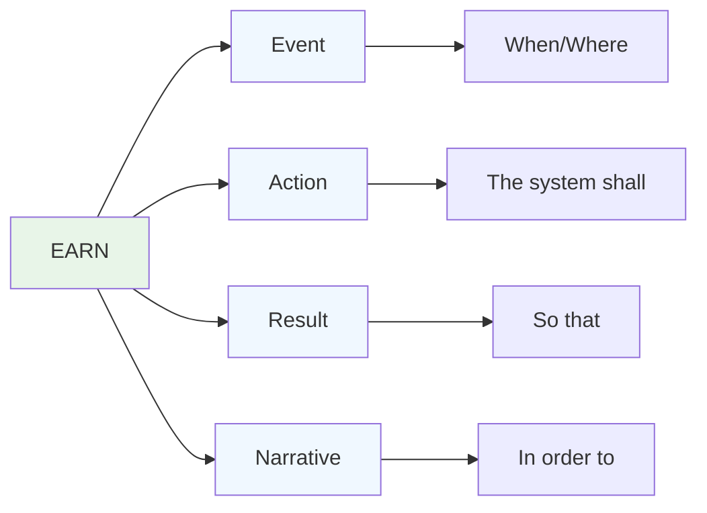
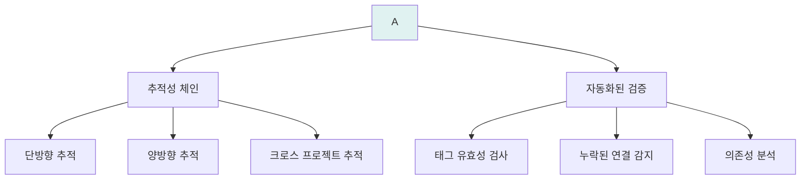
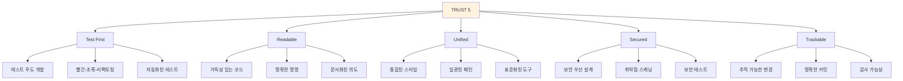
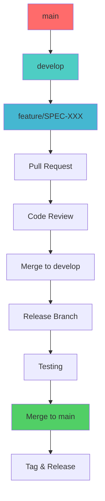

# Foundation Skills

Foundation Skills는 MoAI-ADK의 핵심 기반을 구성하는 필수적인 Skills입니다. 이 Skills들은 SPEC-First TDD 접근 방식의 근간을 이루며, 모든 개발 활동의 품질과 일관성을 보장합니다.

## Foundation Skills 아키텍처



## 1. moai-foundation-specs

### 개요
SPEC 문서 작성 및 검증을 위한 전문 YAML frontmatter 시스템을 제공합니다.

### 핵심 기능
- ✅ **15개 필수 필드**: 완벽한 SPEC 메타데이터
- ✅ **15+ 템플릿**: 실제 프로젝트 기반 템플릿
- ✅ **YAML 1.2 호환**: 공식 스펙 준수
- ✅ **자동 검증**: 스키마 기반 검증
- ✅ **크로스 레퍼런스**: 의존성 관리

### 15개 필수 필드

```yaml
---
# 핵심 식별 필드 (4개)
spec_id: "SPEC-DOCS-001"                  # 고유 SPEC 식별자
spec_title: "문서화 시스템 구축"           # 사람이 읽기 쉬운 제목
domain: "DOCUMENTATION"                   # 기술 도메인
version: "1.0.0"                         # 시맨틱 버전

# 메타데이터 필드 (6개)
created_date: "2025-11-11"               # 생성일
status: "active|completed|pending"       # 현재 상태
priority: "P0|P1|P2|P3"                  # 우선순위 레벨
owner: "Alfred Team"                      # 소유자 정보
author: "Alfred"                          # 주요 작성자
reviewer: "Goos"                          # 코드 검토 리더

# 분류 필드 (3개)
type: "new|enhancement|bugfix|documentation" # 변경 타입
complexity: "low|medium|high"            # 구현 복잡도
estimated_effort_hours: 40               # 시간 추정

# 라이프사이클 필드 (2개)
implementation_phases: 3                 # 단계 수
timeline_weeks: 2                        # 기간 (주)
---
```

### 템플릿 시스템

#### SPEC 템플릿 유형
1. **Feature SPEC**: 새로운 기능 명세
2. **Enhancement SPEC**: 기존 기능 개선
3. **Bugfix SPEC**: 버그 수정 명세
4. **API SPEC**: API 설계 명세
5. **UI/UX SPEC**: 사용자 인터페이스 명세
6. **Infrastructure SPEC**: 인프라 변경 명세
7. **Security SPEC**: 보안 관련 명세
8. **Performance SPEC**: 성능 최적화 명세

#### 사용 예시
```bash
# 새로운 SPEC 생성
Skill("moai-foundation-specs").create_spec(
    spec_type="feature",
    title="사용자 인증 시스템",
    domain="AUTHENTICATION"
)

# 기존 SPEC 검증
Skill("moai-foundation-specs").validate_spec(
    spec_file="specs/auth-system.md"
)
```

## 2. moai-foundation-ears

### 개요
EARS (Easy Approach to Requirements Syntax) 프레임워크를 적용하여 구조화된 요구사항을 작성하고 관리합니다.

### EARS 패턴 구조



### EARS 템플릿

#### 1. Event-Condition-Action (ECA)
```gherkin
When 사용자가 로그인 버튼을 클릭하면
And 유효한 자격증명을 입력했을 때
The system shall 사용자 세션을 생성하여야 한다
So that 사용자는 인증된 기능에 접근할 수 있다
```

#### 2. Ubiquitous Language 패턴
```gherkin
In order to 시스템의 무결성을 보장하기 위해
The system shall 모든 API 요청을 인증하여야 한다
When 인증되지 않은 요청이 발생할 때
The system shall 401 Unauthorized 응답을 반환하여야 한다
```

#### 3. 비기능적 요구사항
```gherkin
In order to 사용자 경험을 최적화하기 위해
The system shall API 응답 시간을 200ms 이내로 유지하여야 한다
When 동시 1000명의 사용자가 접속할 때
So that 시스템 응답성이 보장되어야 한다
```

### 자동화된 검증
- **구문 검증**: EARS 패턴 준수 여부 확인
- **의미론적 검증**: 요구사항의 명확성과 일관성 검사
- **추적성 검증**: 다른 산출물과의 연결성 확인
- **테스트 가능성**: 요구사항의 테스트 가능성 평가

## 3. moai-foundation-tags

### 개요




### 태그 유형 및 패턴

| 태그 유형 | 패턴 | 사용 예시 | 설명 |
|----------|------|----------|------|

### 추적성 체인 관리

#### 1. 단방향 추적
```markdown
# SPEC → TEST → CODE → DOC 순서
```

#### 2. 양방향 추적
```markdown
# 역방향 추적도 지원
```

### 자동화된 추적성 검증
```python
def validate_traceability(project_path: Path) -> TraceabilityReport:
    """추적성 체인 자동 검증"""

    issues = []

    # 1. 고아 태그 감지
    orphaned_tags = find_orphaned_tags(project_path)
    if orphaned_tags:
        issues.append(f"고아 태그 발견: {orphaned_tags}")

    # 2. 깨진 체인 감지
    broken_chains = detect_broken_chains(project_path)
    if broken_chains:
        issues.append(f"깨진 추적성 체인: {broken_chains}")

    # 3. 중복 태그 확인
    duplicate_tags = find_duplicate_tags(project_path)
    if duplicate_tags:
        issues.append(f"중복 태그: {duplicate_tags}")

    return TraceabilityReport(issues=issues)
```

## 4. moai-foundation-trust

### 개요
TRUST 5 원칙을 적용하여 소프트웨어 품질을 체계적으로 관리합니다.

### TRUST 5 원칙



### TRUST 5 적용 가이드

#### 1. Test First (테스트 우선)
```python
# RED: 실패하는 테스트 먼저 작성
def test_user_authentication():
    """사용자 인증 기능 테스트"""
    # Given: 유효한 사용자 자격증명
    credentials = {"email": "user@example.com", "password": "valid_password"}

    # When: 인증 요청
    response = auth_service.authenticate(credentials)

    # Then: 성공 응답
    assert response.status_code == 200
    assert response.token is not None

# GREEN: 최소한의 구현으로 테스트 통과
def authenticate(self, credentials):
    if self.validate_credentials(credentials):
        return Response(200, token="generated_token")
    return Response(401, token=None)

# REFACTOR: 코드 개선
def authenticate(self, credentials):
    if not self.validate_credentials(credentials):
        raise AuthenticationError("Invalid credentials")

    token = self.generate_secure_token(credentials["email"])
    return AuthResponse(token=token, expires_in=3600)
```

#### 2. Readable (가독성)
```python
# 명확한 함수명과 의도 표현
def calculate_monthly_revenue(user_subscriptions: List[Subscription]) -> Decimal:
    """
    월간 수익을 계산합니다.

    Args:
        user_subscriptions: 활성 사용자 구독 목록

    Returns:
        Decimal: 총 월간 수익

    Raises:
        ValueError: 잘못된 구독 데이터일 경우
    """
    total_revenue = Decimal('0.00')

    for subscription in user_subscriptions:
        if subscription.is_active():
            monthly_price = subscription.plan.monthly_price
            total_revenue += monthly_price

    return total_revenue
```

#### 3. Unified (통합성)
```python
# 프로젝트 전체의 일관된 패턴 적용
class UserService:
    """통합된 서비스 클래스 패턴"""

    def __init__(self, repository: UserRepository, logger: Logger):
        self._repository = repository  # 의존성 주입
        self._logger = logger

    def create_user(self, user_data: UserCreateDto) -> UserResponseDto:
        """통합된 생성 메서드 패턴"""
        # 1. 입력 검증
        validated_data = self._validate_input(user_data)

        # 2. 비즈니스 로직 실행
        user = self._repository.create(validated_data)

        # 3. 로깅
        self._logger.info(f"User created: {user.id}")

        # 4. 응답 변환
        return UserResponseDto.from_entity(user)
```

#### 4. Secured (보안)
```python
# 보안 우선 설계 패턴
class SecureAPIService:
    def __init__(self):
        self._rate_limiter = RateLimiter(max_requests=100)
        self._input_sanitizer = InputSanitizer()
        self._auth_service = AuthService()

    def process_request(self, request: APIRequest) -> APIResponse:
        # 1. 속도 제한
        self._rate_limiter.check_limit(request.client_ip)

        # 2. 인증/인가
        self._auth_service.authorize(request.token, required_permissions)

        # 3. 입력 검증 및 정제
        sanitized_input = self._input_sanitizer.clean(request.data)

        # 4. 안전한 처리
        return self._secure_process(sanitized_input)
```

#### 5. Trackable (추적 가능성)
```python
# 추적 가능한 코드 변경
def process_payment(payment_data: PaymentData) -> PaymentResult:
    """

    변경 이력:
    """

    # 변경 추적을 위한 로깅
    logger.info(f"Processing payment: {payment_data.order_id}",

    try:
        # 결제 처리 로직
        result = payment_gateway.charge(payment_data)

        # 성공 기록
        audit_logger.log_payment_success(payment_data, result)

        return PaymentResult(success=True, transaction_id=result.id)

    except PaymentError as e:
        # 실패 기록
        audit_logger.log_payment_failure(payment_data, str(e))

        raise PaymentProcessingError(f"Payment failed: {e}")
```

### TRUST 5 품질 점수
```python
def calculate_trust_score(project_analysis: ProjectAnalysis) -> QualityScore:
    """TRUST 5 원칙 기반 품질 점수 계산"""

    scores = {
        "test_first": calculate_test_coverage(project_analysis.tests),
        "readable": analyze_code_readability(project_analysis.code),
        "unified": check_style_consistency(project_analysis.codebase),
        "secured": scan_security_vulnerabilities(project_analysis.code),
        "trackable": verify_traceability(project_analysis.artifacts)
    }

    # 가중치 적용 (각 20%)
    total_score = sum(scores.values()) * 0.2

    return QualityScore(
        total=total_score,
        breakdown=scores,
        recommendations=generate_improvement_suggestions(scores)
    )
```

## 5. moai-foundation-git

### 개요
Git 워크플로우와 모범 사례를 적용하여 안정적인 버전 관리를 지원합니다.

### GitFlow 워크플로우



### 브랜치 전략

| 브랜치 유형 | 용도 | 생명주기 | 규칙 |
|------------|------|----------|------|
| **main** | 프로덕션 릴리스 | 영구 | 직접 커밋 금지 |
| **develop** | 개발 통합 | 영구 | 기능 브랜치 병합 |
| **feature/SPEC-XXX** | 기능 개발 | 임시 | develop에서 분기 |
| **hotfix/** | 긴급 수정 | 임시 | main에서 분기 |
| **release/** | 릴리스 준비 | 임시 | develop에서 분기 |

### 커밋 메시지 표준

#### 커밋 메시지 구조
```bash
# 기본 형식
<type>(<scope>): <subject>

<body>

<footer>

# 실제 예시
feat(auth): OAuth 2.0 구현 추가

Google OAuth 및 GitHub OAuth 로그인 기능을 구현했습니다.
- OAuth 2.0 클라이언트 설정 추가
- 사용자 인증 흐름 개선
- 에러 처리 및 재시도 로직 구현

```

#### 커밋 타입
| 타입 | 설명 | 사용 예시 |
|------|------|----------|
| **feat** | 새로운 기능 | `feat(api): 사용자 엔드포인트 추가` |
| **fix** | 버그 수정 | `fix(auth): 로그인 오류 수정` |
| **docs** | 문서 변경 | `docs(readme): 설치 가이드 업데이트` |
| **style** | 코드 스타일 | `style(python): PEP 8 준수` |
| **refactor** | 리팩토링 | `refactor(service): 중복 코드 제거` |
| **test** | 테스트 관련 | `test(auth): 인증 테스트 추가` |
| **chore** | 빌드/유틸리티 | `chore(deps): 패키지 의존성 업데이트` |

### 자동화된 Git 훅
```bash
#!/bin/sh
# pre-commit hook

# 1. 커밋 메시지 검증
commit_regex='^(feat|fix|docs|style|refactor|test|chore)(\(.+\))?: .{1,50}'
if ! grep -qE "$commit_regex" "$1"; then
    echo "커밋 메시지 형식이 올바르지 않습니다."
    exit 1
fi

if git diff --cached --name-only | grep -q "\.md\|\.py\|\.js\|\.ts"; then
    python scripts/validate_tags.py
fi

# 3. 코드 스타일 검증
python -m flake8 --max-line-length=88 .
python -m black --check .

# 4. 테스트 실행
python -m pytest --tb=short
```

## 통합된 Foundation Skills 활용

### 완전한 개발 사이클
```python
def complete_development_workflow(feature_spec: str):
    """Foundation Skills를 활용한 완전한 개발 사이클"""

    # 1. SPEC 생성 (moai-foundation-specs)
    spec_skill = Skill("moai-foundation-specs")
    spec = spec_skill.create_spec_from_input(feature_spec)

    # 2. 요구사항 구조화 (moai-foundation-ears)
    ears_skill = Skill("moai-foundation-ears")
    requirements = ears_skill.structure_requirements(spec.content)

    # 3. 태그 할당 (moai-foundation-tags)
    tags_skill = Skill("moai-foundation-tags")
    tags = tags_skill.assign_traceability_tags(spec)

    # 4. TRUST 5 적용 (moai-foundation-trust)
    trust_skill = Skill("moai-foundation-trust")
    quality_gates = trust_skill.setup_quality_gates(spec)

    # 5. Git 워크플로우 (moai-foundation-git)
    git_skill = Skill("moai-foundation-git")
    branch = git_skill.create_feature_branch(spec.spec_id)

    return {
        "spec": spec,
        "requirements": requirements,
        "tags": tags,
        "quality_gates": quality_gates,
        "branch": branch
    }
```

## 다음 섹션

- [Skills 전체 개요](./overview) - 55개 Skills 시스템 전체 보기
- [Alfred 페르소나 시스템](../output-style/personas) - 적응형 커뮤니케이션
- [Alfred 에이전트 가이드](../guides/alfred) - 슈퍼에이전트 활용법