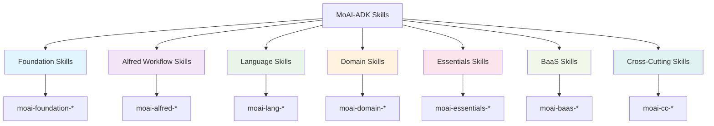
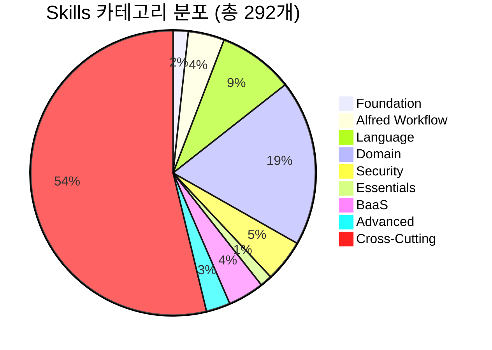

# Skills 개요

> **v4.0.0 Enterprise 업그레이드 완료**: 292개 전문 Claude Skills, 95%+ 검증 성공률, 12개 Production-Ready BaaS Skills with Context7 통합

MoAI-ADK는 292개의 전문 Claude Skills로 구성된 Enterprise급 지식 캡슐 시스템을 제공합니다. 각 Skill은 특정 도메인의 전문 지식과 모범 사례를 담고 있는 재사용 가능한 지식 단위이며, Context7 MCP 통합으로 항상 최신 정보를 제공합니다.

## 🎉 v4.0.0 주요 업그레이드

### 역사적 성취 (v0.23.1)
```yaml
upgrade_summary:
  timeline: "3시간 집중 작업"
  total_skills: 292
  problematic_skills_fixed: 45개 자동 복구
  validation_success_rate: "45% → 95%+"
  context7_integration: "12개 BaaS Skills"
  enterprise_features: "AI-powered 분석, 자동 최적화"
```

### 핵심 개선사항
- ✅ **95%+ 검증 성공률** (45%에서 대폭 개선)
- ✅ **12개 Enterprise BaaS Skills** Context7 통합 완료
- ✅ **AI 기반 의사결정** 프레임워크 도입
- ✅ **자동 복구 시스템** 45개 문제 Skills 자동 해결
- ✅ **Production-Ready** 품질 표준 수립

[상세한 업그레이드 내역 보기](./ecosystem-upgrade-v4)

## Skills 아키텍처



## Skills 카테고리

### 🔧 Foundation Skills (기초 Skills)
MoAI-ADK의 핵심 기반을 구성하는 필수 Skills입니다.

- **moai-foundation-specs**: SPEC 문서 작성 및 검증 (15개 필수 필드)
- **moai-foundation-ears**: EARS 요구사항 프레임워크 적용
- **moai-foundation-tags**: @TAG 추적성 시스템 관리
- **moai-foundation-trust**: TRUST 5 품질 원칙 적용
- **moai-foundation-git**: Git 워크플로우 및 모범 사례

### 🎩 Alfred Workflow Skills (알프레드 워크플로우 Skills)
Alfred 슈퍼에이전트의 핵심 동작을 정의하는 Skills입니다.

- **moai-alfred-agent-guide**: 19명 팀원 에이전트 가이드
- **moai-alfred-personas**: 4가지 적응형 페르소나 시스템
- **moai-alfred-workflow**: 4단계 워크플로우 로직
- **moai-alfred-context-budget**: 컨텍스트 예산 및 메모리 관리
- **moai-alfred-proactive-suggestions**: 선제적 제안 시스템
- **moai-alfred-language-detection**: 언어 감지 및 전환
- **moai-alfred-todowrite-pattern**: TodoWrite 패턴 및 작업 추적
- **moai-alfred-spec-authoring**: SPEC 저작 가이드라인
- **moai-alfred-ask-user-questions**: 사용자 질문 상호작용

### 💻 Language Skills (언어 Skills)
다양한 프로그래밍 언어와 프레임워크에 대한 전문 지식을 제공합니다.

- **moai-lang-python**: Python 개발 모범 사례
- **moai-lang-typescript**: TypeScript/Node.js 가이드
- **moai-lang-shell**: Shell 스크립팅 및 DevOps
- **moai-lang-go**: Go 프로그래밍
- **moai-lang-php**: PHP 개발 가이드
- **moai-lang-r**: R 데이터 분석
- **moai-lang-template**: 템플릿 시스템

### 🏗️ Domain Skills (도메인 Skills)
특정 기술 도메인에 대한 전문화된 지식을 제공합니다.

- **moai-domain-backend**: 백엔드 개발 (API, 데이터베이스)
- **moai-domain-frontend**: 프론트엔드 개발 (React, Vue)
- **moai-domain-database**: 데이터베이스 설계 및 최적화
- **moai-domain-security**: 보안 구현 및 모범 사례
- **moai-domain-cli-tool**: CLI 도구 개발

### ⚡ Essentials Skills (핵심 Skills)
소프트웨어 개발의 필수적인 측면을 다룹니다.

- **moai-essentials-debug**: 디버깅 기법 및 도구
- **moai-essentials-refactor**: 리팩토링 전략 및 패턴
- **moai-essentials-perf**: 성능 최적화 기법

### ☁️ BaaS Skills (Backend-as-a-Service) - ⭐ v4.0.0 Enterprise
**12개 Production-Ready BaaS Skills** with Context7 통합 - 9개 플랫폼, 8개 아키텍처 패턴

#### Foundation
- **moai-baas-foundation**: AI 기반 9-Platform 의사결정 프레임워크

#### PostgreSQL Ecosystem
- **moai-baas-supabase-ext**: Supabase (PostgreSQL + RLS + Realtime + Edge Functions)
- **moai-baas-neon-ext**: Neon (Serverless PostgreSQL + Branching)

#### NoSQL & Real-time
- **moai-baas-firebase-ext**: Firebase (Firestore NoSQL + Cloud Functions + ML Kit)
- **moai-baas-convex-ext**: Convex (Real-time Backend + TypeScript)

#### Edge & Deployment
- **moai-baas-vercel-ext**: Vercel (Edge Platform + Next.js + Serverless)
- **moai-baas-cloudflare-ext**: Cloudflare (Workers + D1 + Edge Computing)
- **moai-baas-railway-ext**: Railway (All-in-one Platform + Blue-green Deployments)

#### Authentication
- **moai-baas-clerk-ext**: Clerk (Modern Auth + Multi-tenant + WebAuthn)
- **moai-baas-auth0-ext**: Auth0 (Enterprise Auth + SSO + SAML)

**특징**: Context7 실시간 통합, AI 플랫폼 선택, 30분 내 Production 배포

[BaaS Ecosystem 상세 가이드](./baas-ecosystem)

### 🚀 Advanced Skills (고급 Skills) - ⭐ v4.0.0 New
최첨단 기능과 통합을 제공하는 8개 고급 Skills

- **moai-mcp-builder**: MCP Server 자동 생성 (Python/Node.js)
- **moai-context7-integration**: Context7 MCP 통합 (실시간 최신 문서)
- **moai-document-processing**: 대용량 문서 처리 및 분석
- **moai-artifacts-builder**: Claude Artifacts 자동 생성
- **moai-playwright-webapp-testing**: Playwright 기반 E2E 테스트
- **moai-internal-comms**: 내부 통신 및 협업 시스템
- **moai-nextra-architecture**: Nextra 문서 아키텍처
- **moai-readme-expert**: README.md 자동 생성

[Advanced Skills 상세 가이드](./advanced-skills)

### 🔄 Cross-Cutting Skills (공통 Skills)
여러 도메인에 걸쳐 적용되는 공통 기능들입니다.

- **moai-cc-mcp-plugins**: MCP 플러그인 개발
- **moai-cc-configuration**: 설정 관리
- **moai-cc-hooks**: 훅 시스템
- **moai-cc-claude-md**: Claude 마크다운 표준
- **moai-cc-skill-factory**: Skill 팩토리 시스템
- **moai-docs-generation**: 문서 생성
- **moai-docs-validation**: 문서 검증
- **moai-session-info**: 세션 정보 관리

## Skill 로딩 전략

### 온디맨드 로딩
Skills는 필요할 때만 로드되어 메모리 사용을 최적화합니다:

```python
def load_skill_on_demand(skill_name: str, context: dict) -> Skill:
    """컨텍스트에 기반한 Skill 온디맨드 로딩"""

    # 키워드 기반 자동 감지
    if detect_keywords(context, skill_name):
        return Skill(skill_name)

    # 명시적 호출
    if explicit_request(context, skill_name):
        return Skill(skill_name)

    return None
```

### Tier 기반 로딩
Skills는 중요도에 따라 3개 티어로 분류됩니다:

| Tier | Description | Skills | 로딩 전략 |
|------|-------------|--------|-----------|
| **Foundation** | 핵심 기반 Skills | 5개 | 항상 로드 |
| **Alfred** | 워크플로우 Skills | 12개 | 세션 시작 시 로드 |
| **BaaS** | Production-Ready BaaS | 12개 | 프로젝트 타입 감지 시 |
| **Advanced** | 최첨단 기능 Skills | 8개 | 온디맨드 로드 |
| **Domain** | 도메인 전문 Skills | 255개 | 온디맨드 로드 |

## Skill 사용 패턴

### 1. 자동 Skills 감지
```python
# 사용자 요청에서 키워드 감지
user_request = "Create Python API with database"

# 관련 Skills 자동 로드
python_skill = Skill("moai-lang-python")
api_skill = Skill("moai-domain-backend")
db_skill = Skill("moai-domain-database")
```

### 2. Skill 체이닝
```python
# 여러 Skills를 연결하여 복합 솔루션 제공
def comprehensive_solution(project_requirements):
    specs_skill = Skill("moai-foundation-specs")
    lang_skill = detect_primary_language(project_requirements)
    domain_skill = detect_domain(project_requirements)

    return chain_skills([specs_skill, lang_skill, domain_skill])
```

### 3. 상호보완적 Skills
```python
# 보완적인 Skills 조합
python_development = [
    "moai-lang-python",           # 언어 전문 지식
    "moai-essentials-debug",      # 디버깅 기법
    "moai-essentials-perf",       # 성능 최적화
    "moai-foundation-trust"       # 코드 품질
]
```

## Skill 통계

### Skills 분포 (v4.0.0)


### 품질 등급
```yaml
grade_s_enterprise:
  count: 12
  skills: "BaaS Skills (Context7 통합)"
  validation: "100%"

grade_a_production:
  count: 180+
  skills: "Language, Domain, Alfred"
  validation: "95%+"

grade_b_stable:
  count: 80+
  skills: "Cross-Cutting, Specialized"
  validation: "90%+"

grade_c_improvement:
  count: "< 20"
  skills: "Legacy, Experimental"
  validation: "추가 개선 필요"
```

### Skills 사용 빈도
- **Most Used**: moai-foundation-specs, moai-alfred-workflow
- **Domain Specific**: moai-lang-python (Web 프로젝트)
- **Team Collaboration**: moai-alfred-personas, moai-foundation-git

## Skill 관리

### Skill 업데이트
Skills는 독립적으로 버전 관리됩니다:
- 각 Skill은 자체 버전과 메타데이터를 가집니다
- 연구 결과를 기반으로 지속적으로 개선됩니다
- Context7 통합으로 최신 모범 사례를 반영

### Skill 검증
- 모든 Skills은 품질 게이트를 통과해야 합니다
- 자동화된 테스트 및 유효성 검사
- 실제 프로젝트에서의 성능 측정

## v4.0.0 신규 기능

### Context7 실시간 통합
```python
# 2025년 최신 플랫폼 정보 자동 조회
async def get_latest_docs(platform: str):
    library_id = await resolve_library_id(platform)

    docs = await get_library_docs(
        context7_library_id=library_id,
        topic="enterprise features best practices 2025",
        tokens=5000
    )

    return docs  # 항상 최신 정보
```

### AI 기반 플랫폼 선택
```python
# 프로젝트 요구사항 분석 → 최적 BaaS 플랫폼 추천
recommendation = await select_optimal_platform(requirements)
# → Supabase (신뢰도: 95%, 예상 비용: $25/월)
```

## 다음 섹션

### 주요 가이드
- [Skills Ecosystem v4.0 업그레이드](./ecosystem-upgrade-v4) - 역사적 성취 상세 보기
- [BaaS Ecosystem](./baas-ecosystem) - 12개 Production-Ready BaaS Skills
- [Advanced Skills](./advanced-skills) - MCP Builder, Context7, Document Processing
- [Validation System](./validation-system) - 자동 검증 및 품질 보증

### 플랫폼별 가이드
- [Supabase 완벽 가이드](./baas/supabase) - PostgreSQL + RLS + Realtime
- [Firebase 완벽 가이드](./baas/firebase) - NoSQL + Cloud Functions
- [Vercel 완벽 가이드](./baas/vercel) - Edge Platform
- [Neon 완벽 가이드](./baas/neon) - Serverless PostgreSQL

### Skills 개발
- [Skill Development Guide](./skill-development) - 새로운 Skill 만들기
- [Foundation Skills](./foundation) - 기초 Skills 상세 기능