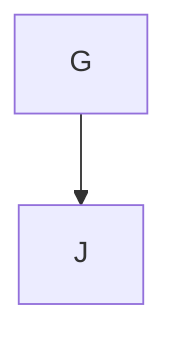

---
---


## TAG 체인 기본 개념

### 1. 체인 정의
TAG 체인은 관련된 TAG들이 논리적 흐름을 따라 연결된 구조입니다. 각 TAG는 체인의 특정 단계를 나타내며, 전체 개발 라이프사이클을 추적합니다.

### 2. 필수 체인 구조
```mermaid
graph LR
```

### 3. 체인 유형

#### 완전 체인 (Complete Chain)
```
```

#### 부분 체인 (Partial Chain)
```
```

#### 확장 체인 (Extended Chain)
```
```

## 체인 구성 요소


#### 역할
- 기능 요구사항 정의
- 비즈니스 목적 명시
- 성공 기준 설정

#### 예시
```markdown
# 사용자 인증 시스템

## 핵심 요구사항
- 성공 기준: 유효한 자격증명 시 JWT 토큰 발급
- 실패 기준: 잘못된 자격증명 시 401 에러 반환

- 성공 기준: 이메일 중복 확인 후 사용자 계정 생성
- 실패 기준: 중복 이메일 시 409 에러 반환
```


#### 역할
- 시스템 아키텍처 설계
- 데이터 모델 정의
- 기술 스택 결정

#### 예시
```markdown
# 인증 시스템 설계

## 아키텍처
- 인증 서버: 독립적인 마이크로서비스
- 토큰 저장: Redis 기반 토큰 블랙리스트
- 만료 관리: Access Token 15분, Refresh Token 7일

## 데이터베이스 설계
- users 테이블: 사용자 기본 정보
- auth_sessions 테이블: 활성 세션 관리
- password_resets 테이블: 비밀번호 재설정 토큰
```


#### 역할
- 구현 작업 정의
- 개발 계획 수립
- 리소스 할당

#### 예시
```python
# 작업 정의
"""
사용자 로그인 API 구현

담당자: 프론트엔드팀
예상 기간: 2일
"""

@app.post('/api/auth/login')
async def login(credentials: LoginCredentials):
    """
    사용자 로그인 처리

    """
    # JWT 토큰 생성 및 반환
    pass
```


#### API 구현
```python
@app.post('/api/auth/login')
async def login(credentials: LoginCredentials):
    """
    """
    # 이메일/비밀번호 검증
    # JWT 토큰 생성
    # 로그인 기록 저장
    return {"access_token": token, "refresh_token": refresh_token}
```

#### UI 구현
```jsx
// 로그인 폼 컴포넌트
function LoginForm() {
  /*
   */

  const [email, setEmail] = useState('');
  const [password, setPassword] = useState('');

  return (
    <form onSubmit={handleSubmit}>
      {/* 이메일/비밀번호 입력 필드 */}
    </form>
  );
}
```

#### 데이터 모델
```python
# 사용자 모델
class User(BaseModel):
    """
    """
    email: str
    password_hash: str
    created_at: datetime
    last_login: Optional[datetime]
```


#### 단위 테스트
```python
def test_login_success():
    """
    """
    # 유효한 자격증명으로 로그인 시도
    response = client.post('/api/auth/login', json={
        'email': 'test@example.com',
        'password': 'validpassword'
    })

    assert response.status_code == 200
    assert 'access_token' in response.json()
```

#### 통합 테스트
```python
def test_user_authentication_flow():
    """
    """
    # 회원가입 → 로그인 → API 접근 전체 흐름 테스트
    pass
```

## 체인 검증

### 1. 자동 검증 규칙

#### 필수 연결 규칙
```python
class ChainValidator:
    def validate_completeness(self, tags: List[TAG]) -> ValidationResult:
        """
        TAG 체인 완전성 검증 규칙:
        4. 체인은 순환 참조를 포함할 수 없음
        """
        pass
```

#### 연결 강도 검증
```python
def validate_connection_strength(self, chain: TAGChain) -> StrengthScore:
    """
    연결 강도 평가 기준:
    - Direct (10점): 직접적인 구현 관계
    - Strong (7점): 명확한 의존성
    - Medium (5점): 간접적 관계
    - Weak (3점): 느슨한 연관성
    """
    pass
```

### 2. 체인 품질 메트릭

#### 완전성 점수
```
완전성 = (연결된 TAG 수 / 전체 TAG 수) × 100

A급: 95-100% (완벽한 체인)
B급: 85-94%  (약간의 누락)
C급: 70-84%  (다수 누락)
D급: 50-69%  (심각한 누락)
F급: <50%    (체인 붕괴)
```

#### 추적성 지수
```
추적성 = (REQ로부터 TEST까지 연결된 체인 수 / 전체 REQ 수) × 100
```

### 3. 체인 시각화

#### 의존성 그래프


#### 체인 커버리지 대시보드
- 완전한 체인: 23개
- 부분적인 체인: 8개
- 고립된 TAG: 3개
- 전체 완전성: 85%

## 체인 관리 도구

### 1. 체인 분석기

#### CLI 명령어
```bash
# 체인 상태 분석
moai-adk chains analyze

# 깨진 체인 찾기
moai-adk chains find-broken

# 체인 커버리지 보고서
moai-adk chains coverage-report
```

#### 체인 분석 결과
```
=== TAG 체인 분석 보고서 ===

전체 TAG: 156개
완전한 체인: 23개 (73%)
부분적인 체인: 8개 (25%)
고립된 TAG: 3개 (2%)

=== 문제 TAG ===
```

### 2. 체인 자동 복구

#### 누락된 TAG 제안
```python
def suggest_missing_tags(self, chain: TAGChain) -> List[SuggestedTAG]:
    """
    누락된 TAG 자동 제안:
    """
    suggestions = []

    for tag in chain.tags:
        if tag.category == 'REQ' and not chain.has_implementation(tag):
            suggestions.append(self.suggest_implementation_tags(tag))

    return suggestions
```

#### 체인 자동 연결
```python
def auto_connect_chains(self, tags: List[TAG]) -> ConnectionPlan:
    """
    자동 체인 연결 규칙:
    1. 유사한 이름의 TAG 자동 연결
    2. 동일 모듈 내 TAG 그룹화
    3. 시간적 근접성 기반 연결
    """
    pass
```

## 체인 모범 사례

### 1. 체인 설계 원칙

#### 단일 책임 원칙
```
좋은 예:

나쁜 예:
```

#### 일관성 원칙
```
식별자 일관성:
```

### 2. 체인 유지 관리

#### 정기 검사
- 주간 체인 상태 점검
- 누락된 TAG 자동 탐지
- 고립된 TAG 정리

#### 체인 업데이트
- 요구사항 변경 시 체인 동기화
- 리팩토링 시 TAG 이관
- 기능 삭제 시 체인 정리

### 3. 대규모 프로젝트 체인 관리

#### 모듈별 체인 분리
```
사용자 관리 모듈:

결제 모듈:
```

#### 계층적 체인 구조
```
```

## 고급 체인 기능

### 1. 동적 체인

#### 런타임 체인 생성
```python
# API 호출 기반 동적 체인
def create_dynamic_chain(api_endpoint: str) -> TAGChain:
    """API 엔드포인트 분석으로 동적 체인 생성"""
    # 함수 분석
    # 의존성 추적
    # 자동 TAG 생성
    pass
```

### 2. 크로스-프로젝트 체인

#### 공통 체인 라이브러리
```
```

### 3. 체인 분석 및 인사이트

#### 개발 패턴 분석
```python
def analyze_dev_patterns(self, chains: List[TAGChain]) -> PatternAnalysis:
    """
    개발 패턴 분석:
    - 가장 흔한 체인 구조
    - 평균 체인 길이
    - 병목 지점 식별
    - 품질 트렌드 추적
    """
    pass
```

#### 품질 예측
```python
def predict_quality_issues(self, chain: TAGChain) -> QualityRisk:
    """
    품질 문제 예측:
    - 불완전한 체인 위험도
    - 테스트 커버리지 부족
    - 요구사항 누락 가능성
    """
    pass
```

## 체인 트러블슈팅

### 1. 일반적인 체인 문제

#### 순환 참조
```
문제: A → B → C → A
해결: 의존성 방향 재설정
```

#### 깨진 체인
```
해결: 중간 구현 TAG 추가
```

#### 과도한 체인
```
해결: 체인 분리 또는 단순화
```

### 2. 진단 도구

#### 체인 상태 점검
```bash
# 모든 체인 상태 확인
moai-adk chains health-check

# 특정 모듈 체인 검사
moai-adk chains check --module user-auth
```

#### 체인 복구
```bash
# 자동 체인 복구
moai-adk chains repair --auto

# 대화형 체인 복구
moai-adk chains repair --interactive
```