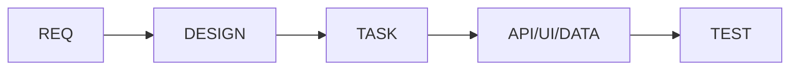

# @TAG 관리

@TAG 시스템은 MoAI-ADK의 핵심 추적 메커니즘으로, 요구사항부터 구현, 테스트까지 전체 개발 라이프사이클을 추적합니다. 이 문서는 @TAG의 효과적인 관리 방법을 설명합니다.

## @TAG 기본 개념

### 1. TAG 구조
```
@카테고리:식별자
```

**예시:**
- `@REQ:USER-AUTH-001` - 사용자 인증 요구사항
- `@TEST:UNIT-LOGIN-001` - 로그인 단위 테스트
- `@API:POST-LOGIN` - 로그인 API 엔드포인트

### 2. 12개 핵심 카테고리

| 카테고리 | 설명 | 사용 예시 |
|---------|------|----------|
| REQ | 기능 요구사항 | `@REQ:FEATURE-001` |
| DESIGN | 시스템 설계 | `@DESIGN:ARCH-001` |
| TASK | 개발 작업 | `@TASK:IMPLEMENT-001` |
| TEST | 테스트 케이스 | `@TEST:UNIT-001` |
| FEATURE | 기능 모듈 | `@FEATURE:LOGIN` |
| API | API 엔드포인트 | `@API:GET-USERS` |
| UI | UI 컴포넌트 | `@UI:LOGIN-FORM` |
| DATA | 데이터 모델 | `@DATA:USER-MODEL` |
| RESEARCH | 연구 활동 | `@RESEARCH:PERF-001` |
| ANALYSIS | 분석 결과 | `@ANALYSIS:BOTTLENECK-001` |
| KNOWLEDGE | 지식 베이스 | `@KNOWLEDGE:PATTERN-001` |
| INSIGHT | 통찰력 | `@INSIGHT:OPTIMIZATION-001` |

## TAG 생성 규칙

### 1. 명명 규칙

#### 식별자 형식
```
[CATEGORY]-[MODULE]-[SEQUENCE]
```

**좋은 예:**
- `@REQ:AUTH-LOGIN-001`
- `@TEST:UNIT-USER-001`
- `@API:POST-AUTH-LOGIN`

**나쁜 예:**
- `@REQ:1` (의미 없는 식별자)
- `@TEST:test` (중복되는 카테고리)
- `@API:login_endpoint` (일관성 없는 형식)

#### 대문자 표기
- 모든 카테고리와 식별자는 대문자 사용
- 하이픈(-)으로 단어 구분
- 언더스코어(_) 사용 금지

### 2. 배치 규칙

#### 코드 내 TAG 위치
```python
def login_user(username: password):
    """
    사용자 로그인 처리

    @REQ:AUTH-LOGIN-001
    @API:POST-AUTH-LOGIN
    @TASK:IMPLEMENT-LOGIN-001
    """
    # 구현
    pass
```

#### SPEC 문서 TAG
```markdown
# 사용자 인증 시스템

## 요구사항
- @REQ:AUTH-LOGIN-001: 사용자는 아이디와 비밀번호로 로그인할 수 있어야 함

## 설계
- @DESIGN:AUTH-ARCH-001: JWT 기반 인증 아키텍처
```

## TAG 체인 관리

### 1. 필수 체인

#### SPEC → CODE → TEST 체인


**체인 예시:**
```
@REQ:USER-MGMT-001
├── @DESIGN:DB-SCHEMA-001
├── @TASK:IMPLEMENT-CRUD-001
│   ├── @API:GET-USERS
│   ├── @API:POST-USER
│   └── @API:PUT-USER
└── @TEST:INTEGRATION-CRUD-001
```

### 2. 체인 검증

#### 자동 검증 규칙
1. **REQ 태그**: 항상 하나 이상의 구현 TAG를 가져야 함
2. **TEST 태그**: 반드시 구현 TAG를 참조해야 함
3. **DESIGN 태그**: 구현 TAG를 설명해야 함

#### 수동 검증 체크리스트
- [ ] 모든 요구사항(@REQ)이 구현되었는가?
- [ ] 모든 구현이 테스트(@TEST)를 가지는가?
- [ ] TAG 간 관계가 명확한가?

## TAG 관리 도구

### 1. CLI 명령어

#### TAG 검색
```bash
# 모든 TAG 검색
moai-adk tags scan

# 특정 카테고리 검색
moai-adk tags search --category REQ

# 누락된 TAG 검색
moai-adk tags check-missing
```

#### TAG 검증
```bash
# TAG 체인 검증
moai-adk tags validate-chains

# 정책 준수 검사
moai-adk tags validate-policy
```

#### TAG 보고서
```bash
# 커버리지 보고서
moai-adk tags report --type coverage

# 추적성 매트릭스
moai-adk tags report --type traceability
```

### 2. VS Code 확장기능

#### TAG 하이라이팅
- 구문 강조
- 호버 정보 표시
- 빠른 탐색 기능

#### TAG 검증
- 실시간 TAG 형식 검사
- 누락된 TAG 경고
- 체인 연결 확인

## TAG 자동화

### 1. 자동 생성

#### SPEC 문서에서 TAG 추출
```python
# 자동 TAG 생성 예시
content = """
사용자 로그인 기능이 필요합니다.
"""
auto_generated_tags = extract_tags(content)
# 결과: ["@REQ:AUTH-LOGIN-001"]
```

#### 코드 기반 TAG 제안
```python
# 함수에서 TAG 자동 제안
def create_user(username, email):
    pass

# 제안 결과:
# @API:POST-USERS
# @DATA:USER-MODEL
# @TEST:UNIT-CREATE-USER
```

### 2. 자동 검증

#### Pre-commit 훅
```yaml
# .pre-commit-config.yaml
repos:
  - repo: local
    hooks:
      - id: moai-tags
        name: MoAI TAG validation
        entry: moai-adk tags validate
        language: system
```

#### GitHub Actions
```yaml
# .github/workflows/tag-validation.yml
name: TAG Validation
on: [push, pull_request]
jobs:
  validate-tags:
    runs-on: ubuntu-latest
    steps:
      - uses: actions/checkout@v3
      - name: Validate TAGs
        run: moai-adk tags validate-all
```

## TAG 모범 사례

### 1. 태그 전략

#### 기능별 그룹화
```
@REQ:CART-ADD-001      # 장바구니 추가 요구사항
@API:CART-ADD          # 장바구니 추가 API
@TEST:CART-ADD-001     # 장바구니 추가 테스트
```

#### 계층적 구조
```
@REQ:ECOMMERCE-001     # 전자상거래 시스템 요구사항
├── @REQ:CART-001      # 장바구니 기능 요구사항
│   ├── @REQ:CART-ADD-001
│   └── @REQ:CART-REMOVE-001
└── @REQ:PAYMENT-001   # 결제 기능 요구사항
```

### 2. 일관성 유지

#### 카테고리 사용 규칙
- **REQ**: 최상위 요구사항만 사용
- **TASK**: 구현 단위 작업에 사용
- **API**: 실제 API 엔드포인트에만 사용

#### 식별자 관리
- 프로젝트 전체에서 고유한 식별자 사용
- 시퀀스 번호 체계 유지
- 중복 방지 검증

### 3. 문서화

#### TAG 레지스트리
```markdown
# TAG 레지스트리

## 사용자 관리 (USER)
- @REQ:USER-001: 사용자 등록 기능
- @REQ:USER-002: 사용자 정보 수정
- @API:POST-USERS: 사용자 생성 API
- @API:PUT-USERS-{id}: 사용자 수정 API
```

#### 변경 로그
```markdown
# TAG 변경 로그

## 2024-01-15
- 추가: @REQ:PAYMENT-001 (결제 기능)
- 수정: @API:POST-CART (장바구니 API 변경)
- 삭제: @REQ:LEGACY-001 (레거시 기능 제거)
```

## 문제 해결

### 1. 일반적인 문제

#### 중복 TAG
```python
# 문제: 중복된 TAG
@REQ:USER-001
@REQ:USER-001  # 중복

# 해결: 통합
@REQ:USER-MGMT-001
```

#### 깨진 체인
```python
# 문제: 구현 없는 요구사항
@REQ:FEATURE-001  # 구현 TAG 없음

# 해결: 구현 TAG 추가
@TASK:IMPLEMENT-FEATURE-001
@API:GET-FEATURE
@TEST:INTEGRATION-FEATURE-001
```

### 2. 진단 도구

#### TAG 상태 확인
```bash
# 모든 TAG 상태 보고
moai-adk tags status

# 문제 TAG만 필터링
moai-adk tags status --filter problems
```

#### 복구 도구
```bash
# 누락된 TAG 자동 생성
moai-adk tags fix-missing --auto

# 중복 TAG 병합
moai-adk tags merge-duplicates
```

## 고급 기능

### 1. 크로스-프로젝트 TAG

#### 공통 TAG 라이브러리
```
@COMMON:SECURITY-AUTH-001  # 여러 프로젝트에서 사용
@COMMON:UX-MODAL-001       # 재사용 가능한 UI 컴포넌트
```

### 2. TAG 메타데이터

#### 확장 정보
```python
@REQ:FEATURE-001{
    "priority": "high",
    "effort": "3 days",
    "assignee": "team-frontend",
    "dependencies": ["@REQ:AUTH-001"]
}
```

### 3. TAG 시각화

#### 의존성 그래프
```mermaid
graph TD
    A[@REQ:AUTH-001] --> B[@DESIGN:JWT-001]
    B --> C[@TASK:IMPLEMENT-AUTH-001]
    C --> D[@API:POST-LOGIN]
    D --> E[@TEST:INTEGRATION-LOGIN-001]
```

#### 커버리지 대시보드
- 요구사항 커버리지: 85%
- 테스트 커버리지: 92%
- TAG 체인 완전도: 78%