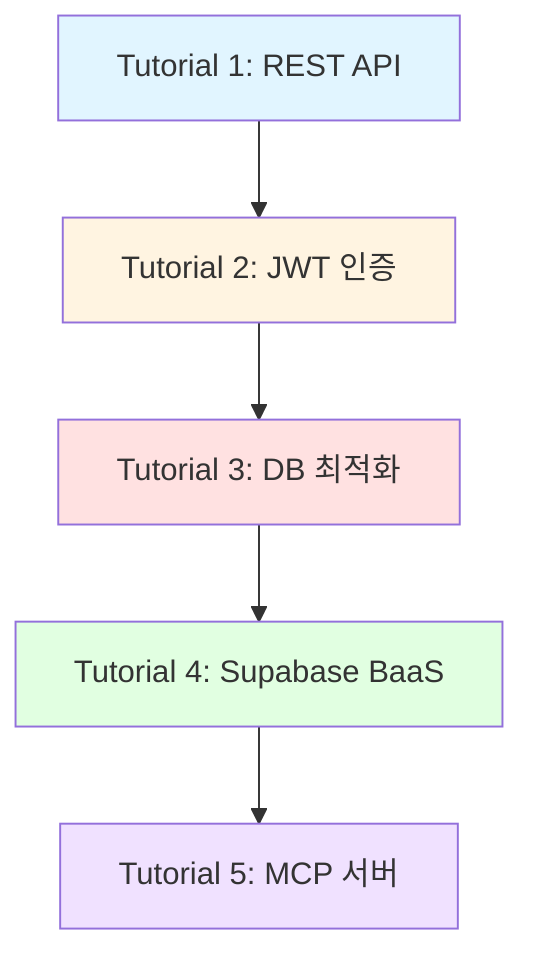

# 튜토리얼

MoAI-ADK를 활용한 실전 프로젝트 튜토리얼입니다. 각 튜토리얼은 단계별 실습을 통해 실무 스킬을 습득할 수 있도록 구성되어 있습니다.

## 🎓 학습 경로

## 📚 튜토리얼 목록

### Tutorial 1: 첫 REST API 개발

**난이도**: ⭐ 초급
**소요 시간**: 30분
**핵심 기술**: FastAPI, Pydantic, Swagger UI

FastAPI로 간단한 사용자 관리 REST API를 만들어봅니다. MoAI-ADK의 SPEC-first TDD 워크플로우를 처음 경험하게 됩니다.

**학습 내용**:
- ✅ `/alfred:1-plan`으로 SPEC 작성
- ✅ `/alfred:2-run`으로 TDD 구현
- ✅ CRUD 엔드포인트 구현
- ✅ 자동 API 문서화

[시작하기 →](/ko/tutorials/tutorial-01-rest-api)

---

### Tutorial 2: JWT 인증 시스템 구현

**난이도**: ⭐⭐ 중급
**소요 시간**: 1시간
**핵심 기술**: JWT, OAuth2, bcrypt, Security

실무에서 사용하는 JWT 기반 인증 시스템을 구현합니다. 보안 모범 사례와 함께 Access Token, Refresh Token 관리를 배웁니다.

**학습 내용**:
- ✅ 회원가입, 로그인, 로그아웃
- ✅ JWT 토큰 발급 및 검증
- ✅ Password hashing
- ✅ Protected routes 구현
- ✅ Senior Engineer Thinking 적용

[시작하기 →](/ko/tutorials/tutorial-02-jwt-auth)

---

### Tutorial 3: 데이터베이스 성능 최적화

**난이도**: ⭐⭐⭐ 고급
**소요 시간**: 1시간
**핵심 기술**: PostgreSQL, SQLAlchemy, Redis, Caching

실무에서 마주치는 성능 문제를 해결합니다. N+1 쿼리 문제, 인덱스 전략, 캐싱 등 데이터베이스 최적화 기법을 습득합니다.

**학습 내용**:
- ✅ N+1 query problem 해결
- ✅ 인덱스 설계 및 적용
- ✅ Query optimization
- ✅ Connection pooling
- ✅ Redis 캐싱 전략
- ✅ Performance monitoring

[시작하기 →](/ko/tutorials/tutorial-03-database-optimization)

---

### Tutorial 4: BaaS 플랫폼 통합 (Supabase)

**난이도**: ⭐⭐ 중급
**소요 시간**: 45분
**핵심 기술**: Supabase, Auth, Realtime, RLS, Storage

Supabase를 활용하여 백엔드 개발 속도를 극대화합니다. 인증, 실시간 데이터, 파일 저장소를 빠르게 구축합니다.

**학습 내용**:
- ✅ Supabase 프로젝트 설정
- ✅ Authentication 통합
- ✅ Realtime subscriptions
- ✅ Row Level Security (RLS)
- ✅ Storage buckets
- ✅ Edge Functions

[시작하기 →](/ko/tutorials/tutorial-04-baas-supabase)

---

### Tutorial 5: MCP 서버 개발

**난이도**: ⭐⭐⭐ 고급
**소요 시간**: 1시간
**핵심 기술**: MCP, Context Protocol, Claude Integration

Model Context Protocol을 이해하고 직접 MCP 서버를 만들어봅니다. Claude Desktop과 통합하여 AI 도구를 확장합니다.

**학습 내용**:
- ✅ MCP 서버 구조 이해
- ✅ Tools 구현
- ✅ Resources 제공
- ✅ Prompts 정의
- ✅ Claude Desktop 통합
- ✅ Context7 통합

[시작하기 →](/ko/tutorials/tutorial-05-mcp-server)

---

## 🎯 튜토리얼 활용 팁

### 초보자라면
1. Tutorial 1부터 순서대로 진행하세요
2. 각 단계를 꼼꼼히 따라하며 개념을 이해하세요
3. 문제 해결 섹션을 참고하세요

### 경험자라면
1. 관심 있는 튜토리얼부터 시작하세요
2. 코드를 자신의 프로젝트에 맞게 수정해보세요
3. Best Practices 섹션에 주목하세요

### 학습 효과를 높이려면
- ✅ 코드를 직접 타이핑하세요 (복사/붙여넣기 지양)
- ✅ 각 단계의 결과를 확인하세요
- ✅ 에러가 나면 직접 해결해보세요
- ✅ 완성 후 코드를 개선해보세요

## 📖 추가 학습 자료

### 기본 가이드
- [빠른 시작](/ko/getting-started/quickstart)
- [핵심 개념](/ko/concepts/core-concepts)
- [Alfred 가이드](/ko/guides/alfred-guide)

### 참조 문서
- [API 레퍼런스](/ko/reference/api)
- [CLI 커맨드](/ko/reference/cli)
- [설정 가이드](/ko/reference/configuration)

### Best Practices
- [SPEC 작성 가이드](/ko/guides/spec-writing)
- [TDD 워크플로우](/ko/guides/tdd-workflow)
- [Git 전략](/ko/guides/git-strategy)

## 💡 튜토리얼 난이도 가이드

| 레벨 | 대상 | 설명 |
|------|------|------|
| ⭐ 초급 | 입문자 | Python 기본 문법을 알고 있으면 충분 |
| ⭐⭐ 중급 | 개발자 | 웹 개발 경험이 있으면 좋음 |
| ⭐⭐⭐ 고급 | 숙련자 | 시스템 아키텍처 이해 필요 |

## 🆘 도움이 필요하신가요?

- **Discord**: [MoAI-ADK Community](https://discord.gg/moai-adk)
- **GitHub Issues**: [문제 보고](https://github.com/yourusername/MoAI-ADK/issues)
- **Email**: support@moai-adk.com

---

**Happy Coding! 🚀**
