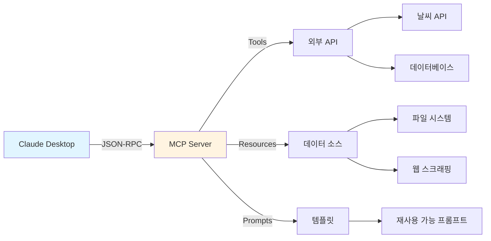

# Tutorial 5: MCP 서버 개발

이 튜토리얼에서는 Model Context Protocol (MCP)을 이해하고 직접 MCP 서버를 개발합니다. Claude Desktop과 통합하여 AI의 능력을 확장하고, 커스텀 도구를 제공하는 방법을 배웁니다.

## 🎯 학습 목표

이 튜토리얼을 완료하면 다음을 할 수 있습니다:

- ✅ Model Context Protocol (MCP) 개념 이해하기
- ✅ MCP 서버 구조 및 아키텍처 파악하기
- ✅ Tools (도구) 구현하여 AI에게 기능 제공하기
- ✅ Resources (리소스) 제공으로 컨텍스트 관리하기
- ✅ Prompts (프롬프트) 정의로 재사용 가능한 템플릿 만들기
- ✅ Claude Desktop에 MCP 서버 통합하기
- ✅ Context7과 통합하여 최신 문서 제공하기
- ✅ Alfred의 MCP Builder Skill 활용하기

## 📋 사전 요구사항

### 필수 설치

- **Python 3.11+** 또는 **Node.js 18+**
- **MoAI-ADK v0.23.0+**
- **Claude Desktop**: [claude.ai/download](https://claude.ai/download)
- **uv** (Python 패키지 매니저): `curl -LsSf https://astral.sh/uv/install.sh | sh`

### 선행 지식

- REST API 기본
- JSON-RPC 프로토콜 (기본 개념)
- Python 또는 TypeScript
- 비동기 프로그래밍 (async/await)

### 설치 확인

```bash
# uv 설치 확인
uv --version

# Claude Desktop 설치 확인
ls ~/Library/Application\ Support/Claude/

# 프로젝트 디렉토리
mkdir weather-mcp-server
cd weather-mcp-server
moai-adk init
```

## 🧩 MCP란?

**Model Context Protocol (MCP)**는 AI 모델이 외부 데이터 소스, 도구, 컨텍스트에 안전하게 접근할 수 있게 하는 개방형 프로토콜입니다.

### MCP 아키텍처



### 주요 구성 요소

1. **Tools**: AI가 실행할 수 있는 함수 (API 호출, 계산 등)
2. **Resources**: AI가 읽을 수 있는 데이터 (파일, 문서 등)
3. **Prompts**: 재사용 가능한 프롬프트 템플릿

## 🚀 프로젝트 개요: 날씨 MCP 서버

**기능**:
- 현재 날씨 조회 (Tool)
- 주간 예보 조회 (Tool)
- 날씨 히스토리 제공 (Resource)
- 날씨 분석 프롬프트 (Prompt)

**API**: OpenWeatherMap (무료 API)

## 📁 프로젝트 구조

```
weather-mcp-server/
├── .moai/
│   └── specs/
│       └── SPEC-MCP-001.md
├── src/
│   └── weather_mcp/
│       ├── __init__.py
│       ├── server.py           # MCP 서버 메인
│       ├── tools.py            # Tool 구현
│       ├── resources.py        # Resource 구현
│       ├── prompts.py          # Prompt 정의
│       └── weather_api.py      # 날씨 API 클라이언트
├── tests/
│   ├── test_tools.py
│   └── test_server.py
├── pyproject.toml
├── README.md
└── .env.example
```

## 단계별 실습

### Step 1: SPEC 작성

```bash
/alfred:1-plan "MCP 날씨 서버 개발"
```

**생성된 SPEC** (`.moai/specs/SPEC-MCP-001.md`):

```markdown
# SPEC-MCP-001: 날씨 MCP 서버

## 요구사항

Model Context Protocol을 구현한 날씨 정보 제공 서버

### 기능 요구사항

#### Tools (도구)

- FR-001: get_current_weather
  - 입력: 도시명 (city), 국가 코드 (country, 선택)
  - 출력: 현재 온도, 날씨 상태, 습도, 바람

- FR-002: get_forecast
  - 입력: 도시명, 일수 (1-7일)
  - 출력: 일별 예보 (최고/최저 온도, 날씨)

- FR-003: search_cities
  - 입력: 검색어
  - 출력: 일치하는 도시 목록

#### Resources (리소스)

- FR-004: weather_history
  - URI: weather://history/{city}
  - 설명: 과거 1년 날씨 데이터

- FR-005: weather_alerts
  - URI: weather://alerts/{country}
  - 설명: 기상 특보

#### Prompts (프롬프트)

- FR-006: analyze_weather
  - 설명: 날씨 데이터 분석 및 조언 제공
  - 인자: 도시명, 날짜 범위

- FR-007: plan_trip
  - 설명: 날씨 기반 여행 계획 수립
  - 인자: 출발지, 목적지, 기간

### 기술 요구사항

- TR-001: JSON-RPC 2.0 프로토콜 준수
- TR-002: STDIO 통신 (Claude Desktop 통합)
- TR-003: 에러 처리 (API 실패, 타임아웃)
- TR-004: 캐싱 (불필요한 API 호출 방지)
```

### Step 2: 환경 설정

**pyproject.toml**:
```toml
[project]
name = "weather-mcp-server"
version = "0.1.0"
description = "MCP server for weather information"
requires-python = ">=3.11"
dependencies = [
    "mcp>=0.9.0",
    "httpx>=0.25.0",
    "pydantic>=2.5.0",
    "python-dotenv>=1.0.0",
]

[project.optional-dependencies]
dev = [
    "pytest>=7.4.0",
    "pytest-asyncio>=0.21.0",
]

[build-system]
requires = ["hatchling"]
build-backend = "hatchling.build"
```

**.env.example**:
```env
# OpenWeatherMap API Key (무료: https://openweathermap.org/api)
OPENWEATHER_API_KEY=your_api_key_here
```

설치:
```bash
# uv로 설치
uv pip install -e .

# API 키 설정
cp .env.example .env
# https://openweathermap.org/api에서 무료 키 발급 후 입력
```

### Step 3: 날씨 API 클라이언트

**src/weather_mcp/weather_api.py**:

```python
"""
OpenWeatherMap API 클라이언트
"""
import os
from typing import Optional, Dict, Any
import httpx
from dotenv import load_dotenv

load_dotenv()


class WeatherAPIClient:
    """날씨 API 클라이언트"""

    BASE_URL = "https://api.openweathermap.org/data/2.5"

    def __init__(self, api_key: Optional[str] = None):
        self.api_key = api_key or os.getenv("OPENWEATHER_API_KEY")
        if not self.api_key:
            raise ValueError("OPENWEATHER_API_KEY is required")

        self.client = httpx.AsyncClient(timeout=10.0)

    async def get_current_weather(
        self, city: str, country: Optional[str] = None
    ) -> Dict[str, Any]:
        """
        현재 날씨 조회

        Args:
            city: 도시명
            country: 국가 코드 (ISO 3166)

        Returns:
            날씨 정보 딕셔너리

        Raises:
            httpx.HTTPError: API 호출 실패
        """
        location = f"{city},{country}" if country else city

        response = await self.client.get(
            f"{self.BASE_URL}/weather",
            params={
                "q": location,
                "appid": self.api_key,
                "units": "metric",  # 섭씨
                "lang": "kr",
            },
        )
        response.raise_for_status()

        data = response.json()

        return {
            "city": data["name"],
            "country": data["sys"]["country"],
            "temperature": data["main"]["temp"],
            "feels_like": data["main"]["feels_like"],
            "humidity": data["main"]["humidity"],
            "weather": data["weather"][0]["description"],
            "wind_speed": data["wind"]["speed"],
        }

    async def get_forecast(
        self, city: str, days: int = 5
    ) -> Dict[str, Any]:
        """
        일별 예보 조회

        Args:
            city: 도시명
            days: 예보 일수 (1-5)

        Returns:
            예보 정보
        """
        response = await self.client.get(
            f"{self.BASE_URL}/forecast",
            params={
                "q": city,
                "appid": self.api_key,
                "units": "metric",
                "cnt": days * 8,  # 3시간 간격 데이터
            },
        )
        response.raise_for_status()

        data = response.json()

        # 일별로 그룹화
        daily_forecast = []
        current_day = None

        for item in data["list"]:
            date = item["dt_txt"].split(" ")[0]

            if date != current_day:
                current_day = date
                daily_forecast.append({
                    "date": date,
                    "temp_min": item["main"]["temp_min"],
                    "temp_max": item["main"]["temp_max"],
                    "weather": item["weather"][0]["description"],
                })

        return {
            "city": data["city"]["name"],
            "forecast": daily_forecast[:days],
        }

    async def close(self):
        """클라이언트 종료"""
        await self.client.aclose()
```

### Step 4: Tools 구현

**src/weather_mcp/tools.py**:

```python
"""
MCP Tools 구현
"""
from typing import Any
from mcp.types import Tool, TextContent
from .weather_api import WeatherAPIClient


class WeatherTools:
    """날씨 관련 Tools"""

    def __init__(self, api_client: WeatherAPIClient):
        self.api_client = api_client

    def get_tool_definitions(self) -> list[Tool]:
        """Tool 정의 목록 반환"""
        return [
            Tool(
                name="get_current_weather",
                description="특정 도시의 현재 날씨를 조회합니다",
                inputSchema={
                    "type": "object",
                    "properties": {
                        "city": {
                            "type": "string",
                            "description": "도시명 (예: Seoul, Tokyo)",
                        },
                        "country": {
                            "type": "string",
                            "description": "국가 코드 (예: KR, JP) - 선택사항",
                        },
                    },
                    "required": ["city"],
                },
            ),
            Tool(
                name="get_forecast",
                description="특정 도시의 일별 예보를 조회합니다 (최대 5일)",
                inputSchema={
                    "type": "object",
                    "properties": {
                        "city": {
                            "type": "string",
                            "description": "도시명",
                        },
                        "days": {
                            "type": "integer",
                            "description": "예보 일수 (1-5)",
                            "minimum": 1,
                            "maximum": 5,
                            "default": 3,
                        },
                    },
                    "required": ["city"],
                },
            ),
        ]

    async def execute_tool(self, name: str, arguments: dict[str, Any]) -> list[TextContent]:
        """
        Tool 실행

        Args:
            name: Tool 이름
            arguments: Tool 인자

        Returns:
            실행 결과 (TextContent 리스트)
        """
        if name == "get_current_weather":
            return await self._get_current_weather(arguments)
        elif name == "get_forecast":
            return await self._get_forecast(arguments)
        else:
            raise ValueError(f"Unknown tool: {name}")

    async def _get_current_weather(self, args: dict[str, Any]) -> list[TextContent]:
        """현재 날씨 조회 Tool"""
        city = args["city"]
        country = args.get("country")

        try:
            weather = await self.api_client.get_current_weather(city, country)

            result = f"""
**{weather['city']}, {weather['country']} 현재 날씨**

- 🌡️ 온도: {weather['temperature']}°C (체감: {weather['feels_like']}°C)
- 🌤️ 날씨: {weather['weather']}
- 💧 습도: {weather['humidity']}%
- 💨 풍속: {weather['wind_speed']} m/s
"""

            return [TextContent(type="text", text=result.strip())]

        except Exception as e:
            return [TextContent(
                type="text",
                text=f"날씨 정보를 가져올 수 없습니다: {str(e)}"
            )]

    async def _get_forecast(self, args: dict[str, Any]) -> list[TextContent]:
        """일별 예보 조회 Tool"""
        city = args["city"]
        days = args.get("days", 3)

        try:
            forecast = await self.api_client.get_forecast(city, days)

            result = f"**{forecast['city']} {days}일 예보**\n\n"

            for day in forecast["forecast"]:
                result += f"📅 {day['date']}\n"
                result += f"   - 최고: {day['temp_max']}°C, 최저: {day['temp_min']}°C\n"
                result += f"   - 날씨: {day['weather']}\n\n"

            return [TextContent(type="text", text=result.strip())]

        except Exception as e:
            return [TextContent(
                type="text",
                text=f"예보 정보를 가져올 수 없습니다: {str(e)}"
            )]
```

### Step 5: Resources 구현

**src/weather_mcp/resources.py**:

```python
"""
MCP Resources 구현
"""
from typing import Any
from mcp.types import Resource, TextResourceContents


class WeatherResources:
    """날씨 관련 Resources"""

    def get_resource_definitions(self) -> list[Resource]:
        """Resource 정의 목록"""
        return [
            Resource(
                uri="weather://help",
                name="Weather MCP Server Help",
                description="사용 가능한 기능 및 사용법",
                mimeType="text/markdown",
            ),
            Resource(
                uri="weather://cities/popular",
                name="Popular Cities",
                description="자주 조회되는 도시 목록",
                mimeType="application/json",
            ),
        ]

    async def read_resource(self, uri: str) -> str:
        """
        Resource 읽기

        Args:
            uri: Resource URI

        Returns:
            Resource 내용
        """
        if uri == "weather://help":
            return self._get_help_content()
        elif uri == "weather://cities/popular":
            return self._get_popular_cities()
        else:
            raise ValueError(f"Unknown resource: {uri}")

    def _get_help_content(self) -> str:
        """도움말 컨텐츠"""
        return """
# Weather MCP Server 사용법

## Tools

### get_current_weather
현재 날씨 조회

**사용 예**:
\`\`\`
서울의 현재 날씨는?
도쿄의 날씨 알려줘
\`\`\`

### get_forecast
일별 예보 조회 (최대 5일)

**사용 예**:
\`\`\`
서울 3일 예보
부산 5일 날씨 예보
\`\`\`

## 지원 도시

- 한국: Seoul, Busan, Incheon, Daegu, Gwangju
- 일본: Tokyo, Osaka, Kyoto, Fukuoka
- 미국: New York, Los Angeles, Chicago
- 유럽: London, Paris, Berlin, Rome

## Tips

- 정확한 결과를 위해 영문 도시명 사용 권장
- 국가 코드 (예: KR, JP, US)를 함께 입력하면 더 정확
"""

    def _get_popular_cities(self) -> str:
        """인기 도시 목록"""
        import json

        cities = [
            {"name": "Seoul", "country": "KR", "region": "Asia"},
            {"name": "Tokyo", "country": "JP", "region": "Asia"},
            {"name": "New York", "country": "US", "region": "North America"},
            {"name": "London", "country": "GB", "region": "Europe"},
            {"name": "Paris", "country": "FR", "region": "Europe"},
        ]

        return json.dumps(cities, ensure_ascii=False, indent=2)
```

### Step 6: Prompts 구현

**src/weather_mcp/prompts.py**:

```python
"""
MCP Prompts 구현
"""
from typing import Any
from mcp.types import Prompt, PromptMessage


class WeatherPrompts:
    """날씨 관련 Prompts"""

    def get_prompt_definitions(self) -> list[Prompt]:
        """Prompt 정의 목록"""
        return [
            Prompt(
                name="analyze_weather",
                description="날씨 데이터를 분석하고 조언 제공",
                arguments=[
                    {
                        "name": "city",
                        "description": "분석할 도시명",
                        "required": True,
                    },
                ],
            ),
            Prompt(
                name="plan_trip",
                description="날씨 기반 여행 계획 수립",
                arguments=[
                    {
                        "name": "destination",
                        "description": "목적지",
                        "required": True,
                    },
                    {
                        "name": "days",
                        "description": "여행 기간 (일)",
                        "required": True,
                    },
                ],
            ),
        ]

    async def get_prompt(self, name: str, arguments: dict[str, Any]) -> PromptMessage:
        """
        Prompt 반환

        Args:
            name: Prompt 이름
            arguments: Prompt 인자

        Returns:
            PromptMessage
        """
        if name == "analyze_weather":
            return self._analyze_weather_prompt(arguments)
        elif name == "plan_trip":
            return self._plan_trip_prompt(arguments)
        else:
            raise ValueError(f"Unknown prompt: {name}")

    def _analyze_weather_prompt(self, args: dict[str, Any]) -> PromptMessage:
        """날씨 분석 Prompt"""
        city = args["city"]

        return PromptMessage(
            role="user",
            content=f"""
{city}의 현재 날씨와 3일 예보를 조회하고, 다음을 분석해주세요:

1. **현재 날씨 평가**: 외출하기 좋은 날씨인지?
2. **주간 예보 트렌드**: 날씨가 좋아지는지, 나빠지는지
3. **옷차림 추천**: 현재 기온에 적합한 옷차림
4. **활동 추천**: 이 날씨에 적합한 실내/외 활동

분석 후 간단한 요약을 제공해주세요.
""",
        )

    def _plan_trip_prompt(self, args: dict[str, Any]) -> PromptMessage:
        """여행 계획 Prompt"""
        destination = args["destination"]
        days = args["days"]

        return PromptMessage(
            role="user",
            content=f"""
{destination}로 {days}일간 여행을 계획 중입니다.

다음을 고려하여 여행 계획을 수립해주세요:

1. **날씨 확인**: {destination}의 {days}일 예보 조회
2. **적합한 활동**: 날씨에 맞는 관광 활동 추천
3. **준비물**: 날씨 기반 필수 준비물 (우산, 선크림 등)
4. **주의사항**: 기상 특보나 주의할 점

여행자에게 유용한 조언을 제공해주세요.
""",
        )
```

### Step 7: MCP 서버 구현

**src/weather_mcp/server.py**:

```python
"""
Weather MCP Server
"""
import asyncio
from mcp.server import Server
from mcp.server.stdio import stdio_server
from .weather_api import WeatherAPIClient
from .tools import WeatherTools
from .resources import WeatherResources
from .prompts import WeatherPrompts


async def main():
    """MCP 서버 실행"""
    # 초기화
    api_client = WeatherAPIClient()
    tools = WeatherTools(api_client)
    resources = WeatherResources()
    prompts = WeatherPrompts()

    # MCP 서버 생성
    server = Server("weather-mcp-server")

    @server.list_tools()
    async def list_tools():
        """사용 가능한 Tools 목록"""
        return tools.get_tool_definitions()

    @server.call_tool()
    async def call_tool(name: str, arguments: dict):
        """Tool 실행"""
        return await tools.execute_tool(name, arguments)

    @server.list_resources()
    async def list_resources():
        """사용 가능한 Resources 목록"""
        return resources.get_resource_definitions()

    @server.read_resource()
    async def read_resource(uri: str):
        """Resource 읽기"""
        content = await resources.read_resource(uri)
        return content

    @server.list_prompts()
    async def list_prompts():
        """사용 가능한 Prompts 목록"""
        return prompts.get_prompt_definitions()

    @server.get_prompt()
    async def get_prompt(name: str, arguments: dict):
        """Prompt 반환"""
        return await prompts.get_prompt(name, arguments)

    # STDIO로 서버 실행
    async with stdio_server() as (read_stream, write_stream):
        await server.run(read_stream, write_stream)


if __name__ == "__main__":
    asyncio.run(main())
```

### Step 8: Claude Desktop 통합

**Claude Desktop 설정 파일 수정**:

**macOS**: `~/Library/Application Support/Claude/claude_desktop_config.json`
**Windows**: `%APPDATA%\Claude\claude_desktop_config.json`

```json
{
  "mcpServers": {
    "weather": {
      "command": "uv",
      "args": [
        "--directory",
        "/absolute/path/to/weather-mcp-server",
        "run",
        "weather-mcp"
      ],
      "env": {
        "OPENWEATHER_API_KEY": "your_api_key_here"
      }
    }
  }
}
```

**pyproject.toml에 스크립트 추가**:
```toml
[project.scripts]
weather-mcp = "weather_mcp.server:main"
```

### Step 9: 테스트

**tests/test_tools.py**:

```python
"""
Tools 테스트
"""
import pytest
from weather_mcp.weather_api import WeatherAPIClient
from weather_mcp.tools import WeatherTools


@pytest.fixture
async def tools():
    """Tools 인스턴스"""
    api_client = WeatherAPIClient()
    tools = WeatherTools(api_client)
    yield tools
    await api_client.close()


@pytest.mark.asyncio
async def test_get_current_weather(tools):
    """현재 날씨 조회 테스트"""
    result = await tools.execute_tool(
        "get_current_weather",
        {"city": "Seoul", "country": "KR"}
    )

    assert len(result) == 1
    assert "서울" in result[0].text or "Seoul" in result[0].text
    assert "온도" in result[0].text


@pytest.mark.asyncio
async def test_get_forecast(tools):
    """예보 조회 테스트"""
    result = await tools.execute_tool(
        "get_forecast",
        {"city": "Tokyo", "days": 3}
    )

    assert len(result) == 1
    assert "도쿄" in result[0].text or "Tokyo" in result[0].text
    assert "최고" in result[0].text
```

**테스트 실행**:
```bash
pytest tests/ -v
```

### Step 10: 사용 예제

**Claude Desktop에서 사용**:

1. **Claude Desktop 재시작**
   - 설정 파일 변경 후 반드시 재시작

2. **MCP 서버 연결 확인**
   - Claude Desktop 우측 하단 🔌 아이콘 확인
   - "weather" 서버가 연결되어 있어야 함

3. **Claude에게 질문**:

```
사용자: 서울의 현재 날씨는?

Claude: [get_current_weather 도구 사용]

**서울, KR 현재 날씨**
- 🌡️ 온도: 15.3°C (체감: 13.8°C)
- 🌤️ 날씨: 맑음
- 💧 습도: 45%
- 💨 풍속: 3.2 m/s

현재 서울은 맑고 쾌적한 날씨입니다. 외출하기 좋은 날씨네요!
```

```
사용자: 도쿄 3일 예보

Claude: [get_forecast 도구 사용]

**도쿄 3일 예보**

📅 2024-01-15
   - 최고: 12.5°C, 최저: 6.2°C
   - 날씨: 구름 많음

📅 2024-01-16
   - 최고: 14.8°C, 최저: 7.5°C
   - 날씨: 맑음

📅 2024-01-17
   - 최고: 13.2°C, 최저: 8.1°C
   - 날씨: 비

주간 날씨가 대체로 좋지만 17일에 비가 예상되니 우산을 준비하세요.
```

```
사용자: 서울 날씨 분석해줘

Claude: [analyze_weather 프롬프트 사용 + 도구 조합]

서울의 현재 날씨와 예보를 분석한 결과:

1. **현재 날씨 평가**: 맑고 쾌적하여 외출하기 매우 좋은 날씨
2. **주간 트렌드**: 앞으로 2-3일간 비슷한 날씨 지속 예상
3. **옷차림 추천**: 가벼운 재킷이나 긴팔 셔츠 적합
4. **활동 추천**: 야외 활동(산책, 자전거, 피크닉) 추천

현재가 외출하기 최적의 시기입니다!
```

## ✅ 검증 및 디버깅

### MCP Inspector 사용

```bash
# MCP Inspector 설치
npm install -g @modelcontextprotocol/inspector

# 서버 테스트
npx @modelcontextprotocol/inspector uv --directory /path/to/weather-mcp-server run weather-mcp
```

브라우저에서 `http://localhost:5173` 열기 → Tools, Resources, Prompts 테스트

### 로그 확인

**Claude Desktop 로그**:
```bash
# macOS
tail -f ~/Library/Logs/Claude/mcp*.log

# Windows
type %LOCALAPPDATA%\Claude\logs\mcp*.log
```

## 🔧 문제 해결

### 문제 1: MCP 서버 연결 안 됨

**증상**: Claude Desktop에서 🔌 아이콘 없음

**해결**:
1. `claude_desktop_config.json` 경로 확인
2. JSON 형식 검증 (쉼표, 괄호)
3. 절대 경로 사용 (`/Users/...`)
4. Claude Desktop 완전히 종료 후 재시작

### 문제 2: API 키 오류

**증상**: `401 Unauthorized`

**해결**:
```bash
# .env 파일 확인
cat .env

# 환경변수 테스트
echo $OPENWEATHER_API_KEY

# Claude Desktop 설정에 직접 입력
"env": {
  "OPENWEATHER_API_KEY": "실제_키_값"
}
```

### 문제 3: Tool 실행 실패

**증상**: Claude가 도구를 사용하지 못함

**해결**:
```python
# 에러 처리 강화
try:
    result = await api_client.get_current_weather(city)
except Exception as e:
    logger.error(f"API error: {e}")
    return [TextContent(
        type="text",
        text=f"날씨 정보를 가져올 수 없습니다: {str(e)}"
    )]
```

## 💡 Best Practices

### 1. Tool 설계

```python
# ✅ 좋은 예: 명확한 입력 스키마
Tool(
    name="get_weather",
    inputSchema={
        "type": "object",
        "properties": {
            "city": {"type": "string", "description": "도시명 (영문)"},
            "country": {"type": "string", "description": "국가 코드 (ISO)"}
        },
        "required": ["city"]
    }
)

# ❌ 나쁜 예: 불명확한 스키마
Tool(name="get_weather", inputSchema={})
```

### 2. 에러 처리

```python
# 사용자 친화적 에러 메시지
try:
    result = await fetch_data()
except TimeoutError:
    return "⏱️ 서버 응답 시간 초과. 잠시 후 다시 시도해주세요."
except HTTPError as e:
    return f"❌ API 오류: {e.status_code} - 관리자에게 문의하세요."
```

### 3. 캐싱

```python
from functools import lru_cache
from datetime import datetime, timedelta

@lru_cache(maxsize=100)
def cached_weather(city: str, timestamp: int):
    """5분 캐싱"""
    return fetch_weather(city)

# 사용
current_time = int(datetime.now().timestamp() // 300)  # 5분 단위
result = cached_weather("Seoul", current_time)
```

## 🚀 다음 단계

축하합니다! MCP 서버를 완성했습니다.

### 추가 기능

1. **Context7 통합**: 최신 기술 문서 제공
2. **Database 연동**: 히스토리 데이터 저장
3. **Webhooks**: 기상 특보 실시간 알림
4. **다국어 지원**: 여러 언어로 응답

### 실전 적용

- **자신의 API 통합**: GitHub, Notion, Slack 등
- **팀 워크플로우 자동화**: 반복 작업 Tool로 제공
- **데이터 분석**: 데이터베이스 쿼리 Tool 구현

## 📚 참고 자료

- [MCP 공식 문서](https://modelcontextprotocol.io/)
- [MCP Specification](https://spec.modelcontextprotocol.io/)
- [MCP Server Examples](https://github.com/modelcontextprotocol/servers)
- [Claude Desktop](https://claude.ai/download)

---

**Happy Building! 🚀**
