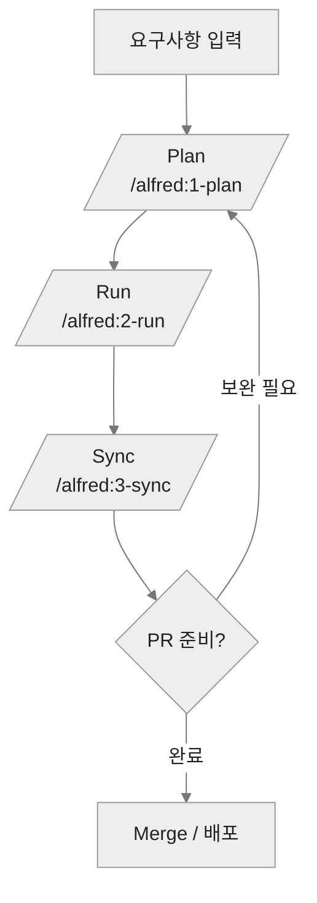

import { Tabs } from 'nextra/components'
"
---
title: "워크플로우"
description: "Alfred SuperAgent가 자동화하는 Plan → Run → Sync 3단계 워크플로우와 Hooks 연동"
---
"
MoAI-ADK는 Alfred SuperAgent가 orchestrate 하는 **4-Step Workflow** (Intent → Plan → Run → Sync) 중 개발자가 반복하는 핵심 3단계를 자동화합니다. 각 단계는 `.claude/commands/alfred/*.md` 정의에 따라 서브 에이전트와 Skills를 불러와 일관된 품질을 보장합니다.
"
## 전체 흐름
"

"
각 단계는 Alfred가 자동으로 연결한 서브 에이전트, Skills, Hooks가 협업하여 진행합니다.
"
## `/alfred:1-plan` — PLAN 단계
"
- **주요 역할**: 요구사항 정제, EARS SPEC 작성, Draft PR/브랜치 생성
- **참여 서브 에이전트**:
  - `spec-builder` (EARS 기반 SPEC 전문가)
  - `project-manager` (프로젝트 메타데이터 업데이트)
  - `git-manager` (브랜치/PR 자동화)
- **핵심 Skills**: `moai-foundation-specs`, `moai-alfred-ears-authoring`, `moai-alfred-spec-metadata-validation`
- **산출물**:
  - `.moai/specs/SPEC-XXX/spec.md`
  - `.moai/memory/spec-metadata.md` 업데이트
  - Draft PR와 feature 브랜치
"
> 시나리오: 신규 SPEC 작성, 기존 SPEC 개선, 아이디어 브레인스토밍 모두 `/alfred:1-plan`에서 처리합니다.
"
## `/alfred:2-run` — RUN 단계
"
- **주요 역할**: RED → GREEN → REFACTOR TDD 사이클 실행
- **단계**:
  1. **Phase 1** – `implementation-planner`가 SPEC 해석, 테스트 시나리오, 위험요소 분석
  2. **Phase 2** – `tdd-implementer`가 테스트 작성과 구현을 반복
  3. **Phase 2.5** – `quality-gate`가 린트, 커버리지, 보안 점검
  4. **Phase 3** – `git-manager`가 커밋 작성, 변경 요약
- **핵심 Skills**: 언어별 `moai-lang-*`, `moai-essentials-refactor`, `moai-essentials-debug`, `moai-alfred-tag-scanning`
- **산출물**:
  - `tests/` 및 `src/` 구현 코드
  - 신뢰성 높은 커밋 메시지와 체크포인트
  - @SPEC ↔ @TEST ↔ @CODE 태그 연결
"
## `/alfred:3-sync` — SYNC 단계
"
- **주요 역할**: 코드/테스트 변경 사항을 문서로 반영, TAG 무결성 검증
- **참여 서브 에이전트**:
  - `doc-syncer` (문서 자동화)
  - `tag-agent` (TAG 체인 검증)
  - `quality-gate` (문서 품질 확인)
- **핵심 작업**:
  - README, CHANGELOG, 보고서 업데이트
  - `.moai/reports/` 생성 및 통계 정리
  - `docs/status/sync-report.md` 작성 (Nextra 이전 자료 참고)
  - Living Document (CLAUDE.md, 개발 가이드) 최신화
"
### 단계별 한눈에 보기
"
| 단계 | 핵심 작업 | 산출물 | 주요 에이전트/Skills |
| ---- | -------- | ------ | -------------------- |
| Plan (`/alfred:1-plan`) | 요구사항 정제, EARS SPEC 작성, Draft PR 생성 | SPEC 파일, feature 브랜치, SPEC 메타데이터 | `spec-builder`, `project-manager`, `git-manager`, `moai-foundation-specs` |
| Run (`/alfred:2-run`) | RED → GREEN → REFACTOR, 품질 게이트, 커밋 작성 | 테스트/구현 코드, 커밋, TODO 리스트 | `implementation-planner`, `tdd-implementer`, `quality-gate`, 언어별 `moai-lang-*` |
| Sync (`/alfred:3-sync`) | 문서/보고서 동기화, TAG 검증, Git 상태 정리 | README/CHANGELOG 업데이트, 리포트, TAG 무결성 로그 | `doc-syncer`, `tag-agent`, `quality-gate`, `moai-alfred-tag-scanning` |
"
## Hooks와의 연동
"
| Hook | 이벤트 | 주요 동작 |
| ---- | ------ | -------- |
| `session_start__show_project_info` | SessionStart | 프로젝트 요약, SPEC 진행률 안내 |
| `user_prompt__jit_load_docs` | UserPromptSubmit | 명령어에 맞는 참고 문서를 즉시 로드 |
| `pre_tool__auto_checkpoint` | PreToolUse | 위험 명령 감지 시 Git checkpoint 생성 |
| `post_tool__log_changes` | PostToolUse | (향후) 변경 로그와 메트릭 기록 |
| `session_end__cleanup` | SessionEnd | 세션 종료 정리 및 데이터 정돈 |
"
## 반복 전략
"
<Tabs items={['기본 팀', '대규모 팀', '실험/POC']} >
  

    <strong>기본 팀</strong> – Plan → Run → Sync 사이클을 기능 단위(4~6시간)로 반복합니다. Sync 이후 바로 Draft PR을 리뷰 요청으로 전환합니다.
  

  

    <strong>대규모 팀</strong> – `/alfred:1-plan` 결과물을 팀 간 계약 문서로 사용하고, `/alfred:2-run`은 언어별 전문가 에이전트에게 분산 실행합니다.
  

  

    <strong>실험/POC</strong> – `/alfred:1-plan`에서 빠른 SPEC 초안 작성 후 `/alfred:2-run --fast` 옵션(옵션이 활성화된 경우)을 사용해 최소 구현을 확보합니다.
  

</Tabs>
"
---
"
다음으로 <a href="/alfred">Alfred 슈퍼에이전트</a>가 제공하는 리소스를 탐색하여 각 단계에서 어떤 명령어와 서브 에이전트가 도움을 주는지 살펴보세요.