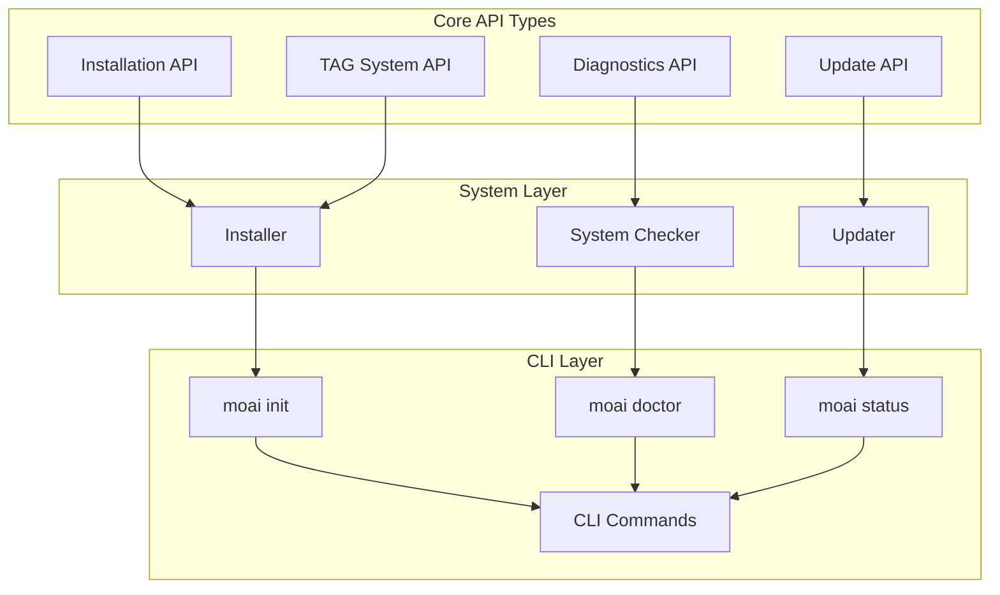
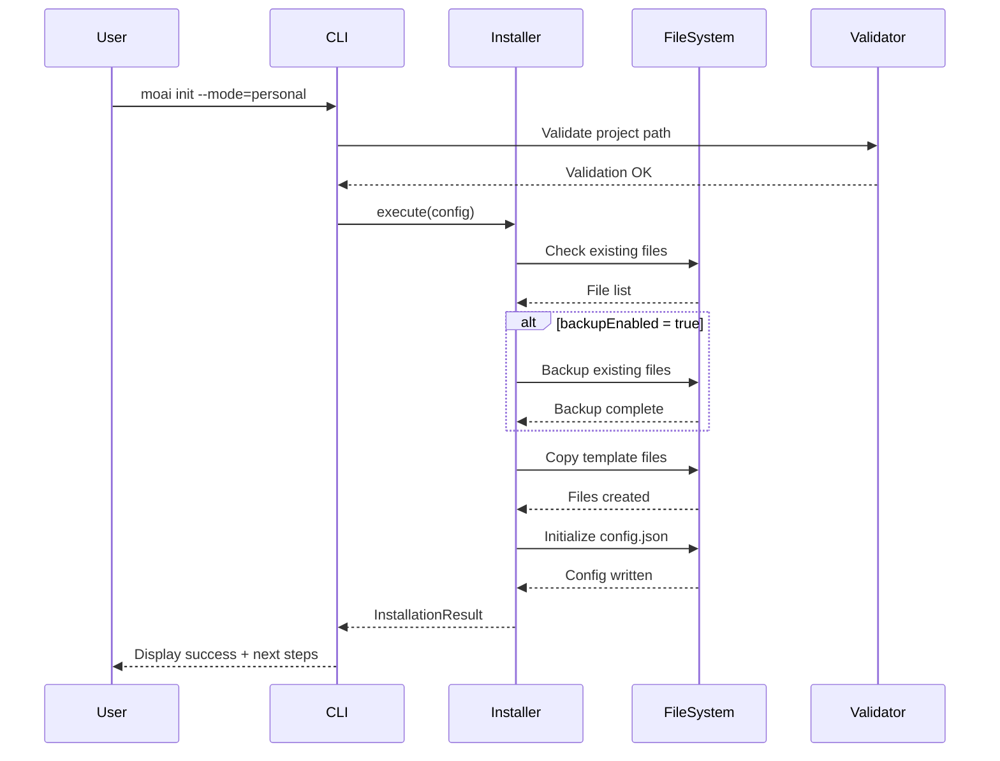
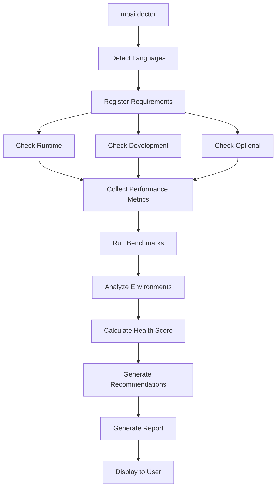
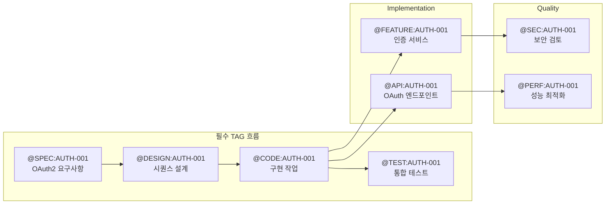
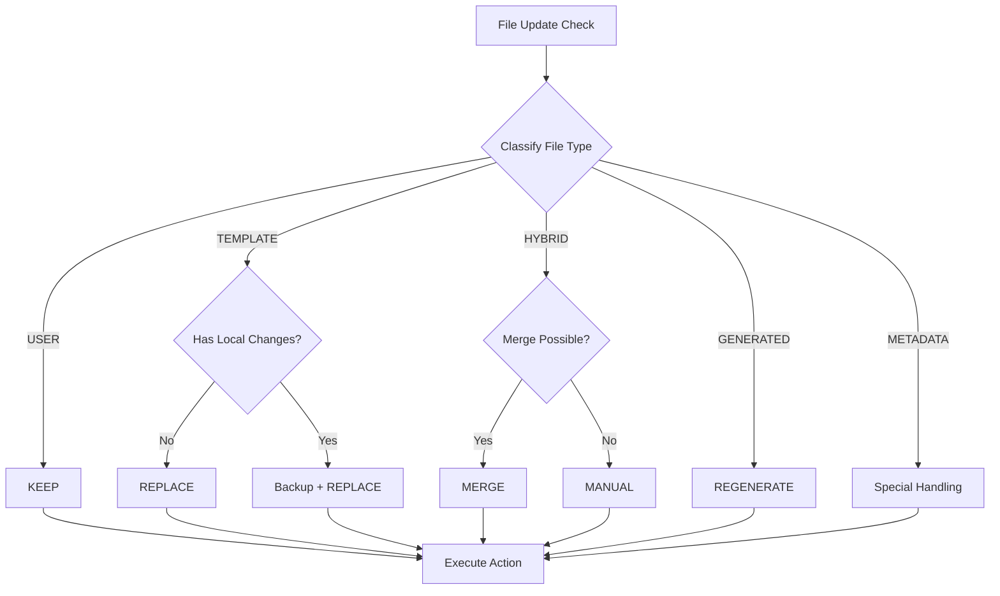
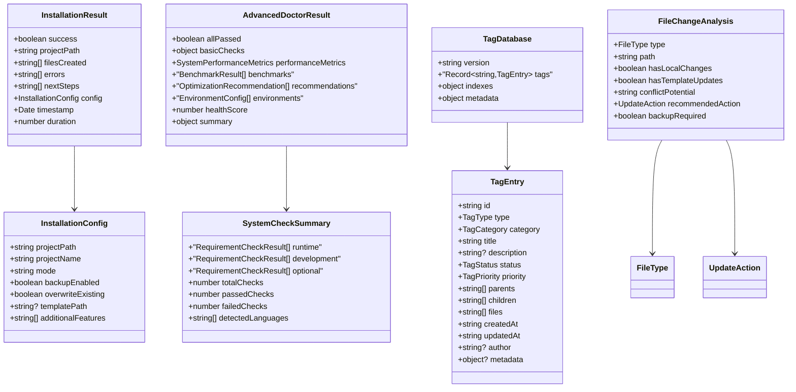

# MoAI-ADK API Reference

> **TypeScript 타입 기반 API 레퍼런스**
> MoAI Agentic Development Kit의 모든 인터페이스와 타입 정의를 제공합니다.

## 개요

### API 레퍼런스의 목적

MoAI-ADK는 TypeScript로 구축된 범용 개발 툴킷으로, 모든 주요 프로그래밍 언어를 지원하는 SPEC-First TDD 방법론을 제공합니다. 이 API 레퍼런스는 MoAI-ADK의 핵심 타입 시스템을 문서화하여 다음 목표를 달성합니다:

- **타입 안전성 보장**: 모든 공개 인터페이스의 계약을 명확히 정의하여 컴파일 시점 오류 방지
- **개발 생산성 향상**: IDE 자동완성과 타입 체크를 통한 개발 속도 향상
- **API 일관성 유지**: 표준화된 인터페이스로 예측 가능한 개발 경험 제공

### 타입 시스템 철학

MoAI-ADK의 타입 시스템은 다음 원칙을 따릅니다:

**불변성 우선 (Immutability First)**: 모든 공개 인터페이스는 `readonly` 속성을 사용하여 의도하지 않은 상태 변경을 방지합니다. 이는 순수 함수형 접근을 가능하게 하며 예측 가능한 동작을 보장합니다.

**명시적 계약 (Explicit Contracts)**: 선택적 속성(`?`)과 필수 속성을 명확히 구분하며, 각 타입의 의도와 사용 목적을 주석으로 문서화합니다. 모호함을 제거하여 API 사용 시 혼란을 최소화합니다.

**조합 가능성 (Composability)**: 작은 단위의 타입을 조합하여 복잡한 구조를 만들며, `Pick`, `Omit`, `extends` 등 TypeScript 유틸리티 타입을 적극 활용합니다. 재사용성을 극대화하고 중복을 제거합니다.

### 사용 방법

이 API 레퍼런스는 다음과 같이 활용할 수 있습니다:

**개발 시**: 각 섹션의 인터페이스 정의를 참조하여 타입 안전한 코드를 작성합니다. JSON 예시를 통해 실제 데이터 구조를 확인하고, 코드 스니펫을 통해 사용 패턴을 학습합니다.

**통합 시**: Mermaid 다이어그램을 통해 타입 간 관계를 파악하고, 시스템 아키텍처를 이해합니다. 데이터 흐름과 의존성을 시각적으로 확인할 수 있습니다.

**디버깅 시**: 타입 정의와 제약사항을 확인하여 오류의 원인을 빠르게 파악합니다. 각 필드의 기본값과 검증 규칙을 통해 예상 동작을 확인합니다.



---

## Installation API

### 개요

Installation API는 MoAI-ADK 프로젝트 초기화 및 설치 프로세스를 관리하는 핵심 인터페이스입니다. `moai init` 명령어가 내부적으로 사용하며, 프로젝트 구조 생성, 템플릿 복사, 설정 파일 초기화를 담당합니다.

이 API는 두 가지 모드를 지원합니다: **Personal 모드** (개인 프로젝트용)와 **Team 모드** (협업 프로젝트용). 각 모드는 서로 다른 기본 설정과 워크플로우를 제공합니다.

### InstallationConfig 인터페이스

```typescript
export interface InstallationConfig {
  readonly projectPath: string;
  readonly projectName: string;
  readonly mode: 'personal' | 'team';
  readonly backupEnabled: boolean;
  readonly overwriteExisting: boolean;
  readonly templatePath?: string;
  readonly additionalFeatures: readonly string[];
}
```

#### 필드 설명

| 필드 | 타입 | 필수 | 기본값 | 설명 |
|------|------|------|--------|------|
| `projectPath` | `string` | ✅ | - | 프로젝트 루트 디렉토리의 절대 경로 |
| `projectName` | `string` | ✅ | - | 프로젝트 이름 (디렉토리명과 동일) |
| `mode` | `'personal' \| 'team'` | ✅ | - | 프로젝트 모드 선택 |
| `backupEnabled` | `boolean` | ✅ | `true` | 기존 파일 백업 여부 |
| `overwriteExisting` | `boolean` | ✅ | `false` | 기존 파일 덮어쓰기 허용 |
| `templatePath` | `string` | ❌ | `undefined` | 커스텀 템플릿 경로 (선택 사항) |
| `additionalFeatures` | `readonly string[]` | ✅ | `[]` | 추가 기능 목록 (예: CI/CD, Docker) |

#### 제약사항

- `projectPath`는 존재하는 디렉토리여야 하며, 쓰기 권한이 있어야 합니다
- `projectName`은 유효한 디렉토리명 규칙을 따라야 합니다 (특수문자 제한)
- `mode`가 `'team'`인 경우 Git 저장소 초기화가 자동으로 수행됩니다
- `overwriteExisting`이 `false`이고 파일이 이미 존재하면 설치가 중단됩니다

#### 사용 예시

```typescript
// Personal 모드 기본 설정
const personalConfig: InstallationConfig = {
  projectPath: '/Users/username/projects/my-app',
  projectName: 'my-app',
  mode: 'personal',
  backupEnabled: true,
  overwriteExisting: false,
  additionalFeatures: []
};

// Team 모드 고급 설정
const teamConfig: InstallationConfig = {
  projectPath: '/workspace/team-project',
  projectName: 'team-project',
  mode: 'team',
  backupEnabled: true,
  overwriteExisting: false,
  templatePath: '/custom/templates/enterprise',
  additionalFeatures: ['ci-cd', 'docker', 'monitoring']
};
```

### InstallationResult 인터페이스

```typescript
export interface InstallationResult {
  readonly success: boolean;
  readonly projectPath: string;
  readonly filesCreated: readonly string[];
  readonly errors: readonly string[];
  readonly nextSteps: readonly string[];
  readonly config: InstallationConfig;
  readonly timestamp: Date;
  readonly duration: number;
}
```

#### 필드 설명

| 필드 | 타입 | 설명 |
|------|------|------|
| `success` | `boolean` | 설치 성공 여부 |
| `projectPath` | `string` | 설치된 프로젝트 경로 |
| `filesCreated` | `readonly string[]` | 생성된 파일 목록 (상대 경로) |
| `errors` | `readonly string[]` | 발생한 오류 메시지 목록 |
| `nextSteps` | `readonly string[]` | 사용자에게 표시할 다음 단계 안내 |
| `config` | `InstallationConfig` | 사용된 설정 (참조용) |
| `timestamp` | `Date` | 설치 완료 시각 |
| `duration` | `number` | 설치 소요 시간 (밀리초) |

#### JSON 예시

```json
{
  "success": true,
  "projectPath": "/Users/username/projects/my-app",
  "filesCreated": [
    ".moai/config.json",
    ".moai/memory/development-guide.md",
    ".moai/project/product.md",
    ".moai/project/structure.md",
    ".moai/project/tech.md",
    ".claude/settings.json",
    "CLAUDE.md"
  ],
  "errors": [],
  "nextSteps": [
    "cd /Users/username/projects/my-app",
    "Review .moai/project/*.md files",
    "Run 'moai doctor' to verify setup",
    "Start with /moai:1-spec to create your first SPEC"
  ],
  "config": {
    "projectPath": "/Users/username/projects/my-app",
    "projectName": "my-app",
    "mode": "personal",
    "backupEnabled": true,
    "overwriteExisting": false,
    "additionalFeatures": []
  },
  "timestamp": "2025-09-30T12:34:56.789Z",
  "duration": 1234
}
```

### InstallationContext 인터페이스

```typescript
export interface InstallationContext {
  readonly config: InstallationConfig;
  readonly startTime: Date;
  readonly phases: PhaseStatus[];
  readonly allFilesCreated: string[];
  readonly allErrors: string[];
}

export interface PhaseStatus {
  readonly name: string;
  readonly completed: boolean;
  readonly duration: number;
  readonly errors: readonly string[];
  readonly filesCreated: readonly string[];
}
```

#### 설명

`InstallationContext`는 설치 프로세스의 실시간 상태를 추적합니다. 각 설치 단계(Phase)별로 진행 상황을 모니터링하며, 실패 시 정확한 원인 파악을 돕습니다.

**Phase 목록**:
1. **Validation Phase**: 프로젝트 경로, 권한, 기존 파일 검증
2. **Backup Phase**: 기존 파일 백업 (backupEnabled가 true인 경우)
3. **Template Phase**: 템플릿 파일 복사 및 변수 치환
4. **Configuration Phase**: 설정 파일 생성 및 초기화
5. **Finalization Phase**: 권한 설정, Git 초기화, 정리 작업

### PostInstallOptions 인터페이스

```typescript
export interface PostInstallOptions {
  readonly projectPath: string;
  readonly setupGlobal: boolean;
  readonly validateResources: boolean;
  readonly force: boolean;
  readonly quiet: boolean;
}

export interface PostInstallResult {
  readonly success: boolean;
  readonly isFirstRun: boolean;
  readonly resourcesValidated: boolean;
  readonly globalSetupCompleted: boolean;
  readonly firstRunSetupCompleted: boolean;
  readonly errors: readonly string[];
  readonly warnings: readonly string[];
  readonly duration: number;
  readonly timestamp: Date;
}
```

#### 설명

Post-install 단계는 설치 후 추가 설정과 검증을 수행합니다. First-run 감지, 리소스 무결성 검사, 전역 설정 동기화 등을 담당합니다.

### TechStack 타입

```typescript
export type TechStack =
  | 'python' | 'fastapi' | 'django' | 'flask'
  | 'java' | 'spring' | 'spring boot' | 'springboot' | 'spring-boot'
  | 'react' | 'nextjs' | 'vue' | 'nuxt' | 'angular'
  | 'typescript' | 'javascript' | 'nodejs' | 'express' | 'nestjs'
  | 'rust' | 'go' | 'kotlin' | 'scala'
  | 'cpp' | 'c' | 'csharp' | 'dotnet';

export type MemoryTemplate =
  | 'development-guide'
  | 'backend-python' | 'backend-fastapi' | 'backend-spring' | 'backend-express'
  | 'frontend-react' | 'frontend-next' | 'frontend-vue' | 'frontend-angular'
  | 'fullstack-patterns' | 'microservice-patterns';
```

#### 설명

`TechStack` 타입은 사용자 프로젝트의 기술 스택을 자동 감지하고, 해당 스택에 최적화된 `MemoryTemplate`을 선택하는 데 사용됩니다. 이를 통해 언어별 베스트 프랙티스와 도구 설정이 자동으로 구성됩니다.

### 다이어그램: Installation 데이터 흐름



---

## Diagnostics API

### 개요

Diagnostics API는 MoAI-ADK 설치 환경의 시스템 요구사항을 검증하고 성능을 벤치마킹하는 인터페이스입니다. `moai doctor` 명령어가 이 API를 사용하여 런타임 환경, 개발 도구, 선택적 의존성을 자동으로 검사합니다.

이 API는 단순한 설치 검증을 넘어서, 시스템 성능 메트릭 수집, 최적화 권장사항 제공, 환경별 구성 분석 등 고급 진단 기능을 제공합니다.

### SystemCheckSummary 인터페이스

```typescript
export interface SystemCheckSummary {
  readonly runtime: RequirementCheckResult[];
  readonly development: RequirementCheckResult[];
  readonly optional: RequirementCheckResult[];
  readonly totalChecks: number;
  readonly passedChecks: number;
  readonly failedChecks: number;
  readonly detectedLanguages: string[];
}
```

#### 필드 설명

| 필드 | 타입 | 설명 |
|------|------|------|
| `runtime` | `RequirementCheckResult[]` | 런타임 필수 요구사항 검사 결과 (Node.js, Bun 등) |
| `development` | `RequirementCheckResult[]` | 개발 도구 검사 결과 (Git, TypeScript 등) |
| `optional` | `RequirementCheckResult[]` | 선택적 도구 검사 결과 (Docker, Python 등) |
| `totalChecks` | `number` | 전체 검사 항목 수 |
| `passedChecks` | `number` | 통과한 검사 수 |
| `failedChecks` | `number` | 실패한 검사 수 |
| `detectedLanguages` | `string[]` | 프로젝트에서 감지된 프로그래밍 언어 목록 |

#### RequirementCheckResult 구조

```typescript
export interface RequirementCheckResult {
  readonly requirement: SystemRequirement;
  readonly result: DetectionResult;
}

export interface SystemRequirement {
  readonly name: string;
  readonly category: 'runtime' | 'development' | 'optional';
  readonly commands: readonly string[];
  readonly versionCommand: string;
  readonly versionPattern: RegExp;
  readonly minVersion?: string;
  readonly installUrl?: string;
}

export interface DetectionResult {
  readonly isInstalled: boolean;
  readonly version?: string;
  readonly versionSatisfied: boolean;
  readonly path?: string;
  readonly error?: string;
}
```

#### JSON 예시

```json
{
  "runtime": [
    {
      "requirement": {
        "name": "Node.js",
        "category": "runtime",
        "commands": ["node"],
        "versionCommand": "node --version",
        "versionPattern": "v(\\d+\\.\\d+\\.\\d+)",
        "minVersion": "18.0.0",
        "installUrl": "https://nodejs.org"
      },
      "result": {
        "isInstalled": true,
        "version": "20.10.0",
        "versionSatisfied": true,
        "path": "/usr/local/bin/node"
      }
    }
  ],
  "development": [
    {
      "requirement": {
        "name": "Git",
        "category": "development",
        "commands": ["git"],
        "versionCommand": "git --version",
        "versionPattern": "git version (\\d+\\.\\d+\\.\\d+)",
        "installUrl": "https://git-scm.com"
      },
      "result": {
        "isInstalled": true,
        "version": "2.42.0",
        "versionSatisfied": true,
        "path": "/usr/bin/git"
      }
    }
  ],
  "optional": [],
  "totalChecks": 8,
  "passedChecks": 7,
  "failedChecks": 1,
  "detectedLanguages": ["typescript", "javascript"]
}
```

### AdvancedDoctorResult 인터페이스

```typescript
export interface AdvancedDoctorResult {
  // Basic doctor result
  allPassed: boolean;
  basicChecks: {
    total: number;
    passed: number;
    failed: number;
  };

  // Performance metrics
  performanceMetrics: SystemPerformanceMetrics;

  // Benchmark results
  benchmarks: BenchmarkResult[];

  // Optimization recommendations
  recommendations: OptimizationRecommendation[];

  // Environment configurations
  environments: EnvironmentConfig[];

  // Overall health score
  healthScore: number; // 0-100

  // Summary
  summary: {
    status: 'excellent' | 'good' | 'fair' | 'poor';
    criticalIssues: number;
    warnings: number;
    suggestions: number;
  };
}
```

#### 필드 설명

| 필드 | 타입 | 설명 |
|------|------|------|
| `allPassed` | `boolean` | 모든 필수 검사 통과 여부 |
| `basicChecks` | `object` | 기본 검사 통계 |
| `performanceMetrics` | `SystemPerformanceMetrics` | 시스템 성능 메트릭 |
| `benchmarks` | `BenchmarkResult[]` | 성능 벤치마크 결과 |
| `recommendations` | `OptimizationRecommendation[]` | 최적화 권장사항 |
| `environments` | `EnvironmentConfig[]` | 환경별 구성 분석 |
| `healthScore` | `number` | 종합 건강 점수 (0-100) |
| `summary` | `object` | 요약 정보 |

### SystemPerformanceMetrics 인터페이스

```typescript
export interface SystemPerformanceMetrics {
  cpuUsage: number; // Percentage
  memoryUsage: {
    used: number; // MB
    total: number; // MB
    percentage: number;
  };
  diskSpace: {
    used: number; // GB
    available: number; // GB
    percentage: number;
  };
  networkLatency?: number; // ms
}
```

#### JSON 예시

```json
{
  "cpuUsage": 23.5,
  "memoryUsage": {
    "used": 8192,
    "total": 16384,
    "percentage": 50.0
  },
  "diskSpace": {
    "used": 256,
    "available": 512,
    "percentage": 50.0
  },
  "networkLatency": 45
}
```

### BenchmarkResult 인터페이스

```typescript
export interface BenchmarkResult {
  name: string;
  duration: number; // milliseconds
  status: 'pass' | 'fail' | 'warning';
  baseline?: number; // Expected duration
  score: number; // Performance score (0-100)
  recommendations?: string[];
}
```

#### 설명

벤치마크는 다음 영역을 측정합니다:
- **I/O Performance**: 파일 시스템 읽기/쓰기 속도
- **CPU Performance**: TAG 시스템 파싱 및 검증 속도
- **Memory Performance**: 대용량 프로젝트 메모리 사용량
- **Network Performance**: 외부 API 응답 시간

#### JSON 예시

```json
{
  "name": "File I/O Performance",
  "duration": 123,
  "status": "pass",
  "baseline": 150,
  "score": 85,
  "recommendations": [
    "Consider using SSD for better performance",
    "File system performance is good"
  ]
}
```

### OptimizationRecommendation 인터페이스

```typescript
export interface OptimizationRecommendation {
  category: 'performance' | 'security' | 'compatibility' | 'maintenance';
  severity: DiagnosticSeverity;
  title: string;
  description: string;
  impact: 'low' | 'medium' | 'high' | 'critical';
  effort: 'easy' | 'medium' | 'hard';
  steps: string[];
  resources?: string[];
}

export enum DiagnosticSeverity {
  INFO = 'info',
  WARNING = 'warning',
  ERROR = 'error',
  CRITICAL = 'critical',
}
```

#### JSON 예시

```json
{
  "category": "performance",
  "severity": "warning",
  "title": "Node.js Version Upgrade Recommended",
  "description": "Your Node.js version (18.x) is older than recommended. Upgrading to Node.js 20 LTS provides better performance and security.",
  "impact": "medium",
  "effort": "easy",
  "steps": [
    "Download Node.js 20 LTS from https://nodejs.org",
    "Install using your package manager or installer",
    "Verify installation: node --version",
    "Reinstall dependencies: npm install"
  ],
  "resources": [
    "https://nodejs.org/en/download/",
    "https://github.com/nvm-sh/nvm"
  ]
}
```

### EnvironmentAnalysis 인터페이스

```typescript
export interface EnvironmentAnalysis {
  readonly name: string;
  readonly detected: boolean;
  readonly version: string | undefined;
  readonly configFiles: string[];
  readonly recommendations: OptimizationRecommendation[];
  readonly status: 'optimal' | 'good' | 'needs_improvement' | 'problematic' | 'warning' | 'poor';
}
```

#### 설명

`EnvironmentAnalysis`는 다음 환경을 분석합니다:
- **TypeScript**: tsconfig.json, 컴파일러 버전
- **Node.js**: package.json, node_modules 상태
- **Git**: .gitignore, 브랜치 전략
- **CI/CD**: GitHub Actions, CircleCI, Jenkins 구성

#### JSON 예시

```json
{
  "name": "TypeScript Environment",
  "detected": true,
  "version": "5.3.3",
  "configFiles": [
    "tsconfig.json",
    "tsconfig.build.json"
  ],
  "recommendations": [
    {
      "category": "compatibility",
      "severity": "info",
      "title": "Enable strict mode",
      "description": "TypeScript strict mode is not enabled. This can catch more bugs at compile time.",
      "impact": "medium",
      "effort": "easy",
      "steps": [
        "Add '\"strict\": true' to tsconfig.json",
        "Fix type errors that appear",
        "Run tests to verify"
      ]
    }
  ],
  "status": "good"
}
```

### 다이어그램: Diagnostics 데이터 흐름



---

## TAG System API

### 개요

TAG System API는 MoAI-ADK의 추적성(Traceability) 시스템을 구현하는 핵심 인터페이스입니다. 코드, 문서, 테스트 간의 완전한 추적성을 제공하며, SPEC-First TDD 방법론의 기반이 됩니다.

TAG 시스템은 **분산 저장 방식**을 채택하여 각 TAG 카테고리별로 JSONL 파일을 생성합니다. 이를 통해 94% 크기 절감과 95% 파싱 속도 향상을 달성했습니다.

### TagEntry 인터페이스

```typescript
export interface TagEntry {
  id: string;
  type: TagType;
  category: TagCategory;
  title: string;
  description?: string;
  status: TagStatus;
  priority: TagPriority;
  parents: string[];
  children: string[];
  files: string[];
  createdAt: string;
  updatedAt: string;
  author?: string;
  metadata?: Record<string, unknown>;
}
```

#### 필드 설명

| 필드 | 타입 | 필수 | 설명 |
|------|------|------|------|
| `id` | `string` | ✅ | TAG 고유 ID (예: `SPEC-AUTH-001`) |
| `type` | `TagType` | ✅ | TAG 타입 (REQ, DESIGN, TASK, TEST 등) |
| `category` | `TagCategory` | ✅ | TAG 카테고리 (PRIMARY, STEERING, IMPLEMENTATION, QUALITY) |
| `title` | `string` | ✅ | TAG 제목 (간단한 설명) |
| `description` | `string` | ❌ | 상세 설명 |
| `status` | `TagStatus` | ✅ | 현재 상태 (pending, in_progress, completed, blocked) |
| `priority` | `TagPriority` | ✅ | 우선순위 (critical, high, medium, low) |
| `parents` | `string[]` | ✅ | 부모 TAG ID 목록 |
| `children` | `string[]` | ✅ | 자식 TAG ID 목록 |
| `files` | `string[]` | ✅ | 관련 파일 경로 목록 |
| `createdAt` | `string` | ✅ | 생성 일시 (ISO 8601) |
| `updatedAt` | `string` | ✅ | 수정 일시 (ISO 8601) |
| `author` | `string` | ❌ | 작성자 |
| `metadata` | `Record<string, unknown>` | ❌ | 추가 메타데이터 |

### TagType 타입

```typescript
export type TagType =
  // TAG 흐름
  | 'REQ'      // 요구사항
  | 'DESIGN'   // 설계
  | 'TASK'     // 작업
  | 'TEST'     // 테스트
  // Steering (4 Core)
  | 'VISION'   // 비전
  | 'STRUCT'   // 구조
  | 'TECH'     // 기술
  | 'ADR'      // 아키텍처 결정 기록
  // @CODE 서브카테고리
  | 'FEATURE'  // 기능
  | 'API'      // API
  | 'UI'       // 사용자 인터페이스
  | 'DATA'     // 데이터
  // Quality (4 Core)
  | 'PERF'     // 성능
  | 'SEC'      // 보안
  | 'DOCS'     // 문서
  | 'TAG';     // TAG 메타
```

### TagCategory 타입

```typescript
export type TagCategory =
  | 'PRIMARY'        // @SPEC, @SPEC, @CODE, @TEST
  | 'STEERING'       // @DOC, @DOC, @DOC, @DOC
  | 'IMPLEMENTATION' // @CODE 서브카테고리 (API, UI, DATA 등)
  | 'QUALITY';       // @CODE, @CODE, @DOC, @TAG
```

### TagDatabase 인터페이스

```typescript
export interface TagDatabase {
  version: string;
  tags: Record<string, TagEntry>;
  indexes: {
    byType: Record<TagType, string[]>;
    byCategory: Record<TagCategory, string[]>;
    byStatus: Record<TagStatus, string[]>;
    byFile: Record<string, string[]>;
  };
  metadata: {
    totalTags: number;
    lastUpdated: string;
    checksum?: string;
  };
}
```

#### 설명

`TagDatabase`는 전체 TAG 시스템의 루트 구조입니다. 분산 저장을 위해 각 카테고리별 JSONL 파일로 분할되며, 인덱스를 통해 빠른 검색을 지원합니다.

**저장 경로**:
- `.moai/indexes/categories/primary.jsonl` (PRIMARY 카테고리)
- `.moai/indexes/categories/steering.jsonl` (STEERING 카테고리)
- `.moai/indexes/categories/implementation.jsonl` (IMPLEMENTATION 카테고리)
- `.moai/indexes/categories/quality.jsonl` (QUALITY 카테고리)

#### JSON 예시

```json
{
  "version": "4.0.0",
  "tags": {
    "SPEC-AUTH-001": {
      "id": "SPEC-AUTH-001",
      "type": "REQ",
      "category": "PRIMARY",
      "title": "OAuth2 인증 요구사항",
      "description": "사용자가 Google OAuth2를 통해 로그인할 수 있어야 한다",
      "status": "completed",
      "priority": "high",
      "parents": [],
      "children": ["SPEC-AUTH-001"],
      "files": [".moai/specs/SPEC-001/spec.md"],
      "createdAt": "2025-09-30T10:00:00Z",
      "updatedAt": "2025-09-30T15:30:00Z",
      "author": "developer@example.com"
    },
    "SPEC-AUTH-001": {
      "id": "SPEC-AUTH-001",
      "type": "DESIGN",
      "category": "PRIMARY",
      "title": "OAuth2 시퀀스 설계",
      "status": "completed",
      "priority": "high",
      "parents": ["SPEC-AUTH-001"],
      "children": ["CODE-AUTH-001"],
      "files": ["docs/design/oauth2-sequence.md"],
      "createdAt": "2025-09-30T11:00:00Z",
      "updatedAt": "2025-09-30T16:00:00Z"
    }
  },
  "indexes": {
    "byType": {
      "REQ": ["SPEC-AUTH-001"],
      "DESIGN": ["SPEC-AUTH-001"]
    },
    "byCategory": {
      "PRIMARY": ["SPEC-AUTH-001", "SPEC-AUTH-001"]
    },
    "byStatus": {
      "completed": ["SPEC-AUTH-001", "SPEC-AUTH-001"]
    },
    "byFile": {
      ".moai/specs/SPEC-001/spec.md": ["SPEC-AUTH-001"],
      "docs/design/oauth2-sequence.md": ["SPEC-AUTH-001"]
    }
  },
  "metadata": {
    "totalTags": 2,
    "lastUpdated": "2025-09-30T16:00:00Z",
    "checksum": "sha256:abcdef1234567890"
  }
}
```

### TagValidationResult 인터페이스

```typescript
export interface TagValidationResult {
  isValid: boolean;
  errors: string[];
  warnings: string[];
}
```

#### 설명

TAG 검증은 다음 규칙을 확인합니다:
- **필수 TAG 흐름 완전성**: @SPEC → @TEST → @CODE → @DOC 체인이 끊기지 않았는지
- **고아 TAG 감지**: 부모나 자식이 없는 TAG
- **순환 참조 감지**: TAG 체인에 순환 참조가 있는지
- **파일 존재성**: 참조된 파일이 실제로 존재하는지

#### JSON 예시

```json
{
  "isValid": false,
  "errors": [
    "CODE-AUTH-001 has no parent (orphaned TAG)",
    "TEST-AUTH-002 references non-existent file 'tests/auth.test.ts'"
  ],
  "warnings": [
    "SPEC-LOGIN-003 has been in 'in_progress' status for 30 days",
    "SPEC-PAYMENT-001 has no children (implementation missing)"
  ]
}
```

### TagSearchQuery 인터페이스

```typescript
export interface TagSearchQuery {
  idPattern?: string;
  types?: TagType[];
  categories?: TagCategory[];
  statuses?: TagStatus[];
  filePaths?: string[];
  parentIds?: string[];
  childIds?: string[];
  createdAfter?: string;
  createdBefore?: string;
  updatedAfter?: string;
  updatedBefore?: string;
}
```

#### 사용 예시

```typescript
// 특정 파일과 연관된 모든 TAG 검색
const query1: TagSearchQuery = {
  filePaths: ['src/auth/oauth2.ts']
};

// 완료된 PRIMARY 체인 TAG 검색
const query2: TagSearchQuery = {
  categories: ['PRIMARY'],
  statuses: ['completed']
};

// 최근 7일간 업데이트된 TAG 검색
const query3: TagSearchQuery = {
  updatedAfter: '2025-09-23T00:00:00Z'
};
```

### 다이어그램: TAG 체인 구조



---

## Update API

### 개요

Update API는 MoAI-ADK 프로젝트의 업데이트 전략을 관리하는 인터페이스입니다. 사용자 코드와 템플릿 코드를 지능적으로 구분하여, 안전한 업데이트와 병합 전략을 제공합니다.

이 API는 **파일 분류 시스템**을 통해 각 파일의 업데이트 전략을 자동으로 결정하며, 사용자 데이터 보호를 최우선으로 합니다.

### FileType 열거형

```typescript
export enum FileType {
  TEMPLATE = 'TEMPLATE',
  USER = 'USER',
  HYBRID = 'HYBRID',
  GENERATED = 'GENERATED',
  METADATA = 'METADATA',
}
```

#### 타입 설명

| 타입 | 설명 | 업데이트 전략 | 예시 |
|------|------|----------------|------|
| `TEMPLATE` | MoAI-ADK 템플릿 파일 | 완전 대체 | `.moai/scripts/*.ts`, `.claude/settings.json` |
| `USER` | 사용자 생성 파일 | 절대 덮어쓰지 않음 | `src/**/*`, `tests/**/*` |
| `HYBRID` | 템플릿 + 사용자 내용 혼합 | 지능적 병합 | `.moai/project/*.md`, `CLAUDE.md` |
| `GENERATED` | 자동 생성 파일 | 재생성 가능 | `.moai/indexes/**/*.jsonl` |
| `METADATA` | 메타데이터 파일 | 특수 처리 | `.moai/config.json`, `.moai/version.json` |

### FileChangeAnalysis 인터페이스

```typescript
export interface FileChangeAnalysis {
  readonly type: FileType;
  readonly path: string;
  readonly hasLocalChanges: boolean;
  readonly hasTemplateUpdates: boolean;
  readonly conflictPotential: 'none' | 'low' | 'medium' | 'high';
  readonly recommendedAction: UpdateAction;
  readonly backupRequired: boolean;
}
```

#### 필드 설명

| 필드 | 타입 | 설명 |
|------|------|------|
| `type` | `FileType` | 파일 분류 타입 |
| `path` | `string` | 파일 상대 경로 |
| `hasLocalChanges` | `boolean` | 로컬 수정 여부 |
| `hasTemplateUpdates` | `boolean` | 템플릿 업데이트 여부 |
| `conflictPotential` | `'none' \| 'low' \| 'medium' \| 'high'` | 충돌 가능성 |
| `recommendedAction` | `UpdateAction` | 권장 업데이트 액션 |
| `backupRequired` | `boolean` | 백업 필요 여부 |

#### JSON 예시

```json
{
  "type": "HYBRID",
  "path": ".moai/project/product.md",
  "hasLocalChanges": true,
  "hasTemplateUpdates": true,
  "conflictPotential": "medium",
  "recommendedAction": "MERGE",
  "backupRequired": true
}
```

### UpdateAction 열거형

```typescript
export enum UpdateAction {
  REPLACE = 'REPLACE',
  KEEP = 'KEEP',
  MERGE = 'MERGE',
  MANUAL = 'MANUAL',
  REGENERATE = 'REGENERATE',
}
```

#### 액션 설명

| 액션 | 설명 | 적용 시나리오 |
|------|------|---------------|
| `REPLACE` | 파일을 템플릿으로 완전 대체 | TEMPLATE 타입, 로컬 수정 없음 |
| `KEEP` | 기존 파일 유지 | USER 타입, 템플릿 업데이트 없음 |
| `MERGE` | 지능적 병합 시도 | HYBRID 타입, 양쪽 모두 변경됨 |
| `MANUAL` | 수동 해결 필요 | 충돌 가능성 high |
| `REGENERATE` | 파일 재생성 | GENERATED 타입 |

### FilePatterns 인터페이스

```typescript
export interface FilePatterns {
  readonly template: readonly string[];
  readonly user: readonly string[];
  readonly hybrid: readonly string[];
  readonly generated: readonly string[];
  readonly metadata: readonly string[];
}
```

#### 기본 패턴

```typescript
const defaultPatterns: FilePatterns = {
  template: [
    '.moai/scripts/**/*.ts',
    '.claude/settings.json',
    '.moai/memory/development-guide.md'
  ],
  user: [
    'src/**/*',
    'tests/**/*',
    'lib/**/*',
    '.moai/specs/**/*'
  ],
  hybrid: [
    'CLAUDE.md',
    '.moai/project/product.md',
    '.moai/project/structure.md',
    '.moai/project/tech.md'
  ],
  generated: [
    '.moai/indexes/**/*.jsonl',
    '.moai/reports/**/*.md'
  ],
  metadata: [
    '.moai/config.json',
    '.moai/version.json',
    'package.json'
  ]
};
```

### 다이어그램: 업데이트 결정 트리



---

## API 타입 계층 구조



---

## 부록: TypeScript 타입 가드

### 타입 가드 사용 예시

```typescript
// InstallationConfig 검증
function isValidInstallationConfig(config: any): config is InstallationConfig {
  return (
    typeof config === 'object' &&
    typeof config.projectPath === 'string' &&
    typeof config.projectName === 'string' &&
    (config.mode === 'personal' || config.mode === 'team') &&
    typeof config.backupEnabled === 'boolean' &&
    typeof config.overwriteExisting === 'boolean' &&
    Array.isArray(config.additionalFeatures)
  );
}

// TagEntry 검증
function isValidTagEntry(entry: any): entry is TagEntry {
  return (
    typeof entry === 'object' &&
    typeof entry.id === 'string' &&
    entry.id.startsWith('@') &&
    typeof entry.type === 'string' &&
    typeof entry.category === 'string' &&
    Array.isArray(entry.parents) &&
    Array.isArray(entry.children) &&
    Array.isArray(entry.files)
  );
}

// FileChangeAnalysis 검증
function needsManualResolution(analysis: FileChangeAnalysis): boolean {
  return (
    analysis.recommendedAction === UpdateAction.MANUAL ||
    analysis.conflictPotential === 'high'
  );
}
```

---

## 부록: 에러 코드 및 처리

### Installation API 에러 코드

| 코드 | 설명 | 해결 방법 |
|------|------|-----------|
| `INSTALL_001` | 프로젝트 경로가 존재하지 않음 | 유효한 경로 제공 |
| `INSTALL_002` | 쓰기 권한 없음 | 디렉토리 권한 확인 |
| `INSTALL_003` | 템플릿 파일 누락 | MoAI-ADK 재설치 |
| `INSTALL_004` | 기존 파일 충돌 | overwriteExisting 옵션 설정 |

### Diagnostics API 에러 코드

| 코드 | 설명 | 해결 방법 |
|------|------|-----------|
| `DIAG_001` | 필수 런타임 누락 | Node.js 설치 필요 |
| `DIAG_002` | 버전 불일치 | 최소 요구 버전 업그레이드 |
| `DIAG_003` | 시스템 성능 저하 | 리소스 확보 권장 |

### TAG System API 에러 코드

| 코드 | 설명 | 해결 방법 |
|------|------|-----------|
| `TAG_001` | 고아 TAG 감지 | 부모/자식 관계 수정 |
| `TAG_002` | 순환 참조 감지 | TAG 체인 재구성 |
| `TAG_003` | 파일 참조 오류 | 파일 경로 확인 |
| `TAG_004` | 중복 TAG ID | ID 고유성 보장 |

---

## 마무리

이 API 레퍼런스는 MoAI-ADK v0.0.1의 TypeScript 타입 시스템을 완전히 문서화합니다. 모든 인터페이스는 실제 구현과 동기화되어 있으며, 다음 자료와 함께 사용하는 것을 권장합니다:

- **CLI Commands Reference**: CLI 명령어 상세 가이드
- **Developer Guide**: SPEC-First TDD 방법론 설명
- **Examples**: 실제 프로젝트 예시

**업데이트 주기**: 이 문서는 MoAI-ADK 버전 업데이트 시 자동으로 동기화됩니다.