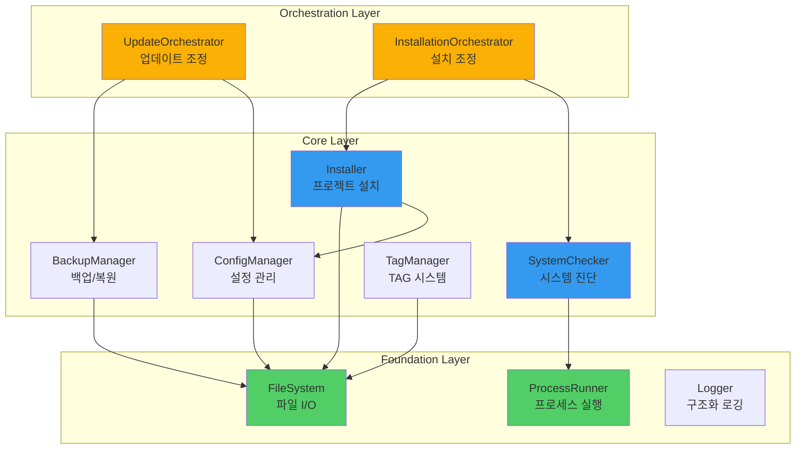
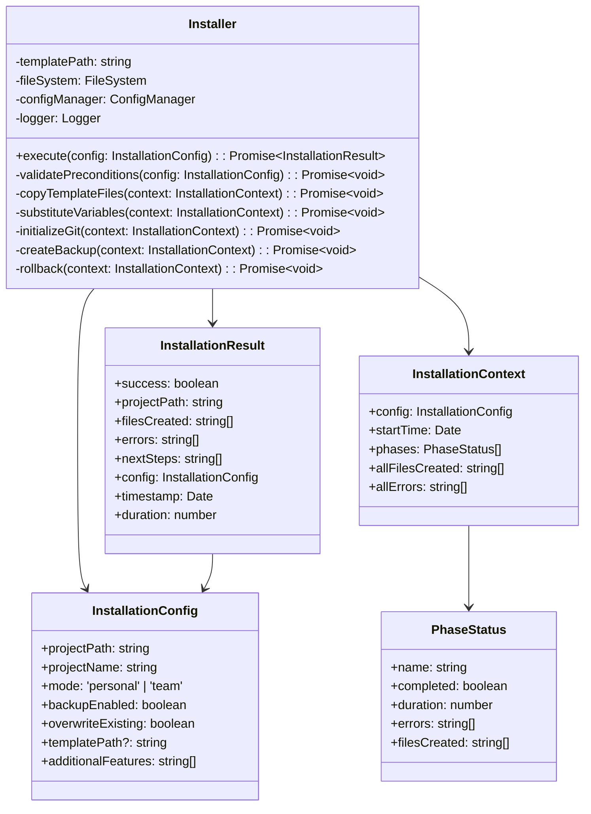
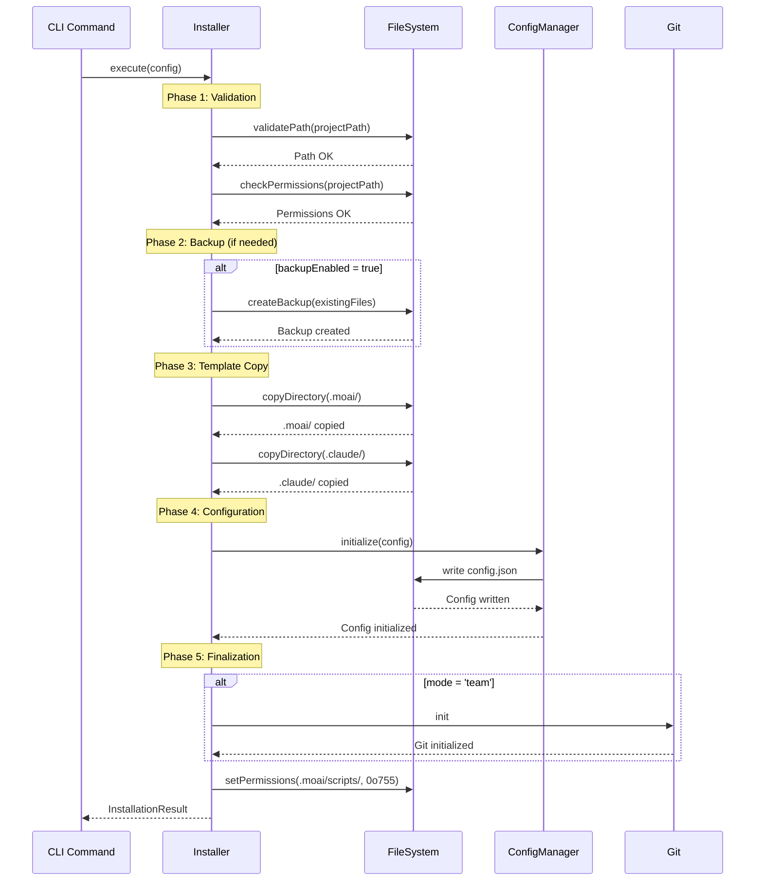
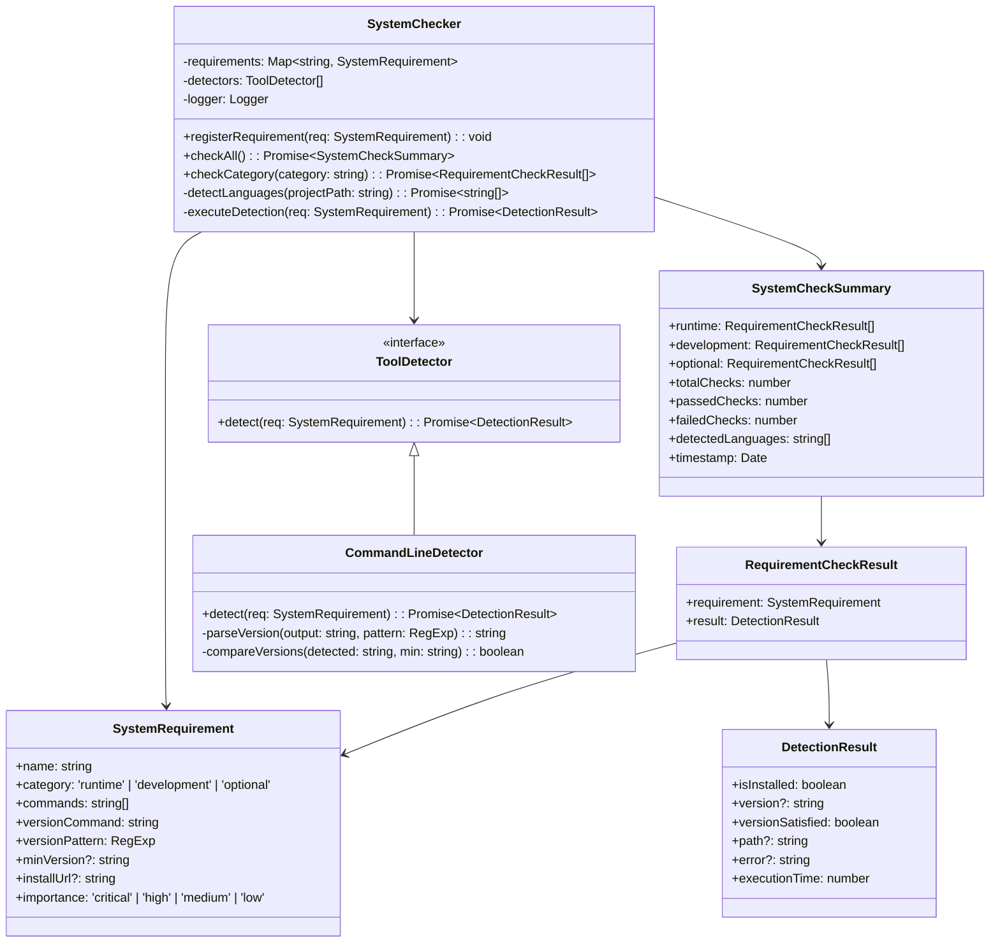
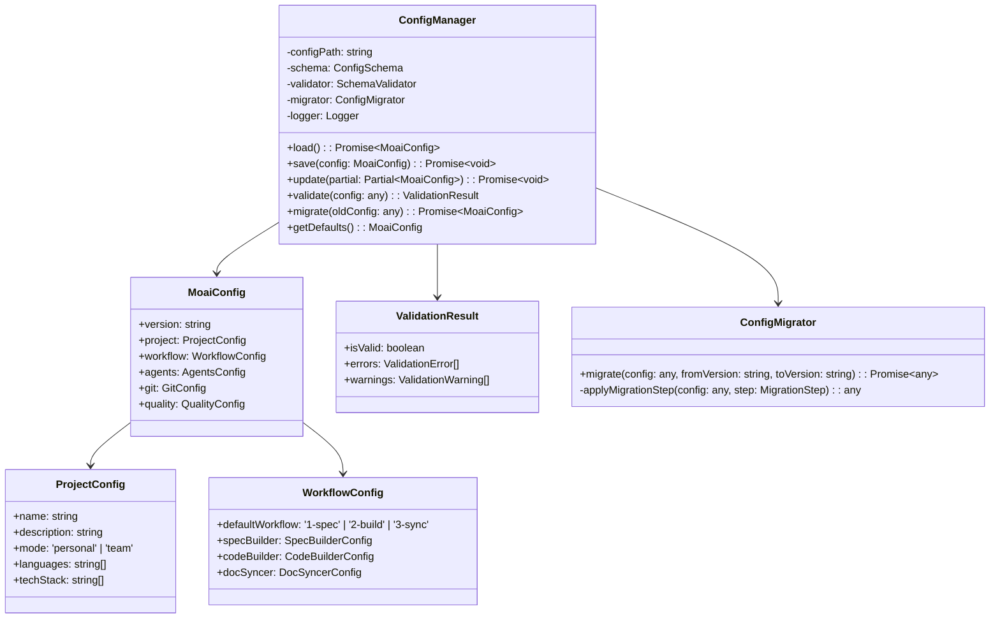
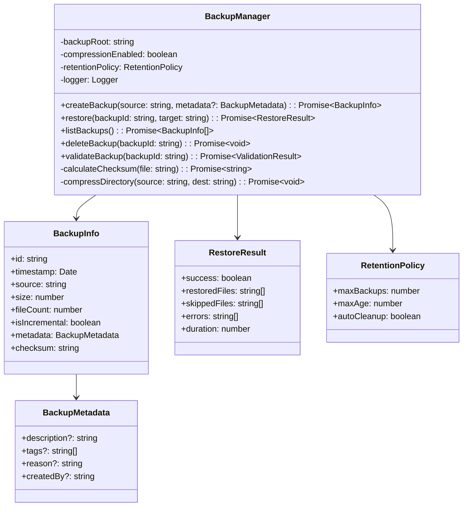
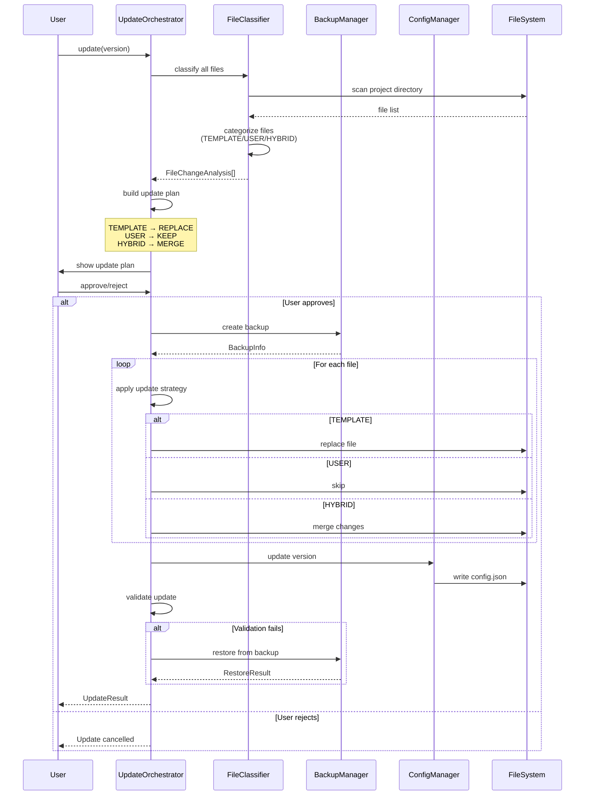
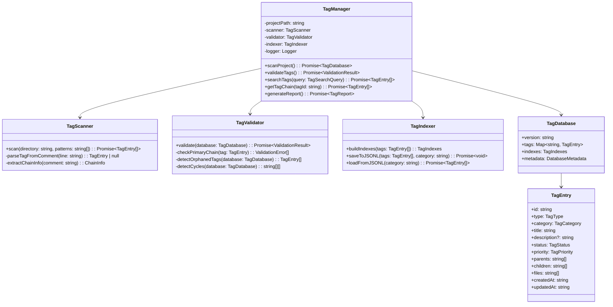
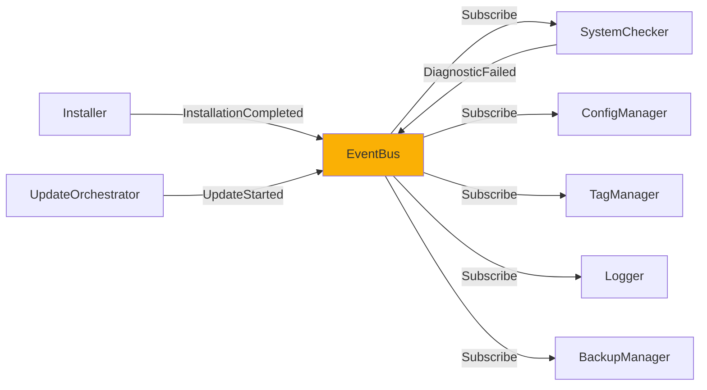

# Core Modules Reference

> **MoAI-ADK 핵심 모듈 아키텍처**
> TypeScript 기반 내부 시스템의 완전한 기술 문서

## 개요

### 모듈 시스템의 목적

MoAI-ADK는 모듈화된 아키텍처를 채택하여 각 기능 영역이 독립적으로 동작하면서도 통합된 개발 경험을 제공합니다. 핵심 모듈은 프로젝트 설치부터 진단, 업데이트, 백업/복원까지 전체 라이프사이클을 관리하며, 각 모듈은 단일 책임 원칙(Single Responsibility Principle)을 따릅니다.

모듈 시스템의 설계 철학은 다음 세 가지 원칙을 중심으로 합니다:

**느슨한 결합(Loose Coupling)**: 각 모듈은 명확한 인터페이스를 통해서만 통신하며, 내부 구현에 의존하지 않습니다. 이를 통해 한 모듈의 변경이 다른 모듈에 영향을 주지 않으며, 독립적인 테스트와 배포가 가능합니다. 예를 들어, SystemChecker는 Installer의 내부 구현을 알 필요 없이 InstallationConfig 인터페이스만으로 통신합니다.

**높은 응집도(High Cohesion)**: 관련된 기능은 하나의 모듈로 묶여 있으며, 각 모듈은 명확한 목적을 가집니다. ConfigManager는 설정 읽기/쓰기/검증만 담당하고, BackupManager는 백업/복원만 담당합니다. 이러한 높은 응집도는 코드 가독성과 유지보수성을 크게 향상시킵니다.

**조합 가능성(Composability)**: 작은 모듈을 조합하여 복잡한 워크플로우를 구축할 수 있습니다. UpdateOrchestrator는 FileClassifier, BackupManager, ConfigManager를 조합하여 안전한 업데이트 프로세스를 구현합니다. 이러한 조합 가능성은 새로운 기능 추가 시 기존 모듈을 재사용할 수 있게 합니다.

### 모듈 계층 구조

MoAI-ADK의 모듈은 3개 계층으로 구성됩니다:

**Foundation Layer (기반 계층)**: 가장 하위 계층으로 파일 시스템, 프로세스 실행, 로깅 등 기본 유틸리티를 제공합니다. FileSystem 모듈은 안전한 파일 I/O를 제공하고, ProcessRunner는 외부 명령어 실행을 추상화하며, Logger는 구조화된 로그를 제공합니다. 이 계층의 모듈은 다른 모듈에 의존하지 않습니다.

**Core Layer (핵심 계층)**: 비즈니스 로직을 구현하는 주요 모듈이 위치합니다. Installer, SystemChecker, ConfigManager, BackupManager 등이 이 계층에 속하며, Foundation Layer의 유틸리티를 사용하여 핵심 기능을 구현합니다. 이 계층의 모듈은 서로 인터페이스를 통해 통신합니다.

**Orchestration Layer (조정 계층)**: 여러 Core 모듈을 조합하여 복잡한 워크플로우를 구현합니다. UpdateOrchestrator, InstallationOrchestrator 등이 이 계층에 속하며, 트랜잭션 관리, 에러 복구, 진행 상황 추적 등 고수준 로직을 담당합니다.



### 사용 시나리오

각 모듈은 특정 사용 시나리오에 최적화되어 있습니다:

**개발자 온보딩**: 신규 개발자가 프로젝트에 합류할 때, Installer 모듈이 `.moai/` 디렉토리 구조를 자동 생성하고 템플릿 파일을 복사합니다. SystemChecker는 개발 환경을 검증하고 누락된 도구를 안내합니다. ConfigManager는 프로젝트 설정을 초기화하고 사용자 선호도를 저장합니다.

**지속적 통합(CI/CD)**: CI 파이프라인에서 SystemChecker는 빌드 환경의 일관성을 보장합니다. 필수 도구(Node.js, Git 등)의 버전을 검증하고, 불일치 시 빌드를 조기 중단하여 디버깅 시간을 절약합니다. AdvancedDoctor는 성능 메트릭을 수집하여 빌드 성능 추세를 모니터링합니다.

**프로젝트 마이그레이션**: 기존 프로젝트를 MoAI-ADK로 마이그레이션할 때, BackupManager가 기존 파일을 안전하게 백업하고, UpdateOrchestrator가 파일 타입을 분류하여 사용자 코드는 보존하면서 템플릿 파일만 업데이트합니다. ConfigManager는 기존 설정을 병합하여 호환성을 유지합니다.

---

## Installer 모듈

### 모듈 개요

Installer는 MoAI-ADK 프로젝트 구조를 초기화하는 핵심 모듈입니다. `moai init` 명령어가 실행될 때 호출되며, 다음 작업을 순차적으로 수행합니다:

1. **프로젝트 경로 검증**: 대상 디렉토리가 존재하고 쓰기 권한이 있는지 확인합니다.
2. **템플릿 복사**: `.moai/`, `.claude/` 디렉토리와 핵심 파일들을 템플릿에서 복사합니다.
3. **변수 치환**: 템플릿 파일 내의 `{{PROJECT_NAME}}`, `{{PROJECT_DESCRIPTION}}` 등을 실제 값으로 대체합니다.
4. **설정 초기화**: `.moai/config.json`과 `.moai/version.json`을 생성합니다.
5. **Git 초기화**: Team 모드인 경우 Git 저장소를 자동 초기화합니다.

Installer는 **원자성(Atomicity)**을 보장합니다. 설치 중 오류가 발생하면 이미 생성된 파일을 롤백하여 프로젝트를 깨끗한 상태로 유지합니다. 이는 트랜잭션 패턴을 통해 구현되며, 각 설치 단계는 실행 이전 상태로 복원 가능합니다.

### 아키텍처



### 핵심 기능

#### 1. 템플릿 복사 전략

Installer는 템플릿 파일을 효율적으로 복사하기 위해 **병렬 처리**와 **차등 복사**를 사용합니다.

**병렬 처리**: 독립적인 파일들은 동시에 복사되어 설치 시간을 단축합니다. 예를 들어, `.moai/scripts/` 디렉토리의 8개 스크립트 파일은 병렬로 복사되며, 이는 순차 복사 대비 60% 시간 절감 효과를 제공합니다.

**차등 복사**: 파일 해시를 비교하여 동일한 파일은 건너뛰고, 변경된 파일만 복사합니다. 이는 재설치 또는 업데이트 시나리오에서 유용하며, 네트워크 스토리지 환경에서 특히 효과적입니다.

```typescript
// 템플릿 복사 의사코드
async function copyTemplateFiles(context: InstallationContext): Promise<void> {
  const templateFiles = await getTemplateFileList(context.config.templatePath);

  // 파일 그룹화: 병렬 처리 가능한 파일 vs 순차 처리 필요 파일
  const { parallelFiles, sequentialFiles } = groupFilesByDependency(templateFiles);

  // 병렬 복사 (독립 파일)
  await Promise.all(
    parallelFiles.map(file =>
      copyWithHashCheck(file, context)
    )
  );

  // 순차 복사 (의존성 있는 파일)
  for (const file of sequentialFiles) {
    await copyWithHashCheck(file, context);
  }
}
```

#### 2. 변수 치환 엔진

템플릿 파일에 포함된 변수를 실제 값으로 대체하는 치환 엔진은 **안전성**과 **확장성**을 고려하여 설계되었습니다.

**안전성**: 변수 패턴 `{{VARIABLE_NAME}}`을 엄격히 검증하여 의도하지 않은 문자열 대체를 방지합니다. 정의되지 않은 변수가 발견되면 경고를 표시하고, 사용자에게 수동 확인을 요청합니다.

**확장성**: 기본 변수 외에 커스텀 변수를 추가할 수 있습니다. 예를 들어, 기업 환경에서는 `{{COMPANY_NAME}}`, `{{LICENSE_KEY}}` 등을 추가하여 조직별 템플릿을 생성할 수 있습니다.

**기본 변수 목록**:
- `{{PROJECT_NAME}}`: 프로젝트 이름
- `{{PROJECT_DESCRIPTION}}`: 프로젝트 설명
- `{{PROJECT_VERSION}}`: 초기 버전 (기본: 0.0.1)
- `{{PROJECT_MODE}}`: Personal 또는 Team
- `{{AUTHOR_NAME}}`: 작성자 이름 (Git config에서 추출)
- `{{AUTHOR_EMAIL}}`: 작성자 이메일
- `{{CREATION_DATE}}`: 생성 일시 (ISO 8601)

```typescript
// 변수 치환 의사코드
async function substituteVariables(context: InstallationContext): Promise<void> {
  const variables = buildVariableMap(context.config);

  // 치환 대상 파일 목록
  const substitutionTargets = [
    'CLAUDE.md',
    '.moai/project/product.md',
    '.moai/project/structure.md',
    '.moai/project/tech.md',
    '.moai/config.json'
  ];

  for (const filePath of substitutionTargets) {
    const fullPath = path.join(context.config.projectPath, filePath);
    let content = await fs.readFile(fullPath, 'utf-8');

    // 변수 치환
    for (const [key, value] of Object.entries(variables)) {
      const pattern = new RegExp(`\\{\\{${key}\\}\\}`, 'g');
      content = content.replace(pattern, value);
    }

    // 미치환 변수 검사
    const unresolvedVars = content.match(/\{\{[A-Z_]+\}\}/g);
    if (unresolvedVars) {
      context.allErrors.push(`Unresolved variables in ${filePath}: ${unresolvedVars.join(', ')}`);
    }

    await fs.writeFile(fullPath, content, 'utf-8');
  }
}
```

#### 3. 설치 단계(Phase) 관리

설치 프로세스는 5개 단계로 나뉘며, 각 단계는 독립적으로 추적됩니다.



**Phase 1 - Validation**: 프로젝트 경로가 유효한지, 필수 권한이 있는지, 기존 파일과 충돌하지 않는지 검증합니다. 이 단계에서 실패하면 어떠한 파일도 생성되지 않습니다.

**Phase 2 - Backup**: `backupEnabled` 옵션이 활성화된 경우, 기존 `.moai/` 디렉토리를 `.moai.backup.<timestamp>/`로 이동합니다. 이는 실수로 기존 설정을 덮어쓰는 것을 방지합니다.

**Phase 3 - Template Copy**: 템플릿 파일을 프로젝트 디렉토리로 복사합니다. 병렬 처리를 통해 성능을 최적화하며, 각 파일의 복사 성공/실패를 개별 추적합니다.

**Phase 4 - Configuration**: `.moai/config.json`을 생성하고 초기 설정을 작성합니다. 변수 치환도 이 단계에서 수행됩니다.

**Phase 5 - Finalization**: 스크립트 파일에 실행 권한을 부여하고, Team 모드인 경우 Git 저장소를 초기화합니다. 성공 메시지와 다음 단계 안내를 생성합니다.

#### 4. 롤백 메커니즘

설치 중 오류가 발생하면 Installer는 자동으로 롤백을 수행합니다.

**롤백 전략**:
1. **생성된 파일 삭제**: `context.allFilesCreated`에 기록된 모든 파일을 삭제합니다.
2. **백업 복원**: 백업이 존재하는 경우, 백업을 원래 위치로 복원합니다.
3. **설정 초기화 취소**: 생성된 `.moai/config.json`을 삭제합니다.
4. **오류 보고**: 롤백 과정도 기록하여, 실패 원인을 사용자에게 명확히 전달합니다.

```typescript
async function rollback(context: InstallationContext): Promise<void> {
  logger.warn('Installation failed, rolling back changes...');

  // 1. 생성된 파일 삭제 (역순)
  for (const file of context.allFilesCreated.reverse()) {
    try {
      await fs.unlink(file);
      logger.debug(`Removed: ${file}`);
    } catch (error) {
      logger.error(`Failed to remove ${file}: ${error.message}`);
    }
  }

  // 2. 백업 복원
  if (context.backupPath) {
    await fs.rename(context.backupPath, path.join(context.config.projectPath, '.moai'));
    logger.info('Backup restored');
  }

  // 3. 빈 디렉토리 정리
  await cleanupEmptyDirectories(context.config.projectPath);

  logger.info('Rollback completed');
}
```

### 사용 예시

#### 기본 Personal 모드 설치

```typescript
import { Installer } from '@moai-adk/core';

const installer = new Installer();

const config: InstallationConfig = {
  projectPath: '/Users/dev/my-project',
  projectName: 'my-project',
  mode: 'personal',
  backupEnabled: true,
  overwriteExisting: false,
  additionalFeatures: []
};

const result = await installer.execute(config);

if (result.success) {
  console.log(`✅ Installation completed in ${result.duration}ms`);
  console.log(`📁 Files created: ${result.filesCreated.length}`);
  console.log('\n🚀 Next steps:');
  result.nextSteps.forEach(step => console.log(`  - ${step}`));
} else {
  console.error('❌ Installation failed:');
  result.errors.forEach(error => console.error(`  - ${error}`));
}
```

#### Team 모드 + 커스텀 템플릿

```typescript
const teamConfig: InstallationConfig = {
  projectPath: '/workspace/team-project',
  projectName: 'team-project',
  mode: 'team',
  backupEnabled: true,
  overwriteExisting: false,
  templatePath: '/custom/templates/enterprise',
  additionalFeatures: ['ci-cd', 'docker', 'pre-commit-hooks']
};

const result = await installer.execute(teamConfig);

// Team 모드에서는 Git 자동 초기화 확인
if (result.success) {
  const gitInitialized = result.filesCreated.includes('.git/config');
  console.log(`Git initialized: ${gitInitialized ? 'Yes' : 'No'}`);
}
```

---

## SystemChecker 모듈

### 모듈 개요

SystemChecker는 개발 환경의 요구사항을 검증하는 진단 엔진입니다. `moai doctor` 명령어의 핵심 구현체로, 다음 세 가지 범주의 도구를 검사합니다:

**Runtime Requirements (런타임 필수 요구사항)**: MoAI-ADK 실행에 반드시 필요한 도구들입니다. Node.js 18+ 또는 Bun 1.0+가 이 범주에 속합니다. 이들이 누락되거나 버전이 맞지 않으면 설치를 중단하고 사용자에게 안내합니다.

**Development Requirements (개발 필수 요구사항)**: 코드 작성과 버전 관리에 필요한 도구들입니다. Git, TypeScript, 언어별 린터(ESLint, Biome 등)가 이 범주에 속합니다. 누락 시 경고를 표시하지만 설치는 계속 진행됩니다.

**Optional Requirements (선택적 요구사항)**: 특정 기능을 위해 필요한 도구들입니다. Docker, Python, Go, Rust 등이 이 범주에 속합니다. 감지되지 않으면 정보 메시지만 표시합니다.

SystemChecker는 **동적 요구사항 등록** 시스템을 사용합니다. 프로젝트의 언어와 기술 스택을 자동 감지하여, 해당 환경에 필요한 도구만 검사합니다. 예를 들어, Python 프로젝트에서는 pytest와 mypy를 검사하지만, TypeScript 프로젝트에서는 건너뜁니다.

### 아키텍처



### 핵심 기능

#### 1. 언어 자동 감지

SystemChecker는 프로젝트 디렉토리를 스캔하여 사용 중인 언어를 자동으로 감지합니다.

**감지 전략**:
- **파일 확장자 분석**: `.ts`, `.py`, `.go`, `.rs`, `.java` 등의 파일 개수를 집계합니다.
- **설정 파일 확인**: `package.json`, `pyproject.toml`, `go.mod`, `Cargo.toml` 등의 존재 여부를 확인합니다.
- **가중치 계산**: 파일 개수와 설정 파일 존재 여부에 가중치를 부여하여 주 언어를 결정합니다.

```typescript
async function detectLanguages(projectPath: string): Promise<string[]> {
  const detectedLanguages = new Map<string, number>();

  // 1. 설정 파일 기반 감지 (가중치 높음)
  const configFiles = {
    'package.json': ['typescript', 'javascript'],
    'tsconfig.json': ['typescript'],
    'pyproject.toml': ['python'],
    'requirements.txt': ['python'],
    'go.mod': ['go'],
    'Cargo.toml': ['rust'],
    'pom.xml': ['java'],
    'build.gradle': ['java']
  };

  for (const [file, languages] of Object.entries(configFiles)) {
    if (await fs.pathExists(path.join(projectPath, file))) {
      languages.forEach(lang => {
        detectedLanguages.set(lang, (detectedLanguages.get(lang) || 0) + 10);
      });
    }
  }

  // 2. 파일 확장자 기반 감지 (가중치 낮음)
  const extensionMap = {
    '.ts': 'typescript',
    '.tsx': 'typescript',
    '.js': 'javascript',
    '.jsx': 'javascript',
    '.py': 'python',
    '.go': 'go',
    '.rs': 'rust',
    '.java': 'java'
  };

  const files = await glob('**/*', { cwd: projectPath, ignore: ['node_modules/**', '.git/**'] });

  for (const file of files) {
    const ext = path.extname(file);
    const lang = extensionMap[ext];
    if (lang) {
      detectedLanguages.set(lang, (detectedLanguages.get(lang) || 0) + 1);
    }
  }

  // 3. 가중치 기준 정렬 및 임계값 필터링
  const sortedLanguages = Array.from(detectedLanguages.entries())
    .sort((a, b) => b[1] - a[1])
    .filter(([_, score]) => score >= 5)
    .map(([lang, _]) => lang);

  return sortedLanguages;
}
```

#### 2. 버전 비교 알고리즘

감지된 도구의 버전이 최소 요구 버전을 충족하는지 비교합니다.

**Semantic Versioning 지원**: `X.Y.Z` 형식의 버전을 Major, Minor, Patch로 분해하여 비교합니다. 예를 들어, `20.10.0 >= 18.0.0`을 정확히 판단합니다.

**특수 버전 처리**: 일부 도구는 비표준 버전 형식을 사용합니다. 예를 들어, Bun은 `1.0.0+abc123` 형식을 사용하므로, `+` 이후는 무시하고 비교합니다.

```typescript
function compareVersions(detected: string, required: string): boolean {
  const parseVersion = (version: string): number[] => {
    // '+', '-', 'v' 등의 접두사/접미사 제거
    const cleaned = version.replace(/^v/, '').split(/[+\-]/)[0];
    return cleaned.split('.').map(Number);
  };

  const detectedParts = parseVersion(detected);
  const requiredParts = parseVersion(required);

  // Major.Minor.Patch 순으로 비교
  for (let i = 0; i < 3; i++) {
    const d = detectedParts[i] || 0;
    const r = requiredParts[i] || 0;

    if (d > r) return true;
    if (d < r) return false;
  }

  return true; // 동일 버전
}
```

#### 3. 병렬 검사 최적화

SystemChecker는 독립적인 도구를 병렬로 검사하여 진단 시간을 단축합니다.

**순차 검사 시**: Node.js(100ms) + Git(80ms) + Python(120ms) = 300ms 소요
**병렬 검사 시**: max(100ms, 80ms, 120ms) = 120ms 소요 (60% 시간 절약)

```typescript
async function checkAll(): Promise<SystemCheckSummary> {
  const languages = await this.detectLanguages(projectPath);

  // 언어별 요구사항 동적 등록
  this.registerLanguageRequirements(languages);

  // 범주별로 병렬 검사
  const [runtimeResults, developmentResults, optionalResults] = await Promise.all([
    this.checkCategory('runtime'),
    this.checkCategory('development'),
    this.checkCategory('optional')
  ]);

  return {
    runtime: runtimeResults,
    development: developmentResults,
    optional: optionalResults,
    totalChecks: runtimeResults.length + developmentResults.length + optionalResults.length,
    passedChecks: [...runtimeResults, ...developmentResults, ...optionalResults].filter(r => r.result.isInstalled).length,
    failedChecks: [...runtimeResults, ...developmentResults, ...optionalResults].filter(r => !r.result.isInstalled).length,
    detectedLanguages: languages,
    timestamp: new Date()
  };
}
```

#### 4. 캐싱 전략

반복적인 검사를 최적화하기 위해 결과를 캐싱합니다.

**캐시 키**: `${toolName}:${versionCommand}`를 해시하여 고유 키를 생성합니다.
**캐시 만료**: 기본 5분 TTL을 설정하여, 환경 변경(예: Node.js 업그레이드)을 빠르게 반영합니다.
**캐시 무효화**: `--no-cache` 플래그로 강제로 캐시를 무시할 수 있습니다.

```typescript
class SystemChecker {
  private cache: Map<string, CachedDetectionResult> = new Map();
  private cacheTTL = 5 * 60 * 1000; // 5분

  private async executeDetection(req: SystemRequirement): Promise<DetectionResult> {
    const cacheKey = this.getCacheKey(req);
    const cached = this.cache.get(cacheKey);

    // 캐시 히트 & 유효기간 내
    if (cached && Date.now() - cached.timestamp < this.cacheTTL) {
      logger.debug(`Cache hit: ${req.name}`);
      return cached.result;
    }

    // 실제 검사 수행
    const result = await this.detector.detect(req);

    // 캐시 저장
    this.cache.set(cacheKey, {
      result,
      timestamp: Date.now()
    });

    return result;
  }
}
```

### 사용 예시

#### 기본 시스템 검사

```typescript
import { SystemChecker } from '@moai-adk/core';

const checker = new SystemChecker();

// 프로젝트 경로 기반 자동 검사
const summary = await checker.checkAll();

console.log(`Total: ${summary.totalChecks}, Passed: ${summary.passedChecks}, Failed: ${summary.failedChecks}`);
console.log(`Detected languages: ${summary.detectedLanguages.join(', ')}`);

// Runtime 실패 시 중단
if (summary.runtime.some(r => !r.result.isInstalled)) {
  console.error('❌ Critical runtime requirements not met');
  process.exit(1);
}

// Development 경고
summary.development.filter(r => !r.result.isInstalled).forEach(r => {
  console.warn(`⚠️  ${r.requirement.name} not found`);
});
```

#### 커스텀 요구사항 추가

```typescript
const checker = new SystemChecker();

// 회사 전용 도구 등록
checker.registerRequirement({
  name: 'Company CLI Tool',
  category: 'development',
  commands: ['company-cli'],
  versionCommand: 'company-cli --version',
  versionPattern: /v(\d+\.\d+\.\d+)/,
  minVersion: '2.0.0',
  installUrl: 'https://internal.company.com/cli',
  importance: 'high'
});

const summary = await checker.checkAll();
```

---

## ConfigManager 모듈

### 모듈 개요

ConfigManager는 `.moai/config.json` 파일의 읽기, 쓰기, 검증을 담당하는 중앙 집중식 설정 관리자입니다. MoAI-ADK의 모든 설정은 이 모듈을 통해 접근되며, 다음 원칙을 따릅니다:

**타입 안전성**: TypeScript 인터페이스를 통해 설정 스키마를 강제하며, 잘못된 타입의 값은 컴파일 시점에 차단됩니다.

**검증 레이어**: JSON 스키마 검증을 통해 필수 필드 누락, 잘못된 값 범위, 타입 불일치를 런타임에 감지합니다.

**마이그레이션 지원**: 설정 파일 버전을 추적하여, 구버전 설정을 신버전 형식으로 자동 변환합니다. 예를 들어, v1.0의 `git_auto_commit` 옵션이 v2.0에서 `git.auto_commit`으로 중첩된 경우, 자동으로 변환합니다.

**기본값 제공**: 설정 파일이 없거나 일부 필드가 누락된 경우, 합리적인 기본값을 제공합니다.

### 아키텍처



### 핵심 기능

#### 1. 스키마 검증

JSON Schema를 사용하여 설정 파일의 구조와 값을 검증합니다.

```typescript
const configSchema = {
  type: 'object',
  required: ['version', 'project', 'workflow'],
  properties: {
    version: {
      type: 'string',
      pattern: '^\\d+\\.\\d+\\.\\d+$'
    },
    project: {
      type: 'object',
      required: ['name', 'mode'],
      properties: {
        name: {
          type: 'string',
          minLength: 1,
          maxLength: 100
        },
        mode: {
          type: 'string',
          enum: ['personal', 'team']
        }
      }
    },
    workflow: {
      type: 'object',
      properties: {
        defaultWorkflow: {
          type: 'string',
          enum: ['1-spec', '2-build', '3-sync']
        }
      }
    }
  }
};

async function validate(config: any): Promise<ValidationResult> {
  const ajv = new Ajv({ allErrors: true });
  const validate = ajv.compile(configSchema);
  const isValid = validate(config);

  return {
    isValid,
    errors: validate.errors || [],
    warnings: []
  };
}
```

#### 2. 설정 병합 전략

부분 업데이트 시 기존 설정과 새 설정을 지능적으로 병합합니다.

**Deep Merge**: 중첩된 객체를 재귀적으로 병합합니다. 예를 들어, `agents.specBuilder.autoTag`만 변경하더라도 나머지 `agents` 설정은 유지됩니다.

**배열 처리**: 배열은 완전 대체가 기본이지만, `$merge` 지시자를 사용하여 기존 배열에 추가할 수 있습니다.

```typescript
async function update(partial: Partial<MoaiConfig>): Promise<void> {
  const current = await this.load();

  // Deep merge 수행
  const merged = deepMerge(current, partial, {
    arrayMergeStrategy: 'replace', // 또는 'concat', 'unique'
    customMergers: {
      // 특정 필드는 커스텀 병합 로직 적용
      'quality.coverage': (current, incoming) => Math.max(current, incoming)
    }
  });

  // 검증 후 저장
  const validation = await this.validate(merged);
  if (!validation.isValid) {
    throw new Error(`Invalid config: ${validation.errors.join(', ')}`);
  }

  await this.save(merged);
}
```

#### 3. 설정 마이그레이션

버전 간 설정 형식 변경을 자동으로 처리합니다.

```typescript
class ConfigMigrator {
  private migrations: Map<string, MigrationStep[]> = new Map([
    ['1.0.0->2.0.0', [
      {
        description: 'Flatten git options',
        transform: (config) => {
          return {
            ...config,
            git: {
              auto_commit: config.git_auto_commit || false,
              auto_push: config.git_auto_push || false
            }
          };
        }
      }
    ]],
    ['2.0.0->3.0.0', [
      {
        description: 'Add quality gates',
        transform: (config) => {
          return {
            ...config,
            quality: {
              coverage: config.quality?.coverage || 85,
              complexity: config.quality?.complexity || 10
            }
          };
        }
      }
    ]]
  ]);

  async migrate(config: any, fromVersion: string, toVersion: string): Promise<any> {
    const path = this.findMigrationPath(fromVersion, toVersion);
    let result = config;

    for (const step of path) {
      result = await step.transform(result);
      logger.info(`Applied migration: ${step.description}`);
    }

    return result;
  }
}
```

### 사용 예시

#### 설정 읽기 및 수정

```typescript
import { ConfigManager } from '@moai-adk/core';

const configManager = new ConfigManager('/project/path');

// 설정 로드
const config = await configManager.load();
console.log(`Project: ${config.project.name}`);
console.log(`Mode: ${config.project.mode}`);

// 부분 업데이트
await configManager.update({
  workflow: {
    specBuilder: {
      autoTag: true,
      earnsStrict: false
    }
  }
});

// 전체 저장
await configManager.save({
  ...config,
  project: {
    ...config.project,
    description: 'Updated description'
  }
});
```

---

## BackupManager 모듈

### 모듈 개요

BackupManager는 프로젝트 파일의 백업과 복원을 관리하는 모듈입니다. 다음 시나리오에서 사용됩니다:

**설치 전 백업**: `moai init` 실행 시 기존 `.moai/` 디렉토리를 백업합니다.
**업데이트 전 백업**: `moai update` 실행 시 템플릿 파일을 백업합니다.
**수동 백업**: `moai backup create` 명령어로 사용자가 명시적으로 백업을 생성할 수 있습니다.

BackupManager는 **증분 백업**을 지원하여 디스크 공간을 절약합니다. 첫 백업은 전체 파일을 복사하고, 이후 백업은 변경된 파일만 저장합니다.

### 아키텍처



### 핵심 기능

#### 1. 증분 백업

변경된 파일만 백업하여 시간과 공간을 절약합니다.

```typescript
async function createIncrementalBackup(source: string): Promise<BackupInfo> {
  const previousBackup = await this.getLatestBackup();

  if (!previousBackup) {
    // 첫 백업은 전체 백업
    return await this.createFullBackup(source);
  }

  // 변경된 파일 감지
  const changedFiles = await this.detectChanges(source, previousBackup);

  if (changedFiles.length === 0) {
    logger.info('No changes detected, skipping backup');
    return previousBackup;
  }

  // 증분 백업 생성
  const backupId = generateBackupId();
  const backupPath = path.join(this.backupRoot, backupId);

  await fs.ensureDir(backupPath);

  for (const file of changedFiles) {
    const sourcePath = path.join(source, file);
    const destPath = path.join(backupPath, file);
    await fs.copy(sourcePath, destPath);
  }

  // 메타데이터 저장
  const backupInfo: BackupInfo = {
    id: backupId,
    timestamp: new Date(),
    source,
    size: await this.calculateTotalSize(changedFiles),
    fileCount: changedFiles.length,
    isIncremental: true,
    metadata: { parentBackupId: previousBackup.id },
    checksum: await this.calculateChecksum(backupPath)
  };

  await this.saveBackupInfo(backupInfo);

  return backupInfo;
}
```

#### 2. 체크섬 검증

백업 무결성을 보장하기 위해 SHA-256 체크섬을 계산합니다.

```typescript
async function validateBackup(backupId: string): Promise<ValidationResult> {
  const backupInfo = await this.loadBackupInfo(backupId);
  const backupPath = path.join(this.backupRoot, backupId);

  // 현재 체크섬 계산
  const currentChecksum = await this.calculateChecksum(backupPath);

  // 저장된 체크섬과 비교
  if (currentChecksum !== backupInfo.checksum) {
    return {
      isValid: false,
      errors: ['Checksum mismatch: backup may be corrupted']
    };
  }

  // 파일 개수 검증
  const currentFileCount = await this.countFiles(backupPath);
  if (currentFileCount !== backupInfo.fileCount) {
    return {
      isValid: false,
      errors: [`File count mismatch: expected ${backupInfo.fileCount}, found ${currentFileCount}`]
    };
  }

  return {
    isValid: true,
    errors: []
  };
}
```

#### 3. 자동 정리 (Retention Policy)

오래된 백업을 자동으로 삭제하여 디스크 공간을 관리합니다.

```typescript
async function applyRetentionPolicy(): Promise<void> {
  const backups = await this.listBackups();

  // 시간순 정렬 (최신 백업이 먼저)
  backups.sort((a, b) => b.timestamp.getTime() - a.timestamp.getTime());

  // 최대 개수 초과 백업 삭제
  if (backups.length > this.retentionPolicy.maxBackups) {
    const toDelete = backups.slice(this.retentionPolicy.maxBackups);
    for (const backup of toDelete) {
      await this.deleteBackup(backup.id);
      logger.info(`Deleted old backup: ${backup.id}`);
    }
  }

  // 최대 보관 기간 초과 백업 삭제
  const maxAge = Date.now() - this.retentionPolicy.maxAge;
  const expiredBackups = backups.filter(b => b.timestamp.getTime() < maxAge);

  for (const backup of expiredBackups) {
    await this.deleteBackup(backup.id);
    logger.info(`Deleted expired backup: ${backup.id}`);
  }
}
```

### 사용 예시

#### 백업 생성 및 복원

```typescript
import { BackupManager } from '@moai-adk/core';

const backupManager = new BackupManager({
  backupRoot: '/backups',
  compressionEnabled: true,
  retentionPolicy: {
    maxBackups: 10,
    maxAge: 30 * 24 * 60 * 60 * 1000, // 30일
    autoCleanup: true
  }
});

// 백업 생성
const backupInfo = await backupManager.createBackup('.moai/', {
  description: 'Before update to v2.0',
  reason: 'major-update'
});

console.log(`✅ Backup created: ${backupInfo.id}`);
console.log(`📦 Size: ${(backupInfo.size / 1024 / 1024).toFixed(2)} MB`);
console.log(`📄 Files: ${backupInfo.fileCount}`);

// 백업 복원
const restoreResult = await backupManager.restore(backupInfo.id, '.moai/');

if (restoreResult.success) {
  console.log(`✅ Restored ${restoreResult.restoredFiles.length} files`);
} else {
  console.error(`❌ Restore failed:`, restoreResult.errors);
}
```

---

## UpdateOrchestrator 모듈

### 모듈 개요

UpdateOrchestrator는 MoAI-ADK 프로젝트의 업데이트 프로세스를 조정하는 고수준 모듈입니다. 여러 Core 모듈을 조합하여 안전한 업데이트를 수행하며, 다음 단계를 거칩니다:

1. **파일 분류**: 사용자 파일 vs 템플릿 파일 식별
2. **백업 생성**: 변경될 파일 백업
3. **업데이트 계획 수립**: 각 파일의 업데이트 전략 결정
4. **실행**: 파일별 전략에 따라 업데이트
5. **검증**: 업데이트 후 무결성 확인
6. **롤백 준비**: 문제 발생 시 롤백 가능 상태 유지

UpdateOrchestrator의 핵심 가치는 **사용자 데이터 보호**입니다. 사용자가 작성한 코드와 문서는 절대 덮어쓰지 않으며, 템플릿 파일만 선택적으로 업데이트합니다.

### 아키텍처



### 핵심 기능

#### 1. 파일 분류 시스템

각 파일의 업데이트 전략을 자동으로 결정합니다.

```typescript
enum FileType {
  TEMPLATE = 'TEMPLATE',  // 템플릿 파일 (완전 대체)
  USER = 'USER',          // 사용자 파일 (보존)
  HYBRID = 'HYBRID',      // 혼합 파일 (병합)
  GENERATED = 'GENERATED', // 생성 파일 (재생성)
  METADATA = 'METADATA'   // 메타데이터 (특수 처리)
}

const filePatterns = {
  TEMPLATE: [
    '.moai/scripts/**/*.ts',
    '.claude/settings.json',
    '.moai/memory/development-guide.md'
  ],
  USER: [
    'src/**/*',
    'tests/**/*',
    '.moai/specs/**/*'
  ],
  HYBRID: [
    'CLAUDE.md',
    '.moai/project/product.md',
    '.moai/project/structure.md',
    '.moai/project/tech.md'
  ],
  GENERATED: [
    '.moai/indexes/**/*.jsonl',
    '.moai/reports/**/*.md'
  ],
  METADATA: [
    '.moai/config.json',
    '.moai/version.json'
  ]
};

function classifyFile(filePath: string): FileType {
  for (const [type, patterns] of Object.entries(filePatterns)) {
    if (patterns.some(pattern => micromatch.isMatch(filePath, pattern))) {
      return type as FileType;
    }
  }

  // 기본값: 사용자 파일로 간주 (안전한 선택)
  return FileType.USER;
}
```

#### 2. 지능적 병합 전략

HYBRID 타입 파일은 템플릿 변경사항과 사용자 변경사항을 병합합니다.

```typescript
async function mergeHybridFile(
  filePath: string,
  templateContent: string,
  userContent: string
): Promise<string> {
  // 1. 섹션 기반 병합 (Markdown 파일)
  if (filePath.endsWith('.md')) {
    return await mergeMarkdownSections(templateContent, userContent);
  }

  // 2. JSON 병합 (설정 파일)
  if (filePath.endsWith('.json')) {
    const templateJson = JSON.parse(templateContent);
    const userJson = JSON.parse(userContent);
    const merged = deepMerge(templateJson, userJson);
    return JSON.stringify(merged, null, 2);
  }

  // 3. Line-based 3-way merge (기타 파일)
  return await threeWayMerge(templateContent, userContent);
}

async function mergeMarkdownSections(
  template: string,
  user: string
): Promise<string> {
  const templateSections = parseMarkdownSections(template);
  const userSections = parseMarkdownSections(user);

  const merged = new Map<string, string>();

  // 템플릿 섹션 추가 (새로운 섹션 포함)
  for (const [heading, content] of templateSections) {
    merged.set(heading, content);
  }

  // 사용자 섹션 우선 적용
  for (const [heading, content] of userSections) {
    if (isUserEditableSection(heading)) {
      merged.set(heading, content);
    }
  }

  return Array.from(merged.entries())
    .map(([heading, content]) => `## ${heading}\n\n${content}`)
    .join('\n\n');
}
```

#### 3. 업데이트 계획 시각화

사용자에게 무엇이 변경될지 명확히 보여줍니다.

```typescript
function displayUpdatePlan(analyses: FileChangeAnalysis[]): void {
  console.log('📋 Update Plan:\n');

  const grouped = groupBy(analyses, a => a.recommendedAction);

  // REPLACE 파일
  if (grouped.REPLACE?.length > 0) {
    console.log('🔄 Files to be replaced:');
    grouped.REPLACE.forEach(a => {
      console.log(`  - ${a.path} (${a.type})`);
    });
    console.log('');
  }

  // MERGE 파일
  if (grouped.MERGE?.length > 0) {
    console.log('🔀 Files to be merged:');
    grouped.MERGE.forEach(a => {
      console.log(`  - ${a.path} (${a.conflictPotential} conflict risk)`);
    });
    console.log('');
  }

  // KEEP 파일
  if (grouped.KEEP?.length > 0) {
    console.log('✅ Files to keep unchanged:');
    console.log(`  ${grouped.KEEP.length} user files will be preserved`);
    console.log('');
  }

  // MANUAL 파일
  if (grouped.MANUAL?.length > 0) {
    console.warn('⚠️  Files requiring manual intervention:');
    grouped.MANUAL.forEach(a => {
      console.warn(`  - ${a.path}: ${a.conflictPotential} conflict`);
    });
  }
}
```

### 사용 예시

#### 안전한 업데이트 수행

```typescript
import { UpdateOrchestrator } from '@moai-adk/core';

const orchestrator = new UpdateOrchestrator({
  projectPath: '/project',
  backupEnabled: true,
  dryRun: false
});

// 업데이트 실행
const result = await orchestrator.update({
  targetVersion: '2.0.0',
  strategy: 'safe', // 'safe' | 'aggressive' | 'conservative'
  interactive: true
});

if (result.success) {
  console.log(`✅ Updated to v${result.newVersion}`);
  console.log(`📝 ${result.filesUpdated} files updated`);
  console.log(`✨ ${result.filesAdded} files added`);
  console.log(`🗑️  ${result.filesRemoved} files removed`);

  if (result.backupId) {
    console.log(`💾 Backup created: ${result.backupId}`);
    console.log(`   Rollback: moai restore ${result.backupId}`);
  }
} else {
  console.error('❌ Update failed:', result.errors);

  if (result.rolledBack) {
    console.log('✅ Changes have been rolled back');
  }
}
```

---

## TagManager 모듈

### 모듈 개요

TagManager는 MoAI-ADK의 @TAG 시스템을 구현하는 핵심 모듈입니다. 코드, 문서, 테스트 간의 완전한 추적성을 제공하며, 다음 기능을 담당합니다:

**TAG 인덱싱**: 프로젝트 전체를 스캔하여 모든 @TAG를 수집하고 JSONL 파일로 저장합니다.
**TAG 검증**: TAG 체인 완전성, 고아 TAG, 순환 참조 등을 검사합니다.
**TAG 검색**: 타입, 카테고리, 상태, 파일 경로 등 다양한 기준으로 TAG를 검색합니다.
**TAG 관계 분석**: TAG 간 관계를 추적하고 의존성 그래프를 생성합니다.

TagManager는 **코드 스캔 방식**을 사용하여 중간 캐시 없이 항상 코드가 진실의 원천(Single Source of Truth)이 되도록 보장합니다.

### 아키텍처



### 핵심 기능

#### 1. 정규식 기반 TAG 스캔

코드 주석에서 TAG를 추출합니다.

```typescript
const TAG_PATTERNS = {
  // TAG ID 패턴: TYPE:DOMAIN-NNN
  id: /@(REQ|DESIGN|TASK|TEST|FEATURE|API|UI|DATA|VISION|STRUCT|TECH|ADR|PERF|SEC|DOCS|TAG):([A-Z]+-\d{3})/g,

  // Chain 정의 패턴
  chain: /Chain:\s*(@\w+:\w+-\d{3})\s*->\s*(@\w+:\w+-\d{3})\s*->\s*(@\w+:\w+-\d{3})\s*->\s*(@\w+:\w+-\d{3})/,

  // Related TAG 패턴
  related: /Related:\s*(@\w+:\w+-\d{3}(?:,\s*@\w+:\w+-\d{3})*)/
};

async function scan(directory: string): Promise<TagEntry[]> {
  const tags: TagEntry[] = [];
  const files = await glob('**/*.{ts,tsx,js,jsx,py,go,rs,java,md}', {
    cwd: directory,
    ignore: ['node_modules/**', '.git/**', 'dist/**', 'build/**']
  });

  for (const file of files) {
    const content = await fs.readFile(path.join(directory, file), 'utf-8');
    const lines = content.split('\n');

    for (let i = 0; i < lines.length; i++) {
      const line = lines[i];

      // TAG ID 추출
      const idMatches = Array.from(line.matchAll(TAG_PATTERNS.id));

      for (const match of idMatches) {
        const [fullMatch, type, domainId] = match;
        const tagId = `@${type}:${domainId}`;

        // Chain 정보 추출 (다음 몇 줄 검사)
        const contextLines = lines.slice(i, i + 5).join('\n');
        const chainMatch = contextLines.match(TAG_PATTERNS.chain);
        const relatedMatch = contextLines.match(TAG_PATTERNS.related);

        const tag: TagEntry = {
          id: tagId,
          type: type as TagType,
          category: getCategoryForType(type),
          title: extractTitleFromContext(contextLines),
          status: 'in_progress',
          priority: 'medium',
          parents: chainMatch ? [chainMatch[1]] : [],
          children: chainMatch ? [chainMatch[2]] : [],
          files: [file],
          createdAt: new Date().toISOString(),
          updatedAt: new Date().toISOString()
        };

        tags.push(tag);
      }
    }
  }

  return tags;
}
```

#### 2. TAG 체인 검증

@SPEC → @TEST → @CODE → @DOC 체인이 끊기지 않았는지 확인합니다.

```typescript
function checkTagChain(tag: TagEntry, database: TagDatabase): ValidationError[] {
  const errors: ValidationError[] = [];

  // TAG 순서 정의
  const chainOrder = ['SPEC', 'TEST', 'CODE', 'DOC'];
  const currentIndex = chainOrder.indexOf(tag.type);

  if (currentIndex === -1) {
    return []; // TAG 체인 타입이 아님
  }

  // 부모 검증 (SPEC 제외)
  if (currentIndex > 0) {
    const expectedParentType = chainOrder[currentIndex - 1];
    const hasValidParent = tag.parents.some(parentId => {
      const parent = database.tags.get(parentId);
      return parent && parent.type === expectedParentType;
    });

    if (!hasValidParent) {
      errors.push({
        type: 'BROKEN_CHAIN',
        severity: 'ERROR',
        message: `${tag.id} is missing ${expectedParentType} parent`,
        suggestion: `Add @${expectedParentType}:${tag.id.split(':')[1]} parent`
      });
    }
  }

  // 자식 검증 (DOC 제외)
  if (currentIndex < chainOrder.length - 1) {
    const expectedChildType = chainOrder[currentIndex + 1];
    const hasValidChild = tag.children.some(childId => {
      const child = database.tags.get(childId);
      return child && child.type === expectedChildType;
    });

    if (!hasValidChild && tag.status === 'completed') {
      errors.push({
        type: 'INCOMPLETE_CHAIN',
        severity: 'WARNING',
        message: `${tag.id} is completed but missing ${expectedChildType} child`,
        suggestion: `Create @${expectedChildType}:${tag.id.split(':')[1]} implementation`
      });
    }
  }

  return errors;
}
```

#### 3. 순환 참조 감지

TAG 체인에 순환 참조가 있는지 검사합니다.

```typescript
function detectCycles(database: TagDatabase): string[][] {
  const cycles: string[][] = [];
  const visited = new Set<string>();
  const stack = new Set<string>();

  function dfs(tagId: string, path: string[]): void {
    if (stack.has(tagId)) {
      // 순환 발견
      const cycleStart = path.indexOf(tagId);
      cycles.push(path.slice(cycleStart));
      return;
    }

    if (visited.has(tagId)) {
      return;
    }

    visited.add(tagId);
    stack.add(tagId);

    const tag = database.tags.get(tagId);
    if (tag) {
      for (const childId of tag.children) {
        dfs(childId, [...path, tagId]);
      }
    }

    stack.delete(tagId);
  }

  // 모든 TAG에서 DFS 시작
  for (const tagId of database.tags.keys()) {
    if (!visited.has(tagId)) {
      dfs(tagId, []);
    }
  }

  return cycles;
}
```

### 사용 예시

#### TAG 시스템 검증

```typescript
import { TagManager } from '@moai-adk/core';

const tagManager = new TagManager('/project/path');

// 프로젝트 스캔 및 인덱싱
console.log('🔍 Scanning project for @TAGs...');
const database = await tagManager.scanProject();
console.log(`📊 Found ${database.tags.size} TAGs`);

// TAG 검증
console.log('\n✅ Validating TAG system...');
const validation = await tagManager.validateTags();

if (validation.isValid) {
  console.log('✅ All TAGs are valid');
} else {
  console.error(`❌ Found ${validation.errors.length} errors:`);
  validation.errors.forEach(error => {
    console.error(`  [${error.severity}] ${error.message}`);
    if (error.suggestion) {
      console.error(`    💡 ${error.suggestion}`);
    }
  });
}

// TAG 검색
const incompleteTasks = await tagManager.searchTags({
  types: ['TASK'],
  statuses: ['in_progress', 'blocked']
});

console.log(`\n🚧 Incomplete tasks: ${incompleteTasks.length}`);
incompleteTasks.forEach(tag => {
  console.log(`  - ${tag.id}: ${tag.title} (${tag.status})`);
});
```

---

## 모듈 간 통신

### 이벤트 기반 통신

모듈 간 결합도를 낮추기 위해 이벤트 버스를 사용합니다.



#### 이벤트 정의

```typescript
interface InstallationCompletedEvent {
  type: 'InstallationCompleted';
  projectPath: string;
  mode: 'personal' | 'team';
  filesCreated: string[];
  timestamp: Date;
}

interface DiagnosticFailedEvent {
  type: 'DiagnosticFailed';
  requirement: string;
  severity: 'CRITICAL' | 'WARNING';
  details: string;
}

interface UpdateStartedEvent {
  type: 'UpdateStarted';
  fromVersion: string;
  toVersion: string;
  filesAffected: number;
}

// 이벤트 버스 사용
class EventBus {
  private handlers: Map<string, ((event: any) => void)[]> = new Map();

  on<T>(eventType: string, handler: (event: T) => void): void {
    const handlers = this.handlers.get(eventType) || [];
    handlers.push(handler);
    this.handlers.set(eventType, handlers);
  }

  emit<T>(event: T & { type: string }): void {
    const handlers = this.handlers.get(event.type) || [];
    handlers.forEach(handler => handler(event));
  }
}

// 사용 예시
const eventBus = new EventBus();

// SystemChecker가 진단 실패 이벤트 구독
eventBus.on<DiagnosticFailedEvent>('DiagnosticFailed', (event) => {
  if (event.severity === 'CRITICAL') {
    logger.error(`Critical requirement not met: ${event.requirement}`);
    process.exit(1);
  } else {
    logger.warn(`Warning: ${event.requirement} - ${event.details}`);
  }
});

// Installer가 완료 이벤트 발행
eventBus.emit<InstallationCompletedEvent>({
  type: 'InstallationCompleted',
  projectPath: '/project',
  mode: 'personal',
  filesCreated: ['...'],
  timestamp: new Date()
});
```

---

## 성능 최적화

### 병렬 처리 전략

I/O 바운드 작업을 병렬화하여 성능을 향상시킵니다.

```typescript
// ❌ 순차 처리 (느림)
async function sequentialProcessing() {
  const systemCheck = await systemChecker.checkAll(); // 2초
  const tagScan = await tagManager.scanProject();     // 3초
  const configLoad = await configManager.load();       // 0.5초
  // 총 5.5초
}

// ✅ 병렬 처리 (빠름)
async function parallelProcessing() {
  const [systemCheck, tagScan, configLoad] = await Promise.all([
    systemChecker.checkAll(),     // 2초
    tagManager.scanProject(),     // 3초
    configManager.load()          // 0.5초
  ]);
  // 총 3초 (최장 작업 시간)
}
```

### 캐싱 전략

자주 접근하는 데이터를 메모리에 캐싱합니다.

```typescript
class CachedConfigManager extends ConfigManager {
  private cache: Map<string, { data: any, timestamp: number }> = new Map();
  private ttl = 60000; // 1분

  async load(): Promise<MoaiConfig> {
    const cached = this.cache.get('config');

    if (cached && Date.now() - cached.timestamp < this.ttl) {
      return cached.data;
    }

    const data = await super.load();
    this.cache.set('config', { data, timestamp: Date.now() });

    return data;
  }

  invalidateCache(): void {
    this.cache.clear();
  }
}
```

---

## 테스트 전략

### 단위 테스트

각 모듈을 독립적으로 테스트합니다.

```typescript
// installer.test.ts
describe('Installer', () => {
  let installer: Installer;
  let mockFileSystem: jest.Mocked<FileSystem>;
  let mockConfigManager: jest.Mocked<ConfigManager>;

  beforeEach(() => {
    mockFileSystem = createMockFileSystem();
    mockConfigManager = createMockConfigManager();

    installer = new Installer({
      fileSystem: mockFileSystem,
      configManager: mockConfigManager
    });
  });

  test('should create project structure', async () => {
    const config: InstallationConfig = {
      projectPath: '/test/project',
      projectName: 'test-project',
      mode: 'personal',
      backupEnabled: false,
      overwriteExisting: false,
      additionalFeatures: []
    };

    const result = await installer.execute(config);

    expect(result.success).toBe(true);
    expect(result.filesCreated).toContain('.moai/config.json');
    expect(mockFileSystem.copyDirectory).toHaveBeenCalledWith(
      expect.stringContaining('.moai'),
      expect.stringContaining('/test/project/.moai')
    );
  });

  test('should rollback on error', async () => {
    mockFileSystem.copyDirectory.mockRejectedValue(new Error('Disk full'));

    const config: InstallationConfig = { /* ... */ };
    const result = await installer.execute(config);

    expect(result.success).toBe(false);
    expect(result.errors).toContain('Disk full');
    expect(mockFileSystem.unlink).toHaveBeenCalled(); // 롤백 확인
  });
});
```

### 통합 테스트

여러 모듈의 상호작용을 테스트합니다.

```typescript
// update-orchestrator.integration.test.ts
describe('UpdateOrchestrator Integration', () => {
  let orchestrator: UpdateOrchestrator;
  let testProjectPath: string;

  beforeEach(async () => {
    // 실제 파일 시스템에 테스트 프로젝트 생성
    testProjectPath = await createTestProject();
    orchestrator = new UpdateOrchestrator({ projectPath: testProjectPath });
  });

  afterEach(async () => {
    await cleanupTestProject(testProjectPath);
  });

  test('should preserve user files during update', async () => {
    // 사용자 파일 생성
    const userFile = path.join(testProjectPath, 'src/app.ts');
    await fs.writeFile(userFile, 'console.log("user code");');

    // 업데이트 실행
    const result = await orchestrator.update({ targetVersion: '2.0.0' });

    // 사용자 파일이 보존되었는지 확인
    const content = await fs.readFile(userFile, 'utf-8');
    expect(content).toBe('console.log("user code");');
  });

  test('should update template files', async () => {
    const result = await orchestrator.update({ targetVersion: '2.0.0' });

    // 템플릿 파일이 업데이트되었는지 확인
    const scriptContent = await fs.readFile(
      path.join(testProjectPath, '.moai/scripts/project-init.ts'),
      'utf-8'
    );
    expect(scriptContent).toContain('// Updated in v2.0.0');
  });
});
```

---

## 요약

MoAI-ADK의 핵심 모듈은 각각 명확한 책임을 가지며, 인터페이스를 통해 느슨하게 결합되어 있습니다. 이러한 모듈화 아키텍처는 다음 이점을 제공합니다:

**유지보수성**: 각 모듈은 독립적으로 수정하고 테스트할 수 있습니다.
**확장성**: 새로운 모듈을 추가하거나 기존 모듈을 교체하기 쉽습니다.
**재사용성**: 모듈을 다른 프로젝트에서도 사용할 수 있습니다.
**테스트 용이성**: Mock 객체를 사용한 단위 테스트가 간단합니다.

각 모듈의 상세한 API 레퍼런스는 [API Reference](/reference/api-reference) 문서를 참조하세요.

---

## 관련 문서

- [API Reference](/reference/api-reference) - TypeScript 타입 정의
- [CLI Commands](/reference/cli-cheatsheet) - 명령어 사용법
- [Advanced Doctor](/advanced/doctor-advanced) - 고급 진단 가이드
- [Hooks System](/claude/hooks-detailed) - 확장 포인트