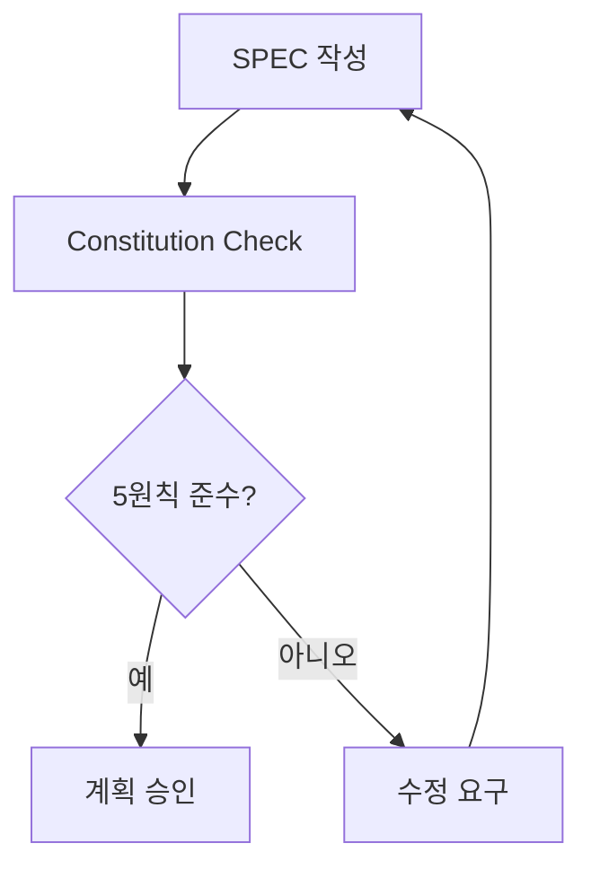

# MoAI-ADK 아키텍처

## 📂 표준 디렉토리 구조

MoAI-ADK는 Claude Code 표준을 완전히 준수하면서도 체계적인 문서 관리 시스템을 제공합니다.

```
프로젝트/
├── .claude/                       # Claude Code 표준 디렉토리
│   ├── commands/moai/             # 커스텀 슬래시 명령어 (연번순)
│   │   ├── 1-project.md           # /moai:1-project (대화형 마법사)
│   │   ├── 2-spec.md              # /moai:2-spec (EARS 명세)
│   │   ├── 3-plan.md              # /moai:3-plan (Constitution Check)
│   │   ├── 4-tasks.md             # /moai:4-tasks (TDD 태스크)
│   │   ├── 5-dev.md               # /moai:5-dev (구현)
│   │   └── 6-sync.md              # /moai:6-sync (동기화)
│   ├── output-styles/             # MoAI 맞춤형 출력 스타일 (5개)
│   │   ├── expert.md              # 간결하고 효율적인 전문가 모드
│   │   ├── beginner.md            # 상세한 설명과 단계별 안내
│   │   ├── study.md               # 깊이 있는 원리와 심화 학습
│   │   ├── mentor.md              # 1:1 멘토링과 페어 프로그래밍
│   │   └── audit.md               # 코드 품질 지속적 검증 개선
│   ├── agents/                     # 32개 전문 에이전트
│   │   ├── moai/                   # 11개 MoAI 워크플로우 에이전트
│   │   │   ├── claude-code-manager.md # MoAI-Claude 통합 전문가 (v0.1.12 완성)
│   │   │   ├── steering-architect.md  # Steering 문서 생성 전문가
│   │   │   ├── spec-manager.md        # SPEC 문서 관리 전문가
│   │   │   ├── plan-architect.md      # 계획 수립 및 ADR 관리 전문가
│   │   │   ├── task-decomposer.md     # 작업 분해 전문가
│   │   │   ├── code-generator.md      # TDD 기반 코드 생성 전문가
│   │   │   ├── test-automator.md      # TDD 자동화 전문가 (v0.1.9 신규)
│   │   │   ├── doc-syncer.md          # Living Document 동기화 전문가
│   │   │   ├── tag-indexer.md         # 16-Core @TAG 시스템 관리
│   │   │   ├── integration-manager.md # 외부 서비스 연동 관리
│   │   │   └── deployment-specialist.md # 배포 전략 및 자동화
│   │   ├── awesome/                 # 21개 범용 개발 에이전트
│   │   │   ├── ui-ux-designer.md    # UI/UX 설계 전문가
│   │   │   ├── frontend-developer.md # React/반응형 전문가
│   │   │   ├── python-pro.md        # Python 고급 전문가
│   │   │   ├── javascript-pro.md    # JavaScript ES6+ 전문가
│   │   │   ├── typescript-pro.md    # TypeScript 타입 시스템 전문가
│   │   │   ├── golang-pro.md        # Go 동시성 전문가
│   │   │   ├── rust-pro.md          # Rust 메모리 안전성 전문가
│   │   │   ├── php-pro.md           # PHP 현대 개발 전문가
│   │   │   ├── shell-scripting-pro.md # 셸 스크립트 자동화 전문가
│   │   │   ├── sql-pro.md           # SQL 쿼리 최적화 전문가
│   │   │   ├── nosql-specialist.md  # NoSQL 데이터베이스 전문가
│   │   │   ├── backend-architect.md # 백엔드 아키텍처 전문가
│   │   │   ├── database-architect.md # 데이터베이스 설계 전문가
│   │   │   ├── mobile-developer.md  # 모바일 크로스플랫폼 전문가
│   │   │   ├── test-engineer.md     # 테스트 자동화 전문가
│   │   │   ├── code-reviewer.md     # 코드 품질 리뷰 전문가
│   │   │   ├── debugger.md          # 디버깅/에러 분석 전문가
│   │   │   ├── error-detective.md   # 로그 분석/패턴 탐지 전문가
│   │   │   ├── documentation-expert.md # 기술 문서 작성 전문가
│   │   │   ├── api-documenter.md    # API 문서화 전문가
│   │   │   ├── prompt-engineer.md   # LLM 프롬프트 최적화 전문가
│   │   │   └── SUB-AGENTS.md        # 전체 에이전트 가이드
│   ├── hooks/                     # 11개 Hook 스크립트 (Python)
│   │   ├── moai/                   # 6개 MoAI 워크플로우 Hook
│   │   │   │                      # v0.1.12: stdin JSON 처리로 안정화
│   │   │   ├── policy_block.py       # PreToolUse: 정책 차단 (✅ JSON 처리)
│   │   │   ├── constitution_guard.py # PreToolUse: Constitution 보호 (🔧 v0.1.12 수정)
│   │   │   ├── tag_validator.py      # PreToolUse: 16-Core 태그 검증 (✅ JSON 처리)
│   │   │   ├── pre_write_guard.py    # PreToolUse: 파일 생성 가드
│   │   │   ├── post_stage_guard.py   # PostToolUse: 단계 검수 (✅ JSON 처리)
│   │   │   ├── session_start_notice.py # SessionStart: 상태 알림 (✅ JSON 처리)
│   │   │   └── test_hook.py          # Hook 시스템 테스트 스크립트 (v0.1.12 신규)
│   │   └── awesome/                 # 5개 범용 생산성 Hook
│   │       ├── auto_formatter.py    # PostToolUse: 스마트 코드 포맷팅
│   │       ├── auto_git_commit.py   # PostToolUse: 지능적 자동 커밋
│   │       ├── backup_before_edit.py # PreToolUse: 편집 전 백업
│   │       ├── test_runner.py       # PostToolUse: 자동 테스트 실행
│   │       └── security_scanner.py  # PostToolUse: 보안 취약점 스캔
│   ├── memory/                    # Claude Code 메모리(참조용 문서)
│   │   ├── project_guidelines.md    # 운영 원칙 및 에이전트 지침 요약
│   │   ├── coding_standards/        # 언어·프레임워크별 코딩 규칙(@imports)
│   │   ├── shared_checklists.md     # PR/테스트/보안 공통 체크리스트
│   │   └── …                        # Git/팀 규약, TDD, 보안 등 세부 지침
│   ├── logs/                      # 세션 로그
│   └── settings.json              # 팀 공유 설정
├── .moai/                         # MoAI 문서 시스템
│   ├── _templates/                # 🆕 v0.1.13: 동적 템플릿 시스템 (templates.mode=package일 때 미복사 가능)
│   │   ├── specs/                 # SPEC 템플릿
│   │   │   └── spec.template.md   # EARS 형식 명세서 템플릿
│   │   ├── steering/              # Steering 문서 템플릿
│   │   │   ├── product.template.md    # 제품 비전과 전략 템플릿
│   │   │   ├── structure.template.md  # 아키텍처 설계 템플릿
│   │   │   └── tech.template.md       # 기술 스택 선정 템플릿
│   │   ├── memory/                # 프로젝트 메모리 템플릿
│   │   │   ├── common.template.md       # 공통 운영 메모
│   │   │   ├── backend-*.template.md    # 백엔드 스택별 메모(예: backend-python)
│   │   │   ├── frontend-*.template.md   # 프론트엔드 스택별 메모(예: frontend-react)
│   │   │   └── constitution.template.md # 프로젝트별 헌법 템플릿
│   │   └── indexes/               # 상태 추적 템플릿
│   │       └── state.template.json    # 프로젝트 상태 템플릿
│   ├── steering/                  # 방향성 문서 (동적 생성)
│   │   # 📝 더 이상 초기화시 생성되지 않음 - /moai:1-project에서 필요시 생성
│   │   # ├── product.md             # /moai:1-project에서 생성
│   │   # ├── structure.md           # /moai:1-project에서 생성
│   │   # └── tech.md                # /moai:1-project에서 생성
│   ├── memory/                    # 거버넌스 문서
│   │   ├── common.md              # 공통 운영 메모(자동 생성)
│   │   ├── backend-*.md           # 백엔드 스택별 메모(예: backend-python.md)
│   │   ├── frontend-*.md          # 프론트엔드 스택별 메모(예: frontend-react.md)
│   │   ├── constitution.md        # 프로젝트 헌법
│   │   └── decisions/             # 아키텍처 결정 기록
│   │       └── ADR-*.md
│   ├── specs/                     # SPEC 문서 (동적 생성)
│   │   # 📝 SPEC-001-sample 디렉토리 제거됨 (v0.1.13)
│   │   # └── SPEC-001-feature/    # /moai:2-spec에서 생성
│   │   #     ├── spec.md          # 기능 명세 (템플릿 기반 생성)
│   │   #     ├── plan.md          # 구현 계획
│   │   #     ├── research.md      # 기술 조사
│   │   #     ├── data-model.md    # 데이터 모델
│   │   #     ├── tasks.md         # 작업 분해
│   │   #     ├── contracts/       # API 계약
│   │   #     └── quickstart.md    # 빠른 시작
│   ├── indexes/                   # 인덱스 파일
│   │   ├── tags.json              # @TAG 인덱스
│   │   ├── traceability.json      # 추적성 매트릭스
│   │   └── state.json             # 프로젝트 상태
│   ├── reports/                   # 자동 생성 리포트
│   └── config.json                # MoAI 설정
│   ├── scripts/                   # MoAI 검증 스크립트
│   │   ├── validate_stage.py        # Gate 검수
│   │   ├── check-secrets.py         # 시크릿 스캔
│   │   ├── check-licenses.py        # 라이선스 검사
│   │   ├── check-traceability.py    # 추적성 검증
│   │   ├── check_coverage.py        # 커버리지 임계 검사
│   │   ├── validate_tags.py         # @TAG 무결성 검사
│   │   ├── check_constitution.py    # Constitution 검증
│   │   ├── repair_tags.py           # TAG 링크 자동 수정
│   │   └── run-tests.sh             # 통합 테스트 실행
├── .github/                       # GitHub Actions
│   └── workflows/
│       ├── moai-ci.yml             # CI 파이프라인
│       └── PULL_REQUEST_TEMPLATE.md # PR 템플릿
├── docs/                          # 문서
│   ├── README.md                  # 프로젝트 소개
│   ├── CHANGELOG.md               # 변경 이력
│   └── API.md                     # API 문서
├── tests/                         # 테스트 디렉토리
│   ├── contract/                  # 계약 테스트
│   ├── integration/               # 통합 테스트
│   ├── unit/                      # 단위 테스트
│   └── e2e/                       # E2E 테스트
├── src/                           # 소스 코드
│   ├── models/                    # 데이터 모델
│   ├── services/                  # 비즈니스 로직
│   ├── api/                       # API 엔드포인트
│   └── utils/                     # 유틸리티
└── CLAUDE.md                      # 프로젝트 메모리
```

## 🔀 명령어별 책임 분리

MoAI-ADK는 설치와 프로젝트 초기화를 두 단계로 명확히 분리합니다:

### `moai init` - MoAI-ADK 기본 시스템 설치

**설치 범위**: MoAI-ADK 핵심 시스템만 설치
- `.claude/` 전체 시스템 (agents, commands, hooks, memory, output-styles)
- `.moai/` 기본 구조 (templates, memory, scripts/)  
  (설정 파일 `.moai/config.json`은 설치 시 생성)
- `.github/` CI/CD 시스템 (workflows, PR 템플릿)
- `CLAUDE.md` 프로젝트 메모리 파일
- Git 저장소 초기화 (필요시 Git 자동 설치 제안)
- 포괄적 `.gitignore` 파일 생성

### `/moai:1-project init` - 프로젝트별 구조 생성

**생성 범위**: steering 문서 기반 동적 구조 생성
- Steering 문서 생성 (product.md, structure.md, tech.md)
- 프로젝트별 디렉토리: `docs/`, `src/`, `tests/`
- 언어/프레임워크별 맞춤 구조
- 프로젝트 타입별 설정 파일
- 초기 SPEC 문서 생성

**장점**:
- 🎯 **명확한 분리**: 시스템 설치 vs 프로젝트 구성
- 🚀 **빠른 설치**: 기본 시스템만 우선 설치
- 🔧 **맞춤 구성**: 프로젝트 특성에 따른 동적 구조
- 📦 **재사용성**: 한 번 설치된 시스템으로 여러 프로젝트 지원

## 🏗️ 패키지 내장 리소스 아키텍처 (v0.1.13)

### 패키지 내장 리소스 시스템

```
moai_adk 패키지/
└── resources/
    └── templates/
        ├── .claude/         # Claude Code 설정 템플릿
        │   ├── agents/moai/ # 11개 MoAI 에이전트 파일
        │   ├── agents/awesome/ # 21개 범용 에이전트 파일
        │   ├── commands/    # 6개 슬래시 명령어
        │   └── hooks/       # 프로젝트 훅들
        ├── .moai/           # MoAI 설정 템플릿
        │   └── _templates/  # 문서 템플릿들 (templates.mode=package일 때는 복사 생략)
        └── CLAUDE.md        # 프로젝트 메모리

↓ importlib.resources + shutil.copytree ↓

프로젝트/
├── .claude/             # 완전히 복사된 파일들
│   ├── agents/moai/
│   ├── commands/moai/
│   └── hooks/moai/
└── .moai/               # 완전히 복사된 파일들
    ├── _templates/
    └── memory/
```

### 파일 복사 시스템의 장점

- **완전 독립성**: 각 프로젝트가 완전히 독립된 파일 복사본으로 동작
- **크로스 플랫폼**: Windows/macOS/Linux 모든 환경에서 동일한 동작
- **안정성**: shutil.copytree 기반의 예측 가능한 파일 복사
- **배포 안정성**: importlib.resources로 패키지 내장 리소스 안전 접근

### 모든 플랫폼 호환성

- **권한 문제 없음**: 심볼릭 링크나 관리자 권한이 필요 없음
- **단순 파일 복사**: shutil.copytree를 사용한 직관적 파일 복사
- **예측 가능한 동작**: 모든 환경에서 동일한 파일 시스템 기반 동작
- **패키지 무결성**: pip으로 설치된 패키지에서 리소스 직접 접근

## 🧠 템플릿 엔진 시스템 (v0.1.13)

### 동적 파일 생성

```python
$MOAI_VERSION      # 메인 버전 (예: vX.Y.Z)
$VERSION_FULL      # 전체 제목 (MoAI-ADK v0.1.17)
$VERSION_SHORT     # 짧은 형식 (v0.1.17)
$VERSION_BANNER    # 배너용 (🗿 MoAI-ADK v0.1.17)
$LAST_UPDATED      # 현재 날짜
```

### 템플릿 구조

- **specs/spec.template.md**: EARS 형식 명세서 템플릿
- **steering/product.template.md**: 제품 비전과 전략 템플릿
- **steering/structure.template.md**: 아키텍처 설계 템플릿
- **steering/tech.template.md**: 기술 스택 선정 템플릿
- **memory/common.template.md**: 공통 운영 메모 템플릿
- **memory/backend-*.template.md**: 백엔드 스택별 메모 템플릿(예: backend-python)
- **memory/frontend-*.template.md**: 프론트엔드 스택별 메모 템플릿(예: frontend-react)
- **memory/constitution.template.md**: 프로젝트별 헌법 템플릿
- **indexes/state.template.json**: 상태 추적 템플릿

### 동적 생성 시스템

- **폴백 탐색**: 프로젝트 `.moai/_templates` → 패키지 `moai_adk.resources/templates/.moai/_templates`
- **필요시 생성**: 더 이상 샘플 파일 사전 생성하지 않음
- **기술 스택 기반 메모리 생성**: `/moai:1-project`에서 선택한 스택에 따라 `.moai/memory/common.md` 및 `<layer>-<tech>.md` 문서가 자동 생성됨
- **변수 치환**: Python string.Template 기반 안전한 처리
- **다중 확장자 지원**: .template.md, .template.json 등
- **전용 생성 메서드**: SPEC, Steering, Constitution별 특화

## 🔄 데이터 흐름 아키텍처

### 1. 명령어 실행 플로우

```mermaid
flowchart TD
    A[Claude Code 명령어] --> B[PreToolUse Hook]
    B --> C[정책 검증]
    C --> D[도구 실행]
    D --> E[PostToolUse Hook]
    E --> F[문서 동기화]
    F --> G[@TAG 업데이트]
```

### 2. 추적성 체인

```mermaid
flowchart LR
    A[@REQ] --> B[@DESIGN]
    B --> C[@TASK]
    C --> D[@TEST]
    D --> E[구현 완료]
```

### 3. 품질 게이트



## 💾 상태 관리

### 인덱스 파일

- **tags.json**: 16-Core @TAG 실시간 인덱스
- **traceability.json**: 요구사항-구현 추적성 매트릭스
- **state.json**: 프로젝트 현재 상태 및 진행률

### 자동 동기화

- 코드 변경 시 관련 문서 자동 업데이트
- @TAG 링크 무결성 실시간 검증
- 추적성 매트릭스 자동 재생성

이러한 아키텍처는 **확장성**, **유지보수성**, **성능**을 모두 고려한 설계로, AI 시대의 개발 환경에 최적화되어 있습니다.

## 📚 관련 문서

- **[패키지 구조](package-structure.md)**: MoAI-ADK 내부 모듈 구조 (cli/, core/, install/)
- **[설치 가이드](05-installation.md)**: 프로젝트 구조 생성 및 설정
- **[빌드 시스템](build-system.md)**: 아키텍처 검증 및 빌드 프로세스
- **[Constitution](15-constitution.md)**: 아키텍처 설계 원칙
