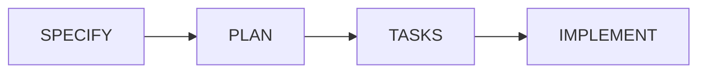

# MoAI-ADK 4단계 파이프라인

## 📝 4단계 파이프라인 워크플로우

MoAI-ADK는 명세 우선 개발을 위한 체계적인 4단계 파이프라인을 제공합니다.



## 모델 사용 가이드

| 단계 | 권장 모델 | 비고 |
|------|-----------|------|
| SPECIFY (`/moai:2-spec`) | `sonnet` | 균형 잡힌 명세 작성에 최적화 |
| PLAN (`/moai:3-plan`) | `opusplan` (plan 모드에서 Opus) | 복잡한 설계·검증 작업에 Opus 활용 후 실행 단계 자동 Sonnet 전환 |
| TASKS (`/moai:4-tasks`) | `sonnet` | TDD 작업 분해 및 의존성 계산에 적합 |
| IMPLEMENT (`/moai:5-dev`) | `sonnet` | 테스트 주도 구현/리팩터 기본 모델 |
| SYNC (`/moai:6-sync`) | `haiku` | 문서/인덱싱 동기화 등 속도 우선 작업 |

> 💡 모델/운영 가이드 세부 내용은 프로젝트 루트 `CLAUDE.md`의 “모델 사용 가이드(opusplan)” 섹션을 참고하세요.

## 단계별 상세

### 1. SPECIFY - 명세 작성
**명령어**: `/moai:2-spec`
**담당**: spec-manager 에이전트

**목표**: EARS 형식으로 명확한 요구사항 정의
- 기능 요구사항 (Functional Requirements)
- 비기능 요구사항 (Non-Functional Requirements)
- [NEEDS CLARIFICATION] 마커로 불명확한 부분 식별

**결과물** (2025년 1월 업데이트):
- **SPEC-XXX/ 디렉터리**: 내용별 맞춤 파일 생성
  - 기본 필수: `spec.md` (EARS 형식), `acceptance.md` (수락 기준)
  - 조건부 선택: `design.md`, `data-model.md`, `contracts/`, `research.md`
- **@REQ 태그 생성**: 16-Core TAG 시스템 연동
- **[NEEDS CLARIFICATION] 마커**: 불완전한 요구사항 자동 표시
- **백로그 관리**: `.moai/specs/backlog/` STUB 보관

### 2. PLAN - 계획 수립
**명령어**: `/moai:3-plan`
**담당**: plan-architect 에이전트

**목표**: Constitution 5원칙 준수 검증 및 구현 계획
- Simplicity, Architecture, Testing, Observability, Versioning 검증
- ADR (Architecture Decision Records) 작성
- 기술적 위험 요소 식별

**결과물**:
- SPEC-XXX/plan.md
- @DESIGN 태그 생성
- ADR 문서

### 3. TASKS - 작업 분해
**명령어**: `/moai:4-tasks`
**담당**: task-decomposer 에이전트

**목표**: TDD 기반 작업 단위 분해
- Red-Green-Refactor 사이클 계획
- 테스트 케이스 우선 정의
- Sprint 기반 작업 구조화

**결과물**:
- SPEC-XXX/tasks.md
- @TASK 태그 생성
- 테스트 계획서

### 4. IMPLEMENT - 구현
**명령어**: `/moai:5-dev`
**담당**: code-generator + test-automator 에이전트

**목표**: TDD 사이클 기반 자동 구현
- 테스트 작성 (RED)
- 최소 구현 (GREEN)
- 리팩토링 (REFACTOR)
- 커버리지 80% 이상 보장

**결과물**:
- 소스 코드
- 테스트 코드
- @TEST 태그 생성

## 단계별 Gate 체크포인트

### Gate 1: SPECIFY → PLAN
**검증 항목**:
- EARS 형식 준수 여부
- @REQ 태그 완성도
- [NEEDS CLARIFICATION] 해결 여부

**통과 조건**:
```bash
✅ 모든 요구사항이 EARS 형식으로 작성됨
✅ 불명확한 요구사항이 모두 해결됨
✅ @REQ 태그가 올바르게 생성됨
```

### Gate 2: PLAN → TASKS
**검증 항목**:
- Constitution 5원칙 준수
- 아키텍처 결정의 타당성
- 기술적 위험 요소 대응 계획

**통과 조건**:
```bash
✅ Constitution Check 통과
✅ ADR 문서 작성 완료
✅ @DESIGN 태그 체계 완성
```

### Gate 3: TASKS → IMPLEMENT
**검증 항목**:
- TDD 사이클 계획 완료
- 테스트 케이스 정의 완료
- 작업 우선순위 설정

**통과 조건**:
```bash
✅ 모든 작업이 테스트 우선으로 계획됨
✅ @TASK 태그 추적성 확보
✅ Sprint 계획 수립 완료
```

### Gate 4: IMPLEMENT → COMPLETE
**검증 항목**:
- 테스트 커버리지 80% 이상
- 모든 테스트 통과
- 코드 품질 기준 준수

**통과 조건**:
```bash
✅ 테스트 커버리지 ≥ 80%
✅ 모든 단위/통합 테스트 통과
✅ @TEST 태그 완성
```

## 자동화된 파이프라인 실행

### 전체 파이프라인 자동 실행
```bash
/moai:2-spec quick-feature "간단한 기능" --auto-pipeline
```

### 단계별 수동 실행
```bash
/moai:2-spec user-auth "JWT 기반 인증"
/moai:3-plan SPEC-001
/moai:4-tasks SPEC-001
/moai:5-dev T001 T002 T003
```

### 병렬 실행 지원
```bash
# 여러 태스크 동시 구현
/moai:5-dev T001 T002 T003 --parallel

# 독립적 SPEC 병렬 처리
/moai:5-dev SPEC-001 SPEC-002 --parallel
```

## 파이프라인 상태 관리

### 상태 추적
```json
// .moai/indexes/state.json
{
  "current_stage": "TASKS",
  "specs": {
    "SPEC-001": {
      "stage": "IMPLEMENT",
      "progress": 75,
      "tests_passing": true,
      "coverage": 0.85
    }
  }
}
```

### 진행률 모니터링
```bash
# 현재 프로젝트 상태(요약)
moai status

# 상세 상태(버전/파일 카운트 등)
moai status -v

# 다른 경로의 프로젝트 상태 확인
moai status -p /path/to/project
```

파이프라인은 **체계적인 개발 프로세스**와 **자동화된 품질 보장**을 통해 안정적인 소프트웨어 개발을 지원합니다.
