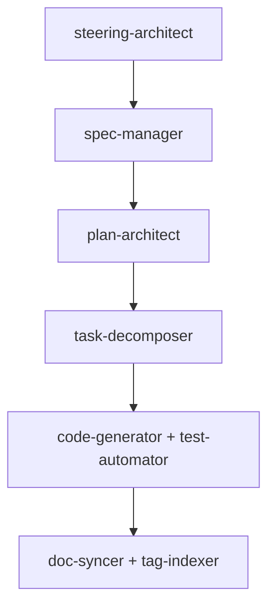

# MoAI-ADK Agent 시스템

## 🤖 11개 전문 에이전트 개요

MoAI-ADK는 각 개발 단계에 특화된 11개의 전문 에이전트를 제공합니다.

### 에이전트 분류

#### 📋 문서 관리 에이전트
- **steering-architect**: Steering 문서 생성 전문가
- **spec-manager**: EARS 형식 SPEC 문서 관리
- **doc-syncer**: Living Document 동기화

#### 🏗️ 계획 및 설계 에이전트
- **plan-architect**: Constitution Check 및 ADR 관리
- **task-decomposer**: TDD 작업 분해 전문가

#### 💻 구현 에이전트
- **code-generator**: TDD 기반 코드 생성
- **test-automator**: TDD 자동화 전문가

#### 🔧 시스템 관리 에이전트
- **claude-code-manager**: MoAI-Claude 통합 전문가
- **tag-indexer**: 14-Core @TAG 시스템 관리
- **integration-manager**: 외부 서비스 연동 관리
- **deployment-specialist**: 배포 전략 및 자동화

## 핵심 에이전트 상세

### 1. claude-code-manager (v0.1.12 완성)
**역할**: MoAI-Claude 통합 최적화
- Claude Code 설정 관리
- Hook 시스템 통합
- 권한 체계 최적화
- MCP 서버 통합

### 2. steering-architect
**역할**: 프로젝트 방향성 문서 생성
- product.md: 제품 비전과 전략
- structure.md: 아키텍처 설계
- tech.md: 기술 스택 선정

### 3. spec-manager
**역할**: EARS 형식 명세 관리
- SPEC 문서 생성 및 관리
- [NEEDS CLARIFICATION] 마커 시스템
- 요구사항 추적성 보장
 - 설명만 입력 시 의미 보존형 영어 케밥케이스 슬러그 자동 생성(예: "실시간 알림 시스템" → `user-notification`), 충돌 시 접미사 부여

### 4. plan-architect
**역할**: Constitution Check 및 계획 수립
- 5원칙 준수 검증
- ADR (Architecture Decision Records) 관리
- 품질 게이트 운영

### 5. task-decomposer
**역할**: TDD 작업 분해
- Red-Green-Refactor 태스크 생성
- 테스트 우선 작업 계획
- Sprint 기반 작업 구조화

### 6. code-generator + test-automator
**역할**: TDD 기반 자동 구현
- 테스트 작성 → 실패 확인 → 구현
- 커버리지 80% 이상 보장
- 리팩토링 자동화

### 7. doc-syncer + tag-indexer
**역할**: 문서 동기화 및 TAG 관리
- 코드↔문서 실시간 동기화
- @TAG 인덱스 자동 업데이트
- 추적성 매트릭스 관리

## 에이전트 자동 트리거 시스템

### AUTO-TRIGGERS 패턴

각 에이전트는 특정 조건에서 자동으로 실행됩니다:

```markdown
- steering-architect: 프로젝트 초기화 시 AUTO-TRIGGERS
- spec-manager: 새 요구사항 입력 시 AUTO-TRIGGERS
- plan-architect: SPEC 완성 후 AUTO-TRIGGERS
- task-decomposer: Constitution Check 통과 후 AUTO-TRIGGERS
- code-generator: TDD 태스크 생성 후 AUTO-TRIGGERS
- doc-syncer: 코드 변경 시 AUTO-TRIGGERS
```

### MUST BE USED 강제 패턴

```markdown
- claude-code-manager: MoAI 프로젝트 감지 시 MUST BE USED
- test-automator: 테스트 커버리지 80% 미만 시 MUST BE USED
- deployment-specialist: main 브랜치 업데이트 시 MUST BE USED
```

## 에이전트 체인 실행

### 4단계 파이프라인 연계



### 병렬 실행 지원

```bash
# 여러 에이전트 동시 실행
/moai:5-dev T001 T002 T003  # 3개 태스크 병렬 구현
```

## 에이전트 모델 표준

### 모델 할당 기준

- **opus**: 복잡한 추론과 설계 (steering-architect, plan-architect, code-generator)
- **sonnet**: 균형잡힌 범용 작업 (spec-manager, task-decomposer, test-automator, claude-code-manager)
- **haiku**: 빠른 처리 작업 (doc-syncer, tag-indexer)

### 모델명 규칙
```yaml
# 올바른 형식
model: sonnet

# 잘못된 형식 (금지)
model: claude-3-5-sonnet-20241022
```

## 에이전트 커스터마이징

### 프로젝트별 설정
```json
// .moai/config.json
{
  "agents": {
    "code-generator": {
      "model": "opus",
      "style": "defensive",
      "test_coverage_threshold": 0.9
    },
    "doc-syncer": {
      "auto_commit": true,
      "sync_frequency": "immediate"
    }
  }
}
```

### 팀별 정책
```markdown
# .claude/memory/team_conventions.md
## 에이전트 사용 정책
- 모든 SPEC은 spec-manager를 통해서만 작성
- Constitution Check는 plan-architect 필수
- 배포는 deployment-specialist 자동 실행
```

## 성능 최적화

### 컨텍스트 관리
- 단계별 `/clear` 자동 실행
- 필요한 컨텍스트만 유지
- 메모리 효율적 운영

### 병렬 처리
- 독립적 작업 동시 실행
- [P] 마커 작업 병렬 처리
- 자원 효율적 할당

에이전트 시스템은 **전문화된 자동화**를 통해 개발자가 창의적 작업에 집중할 수 있게 해줍니다.
