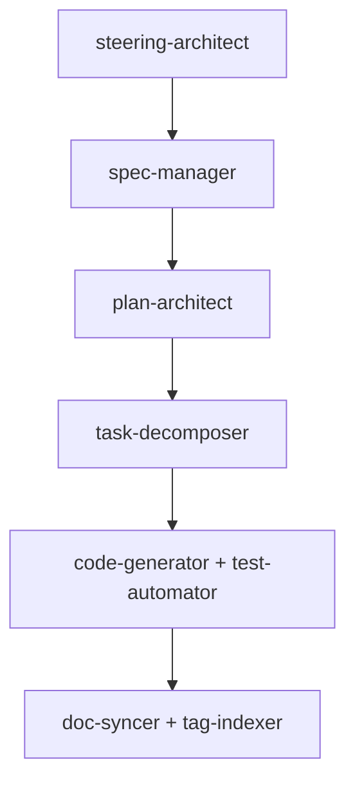

# MoAI-ADK Agent 시스템

## 🤖 58개 전문 에이전트 개요

MoAI-ADK는 각 개발 단계에 특화된 58개의 전문 에이전트를 제공합니다.
- **moai/ 폴더**: 11개 MoAI-ADK 워크플로우 전문 에이전트
- **awesome/ 폴더**: 47개 범용 개발 전문 에이전트

### 에이전트 분류

#### 📋 문서 관리 에이전트
- **steering-architect**: Steering 문서 생성 전문가
- **spec-manager**: EARS 형식 SPEC 문서 관리
- **doc-syncer**: Living Document 동기화

#### 🏗️ 계획 및 설계 에이전트
- **plan-architect**: Constitution Check 및 ADR 관리
- **task-decomposer**: TDD 작업 분해 전문가

#### 💻 구현 에이전트
- **code-generator**: TDD 기반 코드 생성
- **test-automator**: TDD 자동화 전문가

#### 🔧 시스템 관리 에이전트
- **claude-code-manager**: MoAI-Claude 통합 전문가
- **tag-indexer**: 16-Core @TAG 시스템 관리
- **integration-manager**: 외부 서비스 연동 관리
- **deployment-specialist**: 배포 전략 및 자동화

## 핵심 에이전트 상세

### 1. claude-code-manager (v0.1.12 완성)
**역할**: MoAI-Claude 통합 최적화
- Claude Code 설정 관리
- Hook 시스템 통합
- 권한 체계 최적화
- MCP 서버 통합

### 2. steering-architect
**역할**: 프로젝트 방향성 문서 생성
- product.md: 제품 비전과 전략
- structure.md: 아키텍처 설계
- tech.md: 기술 스택 선정

### 3. spec-manager
**역할**: EARS 형식 명세 관리
- SPEC 문서 생성 및 관리
- [NEEDS CLARIFICATION] 마커 시스템
- 요구사항 추적성 보장
 - 설명만 입력 시 의미 보존형 영어 케밥케이스 슬러그 자동 생성(예: "실시간 알림 시스템" → `user-notification`), 충돌 시 접미사 부여

### 4. plan-architect
**역할**: Constitution Check 및 계획 수립
- 5원칙 준수 검증
- ADR (Architecture Decision Records) 관리
- 품질 게이트 운영

### 5. task-decomposer
**역할**: TDD 작업 분해
- Red-Green-Refactor 태스크 생성
- 테스트 우선 작업 계획
- Sprint 기반 작업 구조화

### 6. code-generator + test-automator
**역할**: TDD 기반 자동 구현
- 테스트 작성 → 실패 확인 → 구현
- 커버리지 80% 이상 보장
- 리팩토링 자동화

### 7. doc-syncer + tag-indexer
**역할**: 문서 동기화 및 TAG 관리
- 코드↔문서 실시간 동기화
- @TAG 인덱스 자동 업데이트
- 추적성 매트릭스 관리

## 에이전트 자동 트리거 시스템

### AUTO-TRIGGERS 패턴

각 에이전트는 특정 조건에서 자동으로 실행됩니다:

```markdown
- steering-architect: 프로젝트 초기화 시 AUTO-TRIGGERS
- spec-manager: 새 요구사항 입력 시 AUTO-TRIGGERS
- plan-architect: SPEC 완성 후 AUTO-TRIGGERS
- task-decomposer: Constitution Check 통과 후 AUTO-TRIGGERS
- code-generator: TDD 태스크 생성 후 AUTO-TRIGGERS
- doc-syncer: 코드 변경 시 AUTO-TRIGGERS
```

### MUST BE USED 강제 패턴

```markdown
- claude-code-manager: MoAI 프로젝트 감지 시 MUST BE USED
- test-automator: 테스트 커버리지 80% 미만 시 MUST BE USED
- deployment-specialist: main 브랜치 업데이트 시 MUST BE USED
```

## 에이전트 체인 실행

### 4단계 파이프라인 연계



### 병렬 실행 지원

```bash
# 여러 에이전트 동시 실행
/moai:5-dev T001 T002 T003  # 3개 태스크 병렬 구현
```

## 에이전트 모델 표준

### 모델 할당 기준

- **opus**: 복잡한 추론과 설계 (steering-architect, plan-architect, code-generator)
- **sonnet**: 균형잡힌 범용 작업 (spec-manager, task-decomposer, test-automator, claude-code-manager)
- **haiku**: 빠른 처리 작업 (doc-syncer, tag-indexer)

### 모델명 규칙
```yaml
# 올바른 형식
model: sonnet

# 잘못된 형식 (금지)
model: claude-3-5-sonnet-20241022
```

## 에이전트 커스터마이징

### 프로젝트별 설정
```json
// .moai/config.json
{
  "agents": {
    "code-generator": {
      "model": "opus",
      "style": "defensive",
      "test_coverage_threshold": 0.9
    },
    "doc-syncer": {
      "auto_commit": true,
      "sync_frequency": "immediate"
    }
  }
}
```

### 팀별 정책
```markdown
# .claude/memory/team_conventions.md
## 에이전트 사용 정책
- 모든 SPEC은 spec-manager를 통해서만 작성
- Constitution Check는 plan-architect 필수
- 배포는 deployment-specialist 자동 실행
```

## 성능 최적화

### 컨텍스트 관리
- 단계별 `/clear` 자동 실행
- 필요한 컨텍스트만 유지
- 메모리 효율적 운영

### 병렬 처리
- 독립적 작업 동시 실행
- [P] 마커 작업 병렬 처리
- 자원 효율적 할당

## 🌟 awesome/ 범용 에이전트 추가

### 프론트엔드 & UI/UX 전문가
- **ui-ux-designer**: 사용자 중심 설계와 인터페이스 시스템 전문가
- **frontend-developer**: React 애플리케이션과 반응형 디자인 전문가
- **html-css-pro**: HTML/CSS, 접근성, 성능 최적화 전문가
- **cli-ui-designer**: CLI/터미널 UI 설계 전문가
- **tailwind-css-pro**: 디자인 토큰과 Tailwind 기반 디자인 시스템 전문가
- **nextjs-architecture-expert**: Next.js/React 기반 SSR/SSG 아키텍처 전문가
- **react-performance** · **react-performance-optimizer**: React 상태/성능 최적화 전문가
- **vuejs-pro**: Vue 3/Nuxt 아키텍처 및 컴포지션 패턴 전문가
- **svelte-pro**: Svelte/SvelteKit 성능 및 배포 전문가

### 모바일 전문가
- **mobile-developer**: React Native/Flutter 크로스플랫폼 전문가
- **swift-pro**: SwiftUI/Combine 기반 Apple 플랫폼 전문가
- **objective-c-pro**: 레거시 iOS/macOS 코드와 Swift 브릿지 전문가
- **dart-pro**: Flutter/Dart 상태관리와 성능 전문가

### 백엔드 & 데이터베이스 전문가
- **backend-architect**: 백엔드 시스템 아키텍처와 API 설계 전문가
- **database-architect**: 데이터베이스 아키텍처와 설계 전문가
- **sql-pro**: 복잡한 SQL 쿼리와 실행 계획 최적화 전문가
- **nosql-specialist**: MongoDB, Redis, Cassandra 등 NoSQL 데이터베이스 전문가
- **java-pro**: JVM, Spring/Quarkus, 동시성 최적화 전문가
- **kotlin-pro**: Kotlin/코루틴, KMP, Spring/Ktor 설계 전문가
- **ruby-pro**: Ruby/Rails 아키텍처 및 성능 개선 전문가
- **php-pro**: 현대 PHP 개발과 고성능 애플리케이션 전문가
- **golang-pro**: 고루틴과 채널을 활용한 관용적 Go 코드 전문가
- **scala-pro**: FP/타입레벨, Akka/ZIO 기반 분산 시스템 전문가

### 프로그래밍 언어 전문가
- **python-pro**: 고급 파이썬 기능과 성능 최적화 전문가
- **javascript-pro**: 현대 JavaScript와 비동기 패턴 전문가
- **typescript-pro**: 고급 타입 시스템과 타입 안전성 전문가
- **c-pro**: 시스템 레벨 C 코드 및 최적화 전문가
- **c-sharp-pro**: .NET/CLR 기반 애플리케이션 전문가
- **cpp-pro**: Modern C++과 메모리/성능 최적화 전문가
- **rust-pro**: 소유권 패턴과 메모리 안전성을 마스터한 Rust 전문가
- **shell-scripting-pro**: 견고한 셸 스크립트와 자동화 패턴 전문가

### 구성/DevOps 전문가
- **yaml-pro**: Kubernetes/CI 파이프라인 등 YAML 구성 전문가
- **json-pro**: JSON Schema, OpenAPI, 계약 테스트 전문가
- **xml-pro**: XSD/Relax NG, XSLT 기반 XML 파이프라인 전문가
- **dockerfile-pro**: 멀티스테이지 빌드, 이미지 보안 최적화 전문가

### 문서화 & AI 전문가
- **documentation-expert**: 기술 문서 작성과 유지보수 전문가
- **markdown-pro**: Docs-as-Code, 문서 파이프라인 및 스타일 가이드 전문가
- **api-documenter**: OpenAPI/Swagger와 SDK 생성 전문가
- **prompt-engineer**: LLM 프롬프트 최적화와 AI 시스템 전문가
- **changelog-generator**: 변경 이력 자동 생성 및 검증 전문가

### 품질 보증 & 검증 전문가
- **test-engineer**: 테스트 자동화와 품질 보증 전문가
- **code-reviewer**: 코드 품질, 보안, 유지보수성 전문가
- **debugger**: 에러 분석과 디버깅 전문가
- **error-detective**: 로그 분석과 에러 패턴 탐지 전문가
- **fact-checker**: 사실 검증 및 근거 강화 전문가

### 범용 지원
- **agent-expert**: 복합 이슈 조율을 위한 범용 에이전트 가이드

### 범용 에이전트 사용법
```bash
# 특정 기술 전문가 호출
Task: frontend-developer "React 컴포넌트 최적화"
Task: python-pro "비동기 처리 개선"
Task: database-architect "스키마 설계 검토"
Task: nosql-specialist "MongoDB 스키마 최적화"
Task: sql-pro "복잡한 조인 쿼리 최적화"

# 언어별 전문가
Task: golang-pro "동시성 처리 최적화"
Task: rust-pro "메모리 안전성 검증"
Task: php-pro "고성능 API 개발"
Task: shell-scripting-pro "배포 스크립트 작성"

# 품질 검증
Task: code-reviewer "코드 리뷰 수행"
Task: test-engineer "테스트 전략 수립"
Task: error-detective "로그 분석 및 디버깅"
```

## 📋 전체 에이전트 목록

상세한 에이전트 목록과 설명은 [SUB-AGENTS.md](/src/moai_adk/resources/templates/.claude/agents/SUB-AGENTS.md)를 참조하세요.

에이전트 시스템은 **전문화된 자동화**를 통해 개발자가 창의적 작업에 집중할 수 있게 해줍니다.
