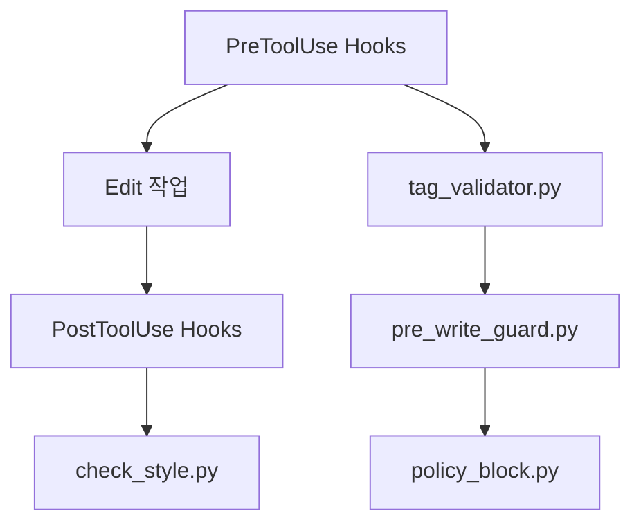

# MoAI-ADK Hook 시스템

## 🪝 개요

MoAI-ADK의 Hook 시스템은 Claude Code 표준 인터페이스를 통해 개발 과정의 품질을 자동으로 보장합니다. 개인/팀 모드에 맞춰 가드·검증·상태 표시를 수행합니다.

## 폴더 구조 (실제 배치)
```
.claude/hooks/moai/
├── auto_checkpoint.py      # 개인 모드: 파일 변경 감지 + 주기 백업
├── check_style.py          # 포맷/스타일 검증
├── file_watcher.py         # 파일 감시 → 체크포인트 트리거
├── language_detector.py    # 언어 자동 감지(선택)
├── policy_block.py         # 위험 명령/경로 차단
├── pre_write_guard.py      # 편집 전 가드(입력 검증 등)
├── run_tests_and_report.py # 테스트 실행 및 요약(선택)
├── session_start_notice.py # 세션 시작 공지/상태 출력
├── steering_guard.py       # UserPromptSubmit 단계에서 steering 안전 규칙 강제
└── tag_validator.py        # 16-Core @TAG 형식 검증
```


## .claude/settings.json Hook 설정 (권장)

```json
{
  "permissions": {
    "defaultMode": "acceptEdits",
    "allow": ["Task","Read","Write","Edit","MultiEdit","NotebookEdit","Grep","Glob","TodoWrite","WebFetch","Bash(python3:*)"],
    "deny": ["Read(./.env)","Read(./.env.*)","Read(./secrets/**)"]
  },
  "hooks": {
    "PreToolUse": [
      { "matcher": "Edit|Write|MultiEdit", "hooks": [
        { "type": "command", "command": "python3 $CLAUDE_PROJECT_DIR/.claude/hooks/moai/tag_validator.py" },
        { "type": "command", "command": "python3 $CLAUDE_PROJECT_DIR/.claude/hooks/moai/pre_write_guard.py" }
      ]},
      { "matcher": "Bash", "hooks": [
        { "type": "command", "command": "python3 $CLAUDE_PROJECT_DIR/.claude/hooks/moai/policy_block.py" }
      ]}
    ],
    "PostToolUse": [
      { "matcher": "Edit|Write|MultiEdit", "hooks": [
        { "type": "command", "command": "python3 $CLAUDE_PROJECT_DIR/.claude/hooks/moai/check_style.py" }
      ]}
    ],
    "SessionStart": [
      { "matcher": "*", "hooks": [
        { "type": "command", "command": "python3 $CLAUDE_PROJECT_DIR/.claude/hooks/moai/session_start_notice.py" }
      ]}
    ],
    "UserPromptSubmit": [
      { "hooks": [
        { "type": "command", "command": "python3 $CLAUDE_PROJECT_DIR/.claude/hooks/moai/steering_guard.py" }
      ]}
    ]
  }
}
```

## 파일 편집 시 Hook 체인



## 개인 모드 자동 체크포인트

- `auto_checkpoint.py` + `file_watcher.py` 사용 시 파일 변경과 5분 주기로 체크포인트(Annotated Tag)를 생성합니다.
- 상태 확인: `/moai:git:checkpoint --status`, 목록: `--list`.

## 문제 해결

- 실행 권한: `chmod +x .claude/hooks/moai/*.py`
- JSON 처리: stdin 기반 입력을 사용해 MultiEdit/Batch에서도 안전 동작
- 위험 명령 차단: `policy_block.py`에서 접두 매칭으로 차단 범위를 최소/명확화
