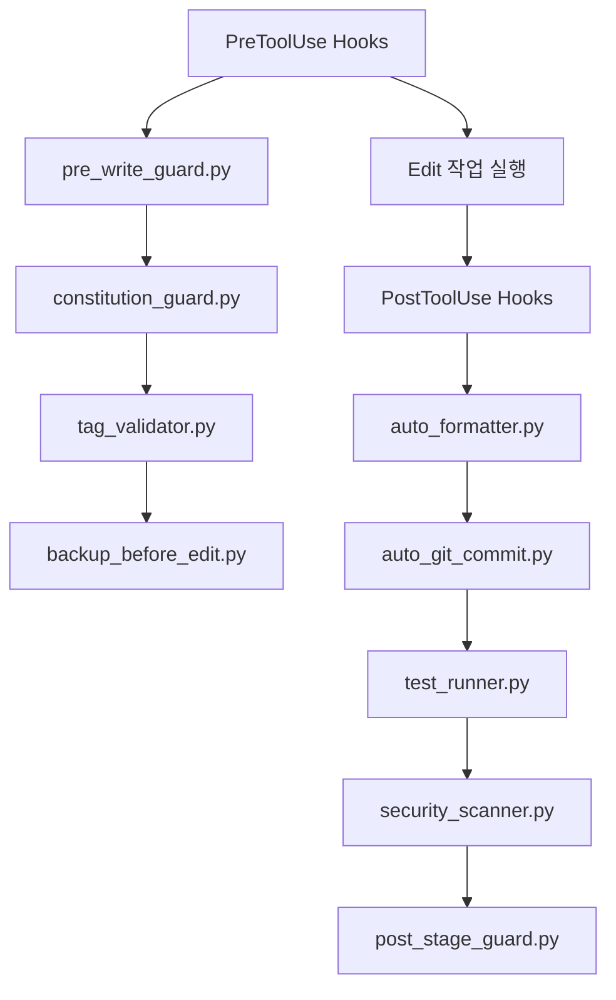

# MoAI-ADK Hook 시스템

## 🪝 Hook 시스템 개요

MoAI-ADK의 Hook 시스템은 Claude Code의 표준 Hook 인터페이스를 활용하여 개발 과정의 품질을 자동으로 보장합니다.

### v0.1.21 안정성 개선
- 환경 변수 미설정 시 훅이 실패하지 않도록 방어 로직 강화(`auto_formatter.py` 등 awesome 훅)
- 훅 실행 실패로 워크플로우가 중단되지 않도록 기본 동작을 성공(0)으로 처리
- `pre_write_guard.py`의 위험 명령 차단 및 grep→ripgrep 권고는 기존 정책대로 유지

## Hook 이벤트 정의

| Hook Event           | Trigger           | 주요 역할                       | Exit Code        |
| -------------------- | ----------------- | ------------------------------- | ---------------- |
| **PreToolUse**       | 도구 실행 전      | 정책 차단, Constitution 보호    | 0: 허용, 2: 차단 |
| **PostToolUse**      | 도구 실행 후      | 자동 검수, 커밋 지침, 세션 안내 | 0: 성공          |
| **SessionStart**     | 세션 시작         | Gate 상태 확인, 미완료 알림     | 0: 성공          |

## 11개 핵심 Hook 스크립트

### MoAI 워크플로우 Hook (moai/ 폴더)

6개의 MoAI-ADK 전용 워크플로우 Hook입니다.

### 1. policy_block.py - PreToolUse Hook

**기능**: 위험 명령어 차단 및 정책 검증

```python
# 주요 차단 대상
dangerous_commands = [
    'rm -rf /',
    'sudo rm',
    'dd if=/dev/zero',
    ':(){:|:&};:'  # Fork bomb
]

# Steering 문서 보호
if '.moai/steering/' in file_path:
    print("🔒 Steering 문서는 /moai:1-project로 수정하세요")
    sys.exit(2)  # 차단
```

### 2. constitution_guard.py - PreToolUse Hook

**기능**: Constitution 5원칙 보호 및 검증

```python
# Constitution 검증은 .moai/config.json 기반으로 수행됩니다.
# 체크리스트 파일 의존성은 제거되었습니다.
# 예) tdd_required, min_coverage 등 설정을 읽어 검증합니다.
```

### 3. tag_validator.py - PreToolUse Hook

**기능**: 16-Core @TAG 시스템 품질 검증

```python
# 16-Core 태그 체계 검증
valid_tags = {
    'SPEC': ['REQ', 'SPEC', 'DESIGN', 'TASK'],
    'Steering': ['VISION', 'STRUCT', 'TECH', 'ADR'],
    'Implementation': ['FEATURE', 'API', 'TEST', 'DATA'],
    'Quality': ['PERF', 'SEC', 'DEBT', 'TODO']
}

# 태그 패턴 검증
tag_pattern = r'@([A-Z]+)[-:]([A-Z0-9-]+)'
```

### 4. pre_write_guard.py - PreToolUse Hook

**기능**: 과도한 파일 생성·위험 명령 차단 및 안전 가드(설정 가능)

```python
# 민감 경로 차단
if '.env' in path.lower() or '.git/' in path.lower():
    print("민감 경로 수정 차단")
    sys.exit(2)

# 신규 파일 개수 제한 (기본 20, 안전 경로는 50)
limits = config['hooks']['limits']
max_new = limits.get('max_new_files_per_session', 20)
safe_max = limits.get('safe_max_new_files_per_session', 50)
safe_prefixes = limits.get('safe_write_prefixes', [])

state['new_files'] += 1
rel = to_rel_path(file_path)
if rel.startswith(tuple(safe_prefixes)):
    allowed = safe_max
else:
    allowed = max_new
if state['new_files'] > allowed:
    print(f"New file creation limit exceeded (>{allowed}). Increase via .moai/config.json hooks.limits.*")
    sys.exit(2)

# `grep` 대신 `rg` 권장, 위험한 `rm -rf` 바리케이드
if 'rm -rf /' in command or re.search(r'(^|\\s)grep(\\s|$)', command):
    print('위험 명령 또는 grep 사용 시도 차단')
    sys.exit(2)
```

### 5. post_stage_guard.py - PostToolUse Hook

**기능**: 단계 완료 후 자동 검수 및 안내

```python
# 자동 검수 실행
if tool_name in ['Write', 'Edit', 'MultiEdit']:
    # TAG 인덱스 업데이트
    update_tag_index()

    # 추적성 매트릭스 갱신
    update_traceability_matrix()

    # 다음 단계 안내
    suggest_next_step()
```

### 6. session_start_notice.py - SessionStart Hook

**기능**: 세션 시작 시 프로젝트 상태 알림

```python
# 프로젝트 상태 분석
def analyze_project_state():
    # SPEC 문서 존재 여부
    specs = list(Path('.moai/specs').glob('SPEC-*/spec.md'))

    # 미완료 작업 확인
    pending_tasks = check_pending_tasks()

    # Gate 상태 확인
    gate_status = check_gate_status()

    return {
        'specs_count': len(specs),
        'pending_tasks': pending_tasks,
        'current_gate': gate_status
    }
```

## .claude/settings.json Hook 설정

```json
{
  "permissions": {
    "defaultMode": "ask",
    "allow": ["Read(**)", "Grep", "Glob", "Task", "Bash(*)"]
  },
  "hooks": {
    "PreToolUse": [
      {
        "matcher": "Edit|MultiEdit|Write|Bash",
        "hooks": [
          {
            "type": "command",
            "command": "python3 $CLAUDE_PROJECT_DIR/.claude/hooks/moai/pre_write_guard.py",
            "timeout": 60
          }
        ]
      },
      {
        "matcher": "Edit|MultiEdit|Write",
        "hooks": [
          {
            "type": "command",
            "command": "python3 $CLAUDE_PROJECT_DIR/.claude/hooks/moai/constitution_guard.py"
          },
          {
            "type": "command",
            "command": "python3 $CLAUDE_PROJECT_DIR/.claude/hooks/moai/tag_validator.py"
          }
        ]
      },
      {
        "matcher": "Edit",
        "hooks": [
          {
            "type": "command",
            "command": "python3 $CLAUDE_PROJECT_DIR/.claude/hooks/awesome/backup_before_edit.py",
            "description": "Backup files before editing"
          }
        ]
      },
      {
        "matcher": "Bash|WebFetch",
        "hooks": [
          {
            "type": "command",
            "command": "python3 $CLAUDE_PROJECT_DIR/.claude/hooks/moai/policy_block.py"
          }
        ]
      }
    ],
    "PostToolUse": [
      {
        "matcher": "Edit|MultiEdit",
        "hooks": [
          {
            "type": "command",
            "command": "python3 $CLAUDE_PROJECT_DIR/.claude/hooks/awesome/auto_formatter.py",
            "description": "Smart code formatter"
          }
        ]
      },
      {
        "matcher": "Edit|Write",
        "hooks": [
          {
            "type": "command",
            "command": "python3 $CLAUDE_PROJECT_DIR/.claude/hooks/awesome/auto_git_commit.py",
            "description": "Intelligent auto-commit"
          }
        ]
      },
      {
        "matcher": "Edit",
        "hooks": [
          {
            "type": "command",
            "command": "python3 $CLAUDE_PROJECT_DIR/.claude/hooks/awesome/test_runner.py",
            "description": "Run tests after code changes"
          }
        ]
      },
      {
        "matcher": "Edit|Write",
        "hooks": [
          {
            "type": "command",
            "command": "python3 $CLAUDE_PROJECT_DIR/.claude/hooks/awesome/security_scanner.py",
            "description": "Security vulnerability scanner"
          }
        ]
      },
      {
        "matcher": "Edit|MultiEdit|Write",
        "hooks": [
          {
            "type": "command",
            "command": "python3 $CLAUDE_PROJECT_DIR/.claude/hooks/moai/post_stage_guard.py"
          }
        ]
      }
    ],
    "SessionStart": [
      {
        "matcher": "*",
        "hooks": [
          {
            "type": "command",
            "command": "python3 $CLAUDE_PROJECT_DIR/.claude/hooks/moai/session_start_notice.py"
          }
        ]
      }
    ]
  }
}
```

> 기본 템플릿은 `pre_write_guard.py`만 활성화된 최소 구성으로 제공되며, 필요에 따라 위와 같이 `policy_block.py`, `constitution_guard.py`, `tag_validator.py` 등을 추가 연결할 수 있습니다.

## Hook 시스템의 이점

### 자동화된 품질 보장
- **사전 차단**: 위험한 작업을 미리 방지
- **실시간 검증**: 작업 중 품질 규칙 자동 확인
- **사후 처리**: 완료 후 자동 정리 및 동기화

### Constitution 5원칙 강제
- **Simplicity**: 복잡한 구조 생성 방지
- **Architecture**: 표준 구조 준수 강제
- **Testing**: 테스트 없는 구현 차단
- **Observability**: 로깅 및 모니터링 강제
- **Versioning**: 버전 관리 규칙 준수

### 16-Core TAG 무결성
- **실시간 검증**: 태그 생성 시점에 규칙 확인
- **자동 수정**: 링크 깨짐 자동 복구
- **품질 점수**: 태그 품질 정량 평가

## 문제 해결

### Hook 실행 권한 문제
```bash
# Linux/macOS
chmod +x .claude/hooks/moai/*.py

# Windows PowerShell
Set-ExecutionPolicy -ExecutionPolicy RemoteSigned -Scope CurrentUser
```

### Hook 테스트
```bash
# Hook 시스템 테스트
python .claude/hooks/moai/test_hook.py

# 개별 Hook 테스트
echo '{"tool_name": "Write", "tool_input": {"file_path": "test.md", "content": "@REQ:TEST-001"}}' | python .claude/hooks/moai/tag_validator.py
```

### JSON 처리 오류 (v0.1.12 수정)
- **기존**: `sys.argv` 사용으로 인한 파싱 오류
- **개선**: `stdin` JSON 처리로 Claude Code 표준 완전 준수

### Awesome Hook 컬렉션 (awesome/ 폴더)

개발 생산성을 향상시키는 5개의 범용 Hook입니다.

#### 7. auto_formatter.py - PostToolUse Hook

**기능**: 파일 타입별 자동 코드 포매팅

```python
# 지원 포매터
formatters = {
    ('.js', '.ts', '.jsx', '.tsx'): ['npx', 'prettier', '--write'],
    ('.py',): ['black'],
    ('.go',): ['gofmt', '-w'],
    ('.rs',): ['rustfmt'],
    ('.php',): ['php-cs-fixer', 'fix']
}
```

#### 8. auto_git_commit.py - PostToolUse Hook

**기능**: 지능적 자동 Git 커밋

```python
# 파일 타입별 커밋 메시지
if ext == '.md':
    return f"📝 Update documentation: {filename}"
elif 'test' in filename:
    return f"🧪 Update tests: {filename}"
else:
    return f"{emoji} Update {filename} ({size}: {changed_lines} lines)"
```

#### 9. backup_before_edit.py - PreToolUse Hook

**기능**: 편집 전 자동 백업

```python
# 타임스탬프 백업
timestamp = int(time.time())
backup_path = f"{file_path}.backup.{timestamp}"
shutil.copy2(file_path, backup_path)

# 자동 정리 (최근 5개만 유지)
cleanup_old_backups(file_path, keep_count=5)
```

#### 10. test_runner.py - PostToolUse Hook

**기능**: 코드 변경 후 자동 테스트 실행

```python
# 프로젝트 타입별 테스트 명령
test_commands = {
    'js/ts': ['npm test', 'yarn test', 'jest'],
    'python': ['pytest', 'python -m pytest'],
    'ruby': ['bundle exec rspec', 'rspec'],
    'go': ['go test ./...', 'go test .']
}
```

#### 11. security_scanner.py - PostToolUse Hook

**기능**: 보안 취약점 자동 스캔

```python
# 보안 스캐너 통합
scanners = [
    ('Hardcoded Secrets', scan_hardcoded_secrets),
    ('Dangerous Functions', scan_dangerous_functions),
    ('Semgrep', scan_with_semgrep),
    ('Bandit', scan_with_bandit),
    ('GitLeaks', scan_with_gitleaks)
]
```

## 확장된 Hook 실행 순서

### 파일 편집 시 전체 Hook 체인



### Hook 타이밍 최적화

- **백업**: 편집 전 (PreToolUse)
- **포매팅**: 편집 후 즉시 (PostToolUse 첫 번째)
- **커밋**: 포매팅 후 (PostToolUse)
- **테스트**: 커밋 후 (PostToolUse)
- **보안 스캔**: 테스트와 병렬 (PostToolUse)

Hook 시스템은 개발자가 의식하지 않아도 자동으로 품질을 보장하는 **투명한 품질 게이트**입니다.
