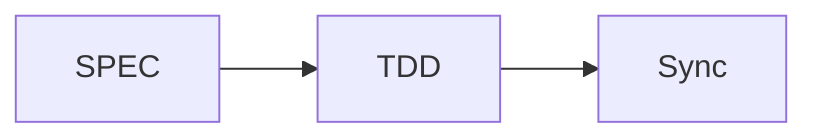

# MoAI-ADK Documentation

This directory contains the official MoAI-ADK documentation built with MkDocs.

**Version**: v0.9.0
**Last Updated**: 2025-11-05
**Language**: English

# @CODE:DOCS-003

## 🚀 Quick Start

### 1. UV Installation (Recommended)
```bash
# macOS/Linux
curl -LsSf https://astral.sh/uv/install.sh | sh

# Windows
powershell -c "irm https://astral.sh/uv/install.ps1 | iex"

# Or with pip
pip install uv
```

### 2. Install Dependencies
```bash
uv sync
```

### 3. Start Development Server
```bash
uv run dev
```

### 4. View in Browser
[http://127.0.0.1:8080](http://127.0.0.1:8080)

## 📚 Available Commands

| Command | Description |
|--------|-------------|
| `uv run dev` | Start development server |
| `uv run build` | Build static site |
| `uv run deploy` | Deploy to GitHub Pages |
| `uv run clean` | Clean build files |
| `uv run validate` | Build and validate in strict mode |
| `uv run preview` | Start dev server with fast reload |
| `uv sync` | Sync dependencies |
| `uv lock` | Generate lockfile |
| `uv lock --upgrade` | Upgrade dependencies |

## 📁 Directory Structure

```
docs/
├── mkdocs.yml              # MkDocs configuration file
├── requirements.txt        # Python dependencies
├── package.json           # Build scripts
├── index.md               # Main page
├── getting-started/       # Getting started guide
├── alfred/                # Alfred SuperAgent documentation
├── commands/              # Command reference
├── development/           # Development guide
├── advanced/              # Advanced features
├── api/                   # API reference
├── contributing/          # Contribution guide
├── stylesheets/           # Custom CSS
├── javascripts/           # Custom JavaScript
├── assets/               # Static assets
└── overrides/             # Theme overrides
```

## 🎨 Customization

### Theme Settings
- **Material Design**: Google Material Design based
- **Dark Mode**: Auto/manual theme switching
- **Multilingual Support**: Korean, English, Japanese, etc.

### Extensions
- **Mermaid Diagrams**: Workflow visualization
- **Code Highlighting**: 50+ programming languages
- **Search**: Professional search with auto-completion
- **Git Integration**: Commit information and version management

## 📝 Documentation Guide

### Markdown Extensions
```markdown
!!! note "Note"
    Important information

!!! warning "Warning"
    Information requiring attention

!!! tip "Tip"
    Useful tips
```

### Code Blocks
```python
def hello_world():
    print("Hello, MoAI-ADK!")
```

### Mermaid Diagrams


## 🚀 Deployment

### Vercel Deployment (Recommended)
```bash
# 1. Install Vercel CLI
npm i -g vercel

# 2. Login to Vercel
vercel login

# 3. Deploy
vercel --prod
```

### Automatic Deployment Setup
- Connect GitHub repository in Vercel dashboard
- Auto-deployment on push to `main` branch
- Domain: `https://adk.mo.ai.kr`

### GitHub Pages
```bash
uv run deploy
```

### Other Hosting
```bash
uv run build
# Upload site/ directory to your hosting service
```

## 🔧 Development

### Local Development Environment
```bash
# UV installation (skip if already installed)
curl -LsSf https://astral.sh/uv/install.sh | sh

# Create virtual environment and install dependencies
uv venv
source .venv/bin/activate  # Linux/macOS
# .venv\Scripts\activate   # Windows

# Sync dependencies
uv sync

# Start development server
uv run dev
```

### UV-based Workflow
```bash
# Add dependencies
uv add mkdocs-material

# Update dependencies
uv lock --upgrade

# Run scripts
uv run mkdocs --help

# Development server with hot reload
uv run dev

# Build
uv run build

# Clean
uv run clean
```

### Document Validation
```bash
mkdocs build --strict
```

## 📊 Monitoring

### Build Statistics
```bash
find site/ -name "*.html" | wc -l
```

### Size Check
```bash
du -sh site/
```

## 🐛 Troubleshooting

### Common Issues

#### Build Errors
```bash
# Clear cache
rm -rf site/ .doit_db/

# Rebuild
mkdocs build
```

#### Plugin Errors
```bash
# Reinstall plugins
pip install --upgrade mkdocs-material
```

#### Style Loading Issues
```bash
# Clear browser cache
# Force refresh in developer tools
```

## 📞 Support

- **Documentation**: [MoAI-ADK Official Docs](https://moai-adk.gooslab.ai)
- **Issues**: [GitHub Issues](https://github.com/moai-adk/MoAI-ADK/issues)
- **Community**: [GitHub Discussions](https://github.com/moai-adk/MoAI-ADK/discussions)

## 📄 License

This documentation is licensed under the MIT License.