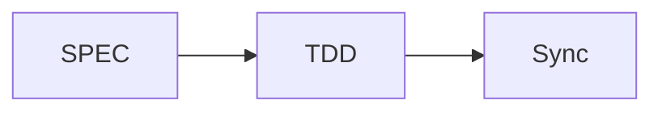

# MoAI-ADK Documentation

このディレクトリには、MkDocsを使用して構築されたMoAI-ADK公式ドキュメントが含まれています。

**Version**: v0.9.0 **Last Updated**: 2025-11-05 **Language**: 日本語

# @CODE:DOC-ONLINE-001:JA

## 🚀 クイックスタート

### 1. UVのインストール（推奨）

```bash
# macOS/Linux
curl -LsSf https://astral.sh/uv/install.sh | sh

# Windows
powershell -c "irm https://astral.sh/uv/install.ps1 | iex"

# またはpipでインストール
pip install uv
```

### 2. 依存関係のインストール

```bash
uv sync
```

### 3. 開発サーバーの起動

```bash
uv run dev
```

### 4. ブラウザで確認

[http://127.0.0.1:8080](http://127.0.0.1:8080)

## <span class="material-icons">menu_book</span> 利用可能なコマンド

| コマンド            | 説明                                 |
| ------------------- | ------------------------------------ |
| `uv run dev`        | 開発サーバーを起動                   |
| `uv run build`      | 静的サイトをビルド                   |
| `uv run deploy`     | GitHub Pagesにデプロイ               |
| `uv run clean`      | ビルドファイルをクリーンアップ       |
| `uv run validate`   | 厳格モードでビルドと検証             |
| `uv run preview`    | ファストリロードで開発サーバーを起動 |
| `uv sync`           | 依存関係を同期                       |
| `uv lock`           | ロックファイルを生成                 |
| `uv lock --upgrade` | 依存関係をアップグレード             |

## 📁 ディレクトリ構造

```
docs/
├── mkdocs.yml              # MkDocs設定ファイル
├── requirements.txt        # Python依存関係
├── package.json           # ビルドスクリプト
├── index.md               # メインページ
├── getting-started/       # クイックスタートガイド
├── alfred/                # Alfred SuperAgentドキュメント
├── commands/              # コマンドリファレンス
├── development/           # 開発ガイド
├── advanced/              # 高度な機能
├── api/                   # APIリファレンス
├── contributing/          # 貢献ガイド
├── stylesheets/           # カスタムCSS
├── javascripts/           # カスタムJavaScript
├── assets/               # 静的アセット
└── overrides/             # テーマのオーバーライド
```

## 🎨 カスタマイズ

### テーマ設定

- **Material Design**: Google Material Designベース
- **ダークモード**: 自動/手動テーマ切り替え
- **多言語サポート**: 韓国語、英語、日本語など

### 拡張機能

- **Mermaidダイアグラム**: ワークフローの可視化
- **コードハイライト**: 50+プログラミング言語
- **検索**: 専門的な検索とオートコンプリート
- **Git統合**: コミット情報とバージョン管理

## 📄 ドキュメント作成ガイド

### Markdown拡張

```markdown
!!! note "注意"
    重要な情報

!!! warning "警告"
    注意が必要な項目

!!! tip "ヒント"
    有用なヒント
```

### コードブロック

```python
def hello_world():
    print("Hello, MoAI-ADK!")
```

### Mermaidダイアグラム



## 🚀 デプロイ

### Vercelデプロイ（推奨）

```bash
# 1. Vercel CLIをインストール
npm i -g vercel

# 2. Vercelにログイン
vercel login

# 3. デプロイ
vercel --prod
```

### 自動デプロイ設定

- VercelダッシュボードでGitHubリポジトリを接続
- `main`ブランチへのプッシュ時に自動デプロイ
- ドメイン: `https://adk.mo.ai.kr`

### GitHub Pages

```bash
uv run deploy
```

### その他のホスティング

```bash
uv run build
# site/ディレクトリを希望のホスティングサービスにアップロード
```

## ⚙️ 開発

### ローカル開発環境

```bash
# UVのインストール（既にインストールされている場合はスキップ）
curl -LsSf https://astral.sh/uv/install.sh | sh

# 仮想環境の作成と依存関係のインストール
uv venv
source .venv/bin/activate  # Linux/macOS
# .venv\Scripts\activate   # Windows

# 依存関係の同期
uv sync

# 開発サーバーの起動
uv run dev
```

### UVベースのワークフロー

```bash
# 依存関係の追加
uv add mkdocs-material

# 依存関係の更新
uv lock --upgrade

# スクリプトの実行
uv run mkdocs --help

# 開発サーバー（ホットリロード）
uv run dev

# ビルド
uv run build

# クリーンアップ
uv run clean
```

### ドキュメントの検証

```bash
mkdocs build --strict
```

## 📊 モニタリング

### ビルド統計

```bash
find site/ -name "*.html" | wc -l
```

### サイズ確認

```bash
du -sh site/
```

## 🐛 トラブルシューティング

### 一般的な問題

#### ビルドエラー

```bash
# キャッシュのクリーンアップ
rm -rf site/ .doit_db/

# 再ビルド
mkdocs build
```

#### プラグインエラー

```bash
# プラグインの再インストール
pip install --upgrade mkdocs-material
```

#### スタイル読み込みの問題

```bash
# ブラウザキャッシュのクリーンアップ
# 開発者ツールで強制リロード
```

## 📞 サポート

- **ドキュメント**: [MoAI-ADK公式ドキュメント](https://moai-adk.gooslab.ai)
- **課題**: [GitHub Issues](https://github.com/moai-adk/MoAI-ADK/issues)
- **コミュニティ**: [GitHub Discussions](https://github.com/moai-adk/MoAI-ADK/discussions)

## 📄 ライセンス

このドキュメントはMITライセンスの下で提供されています。
