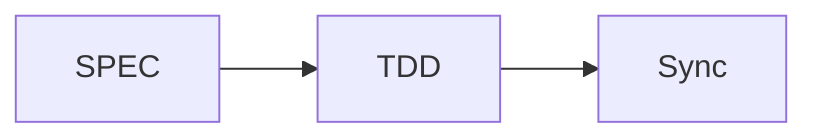

# MoAI-ADK Documentation

이 디렉토리는 MkDocs를 사용하여 구축된 MoAI-ADK 공식 문서를 포함합니다.

**Version**: v0.9.0
**Last Updated**: 2025-11-05
**Language**: 한국어, 영어, 일본어, 중국어

# @CODE:DOC-ONLINE-001:MAIN

## 🚀 빠른 시작

### 1. UV 설치 (권장)
```bash
# macOS/Linux
curl -LsSf https://astral.sh/uv/install.sh | sh

# Windows
powershell -c "irm https://astral.sh/uv/install.ps1 | iex"

# 또는 pip로 설치
pip install uv
```

### 2. 의존성 설치
```bash
uv sync
```

### 3. 개발 서버 실행
```bash
uv run dev
```

### 4. 브라우저에서 확인
[http://127.0.0.1:8080](http://127.0.0.1:8080)

## <span class="material-icons">menu_book</span> 사용 가능한 명령어

| 명령어 | 설명 |
|--------|------|
| `uv run dev` | 개발 서버 시작 |
| `uv run build` | 정적 사이트 빌드 |
| `uv run deploy` | GitHub Pages에 배포 |
| `uv run clean` | 빌드 파일 정리 |
| `uv run validate` | 엄격 모드로 빌드 및 검증 |
| `uv run preview` | 빠른 리로드로 개발 서버 시작 |
| `uv sync` | 의존성 동기화 |
| `uv lock` | Lockfile 생성 |
| `uv lock --upgrade` | 의존성 업그레이드 |

## 📁 디렉토리 구조

```
docs/
├── mkdocs.yml              # MkDocs 설정 파일
├── requirements.txt        # Python 의존성
├── package.json           # 빌드 스크립트
├── index.md               # 메인 페이지
├── getting-started/       # 시작하기 가이드
├── alfred/                # Alfred SuperAgent 문서
├── commands/              # 명령어 참조
├── development/           # 개발 가이드
├── advanced/              # 고급 기능
├── api/                   # API 참조
├── contributing/          # 기여 가이드
├── stylesheets/           # 커스템 CSS
├── javascripts/           # 커스템 JavaScript
├── assets/               # 정적 에셋
└── overrides/             # 테마 오버라이드
```

## 🎨 커스터마이징

### 테마 설정
- **Material Design**: Google Material Design 기반
- **다크 모드**: 자동/수동 테마 전환
- **다국어 지원**: 한국어, 영어, 일본어 등

### 확장 기능
- **Mermaid 다이어그램**: 워크플로우 시각화
- **코드 하이라이팅**: 50+ 프로그래밍 언어
- **검색**: 전문 검색 및 자동 완성
- **Git 통합**: 커밋 정보 및 버전 관리

## 📄 문서 작성 가이드

### 마크다드 확장
```markdown
!!! note "참고"
    중요한 정보

!!! warning "경고"
    주의가 필요한 사항

!!! tip "팁"
    유용한 팁
```

### 코드 블록
```python
def hello_world():
    print("Hello, MoAI-ADK!")
```

### Mermaid 다이어그램


## 🚀 배포

### Vercel 배포 (권장)
```bash
# 1. Vercel CLI 설치
npm i -g vercel

# 2. Vercel 로그인
vercel login

# 3. 배포
vercel --prod
```

### 자동 배포 설정
- Vercel 대시보드에서 GitHub 리포지토리 연결
- `main` 브랜치에 푸시 시 자동 배포
- 도메인: `https://adk.mo.ai.kr`

### GitHub Pages
```bash
uv run deploy
```

### 다른 호스팅
```bash
uv run build
# site/ 디렉토리를 원하는 호스팅 서비스에 업로드
```

## ⚙️ 개발

### 로컬 개발 환경
```bash
# UV 설치 (이미 설치된 경우 건너뛰기)
curl -LsSf https://astral.sh/uv/install.sh | sh

# 가상 환경 생성 및 의존성 설치
uv venv
source .venv/bin/activate  # Linux/macOS
# .venv\Scripts\activate   # Windows

# 의존성 동기화
uv sync

# 개발 서버 시작
uv run dev
```

### UV 기반 워크플로우
```bash
# 의존성 추가
uv add mkdocs-material

# 의존성 업데이트
uv lock --upgrade

# 스크립트 실행
uv run mkdocs --help

# 개발 서버 (핫 리로드)
uv run dev

# 빌드
uv run build

# 정리
uv run clean
```

### 문서 유효성 검사
```bash
mkdocs build --strict
```

## 📊 모니터링

### 빌드 통계
```bash
find site/ -name "*.html" | wc -l
```

### 사이즈 확인
```bash
du -sh site/
```

## 🐛 문제 해결

### 일반적인 문제

#### 빌드 오류
```bash
# 캐시 정리
rm -rf site/ .doit_db/

# 다시 빌드
mkdocs build
```

#### 플러그인 오류
```bash
# 플러그인 재설치
pip install --upgrade mkdocs-material
```

#### 스타일 로딩 문제
```bash
# 브라우저 캐시 정리
# 개발자 도구에서 강제 새로고침
```

## 📞 지원

- **문서**: [MoAI-ADK 공식 문서](https://moai-adk.gooslab.ai)
- **이슈**: [GitHub Issues](https://github.com/moai-adk/MoAI-ADK/issues)
- **커뮤니티**: [GitHub Discussions](https://github.com/moai-adk/MoAI-ADK/discussions)

## 📄 라이선스

이 문서는 MIT 라이선스 하에 배포됩니다.