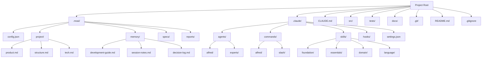

# Complete Project Initialization Guide

A detailed guide covering everything about the MoAI-ADK project initialization process. Provides comprehensive explanations from creating new projects to adding to existing projects, using various templates, and troubleshooting.

## Table of Contents

1. [Overview](#overview)
2. [Prerequisites](#prerequisites)
3. [Creating a New Project](#creating-a-new-project)
4. [Adding to Existing Projects](#adding-to-existing-projects)
5. [Detailed File Structure](#detailed-file-structure)
6. [In-Depth .moai/ Directory Analysis](#in-depth-moai-directory-analysis)
7. [In-Depth .claude/ Directory Analysis](#in-depth-claude-directory-analysis)
8. [Project Type Templates](#project-type-templates)
9. [Initialization Automation Setup](#initialization-automation-setup)
10. [Post-Initialization Verification](#post-initialization-verification)
11. [Troubleshooting](#troubleshooting)
12. [Best Practices](#best-practices)

## Overview

Project initialization in MoAI-ADK goes beyond simple file creation - it's the process of building a complete ecosystem for AI-assisted development. Through initialization, you get:

- **Alfred SuperAgent**: A team of 19 AI experts with 56 Claude Skills
- **SPEC-First TDD**: Consistent workflow from requirements → tests → code → documentation
- **@TAG System**: A traceability network connecting all artifacts
- **Automated Hooks**: Smart safeguards that don't disrupt your development flow

### Core Principles of Initialization

1. **Minimal Intervention**: Users only provide a project name
2. **Auto-Detection**: Automatically identifies language, framework, and structure
3. **Progressive Configuration**: Detailed settings collected via `/alfred:0-project`
4. **Safe Merging**: Safely integrates with existing projects

## Prerequisites

### System Requirements

| Item | Minimum Requirement | Recommended |
|------|-------------------|-------------|
| Operating System | Windows 10+, macOS 11+, Ubuntu 20.04+ | Latest LTS version |
| Python | 3.13+ | 3.13.0+ |
| Git | 2.25+ | 2.40+ |
| Memory | 4GB RAM | 8GB+ RAM |
| Storage | 1GB free space | 2GB+ free space |

### Installing Required Tools

#### 1. Installing UV (Python Package Manager)

UV is the official package manager for MoAI-ADK.

```bash
# macOS/Linux
curl -LsSf https://astral.sh/uv/install.sh | sh

# Windows (PowerShell)
powershell -c "irm https://astral.sh/uv/install.ps1 | iex"

# Verify installation
uv --version
```

#### 2. Git Installation and Configuration

```bash
# Verify installation
git --version

# Basic configuration (one-time setup)
git config --global user.name "Your Name"
git config --global user.email "email@example.com"

# Initialize Git repository (for new projects)
git init
```

#### 3. Installing MoAI-ADK

```bash
# Install via UV (recommended)
uv tool install moai-adk

# Or install via pip
pip install moai-adk

# Verify installation
moai-adk --version
```

### Optional Tools

Additional tools are recommended based on your specific development stack:

```bash
# Python projects
uv add pytest ruff mypy black

# Node.js projects
npm install --save-dev eslint prettier typescript

# Go projects
go install github.com/golangci/golangci-lint/cmd/golangci-lint@latest

# Rust projects
rustup component add clippy rustfmt
```

## Creating a New Project

### Basic Command

```bash
# Create a new project
moai-adk init <project-name>

# Example
moai-adk init my-awesome-app
cd my-awesome-app
```

### Advanced Options

```bash
# Create with a specific template
moai-adk init my-app --template web-api

# Create with a specific language
moai-adk init my-app --language python

# Create with MCP servers included
moai-adk init my-app --with-mcp

# Show detailed output
moai-adk init my-app --verbose

# Show help
moai-adk init --help
```

### Detailed Initialization Process

#### Step 1: Collecting Project Information

```bash
$ moai-adk init hello-world
🚀 Starting MoAI-ADK v0.17.0 project initialization...

📁 Creation location: /Users/username/projects/hello-world
⚙️ Template: auto-detect (default)
🌍 Language: Will be auto-detected
```

#### Step 2: Creating Directory Structure

```bash
📂 Creating directory structure...
✅ .moai/ - MoAI-ADK project configuration
✅ .claude/ - Claude Code automation
✅ src/ - Source code directory
✅ tests/ - Test directory
✅ docs/ - Documentation directory
```

#### Step 3: Creating Configuration Files

```bash
⚙️ Creating configuration files...
✅ .moai/config.json - Project configuration
✅ .moai/project/ - Project information
✅ .claude/settings.json - Claude Code settings
✅ CLAUDE.md - Project guide
```

#### Step 4: Installing Agents and Skills

```bash
🤖 Setting up AI agents...
✅ 16 Sub-agents installed successfully
✅ 74 Claude Skills loaded successfully
✅ 5 Claude Code Hooks activated
```

#### Step 5: Initialization Complete

```bash
🎉 Project initialization complete!

📋 Next steps:
1. cd hello-world
2. claude (Run Claude Code)
3. /alfred:0-project (Complete project setup)

💡 Tip: Use the moai-adk doctor command to check system status.
```

## Adding to Existing Projects

You can integrate MoAI-ADK into an ongoing project. Existing code will never be modified.

### Basic Integration

```bash
# Navigate to your existing project directory
cd your-existing-project

# Initialize MoAI-ADK
moai-adk init .

# Or explicitly specify current directory
moai-adk init . --force
```

### Pre-Integration Verification

```bash
# Check project structure
tree -L 2

# Check Git status
git status

# Backup necessary files (optional)
cp -r . /backup/your-project-$(date +%Y%m%d)
```

### Integration Process

#### Step 1: Project Analysis

```bash
<span class="material-icons">search</span> Analyzing existing project...
✅ Python project detected (found pyproject.toml)
✅ FastAPI framework detected
✅ 25 Python files already exist
<span class="material-icons">warning</span> tests/ directory found (preserving existing tests)
```

#### Step 2: Adding Minimal Files

```bash
📂 Adding MoAI-ADK files...
✅ .moai/ - Newly created
✅ .claude/ - Newly created
✅ CLAUDE.md - Newly created
<span class="material-icons">warning</span> src/, tests/, docs/ existing files preserved
```

#### Step 3: Configuration Optimization

```bash
⚙️ Optimizing settings for existing project...
✅ Language: python (detected)
✅ Framework: fastapi (detected)
✅ Test tool: pytest (preserving existing settings)
✅ Documentation format: markdown (preserving existing docs)
```

### Integration Example with Existing Project

#### Existing Structure
```
my-api/
├── app/
│   ├── main.py
│   ├── models/
│   └── routes/
├── tests/
│   ├── test_main.py
│   └── conftest.py
├── requirements.txt
├── README.md
└── .git/
```

#### Structure After Adding MoAI-ADK
```
my-api/
├── .moai/                    # ✅ Newly added
│   ├── config.json
│   ├── project/
│   ├── memory/
│   ├── specs/
│   └── reports/
├── .claude/                  # ✅ Newly added
│   ├── agents/
│   ├── commands/
│   ├── skills/
│   ├── hooks/
│   └── settings.json
├── CLAUDE.md                 # ✅ Newly added
├── app/                      # ✅ Preserved
│   ├── main.py
│   ├── models/
│   └── routes/
├── tests/                    # ✅ Preserved
│   ├── test_main.py
│   └── conftest.py
├── requirements.txt
├── README.md
└── .git/
```

## Detailed File Structure

### Overall Structure Diagram



### Core File Descriptions

#### 1. `.moai/config.json` - Project Heart

```json
{
  "version": "0.17.0",
  "moai": {
    "version": "0.17.0",
    "template_version": "0.17.0",
    "optimized": false
  },
  "language": {
    "conversation_language": "ko",
    "conversation_language_name": "한국어",
    "code_language": "python"
  },
  "project": {
    "name": "my-project",
    "description": "Project created with MoAI-ADK",
    "owner": "username",
    "mode": "personal",
    "created_at": "2025-11-06T10:00:00Z",
    "domains": ["backend"]
  },
  "github": {
    "enabled": false,
    "auto_delete_branches": true,
    "spec_git_workflow": "develop_direct"
  },
  "report_generation": {
    "enabled": false,
    "level": "minimal"
  },
  "hooks": {
    "timeout_seconds": 5
  },
  "tags": {
    "policy": "strict",
    "auto_validation": true
  },
  "constitution": {
    "trust_principles": true,
    "tdd_workflow": true,
    "spec_first": true
  }
}
```

#### 2. `.moai/project/` - Project Metadata

##### `product.md` - Product Vision
```markdown
# Product Vision

## Overview
Defines the core value and goals of the project.

## Target Users
- Definition of primary user groups
- User requirements and pain points

## Core Features
- Main features provided by the product
- Differentiated value proposition

## Success Metrics
- KPIs for measuring product success
- Short-term and long-term goals
```

##### `structure.md` - Project Structure
```markdown
# Project Structure

## Directory Structure
```
src/
├── core/           # Core business logic
├── api/            # API endpoints
├── models/         # Data models
├── services/       # Service layer
└── utils/          # Utility functions
```

## Architecture Patterns
- Architectural patterns used (MVC, Clean Architecture, etc.)
- Responsibilities and interactions by layer

## Data Flow
- Description of main data flows
- Integration methods with external systems
```

##### `tech.md` - Technology Stack
```markdown
# Technology Stack

## Core Technologies
- **Language**: Python 3.13
- **Framework**: FastAPI
- **Database**: PostgreSQL
- **Testing**: pytest

## Development Tools
- **Package Management**: uv
- **Code Formatting**: black, ruff
- **Type Checking**: mypy
- **Documentation**: Sphinx

## Infrastructure
- **Deployment**: Docker
- **CI/CD**: GitHub Actions
- **Monitoring**: Prometheus + Grafana
```

#### 3. `.claude/settings.json` - Claude Code Configuration

```json
{
  "models": {
    "default": "claude-3-5-sonnet-20241022",
    "fast": "claude-3-5-haiku-20241022"
  },
  "permissions": {
    "allow": [
      "Read(*)",
      "Write(src/*, tests/*, docs/*, .moai/*)",
      "Bash(git status, git log, git diff, pytest, python, uv)",
      "Grep(*), Glob(*), Edit(*), Bash(*, cd, ls, mkdir, echo)"
    ],
    "ask": [
      "Bash(git push, git merge, rm -rf)",
      "Write(.claude/*, .moai/config.json)"
    ],
    "deny": [
      "Bash(sudo, rm -rf /, dd)",
      "Write(*.key, *.pem, .env)"
    ]
  },
  "hooks": {
    "SessionStart": ["alfred-hooks"],
    "PreToolUse": ["alfred-hooks"],
    "UserPromptSubmit": ["alfred-hooks"],
    "PostToolUse": ["alfred-hooks"],
    "SessionEnd": ["alfred-hooks"]
  },
  "environment": {
    "PYTHONPATH": "${CLAUDE_PROJECT_DIR}/src",
    "MOAI_PROJECT_ROOT": "${CLAUDE_PROJECT_DIR}"
  }
}
```

## In-Depth .moai/ Directory Analysis

### Directory Structure and Roles

```
.moai/
├── config.json              # Project configuration file
├── project/                 # Project documents
│   ├── product.md           # Product vision and goals
│   ├── structure.md         # Project structure description
│   └── tech.md              # Technology stack specifications
├── memory/                  # Alfred's memory storage
│   ├── development-guide.md # Development guide
│   ├── session-notes.md     # Session notes
│   ├── decision-log.md      # Decision log
│   ├── user-preferences.md  # User preferences
│   ├── project-context.md   # Project context
│   ├── learning-history.md  # Learning history
│   └── expertise-profile.md # Expertise profile
├── specs/                   # SPEC document repository
│   └── SPEC-XXX-XXX/
│       ├── spec.md          # Main SPEC document
│       ├── plan.md          # Implementation plan
│       ├── acceptance.md    # Acceptance criteria
│       └── history.md       # Change history
└── reports/                 # Analysis reports
    ├── sync-report-*.md     # Sync reports
    ├── quality-report-*.md  # Quality reports
    └── analysis-*.md        # Analysis reports
```

### memory/ Directory Details

#### `development-guide.md`
Stores development patterns and best practices learned by Alfred.

```markdown
# Development Guide

## Code Style
- Functions should be within 50 lines
- Use clear variable names
- Use type hints

## Test Patterns
- AAA pattern (Arrange, Act, Assert)
- Use clear test names
- Edge case testing is mandatory

## Git Commit Messages
- feat: New feature
- fix: Bug fix
- refactor: Refactoring
- test: Test-related
```

#### `session-notes.md`
Records important discoveries and decisions during development sessions.

```markdown
# Session Notes

## 2025-11-06 Session
### Main Activities
- Implemented user authentication API (AUTH-001)
- Achieved 92% test coverage

### Findings
- FastAPI's dependency injection is beneficial for testing
- JWT token expiration handling needs improvement

### Next Steps
- Implement refresh token
- Security enhancement measures
```

### specs/ Directory Details

SPEC documents are the core of MoAI-ADK. All development starts from SPECs.

#### SPEC Document Structure
```
.moai/specs/SPEC-AUTH-001/
├── spec.md              # Main SPEC document
├── plan.md              # Implementation plan
├── acceptance.md        # Acceptance criteria
├── history.md           # Change history
└── reviews/             # Review records
    ├── review-1.md
    └── review-2.md
```

#### `spec.md` Example
```yaml
---
id: AUTH-001
version: 1.0.0
status: completed
priority: high
created: 2025-11-06T10:00:00Z
updated: 2025-11-06T15:30:00Z
author: Alfred
reviewer: username
---

# `@SPEC:AUTH-001: User Authentication System

## Overview
Implement JWT-based system for user authentication

## Ubiquitous Requirements (Basic Requirements)
- The system must provide JWT-based authentication
- Users must be able to log in with email and password
- Authenticated users must be able to access protected resources

## Event-driven Requirements (Conditional Requirements)
- WHEN valid credentials are provided, the system must issue a JWT token
- WHEN an expired token is provided, the system must return a 401 error
- WHILE a user is authenticated, the system must allow access to protected resources

## Optional Requirements
- WHERE a refresh token exists, the system may issue a new access token
- WHERE social login is configured, users may authenticate with social accounts

## Unwanted Behaviors (Prohibited Actions)
- The system must not store passwords in plain text
- The system must not allow resource access with invalid tokens
- The system must not allow login without rate limiting

## Constraints
- Passwords must be at least 8 characters and at most 128 characters
- JWT token expiration time must not exceed 15 minutes
- Login attempts must be limited to 5 per minute
```

## In-Depth .claude/ Directory Analysis

### Directory Structure and Roles

```
.claude/
├── agents/                  # Sub-agent definitions
│   ├── alfred/              # Alfred core agents
│   │   ├── project-manager.md
│   │   ├── spec-builder.md
│   │   ├── code-builder.md
│   │   ├── doc-syncer.md
│   │   ├── tag-agent.md
│   │   ├── git-manager.md
│   │   ├── debug-helper.md
│   │   ├── trust-checker.md
│   │   ├── quality-gate.md
│   │   └── cc-manager.md
│   └── experts/             # Domain expert agents
│       ├── backend-expert.md
│       ├── frontend-expert.md
│       ├── ui-ux-expert.md
│       ├── devops-expert.md
│       └── security-expert.md
├── commands/                # Slash command definitions
│   ├── alfred/              # Alfred commands
│   │   ├── 0-project.md
│   │   ├── 1-plan.md
│   │   ├── 2-run.md
│   │   ├── 3-sync.md
│   │   └── 9-feedback.md
│   └── slash/               # General slash commands
│       ├── help.md
│       ├── status.md
│       └── debug.md
├── skills/                  # Claude Skills
│   ├── foundation/          # Foundation skills
│   │   ├── trust.md
│   │   ├── tags.md
│   │   ├── specs.md
│   │   ├── ears.md
│   │   ├── git.md
│   │   └── langs.md
│   ├── essentials/          # Essential skills
│   │   ├── debug.md
│   │   ├── perf.md
│   │   ├── refactor.md
│   │   └── review.md
│   ├── alfred/              # Alfred-specific skills
│   │   ├── workflow.md
│   │   ├── language-detection.md
│   │   ├── spec-validation.md
│   │   └── ask-user-questions.md
│   ├── domain/              # Domain skills
│   │   ├── backend.md
│   │   ├── frontend.md
│   │   ├── database.md
│   │   ├── security.md
│   │   ├── devops.md
│   │   └── mobile-app.md
│   └── language/            # Language skills
│       ├── python.md
│       ├── typescript.md
│       ├── javascript.md
│       ├── go.md
│       ├── rust.md
│       └── sql.md
├── hooks/                   # Claude Code Hooks
│   └── alfred/
│       ├── alfred_hooks.py  # Main Hook script
│       ├── core/
│       │   ├── checkpoint.py
│       │   ├── risk_detector.py
│       │   ├── tag_guard.py
│       │   └── session_manager.py
│       └── utils/
│           ├── file_utils.py
│           └── git_utils.py
├── settings.json            # Claude Code configuration
└── mcp.json                 # MCP server configuration (optional)
```

### agents/ Directory Details

#### Alfred Core Agents

##### `project-manager.md`
```markdown
# Project Manager Agent

## Role
Responsible for project initialization and metadata management.

## Main Functions
- Collect project settings
- Detect language and framework
- Recommend appropriate Skill Packs
- Design project structure

## Activation Conditions
- `/alfred:0-project` command execution
- New project initialization needed

## Model Used
- Default: Claude 3.5 Sonnet
- Simple tasks: Claude 3.5 Haiku
```

##### `spec-builder.md`
```markdown
# Spec Builder Agent

## Role
Creates clear SPEC documents in EARS format.

## Main Functions
- Requirement analysis and structuring
- Apply EARS patterns
- Generate Plan Board
- Define acceptance criteria

## Activation Conditions
- `/alfred:1-plan` command execution
- SPEC creation needed

## Expertise
- EARS (Easy Approach to Requirements Syntax)
- Requirements engineering
- System design
```

### commands/ Directory Details

#### Alfred Command Structure

##### `0-project.md` - Project Initialization
```markdown
# /alfred:0-project

## Description
Command for managing project initialization and configuration.

## Usage
```bash
/alfred:0-project                    # Auto-detection mode
/alfred:0-project setting           # Configuration modification mode
/alfred:0-project update            # Template optimization mode
```

## Step-by-Step Process
1. Analyze project status
2. Collect user information (if needed)
3. Apply appropriate settings
4. Deploy Skill Packs
5. Initialization report

## Expected Results
- Fully configured `.moai/config.json`
- 5 project documents generated
- Recommended Skill Packs loaded
```

### skills/ Directory Details

#### Foundation Skills

##### `trust.md` - TRUST 5 Principles
```markdown
# TRUST 5 Principles Skill

## Description
All code must satisfy the TRUST 5 principles.

## Principles
1. **Test First**: Tests must be written first
2. **Readable**: Code must be easy to read
3. **Unified**: Must maintain consistent structure
4. **Secured**: Must consider security
5. **Trackable**: Must be traceable

## Verification Criteria
- Test coverage ≥ 85%
- Functions ≤ 50 lines
- Consistent naming conventions
- Input validation
- Use @TAG system

## Application Methods
- Automatic verification during code review
- Check when `/alfred:3-sync` is executed
- Pull Request requirements
```

### hooks/ Directory Details

#### Hook Architecture

```python
# alfred_hooks.py
import os
import sys
import json
from pathlib import Path

def main():
    """Main Hook entry point"""
    hook_name = os.environ.get('CLAUDE_HOOK_NAME')
    project_dir = os.environ.get('CLAUDE_PROJECT_DIR')

    if hook_name == 'SessionStart':
        session_start(project_dir)
    elif hook_name == 'PreToolUse':
        pre_tool_use(project_dir)
    # ... other Hooks

def session_start(project_dir: str):
    """Summarize project status at session start"""
    config_path = Path(project_dir) / '.moai' / 'config.json'

    if config_path.exists():
        with open(config_path) as f:
            config = json.load(f)

        print(f"📋 Project: {config['project']['name']}")
        print(f"🌍 Language: {config['language']['conversation_language_name']}")
        print(f"🤖 Alfred ready")
```

## Project Type Templates

MoAI-ADK provides templates tailored to various project types.

### 1. Web API Template

```bash
moai-adk init my-api --template web-api
```

#### Features
- FastAPI/Express/NestJS basic structure
- RESTful API guidelines
- Automated API documentation setup
- JWT authentication basic structure

#### Generated Structure
```
my-api/
├── src/
│   ├── api/
│   │   ├── __init__.py
│   │   ├── dependencies.py
│   │   └── middleware.py
│   ├── models/
│   │   ├── __init__.py
│   │   └── base.py
│   ├── schemas/
│   │   ├── __init__.py
│   │   └── common.py
│   └── main.py
├── tests/
│   ├── api/
│   └── conftest.py
├── docs/
│   └── api/
└── .moai/specs/SPEC-API-001/
```

### 2. CLI Tool Template

```bash
moai-adk init my-cli --template cli-tool
```

#### Features
- Click/argparse basic structure
- Command-line interface guide
- Configuration file handling
- Logging system

#### Generated Structure
```
my-cli/
├── src/
│   ├── my_cli/
│   │   ├── __init__.py
│   │   ├── main.py
│   │   ├── commands/
│   │   └── config/
│   └── my_cli.py
├── tests/
│   └── unit/
├── docs/
│   └── usage/
└── .moai/specs/SPEC-CLI-001/
```

### 3. Data Analysis Template

```bash
moai-adk init my-analysis --template data-science
```

#### Features
- Jupyter Notebook basic structure
- pandas/numpy configuration
- Data visualization setup
- Experiment tracking system

#### Generated Structure
```
my-analysis/
├── notebooks/
│   ├── 01-exploration.ipynb
│   └── 02-analysis.ipynb
├── src/
│   ├── data/
│   │   ├── __init__.py
│   │   ├── loading.py
│   │   └── cleaning.py
│   └── analysis/
│       ├── __init__.py
│       └── statistics.py
├── data/
│   ├── raw/
│   └── processed/
├── tests/
└── .moai/specs/SPEC-DATA-001/
```

### 4. Mobile App Template

```bash
moai-adk init my-app --template mobile-app
```

#### Features
- Flutter/React Native basic structure
- State management setup
- API communication layer
- Testing environment

#### Generated Structure
```
my-app/
├── lib/
│   ├── main.dart
│   ├── app/
│   │   ├── screens/
│   │   ├── widgets/
│   │   └── services/
│   └── core/
│       ├── constants.dart
│       └── themes.dart
├── test/
├── integration_test/
├── docs/
└── .moai/specs/SPEC-MOBILE-001/
```

### 5. Machine Learning Template

```bash
moai-adk init my-ml --template ml-project
```

#### Features
- Model training/inference structure
- Data pipeline
- Experiment management (MLflow)
- Model serving API

#### Generated Structure
```
my-ml/
├── src/
│   ├── models/
│   │   ├── __init__.py
│   │   ├── base.py
│   │   └── training.py
│   ├── data/
│   │   ├── __init__.py
│   │   ├── preprocessing.py
│   │   └── loading.py
│   └── inference/
│       ├── __init__.py
│       └── predict.py
├── experiments/
├── models/
├── data/
├── tests/
└── .moai/specs/SPEC-ML-001/
```

### Template Selection Guide

| Project Type | Recommended Template | Key Features | Suitable Situations |
|--------------|---------------------|--------------|-------------------|
| Web Backend | `web-api` | REST API, database integration | API server, microservices |
| Command-line Tool | `cli-tool` | CLI interface, config management | Development tools, utilities |
| Data Analysis | `data-science` | Jupyter, pandas, visualization | Research projects, analysis |
| Mobile App | `mobile-app` | Flutter/React Native | iOS/Android apps |
| Machine Learning | `ml-project` | Model training, experiment management | ML projects, research |
| General | `default` | General-purpose structure | Other projects |

## Initialization Automation Setup

### Environment Variable Configuration

You can set default values via environment variables during MoAI-ADK initialization.

```bash
# Basic settings
export MOAI_DEFAULT_LANGUAGE="ko"
export MOAI_DEFAULT_OWNER="username"
export MOAI_DEFAULT_MODE="personal"

# GitHub integration
export MOAI_GITHUB_ENABLED="true"
export MOAI_GITHUB_AUTO_DELETE_BRANCHES="true"

# Report settings
export MOAI_REPORT_GENERATION="minimal"

# Hook settings
export MOAI_HOOK_TIMEOUT="5"
```

### Initialization Script

Example script for automating repetitive initialization:

```bash
#!/bin/bash
# init-moai-project.sh

set -e

# Check arguments
if [ $# -eq 0 ]; then
    echo "Usage: $0 <project-name> [template]"
    exit 1
fi

PROJECT_NAME=$1
TEMPLATE=${2:-"default"}

# Set environment variables
export MOAI_DEFAULT_LANGUAGE="ko"
export MOAI_DEFAULT_OWNER="$(git config user.name)"
export MOAI_GITHUB_ENABLED="true"

# Create project
echo "🚀 Creating MoAI-ADK project: $PROJECT_NAME"
moai-adk init "$PROJECT_NAME" --template "$TEMPLATE"

# Navigate to project directory
cd "$PROJECT_NAME"

# Initialize Git
echo "📦 Initializing Git repository"
git init
git add .
git commit -m "🎉 Initial commit with MoAI-ADK"

# Setup virtual environment (for Python projects)
if [ "$TEMPLATE" = "web-api" ] || [ "$TEMPLATE" = "default" ]; then
    echo "🐍 Setting up Python virtual environment"
    uv venv
    source .venv/bin/activate
    uv add pytest ruff mypy
fi

# Guidance message
echo "✅ Project '$PROJECT_NAME' created successfully!"
echo "📋 Next steps:"
echo "   1. cd $PROJECT_NAME"
echo "   2. claude"
echo "   3. /alfred:0-project"
```

### Docker Integration Initialization

```bash
#!/bin/bash
# init-with-docker.sh

PROJECT_NAME=$1
TEMPLATE=${2:-"web-api"}

# Create project
moai-adk init "$PROJECT_NAME" --template "$TEMPLATE"

cd "$PROJECT_NAME"

# Generate Dockerfile
cat > Dockerfile << 'EOF'
FROM python:3.13-slim

WORKDIR /app

COPY requirements.txt .
RUN pip install -r requirements.txt

COPY src/ ./src/
COPY tests/ ./tests/

EXPOSE 8000

CMD ["uvicorn", "src.main:app", "--host", "0.0.0.0", "--port", "8000"]
EOF

# Generate docker-compose.yml
cat > docker-compose.yml << 'EOF'
version: '3.8'

services:
  app:
    build: .
    ports:
      - "8000:8000"
    environment:
      - DATABASE_URL=postgresql://user:pass@db:5432/mydb
    depends_on:
      - db

  db:
    image: postgres:15
    environment:
      - POSTGRES_DB=mydb
      - POSTGRES_PASSWORD=pass
    volumes:
      - postgres_data:/var/lib/postgresql/data

volumes:
  postgres_data:
EOF

echo "🐳 Docker configuration added"
```

## Post-Initialization Verification

### System Diagnosis

```bash
# Basic diagnosis
moai-adk doctor

# Detailed diagnosis
moai-adk doctor --verbose

# Check specific items
moai-adk doctor --check python,git,uv
```

#### Diagnosis Items Details

1. **Python Environment**
   - Version check (3.13+)
   - Virtual environment status
   - PATH configuration

2. **Git Configuration**
   - Version check
   - User configuration
   - Repository status

3. **MoAI-ADK Structure**
   - .moai/ directory
   - .claude/ directory
   - Configuration file integrity

4. **Dependencies**
   - uv installation status
   - Required packages
   - Optional tools

### File Structure Verification

```bash
# Check overall structure
tree -L 3

# Check core files
ls -la .moai/config.json
ls -la .claude/settings.json
ls -la CLAUDE.md

# Check agents
find .claude/agents -name "*.md" | wc -l
# Expected output: 16

# Check skills
find .claude/skills -name "*.md" | wc -l
# Expected output: 74
```

### Configuration File Verification

```bash
# Check config.json syntax
python3 -c "import json; json.load(open('.moai/config.json'))"

# Check CLAUDE.md content
head -20 CLAUDE.md

# Check Hook configuration
python3 -c "import json; json.load(open('.claude/settings.json'))"
```

### Alfred Functionality Test

```bash
# Run Claude Code
claude

# Test Alfred
/alfred:0-project

# Check command list
/help

# Check session info
/alfred:session-info
```

### Sample SPEC Generation Test

```bash
# Simple SPEC generation test
/alfred:1-plan "Simple Hello World API"

# Check generated SPEC
ls -la .moai/specs/
cat .moai/specs/SPEC-HELLO-001/spec.md
```

## Troubleshooting

### Common Initialization Issues

#### 1. Permission Errors

**Symptom**:
```
Permission denied: .moai/config.json
```

**Cause**: File system permission issue

**Solution**:
```bash
# Check owner
ls -la

# Modify permissions
chmod 755 .
chmod 644 .moai/config.json

# Or use sudo (not recommended)
sudo moai-adk init my-project
```

#### 2. Path Errors

**Symptom**:
```
Error: Directory already exists and is not empty
```

**Cause**: Target directory is not empty

**Solution**:
```bash
# Method 1: Create empty directory
mkdir new-project
cd new-project
moai-adk init .

# Method 2: Add to existing project
moai-adk init . --force

# Method 3: Use different name
moai-adk init my-project-v2
```

#### 3. Network Errors

**Symptom**:
```
Error: Failed to download template
```

**Cause**: Internet connection or PyPI access issue

**Solution**:
```bash
# Check network
ping pypi.org

# Set proxy (if needed)
export https_proxy=http://proxy.company.com:8080
export http_proxy=http://proxy.company.com:8080

# Offline mode (local template)
moai-adk init my-project --offline
```

#### 4. Version Compatibility Issues

**Symptom**:
```
Error: Python 3.11 found, but 3.13+ required
```

**Cause**: Python version compatibility issue

**Solution**:
```bash
# Manage Python version with pyenv
pyenv install 3.13.0
pyenv local 3.13.0

# Or automatic Python management with uv
uv python install 3.13
uv python pin 3.13

# Verify
python --version
```

### Recovery Procedures

#### Recovery from Failed Initialization

```bash
#!/bin/bash
# recover-init.sh

PROJECT_NAME=$1

# Clean up failed directory
echo "🧹 Cleaning up failed initialization..."
rm -rf "$PROJECT_NAME"

# Check system state
echo "<span class="material-icons">search</span> Checking system state..."
moai-adk doctor

# Retry
echo "🔄 Retrying initialization..."
moai-adk init "$PROJECT_NAME"

# Verify
echo "✅ Verifying initialization..."
cd "$PROJECT_NAME"
moai-adk doctor
```

#### Restore Corrupted Configuration Files

```bash
# Check config file backup
ls -la .moai/backups/

# Restore from backup
cp .moai/backups/config.json.backup .moai/config.json

# Or regenerate
moai-adk init . --restore-config
```

### Log Analysis

#### Check Initialization Logs

```bash
# MoAI-ADK log location
ls -la ~/.moai/logs/

# Check latest log
tail -f ~/.moai/logs/latest.log

# Filter error logs
grep "ERROR" ~/.moai/logs/latest.log
```

#### Check Claude Code Logs

```bash
# Claude Code log location
ls -la ~/.claude/logs/

# Check session logs
cat ~/.claude/projects/*/session-*.log | tail -20
```

## Best Practices

### Project Naming Conventions

```bash
# Good examples
moai-adk init user-auth-service
moai-adk init data-analytics-platform
moai-adk init mobile-shopping-app
moai-adk init cli-deployment-tool

# Examples to avoid
moai-adk init project1
moai-adk init test
moai-adk init temp
moai-adk init my-app-v2.0.1-beta
```

### Directory Structure Best Practices

#### Successful Project Structure
```
awesome-api/
├── .moai/                   # ✅ Clear MoAI-ADK configuration
├── .claude/                 # ✅ Claude Code automation
├── src/                     # ✅ Logical source code separation
│   ├── core/               # ✅ Core business logic
│   ├── api/                # ✅ API layer
│   ├── models/             # ✅ Data models
│   └── services/           # ✅ Service layer
├── tests/                   # ✅ Separate test code
│   ├── unit/               # ✅ Unit tests
│   ├── integration/        # ✅ Integration tests
│   └── e2e/                # ✅ End-to-end tests
├── docs/                    # ✅ Documentation
├── scripts/                 # ✅ Utility scripts
├── docker/                  # ✅ Docker configuration
└── README.md                # ✅ Project description
```

### Initialization Checklist

#### Pre-Check
- [ ] Python 3.13+ installed
- [ ] uv installed
- [ ] Git configured
- [ ] MoAI-ADK latest version installed
- [ ] Sufficient disk space available
- [ ] Stable network connection

#### During Initialization
- [ ] Appropriate project name selected
- [ ] Correct template selected
- [ ] Recommended tools installation confirmed
- [ ] Generated file structure understood

#### Post-Initialization
- [ ] Run `moai-adk doctor`
- [ ] Initialize Git repository
- [ ] Create first commit
- [ ] Run `/alfred:0-project`
- [ ] Test sample SPEC generation

### Team Collaboration Best Practices

#### Team Standards Setup

```bash
# Team standards setup script
#!/bin/bash
# setup-team-standards.sh

# Team common settings
export MOAI_DEFAULT_LANGUAGE="ko"
export MOAI_DEFAULT_OWNER="$(git config user.name)"
export MOAI_GITHUB_ENABLED="true"
export MOAI_REPORT_GENERATION="enable"

# Team standard templates
TEAM_TEMPLATES=("web-api" "cli-tool" "data-science")

for template in "${TEAM_TEMPLATES[@]}"; do
    echo "📦 Setting up template: $template"
    moai-adk init "example-$template" --template "$template"
    cd "example-$template"

    # Apply team standard settings
    /alfred:0-project

    # Documentation
    echo "<span class="material-icons">menu_book</span> Team standard setup for $template" > TEAM_SETUP.md

    cd ..
done
```

#### Documentation Standards

```markdown
# Team Project Initialization Guide

## 1. Project Creation
```bash
moai-adk init project-name --template web-api
```

## 2. Initial Setup
- Run `/alfred:0-project`
- Apply team settings
- GitHub integration

## 3. First Feature Development
- Write SPEC with `/alfred:1-plan`
- TDD implementation with `/alfred:2-run`
- Document sync with `/alfred:3-sync`

## 4. Code Review
- Check TAG chain when creating PR
- Verify TRUST 5 principles
- Pass automated quality checks
```

---
