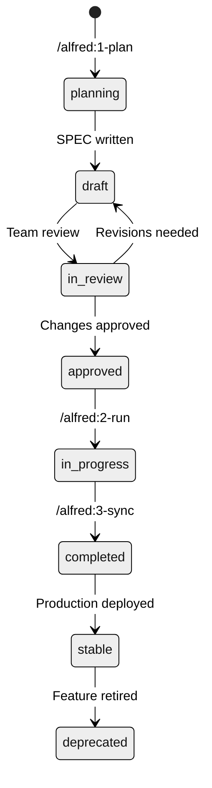

# Phase 1: Plan - Specification Creation

The `/alfred:1-plan` command transforms your ideas into clear, executable specifications using the EARS (Easy Approach to Requirements Syntax) format. This phase is critical for ensuring everyone understands exactly what needs to be built.

## Overview

**Purpose**: Create comprehensive specifications that serve as the foundation for implementation, testing, and documentation.

**Command Format**:
```bash
/alfred:1-plan "Brief description of what you want to build"
```

**Typical Duration**: 2-5 minutes
**Output**: Professional specification document with unique ID

## Alfred's Planning Process

### Step 1: Requirement Analysis

When you invoke `/alfred:1-plan`, Alfred's **spec-builder** analyzes your input through multiple lenses:

1. **Natural Language Processing**
   - Extract key requirements from your description
   - Identify entities, actions, and constraints
   - Detect implied requirements and edge cases

2. **Domain Classification**
   - Categorize the request (API, UI, database, etc.)
   - Identify relevant domain experts to consult
   - Determine complexity and scope

3. **Scope Definition**
   - Define what's in scope vs. out of scope
   - Estimate implementation complexity
   - Identify dependencies and prerequisites

### Step 2: SPEC Generation

Alfred automatically generates a complete specification with these components:

#### YAML Frontmatter
```yaml
---
id: AUTH-001
version: 0.1.0
status: draft
priority: high
created: 2025-01-15
updated: 2025-01-15
author: @developer
domain: authentication
complexity: medium
estimated_hours: 8
dependencies: []
tags: [api, security, jwt]
---
```

#### EARS Requirements

Alfred structures requirements using the 5 EARS patterns:

1. **Ubiquitous Requirements** (Basic functionality)
2. **Event-driven Requirements** (Conditional behavior)
3. **State-driven Requirements** (State-based behavior)
4. **Optional Requirements** (Nice-to-have features)
5. **Unwanted Behaviors** (Constraints and limitations)

#### Implementation Plan
- Architecture recommendations
- Technology stack suggestions
- Risk assessment
- Testing strategy

### Step 3: Expert Consultation

Based on domain classification, Alfred automatically consults relevant expert agents:

**Backend Keywords** (`api`, `server`, `database`):
```bash
# Triggers backend-expert
/alfred:1-plan "REST API for user management with PostgreSQL database"
```

**Frontend Keywords** (`ui`, `component`, `page`):
```bash
# Triggers frontend-expert
/alfred:1-plan "User dashboard with profile management interface"
```

**Security Keywords** (`auth`, `security`, `encryption`):
```bash
# Triggers security-expert
/alfred:1-plan "Secure authentication system with MFA support"
```

Each expert provides:
- **Architecture recommendations**
- **Technology suggestions**
- **Risk analysis**
- **Best practices**

### Step 4: Document Generation

Alfred creates a complete specification package:

```
.moai/specs/SPEC-AUTH-001/
├── spec.md              # Main specification document
├── plan.md              # Implementation plan
├── acceptance.md        # Acceptance criteria checklist
└── risks.md             # Risk assessment and mitigation
```

## Writing Effective Plan Requests

### Good Plan Requests

**Specific and Clear**:
```bash
/alfred:1-plan "REST API for user authentication with JWT tokens, email/password login, and refresh token support"
```

**Includes Context**:
```bash
/alfred:1-plan "Add password reset functionality to existing authentication system using email verification codes"
```

**Specifies Constraints**:
```bash
/alfred:1-plan "File upload API supporting images up to 10MB, with virus scanning and S3 storage"
```

### Poor Plan Requests

**Too Vague**:
```bash
# <span class="material-icons">cancel</span> Too general
/alfred:1-plan "Make a login system"
```

**Multiple Features**:
```bash
# <span class="material-icons">cancel</span> Combine multiple ideas
/alfred:1-plan "Login, registration, profile, and admin dashboard"
```

**Missing Context**:
```bash
# <span class="material-icons">cancel</span> No details about requirements
/alfred:1-plan "API endpoint"
```

## SPEC Structure and Components

### Complete SPEC Example

```markdown
---
id: AUTH-001
version: 0.1.0
status: draft
priority: high
created: 2025-01-15
updated: 2025-01-15
author: @developer
domain: authentication
complexity: medium
estimated_hours: 8
dependencies: []
tags: [api, security, jwt]
---

# @SPEC:EX-AUTH-001: User Authentication System

## Overview
Provide secure user authentication using email/password credentials with JWT token-based session management.

## Ubiquitous Requirements
- The system SHALL provide user authentication via email and password
- The system SHALL issue JWT tokens for authenticated sessions
- The system SHALL support token refresh for extended sessions
- The system SHALL validate user credentials before token issuance

## Event-driven Requirements
- WHEN valid email and password are provided, the system SHALL issue an access token and refresh token
- WHEN invalid credentials are provided, the system SHALL return a 401 error with appropriate message
- WHEN a valid refresh token is provided, the system SHALL issue a new access token
- WHEN an expired refresh token is provided, the system SHALL return a 401 error
- WHEN multiple failed login attempts occur, the system SHALL implement rate limiting

## State-driven Requirements
- WHILE a user is authenticated with a valid access token, the system SHALL allow access to protected resources
- WHILE a refresh token is valid, the system SHALL allow token renewal without re-authentication
- WHILE an account is locked due to security concerns, the system SHALL reject all authentication attempts

## Optional Requirements
- WHERE multi-factor authentication is enabled, the system SHALL require additional verification
- WHERE social login providers are configured, the system SHALL support OAuth authentication
- WHERE device fingerprinting is enabled, the system SHALL track login sessions by device

## Unwanted Behaviors
- The system SHALL NOT store passwords in plain text
- The system SHALL NOT reveal whether an email address is registered
- The system SHALL NOT accept weak passwords
- The system SHALL NOT allow token reuse after logout
- Password SHALL NOT be less than 8 characters
- Login attempts SHALL NOT exceed 5 per minute per IP address

## Technical Requirements

### API Endpoints
- `POST /auth/login` - Authenticate user and issue tokens
- `POST /auth/refresh` - Refresh access token
- `POST /auth/logout` - Invalidate tokens
- `GET /auth/me` - Get current user info

### Security Requirements
- Passwords SHALL be hashed using bcrypt with minimum 12 rounds
- JWT tokens SHALL use RS256 signing algorithm
- Access tokens SHALL expire after 15 minutes
- Refresh tokens SHALL expire after 7 days
- All endpoints SHALL use HTTPS only

### Performance Requirements
- Login response time SHALL be under 500ms
- System SHALL support 1000 concurrent authentication requests
- Token validation SHALL be under 100ms

## Acceptance Criteria
- [ ] Users can authenticate with valid credentials
- [ ] Invalid credentials return appropriate errors
- [ ] Tokens can be refreshed before expiration
- [ ] Password security requirements are enforced
- [ ] Rate limiting prevents brute force attacks
- [ ] All API endpoints are documented
- [ ] Security headers are properly configured
- [ ] Error handling covers all edge cases

## Dependencies
- User management system (USER-001)
- Email service for notifications (EMAIL-001)
- Rate limiting service (RATE-001)

## Risk Assessment
- **High**: Token leakage could compromise user accounts
- **Medium**: Brute force attacks on login endpoint
- **Low**: Token replay attacks

## Implementation Notes
@EXPERT:BACKEND - Consider using Redis for token blacklist
@EXPERT:SECURITY - Implement device fingerprinting for enhanced security
@EXPERT:DEVOPS - Set up log monitoring for authentication events
```

## Status Transitions

SPEC documents follow a clear lifecycle:



### Status Definitions

- **`planning`**: Initial state during SPEC creation
- **`draft`**: SPEC written, ready for review
- **`in_review`**: Undergoing team review and feedback
- **`approved`**: Approved for implementation
- **`in_progress`**: Currently being implemented
- **`completed`**: Implementation complete, documentation synced
- **`stable`**: Running in production
- **`deprecated`**: Feature retired or replaced

## Best Practices

### SPEC Writing Guidelines

1. **Be Specific**: Use concrete, measurable requirements
2. **Think in Scenarios**: Consider all use cases and edge cases
3. **Define Constraints**: Clearly state what the system should NOT do
4. **Include Acceptance Criteria**: Make success conditions testable
5. **Consider Dependencies**: Identify related components and requirements

### EARS Pattern Usage

**Use Ubiquitous for**:
- Core functionality
- Basic requirements
- Essential features

**Use Event-driven for**:
- Conditional behavior
- User interactions
- System responses

**Use State-driven for**:
- Authentication states
- User permissions
- System modes

**Use Optional for**:
- Nice-to-have features
- Future enhancements
- Conditional functionality

**Use Unwanted Behaviors for**:
- Security constraints
- Performance limits
- Business rules
- Error conditions

### Expert Consultation

To get the most from expert consultations:

1. **Use Domain Keywords**: Include terms that trigger relevant experts
2. **Provide Context**: Mention existing systems or constraints
3. **Specify Non-Functional Requirements**: Include performance, security, scalability
4. **Consider Integration**: How does this feature interact with existing code?

## Common Examples

### API Endpoint

```bash
/alfred:1-plan "REST API endpoint for creating user profiles with validation, image upload, and database persistence"
```

### UI Component

```bash
/alfred:1-plan "User registration form with email validation, password strength indicator, and accessibility compliance"
```

### Database Schema

```bash
/alfred:1-plan "Database schema for user accounts with audit logging, soft deletes, and GDPR compliance"
```

### Integration Feature

```bash
/alfred:1-plan "Payment processing integration with Stripe, webhooks, and refund management"
```

## Troubleshooting

### Common Issues

**SPEC creation fails**:
- Check network connection
- Verify `.moai/` directory exists
- Run `moai-adk doctor`

**Vague requirements**:
- Be more specific in your request
- Include constraints and requirements
- Consider edge cases

**Missing expert consultation**:
- Include domain-specific keywords
- Specify technical requirements
- Mention integration points

### Getting Help

```bash
# Check system status
moai-adk doctor

# Get help with SPEC writing
/alfred:1-plan "Help me write a SPEC for [feature]"

# Report issues
/alfred:9-feedback
```

## Next Steps

After creating your SPEC:

1. **Review the SPEC**: Ensure all requirements are captured
2. **Team Review**: Share with team members for feedback (if applicable)
3. **Implementation**: Begin TDD with `/alfred:2-run SPEC-ID`
4. **Documentation**: Let Alfred sync docs with `/alfred:3-sync`

Remember: A well-written SPEC is the foundation of successful software development. Take the time to get it right, and the rest of the development process will flow smoothly! <span class="material-icons">target</span>