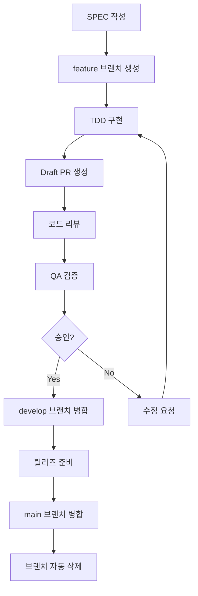
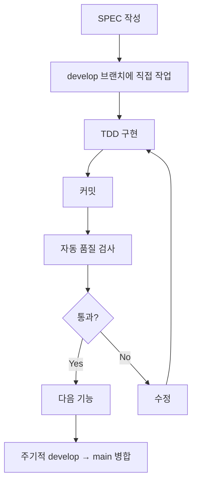

# 프로젝트 설정 완전 가이드

MoAI-ADK 프로젝트의 모든 설정 옵션을 상세하게 설명하는 가이드입니다. 언어 설정부터 GitHub 통합, 에이전트 최적화, 개인화 설정까지 프로젝트 설정의 모든 측면을 다룹니다.

## 목차

1. [개요](#개요)
2. [핵심 설정 파일](#핵심-설정-파일)
3. [언어 및 지역화 설정](#언어-및-지역화-설정)
4. [프로젝트 메타데이터 설정](#프로젝트-메타데이터-설정)
5. [GitHub 통합 설정](#github-통합-설정)
6. [보고서 생성 제어](#보고서-생성-제어)
7. [Git 워크플로우 설정](#git-워크플로우-설정)
8. [Hook 설정 최적화](#hook-설정-최적화)
9. [에이전트 설정](#에이전트-설정)
10. [TAG 시스템 설정](#tag-시스템-설정)
11. [TRUST 5원칙 설정](#trust-5원칙-설정)
12. [개인화 설정](#개인화-설정)
13. [설정 파일 백업 및 복원](#설정-파일-백업-및-복원)
14. [설정 최적화 전략](#설정-최적화-전략)
15. [문제 해결](#문제-해결)

## 개요

MoAI-ADK의 설정 시스템은 유연성과 확장성을 중심으로 설계되었습니다. 단순한 환경 설정을 넘어, AI 에이전트의 동작 방식, 개발 워크플로우, 팀 협업 방식까지 모든 것을 제어할 수 있습니다.

### 설정 시스템의 핵심 원칙

1. **계층적 구조**: 기본값 → 프로젝트 설정 → 사용자 개인화
2. **자동 감지**: 가능한 한 많은 설정을 자동으로 감지
3. **점진적 노출**: 필요한 설정만 노출, 복잡성 최소화
4. **안전한 기본값**: 보안과 안정성을 우선시하는 기본 설정
5. **팀 호환성**: 개인 설정이 팀 표준을 해치지 않음

### 설정 파일 구조

```
.moai/
├── config.json              # 메인 설정 파일
├── user-config.json         # 사용자 개인 설정 (可选)
├── team-config.json         # 팀 공통 설정 (可选)
└── environment-config.json  # 환경별 설정 (可选)

.claude/
├── settings.json            # Claude Code 설정
├── mcp.json                 # MCP 서버 설정
└── permissions.json         # 권한 설정 (可选)
```

## 핵심 설정 파일

### `.moai/config.json` - 메인 설정 파일

프로젝트의 모든 핵심 설정을 관리하는 파일입니다.

```json
{
  "version": "0.17.0",
  "moai": {
    "version": "0.17.0",
    "template_version": "0.17.0",
    "optimized": false,
    "auto_update": true
  },
  "language": {
    "conversation_language": "ko",
    "conversation_language_name": "한국어",
    "code_language": "python",
    "locale": "ko-KR",
    "timezone": "Asia/Seoul"
  },
  "project": {
    "name": "my-awesome-project",
    "description": "AI 기반의 혁신적인 프로젝트",
    "owner": "username",
    "team": "development-team",
    "mode": "personal",
    "created_at": "2025-11-06T10:00:00Z",
    "updated_at": "2025-11-06T15:30:00Z",
    "domains": ["backend", "api", "database"],
    "tags": ["fastapi", "postgresql", "docker"],
    "visibility": "private"
  },
  "github": {
    "enabled": true,
    "repository": "username/my-awesome-project",
    "default_branch": "main",
    "auto_delete_branches": true,
    "spec_git_workflow": "feature_branch",
    "require_review": true,
    "auto_merge": false,
    "issue_sync": true,
    "release_automation": true
  },
  "report_generation": {
    "enabled": true,
    "level": "minimal",
    "formats": ["markdown"],
    "auto_commit": true,
    "include_metrics": true,
    "include_changelog": true,
    "max_file_size_kb": 100
  },
  "hooks": {
    "timeout_seconds": 5,
    "auto_checkpoint": true,
    "risk_detection": true,
    "tag_validation": true,
    "auto_linting": true,
    "session_recording": true
  },
  "tags": {
    "policy": "strict",
    "auto_validation": true,
    "format": "@TYPE:DOMAIN-NNN",
    "required_types": ["SPEC", "TEST", "CODE", "DOC"],
    "auto_assignment": true,
    "orphan_detection": true
  },
  "constitution": {
    "trust_principles": true,
    "tdd_workflow": true,
    "spec_first": true,
    "code_review_required": false,
    "documentation_required": true
  },
  "ai": {
    "default_model": "claude-3-5-sonnet-20241022",
    "fast_model": "claude-3-5-haiku-20241022",
    "max_tokens": 100000,
    "temperature": 0.1,
    "timeout": 300,
    "retry_attempts": 3
  },
  "security": {
    "scan_dependencies": true,
    "scan_secrets": true,
    "require_authentication": false,
    "audit_log": true,
    "encryption_at_rest": false
  },
  "performance": {
    "parallel_processing": true,
    "cache_enabled": true,
    "cache_ttl": 3600,
    "memory_limit_mb": 1024,
    "concurrent_agents": 3
  }
}
```

### `.claude/settings.json` - Claude Code 설정

Claude Code의 동작 방식을 제어하는 설정 파일입니다.

```json
{
  "models": {
    "default": "claude-3-5-sonnet-20241022",
    "fast": "claude-3-5-haiku-20241022",
    "reasoning": "claude-3-5-sonnet-20241022"
  },
  "permissions": {
    "allow": [
      "Read(*)",
      "Write(src/*, tests/*, docs/*, .moai/*)",
      "Bash(git status, git log, git diff, pytest, python, uv, node, npm)",
      "Grep(*), Glob(*), Edit(*), Bash(*, cd, ls, mkdir, echo, cat)"
    ],
    "ask": [
      "Bash(git push, git merge, git pull, rm -rf)",
      "Write(.claude/*, .moai/config.json, .env*)",
      "Bash(sudo, docker exec)"
    ],
    "deny": [
      "Bash(sudo rm, dd, mkfs, format)",
      "Write(*.key, *.pem, id_rsa)",
      "Bash(curl -X DELETE, wget -qO-)"
    ]
  },
  "hooks": {
    "SessionStart": ["alfred-hooks"],
    "PreToolUse": ["alfred-hooks"],
    "UserPromptSubmit": ["alfred-hooks"],
    "PostToolUse": ["alfred-hooks"],
    "SessionEnd": ["alfred-hooks"],
    "timeout": 5
  },
  "environment": {
    "PYTHONPATH": "${CLAUDE_PROJECT_DIR}/src",
    "MOAI_PROJECT_ROOT": "${CLAUDE_PROJECT_DIR}",
    "PATH": "${CLAUDE_PROJECT_DIR}/.venv/bin:${PATH}"
  },
  "ui": {
    "theme": "dark",
    "font_size": 14,
    "line_numbers": true,
    "word_wrap": true,
    "auto_save": true
  },
  "features": {
    "auto_completion": true,
    "syntax_highlighting": true,
    "inline_errors": true,
    "quick_actions": true
  },
  "experimental": {
    "multimodal": false,
    "advanced_reasoning": true,
    "context_compression": true
  }
}
```

## 언어 및 지역화 설정

### 언어 설정 옵션

#### conversation_language (대화 언어)

Alfred와의 모든 상호작용에 사용되는 언어입니다.

```json
{
  "language": {
    "conversation_language": "ko",
    "conversation_language_name": "한국어",
    "supported_languages": {
      "ko": "한국어",
      "en": "English",
      "ja": "日本語",
      "zh": "中文",
      "es": "Español"
    }
  }
}
```

**지원되는 언어**:

| 코드 | 언어 | 지원 수준 | 비고 |
|------|------|-----------|------|
| ko | 한국어 | 완전 | 기본 언어 |
| en | English | 완전 | 글로벌 표준 |
| ja | 日本語 | 완전 | 일본어 지원 |
| zh | 中文 | 완전 | 중국어 간체/번체 지원 |
| es | Español | 완전 | 스페인어 지원 |
| fr | Français | 부분 | 프랑스어 (개발 중) |
| de | Deutsch | 부분 | 독일어 (개발 중) |

#### code_language (프로그래밍 언어)

프로젝트의 주요 프로그래밍 언어 설정입니다.

```json
{
  "language": {
    "code_language": "python",
    "auto_detection": true,
    "fallback": "python",
    "multi_language": {
      "enabled": false,
      "primary": "python",
      "secondary": ["javascript", "sql"]
    }
  }
}
```

**지원되는 프로그래밍 언어**:

| 언어 | 자동 감지 파일 | 기본 도구 | 템플릿 지원 |
|------|----------------|----------|------------|
| python | pyproject.toml, setup.py, requirements.txt | pytest, ruff, mypy | ✅ |
| javascript | package.json, yarn.lock | jest, eslint, prettier | ✅ |
| typescript | tsconfig.json, package.json | typescript, eslint, prettier | ✅ |
| go | go.mod, go.sum | go test, golint, gofmt | ✅ |
| rust | Cargo.toml | cargo test, clippy, rustfmt | ✅ |
| java | pom.xml, build.gradle | junit, maven, gradle | ✅ |
| kotlin | build.gradle.kts | junit, ktlint | ✅ |
| ruby | Gemfile | rspec, rubocop | ✅ |
| php | composer.json | phpunit, phpstan | ✅ |
| csharp | *.csproj, *.sln | xunit, dotnet | ✅ |
| sql | *.sql, schema.sql | - | <span class="material-icons">warning</span> 제한적 |

#### locale 설정

지역화와 관련된 형식화 규칙을 설정합니다.

```json
{
  "language": {
    "locale": "ko-KR",
    "timezone": "Asia/Seoul",
    "date_format": "YYYY-MM-DD",
    "time_format": "HH:mm:ss",
    "currency": "KRW",
    "number_format": {
      "decimal_separator": ".",
      "thousands_separator": ","
    }
  }
}
```

### 언어 설정 최적화

#### 자동 언어 감지

```python
# .claude/hooks/alfred/utils/language_detector.py
import os
from pathlib import Path

def detect_project_language(project_dir: Path) -> dict:
    """프로젝트 언어 자동 감지"""
    indicators = {
        'python': ['pyproject.toml', 'setup.py', 'requirements.txt', 'Pipfile'],
        'javascript': ['package.json', 'yarn.lock', 'package-lock.json'],
        'typescript': ['tsconfig.json', 'package.json'],
        'go': ['go.mod', 'go.sum'],
        'rust': ['Cargo.toml'],
        'java': ['pom.xml', 'build.gradle'],
        'ruby': ['Gemfile', 'Rakefile'],
        'php': ['composer.json', 'composer.lock']
    }

    project_files = os.listdir(project_dir)

    for language, files in indicators.items():
        if any(file in project_files for file in files):
            return {
                'detected_language': language,
                'confidence': 'high',
                'indicators': [f for f in files if f in project_files]
            }

    return {'detected_language': 'python', 'confidence': 'low'}
```

#### 다국어 프로젝트 설정

```json
{
  "language": {
    "multi_language": {
      "enabled": true,
      "primary": "python",
      "secondary": ["javascript", "sql"],
      "bridging": {
        "enabled": true,
        "apis": ["grpc", "rest"],
        "data_formats": ["json", "protobuf"]
      }
    },
    "documentation": {
      "primary": "ko",
      "secondary": ["en"],
      "auto_translation": false
    }
  }
}
```

## 프로젝트 메타데이터 설정

### 기본 프로젝트 정보

```json
{
  "project": {
    "name": "my-awesome-project",
    "display_name": "My Awesome Project",
    "description": "AI 기반의 혁신적인 웹 애플리케이션",
    "short_description": "AI-powered web application",
    "version": "1.0.0",
    "owner": "username",
    "team": "development-team",
    "organization": "company-name",
    "license": "MIT",
    "homepage": "https://github.com/username/my-awesome-project",
    "repository": "https://github.com/username/my-awesome-project.git",
    "documentation": "https://docs.my-awesome-project.com",
    "created_at": "2025-11-06T10:00:00Z",
    "updated_at": "2025-11-06T15:30:00Z"
  }
}
```

### 프로젝트 분류

```json
{
  "project": {
    "type": "web-api",
    "category": "backend",
    "domains": ["backend", "api", "database", "security"],
    "tags": ["fastapi", "postgresql", "docker", "jwt", "rest"],
    "technologies": [
      {
        "name": "Python",
        "version": "3.13",
        "type": "language"
      },
      {
        "name": "FastAPI",
        "version": "0.104",
        "type": "framework"
      },
      {
        "name": "PostgreSQL",
        "version": "15",
        "type": "database"
      }
    ],
    "platforms": ["linux", "macos", "windows"],
    "target_environments": ["development", "staging", "production"]
  }
}
```

### 프로젝트 모드 설정

```json
{
  "project": {
    "mode": "team",
    "visibility": "private",
    "access_level": "internal",
    "collaboration": {
      "enabled": true,
      "team_size": 5,
      "review_policy": "required",
      "approval_policy": "majority"
    },
    "compliance": {
      "standards": ["ISO27001", "SOC2"],
      "audit_required": true,
      "data_classification": "confidential"
    }
  }
}
```

**프로젝트 모드 종류**:

| 모드 | 설명 | 적합한 상황 | 특징 |
|------|------|-----------|------|
| personal | 개인 프로젝트 | 개인 개발, 학습 | 단순한 설정, 빠른 시작 |
| team | 팀 프로젝트 | 소규모 팀 개발 | 협업 기능, 코드 리뷰 |
| enterprise | 기업 프로젝트 | 대규면 조직 | 보안, 규제 준수, 감사 |
| open-source | 오픈소스 프로젝트 | 공개 프로젝트 | 커뮤니티, 투명성, 라이선스 |

## GitHub 통합 설정

### 기본 GitHub 설정

```json
{
  "github": {
    "enabled": true,
    "repository": "username/my-awesome-project",
    "owner": "username",
    "default_branch": "main",
    "protected_branches": ["main", "develop"],
    "auto_delete_branches": true,
    "require_review": true,
    "auto_merge": false,
    "sync_issues": true,
    "sync_projects": true
  }
}
```

### Git 워크플로우 설정

```json
{
  "github": {
    "spec_git_workflow": "feature_branch",
    "branch_strategy": {
      "main": {
        "protected": true,
        "require_reviews": 2,
        "require_status_checks": ["ci/cd", "quality-gate"],
        "enforce_admins": true
      },
      "develop": {
        "protected": false,
        "auto_merge": true,
        "require_status_checks": ["lint", "test"]
      },
      "feature": {
        "naming_pattern": "feature/{spec-id}-{description}",
        "auto_create": true,
        "from_spec": true
      }
    },
    "pull_request": {
      "template": ".github/PULL_REQUEST_TEMPLATE.md",
      "auto_assign_reviewers": true,
      "reviewers": ["team-lead", "senior-dev"],
      "require_up_to_date": true
    }
  }
}
```

**Git 워크플로우 옵션**:

| 워크플로우 | 설명 | 브랜치 전략 | PR 정책 |
|-----------|------|-------------|----------|
| develop_direct | develop 브랜치에 직접 커밋 | develop → main | Draft PR |
| feature_branch | 기능별 브랜치 생성 | feature → develop → main | Full PR |
| release_branch | 릴리즈 브랜치 사용 | feature → develop → release → main | Full PR + QA |
| gitflow | 전통적 GitFlow | feature → develop → release → main → hotfix | Complex PR |

### GitHub Actions 통합

```json
{
  "github": {
    "actions": {
      "enabled": true,
      "workflows": [
        {
          "name": "ci.yml",
          "triggers": ["push", "pull_request"],
          "jobs": ["lint", "test", "build", "security-scan"]
        },
        {
          "name": "release.yml",
          "triggers": ["push:tags"],
          "jobs": ["build", "test", "publish", "deploy"]
        },
        {
          "name": "spec-sync.yml",
          "triggers": ["pull_request:opened", "pull_request:synchronize"],
          "jobs": ["spec-validation", "issue-sync"]
        }
      ],
      "secrets": {
        "required": ["GH_TOKEN", "DOCKER_REGISTRY_TOKEN"],
        "optional": ["SLACK_WEBHOOK", "NOTIFICATION_EMAIL"]
      }
    }
  }
}
```

### 이슈 및 프로젝트 관리

```json
{
  "github": {
    "issue_management": {
      "auto_sync": true,
      "spec_to_issue": true,
      "labels": {
        "spec": ["spec", "planning"],
        "bug": ["bug", "priority-high"],
        "feature": ["enhancement", "priority-medium"],
        "documentation": ["documentation", "good-first-issue"]
      },
      "templates": {
        "bug_report": ".github/ISSUE_TEMPLATE/bug_report.md",
        "feature_request": ".github/ISSUE_TEMPLATE/feature_request.md",
        "spec": ".github/ISSUE_TEMPLATE/spec.md"
      }
    },
    "project_management": {
      "boards": ["Development", "Backlog", "In Review", "Done"],
      "auto_update": true,
      "sync_with_spec": true
    }
  }
}
```

## 보고서 생성 제어

### 보고서 생성 설정

```json
{
  "report_generation": {
    "enabled": true,
    "level": "minimal",
    "formats": ["markdown", "html"],
    "output_directory": ".moai/reports",
    "auto_commit": true,
    "schedule": {
      "enabled": false,
      "frequency": "weekly",
      "day": "friday",
      "time": "17:00"
    },
    "triggers": {
      "on_sync": true,
      "on_completion": true,
      "on_release": true,
      "manual_only": false
    }
  }
}
```

### 보고서 레벨 설정

| 레벨 | 설명 | 생성되는 보고서 | 토큰 사용량 |
|------|------|----------------|------------|
| disable | 보고서 생성 안 함 | 없음 | 0% |
| minimal | 최소한의 보고서만 | 동기화 요약, TAG 상태 | 20% |
| standard | 표준 보고서 | 동기화, 품질, 커버리지 | 60% |
| comprehensive | 모든 보고서 | 모든 분석, 추천, 예측 | 100% |

#### Minimal 레벨 보고서

```markdown
# 동기화 리포트 - 2025-11-06

## 요약
- 동기화된 SPEC: 3개
- 생성된 TAG: 12개
- 품질 검증: 통과

## 변경사항
- AUTH-001: 사용자 인증 완료
- USER-002: 사용자 관리 구현 중
- API-003: API 문서 업데이트

## 다음 단계
- USER-002 구현 완료
- API-003 리뷰 필요
```

#### Standard 레벨 보고서

```markdown
# 프로젝트 상세 리포트 - 2025-11-06

## 프로젝트 개요
- 이름: My Awesome Project
- 버전: 1.0.0
- 상태: 개발 중

## 품질 지표
- 테스트 커버리지: 87.5%
- 코드 품질 점수: 92/100
- 보안 점수: 95/100

## SPEC 상태
| ID | 제목 | 상태 | 진행률 |
|----|------|------|--------|
| AUTH-001 | 사용자 인증 | completed | 100% |
| USER-002 | 사용자 관리 | in_progress | 75% |
| API-003 | API 문서 | draft | 30% |

## 추천 사항
1. USER-002의 테스트 커버리지 증가 필요
2. API-003의 수용 기준 명확화 필요
3. 보안 검토 주기 단축 권장
```

### 보고서 형식 설정

```json
{
  "report_generation": {
    "formats": {
      "markdown": {
        "enabled": true,
        "template": "default",
        "include_toc": true,
        "include_charts": false
      },
      "html": {
        "enabled": true,
        "theme": "light",
        "include_interactive_charts": true,
        "export_to_pdf": false
      },
      "json": {
        "enabled": true,
        "pretty_print": true,
        "include_metadata": true
      },
      "csv": {
        "enabled": false,
        "include_metrics_only": true
      }
    }
  }
}
```

## Git 워크플로우 설정

### 워크플로우 전략 선택

```json
{
  "github": {
    "spec_git_workflow": "feature_branch",
    "workflow_config": {
      "auto_create_branches": true,
      "branch_naming": "feature/{domain}-{id}",
      "auto_create_pr": true,
      "pr_template": "spec_template",
      "require_review": true,
      "auto_merge": false,
      "auto_delete_branches": true
    }
  }
}
```

### 브랜치 전략 상세

#### Feature Branch 워크플로우



```json
{
  "github": {
    "workflow": "feature_branch",
    "branches": {
      "main": {
        "protection": {
          "enabled": true,
          "required_status_checks": {
            "strict": true,
            "contexts": ["ci/cd", "quality-gate", "security-scan"]
          },
          "enforce_admins": true,
          "required_pull_request_reviews": {
            "required_approving_review_count": 2,
            "dismiss_stale_reviews": true,
            "require_code_owner_reviews": true
          }
        }
      },
      "develop": {
        "protection": {
          "enabled": false,
          "required_status_checks": {
            "contexts": ["lint", "test"]
          }
        }
      },
      "feature": {
        "pattern": "feature/{domain}-{id}",
        "auto_create": true,
        "source_branch": "develop",
        "delete_after_merge": true
      }
    }
  }
}
```

#### Develop Direct 워크플로우



```json
{
  "github": {
    "workflow": "develop_direct",
    "settings": {
      "main_branch": "main",
      "develop_branch": "develop",
      "sync_schedule": "daily",
      "auto_merge_develop_to_main": false,
      "require_manual_review_for_main": true
    },
    "quality_gates": {
      "test_coverage_threshold": 85,
      "code_quality_threshold": 90,
      "security_scan_required": true
    }
  }
}
```

### 커밋 메시지 설정

```json
{
  "github": {
    "commit_convention": "conventional_commits",
    "commit_templates": {
      "feature": "feat({scope}): {description}",
      "fix": "fix({scope}): {description}",
      "refactor": "refactor({scope}): {description}",
      "test": "test({scope}): {description}",
      "docs": "docs({scope}): {description}",
      "chore": "chore({scope}): {description}"
    },
    "auto_tag_commits": true,
    "require_issue_link": false,
    "max_commit_message_length": 72
  }
}
```

## Hook 설정 최적화

### Hook 시스템 개요

MoAI-ADK의 Hook 시스템은 개발 흐름의 모든 단계에서 자동으로 동작하여 생산성을 향상시키고 품질을 보장합니다.

```json
{
  "hooks": {
    "timeout_seconds": 5,
    "enabled_hooks": {
      "SessionStart": {
        "enabled": true,
        "actions": ["project_summary", "context_loading", "version_check"],
        "priority": "high"
      },
      "PreToolUse": {
        "enabled": true,
        "actions": ["risk_detection", "checkpoint_creation", "tag_validation"],
        "priority": "critical"
      },
      "UserPromptSubmit": {
        "enabled": true,
        "actions": ["jit_context_loading", "intent_analysis"],
        "priority": "medium"
      },
      "PostToolUse": {
        "enabled": true,
        "actions": ["auto_linting", "test_execution", "change_detection"],
        "priority": "medium"
      },
      "SessionEnd": {
        "enabled": true,
        "actions": ["session_summary", "context_persistence", "cleanup"],
        "priority": "low"
      }
    },
    "auto_checkpoint": {
      "enabled": true,
      "triggers": [
        "file_deletion",
        "large_file_modification",
        "config_changes",
        "git_merge_operations"
      ],
      "max_checkpoints": 10,
      "retention_days": 30
    }
  }
}
```

### SessionStart Hook

```python
# .claude/hooks/alfred/session_start.py
import json
import os
from datetime import datetime
from pathlib import Path

def main():
    """세션 시작 시 프로젝트 상태 요약"""
    project_dir = os.environ.get('CLAUDE_PROJECT_DIR')
    config_path = Path(project_dir) / '.moai' / 'config.json'

    if config_path.exists():
        with open(config_path) as f:
            config = json.load(f)

        # 프로젝트 정보 출력
        print(f"📋 프로젝트: {config['project']['name']}")
        print(f"🌍 언어: {config['language']['conversation_language_name']}")
        print(f"👤 소유자: {config['project']['owner']}")
        print(f"⚙️ 모드: {config['project']['mode']}")

        # SPEC 상태 요약
        specs_dir = Path(project_dir) / '.moai' / 'specs'
        if specs_dir.exists():
            spec_count = len([d for d in specs_dir.iterdir() if d.is_dir()])
            print(f"📄 SPEC 문서: {spec_count}개")

        # Git 상태 확인
        os.system('git status --porcelain | wc -l | xargs echo "🔄 변경된 파일:"')

        # 최근 활동
        print(f"🕐 마지막 업데이트: {config['project']['updated_at']}")
        print("✅ Alfred 준비 완료")

if __name__ == "__main__":
    main()
```

### PreToolUse Hook

```python
# .claude/hooks/alfred/pre_tool_use.py
import json
import os
import re
from pathlib import Path

def check_risk(operation: str, target: str) -> dict:
    """위험도 평가"""
    risk_patterns = {
        'high': [r'rm\s+-rf', r'sudo', r'format', r'dd\s+if='],
        'medium': [r'git\s+push\s+--force', r'merge', r'reset'],
        'low': [r'rm\s+', r'chmod', r'chown']
    }

    for risk_level, patterns in risk_patterns.items():
        for pattern in patterns:
            if re.search(pattern, operation, re.IGNORECASE):
                return {'level': risk_level, 'pattern': pattern}

    return {'level': 'safe'}

def validate_tags(file_path: str) -> list:
    """TAG 누락 검증"""
    if not file_path.endswith(('.py', '.js', '.ts', '.md')):
        return []

    with open(file_path, 'r') as f:
        content = f.read()

    # TAG 패턴 검색
    tag_pattern = r'@(SPEC|TEST|CODE|DOC):[A-Z]+-\d+'
    tags = re.findall(tag_pattern, content)

    if not tags:
        file_type = file_path.split('/')[-2]  # src/, tests/, docs/
        expected_tag = {
            'src': '@CODE:',
            'tests': '@TEST:',
            'docs': '@DOC:',
            '.moai/specs': '@SPEC:'
        }.get(file_type, '')

        return [f"<span class="material-icons">warning</span> TAG 누락: {file_path} (기대: {expected_tag})"]

    return []

def main():
    """PreToolUse Hook 메인 로직"""
    tool_name = os.environ.get('CLAUDE_TOOL_NAME')
    tool_args = os.environ.get('CLAUDE_TOOL_ARGS', '')
    project_dir = os.environ.get('CLAUDE_PROJECT_DIR')

    # 위험도 평가
    risk = check_risk(tool_name, tool_args)
    if risk['level'] in ['high', 'medium']:
        print(f"<span class="material-icons">warning</span> 위험 감지: {risk['level']} - {risk['pattern']}")
        if risk['level'] == 'high':
            response = input("계속하시겠습니까? (y/N): ")
            if response.lower() != 'y':
                exit(1)

    # TAG 검증 (파일 수정 시)
    if tool_name in ['Write', 'Edit']:
        file_path = tool_args.split()[0] if tool_args else ''
        full_path = Path(project_dir) / file_path

        if full_path.exists():
            tag_issues = validate_tags(str(full_path))
            for issue in tag_issues:
                print(issue)

if __name__ == "__main__":
    main()
```

### PostToolUse Hook

```python
# .claude/hooks/alfred/post_tool_use.py
import json
import os
import subprocess
from pathlib import Path

def run_linting(file_path: str) -> dict:
    """파일 유형에 따라 자동 린팅 실행"""
    if file_path.endswith('.py'):
        return run_python_linting(file_path)
    elif file_path.endswith(('.js', '.ts')):
        return run_js_linting(file_path)
    elif file_path.endswith(('.go')):
        return run_go_linting(file_path)

    return {'status': 'skipped', 'reason': 'unsupported_file_type'}

def run_python_linting(file_path: str) -> dict:
    """Python 파일 린팅"""
    try:
        # ruff 포맷팅
        result = subprocess.run(['ruff', 'format', file_path],
                              capture_output=True, text=True)

        if result.returncode != 0:
            return {'status': 'error', 'message': result.stderr}

        # ruff 린팅
        result = subprocess.run(['ruff', 'check', '--fix', file_path],
                              capture_output=True, text=True)

        if result.returncode != 0:
            return {'status': 'warning', 'message': result.stderr}

        return {'status': 'success', 'message': '포맷팅 및 린팅 완료'}

    except FileNotFoundError:
        return {'status': 'skipped', 'reason': 'ruff_not_installed'}

def run_tests_if_needed(file_path: str) -> dict:
    """관련 테스트 자동 실행"""
    if 'tests' not in file_path:
        return {'status': 'skipped', 'reason': 'not_test_file'}

    try:
        # 테스트 파일 실행
        result = subprocess.run(['pytest', file_path, '-v'],
                              capture_output=True, text=True)

        return {
            'status': 'success' if result.returncode == 0 else 'failed',
            'output': result.stdout,
            'errors': result.stderr
        }

    except FileNotFoundError:
        return {'status': 'skipped', 'reason': 'pytest_not_installed'}

def main():
    """PostToolUse Hook 메인 로직"""
    tool_name = os.environ.get('CLAUDE_TOOL_NAME')
    tool_args = os.environ.get('CLAUDE_TOOL_ARGS', '')
    project_dir = os.environ.get('CLAUDE_PROJECT_DIR')

    if tool_name in ['Write', 'Edit']:
        file_path = tool_args.split()[0] if tool_args else ''
        full_path = Path(project_dir) / file_path

        if full_path.exists():
            # 자동 린팅
            lint_result = run_linting(file_path)
            if lint_result['status'] == 'success':
                print(f"✨ {lint_result['message']}")

            # 테스트 실행 (테스트 파일인 경우)
            if 'tests' in file_path:
                test_result = run_tests_if_needed(file_path)
                if test_result['status'] == 'success':
                    print(f"✅ 테스트 통과")
                else:
                    print(f"<span class="material-icons">cancel</span> 테스트 실패")

if __name__ == "__main__":
    main()
```

## 에이전트 설정

### AI 모델 설정

```json
{
  "ai": {
    "default_model": "claude-3-5-sonnet-20241022",
    "fast_model": "claude-3-5-haiku-20241022",
    "reasoning_model": "claude-3-5-sonnet-20241022",
    "multimodal_model": "claude-3-5-sonnet-20241022",
    "models": {
      "claude-3-5-sonnet-20241022": {
        "context_window": 200000,
        "max_output_tokens": 8192,
        "temperature": 0.1,
        "timeout": 300,
        "retry_attempts": 3,
        "cost_per_input_token": 0.000003,
        "cost_per_output_token": 0.000015
      },
      "claude-3-5-haiku-20241022": {
        "context_window": 200000,
        "max_output_tokens": 4096,
        "temperature": 0.0,
        "timeout": 120,
        "retry_attempts": 2,
        "cost_per_input_token": 0.00000025,
        "cost_per_output_token": 0.00000125
      }
    }
  }
}
```

### 에이전트별 설정

```json
{
  "agents": {
    "project_manager": {
      "model": "claude-3-5-sonnet-20241022",
      "temperature": 0.1,
      "max_tokens": 4000,
      "timeout": 180,
      "skills": ["project-init", "language-detection", "skill-recommendation"],
      "memory_retention": "session"
    },
    "spec_builder": {
      "model": "claude-3-5-sonnet-20241022",
      "temperature": 0.2,
      "max_tokens": 6000,
      "timeout": 240,
      "skills": ["ears-authoring", "requirement-analysis", "plan-board"],
      "expertise_domains": ["requirements-engineering", "system-design"]
    },
    "code_builder": {
      "model": "claude-3-5-sonnet-20241022",
      "temperature": 0.1,
      "max_tokens": 8000,
      "timeout": 300,
      "skills": ["tdd-implementation", "architecture-design", "code-review"],
      "sub_agents": ["implementation-planner", "tdd-implementer"]
    },
    "doc_syncer": {
      "model": "claude-3-5-haiku-20241022",
      "temperature": 0.0,
      "max_tokens": 4000,
      "timeout": 120,
      "skills": ["documentation-generation", "markdown-formatting", "api-docs"],
      "auto_sync": true
    }
  }
}
```

### 전문가 에이전트 설정

```json
{
  "expert_agents": {
    "backend_expert": {
      "enabled": true,
      "auto_activate": ["backend", "api", "server", "database"],
      "model": "claude-3-5-sonnet-20241022",
      "expertise": ["system-design", "scalability", "performance", "security"],
      "skills": ["api-design", "database-design", "caching-strategies", "microservices"],
      "response_style": "detailed",
      "code_examples": true
    },
    "frontend_expert": {
      "enabled": true,
      "auto_activate": ["frontend", "ui", "component", "client-side"],
      "model": "claude-3-5-sonnet-20241022",
      "expertise": ["react", "vue", "angular", "css", "accessibility"],
      "skills": ["component-design", "state-management", "performance-optimization"],
      "response_style": "practical",
      "include_ui_mockups": true
    },
    "security_expert": {
      "enabled": true,
      "auto_activate": ["security", "authentication", "authorization", "vulnerability"],
      "model": "claude-3-5-sonnet-20241022",
      "expertise": ["owasp-top-10", "encryption", "authentication", "audit"],
      "skills": ["threat-modeling", "security-review", "compliance"],
      "response_style": "cautious",
      "require_approval": false
    }
  }
}
```

### 에이전트 최적화 설정

```json
{
  "agent_optimization": {
    "parallel_processing": true,
    "max_concurrent_agents": 3,
    "agent_timeout": 300,
    "memory_management": {
      "context_compression": true,
      "max_context_size": 150000,
      "priority_cutoff": 0.7
    },
    "cost_optimization": {
      "use_fast_model_for_simple_tasks": true,
      "cache_agent_responses": true,
      "cache_ttl": 3600,
      "max_cache_size_mb": 100
    },
    "performance_monitoring": {
      "track_response_times": true,
      "track_token_usage": true,
      "alert_on_slow_responses": true,
      "slow_response_threshold": 30
    }
  }
}
```

## TAG 시스템 설정

### TAG 정책 설정

```json
{
  "tags": {
    "policy": "strict",
    "format": "@TYPE:DOMAIN-NNN",
    "required_types": ["SPEC", "TEST", "CODE", "DOC"],
    "auto_assignment": true,
    "validation": {
      "enabled": true,
      "enforce_uniqueness": true,
      "check_format": true,
      "validate_domain": true
    },
    "domains": {
      "AUTH": "인증 및 권한",
      "USER": "사용자 관리",
      "API": "API 엔드포인트",
      "DB": "데이터베이스",
      "UI": "사용자 인터페이스",
      "SEC": "보안",
      "PERF": "성능",
      "DOCS": "문서화"
    }
  }
}
```

### TAG 생성 규칙

```json
{
  "tag_generation": {
    "auto_increment": true,
    "domain_reset": false,
    "padding": 3,
    "separator": "-",
    "examples": {
      "SPEC": "@SPEC:AUTH-001",
      "TEST": "@TEST:AUTH-001",
      "CODE": "@CODE:AUTH-001:SERVICE",
      "DOC": "@DOC:AUTH-001:API"
    }
  },
  "tag_mapping": {
    "file_patterns": {
      "src/**/*.py": "@CODE",
      "tests/**/*.py": "@TEST",
      "docs/**/*.md": "@DOC",
      ".moai/specs/**/spec.md": "@SPEC"
    },
    "content_patterns": {
      "test_*.py": "@TEST",
      "*_test.py": "@TEST",
      "conftest.py": "@TEST",
      "README.md": "@DOC",
      "CHANGELOG.md": "@DOC"
    }
  }
}
```

### TAG 검증 설정

```python
# .claude/hooks/alfred/core/tag_validator.py
import re
import json
from pathlib import Path
from typing import Dict, List, Optional

class TagValidator:
    def __init__(self, config_path: str):
        with open(config_path) as f:
            self.config = json.load(f)
        self.tag_policy = self.config.get('tags', {})

    def validate_tag_format(self, tag: str) -> Dict:
        """TAG 형식 검증"""
        pattern = self.tag_policy.get('format', r'@[A-Z]+:[A-Z]+-\d+')

        if not re.match(pattern, tag):
            return {
                'valid': False,
                'error': f'Invalid format. Expected: {pattern}',
                'tag': tag
            }

        return {'valid': True, 'tag': tag}

    def validate_tag_chain(self, project_dir: Path) -> Dict:
        """TAG 체인 무결성 검증"""
        spec_tags = self._find_tags(project_dir, pattern="@SPEC:")
        test_tags = self._find_tags(project_dir, pattern="@TEST:")
        code_tags = self._find_tags(project_dir, pattern="@CODE:")
        doc_tags = self._find_tags(project_dir, pattern="@DOC:")

        issues = []

        # 각 SPEC에 대응하는 TEST, CODE, DOC가 있는지 확인
        for spec_tag in spec_tags:
            spec_id = self._extract_tag_id(spec_tag)

            test_match = any(spec_id in tag for tag in test_tags)
            code_match = any(spec_id in tag for tag in code_tags)
            doc_match = any(spec_id in tag for tag in doc_tags)

            if not test_match:
                issues.append(f"Missing TEST tag for {spec_tag}")
            if not code_match:
                issues.append(f"Missing CODE tag for {spec_tag}")
            if not doc_match:
                issues.append(f"Missing DOC tag for {spec_tag}")

        # 고아 TAG 검색
        orphan_tags = []
        all_spec_ids = {self._extract_tag_id(tag) for tag in spec_tags}

        for tag in test_tags + code_tags + doc_tags:
            tag_id = self._extract_tag_id(tag)
            if tag_id not in all_spec_ids:
                orphan_tags.append(tag)

        return {
            'valid': len(issues) == 0,
            'issues': issues,
            'orphan_tags': orphan_tags,
            'total_tags': len(spec_tags + test_tags + code_tags + doc_tags)
        }

    def _find_tags(self, directory: Path, pattern: str) -> List[str]:
        """디렉토리에서 TAG 패턴 검색"""
        tags = []
        regex_pattern = re.compile(pattern)

        for file_path in directory.rglob("*"):
            if file_path.is_file() and self._should_search_file(file_path):
                try:
                    with open(file_path, 'r', encoding='utf-8') as f:
                        content = f.read()
                        matches = regex_pattern.findall(content)
                        tags.extend(matches)
                except (UnicodeDecodeError, PermissionError):
                    continue

        return list(set(tags))

    def _should_search_file(self, file_path: Path) -> bool:
        """파일 검색 여부 결정"""
        exclude_patterns = {
            '.git', '__pycache__', 'node_modules', '.venv',
            '.DS_Store', '*.pyc', '*.log'
        }

        return not any(
            file_path.match(pattern) or pattern in str(file_path)
            for pattern in exclude_patterns
        )

    def _extract_tag_id(self, tag: str) -> str:
        """TAG에서 ID 추출"""
        match = re.search(r'@[A-Z]+:([A-Z]+-\d+)', tag)
        return match.group(1) if match else tag
```

## TRUST 5원칙 설정

### TRUST 원칙 활성화

```json
{
  "constitution": {
    "trust_principles": {
      "enabled": true,
      "principles": {
        "test_first": {
          "enabled": true,
          "coverage_threshold": 85,
          "required_tests": ["unit", "integration"],
          "frameworks": {
            "python": ["pytest"],
            "javascript": ["jest"],
            "typescript": ["jest", "vitest"],
            "go": ["go test"]
          }
        },
        "readable": {
          "enabled": true,
          "max_function_lines": 50,
          "max_file_lines": 300,
          "naming_convention": "snake_case",
          "require_docstrings": true,
          "comment_coverage": 0.3
        },
        "unified": {
          "enabled": true,
          "architectural_consistency": true,
          "naming_consistency": true,
          "pattern_consistency": true,
          "code_style": "enforced"
        },
        "secured": {
          "enabled": true,
          "security_scan": true,
          "dependency_scan": true,
          "secret_detection": true,
          "input_validation": "required",
          "output_encoding": "required"
        },
        "trackable": {
          "enabled": true,
          "tag_system": "required",
          "git_history": "detailed",
          "change_tracking": "automatic",
          "decision_logging": "required"
        }
      }
    }
  }
}
```

### 품질 게이트 설정

```json
{
  "quality_gates": {
    "enabled": true,
    "gates": [
      {
        "name": "code_quality",
        "type": "static_analysis",
        "tools": ["ruff", "mypy", "security-scan"],
        "threshold": {
          "errors": 0,
          "warnings": 10,
          "suggestions": 50
        },
        "blocking": true
      },
      {
        "name": "test_coverage",
        "type": "test_analysis",
        "tools": ["pytest", "coverage"],
        "threshold": {
          "minimum_coverage": 85,
          "failed_tests": 0
        },
        "blocking": true
      },
      {
        "name": "security_scan",
        "type": "security_analysis",
        "tools": ["bandit", "safety"],
        "threshold": {
          "high_vulnerabilities": 0,
          "medium_vulnerabilities": 5
        },
        "blocking": true
      },
      {
        "name": "documentation",
        "type": "doc_analysis",
        "tools": ["doc_coverage"],
        "threshold": {
          "api_documentation": 100,
          "code_documentation": 80
        },
        "blocking": false
      }
    ],
    "auto_fix": {
      "enabled": true,
      "fixable_issues": ["formatting", "simple_linting"],
      "require_approval": false
    }
  }
}
```

## 개인화 설정

### 사용자 프로필 설정

```json
{
  "user_profile": {
    "name": "사용자 이름",
    "nickname": "개발자",
    "email": "user@example.com",
    "timezone": "Asia/Seoul",
    "preferred_working_hours": {
      "start": "09:00",
      "end": "18:00",
      "breaks": ["12:00-13:00"]
    },
    "communication_style": {
      "formality": "casual",
      "verbosity": "detailed",
      "language": "ko",
      "include_emoji": true
    },
    "expertise": {
      "primary": ["python", "backend", "api"],
      "secondary": ["docker", "database", "testing"],
      "learning": ["kubernetes", "machine_learning"]
    },
    "preferences": {
      "auto_suggestions": true,
      "code_examples": true,
      "step_by_step": true,
      "ask_before_major_changes": true
    }
  }
}
```

### 단축키 및 매크로 설정

```json
{
  "shortcuts": {
    "command_shortcuts": {
      "qp": "/alfred:1-plan",
      "qr": "/alfred:2-run",
      "qs": "/alfred:3-sync",
      "q0": "/alfred:0-project",
      "doc": "/alfred:3-sync --docs-only",
      "test": "pytest -v",
      "lint": "ruff check && ruff format"
    },
    "text_macros": {
      "todo": "// TODO: ",
      "fixme": "// FIXME: ",
      "note": "// NOTE: ",
      "spec_template": "# `@SPEC:{DOMAIN}-{ID}: {TITLE}\\n\\n## 개요\\n\\n## 요구사항\\n\\n## 수용 기준"
    },
    "workflow_shortcuts": {
      "new_feature": ["qp", "qr", "qs"],
      "bug_fix": ["qp --type=bug", "qr", "qs"],
      "refactor": ["qr --type=refactor", "qs"]
    }
  }
}
```

### AI 응답 스타일 설정

```json
{
  "ai_response_preferences": {
    "code_style": {
      "include_comments": true,
      "include_docstrings": true,
      "include_type_hints": true,
      "follow_project_conventions": true,
      "error_handling": "comprehensive"
    },
    "explanation_style": {
      "detail_level": "detailed",
      "include_examples": true,
      "include_alternatives": true,
      "include_rationale": true,
      "step_by_step": true
    },
    "interaction_style": {
      "ask_confirmations": true,
      "provide_options": true,
      "summarize_actions": true,
      "include_progress": true
    }
  }
}
```

## 설정 파일 백업 및 복원

### 자동 백업 설정

```json
{
  "backup": {
    "enabled": true,
    "automatic": {
      "enabled": true,
      "schedule": "daily",
      "time": "02:00",
      "retention_days": 30,
      "max_backups": 10
    },
    "manual": {
      "enabled": true,
      "prompt_before_major_changes": true,
      "backup_before_sync": true
    },
    "storage": {
      "location": ".moai/backups",
      "compression": true,
      "encryption": false
    },
    "scope": {
      "include": [
        ".moai/config.json",
        ".claude/settings.json",
        ".moai/project/",
        ".moai/memory/"
      ],
      "exclude": [
        ".moai/reports/",
        ".moai/cache/",
        "*.log"
      ]
    }
  }
}
```

### 백업 스크립트

```bash
#!/bin/bash
# backup-config.sh

set -e

PROJECT_DIR="$(pwd)"
BACKUP_DIR=".moai/backups"
TIMESTAMP=$(date +"%Y%m%d_%H%M%S")
BACKUP_NAME="config_backup_${TIMESTAMP}"

echo "🔄 Creating configuration backup..."

# 백업 디렉토리 생성
mkdir -p "${BACKUP_DIR}"

# 설정 파일 백업
tar -czf "${BACKUP_DIR}/${BACKUP_NAME}.tar.gz" \
    .moai/config.json \
    .claude/settings.json \
    .moai/project/ \
    .moai/memory/ \
    --exclude='.moai/reports/' \
    --exclude='.moai/cache/' \
    --exclude='*.log'

# 백업 정보 저장
cat > "${BACKUP_DIR}/${BACKUP_NAME}.info" << EOF
Backup created: $(date)
Project: $(basename $PROJECT_DIR)
Git branch: $(git branch --show-current 2>/dev/null || echo 'N/A')
Git commit: $(git rev-parse --short HEAD 2>/dev/null || echo 'N/A')
Files included:
- .moai/config.json
- .claude/settings.json
- .moai/project/
- .moai/memory/
EOF

echo "✅ Backup created: ${BACKUP_DIR}/${BACKUP_NAME}.tar.gz"

# 오래된 백업 정리
cd "${BACKUP_DIR}"
ls -t config_backup_*.tar.gz | tail -n +11 | xargs -r rm
echo "🧹 Old backups cleaned up"
```

### 복원 스크립트

```bash
#!/bin/bash
# restore-config.sh

set -e

BACKUP_DIR=".moai/backups"

# 백업 목록 표시
echo "📋 Available backups:"
ls -la "${BACKUP_DIR}"/config_backup_*.tar.gz | nl

if [ $# -eq 0 ]; then
    echo -n "Select backup number (1-${#BACKUPS}): "
    read -r SELECTION
else
    SELECTION=$1
fi

BACKUP_FILE=$(ls "${BACKUP_DIR}"/config_backup_*.tar.gz | sed -n "${SELECTION}p")

if [ ! -f "$BACKUP_FILE" ]; then
    echo "<span class="material-icons">cancel</span> Invalid backup selection"
    exit 1
fi

echo "🔄 Restoring from: $(basename "$BACKUP_FILE")"

# 현재 설정 백업
TIMESTAMP=$(date +"%Y%m%d_%H%M%S")
PRE_RESTORE_BACKUP="pre_restore_${TIMESTAMP}"
tar -czf "${BACKUP_DIR}/${PRE_RESTORE_BACKUP}.tar.gz" \
    .moai/config.json \
    .claude/settings.json \
    .moai/project/ \
    .moai/memory/ \
    2>/dev/null || true

# 복원 실행
tar -xzf "$BACKUP_FILE" -C .

echo "✅ Configuration restored"
echo "💾 Pre-restore backup: ${PRE_RESTORE_BACKUP}.tar.gz"
```

## 설정 최적화 전략

### 성능 최적화

```json
{
  "performance": {
    "ai_optimization": {
      "context_compression": true,
      "max_context_tokens": 150000,
      "use_fast_model_for_simple_tasks": true,
      "simple_task_threshold": 1000,
      "cache_responses": true,
      "cache_ttl": 3600
    },
    "parallel_processing": {
      "enabled": true,
      "max_concurrent_agents": 3,
      "agent_timeout": 300,
      "load_balancing": "round_robin"
    },
    "memory_management": {
      "session_memory_limit": "1GB",
      "cache_cleanup_interval": 3600,
      "garbage_collection": "automatic"
    }
  }
}
```

### 비용 최적화

```json
{
  "cost_optimization": {
    "token_management": {
      "track_usage": true,
      "daily_limit": 1000000,
      "alert_threshold": 0.8,
      "cost_tracking": {
        "enabled": true,
        "currency": "USD",
        "monthly_budget": 100
      }
    },
    "model_selection": {
      "auto_optimize": true,
      "prefer_fast_model": true,
      "complexity_threshold": 0.7,
      "cost_threshold": 0.01
    },
    "caching": {
      "enabled": true,
      "intelligent_caching": true,
      "cache_hit_rate_target": 0.7,
      "cache_size_limit": "100MB"
    }
  }
}
```

### 워크플로우 최적화

```json
{
  "workflow_optimization": {
    "automation_level": "high",
    "auto_approve_safe_operations": true,
    "batch_similar_operations": true,
    "parallel_independent_tasks": true,
    "predictive_suggestions": true,
    "learning_from_history": true
  },
  "user_experience": {
    "response_time_target": 2000,
    "progress_indicators": true,
    "cancel_long_operations": true,
    "undo_functionality": true,
    "quick_actions": true
  }
}
```

## 문제 해결

### 일반적인 설정 문제

#### 1. 설정 파일 손상

**증상**:
```
Error: Invalid JSON in .moai/config.json
```

**해결**:
```bash
# 백업에서 복원
./restore-config.sh

# 또는 기본값으로 재생성
moai-adk init . --restore-config
```

#### 2. 권한 문제

**증상**:
```
Permission denied: .claude/settings.json
```

**해결**:
```bash
# 권한 수정
chmod 644 .moai/config.json
chmod 644 .claude/settings.json

# 소유자 확인
ls -la .moai/ .claude/
```

#### 3. Hook 동작 안 함

**증상**:
```
Hooks not responding
```

**해결**:
```bash
# Hook 스크립트 확인
ls -la .claude/hooks/alfred/
chmod +x .claude/hooks/alfred/*.py

# Claude Code 재시작
exit
claude
```

### 설정 진단 도구

```bash
#!/bin/bash
# diagnose-config.sh

echo "<span class="material-icons">search</span> MoAI-ADK Configuration Diagnostics"
echo "======================================"

# 1. 기본 파일 존재 확인
echo "📁 Checking essential files..."
files=(
    ".moai/config.json"
    ".claude/settings.json"
    ".claude/hooks/alfred/alfred_hooks.py"
    "CLAUDE.md"
)

for file in "${files[@]}"; do
    if [ -f "$file" ]; then
        echo "✅ $file exists"
    else
        echo "<span class="material-icons">cancel</span> $file missing"
    fi
done

# 2. JSON 유효성 검사
echo -e "\n📋 Validating JSON files..."
for json_file in .moai/config.json .claude/settings.json; do
    if [ -f "$json_file" ]; then
        if python3 -c "import json; json.load(open('$json_file'))" 2>/dev/null; then
            echo "✅ $json_file is valid JSON"
        else
            echo "<span class="material-icons">cancel</span> $json_file has invalid JSON"
        fi
    fi
done

# 3. 권한 확인
echo -e "\n🔐 Checking permissions..."
for file in .moai/config.json .claude/settings.json; do
    if [ -f "$file" ]; then
        permissions=$(stat -f "%Lp" "$file" 2>/dev/null || stat -c "%a" "$file" 2>/dev/null)
        if [ "$permissions" = "644" ]; then
            echo "✅ $file has correct permissions ($permissions)"
        else
            echo "<span class="material-icons">warning</span>  $file has unusual permissions ($permissions)"
        fi
    fi
done

# 4. Hook 스크립트 확인
echo -e "\n🪝 Checking hooks..."
if [ -f ".claude/hooks/alfred/alfred_hooks.py" ]; then
    if [ -x ".claude/hooks/alfred/alfred_hooks.py" ]; then
        echo "✅ Hook script is executable"
    else
        echo "<span class="material-icons">cancel</span> Hook script is not executable"
        echo "   Run: chmod +x .claude/hooks/alfred/alfred_hooks.py"
    fi
else
    echo "<span class="material-icons">cancel</span> Hook script missing"
fi

# 5. 버전 호환성 확인
echo -e "\n<span class="material-icons">search</span> Checking version compatibility..."
if [ -f ".moai/config.json" ]; then
    moai_version=$(python3 -c "import json; print(json.load(open('.moai/config.json')).get('moai', {}).get('version', 'unknown'))" 2>/dev/null)
    echo "📦 MoAI-ADK version in config: $moai_version"

    current_version=$(moai-adk --version 2>/dev/null | cut -d' ' -f3 || echo "unknown")
    echo "📦 Installed MoAI-ADK version: $current_version"

    if [ "$moai_version" != "$current_version" ] && [ "$moai_version" != "unknown" ] && [ "$current_version" != "unknown" ]; then
        echo "<span class="material-icons">warning</span>  Version mismatch detected"
        echo "   Run: moai-adk update"
    fi
fi

echo -e "\n🎯 Diagnostics complete!"
```

---

이 가이드를 통해 MoAI-ADK 프로젝트의 모든 설정을 이해하고 최적화할 수 있습니다. 설정은 프로젝트의 성공에 중요한 역할을 하므로, 정기적으로 검토하고 필요에 따라 조정하는 것이 좋습니다.