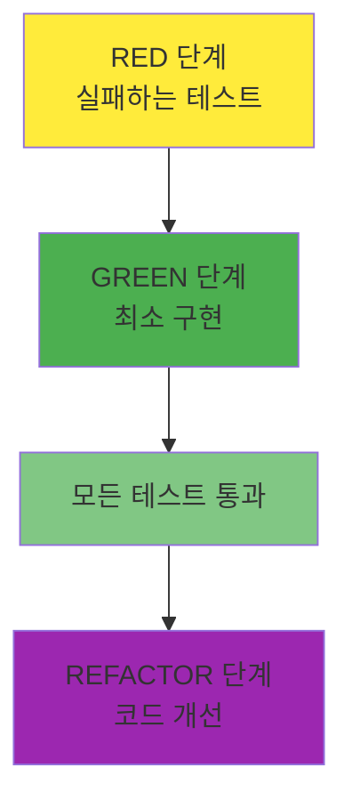
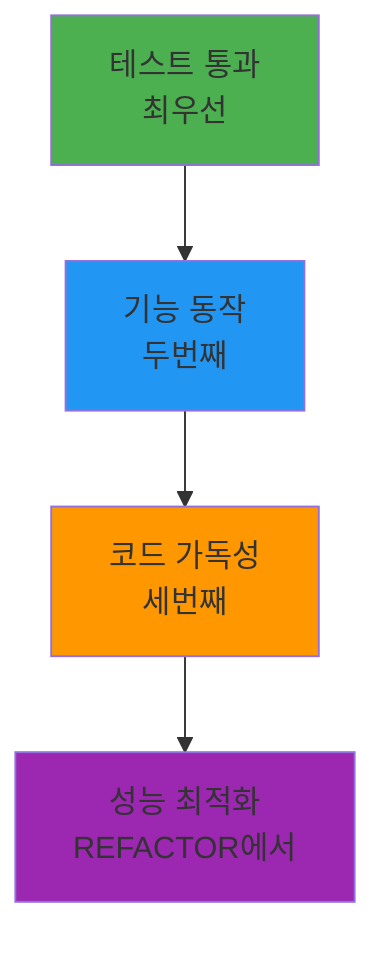

# TDD GREEN 단계 가이드: 최소 구현으로 테스트 통과시키기

## 목차

1. [GREEN 단계의 목표와 원칙](#green-%EB%8B%A8%EA%B3%84%EC%9D%98-%EB%AA%A9%ED%91%9C%EC%99%80-%EC%9B%90%EC%B9%99)
2. [최소 구현 전략 (YAGNI 원칙)](#%EC%B5%9C%EC%86%8C-%EA%B5%AC%ED%98%84-%EC%A0%84%EB%9E%B5-yagni-%EC%9B%90%EC%B9%99)
3. [테스트 통과를 위한 빠른 해결책](#%ED%85%8C%EC%8A%A4%ED%8A%B8-%ED%86%B5%EA%B3%BC%EB%A5%BC-%EC%9C%84%ED%95%9C-%EB%B9%A0%EB%A5%B8-%ED%95%B4%EA%B2%B0%EC%B1%85)
4. [성능 vs 기능 구현 균형](#%EC%84%B1%EB%8A%A5-vs-%EA%B8%B0%EB%8A%A5-%EA%B5%AC%ED%98%84-%EA%B7%A0%ED%98%95)
5. [실전 코드 예시](#%EC%8B%A4%EC%A0%84-%EC%BD%94%EB%93%9C-%EC%98%88%EC%8B%9C)
6. [GREEN 단계에서 피해야 할 것들](#green-%EB%8B%A8%EA%B3%84%EC%97%90%EC%84%9C-%ED%94%BC%ED%95%B4%EC%95%BC-%ED%95%A0-%EA%B2%83%EB%93%A4)
7. [Git 커밋 전략 (GREEN 단계)](#git-%EC%BB%A4%EB%B0%8B-%EC%A0%84%EB%9E%B5-green-%EB%8B%A8%EA%B3%84)
8. [GREEN 단계 체크리스트](#green-%EB%8B%A8%EA%B3%84-%EC%B2%B4%ED%81%AC%EB%A6%AC%EC%8A%A4%ED%8A%B8)

______________________________________________________________________

## GREEN 단계의 목표와 원칙

### GREEN 단계의 핵심 목표

GREEN 단계의 유일하고 명확한 목표는 \*\*"실패하는 모든 테스트를 통과시키는 것"\*\*입니다. 이 단계에서는 다음을 기억해야 합니다:



### 1. 통과가 최우선 (Passing First)

GREEN 단계의 철학은 간단합니다:

- **완벽함보다 통과**: 아름다운 코드보다 통과하는 코드가 먼저
- **단순함이 미덕**: 가장 단순한 해결책을 찾으세요
- **빠른 피드백**: 테스트가 빨리 통과해야 다음 단계로 갈 수 있습니다

### 2. YAGNI 원칙 (You Aren't Gonna Need It)

> "지금 필요하지 않은 기능은 구현하지 마라"

```python
# 나쁜 예시: 과잉 엔지니어링
class UserService:
    def __init__(self):
        self.cache = RedisCache()           # 아직 필요 없음
        self.logger = StructuredLogger()    # 아직 필요 없음
        self.metrics = PrometheusMetrics()  # 아직 필요 없음
        self.validator = ComplexValidator() # 아직 필요 없음

    def create_user(self, user_data):
        # 복잡한 로직...
        pass

# 좋은 예시: 최소 구현
class UserService:
    def create_user(self, user_data):
        # 테스트 통과에 필요한 최소한의 로직만
        if not user_data.get("email"):
            raise ValueError("Email is required")

        return User(
            email=user_data["email"],
            name=user_data.get("name", "")
        )
```

### 3. KISS 원칙 (Keep It Simple, Stupid)

단순한 해결책이 항상 최선입니다:

- **복잡성 회피**: 복잡한 알고리즘, 디자인 패턴 피하기
- **직관적 코드**: 다른 개발자가 쉽게 이해할 수 있는 코드
- **최소 의존성**: 불필요한 외부 라이브러리나 서비스 피하기

______________________________________________________________________

## 최소 구현 전략 (YAGNI 원칙)

### 1. 하드코딩 전략

때로는 하드코딩이 최선의 선택입니다:

```python
# RED 단계 테스트
def test_get_current_temperature_should_return_25():
    """현재 온도를 조회하면 25도를 반환해야 한다"""
    response = temperature_service.get_current_temperature()
    assert response == 25

# GREEN 단계 최소 구현
class TemperatureService:
    def get_current_temperature(self):
        # 실제 센서 대신 하드코딩된 값 반환
        return 25  # 테스트 통과를 위한 최소 구현
```

**언제 하드코딩이 적합한가?**

- 테스트가 단 하나의 고정된 값을 기대할 때
- 외부 의존성(센서, API, 데이터베이스)이 복잡할 때
- 첫 번째 통과를 빠르게 얻고 싶을 때

### 2. 가짜 구현 (Fake Implementation)

간단한 메모리 기반 구현으로 시작:

```python
# RED 단계 테스트
def test_user_creation_should_return_user_with_id():
    """사용자 생성 시 ID가 할당된 사용자 객체를 반환해야 한다"""
    user_data = {"name": "John", "email": "john@example.com"}
    user = user_service.create_user(user_data)

    assert user.id is not None
    assert user.name == "John"
    assert user.email == "john@example.com"

# GREEN 단계 최소 구현
class UserService:
    def __init__(self):
        self._users = {}  # 간단한 메모리 저장소
        self._next_id = 1

    def create_user(self, user_data):
        # 최소한의 검증 로직
        if not user_data.get("email"):
            raise ValueError("Email is required")

        # 가장 간단한 ID 생성
        user_id = f"user_{self._next_id}"
        self._next_id += 1

        # 최소한의 사용자 객체 생성
        user = User(
            id=user_id,
            email=user_data["email"],
            name=user_data.get("name", "")
        )

        self._users[user_id] = user
        return user
```

### 3. 조건부 최소 구현

필요한 조건만 구현:

```python
# RED 단계 테스트들
def test_admin_can_access_admin_panel():
    """관리자는 관리자 패널에 접근할 수 있어야 한다"""
    admin = User(role="admin")
    assert auth_service.can_access_admin_panel(admin) is True

def test_regular_user_cannot_access_admin_panel():
    """일반 사용자는 관리자 패널에 접근할 수 없어야 한다"""
    user = User(role="user")
    assert auth_service.can_access_admin_panel(user) is False

def test_guest_cannot_access_admin_panel():
    """게스트는 관리자 패널에 접근할 수 없어야 한다"""
    guest = User(role="guest")
    assert auth_service.can_access_admin_panel(guest) is False

# GREEN 단계 최소 구현
class AuthService:
    def can_access_admin_panel(self, user):
        # 테스트에 필요한 최소한의 조건만 구현
        return user.role == "admin"
```

### 4. 반환값 고정 전략

```python
# RED 단계 테스트
def test_calculate_tax_should_return_10_percent():
    """소득세 계산 시 10%를 반환해야 한다"""
    tax = tax_calculator.calculate_tax(1000)
    assert tax == 100

# GREEN 단계 최소 구현
class TaxCalculator:
    def calculate_tax(self, income):
        # 모든 소득에 대해 10% 고정 (테스트에 필요한 최소 구현)
        return income * 0.10
```

______________________________________________________________________

## 테스트 통과를 위한 빠른 해결책

### 1. 단계별 접근법

복잡한 테스트는 작게 나누어 해결:

```python
# 복잡한 테스트
def test_user_registration_complete_flow():
    """완전한 사용자 등록 플로우 테스트"""
    # 1. 유효한 데이터로 회원가입
    # 2. 이메일 인증 토큰 발송 확인
    # 3. 토큰으로 이메일 인증
    # 4. 인증된 사용자 로그인
    # 5. JWT 토큰 수신 확인

# GREEN 단계: 하나씩 구현
class UserService:
    def register_user(self, user_data):
        # 1단계: 최소한의 사용자 생성만 구현
        if not user_data.get("email"):
            raise ValueError("Email required")

        user = User(
            id=self._generate_id(),
            email=user_data["email"],
            is_verified=False  # 아직 인증 로직 구현 안 함
        )

        return user

    def send_verification_email(self, user):
        # 2단계: 가짜 이메일 발송
        return True  # 항상 성공 반환

    def verify_email(self, token):
        # 3단계: 가짜 토큰 검증
        return True  # 항상 성공 반환

    def login_user(self, email, password):
        # 4단계: 간단한 로그인
        return {"token": "fake_jwt_token"}
```

### 2. Mock/Stub을 활용한 의존성 제거

```python
# RED 단계 테스트
def test_order_processing_should_send_email():
    """주문 처리 시 확인 이메일을 발송해야 한다"""
    order = Order(id="123", customer_email="customer@example.com")

    # Mock 주입
    mock_email_service = Mock()
    order_service = OrderService(email_service=mock_email_service)

    # When
    order_service.process_order(order)

    # Then
    mock_email_service.send_order_confirmation.assert_called_once_with(order)

# GREEN 단계 최소 구현
class OrderService:
    def __init__(self, email_service):
        self.email_service = email_service

    def process_order(self, order):
        # 최소한의 주문 처리 로직
        order.status = "processed"
        order.processed_at = datetime.now()

        # 이메일 발송 (실제 로직 없이 위임만)
        self.email_service.send_order_confirmation(order)

        return order
```

### 3. 데이터베이스 대신 인메모리 저장소

```python
# RED 단계 테스트
def test_product_repository_can_save_and_retrieve():
    """제품 저장소에 저장하고 조회할 수 있어야 한다"""
    product = Product(name="Laptop", price=999.99)

    repo = ProductRepository()
    saved_product = repo.save(product)
    retrieved_product = repo.get_by_id(saved_product.id)

    assert retrieved_product.name == "Laptop"
    assert retrieved_product.price == 999.99

# GREEN 단계 최소 구현
class ProductRepository:
    def __init__(self):
        self._products = {}  # 데이터베이스 대신 메모리 사용

    def save(self, product):
        # 최소한의 ID 생성
        if not hasattr(product, 'id') or not product.id:
            product.id = str(uuid.uuid4())

        self._products[product.id] = product
        return product

    def get_by_id(self, product_id):
        return self._products.get(product_id)
```

### 4. 간단한 유효성 검증

```python
# RED 단계 테스트
def test_email_validation_should_reject_invalid_emails():
    """이메일 유효성 검증이 잘못된 이메일을 거부해야 한다"""
    invalid_emails = [
        "invalid-email",
        "@example.com",
        "user@",
        "user..name@example.com"
    ]

    for email in invalid_emails:
        assert email_validator.is_valid(email) is False

# GREEN 단계 최소 구현
class EmailValidator:
    def is_valid(self, email):
        # 가장 간단한 유효성 검증
        if not email or "@" not in email:
            return False

        local, domain = email.split("@", 1)

        # 최소한의 검증만 구현
        return len(local) > 0 and len(domain) > 0 and "." in domain
```

______________________________________________________________________

## 성능 vs 기능 구현 균형

### 1. 성능 최적화 연기

GREEN 단계에서는 성능을 고려하지 마세요:

```python
# 나쁜 예시: GREEN 단계에서 성능 최적화 시도
class UserService:
    def __init__(self):
        self.user_cache = LRUCache(maxsize=1000)  # 불필요한 복잡성
        self.db_pool = ConnectionPool(max_connections=20)  # 과잉 엔지니어링

    def get_user(self, user_id):
        # 복잡한 캐싱 로직
        if user_id in self.user_cache:
            return self.user_cache[user_id]

        # 복잡한 데이터베이스 연결 관리
        with self.db_pool.get_connection() as conn:
            user = conn.execute("SELECT * FROM users WHERE id = ?", user_id)
            self.user_cache[user_id] = user
            return user

# 좋은 예시: 단순한 구현
class UserService:
    def __init__(self):
        self.users = {}  # 간단한 메모리 저장소

    def get_user(self, user_id):
        return self.users.get(user_id)  # 최소한의 구현
```

### 2. 기능 우선 순위



### 3. 데이터베이스 vs 메모리

| 상황          | GREEN 단계 선택    | REFACTOR 단계     |
| ------------- | ------------------ | ----------------- |
| 단순 CRUD     | 메모리 저장소      | 실제 데이터베이스 |
| 복잡한 쿼리   | 하드코딩 결과      | 쿼리 최적화       |
| 대용량 데이터 | 작은 테스트 데이터 | 페이징/인덱싱     |
| 동시성        | 무시               | 락/트랜잭션       |

```python
# GREEN 단계: 메모리 기반
class OrderService:
    def __init__(self):
        self.orders = {}

    def create_order(self, order_data):
        order_id = f"order_{len(self.orders) + 1}"
        order = Order(id=order_id, **order_data)
        self.orders[order_id] = order
        return order

# REFACTOR 단계에서 개선될 내용들:
# - 데이터베이스 연결
# - 트랜잭션 관리
# - 동시성 제어
# - 데이터베이스 인덱싱
# - 캐싱 전략
```

### 4. 외부 API 통신

```python
# GREEN 단계: 가짜 API 응답
class PaymentService:
    def process_payment(self, payment_data):
        # 실제 API 호출 대신 가짜 응답
        if payment_data["amount"] > 0:
            return {
                "status": "success",
                "transaction_id": f"txn_{uuid.uuid4().hex[:8]}"
            }
        else:
            return {
                "status": "failed",
                "error": "Invalid amount"
            }

# REFACTOR 단계에서 개선될 내용들:
# - 실제 API 통신
# - 재시도 로직
# - 에러 핸들링
# - 타임아웃 관리
# - 로깅 및 모니터링
```

______________________________________________________________________

## 실전 코드 예시

### Python 예시: 사용자 인증 서비스

#### RED 단계 테스트 (이전 단계에서 작성)

```python
# tests/test_auth.py
def test_login_with_valid_credentials_should_return_jwt_token():
    """유효한 자격증명으로 로그인 시 JWT 토큰을 반환해야 한다"""
    login_data = {"email": "test@example.com", "password": "correct_password"}
    response = client.post("/auth/login", json=login_data)

    assert response.status_code == 200
    assert "access_token" in response.json()
    assert response.json()["token_type"] == "bearer"

def test_login_with_invalid_credentials_should_return_401():
    """잘못된 자격증명으로 로그인 시 401 에러를 반환해야 한다"""
    login_data = {"email": "test@example.com", "password": "wrong_password"}
    response = client.post("/auth/login", json=login_data)

    assert response.status_code == 401
    assert response.json()["detail"] == "Invalid credentials"
```

#### GREEN 단계 최소 구현

```python
# src/auth_service.py
import jwt
from datetime import datetime, timedelta
from typing import Dict, Any

class AuthService:
    def __init__(self):
        # 가짜 사용자 데이터베이스
        self.users = {
            "test@example.com": {
                "password": "correct_password",
                "user_id": "user_123"
            }
        }
        self.secret_key = "fake_secret_key_for_testing"

    def authenticate(self, email: str, password: str) -> Dict[str, Any]:
        """최소한의 인증 로직"""
        # 사용자 확인
        if email not in self.users:
            raise AuthenticationError("Invalid credentials")

        # 비밀번호 확인 (단순 문자열 비교)
        if self.users[email]["password"] != password:
            raise AuthenticationError("Invalid credentials")

        # JWT 토큰 생성 (최소한의 클레임만)
        token_payload = {
            "sub": self.users[email]["user_id"],
            "email": email,
            "exp": datetime.utcnow() + timedelta(hours=24)
        }

        access_token = jwt.encode(token_payload, self.secret_key, algorithm="HS256")

        return {
            "access_token": access_token,
            "token_type": "bearer"
        }

# src/main.py (FastAPI 엔드포인트)
from fastapi import FastAPI, HTTPException
from pydantic import BaseModel

app = FastAPI()

class LoginRequest(BaseModel):
    email: str
    password: str

@app.post("/auth/login")
def login(login_data: LoginRequest):
    auth_service = AuthService()

    try:
        result = auth_service.authenticate(login_data.email, login_data.password)
        return result
    except AuthenticationError:
        raise HTTPException(status_code=401, detail="Invalid credentials")

class AuthenticationError(Exception):
    pass
```

**실행 결과:**

```bash
$ pytest tests/test_auth.py -v
============================ test session starts ============================
tests/test_auth.py::test_login_with_valid_credentials_should_return_jwt_token PASSED
tests/test_auth.py::test_login_with_invalid_credentials_should_return_401 PASSED

============================= 2 passed in 0.12s ==============================
```

### TypeScript 예시: 할 일 관리 API

#### RED 단계 테스트

```typescript
// tests/todo-api.test.ts
describe('POST /todos', () => {
  it('should create a new todo with valid data and return 201', async () => {
    const todoData = {
      title: 'Learn TDD',
      description: 'Master Test-Driven Development'
    };

    const response = await request(app)
      .post('/todos')
      .send(todoData);

    expect(response.status).toBe(201);
    expect(response.body).toHaveProperty('id');
    expect(response.body.title).toBe(todoData.title);
    expect(response.body.completed).toBe(false);
  });

  it('should return 400 when title is missing', async () => {
    const invalidTodoData = {
      description: 'Missing title field'
    };

    const response = await request(app)
      .post('/todos')
      .send(invalidTodoData);

    expect(response.status).toBe(400);
    expect(response.body.error).toContain('title is required');
  });
});
```

#### GREEN 단계 최소 구현

```typescript
// src/services/TodoService.ts
import { v4 as uuidv4 } from 'uuid';

export interface Todo {
  id: string;
  title: string;
  description?: string;
  completed: boolean;
  createdAt: Date;
}

export interface CreateTodoRequest {
  title: string;
  description?: string;
}

export class TodoService {
  private todos: Map<string, Todo> = new Map();

  createTodo(request: CreateTodoRequest): Todo {
    // 최소한의 유효성 검증
    if (!request.title || request.title.trim().length === 0) {
      throw new Error('title is required');
    }

    // 최소한의 Todo 객체 생성
    const todo: Todo = {
      id: uuidv4(),
      title: request.title.trim(),
      description: request.description?.trim(),
      completed: false,
      createdAt: new Date()
    };

    // 메모리 저장소에 저장
    this.todos.set(todo.id, todo);
    return todo;
  }

  getTodo(id: string): Todo | undefined {
    return this.todos.get(id);
  }

  getAllTodos(): Todo[] {
    return Array.from(this.todos.values());
  }
}

// src/routes/todoRoutes.ts
import express from 'express';
import { TodoService } from '../services/TodoService';

const router = express.Router();
const todoService = new TodoService();

router.post('/todos', (req, res) => {
  try {
    const todo = todoService.createTodo(req.body);
    res.status(201).json(todo);
  } catch (error) {
    res.status(400).json({ error: error.message });
  }
});

router.get('/todos', (req, res) => {
  const todos = todoService.getAllTodos();
  res.json(todos);
});

export default router;
```

### Java 예시: 제품 재고 관리

#### RED 단계 테스트

```java
@Test
@DisplayName("제품 생성 시 유효한 데이터로 성공해야 한다")
void createProduct_WithValidData_ShouldReturnProduct() {
    ProductRequest request = new ProductRequest(
        "Test Product",
        29.99,
        "electronics",
        100
    );

    Product result = productService.createProduct(request);

    assertNotNull(result.getId());
    assertEquals(request.getName(), result.getName());
    assertEquals(request.getPrice(), result.getPrice());
    assertEquals(request.getStock(), result.getStock());
}

@Test
@DisplayName("가격이 0 이하인 제품 생성 시 실패해야 한다")
void createProduct_WithZeroPrice_ShouldThrowException() {
    ProductRequest request = new ProductRequest(
        "Invalid Product",
        -10.0,
        "electronics",
        100
    );

    assertThrows(ValidationException.class,
                 () -> productService.createProduct(request));
}
```

#### GREEN 단계 최소 구현

```java
// src/main/java/com/example/service/ProductService.java
@Service
public class ProductService {
    private final Map<String, Product> products = new ConcurrentHashMap<>();
    private final AtomicLong idGenerator = new AtomicLong(1);

    public Product createProduct(ProductRequest request) {
        // 최소한의 유효성 검증
        if (request.getPrice() <= 0) {
            throw new ValidationException("Price must be greater than 0");
        }

        if (request.getStock() < 0) {
            throw new ValidationException("Stock cannot be negative");
        }

        // 최소한의 Product 객체 생성
        Product product = new Product();
        product.setId(String.valueOf(idGenerator.getAndIncrement()));
        product.setName(request.getName());
        product.setPrice(request.getPrice());
        product.setCategory(request.getCategory());
        product.setStock(request.getStock());
        product.setCreatedAt(LocalDateTime.now());

        // 메모리 저장소에 저장
        products.put(product.getId(), product);

        return product;
    }

    public Product getProduct(String id) {
        return products.get(id);
    }

    public List<Product> getAllProducts() {
        return new ArrayList<>(products.values());
    }
}

// src/main/java/com/example/dto/ProductRequest.java
public class ProductRequest {
    private String name;
    private double price;
    private String category;
    private int stock;

    // 생성자, getter, setter 생략
}

// src/main/java/com/example/controller/ProductController.java
@RestController
@RequestMapping("/api/products")
public class ProductController {
    private final ProductService productService;

    public ProductController(ProductService productService) {
        this.productService = productService;
    }

    @PostMapping
    public ResponseEntity<Product> createProduct(@RequestBody ProductRequest request) {
        try {
            Product product = productService.createProduct(request);
            return ResponseEntity.status(HttpStatus.CREATED).body(product);
        } catch (ValidationException e) {
            return ResponseEntity.badRequest().build();
        }
    }

    @GetMapping
    public ResponseEntity<List<Product>> getAllProducts() {
        List<Product> products = productService.getAllProducts();
        return ResponseEntity.ok(products);
    }
}
```

### Go 예시: 결제 서비스

#### RED 단계 테스트

```go
func TestPaymentService_ProcessPayment(t *testing.T) {
    service := NewPaymentService()

    t.Run("유효한 결제 정보로 처리 시 성공", func(t *testing.T) {
        request := &PaymentRequest{
            Amount:      100.50,
            Currency:    "USD",
            CardNumber:  "4111111111111111",
            ExpiryMonth: "12",
            ExpiryYear:  "2025",
            CVV:         "123",
        }

        result, err := service.ProcessPayment(request)

        if err != nil {
            t.Fatalf("Expected no error, got %v", err)
        }

        if result.Status != "success" {
            t.Errorf("Expected success status, got %s", result.Status)
        }

        if result.TransactionID == "" {
            t.Error("Expected transaction ID to be generated")
        }
    })

    t.Run("0원 결제 시 실패", func(t *testing.T) {
        request := &PaymentRequest{
            Amount:     0,
            Currency:   "USD",
            CardNumber: "4111111111111111",
        }

        _, err := service.ProcessPayment(request)

        if err == nil {
            t.Error("Expected error for zero amount")
        }

        if !errors.Is(err, ErrInvalidAmount) {
            t.Errorf("Expected ErrInvalidAmount, got %v", err)
        }
    })
}
```

#### GREEN 단계 최소 구현

```go
// pkg/payment/service.go
package payment

import (
    "errors"
    "fmt"
    "strconv"
    "time"
)

var (
    ErrInvalidAmount = errors.New("payment amount must be greater than 0")
    ErrInvalidCard   = errors.New("invalid card information")
)

type PaymentRequest struct {
    Amount      float64
    Currency    string
    CardNumber  string
    ExpiryMonth string
    ExpiryYear  string
    CVV         string
}

type PaymentResult struct {
    TransactionID string
    Status        string
    Amount        float64
    Currency      string
    ProcessedAt   time.Time
}

type PaymentService struct {
    transactionCounter int64
}

func NewPaymentService() *PaymentService {
    return &PaymentService{}
}

func (s *PaymentService) ProcessPayment(request *PaymentRequest) (*PaymentResult, error) {
    // 최소한의 유효성 검증
    if request.Amount <= 0 {
        return nil, ErrInvalidAmount
    }

    if len(request.CardNumber) < 13 || len(request.CardNumber) > 19 {
        return nil, ErrInvalidCard
    }

    // 간단한 트랜잭션 ID 생성
    s.transactionCounter++
    transactionID := fmt.Sprintf("txn_%d_%d",
        time.Now().Unix(), s.transactionCounter)

    // 최소한의 결제 결과 생성
    result := &PaymentResult{
        TransactionID: transactionID,
        Status:        "success", // 항상 성공 (실제 결제 로직은 REFACTOR에서)
        Amount:        request.Amount,
        Currency:      request.Currency,
        ProcessedAt:   time.Now(),
    }

    return result, nil
}
```

______________________________________________________________________

## GREEN 단계에서 피해야 할 것들

### 1. 과도한 설계 (Over-Engineering)

**피해야 할 것들:**

- 복잡한 디자인 패턴 적용
- 불필요한 추상화 계층
- 미래의 요구사항 예측
- 성능 최적화 시도

```python
# 나쁜 예시: GREEN 단계에서의 과잉 엔지니어링
class UserFactory(AbstractFactory):
    def create_user(self, user_type: UserType) -> User:
        if user_type == UserType.ADMIN:
            return AdminUserBuilder().build()
        elif user_type == UserType.CUSTOMER:
            return CustomerUserBuilder().build()
        # ... 복잡한 팩토리 패턴

class UserService:
    def __init__(self):
        self.factory = UserFactory()
        self.validator_chain = ValidatorChain([
            EmailValidator(),
            PasswordValidator(),
            NameValidator(),
            # ... 복잡한 체인
        ])
        self.cache_manager = CacheManager()
        self.event_bus = EventBus()

    def create_user(self, user_data):
        # 복잡한 생성 로직
        pass

# 좋은 예시: 단순한 구현
class UserService:
    def create_user(self, user_data):
        if not user_data.get("email"):
            raise ValueError("Email required")

        return User(
            id=f"user_{uuid.uuid4().hex[:8]}",
            email=user_data["email"],
            name=user_data.get("name", "")
        )
```

### 2. 외부 의존성 도입

**GREEN 단계에서 피할 외부 의존성:**

- 데이터베이스 연결
- 외부 API 호출
- 메시지 큐
- 파일 시스템 접근

```python
# 나쁜 예시: 불필요한 외부 의존성
class UserService:
    def __init__(self):
        self.db = PostgreSQLDatabase("connection_string")  # 불필요
        self.redis = RedisClient()                        # 불필요
        self.email_api = SendGridAPI()                    # 불필요

    def create_user(self, user_data):
        # 데이터베이스 저장 (복잡성 증가)
        query = "INSERT INTO users (email, name) VALUES (?, ?)"
        self.db.execute(query, user_data["email"], user_data["name"])

        # 캐시에 저장 (불필요한 복잡성)
        self.redis.set(f"user:{email}", user_data)

        # 이메일 발송 (외부 의존성)
        self.email_api.send_welcome_email(user_data["email"])

# 좋은 예시: 의존성 없는 구현
class UserService:
    def __init__(self):
        self.users = {}  # 간단한 메모리 저장소

    def create_user(self, user_data):
        user = User(
            id=f"user_{len(self.users) + 1}",
            email=user_data["email"],
            name=user_data.get("name", "")
        )
        self.users[user.id] = user
        return user
```

### 3. 부정확한 구현

**테스트를 통과시키기 위한 부정확한 방법들:**

- 테스트 결과를 하드코딩
- 항상 성공하는 가짜 구현
- 실제 비즈니스 로직과 다른 동작

```python
# 나쁜 예시: 부정확한 구현
class Calculator:
    def add(self, a, b):
        # 테스트에만 의존하는 잘못된 구현
        if a == 2 and b == 3:
            return 5  # 특정 테스트 케이스에만 맞춤
        return 0      # 다른 경우는 잘못된 결과

# 좋은 예시: 올바른 구현
class Calculator:
    def add(self, a, b):
        # 실제 덧셈 로직
        return a + b
```

### 4. 테스트 수정으로 문제 해결

```python
# 나쁜 예시: 테스트를 수정해서 문제를 해결하려는 시도
# 원래 테스트
def test_user_age_validation():
    user = User(age=15)
    assert user.is_adult() is False

# 구현이 어려우니 테스트를 수정 (나쁜 방식)
def test_user_age_validation():
    user = User(age=20)  # 테스트를 쉬운 경우로 변경
    assert user.is_adult() is True

# 좋은 예시: 구현을 수정해서 문제 해결
class User:
    def is_adult(self):
        return self.age >= 18
```

______________________________________________________________________

## Git 커밋 전략 (GREEN 단계)

### 1. 커밋 메시지 컨벤션

GREEN 단계 커밋은 구현 완료를 나타내야 합니다:

```bash
# 좋은 커밋 메시지 예시
git commit -m "🟢 feat(AUTH-001): implement user authentication service

- Add AuthService with basic email/password validation
- Add JWT token generation functionality
- Add /auth/login endpoint with proper error handling
- Implement in-memory user storage for testing

All authentication tests now passing. Next: REFACTOR phase."

# 간단한 버전
git commit -m "🟢 feat(AUTH-001): implement basic auth functionality"
```

### 2. 커밋 단위와 내용

**하나의 GREEN 커밋에 포함될 내용:**

- RED 단계에서 실패하던 모든 테스트를 통과시키는 최소 구현
- 관련된 도메인 로직
- 기본적인 에러 핸들링

```bash
# 커밋 전 상태 확인
git status
# 수정된 파일들:
# src/auth_service.py
# src/main.py
# tests/test_auth.py (수정 안 함)

# 커밋
git add src/auth_service.py src/main.py
git commit -m "🟢 feat(AUTH-001): implement authentication service"
```

### 3. 브랜치 관리

```bash
# GREEN 단계 완료 후 브랜치 상태
git status
# On branch feature/user-authentication
# Changes to be committed:
#   modified:   src/auth_service.py
#   modified:   src/main.py

# 테스트 통과 확인
pytest tests/test_auth.py -v
# 2 passed

# GREEN 단계 커밋
git commit -m "🟢 feat(AUTH-001): implement authentication service"

# REFACTOR 단계 준비
git checkout -b refactor/user-authentication-improvements
```

### 4. 코드 리뷰 포인트

GREEN 단계 코드 리뷰 체크리스트:

```markdown
## GREEN 단계 리뷰 체크리스트

### 기능 구현
- [ ] 모든 RED 테스트가 통과하는가?
- [ ] 구현이 테스트의 의도와 일치하는가?
- [ ] 최소한의 구현인가? (과잉 엔지니어링 아님)

### 코드 품질
- [ ] 코드가 이해하기 쉬운가?
- [ ] 불필요한 복잡성이 없는가?
- [ ] 적절한 변수명과 함수명을 사용하는가?

### 테스트 커버리지
- [ ] 테스트가 실제 로직을 검증하는가?
- [ ] 테스트와 구현이 동기화되어 있는가?

### 기술적 결정
- [ ] 단순한 해결책을 선택했는가?
- [ ] 외부 의존성을 최소화했는가?
- [ ] 미래의 요구사항을 예측하지 않았는가?
```

### 5. CI/CD 파이프라인

```yaml
# .github/workflows/test.yml
name: Test Suite

on:
  push:
    branches: [ main, develop, feature/* ]
  pull_request:
    branches: [ main ]

jobs:
  test:
    runs-on: ubuntu-latest

    steps:
    - uses: actions/checkout@v3

    - name: Set up Python
      uses: actions/setup-python@v4
      with:
        python-version: '3.11'

    - name: Install dependencies
      run: |
        pip install -r requirements.txt
        pip install -r requirements-test.txt

    - name: Run tests
      run: |
        pytest tests/ -v --tb=short --cov=src --cov-fail-under=80

    - name: Check GREEN phase
      run: |
        # GREEN 단계에서는 모든 테스트가 통과해야 함
        pytest tests/ -v
        if [ $? -ne 0 ]; then
          echo "GREEN phase: All tests must pass!"
          exit 1
        fi
```

______________________________________________________________________

## GREEN 단계 체크리스트

### 구현 품질 체크리스트

- [ ] **모든 테스트 통과**: RED 단계에서 작성한 모든 테스트가 통과하는가?
- [ ] **최소 구현**: YAGNI 원칙을 따르는가?
- [ ] **단순성**: 코드가 단순하고 이해하기 쉬운가?
- [ ] **기능 중심**: 성능 최적화보다 기능 구현에 집중했는가?

### 기능 정확성 체크리스트

- [ ] **요구사항 충족**: 테스트가 검증하는 모든 요구사항을 구현했는가?
- [ ] **에지 케이스**: 경계값과 예외 케이스를 처리하는가?
- [ ] **에러 핸들링**: 적절한 에러를 반환하는가?
- [ ] **데이터 유효성**: 입력 데이터 검증을 구현했는가?

### 기술적 결정 체크리스트

- [ ] **의존성 최소화**: 불필요한 외부 의존성을 피했는가?
- [ ] **메모리 기반**: 데이터베이스 대신 메모리 저장소를 사용했는가?
- [ ] **하드코딩 허용**: 단순한 하드코딩을 적절히 사용했는가?
- [ ] **Mock/Stub 사용**: 외부 서비스 대신 Mock/Stub을 사용했는가?

### 코드 스타일 체크리스트

- [ ] **일관된 스타일**: 팀의 코드 스타일 가이드를 따르는가?
- [ ] **의미 있는 이름**: 변수명, 함수명, 클래스명이 명확한가?
- [ ] **적절한 주석**: 복잡한 로직에 주석이 추가되었는가?
- [ ] **함수 크기**: 함수가 너무 크지 않은가?

### 테스트와의 일관성 체크리스트

- [ ] **테스트 통과**: 모든 새 테스트가 통과하는가?
- [ ] **기존 테스트**: 기존 테스트가 여전히 통과하는가?
- [ ] **테스트 의도**: 구현이 테스트의 의도를 정확히 반영하는가?
- [ ] **테스트 커버리지**: 새로운 기능이 적절히 테스트되는가?

### Git 워크플로우 체크리스트

- [ ] **커밋 메시지**: GREEN 단계 완료를 명확히 표시했는가?
- [ ] **태그 연결**: @TAG:ID로 관련 SPEC과 연결했는가?
- [ ] **파일 관리**: 불필요한 파일을 커밋하지 않았는가?
- [ ] **브랜치 정리**: 적절한 브랜치에서 작업했는가?

### 다음 단계 준비 체크리스트

- [ ] **REFACTOR 준비**: 코드가 리팩토링 가능한 상태인가?
- [ ] **기술 부최**: 심각한 기술 부채가 없는가?
- [ ] **문서화**: 복잡한 부분이 문서화되었는가?
- [ ] **동기화**: 팀원과 상태가 공유되었는가?

______________________________________________________________________

## 결론

GREEN 단계는 TDD 사이클에서 **실제 기능을 구현하는 첫 단계**입니다. 이 단계의 성공은:

1. **빠른 피드백 루프**를 통해 개발 속도를 높이고
2. **단순한 구현**을 통해 복잡성을 관리하며
3. **테스트 통과**를 통해 진행 상황을 명확하게 보여주고
4. **REFACTOR 단계 준비**를 통해 코드 품질 개선의 기반을 마련합니다

GREEN 단계에서 가장 중요한 것은 \*\*"완벽한 구현이 아니라 통과하는 구현"\*\*이라는 사실을 기억하는 것입니다.

**GREEN 단계의 성공은 REFACTOR 단계의 성공을 보장합니다!** 🚀

______________________________________________________________________

## 다음 단계

GREEN 단계를 마쳤다면, 다음 단계로 이동하세요:

- [**REFACTOR 단계 가이드**](./refactor.md) - 코드 품질 개선과 리팩토링
