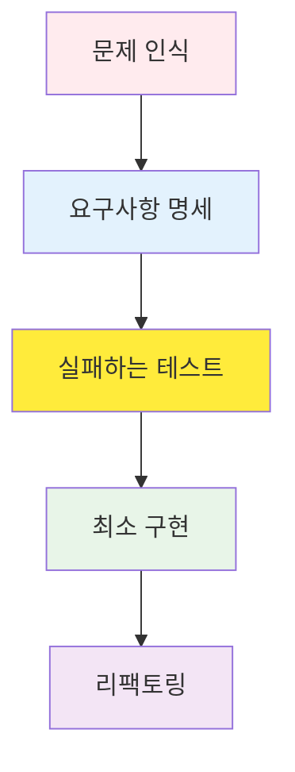
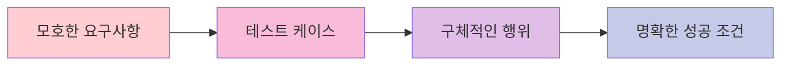

# TDD RED 단계 가이드: 실패하는 테스트 작성의 철학과 실전

## 목차

1. [RED 단계의 철학적 배경](#red-%EB%8B%A8%EA%B3%84%EC%9D%98-%EC%B2%A0%ED%95%99%EC%A0%81-%EB%B0%B0%EA%B2%BD)
2. [RED 단계의 중요성](#red-%EB%8B%A8%EA%B3%84%EC%9D%98-%EC%A4%91%EC%9A%94%EC%84%B1)
3. [실패하는 테스트 작성 방법](#%EC%8B%A4%ED%8C%A8%ED%95%98%EB%8A%94-%ED%85%8C%EC%8A%A4%ED%8A%B8-%EC%9E%91%EC%84%B1-%EB%B0%A9%EB%B2%95)
4. [테스트 케이스 설계 전략](#%ED%85%8C%EC%8A%A4%ED%8A%B8-%EC%BC%80%EC%9D%B4%EC%8A%A4-%EC%84%A4%EA%B3%84-%EC%A0%84%EB%9E%B5)
5. [경계 값 테스트와 예외 케이스](#%EA%B2%BD%EA%B3%84-%EA%B0%92-%ED%85%8C%EC%8A%A4%ED%8A%B8%EC%99%80-%EC%98%88%EC%99%B8-%EC%BC%80%EC%9D%B4%EC%8A%A4)
6. [실전 코드 예시](#%EC%8B%A4%EC%A0%84-%EC%BD%94%EB%93%9C-%EC%98%88%EC%8B%9C)
7. [일반적인 실수와 방지 방법](#%EC%9D%BC%EB%B0%98%EC%A0%81%EC%9D%B8-%EC%8B%A4%EC%88%98%EC%99%80-%EB%B0%A9%EC%A7%80-%EB%B0%A9%EB%B2%95)
8. [Git 커밋 전략 (RED 단계)](#git-%EC%BB%A4%EB%B0%8B-%EC%A0%84%EB%9E%B5-red-%EB%8B%A8%EA%B3%84)
9. [RED 단계 체크리스트](#red-%EB%8B%A8%EA%B3%84-%EC%B2%B4%ED%81%AC%EB%A6%AC%EC%8A%A4%ED%8A%B8)

______________________________________________________________________

## RED 단계의 철학적 배경

### 왜 실패하는 테스트부터 시작하는가?

TDD의 RED 단계는 단순히 "실패하는 테스트를 작성하는 것" 이상의 깊은 철학을 담고 있습니다. 이는 소프트웨어 개발의 근본적인 접근 방식을 바꾸는 패러다임 전환입니다.

#### 1. 문제 정의 우선 원칙



전통적인 개발 방식:

- 구현 → 테스트 → 디버깅 (수정 비용 큼)

TDD 방식:

- 명세 → 테스트 → 구현 (수정 비용 작음)

#### 2. 실패의 가치

**실패는 성공의 어머니라는 말은 TDD에서 literal하게 적용됩니다:**

- **의도적인 실패**: 우리가 무엇을 구현해야 하는지 명확히 정의
- **예측 가능한 실패**: 테스트가 실패할 것을 이미 알고 있음
- **학습적 실패**: 실패를 통해 시스템의 경계를 이해

```python
# 좋은 RED 단계의 예시
def test_user_authentication_with_valid_credentials():
    """유효한 자격증명으로 인증했을 때 JWT 토큰을 반환해야 한다"""
    # Given: 유효한 사용자 자격증명
    valid_credentials = {
        "email": "user@example.com",
        "password": "correct_password"
    }

    # When: 인증 요청
    response = auth_service.authenticate(valid_credentials)

    # Then: JWT 토큰 반환
    assert response.status_code == 200
    assert "access_token" in response.json()
    assert response.json()["token_type"] == "bearer"
```

이 테스트는 당장 실행하면 실패합니다. `auth_service`가 아직 존재하지 않기 때문입니다. **이것이 RED 단계의 핵심입니다.**

#### 3. 인지적 부하 감소

RED 단계는 개발자의 인지적 부하를 획기적으로 줄여줍니다:

- **한 번에 하나의 문제만**: 현재 테스트 케이스에만 집중
- **명확한 성공 기준**: "테스트가 통과하는 것"이 유일한 목표
- **점진적 진행**: 작은 성공 경험의 반복

______________________________________________________________________

## RED 단계의 중요성

### 1. 요구사항의 구체화



**예시:**

| 모호한 요구사항    | 테스트 케이스로 구체화                            |
| ------------------ | ------------------------------------------------- |
| "사용자 인증 기능" | "이메일과 비밀번호로 로그인했을 때 JWT 토큰 반환" |
| "데이터 검증"      | "이메일 형식이 잘못되면 400 에러 반환"            |
| "권한 관리"        | "관리자만 삭제 API에 접근 가능"                   |

### 2. 설계 강제

테스트를 먼저 작성하면 자연스럽게 좋은 설계가 따라옵니다:

- **의존성 주입**: 테스트 가능한 구조
- **단일 책임 원칙**: 작고 집중된 함수
- **인터페이스 기반 설계**: 테스트와 구현의 분리

```python
# RED 단계에서 강제되는 좋은 설계
class UserService:
    def __init__(self, user_repository: UserRepository, email_service: EmailService):
        self.user_repository = user_repository
        self.email_service = email_service

    def create_user(self, user_data: dict) -> User:
        # 구현은 GREEN 단계에서
        pass
```

### 3. 리스크 완화

| 리스크 유형         | RED 단계의 해결책                  |
| ------------------- | ---------------------------------- |
| **요구사항 오해**   | 테스트로 명확한 행위 정의          |
| **과잉 엔지니어링** | 최소한의 테스트부터 시작           |
| **통합 문제**       | 단위 테스트로 격리된 환경에서 검증 |
| **회귀 버그**       | 테스트 스위트로 지속적 검증        |

______________________________________________________________________

## 실패하는 테스트 작성 방법

### 1. AAA 패턴 (Arrange-Act-Assert)

모든 테스트는 명확한 구조를 가져야 합니다:

```python
def test_product_creation_with_valid_data():
    # Arrange (준비)
    valid_product_data = {
        "name": "Test Product",
        "price": 29.99,
        "category": "electronics"
    }

    # Act (실행)
    result = product_service.create_product(valid_product_data)

    # Assert (검증)
    assert result["id"] is not None
    assert result["name"] == "Test Product"
    assert result["price"] == 29.99
```

### 2. Given-When-Then 패턴

BDD 스타일의 더 서술적인 접근:

```python
def test_order_processing_with_sufficient_inventory():
    # Given: 재고가 충분한 상품과 주문 정보
    product = create_product(name="Laptop", inventory=10)
    order_request = {"product_id": product.id, "quantity": 2}

    # When: 주문 처리 요청
    order_result = order_service.process_order(order_request)

    # Then: 주문이 성공적으로 생성되고 재고가 감소
    assert order_result.status == "confirmed"
    assert product.inventory == 8
```

### 3. 테스트 네이밍 컨벤션

좋은 테스트 이름은 문서 역할을 합니다:

```python
# 좋은 예시 (명확한 의도 전달)
def test_user_registration_with_duplicate_email_should_return_409()
def test_password_reset_with_invalid_token_should_return_400()
def test_product_search_with_empty_query_should_return_all_products()

# 나쁜 예시 (모호한 의도)
def test_user_registration()
def test_password_reset()
def test_product_search()
```

### 4. 실패 확인 단계

RED 단계에서는 **반드시 테스트가 실패하는 것을 확인**해야 합니다:

```bash
# 테스트 실행
pytest tests/test_user_service.py::test_user_registration_with_duplicate_email_should_return_409 -v

# 기대 결과: FAILED
# 실제 결과: AssertionError: Expected 409 but got 201
```

이 실패 확인은 중요합니다:

- 테스트가 실제로 무언가를 검증하고 있는지 확인
- 거짓 양성(false positive)을 방지
- 구현 전 요구사항을 다시 한번 검토

______________________________________________________________________

## 테스트 케이스 설계 전략

### 1. 경계 기반 테스팅 (Boundary-Based Testing)

```python
def test_age_validation():
    """나이 검증: 0-120세까지만 허용"""

    # 경계값 테스트
    test_cases = [
        (-1, False),   # 경계 아래 (실패 예상)
        (0, True),     # 최소 경계 (성공 예상)
        (1, True),     # 경계 바로 위 (성공 예상)
        (119, True),   # 경계 바로 아래 (성공 예상)
        (120, True),   # 최대 경계 (성공 예상)
        (121, False),  # 경계 위 (실패 예상)
    ]

    for age, expected_valid in test_cases:
        result = user_service.validate_age(age)
        assert result.is_valid == expected_valid, f"Age {age} validation failed"
```

### 2. 동등성 분할 (Equivalence Partitioning)

```python
def test_email_validation():
    """이메일 형식 검증"""

    # 유효한 이메일 그룹
    valid_emails = [
        "user@example.com",
        "user.name@example.co.kr",
        "user+tag@example.org",
        "123@example.com"
    ]

    # 무효한 이메일 그룹
    invalid_emails = [
        "invalid-email",
        "@example.com",
        "user@",
        "user..name@example.com",
        "user@.com"
    ]

    for email in valid_emails:
        assert email_service.is_valid(email), f"Valid email {email} marked as invalid"

    for email in invalid_emails:
        assert not email_service.is_valid(email), f"Invalid email {email} marked as valid"
```

### 3. 결정 테이블 (Decision Table)

```python
def test_user_permission_check():
    """사용자 권한 확인 결정 테이블"""

    test_cases = [
        # (role, is_active, has_subscription, expected_result)
        ("admin", True, True, True),    # 관리자는 항상 접근 가능
        ("admin", False, True, True),   # 비활성 관리자도 접근 가능
        ("user", True, True, True),     # 활성 유저 + 구독 = 접근 가능
        ("user", True, False, False),   # 활성 유저 + 무구독 = 접근 불가
        ("user", False, True, False),   # 비활성 유저 = 접근 불가
        ("guest", True, True, False),   # 게스트 = 접근 불가
    ]

    for role, is_active, has_subscription, expected in test_cases:
        user = create_user(role=role, is_active=is_active, has_subscription=has_subscription)
        result = permission_service.can_access_premium_content(user)
        assert result == expected, f"Permission check failed for {role}"
```

### 4. 상태 전환 테스팅

```python
def test_order_state_transitions():
    """주문 상태 전환 테스트"""

    # 유효한 상태 전환
    valid_transitions = [
        ("pending", "confirmed"),
        ("confirmed", "processing"),
        ("processing", "shipped"),
        ("shipped", "delivered"),
        ("pending", "cancelled"),
        ("confirmed", "cancelled")
    ]

    # 무효한 상태 전환
    invalid_transitions = [
        ("delivered", "processing"),
        ("cancelled", "confirmed"),
        ("shipped", "pending")
    ]

    for from_state, to_state in valid_transitions:
        order = create_order(state=from_state)
        result = order_service.transition_state(order, to_state)
        assert result.success, f"Valid transition {from_state} -> {to_state} failed"

    for from_state, to_state in invalid_transitions:
        order = create_order(state=from_state)
        result = order_service.transition_state(order, to_state)
        assert not result.success, f"Invalid transition {from_state} -> {to_state} should fail"
```

______________________________________________________________________

## 경계 값 테스트와 예외 케이스

### 1. 숫자 경계값 테스팅

```python
def test_product_price_validation():
    """상품 가격 검증: 0.01 ~ 999999.99"""

    boundary_tests = [
        # (price, expected_valid, description)
        (0, False, "0원은 불가"),
        (0.009, False, "0.01원 미만은 불가"),
        (0.01, True, "최소 금액"),
        (0.011, True, "최소 금액 초과"),
        (999999.99, True, "최대 금액"),
        (1000000, False, "최대 금액 초과"),
    ]

    for price, expected, description in boundary_tests:
        result = product_service.validate_price(price)
        assert result.is_valid == expected, f"Price validation failed: {description}"
```

### 2. 문자열 경계값 테스팅

```python
def test_username_length_validation():
    """사용자 이름 길이 검증: 3-20자"""

    test_cases = [
        ("", False, "빈 문자열"),
        ("ab", False, "2자 (최소 미만)"),
        ("abc", True, "3자 (최소)"),
        ("a" * 19, True, "19자 (최대-1)"),
        ("a" * 20, True, "20자 (최대)"),
        ("a" * 21, False, "21자 (최대 초과)"),
        ("가나다", True, "한글 3자"),
        ("가" * 20, True, "한글 20자"),
        ("가" * 21, False, "한글 21자"),
    ]

    for username, expected, description in test_cases:
        result = user_service.validate_username(username)
        assert result.is_valid == expected, f"Username validation failed: {description}"
```

### 3. 날짜/시간 경계값 테스팅

```python
def test_event_registration_deadline():
    """이벤트 등록 마감일 테스트"""

    now = datetime.now()

    test_cases = [
        # (registration_time, event_deadline, expected_result, description)
        (now - timedelta(days=1), now, False, "마감 후 1일 지남"),
        (now - timedelta(seconds=1), now, False, "마감 후 1초 지남"),
        (now, now, True, "마감 당시"),
        (now - timedelta(seconds=1), now + timedelta(seconds=1), True, "마감 1초 전"),
        (now - timedelta(days=1), now + timedelta(days=1), True, "마감 1일 전"),
    ]

    for reg_time, deadline, expected, description in test_cases:
        result = event_service.can_register(reg_time, deadline)
        assert result == expected, f"Deadline test failed: {description}"
```

### 4. 예외 케이스 체계적 접근

```python
def test_file_upload_edge_cases():
    """파일 업로드 예외 케이스"""

    exception_cases = [
        # (file_input, expected_exception, description)
        (None, ValueError, "None 파일 입력"),
        ("", ValueError, "빈 문자열 파일 경로"),
        ("/invalid/path", FileNotFoundError, "존재하지 않는 파일"),
        ("./large_file.txt", FileTooLargeError, "파일 크기 초과"),
        ("./virus.exe", SecurityError, "보안 위험 파일"),
        ("./malformed.jpg", InvalidFileFormatError, "잘못된 파일 형식"),
    ]

    for file_input, expected_exception, description in exception_cases:
        with pytest.raises(expected_exception):
            file_service.upload(file_input)
```

______________________________________________________________________

## 실전 코드 예시

### Python 예시 (FastAPI + Pytest)

#### RED 단계: 사용자 인증 API

```python
# tests/test_auth.py
import pytest
from fastapi.testclient import TestClient
from src.main import app

client = TestClient(app)

def test_login_with_valid_credentials_should_return_jwt_token():
    """
    WHEN 유효한 자격증명으로 로그인 요청하면
    THEN JWT 액세스 토큰을 반환해야 한다
    """
    # Given
    login_data = {
        "email": "test@example.com",
        "password": "correct_password_123"
    }

    # When
    response = client.post("/auth/login", json=login_data)

    # Then
    assert response.status_code == 200
    response_data = response.json()
    assert "access_token" in response_data
    assert response_data["token_type"] == "bearer"
    assert len(response_data["access_token"]) > 100  # JWT 토큰 길이 검증

def test_login_with_invalid_email_should_return_401():
    """
    WHEN 잘못된 이메일로 로그인 요청하면
    THEN 401 Unauthorized 에러를 반환해야 한다
    """
    # Given
    login_data = {
        "email": "invalid@example.com",
        "password": "some_password"
    }

    # When
    response = client.post("/auth/login", json=login_data)

    # Then
    assert response.status_code == 401
    assert response.json()["detail"] == "Invalid credentials"

def test_login_with_invalid_password_should_return_401():
    """
    WHEN 잘못된 비밀번호로 로그인 요청하면
    THEN 401 Unauthorized 에러를 반환해야 한다
    """
    # Given
    login_data = {
        "email": "test@example.com",
        "password": "wrong_password"
    }

    # When
    response = client.post("/auth/login", json=login_data)

    # Then
    assert response.status_code == 401
    assert response.json()["detail"] == "Invalid credentials"

def test_login_with_missing_fields_should_return_422():
    """
    WHEN 필수 필드가 누락된 로그인 요청하면
    THEN 422 Validation Error를 반환해야 한다
    """
    # Given: 이메일 필드 누락
    login_data = {
        "password": "some_password"
    }

    # When
    response = client.post("/auth/login", json=login_data)

    # Then
    assert response.status_code == 422
    assert "email" in response.json()["detail"][0]["loc"]
```

이 테스트들을 실행하면 당연히 실패합니다. 아직 `/auth/login` 엔드포인트가 존재하지 않기 때문입니다.

```bash
$ pytest tests/test_auth.py -v
============================ test session starts ============================
collected 4 items

tests/test_auth.py::test_login_with_valid_credentials_should_return_jwt_token FAILED
tests/test_auth.py::test_login_with_invalid_email_should_return_401 FAILED
tests/test_auth.py::test_login_with_invalid_password_should_return_401 FAILED
tests/test_auth.py::test_login_with_missing_fields_should_return_422 FAILED

============================= 4 failed in 0.12s ==============================
```

**이것이 완벽한 RED 단계의 결과입니다!**

### TypeScript 예시 (Jest + Express)

#### RED 단계: 할 일 관리 API

```typescript
// tests/todo-api.test.ts
import request from 'supertest';
import app from '../src/app';

describe('Todo API', () => {
  describe('POST /todos', () => {
    it('should create a new todo with valid data and return 201', async () => {
      // Given
      const todoData = {
        title: 'Learn TDD',
        description: 'Master Test-Driven Development',
        dueDate: '2024-12-31'
      };

      // When
      const response = await request(app)
        .post('/todos')
        .send(todoData);

      // Then
      expect(response.status).toBe(201);
      expect(response.body).toHaveProperty('id');
      expect(response.body.title).toBe(todoData.title);
      expect(response.body.description).toBe(todoData.description);
      expect(response.body.completed).toBe(false);
    });

    it('should return 400 when title is missing', async () => {
      // Given
      const invalidTodoData = {
        description: 'Missing title field',
        dueDate: '2024-12-31'
      };

      // When
      const response = await request(app)
        .post('/todos')
        .send(invalidTodoData);

      // Then
      expect(response.status).toBe(400);
      expect(response.body.error).toContain('title is required');
    });

    it('should return 400 when title exceeds 200 characters', async () => {
      // Given
      const longTitle = 'a'.repeat(201);
      const invalidTodoData = {
        title: longTitle,
        description: 'Too long title'
      };

      // When
      const response = await request(app)
        .post('/todos')
        .send(invalidTodoData);

      // Then
      expect(response.status).toBe(400);
      expect(response.body.error).toContain('title must be less than 200 characters');
    });
  });

  describe('GET /todos', () => {
    it('should return empty array when no todos exist', async () => {
      // When
      const response = await request(app)
        .get('/todos');

      // Then
      expect(response.status).toBe(200);
      expect(response.body).toEqual([]);
    });

    it('should return all todos when todos exist', async () => {
      // This test would need setup in GREEN phase
      // For RED phase, we just define the expectation

      // When
      const response = await request(app)
        .get('/todos');

      // Then
      expect(response.status).toBe(200);
      expect(Array.isArray(response.body)).toBe(true);
    });
  });
});
```

### Java 예시 (JUnit + Spring Boot)

#### RED 단계: 사용자 관리 서비스

```java
// src/test/java/com/example/service/UserServiceTest.java
import org.junit.jupiter.api.Test;
import org.junit.jupiter.api.DisplayName;
import static org.junit.jupiter.api.Assertions.*;
import static org.assertj.core.api.Assertions.*;

class UserServiceTest {

    @Test
    @DisplayName("유효한 사용자 정보로 회원가입 시 성공해야 한다")
    void createUser_WithValidData_ShouldReturnUser() {
        // Given
        UserCreationRequest request = new UserCreationRequest(
            "test@example.com",
            "password123!",
            "Test User"
        );

        // When
        User result = userService.createUser(request);

        // Then
        assertNotNull(result.getId());
        assertEquals(request.getEmail(), result.getEmail());
        assertEquals(request.getName(), result.getName());
        assertNotNull(result.getCreatedAt());
        assertFalse(result.isEmailVerified());
    }

    @Test
    @DisplayName("중복 이메일로 회원가입 시 예외가 발생해야 한다")
    void createUser_WithDuplicateEmail_ShouldThrowException() {
        // Given
        UserCreationRequest request = new UserCreationRequest(
            "existing@example.com",
            "password123!",
            "Existing User"
        );

        // When & Then
        EmailAlreadyExistsException exception = assertThrows(
            EmailAlreadyExistsException.class,
            () -> userService.createUser(request)
        );

        assertEquals("Email already exists: existing@example.com", exception.getMessage());
    }

    @Test
    @DisplayName("잘못된 이메일 형식으로 회원가입 시 예외가 발생해야 한다")
    void createUser_WithInvalidEmail_ShouldThrowException() {
        // Given
        UserCreationRequest request = new UserCreationRequest(
            "invalid-email",
            "password123!",
            "Test User"
        );

        // When & Then
        ValidationException exception = assertThrows(
            ValidationException.class,
            () -> userService.createUser(request)
        );

        assertTrue(exception.getMessage().contains("Invalid email format"));
    }

    @Test
    @DisplayName("약한 비밀번호로 회원가입 시 예외가 발생해야 한다")
    void createUser_WithWeakPassword_ShouldThrowException() {
        // Given
        UserCreationRequest request = new UserCreationRequest(
            "test@example.com",
            "123",
            "Test User"
        );

        // When & Then
        ValidationException exception = assertThrows(
            ValidationException.class,
            () -> userService.createUser(request)
        );

        assertTrue(exception.getMessage().contains("Password too weak"));
    }
}
```

### Go 예시 (Go Testing)

#### RED 단계: 제품 재고 관리

```go
// product_service_test.go
package service

import (
    "errors"
    "testing"
)

func TestProductService_CreateProduct(t *testing.T) {
    service := NewProductService()

    t.Run("유효한 제품 정보로 생성 시 성공", func(t *testing.T) {
        // Given
        product := &Product{
            Name:        "Test Product",
            Price:       29.99,
            Category:    "electronics",
            Stock:       100,
        }

        // When
        result, err := service.CreateProduct(product)

        // Then
        if err != nil {
            t.Fatalf("Expected no error, got %v", err)
        }

        if result.ID == "" {
            t.Error("Expected product ID to be generated")
        }

        if result.Name != product.Name {
            t.Errorf("Expected name %s, got %s", product.Name, result.Name)
        }
    })

    t.Run("가격이 0 이하인 제품 생성 시 실패", func(t *testing.T) {
        // Given
        product := &Product{
            Name:     "Invalid Product",
            Price:    -10.0,
            Category: "electronics",
            Stock:    100,
        }

        // When
        _, err := service.CreateProduct(product)

        // Then
        if err == nil {
            t.Error("Expected error for invalid price")
        }

        if !errors.Is(err, ErrInvalidPrice) {
            t.Errorf("Expected ErrInvalidPrice, got %v", err)
        }
    })

    t.Run("재고가 음수인 제품 생성 시 실패", func(t *testing.T) {
        // Given
        product := &Product{
            Name:     "Invalid Product",
            Price:    29.99,
            Category: "electronics",
            Stock:    -5,
        }

        // When
        _, err := service.CreateProduct(product)

        // Then
        if err == nil {
            t.Error("Expected error for negative stock")
        }

        if !errors.Is(err, ErrInvalidStock) {
            t.Errorf("Expected ErrInvalidStock, got %v", err)
        }
    })
}

func TestProductService_UpdateStock(t *testing.T) {
    service := NewProductService()

    t.Run("재고 차감 시 정상적으로 동작", func(t *testing.T) {
        // Given
        product := &Product{Name: "Test", Price: 10.0, Stock: 100}
        created, _ := service.CreateProduct(product)

        // When
        err := service.UpdateStock(created.ID, 90) // 100 -> 90

        // Then
        if err != nil {
            t.Fatalf("Expected no error, got %v", err)
        }

        updated, err := service.GetProduct(created.ID)
        if err != nil {
            t.Fatalf("Expected no error, got %v", err)
        }

        if updated.Stock != 90 {
            t.Errorf("Expected stock 90, got %d", updated.Stock)
        }
    })

    t.Run("재고를 음수로 차감 시 실패", func(t *testing.T) {
        // Given
        product := &Product{Name: "Test", Price: 10.0, Stock: 5}
        created, _ := service.CreateProduct(product)

        // When
        err := service.UpdateStock(created.ID, -10) // 5 -> -5

        // Then
        if err == nil {
            t.Error("Expected error for negative stock")
        }

        if !errors.Is(err, ErrInsufficientStock) {
            t.Errorf("Expected ErrInsufficientStock, got %v", err)
        }
    })
}
```

______________________________________________________________________

## 일반적인 실수와 방지 방법

### 1. 테스트가 너무 큰 경우

**문제:**

```python
# 나쁜 예시: 하나의 테스트가 너무 많은 것을 검증
def test_user_complete_flow():
    # 사용자 생성
    # 로그인
    # 프로필 업데이트
    # 게시물 작성
    # 댓글 작성
    # 로그아웃
    # ... 수십 줄의 코드
```

**해결책:**

```python
# 좋은 예시: 각 테스트는 하나의 행위에 집중
def test_user_registration_with_valid_data()
def test_user_login_with_valid_credentials()
def test_user_profile_update()
def test_post_creation()
def test_comment_creation()
```

### 2. 구현 세부사항에 의존하는 테스트

**문제:**

```python
# 나쁜 예시: 데이터베이스 스키마에 의존
def test_user_creation():
    user = User(name="John", email="john@example.com")
    assert user._password_hash.startswith("bcrypt$")
    assert user.created_at.microsecond == 0  # 데이터베이스 정밀도 의존
```

**해결책:**

```python
# 좋은 예시: 공개 인터페이스에만 의존
def test_user_creation():
    user = User(name="John", email="john@example.com")
    assert user.name == "John"
    assert user.email == "john@example.com"
    assert user.is_password_valid("some_password")  # 공개 메소드 사용
```

### 3. 테스트 데이터 재사용 과도

**문제:**

```python
# 나쁜 예시: 테스트 간 의존성 발생
@pytest.fixture
def sample_user():
    return User.objects.create(name="John", email="john@example.com")

def test_user_update(sample_user):
    sample_user.name = "Jane"
    sample_user.save()
    # 이 테스트가 sample_user를 수정해서 다른 테스트에 영향

def test_user_delete(sample_user):
    # 이전 테스트의 영향을 받을 수 있음
    pass
```

**해결책:**

```python
# 좋은 예시: 각 테스트가 독립적인 데이터 사용
def test_user_update():
    user = User.objects.create(name="John", email="john@example.com")
    # 테스트 로직
    pass

def test_user_delete():
    user = User.objects.create(name="John", email="john@example.com")
    # 독립적인 테스트
    pass
```

### 4. 부적절한 Mock/Stub 사용

**문제:**

```python
# 나쁜 예시: 과도한 mocking으로 실제 동작 검증 안 함
def test_email_service():
    with patch('email_service.send_email') as mock_send:
        mock_send.return_value = True

        result = user_service.send_welcome_email("user@example.com")

        assert result is True
        # 실제 이메일 로직이 전혀 검증되지 않음
```

**해결책:**

```python
# 좋은 예시: 실제 로직 검증 또는 통합 테스트
def test_email_service_with_real_provider():
    # 실제 이메일 제공자나 테스트용 제공자 사용
    service = EmailService(test_mode=True)
    result = service.send_welcome_email("test@example.com")

    assert result is True
    assert len(service.sent_emails) == 1
    assert service.sent_emails[0].to == "test@example.com"
```

### 5. assert 없는 테스트

**문제:**

```python
# 나쁜 예시: 검증이 없는 테스트
def test_user_creation():
    user = user_service.create_user({
        "name": "John",
        "email": "john@example.com"
    })
    # assert가 없음! 이 테스트는 항상 통과
```

**해결책:**

```python
# 좋은 예시: 명확한 검증
def test_user_creation():
    user = user_service.create_user({
        "name": "John",
        "email": "john@example.com"
    })

    assert user is not None
    assert user.name == "John"
    assert user.email == "john@example.com"
    assert user.id is not None
```

______________________________________________________________________

## Git 커밋 전략 (RED 단계)

### 1. 커밋 메시지 컨벤션

RED 단계의 커밋은 실패하는 테스트를 추가했음을 명확히 표시해야 합니다:

```bash
# 좋은 커밋 메시지 예시
git commit -m "🔴 test(AUTH-001): add failing authentication tests

- Add login with valid credentials test
- Add login with invalid email test
- Add login with invalid password test
- Add validation error test for missing fields

All tests currently failing as authentication service not implemented yet."

# 간단한 버전
git commit -m "🔴 test(AUTH-001): add failing auth API tests"
```

### 2. 커밋 단위

**좋은 커밋 단위:**

- 하나의 기능/스토리에 대한 테스트 케이스 그룹
- 논리적으로 관련된 테스트들
- 하나의 완전한 테스트 스위트

**나쁜 커밋 단위:**

- 각 테스트 케이스별로 분리된 커밋
- 너무 많은 기능을 한 번에 커밋

### 3. 브랜치 전략

```bash
# 기능 브랜치 생성
git checkout -b feature/user-authentication

# RED 단계 테스트 추가
# ... 테스트 파일 작성 ...

# RED 단계 커밋
git add tests/test_auth.py
git commit -m "🔴 test(AUTH-001): add failing user authentication tests"

# 이제 GREEN 단계로 이동
```

### 4. 코드 리뷰 포인트

RED 단계에서 코드 리뷰 시 확인해야 할 사항:

```markdown
## RED 단계 리뷰 체크리스트

### 테스트 품질
- [ ] 테스트 이름이 명확하고 서술적인가?
- [ ] AAA/Given-When-Then 패턴을 따르는가?
- [ ] 하나의 테스트가 하나의 행위만 검증하는가?
- [ ] 경계값과 예외 케이스를 포함하는가?

### 실패 확인
- [ ] 테스트가 실제로 실패하는가?
- [ ] 실패의 이유가 명확한가?
- [ ] 거짓 양성(false positive) 가능성이 없는가?

### 커버리지
- [ ] 주요 시나리오가 모두 커버되는가?
- [ ] 에지 케이스가 고려되는가?
- [ ] 비즈니스 로직의 모든 경로가 테스트되는가?
```

### 5. CI/CD 연동

```yaml
# .github/workflows/test.yml
name: Test Suite

on:
  push:
    branches: [ main, develop ]
  pull_request:
    branches: [ main ]

jobs:
  test:
    runs-on: ubuntu-latest

    steps:
    - uses: actions/checkout@v3

    - name: Set up Python
      uses: actions/setup-python@v4
      with:
        python-version: '3.11'

    - name: Install dependencies
      run: |
        pip install -r requirements.txt
        pip install -r requirements-test.txt

    - name: Run tests
      run: |
        pytest tests/ -v --tb=short --cov=src --cov-report=xml

    - name: Check that tests are failing in RED phase
      # RED 단계에서는 일부러 실패하는 테스트가 있을 수 있음
      run: |
        if [ "$PHASE" = "RED" ]; then
          echo "RED phase: expecting some test failures"
          pytest tests/test_new_feature.py -v || true
        else
          pytest tests/ -v
        fi
```

______________________________________________________________________

## RED 단계 체크리스트

### 테스트 설계 체크리스트

- [ ] **요구사항 명확성**: 각 테스트가 명확한 비즈니스 요구사항을 반영하는가?
- [ ] **단일 책임**: 각 테스트가 하나의 행위/시나리오만 검증하는가?
- [ ] **독립성**: 테스트들이 서로 의존하지 않고 독립적으로 실행되는가?
- [ ] **가독성**: 테스트 코드가 쉽게 이해되고 문서로 사용될 수 있는가?
- [ ] **재현성**: 테스트가 항상 동일한 결과를 내는가?

### 테스트 케이스 커버리지 체크리스트

- [ ] **정상 시나리오**: Happy path가 모두 테스트되었는가?
- [ ] **경계값**: 최소/최대값, 경계 근처값이 테스트되었는가?
- [ ] **예외 케이스**: 에러 상황과 예외 처리가 테스트되었는가?
- [ ] **무효 입력**: 잘못된 입력값 처리가 테스트되었는가?
- [ ] **권한/보안**: 인증/인가 시나리오가 테스트되었는가?

### 테스트 구현 체크리스트

- [ ] **AAA 패턴**: Arrange-Act-Assert 구조를 따르는가?
- [ ] **명확한 검증**: assert 문이 구체적이고 명확한가?
- [ ] **의미 있는 이름**: 테스트와 변수 이름이 의도를 잘 표현하는가?
- [ ] **적절한 테스트 데이터**: 테스트에 필요한 최소한의 데이터만 사용하는가?
- [ ] **설정 정리**: 테스트 후 리소스가 적절히 정리되는가?

### RED 단계 확인 체크리스트

- [ ] **실패 확인**: 모든 새 테스트가 실제로 실패하는가?
- [ ] **실패 이유**: 실패의 원인이 명확하고 예상 가능한가?
- [ ] **거짓 양성 방지**: 테스트가 항상 통과하지는 않는가?
- [ ] **에러 메시지**: 실패 시 의미 있는 에러 메시지를 제공하는가?
- [ ] **실행 시간**: 테스트 실행이 적절한 시간 내에 완료되는가?

### Git 워크플로우 체크리스트

- [ ] **커밋 메시지**: RED 단계임을 명확히 표시했는가?
- [ ] **태그 포함**: @TAG:ID 형식으로 관련 SPEC을 연결했는가?
- [ ] **브랜치**: 적절한 기능 브랜치에서 작업하고 있는가?
- [ ] **푸시**: 변경사항을 원격 저장소에 푸시했는가?
- [ ] **PR 준비**: 코드 리뷰를 위한 준비가 되었는가?

### 품질 보증 체크리스트

- [ ] **린팅**: 코드 스타일 가이드를 따르는가?
- [ ] **타입 검사**: 타입 힌트가 올바르게 사용되었는가? (TypeScript/Python)
- [ ] **문서화**: 복잡한 테스트 로직에 주석이 추가되었는가?
- [ ] **성능**: 테스트가 불필요하게 느리지 않은가?
- [ ] **리소스 사용**: 테스트가 과도한 메모리/CPU를 사용하지 않는가?

______________________________________________________________________

## 결론

RED 단계는 TDD의 가장 중요한 기초입니다. 잘 설계된 실패하는 테스트는:

1. **명확한 요구사항 정의**를 통해 개발 방향을 제시하고
2. **좋은 설계를 강제**하여 유지보수성을 높이며
3. **위험을 조기에 발견**하여 개발 비용을 절감하고
4. **점진적 개발**을 통해 복잡한 문제를 작게 나누어 해결합니다

RED 단계에서 충분한 시간을 투자하고 철저하게 테스트를 설계하는 것은 전체 개발 프로세스의 품질을 결정짓는 핵심 요소입니다.

**기억하세요: 좋은 RED 단계는 성공적인 TDD의 절반입니다!** 🎯

______________________________________________________________________

## 다음 단계

RED 단계를 마쳤다면, 다음 단계로 이동하세요:

- [**GREEN 단계 가이드**](./green.md) - 최소 구현으로 테스트 통과시키기
- [**REFACTOR 단계 가이드**](./refactor.md) - 코드 품질 개선과 리팩토링
