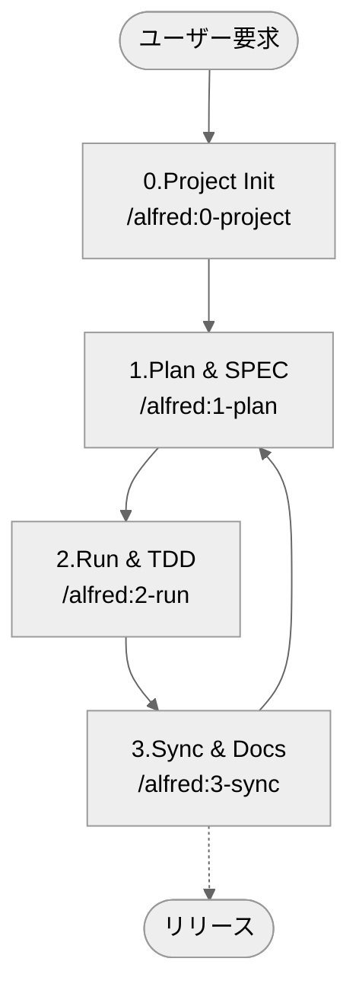
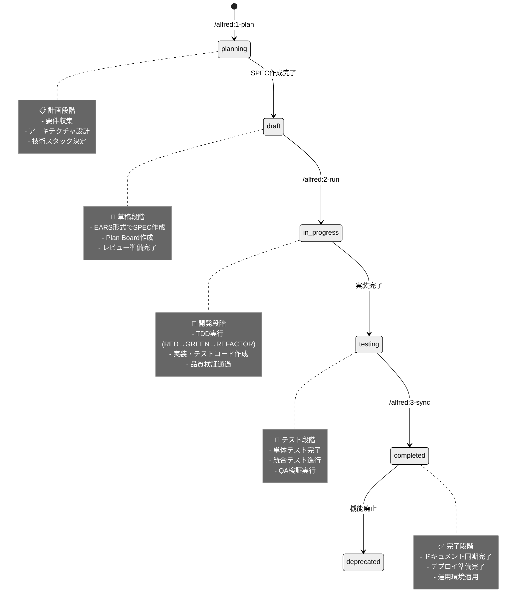

# Alfredコマンドガイド

AlfredはMoAI-ADKのスーパーエージェントで、4つの核心コマンドを通じて開発ワークフローをオーケストレーションします。

## コマンド概要

| コマンド | 段階 | 説明 | 主な機能 | 実行時間 |
|---------|------|------|----------|----------|
| `/alfred:0-project` | 準備 | プロジェクト初期化と設定 | プロジェクトセットアップ、設定収集 | 2-3分 |
| `/alfred:1-plan` | 計画 | SPEC作成と要件定義 | EARS形式SPEC、プランボード作成 | 2分 |
| `/alfred:2-run` | 実行 | TDD実装と品質検証 | RED→GREEN→REFACTORサイクル | 5分 |
| `/alfred:3-sync` | 同期 | ドキュメント同期と整理 | Living Document、TAG検証 | 1分 |

## ワークフロー全体



## 基本使用法

### 1. プロジェクト開始時

```bash
# 初期セットアップ
/alfred:0-project

# 最初の機能計画
/alfred:1-plan "機能説明"

# 実装
/alfred:2-run SPEC-ID

# ドキュメント同期
/alfred:3-sync
```

### 2. 既存プロジェクトの場合

```bash
# 直接機能開発開始
/alfred:1-plan "新しい機能"
/alfred:2-run SPEC-ID
/alfred:3-sync
```

### 3. 設定変更時

```bash
# プロジェクト設定修正
/alfred:0-project setting

# テンプレート最適化
/alfred:0-project update
```

## 状態遷移システム

MoAI-ADKはSPEC文書の**状態遷移**を通じて開発進行状況を体系的に管理します。

### SPEC状態ライフサイクル



## コマンド詳細ガイド

### [/alfred:0-project](0-project.md)
**目的**: プロジェクト初期化と設定管理

**機能**:
- プロジェクトメタデータ収集
- 言語自動検出
- スキルパッケージ推薦
- 設定ファイル生成

**使用時期**:
- 新規プロジェクト作成時
- プロジェクト設定変更時
- テンプレート更新後

### [/alfred:1-plan](1-plan.md)
**目的**: SPEC作成と要件定義

**機能**:
- EARS形式SPEC作成
- プランボード生成
- 専門家コンサルテーション
- ブランチ自動作成

**使用時期**:
- 新機能開発開始時
- 要件変更が必要時
- 計画段階

### [/alfred:2-run](2-run.md)
**目的**: TDD実装と品質保証

**機能**:
- 実装計画立案
- TDDサイクル自動実行
- 品質ゲート検証
- TRUST 5原則適用

**使用時期**:
- 実装段階
- テスト作成時
- コード品質検証時

### [/alfred:3-sync](3-sync.md)
**目的**: ドキュメント同期と状態管理

**機能**:
- Living Document生成
- TAGチェーン検証
- README/CHANGELOG更新
- PR状態管理

**使用時期**:
- 実装完了後
- コミット前
- リリース準備時

## 高度な機能

### フィードバックシステム

```bash
/alfred:9-feedback
```

**機能**:
- GitHub Issue自動作成
- バグ報告
- 機能要求
- 改善提案

### マルチプロジェクト管理

```bash
# 複数プロジェクト状態確認
find ~/projects -name ".moai" -type d | xargs -I {} moai-adk doctor

# 一括アップデート
for project in project1 project2 project3; do
    cd ~/projects/$project
    moai-adk update
done
```

### カスタマイズ

```bash
# 設定カスタマイズ
/alfred:0-project setting

# 言語変更
/alfred:0-project setting
→ "Language & Agent Prompt Language" 選択
→ 新しい言語設定
```

## ベストプラクティス

### 1. 定期的な実行パターン

```bash
# 毎朝
/alfred:1-plan "今日の機能"

# 開発中
/alfred:2-run SPEC-ID

# 作業終了前
/alfred:3-sync
```

### 2. チーム協業

- **SPECレビュー**: `/alfred:1-plan`実行後チームレビュー
- **並列開発**: 複数SPECで同時並行作業
- **品質基準**: TRUST 5原則チーム共通認識

### 3. 効率的なワークフロー

```bash
# 機能開発サイクル
/alfred:1-plan "ユーザー認証"
/alfred:2-run AUTH-001
/alfred:3-sync

# 次の機能
/alfred:1-plan "権限管理"
/alfred:2-run AUTH-002
/alfred:3-sync
```

## トラブルシューティング

### よくある問題

**コマンドが認識されない場合**:
```bash
# Claude Code再起動
exit
claude

# 設定確認
ls .claude/commands/
```

**SPECが作成されない場合**:
```bash
# プロジェクト状態確認
moai-adk doctor

# 再初期化
/alfred:0-project
```

**TDDが失敗する場合**:
```bash
# 依存関係確認
uv sync

# 手動テスト実行
pytest tests/ -v
```

## パフォーマンス最適化

### 実行時間短縮

- **並列処理**: 複数SPECで同時実行
- **キャッシュ活用**: 以前の結果再利用
- ** selective実行**: 必要な部分のみ実行

### リソース管理

- **メモリ使用量**: 大規模プロジェクトで分割実行
- **コンテキスト制限**: 不要なコンテキスト削除
- **一時ファイル**: 定期的な整理

## 統合と拡張

### 外部ツール連携

- **GitHub**: Issue/PR自動連携
- **CI/CD**: テスト自動実行
- **ドキュメント**: 自動デプロイ

### カスタムスキル

```bash
# スキル検索
ls .claude/skills/

# カスタムスキル追加
# .claude/skills/custom/に新規ファイル作成
```

---

**📚 次は個別コマンド詳細ガイドを参照してください**:

- [0-project詳細](0-project.md) - プロジェクト初期化と設定
- [1-plan詳細](1-plan.md) - SPEC作成と計画
- [2-run詳細](2-run.md) - TDD実装と品質保証
- [3-sync詳細](3-sync.md) - ドキュメント同期と管理