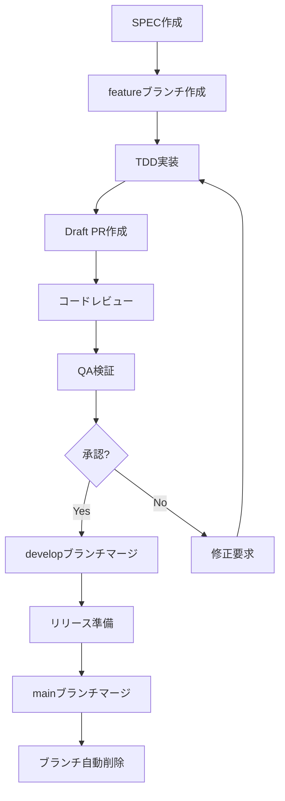
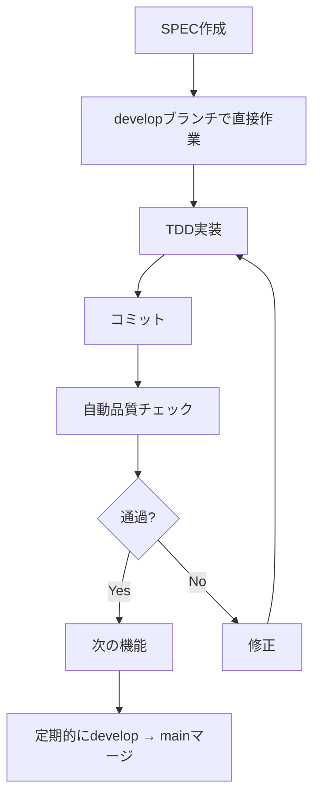

# プロジェクト設定完全ガイド

MoAI-ADKプロジェクトのすべての設定オプションを詳細に説明するガイドです。言語設定からGitHub統合、エージェント最適化、カスタマイズ設定まで、プロジェクト設定のあらゆる側面をカバーします。

## 目次

01. [概要](#概要)
02. [コア設定ファイル](#コア設定ファイル)
03. [言語およびローカライゼーション設定](#言語およびローカライゼーション設定)
04. [プロジェクトメタデータ設定](#プロジェクトメタデータ設定)
05. [GitHub統合設定](#github統合設定)
06. [レポート生成制御](#レポート生成制御)
07. [Gitワークフロー設定](#gitワークフロー設定)
08. [Hook設定最適化](#hook設定最適化)
09. [エージェント設定](#エージェント設定)
10. [TAGシステム設定](#tagシステム設定)
11. [TRUST 5原則設定](#trust-5原則設定)
12. [カスタマイズ設定](#カスタマイズ設定)
13. [設定ファイルのバックアップと復元](#設定ファイルのバックアップと復元)
14. [設定最適化戦略](#設定最適化戦略)
15. [トラブルシューティング](#トラブルシューティング)

## 概要

MoAI-ADKの設定システムは柔軟性と拡張性を中心に設計されています。単純な環境設定を超えて、AIエージェントの動作方式、開発ワークフロー、チーム協働方式まで、すべてを制御できます。

### 設定システムのコア原則

1. **階層構造**: デフォルト値 → プロジェクト設定 → ユーザーカスタマイズ
2. **自動検出**: 可能な限り多くの設定を自動的に検出
3. **段階的公開**: 必要な設定のみを公開し、複雑さを最小化
4. **安全なデフォルト値**: セキュリティと安定性を優先するデフォルト設定
5. **チーム互換性**: 個人設定がチーム標準を損なわない

### 設定ファイル構造

```
.moai/
├── config.json              # メイン設定ファイル
├── user-config.json         # ユーザー個人設定（オプション）
├── team-config.json         # チーム共通設定（オプション）
└── environment-config.json  # 環境別設定（オプション）

.claude/
├── settings.json            # Claude Code設定
├── mcp.json                 # MCPサーバー設定
└── permissions.json         # 権限設定（オプション）
```

## コア設定ファイル

### `.moai/config.json` - メイン設定ファイル

プロジェクトのすべてのコア設定を管理するファイルです。

```json
{
  "version": "0.17.0",
  "moai": {
    "version": "0.17.0",
    "template_version": "0.17.0",
    "optimized": false,
    "auto_update": true
  },
  "language": {
    "conversation_language": "ko",
    "conversation_language_name": "한국어",
    "code_language": "python",
    "locale": "ko-KR",
    "timezone": "Asia/Seoul"
  },
  "project": {
    "name": "my-awesome-project",
    "description": "AIベースの革新的なプロジェクト",
    "owner": "username",
    "team": "development-team",
    "mode": "personal",
    "created_at": "2025-11-06T10:00:00Z",
    "updated_at": "2025-11-06T15:30:00Z",
    "domains": ["backend", "api", "database"],
    "tags": ["fastapi", "postgresql", "docker"],
    "visibility": "private"
  },
  "github": {
    "enabled": true,
    "repository": "username/my-awesome-project",
    "default_branch": "main",
    "auto_delete_branches": true,
    "spec_git_workflow": "feature_branch",
    "require_review": true,
    "auto_merge": false,
    "issue_sync": true,
    "release_automation": true
  },
  "report_generation": {
    "enabled": true,
    "level": "minimal",
    "formats": ["markdown"],
    "auto_commit": true,
    "include_metrics": true,
    "include_changelog": true,
    "max_file_size_kb": 100
  },
  "hooks": {
    "timeout_seconds": 5,
    "auto_checkpoint": true,
    "risk_detection": true,
    "tag_validation": true,
    "auto_linting": true,
    "session_recording": true
  },
  "tags": {
    "policy": "strict",
    "auto_validation": true,
    "format": "@TYPE:DOMAIN-NNN",
    "required_types": ["SPEC", "TEST", "CODE", "DOC"],
    "auto_assignment": true,
    "orphan_detection": true
  },
  "constitution": {
    "trust_principles": true,
    "tdd_workflow": true,
    "spec_first": true,
    "code_review_required": false,
    "documentation_required": true
  },
  "ai": {
    "default_model": "claude-3-5-sonnet-20241022",
    "fast_model": "claude-3-5-haiku-20241022",
    "max_tokens": 100000,
    "temperature": 0.1,
    "timeout": 300,
    "retry_attempts": 3
  },
  "security": {
    "scan_dependencies": true,
    "scan_secrets": true,
    "require_authentication": false,
    "audit_log": true,
    "encryption_at_rest": false
  },
  "performance": {
    "parallel_processing": true,
    "cache_enabled": true,
    "cache_ttl": 3600,
    "memory_limit_mb": 1024,
    "concurrent_agents": 3
  }
}
```

### `.claude/settings.json` - Claude Code設定

Claude Codeの動作方式を制御する設定ファイルです。

```json
{
  "models": {
    "default": "claude-3-5-sonnet-20241022",
    "fast": "claude-3-5-haiku-20241022",
    "reasoning": "claude-3-5-sonnet-20241022"
  },
  "permissions": {
    "allow": [
      "Read(*)",
      "Write(src/*, tests/*, docs/*, .moai/*)",
      "Bash(git status, git log, git diff, pytest, python, uv, node, npm)",
      "Grep(*), Glob(*), Edit(*), Bash(*, cd, ls, mkdir, echo, cat)"
    ],
    "ask": [
      "Bash(git push, git merge, git pull, rm -rf)",
      "Write(.claude/*, .moai/config.json, .env*)",
      "Bash(sudo, docker exec)"
    ],
    "deny": [
      "Bash(sudo rm, dd, mkfs, format)",
      "Write(*.key, *.pem, id_rsa)",
      "Bash(curl -X DELETE, wget -qO-)"
    ]
  },
  "hooks": {
    "SessionStart": ["alfred-hooks"],
    "PreToolUse": ["alfred-hooks"],
    "UserPromptSubmit": ["alfred-hooks"],
    "PostToolUse": ["alfred-hooks"],
    "SessionEnd": ["alfred-hooks"],
    "timeout": 5
  },
  "environment": {
    "PYTHONPATH": "${CLAUDE_PROJECT_DIR}/src",
    "MOAI_PROJECT_ROOT": "${CLAUDE_PROJECT_DIR}",
    "PATH": "${CLAUDE_PROJECT_DIR}/.venv/bin:${PATH}"
  },
  "ui": {
    "theme": "dark",
    "font_size": 14,
    "line_numbers": true,
    "word_wrap": true,
    "auto_save": true
  },
  "features": {
    "auto_completion": true,
    "syntax_highlighting": true,
    "inline_errors": true,
    "quick_actions": true
  },
  "experimental": {
    "multimodal": false,
    "advanced_reasoning": true,
    "context_compression": true
  }
}
```

## 言語およびローカライゼーション設定

### 言語設定オプション

#### conversation_language（会話言語）

Alfredとのすべてのインタラクションに使用される言語です。

```json
{
  "language": {
    "conversation_language": "ko",
    "conversation_language_name": "한국어",
    "supported_languages": {
      "ko": "한국어",
      "en": "English",
      "ja": "日本語",
      "zh": "中文",
      "es": "Español"
    }
  }
}
```

**サポートされる言語**:

| コード | 言語     | サポートレベル | 備考                      |
| ------ | -------- | -------------- | ------------------------- |
| ko     | 한국어   | 完全           | デフォルト言語            |
| en     | English  | 完全           | グローバル標準            |
| ja     | 日本語   | 完全           | 日本語サポート            |
| zh     | 中文     | 完全           | 中国語簡体字/繁体字サポート |
| es     | Español  | 完全           | スペイン語サポート        |
| fr     | Français | 部分的         | フランス語（開発中）      |
| de     | Deutsch  | 部分的         | ドイツ語（開発中）        |

#### code_language（プログラミング言語）

プロジェクトの主要プログラミング言語設定です。

```json
{
  "language": {
    "code_language": "python",
    "auto_detection": true,
    "fallback": "python",
    "multi_language": {
      "enabled": false,
      "primary": "python",
      "secondary": ["javascript", "sql"]
    }
  }
}
```

**サポートされるプログラミング言語**:

| 言語       | 自動検出ファイル                       | デフォルトツール          | テンプレートサポート                       |
| ---------- | -------------------------------------- | ------------------------- | ------------------------------------------ |
| python     | pyproject.toml, setup.py, requirements.txt | pytest, ruff, mypy        | ✅                                         |
| javascript | package.json, yarn.lock                | jest, eslint, prettier    | ✅                                         |
| typescript | tsconfig.json, package.json            | typescript, eslint, prettier | ✅                                         |
| go         | go.mod, go.sum                         | go test, golint, gofmt    | ✅                                         |
| rust       | Cargo.toml                             | cargo test, clippy, rustfmt | ✅                                         |
| java       | pom.xml, build.gradle                  | junit, maven, gradle      | ✅                                         |
| kotlin     | build.gradle.kts                       | junit, ktlint             | ✅                                         |
| ruby       | Gemfile                                | rspec, rubocop            | ✅                                         |
| php        | composer.json                          | phpunit, phpstan          | ✅                                         |
| csharp     | \*.csproj, \*.sln                      | xunit, dotnet             | ✅                                         |
| sql        | \*.sql, schema.sql                     | -                         | <span class="material-icons">warning</span> 制限付き |

#### locale設定

ローカライゼーションに関連するフォーマットルールを設定します。

```json
{
  "language": {
    "locale": "ko-KR",
    "timezone": "Asia/Seoul",
    "date_format": "YYYY-MM-DD",
    "time_format": "HH:mm:ss",
    "currency": "KRW",
    "number_format": {
      "decimal_separator": ".",
      "thousands_separator": ","
    }
  }
}
```

### 言語設定の最適化

#### 自動言語検出

```python
# .claude/hooks/alfred/utils/language_detector.py
import os
from pathlib import Path

def detect_project_language(project_dir: Path) -> dict:
    """プロジェクト言語の自動検出"""
    indicators = {
        'python': ['pyproject.toml', 'setup.py', 'requirements.txt', 'Pipfile'],
        'javascript': ['package.json', 'yarn.lock', 'package-lock.json'],
        'typescript': ['tsconfig.json', 'package.json'],
        'go': ['go.mod', 'go.sum'],
        'rust': ['Cargo.toml'],
        'java': ['pom.xml', 'build.gradle'],
        'ruby': ['Gemfile', 'Rakefile'],
        'php': ['composer.json', 'composer.lock']
    }

    project_files = os.listdir(project_dir)

    for language, files in indicators.items():
        if any(file in project_files for file in files):
            return {
                'detected_language': language,
                'confidence': 'high',
                'indicators': [f for f in files if f in project_files]
            }

    return {'detected_language': 'python', 'confidence': 'low'}
```

#### 多言語プロジェクト設定

```json
{
  "language": {
    "multi_language": {
      "enabled": true,
      "primary": "python",
      "secondary": ["javascript", "sql"],
      "bridging": {
        "enabled": true,
        "apis": ["grpc", "rest"],
        "data_formats": ["json", "protobuf"]
      }
    },
    "documentation": {
      "primary": "ko",
      "secondary": ["en"],
      "auto_translation": false
    }
  }
}
```

## プロジェクトメタデータ設定

### 基本プロジェクト情報

```json
{
  "project": {
    "name": "my-awesome-project",
    "display_name": "My Awesome Project",
    "description": "AIベースの革新的なWebアプリケーション",
    "short_description": "AI-powered web application",
    "version": "1.0.0",
    "owner": "username",
    "team": "development-team",
    "organization": "company-name",
    "license": "MIT",
    "homepage": "https://github.com/username/my-awesome-project",
    "repository": "https://github.com/username/my-awesome-project.git",
    "documentation": "https://docs.my-awesome-project.com",
    "created_at": "2025-11-06T10:00:00Z",
    "updated_at": "2025-11-06T15:30:00Z"
  }
}
```

### プロジェクト分類

```json
{
  "project": {
    "type": "web-api",
    "category": "backend",
    "domains": ["backend", "api", "database", "security"],
    "tags": ["fastapi", "postgresql", "docker", "jwt", "rest"],
    "technologies": [
      {
        "name": "Python",
        "version": "3.13",
        "type": "language"
      },
      {
        "name": "FastAPI",
        "version": "0.104",
        "type": "framework"
      },
      {
        "name": "PostgreSQL",
        "version": "15",
        "type": "database"
      }
    ],
    "platforms": ["linux", "macos", "windows"],
    "target_environments": ["development", "staging", "production"]
  }
}
```

### プロジェクトモード設定

```json
{
  "project": {
    "mode": "team",
    "visibility": "private",
    "access_level": "internal",
    "collaboration": {
      "enabled": true,
      "team_size": 5,
      "review_policy": "required",
      "approval_policy": "majority"
    },
    "compliance": {
      "standards": ["ISO27001", "SOC2"],
      "audit_required": true,
      "data_classification": "confidential"
    }
  }
}
```

**プロジェクトモードの種類**:

| モード      | 説明                   | 適した状況       | 特徴                           |
| ----------- | ---------------------- | ---------------- | ------------------------------ |
| personal    | 個人プロジェクト       | 個人開発、学習   | シンプルな設定、素早いスタート |
| team        | チームプロジェクト     | 小規模チーム開発 | コラボレーション機能、コードレビュー |
| enterprise  | エンタープライズプロジェクト | 大規模組織       | セキュリティ、規制遵守、監査   |
| open-source | オープンソースプロジェクト | 公開プロジェクト | コミュニティ、透明性、ライセンス |

## GitHub統合設定

### 基本GitHub設定

```json
{
  "github": {
    "enabled": true,
    "repository": "username/my-awesome-project",
    "owner": "username",
    "default_branch": "main",
    "protected_branches": ["main", "develop"],
    "auto_delete_branches": true,
    "require_review": true,
    "auto_merge": false,
    "sync_issues": true,
    "sync_projects": true
  }
}
```

### Gitワークフロー設定

```json
{
  "github": {
    "spec_git_workflow": "feature_branch",
    "branch_strategy": {
      "main": {
        "protected": true,
        "require_reviews": 2,
        "require_status_checks": ["ci/cd", "quality-gate"],
        "enforce_admins": true
      },
      "develop": {
        "protected": false,
        "auto_merge": true,
        "require_status_checks": ["lint", "test"]
      },
      "feature": {
        "naming_pattern": "feature/{spec-id}-{description}",
        "auto_create": true,
        "from_spec": true
      }
    },
    "pull_request": {
      "template": ".github/PULL_REQUEST_TEMPLATE.md",
      "auto_assign_reviewers": true,
      "reviewers": ["team-lead", "senior-dev"],
      "require_up_to_date": true
    }
  }
}
```

**Gitワークフローオプション**:

| ワークフロー   | 説明                         | ブランチ戦略                                | PRポリシー   |
| -------------- | ---------------------------- | ------------------------------------------- | ------------ |
| develop_direct | developブランチに直接コミット | develop → main                              | Draft PR     |
| feature_branch | 機能別ブランチ作成           | feature → develop → main                    | Full PR      |
| release_branch | リリースブランチ使用         | feature → develop → release → main          | Full PR + QA |
| gitflow        | 従来のGitFlow                | feature → develop → release → main → hotfix | Complex PR   |

### GitHub Actions統合

```json
{
  "github": {
    "actions": {
      "enabled": true,
      "workflows": [
        {
          "name": "ci.yml",
          "triggers": ["push", "pull_request"],
          "jobs": ["lint", "test", "build", "security-scan"]
        },
        {
          "name": "release.yml",
          "triggers": ["push:tags"],
          "jobs": ["build", "test", "publish", "deploy"]
        },
        {
          "name": "spec-sync.yml",
          "triggers": ["pull_request:opened", "pull_request:synchronize"],
          "jobs": ["spec-validation", "issue-sync"]
        }
      ],
      "secrets": {
        "required": ["GH_TOKEN", "DOCKER_REGISTRY_TOKEN"],
        "optional": ["SLACK_WEBHOOK", "NOTIFICATION_EMAIL"]
      }
    }
  }
}
```

### イシューおよびプロジェクト管理

```json
{
  "github": {
    "issue_management": {
      "auto_sync": true,
      "spec_to_issue": true,
      "labels": {
        "spec": ["spec", "planning"],
        "bug": ["bug", "priority-high"],
        "feature": ["enhancement", "priority-medium"],
        "documentation": ["documentation", "good-first-issue"]
      },
      "templates": {
        "bug_report": ".github/ISSUE_TEMPLATE/bug_report.md",
        "feature_request": ".github/ISSUE_TEMPLATE/feature_request.md",
        "spec": ".github/ISSUE_TEMPLATE/spec.md"
      }
    },
    "project_management": {
      "boards": ["Development", "Backlog", "In Review", "Done"],
      "auto_update": true,
      "sync_with_spec": true
    }
  }
}
```

## レポート生成制御

### レポート生成設定

```json
{
  "report_generation": {
    "enabled": true,
    "level": "minimal",
    "formats": ["markdown", "html"],
    "output_directory": ".moai/reports",
    "auto_commit": true,
    "schedule": {
      "enabled": false,
      "frequency": "weekly",
      "day": "friday",
      "time": "17:00"
    },
    "triggers": {
      "on_sync": true,
      "on_completion": true,
      "on_release": true,
      "manual_only": false
    }
  }
}
```

### レポートレベル設定

| レベル        | 説明                   | 生成されるレポート     | トークン使用量 |
| ------------- | ---------------------- | ---------------------- | -------------- |
| disable       | レポート生成なし       | なし                   | 0%             |
| minimal       | 最小限のレポートのみ   | 同期サマリー、TAG状態  | 20%            |
| standard      | 標準レポート           | 同期、品質、カバレッジ | 60%            |
| comprehensive | すべてのレポート       | すべての分析、推奨、予測 | 100%           |

#### Minimalレベルレポート

```markdown
# 同期レポート - 2025-11-06

## サマリー
- 同期されたSPEC: 3個
- 生成されたTAG: 12個
- 品質検証: 通過

## 変更内容
- AUTH-001: ユーザー認証完了
- USER-002: ユーザー管理実装中
- API-003: APIドキュメント更新

## 次のステップ
- USER-002実装完了
- API-003レビュー必要
```

#### Standardレベルレポート

```markdown
# プロジェクト詳細レポート - 2025-11-06

## プロジェクト概要
- 名前: My Awesome Project
- バージョン: 1.0.0
- 状態: 開発中

## 品質指標
- テストカバレッジ: 87.5%
- コード品質スコア: 92/100
- セキュリティスコア: 95/100

## SPEC状態
| ID | タイトル | 状態 | 進捗率 |
|----|----------|------|--------|
| AUTH-001 | ユーザー認証 | completed | 100% |
| USER-002 | ユーザー管理 | in_progress | 75% |
| API-003 | APIドキュメント | draft | 30% |

## 推奨事項
1. USER-002のテストカバレッジ増加が必要
2. API-003の受け入れ基準の明確化が必要
3. セキュリティレビューサイクルの短縮を推奨
```

### レポート形式設定

```json
{
  "report_generation": {
    "formats": {
      "markdown": {
        "enabled": true,
        "template": "default",
        "include_toc": true,
        "include_charts": false
      },
      "html": {
        "enabled": true,
        "theme": "light",
        "include_interactive_charts": true,
        "export_to_pdf": false
      },
      "json": {
        "enabled": true,
        "pretty_print": true,
        "include_metadata": true
      },
      "csv": {
        "enabled": false,
        "include_metrics_only": true
      }
    }
  }
}
```

## Gitワークフロー設定

### ワークフロー戦略の選択

```json
{
  "github": {
    "spec_git_workflow": "feature_branch",
    "workflow_config": {
      "auto_create_branches": true,
      "branch_naming": "feature/{domain}-{id}",
      "auto_create_pr": true,
      "pr_template": "spec_template",
      "require_review": true,
      "auto_merge": false,
      "auto_delete_branches": true
    }
  }
}
```

### ブランチ戦略詳細

#### Feature Branchワークフロー



```json
{
  "github": {
    "workflow": "feature_branch",
    "branches": {
      "main": {
        "protection": {
          "enabled": true,
          "required_status_checks": {
            "strict": true,
            "contexts": ["ci/cd", "quality-gate", "security-scan"]
          },
          "enforce_admins": true,
          "required_pull_request_reviews": {
            "required_approving_review_count": 2,
            "dismiss_stale_reviews": true,
            "require_code_owner_reviews": true
          }
        }
      },
      "develop": {
        "protection": {
          "enabled": false,
          "required_status_checks": {
            "contexts": ["lint", "test"]
          }
        }
      },
      "feature": {
        "pattern": "feature/{domain}-{id}",
        "auto_create": true,
        "source_branch": "develop",
        "delete_after_merge": true
      }
    }
  }
}
```

#### Develop Directワークフロー



```json
{
  "github": {
    "workflow": "develop_direct",
    "settings": {
      "main_branch": "main",
      "develop_branch": "develop",
      "sync_schedule": "daily",
      "auto_merge_develop_to_main": false,
      "require_manual_review_for_main": true
    },
    "quality_gates": {
      "test_coverage_threshold": 85,
      "code_quality_threshold": 90,
      "security_scan_required": true
    }
  }
}
```

### コミットメッセージ設定

```json
{
  "github": {
    "commit_convention": "conventional_commits",
    "commit_templates": {
      "feature": "feat({scope}): {description}",
      "fix": "fix({scope}): {description}",
      "refactor": "refactor({scope}): {description}",
      "test": "test({scope}): {description}",
      "docs": "docs({scope}): {description}",
      "chore": "chore({scope}): {description}"
    },
    "auto_tag_commits": true,
    "require_issue_link": false,
    "max_commit_message_length": 72
  }
}
```

## Hook設定最適化

### Hookシステム概要

MoAI-ADKのHookシステムは、開発フローのすべての段階で自動的に動作して生産性を向上させ、品質を保証します。

```json
{
  "hooks": {
    "timeout_seconds": 5,
    "enabled_hooks": {
      "SessionStart": {
        "enabled": true,
        "actions": ["project_summary", "context_loading", "version_check"],
        "priority": "high"
      },
      "PreToolUse": {
        "enabled": true,
        "actions": ["risk_detection", "checkpoint_creation", "tag_validation"],
        "priority": "critical"
      },
      "UserPromptSubmit": {
        "enabled": true,
        "actions": ["jit_context_loading", "intent_analysis"],
        "priority": "medium"
      },
      "PostToolUse": {
        "enabled": true,
        "actions": ["auto_linting", "test_execution", "change_detection"],
        "priority": "medium"
      },
      "SessionEnd": {
        "enabled": true,
        "actions": ["session_summary", "context_persistence", "cleanup"],
        "priority": "low"
      }
    },
    "auto_checkpoint": {
      "enabled": true,
      "triggers": [
        "file_deletion",
        "large_file_modification",
        "config_changes",
        "git_merge_operations"
      ],
      "max_checkpoints": 10,
      "retention_days": 30
    }
  }
}
```

### SessionStart Hook

```python
# .claude/hooks/alfred/session_start.py
import json
import os
from datetime import datetime
from pathlib import Path

def main():
    """セッション開始時のプロジェクト状態サマリー"""
    project_dir = os.environ.get('CLAUDE_PROJECT_DIR')
    config_path = Path(project_dir) / '.moai' / 'config.json'

    if config_path.exists():
        with open(config_path) as f:
            config = json.load(f)

        # プロジェクト情報出力
        print(f"📋 プロジェクト: {config['project']['name']}")
        print(f"🌍 言語: {config['language']['conversation_language_name']}")
        print(f"👤 オーナー: {config['project']['owner']}")
        print(f"⚙️ モード: {config['project']['mode']}")

        # SPEC状態サマリー
        specs_dir = Path(project_dir) / '.moai' / 'specs'
        if specs_dir.exists():
            spec_count = len([d for d in specs_dir.iterdir() if d.is_dir()])
            print(f"📄 SPECドキュメント: {spec_count}個")

        # Git状態確認
        os.system('git status --porcelain | wc -l | xargs echo "🔄 変更されたファイル:"')

        # 最近のアクティビティ
        print(f"🕐 最終更新: {config['project']['updated_at']}")
        print("✅ Alfred準備完了")

if __name__ == "__main__":
    main()
```

### PreToolUse Hook

```python
# .claude/hooks/alfred/pre_tool_use.py
import json
import os
import re
from pathlib import Path

def check_risk(operation: str, target: str) -> dict:
    """リスク評価"""
    risk_patterns = {
        'high': [r'rm\s+-rf', r'sudo', r'format', r'dd\s+if='],
        'medium': [r'git\s+push\s+--force', r'merge', r'reset'],
        'low': [r'rm\s+', r'chmod', r'chown']
    }

    for risk_level, patterns in risk_patterns.items():
        for pattern in patterns:
            if re.search(pattern, operation, re.IGNORECASE):
                return {'level': risk_level, 'pattern': pattern}

    return {'level': 'safe'}

def validate_tags(file_path: str) -> list:
    """TAG欠落検証"""
    if not file_path.endswith(('.py', '.js', '.ts', '.md')):
        return []

    with open(file_path, 'r') as f:
        content = f.read()

    # TAGパターン検索
    tag_pattern = r'@(SPEC|TEST|CODE|DOC):[A-Z]+-\d+'
    tags = re.findall(tag_pattern, content)

    if not tags:
        file_type = file_path.split('/')[-2]  # src/, tests/, docs/
        expected_tag = {
            'src': '@CODE:',
            'tests': '@TEST:',
            'docs': '@DOC:',
            '.moai/specs': '@SPEC:'
        }.get(file_type, '')

        return [f"⚠️ TAG欠落: {file_path} (期待: {expected_tag})"]

    return []

def main():
    """PreToolUse Hookメインロジック"""
    tool_name = os.environ.get('CLAUDE_TOOL_NAME')
    tool_args = os.environ.get('CLAUDE_TOOL_ARGS', '')
    project_dir = os.environ.get('CLAUDE_PROJECT_DIR')

    # リスク評価
    risk = check_risk(tool_name, tool_args)
    if risk['level'] in ['high', 'medium']:
        print(f"⚠️ リスク検出: {risk['level']} - {risk['pattern']}")
        if risk['level'] == 'high':
            response = input("続行しますか? (y/N): ")
            if response.lower() != 'y':
                exit(1)

    # TAG検証（ファイル修正時）
    if tool_name in ['Write', 'Edit']:
        file_path = tool_args.split()[0] if tool_args else ''
        full_path = Path(project_dir) / file_path

        if full_path.exists():
            tag_issues = validate_tags(str(full_path))
            for issue in tag_issues:
                print(issue)

if __name__ == "__main__":
    main()
```

### PostToolUse Hook

```python
# .claude/hooks/alfred/post_tool_use.py
import json
import os
import subprocess
from pathlib import Path

def run_linting(file_path: str) -> dict:
    """ファイルタイプに応じた自動リンティング実行"""
    if file_path.endswith('.py'):
        return run_python_linting(file_path)
    elif file_path.endswith(('.js', '.ts')):
        return run_js_linting(file_path)
    elif file_path.endswith(('.go')):
        return run_go_linting(file_path)

    return {'status': 'skipped', 'reason': 'unsupported_file_type'}

def run_python_linting(file_path: str) -> dict:
    """Pythonファイルリンティング"""
    try:
        # ruffフォーマット
        result = subprocess.run(['ruff', 'format', file_path],
                              capture_output=True, text=True)

        if result.returncode != 0:
            return {'status': 'error', 'message': result.stderr}

        # ruffリンティング
        result = subprocess.run(['ruff', 'check', '--fix', file_path],
                              capture_output=True, text=True)

        if result.returncode != 0:
            return {'status': 'warning', 'message': result.stderr}

        return {'status': 'success', 'message': 'フォーマットとリンティング完了'}

    except FileNotFoundError:
        return {'status': 'skipped', 'reason': 'ruff_not_installed'}

def run_tests_if_needed(file_path: str) -> dict:
    """関連テストの自動実行"""
    if 'tests' not in file_path:
        return {'status': 'skipped', 'reason': 'not_test_file'}

    try:
        # テストファイル実行
        result = subprocess.run(['pytest', file_path, '-v'],
                              capture_output=True, text=True)

        return {
            'status': 'success' if result.returncode == 0 else 'failed',
            'output': result.stdout,
            'errors': result.stderr
        }

    except FileNotFoundError:
        return {'status': 'skipped', 'reason': 'pytest_not_installed'}

def main():
    """PostToolUse Hookメインロジック"""
    tool_name = os.environ.get('CLAUDE_TOOL_NAME')
    tool_args = os.environ.get('CLAUDE_TOOL_ARGS', '')
    project_dir = os.environ.get('CLAUDE_PROJECT_DIR')

    if tool_name in ['Write', 'Edit']:
        file_path = tool_args.split()[0] if tool_args else ''
        full_path = Path(project_dir) / file_path

        if full_path.exists():
            # 自動リンティング
            lint_result = run_linting(file_path)
            if lint_result['status'] == 'success':
                print(f"✨ {lint_result['message']}")

            # テスト実行（テストファイルの場合）
            if 'tests' in file_path:
                test_result = run_tests_if_needed(file_path)
                if test_result['status'] == 'success':
                    print(f"✅ テスト合格")
                else:
                    print(f"❌ テスト失敗")

if __name__ == "__main__":
    main()
```

## エージェント設定

### AIモデル設定

```json
{
  "ai": {
    "default_model": "claude-3-5-sonnet-20241022",
    "fast_model": "claude-3-5-haiku-20241022",
    "reasoning_model": "claude-3-5-sonnet-20241022",
    "multimodal_model": "claude-3-5-sonnet-20241022",
    "models": {
      "claude-3-5-sonnet-20241022": {
        "context_window": 200000,
        "max_output_tokens": 8192,
        "temperature": 0.1,
        "timeout": 300,
        "retry_attempts": 3,
        "cost_per_input_token": 0.000003,
        "cost_per_output_token": 0.000015
      },
      "claude-3-5-haiku-20241022": {
        "context_window": 200000,
        "max_output_tokens": 4096,
        "temperature": 0.0,
        "timeout": 120,
        "retry_attempts": 2,
        "cost_per_input_token": 0.00000025,
        "cost_per_output_token": 0.00000125
      }
    }
  }
}
```

### エージェント別設定

```json
{
  "agents": {
    "project_manager": {
      "model": "claude-3-5-sonnet-20241022",
      "temperature": 0.1,
      "max_tokens": 4000,
      "timeout": 180,
      "skills": ["project-init", "language-detection", "skill-recommendation"],
      "memory_retention": "session"
    },
    "spec_builder": {
      "model": "claude-3-5-sonnet-20241022",
      "temperature": 0.2,
      "max_tokens": 6000,
      "timeout": 240,
      "skills": ["ears-authoring", "requirement-analysis", "plan-board"],
      "expertise_domains": ["requirements-engineering", "system-design"]
    },
    "code_builder": {
      "model": "claude-3-5-sonnet-20241022",
      "temperature": 0.1,
      "max_tokens": 8000,
      "timeout": 300,
      "skills": ["tdd-implementation", "architecture-design", "code-review"],
      "sub_agents": ["implementation-planner", "tdd-implementer"]
    },
    "doc_syncer": {
      "model": "claude-3-5-haiku-20241022",
      "temperature": 0.0,
      "max_tokens": 4000,
      "timeout": 120,
      "skills": ["documentation-generation", "markdown-formatting", "api-docs"],
      "auto_sync": true
    }
  }
}
```

### エキスパートエージェント設定

```json
{
  "expert_agents": {
    "backend_expert": {
      "enabled": true,
      "auto_activate": ["backend", "api", "server", "database"],
      "model": "claude-3-5-sonnet-20241022",
      "expertise": ["system-design", "scalability", "performance", "security"],
      "skills": ["api-design", "database-design", "caching-strategies", "microservices"],
      "response_style": "detailed",
      "code_examples": true
    },
    "frontend_expert": {
      "enabled": true,
      "auto_activate": ["frontend", "ui", "component", "client-side"],
      "model": "claude-3-5-sonnet-20241022",
      "expertise": ["react", "vue", "angular", "css", "accessibility"],
      "skills": ["component-design", "state-management", "performance-optimization"],
      "response_style": "practical",
      "include_ui_mockups": true
    },
    "security_expert": {
      "enabled": true,
      "auto_activate": ["security", "authentication", "authorization", "vulnerability"],
      "model": "claude-3-5-sonnet-20241022",
      "expertise": ["owasp-top-10", "encryption", "authentication", "audit"],
      "skills": ["threat-modeling", "security-review", "compliance"],
      "response_style": "cautious",
      "require_approval": false
    }
  }
}
```

### エージェント最適化設定

```json
{
  "agent_optimization": {
    "parallel_processing": true,
    "max_concurrent_agents": 3,
    "agent_timeout": 300,
    "memory_management": {
      "context_compression": true,
      "max_context_size": 150000,
      "priority_cutoff": 0.7
    },
    "cost_optimization": {
      "use_fast_model_for_simple_tasks": true,
      "cache_agent_responses": true,
      "cache_ttl": 3600,
      "max_cache_size_mb": 100
    },
    "performance_monitoring": {
      "track_response_times": true,
      "track_token_usage": true,
      "alert_on_slow_responses": true,
      "slow_response_threshold": 30
    }
  }
}
```

## TAGシステム設定

### TAGポリシー設定

```json
{
  "tags": {
    "policy": "strict",
    "format": "@TYPE:DOMAIN-NNN",
    "required_types": ["SPEC", "TEST", "CODE", "DOC"],
    "auto_assignment": true,
    "validation": {
      "enabled": true,
      "enforce_uniqueness": true,
      "check_format": true,
      "validate_domain": true
    },
    "domains": {
      "AUTH": "認証および認可",
      "USER": "ユーザー管理",
      "API": "APIエンドポイント",
      "DB": "データベース",
      "UI": "ユーザーインターフェース",
      "SEC": "セキュリティ",
      "PERF": "パフォーマンス",
      "DOCS": "ドキュメント"
    }
  }
}
```

### TAG生成ルール

```json
{
  "tag_generation": {
    "auto_increment": true,
    "domain_reset": false,
    "padding": 3,
    "separator": "-",
    "examples": {
      "SPEC": "@SPEC:AUTH-001",
      "TEST": "@TEST:AUTH-001",
      "CODE": "@CODE:AUTH-001:SERVICE",
      "DOC": "@DOC:AUTH-001:API"
    }
  },
  "tag_mapping": {
    "file_patterns": {
      "src/**/*.py": "@CODE",
      "tests/**/*.py": "@TEST",
      "docs/**/*.md": "@DOC",
      ".moai/specs/**/spec.md": "@SPEC"
    },
    "content_patterns": {
      "test_*.py": "@TEST",
      "*_test.py": "@TEST",
      "conftest.py": "@TEST",
      "README.md": "@DOC",
      "CHANGELOG.md": "@DOC"
    }
  }
}
```

### TAG検証設定

```python
# .claude/hooks/alfred/core/tag_validator.py
import re
import json
from pathlib import Path
from typing import Dict, List, Optional

class TagValidator:
    def __init__(self, config_path: str):
        with open(config_path) as f:
            self.config = json.load(f)
        self.tag_policy = self.config.get('tags', {})

    def validate_tag_format(self, tag: str) -> Dict:
        """TAG形式検証"""
        pattern = self.tag_policy.get('format', r'@[A-Z]+:[A-Z]+-\d+')

        if not re.match(pattern, tag):
            return {
                'valid': False,
                'error': f'無効な形式です。期待される形式: {pattern}',
                'tag': tag
            }

        return {'valid': True, 'tag': tag}

    def validate_tag_chain(self, project_dir: Path) -> Dict:
        """TAGチェーンの整合性検証"""
        spec_tags = self._find_tags(project_dir, pattern="@SPEC:")
        test_tags = self._find_tags(project_dir, pattern="@TEST:")
        code_tags = self._find_tags(project_dir, pattern="@CODE:")
        doc_tags = self._find_tags(project_dir, pattern="@DOC:")

        issues = []

        # 各SPECに対応するTEST、CODE、DOCがあるか確認
        for spec_tag in spec_tags:
            spec_id = self._extract_tag_id(spec_tag)

            test_match = any(spec_id in tag for tag in test_tags)
            code_match = any(spec_id in tag for tag in code_tags)
            doc_match = any(spec_id in tag for tag in doc_tags)

            if not test_match:
                issues.append(f"{spec_tag}のTESTタグが不足しています")
            if not code_match:
                issues.append(f"{spec_tag}のCODEタグが不足しています")
            if not doc_match:
                issues.append(f"{spec_tag}のDOCタグが不足しています")

        # 孤立TAG検索
        orphan_tags = []
        all_spec_ids = {self._extract_tag_id(tag) for tag in spec_tags}

        for tag in test_tags + code_tags + doc_tags:
            tag_id = self._extract_tag_id(tag)
            if tag_id not in all_spec_ids:
                orphan_tags.append(tag)

        return {
            'valid': len(issues) == 0,
            'issues': issues,
            'orphan_tags': orphan_tags,
            'total_tags': len(spec_tags + test_tags + code_tags + doc_tags)
        }

    def _find_tags(self, directory: Path, pattern: str) -> List[str]:
        """ディレクトリ内のTAGパターン検索"""
        tags = []
        regex_pattern = re.compile(pattern)

        for file_path in directory.rglob("*"):
            if file_path.is_file() and self._should_search_file(file_path):
                try:
                    with open(file_path, 'r', encoding='utf-8') as f:
                        content = f.read()
                        matches = regex_pattern.findall(content)
                        tags.extend(matches)
                except (UnicodeDecodeError, PermissionError):
                    continue

        return list(set(tags))

    def _should_search_file(self, file_path: Path) -> bool:
        """ファイル検索の可否を決定"""
        exclude_patterns = {
            '.git', '__pycache__', 'node_modules', '.venv',
            '.DS_Store', '*.pyc', '*.log'
        }

        return not any(
            file_path.match(pattern) or pattern in str(file_path)
            for pattern in exclude_patterns
        )

    def _extract_tag_id(self, tag: str) -> str:
        """TAGからIDを抽出"""
        match = re.search(r'@[A-Z]+:([A-Z]+-\d+)', tag)
        return match.group(1) if match else tag
```

## TRUST 5原則設定

### TRUST原則の有効化

```json
{
  "constitution": {
    "trust_principles": {
      "enabled": true,
      "principles": {
        "test_first": {
          "enabled": true,
          "coverage_threshold": 85,
          "required_tests": ["unit", "integration"],
          "frameworks": {
            "python": ["pytest"],
            "javascript": ["jest"],
            "typescript": ["jest", "vitest"],
            "go": ["go test"]
          }
        },
        "readable": {
          "enabled": true,
          "max_function_lines": 50,
          "max_file_lines": 300,
          "naming_convention": "snake_case",
          "require_docstrings": true,
          "comment_coverage": 0.3
        },
        "unified": {
          "enabled": true,
          "architectural_consistency": true,
          "naming_consistency": true,
          "pattern_consistency": true,
          "code_style": "enforced"
        },
        "secured": {
          "enabled": true,
          "security_scan": true,
          "dependency_scan": true,
          "secret_detection": true,
          "input_validation": "required",
          "output_encoding": "required"
        },
        "trackable": {
          "enabled": true,
          "tag_system": "required",
          "git_history": "detailed",
          "change_tracking": "automatic",
          "decision_logging": "required"
        }
      }
    }
  }
}
```

### 品質ゲート設定

```json
{
  "quality_gates": {
    "enabled": true,
    "gates": [
      {
        "name": "code_quality",
        "type": "static_analysis",
        "tools": ["ruff", "mypy", "security-scan"],
        "threshold": {
          "errors": 0,
          "warnings": 10,
          "suggestions": 50
        },
        "blocking": true
      },
      {
        "name": "test_coverage",
        "type": "test_analysis",
        "tools": ["pytest", "coverage"],
        "threshold": {
          "minimum_coverage": 85,
          "failed_tests": 0
        },
        "blocking": true
      },
      {
        "name": "security_scan",
        "type": "security_analysis",
        "tools": ["bandit", "safety"],
        "threshold": {
          "high_vulnerabilities": 0,
          "medium_vulnerabilities": 5
        },
        "blocking": true
      },
      {
        "name": "documentation",
        "type": "doc_analysis",
        "tools": ["doc_coverage"],
        "threshold": {
          "api_documentation": 100,
          "code_documentation": 80
        },
        "blocking": false
      }
    ],
    "auto_fix": {
      "enabled": true,
      "fixable_issues": ["formatting", "simple_linting"],
      "require_approval": false
    }
  }
}
```

## カスタマイズ設定

### ユーザープロフィール設定

```json
{
  "user_profile": {
    "name": "ユーザー名",
    "nickname": "開発者",
    "email": "user@example.com",
    "timezone": "Asia/Tokyo",
    "preferred_working_hours": {
      "start": "09:00",
      "end": "18:00",
      "breaks": ["12:00-13:00"]
    },
    "communication_style": {
      "formality": "casual",
      "verbosity": "detailed",
      "language": "ja",
      "include_emoji": true
    },
    "expertise": {
      "primary": ["python", "backend", "api"],
      "secondary": ["docker", "database", "testing"],
      "learning": ["kubernetes", "machine_learning"]
    },
    "preferences": {
      "auto_suggestions": true,
      "code_examples": true,
      "step_by_step": true,
      "ask_before_major_changes": true
    }
  }
}
```

### ショートカットおよびマクロ設定

```json
{
  "shortcuts": {
    "command_shortcuts": {
      "qp": "/alfred:1-plan",
      "qr": "/alfred:2-run",
      "qs": "/alfred:3-sync",
      "q0": "/alfred:0-project",
      "doc": "/alfred:3-sync --docs-only",
      "test": "pytest -v",
      "lint": "ruff check && ruff format"
    },
    "text_macros": {
      "todo": "// TODO: ",
      "fixme": "// FIXME: ",
      "note": "// NOTE: ",
      "spec_template": "# @SPEC:{DOMAIN}-{ID}: {TITLE}\\n\\n## 概要\\n\\n## 要件\\n\\n## 受け入れ基準"
    },
    "workflow_shortcuts": {
      "new_feature": ["qp", "qr", "qs"],
      "bug_fix": ["qp --type=bug", "qr", "qs"],
      "refactor": ["qr --type=refactor", "qs"]
    }
  }
}
```

### AI応答スタイル設定

```json
{
  "ai_response_preferences": {
    "code_style": {
      "include_comments": true,
      "include_docstrings": true,
      "include_type_hints": true,
      "follow_project_conventions": true,
      "error_handling": "comprehensive"
    },
    "explanation_style": {
      "detail_level": "detailed",
      "include_examples": true,
      "include_alternatives": true,
      "include_rationale": true,
      "step_by_step": true
    },
    "interaction_style": {
      "ask_confirmations": true,
      "provide_options": true,
      "summarize_actions": true,
      "include_progress": true
    }
  }
}
```

## 設定ファイルのバックアップと復元

### 自動バックアップ設定

```json
{
  "backup": {
    "enabled": true,
    "automatic": {
      "enabled": true,
      "schedule": "daily",
      "time": "02:00",
      "retention_days": 30,
      "max_backups": 10
    },
    "manual": {
      "enabled": true,
      "prompt_before_major_changes": true,
      "backup_before_sync": true
    },
    "storage": {
      "location": ".moai/backups",
      "compression": true,
      "encryption": false
    },
    "scope": {
      "include": [
        ".moai/config.json",
        ".claude/settings.json",
        ".moai/project/",
        ".moai/memory/"
      ],
      "exclude": [
        ".moai/reports/",
        ".moai/cache/",
        "*.log"
      ]
    }
  }
}
```

### バックアップスクリプト

```bash
#!/bin/bash
# backup-config.sh

set -e

PROJECT_DIR="$(pwd)"
BACKUP_DIR=".moai/backups"
TIMESTAMP=$(date +"%Y%m%d_%H%M%S")
BACKUP_NAME="config_backup_${TIMESTAMP}"

echo "🔄 設定バックアップを作成中..."

# バックアップディレクトリ作成
mkdir -p "${BACKUP_DIR}"

# 設定ファイルバックアップ
tar -czf "${BACKUP_DIR}/${BACKUP_NAME}.tar.gz" \
    .moai/config.json \
    .claude/settings.json \
    .moai/project/ \
    .moai/memory/ \
    --exclude='.moai/reports/' \
    --exclude='.moai/cache/' \
    --exclude='*.log'

# バックアップ情報保存
cat > "${BACKUP_DIR}/${BACKUP_NAME}.info" << EOF
バックアップ作成日時: $(date)
プロジェクト: $(basename $PROJECT_DIR)
Gitブランチ: $(git branch --show-current 2>/dev/null || echo 'N/A')
Gitコミット: $(git rev-parse --short HEAD 2>/dev/null || echo 'N/A')
含まれるファイル:
- .moai/config.json
- .claude/settings.json
- .moai/project/
- .moai/memory/
EOF

echo "✅ バックアップ作成完了: ${BACKUP_DIR}/${BACKUP_NAME}.tar.gz"

# 古いバックアップのクリーンアップ
cd "${BACKUP_DIR}"
ls -t config_backup_*.tar.gz | tail -n +11 | xargs -r rm
echo "🧹 古いバックアップをクリーンアップしました"
```

### 復元スクリプト

```bash
#!/bin/bash
# restore-config.sh

set -e

BACKUP_DIR=".moai/backups"

# バックアップ一覧表示
echo "📋 利用可能なバックアップ:"
ls -la "${BACKUP_DIR}"/config_backup_*.tar.gz | nl

if [ $# -eq 0 ]; then
    echo -n "バックアップ番号を選択してください (1-${#BACKUPS}): "
    read -r SELECTION
else
    SELECTION=$1
fi

BACKUP_FILE=$(ls "${BACKUP_DIR}"/config_backup_*.tar.gz | sed -n "${SELECTION}p")

if [ ! -f "$BACKUP_FILE" ]; then
    echo "❌ 無効なバックアップ選択です"
    exit 1
fi

echo "🔄 復元中: $(basename "$BACKUP_FILE")"

# 現在の設定をバックアップ
TIMESTAMP=$(date +"%Y%m%d_%H%M%S")
PRE_RESTORE_BACKUP="pre_restore_${TIMESTAMP}"
tar -czf "${BACKUP_DIR}/${PRE_RESTORE_BACKUP}.tar.gz" \
    .moai/config.json \
    .claude/settings.json \
    .moai/project/ \
    .moai/memory/ \
    2>/dev/null || true

# 復元実行
tar -xzf "$BACKUP_FILE" -C .

echo "✅ 設定を復元しました"
echo "💾 復元前バックアップ: ${PRE_RESTORE_BACKUP}.tar.gz"
```

## 設定最適化戦略

### パフォーマンス最適化

```json
{
  "performance": {
    "ai_optimization": {
      "context_compression": true,
      "max_context_tokens": 150000,
      "use_fast_model_for_simple_tasks": true,
      "simple_task_threshold": 1000,
      "cache_responses": true,
      "cache_ttl": 3600
    },
    "parallel_processing": {
      "enabled": true,
      "max_concurrent_agents": 3,
      "agent_timeout": 300,
      "load_balancing": "round_robin"
    },
    "memory_management": {
      "session_memory_limit": "1GB",
      "cache_cleanup_interval": 3600,
      "garbage_collection": "automatic"
    }
  }
}
```

### コスト最適化

```json
{
  "cost_optimization": {
    "token_management": {
      "track_usage": true,
      "daily_limit": 1000000,
      "alert_threshold": 0.8,
      "cost_tracking": {
        "enabled": true,
        "currency": "USD",
        "monthly_budget": 100
      }
    },
    "model_selection": {
      "auto_optimize": true,
      "prefer_fast_model": true,
      "complexity_threshold": 0.7,
      "cost_threshold": 0.01
    },
    "caching": {
      "enabled": true,
      "intelligent_caching": true,
      "cache_hit_rate_target": 0.7,
      "cache_size_limit": "100MB"
    }
  }
}
```

### ワークフロー最適化

```json
{
  "workflow_optimization": {
    "automation_level": "high",
    "auto_approve_safe_operations": true,
    "batch_similar_operations": true,
    "parallel_independent_tasks": true,
    "predictive_suggestions": true,
    "learning_from_history": true
  },
  "user_experience": {
    "response_time_target": 2000,
    "progress_indicators": true,
    "cancel_long_operations": true,
    "undo_functionality": true,
    "quick_actions": true
  }
}
```

## トラブルシューティング

### 一般的な設定問題

#### 1. 設定ファイルの破損

**症状**:

```
Error: Invalid JSON in .moai/config.json
```

**解決**:

```bash
# バックアップから復元
./restore-config.sh

# またはデフォルト値で再生成
moai-adk init . --restore-config
```

#### 2. 権限問題

**症状**:

```
Permission denied: .claude/settings.json
```

**解決**:

```bash
# 権限修正
chmod 644 .moai/config.json
chmod 644 .claude/settings.json

# 所有者確認
ls -la .moai/ .claude/
```

#### 3. Hook動作不良

**症状**:

```
Hooks not responding
```

**解決**:

```bash
# Hookスクリプト確認
ls -la .claude/hooks/alfred/
chmod +x .claude/hooks/alfred/*.py

# Claude Code再起動
exit
claude
```

### 設定診断ツール

```bash
#!/bin/bash
# diagnose-config.sh

echo "🔍 MoAI-ADK設定診断"
echo "======================================"

# 1. 基本ファイル存在確認
echo "📁 必須ファイルを確認中..."
files=(
    ".moai/config.json"
    ".claude/settings.json"
    ".claude/hooks/alfred/alfred_hooks.py"
    "CLAUDE.md"
)

for file in "${files[@]}"; do
    if [ -f "$file" ]; then
        echo "✅ $file 存在"
    else
        echo "❌ $file 不足"
    fi
done

# 2. JSON妥当性検査
echo -e "\n📋 JSONファイルを検証中..."
for json_file in .moai/config.json .claude/settings.json; do
    if [ -f "$json_file" ]; then
        if python3 -c "import json; json.load(open('$json_file'))" 2>/dev/null; then
            echo "✅ $json_file は有効なJSON"
        else
            echo "❌ $json_file は無効なJSON"
        fi
    fi
done

# 3. 権限確認
echo -e "\n🔐 権限を確認中..."
for file in .moai/config.json .claude/settings.json; do
    if [ -f "$file" ]; then
        permissions=$(stat -f "%Lp" "$file" 2>/dev/null || stat -c "%a" "$file" 2>/dev/null)
        if [ "$permissions" = "644" ]; then
            echo "✅ $file の権限は正しい ($permissions)"
        else
            echo "⚠️  $file の権限が異常 ($permissions)"
        fi
    fi
done

# 4. Hookスクリプト確認
echo -e "\n🪝 Hookを確認中..."
if [ -f ".claude/hooks/alfred/alfred_hooks.py" ]; then
    if [ -x ".claude/hooks/alfred/alfred_hooks.py" ]; then
        echo "✅ Hookスクリプトは実行可能"
    else
        echo "❌ Hookスクリプトが実行不可"
        echo "   実行: chmod +x .claude/hooks/alfred/alfred_hooks.py"
    fi
else
    echo "❌ Hookスクリプトが不足"
fi

# 5. バージョン互換性確認
echo -e "\n🔍 バージョン互換性を確認中..."
if [ -f ".moai/config.json" ]; then
    moai_version=$(python3 -c "import json; print(json.load(open('.moai/config.json')).get('moai', {}).get('version', 'unknown'))" 2>/dev/null)
    echo "📦 設定ファイルのMoAI-ADKバージョン: $moai_version"

    current_version=$(moai-adk --version 2>/dev/null | cut -d' ' -f3 || echo "unknown")
    echo "📦 インストール済みMoAI-ADKバージョン: $current_version"

    if [ "$moai_version" != "$current_version" ] && [ "$moai_version" != "unknown" ] && [ "$current_version" != "unknown" ]; then
        echo "⚠️  バージョン不一致を検出"
        echo "   実行: moai-adk update"
    fi
fi

echo -e "\n🎯 診断完了!"
```

---

このガイドを通じて、MoAI-ADKプロジェクトのすべての設定を理解し、最適化することができます。設定はプロジェクトの成功に重要な役割を果たすため、定期的にレビューし、必要に応じて調整することをお勧めします。
