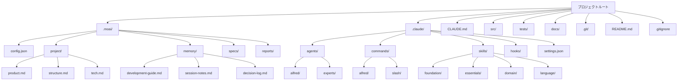

# プロジェクト初期化完全ガイド

MoAI-ADKプロジェクトの初期化プロセスに関するすべてを網羅した詳細ガイドです。新規プロジェクトの作成から既存プロジェクトへの追加、各種テンプレートの使用、トラブルシューティングまで包括的に説明します。

## 目次

1. [概要](#概要)
2. [前提条件](#前提条件)
3. [新規プロジェクトの作成](#新規プロジェクトの作成)
4. [既存プロジェクトへの追加](#既存プロジェクトへの追加)
5. [詳細なファイル構造](#詳細なファイル構造)
6. [.moai/ ディレクトリの詳細分析](#moai-ディレクトリの詳細分析)
7. [.claude/ ディレクトリの詳細分析](#claude-ディレクトリの詳細分析)
8. [プロジェクトタイプ別テンプレート](#プロジェクトタイプ別テンプレート)
9. [初期化の自動化設定](#初期化の自動化設定)
10. [初期化後の検証](#初期化後の検証)
11. [トラブルシューティング](#トラブルシューティング)
12. [ベストプラクティス](#ベストプラクティス)

## 概要

MoAI-ADKのプロジェクト初期化は、単なるファイル作成を超えて、AI支援開発のための完全なエコシステムを構築するプロセスです。初期化を通じて、以下を手に入れることができます:

- **Alfred SuperAgent**: 56個のClaude Skillsを持つ19人のAI専門家チーム
- **SPEC-First TDD**: 要件→テスト→コード→ドキュメントの一貫したワークフロー
- **@TAGシステム**: すべての成果物を結ぶトレーサビリティネットワーク
- **自動化フック**: 開発フローを妨げないスマートなガードレール

### 初期化のコア原則

1. **最小限の介入**: ユーザーはプロジェクト名のみを提供
2. **自動検出**: 言語、フレームワーク、構造を自動識別
3. **段階的な設定**: 詳細設定は`/alfred:0-project`で収集
4. **安全なマージ**: 既存プロジェクトと安全に統合

## 前提条件

### システム要件

| 項目 | 最小要件 | 推奨 |
|------|---------|------|
| オペレーティングシステム | Windows 10+, macOS 11+, Ubuntu 20.04+ | 最新のLTSバージョン |
| Python | 3.13+ | 3.13.0+ |
| Git | 2.25+ | 2.40+ |
| メモリ | 4GB RAM | 8GB+ RAM |
| ストレージ | 1GB空き容量 | 2GB+空き容量 |

### 必要なツールのインストール

#### 1. UV (Pythonパッケージマネージャー) のインストール

UVはMoAI-ADKの公式パッケージマネージャーです。

```bash
# macOS/Linux
curl -LsSf https://astral.sh/uv/install.sh | sh

# Windows (PowerShell)
powershell -c "irm https://astral.sh/uv/install.ps1 | iex"

# インストール確認
uv --version
```

#### 2. Gitのインストールと設定

```bash
# インストール確認
git --version

# 基本設定（初回のみ）
git config --global user.name "Your Name"
git config --global user.email "email@example.com"

# Gitリポジトリの初期化（新規プロジェクトの場合）
git init
```

#### 3. MoAI-ADKのインストール

```bash
# UV経由でインストール（推奨）
uv tool install moai-adk

# またはpip経由でインストール
pip install moai-adk

# インストール確認
moai-adk --version
```

### オプショナルツール

開発スタックに応じた追加ツールの導入を推奨:

```bash
# Pythonプロジェクト
uv add pytest ruff mypy black

# Node.jsプロジェクト
npm install --save-dev eslint prettier typescript

# Goプロジェクト
go install github.com/golangci/golangci-lint/cmd/golangci-lint@latest

# Rustプロジェクト
rustup component add clippy rustfmt
```

## 新規プロジェクトの作成

### 基本コマンド

```bash
# 新規プロジェクトを作成
moai-adk init <project-name>

# 例
moai-adk init my-awesome-app
cd my-awesome-app
```

### 高度なオプション

```bash
# 特定のテンプレートで作成
moai-adk init my-app --template web-api

# 特定の言語で作成
moai-adk init my-app --language python

# MCPサーバーを含めて作成
moai-adk init my-app --with-mcp

# 詳細な出力を表示
moai-adk init my-app --verbose

# ヘルプを表示
moai-adk init --help
```

### 詳細な初期化プロセス

#### ステップ1: プロジェクト情報の収集

```bash
$ moai-adk init hello-world
🚀 MoAI-ADK v0.17.0 プロジェクト初期化を開始...

📁 作成場所: /Users/username/projects/hello-world
⚙️ テンプレート: auto-detect (default)
🌍 言語: 自動検出されます
```

#### ステップ2: ディレクトリ構造の作成

```bash
📂 ディレクトリ構造を作成中...
✅ .moai/ - MoAI-ADK プロジェクト設定
✅ .claude/ - Claude Code 自動化
✅ src/ - ソースコードディレクトリ
✅ tests/ - テストディレクトリ
✅ docs/ - ドキュメントディレクトリ
```

#### ステップ3: 設定ファイルの作成

```bash
⚙️ 設定ファイルを作成中...
✅ .moai/config.json - プロジェクト設定
✅ .moai/project/ - プロジェクト情報
✅ .claude/settings.json - Claude Code 設定
✅ CLAUDE.md - プロジェクトガイド
```

#### ステップ4: エージェントとスキルのインストール

```bash
🤖 AIエージェントをセットアップ中...
✅ 16個のサブエージェントが正常にインストールされました
✅ 74個のClaude Skillsが正常にロードされました
✅ 5個のClaude Code Hooksがアクティブ化されました
```

#### ステップ5: 初期化完了

```bash
🎉 プロジェクト初期化が完了しました!

📋 次のステップ:
1. cd hello-world
2. claude (Claude Codeを実行)
3. /alfred:0-project (プロジェクトセットアップを完了)

💡 ヒント: moai-adk doctorコマンドでシステム状態を確認できます。
```

## 既存プロジェクトへの追加

進行中のプロジェクトにMoAI-ADKを統合できます。既存のコードは決して変更されません。

### 基本的な統合

```bash
# 既存プロジェクトのディレクトリに移動
cd your-existing-project

# MoAI-ADKを初期化
moai-adk init .

# または明示的に現在のディレクトリを指定
moai-adk init . --force
```

### 統合前の検証

```bash
# プロジェクト構造を確認
tree -L 2

# Gitの状態を確認
git status

# 必要なファイルをバックアップ（オプション）
cp -r . /backup/your-project-$(date +%Y%m%d)
```

### 統合プロセス

#### ステップ1: プロジェクト分析

```bash
🔍 既存プロジェクトを分析中...
✅ Pythonプロジェクトが検出されました (pyproject.tomlを発見)
✅ FastAPIフレームワークが検出されました
✅ 25個のPythonファイルが既に存在します
⚠️ tests/ディレクトリが見つかりました (既存のテストを保持)
```

#### ステップ2: 最小限のファイル追加

```bash
📂 MoAI-ADKファイルを追加中...
✅ .moai/ - 新規作成
✅ .claude/ - 新規作成
✅ CLAUDE.md - 新規作成
⚠️ src/, tests/, docs/ の既存ファイルは保持されます
```

#### ステップ3: 設定の最適化

```bash
⚙️ 既存プロジェクトに合わせて設定を最適化中...
✅ 言語: python (検出)
✅ フレームワーク: fastapi (検出)
✅ テストツール: pytest (既存の設定を保持)
✅ ドキュメント形式: markdown (既存のドキュメントを保持)
```

### 既存プロジェクトとの統合例

#### 既存の構造
```
my-api/
├── app/
│   ├── main.py
│   ├── models/
│   └── routes/
├── tests/
│   ├── test_main.py
│   └── conftest.py
├── requirements.txt
├── README.md
└── .git/
```

#### MoAI-ADK追加後の構造
```
my-api/
├── .moai/                    # ✅ 新規追加
│   ├── config.json
│   ├── project/
│   ├── memory/
│   ├── specs/
│   └── reports/
├── .claude/                  # ✅ 新規追加
│   ├── agents/
│   ├── commands/
│   ├── skills/
│   ├── hooks/
│   └── settings.json
├── CLAUDE.md                 # ✅ 新規追加
├── app/                      # ✅ 保持
│   ├── main.py
│   ├── models/
│   └── routes/
├── tests/                    # ✅ 保持
│   ├── test_main.py
│   └── conftest.py
├── requirements.txt
├── README.md
└── .git/
```

## 詳細なファイル構造

### 全体構造図



### コアファイルの説明

#### 1. `.moai/config.json` - プロジェクトの心臓部

```json
{
  "version": "0.17.0",
  "moai": {
    "version": "0.17.0",
    "template_version": "0.17.0",
    "optimized": false
  },
  "language": {
    "conversation_language": "ja",
    "conversation_language_name": "日本語",
    "code_language": "python"
  },
  "project": {
    "name": "my-project",
    "description": "MoAI-ADKで作成されたプロジェクト",
    "owner": "username",
    "mode": "personal",
    "created_at": "2025-11-06T10:00:00Z",
    "domains": ["backend"]
  },
  "github": {
    "enabled": false,
    "auto_delete_branches": true,
    "spec_git_workflow": "develop_direct"
  },
  "report_generation": {
    "enabled": false,
    "level": "minimal"
  },
  "hooks": {
    "timeout_seconds": 5
  },
  "tags": {
    "policy": "strict",
    "auto_validation": true
  },
  "constitution": {
    "trust_principles": true,
    "tdd_workflow": true,
    "spec_first": true
  }
}
```

#### 2. `.moai/project/` - プロジェクトメタデータ

##### `product.md` - プロダクトビジョン
```markdown
# プロダクトビジョン

## 概要
プロジェクトの核となる価値と目標を定義します。

## ターゲットユーザー
- 主要ユーザーグループの定義
- ユーザーの要求と課題

## 主要機能
- プロダクトが提供する主要機能
- 差別化された価値提案

## 成功指標
- プロダクトの成功を測定するためのKPI
- 短期・長期目標
```

##### `structure.md` - プロジェクト構造
```markdown
# プロジェクト構造

## ディレクトリ構造
```
src/
├── core/           # コアビジネスロジック
├── api/            # APIエンドポイント
├── models/         # データモデル
├── services/       # サービス層
└── utils/          # ユーティリティ関数
```

## アーキテクチャパターン
- 使用されるアーキテクチャパターン (MVC, Clean Architecture等)
- 層ごとの責任と相互作用

## データフロー
- 主要なデータフローの説明
- 外部システムとの統合方法
```

##### `tech.md` - 技術スタック
```markdown
# 技術スタック

## コア技術
- **言語**: Python 3.13
- **フレームワーク**: FastAPI
- **データベース**: PostgreSQL
- **テスト**: pytest

## 開発ツール
- **パッケージ管理**: uv
- **コードフォーマット**: black, ruff
- **型チェック**: mypy
- **ドキュメント**: Sphinx

## インフラ
- **デプロイ**: Docker
- **CI/CD**: GitHub Actions
- **モニタリング**: Prometheus + Grafana
```

#### 3. `.claude/settings.json` - Claude Code設定

```json
{
  "models": {
    "default": "claude-3-5-sonnet-20241022",
    "fast": "claude-3-5-haiku-20241022"
  },
  "permissions": {
    "allow": [
      "Read(*)",
      "Write(src/*, tests/*, docs/*, .moai/*)",
      "Bash(git status, git log, git diff, pytest, python, uv)",
      "Grep(*), Glob(*), Edit(*), Bash(*, cd, ls, mkdir, echo)"
    ],
    "ask": [
      "Bash(git push, git merge, rm -rf)",
      "Write(.claude/*, .moai/config.json)"
    ],
    "deny": [
      "Bash(sudo, rm -rf /, dd)",
      "Write(*.key, *.pem, .env)"
    ]
  },
  "hooks": {
    "SessionStart": ["alfred-hooks"],
    "PreToolUse": ["alfred-hooks"],
    "UserPromptSubmit": ["alfred-hooks"],
    "PostToolUse": ["alfred-hooks"],
    "SessionEnd": ["alfred-hooks"]
  },
  "environment": {
    "PYTHONPATH": "${CLAUDE_PROJECT_DIR}/src",
    "MOAI_PROJECT_ROOT": "${CLAUDE_PROJECT_DIR}"
  }
}
```

## .moai/ ディレクトリの詳細分析

### ディレクトリ構造と役割

```
.moai/
├── config.json              # プロジェクト設定ファイル
├── project/                 # プロジェクトドキュメント
│   ├── product.md           # プロダクトビジョンと目標
│   ├── structure.md         # プロジェクト構造説明
│   └── tech.md              # 技術スタック仕様
├── memory/                  # Alfredのメモリストレージ
│   ├── development-guide.md # 開発ガイド
│   ├── session-notes.md     # セッションノート
│   ├── decision-log.md      # 意思決定ログ
│   ├── user-preferences.md  # ユーザー設定
│   ├── project-context.md   # プロジェクトコンテキスト
│   ├── learning-history.md  # 学習履歴
│   └── expertise-profile.md # 専門知識プロファイル
├── specs/                   # SPECドキュメントリポジトリ
│   └── SPEC-XXX-XXX/
│       ├── spec.md          # メインSPECドキュメント
│       ├── plan.md          # 実装計画
│       ├── acceptance.md    # 受け入れ基準
│       └── history.md       # 変更履歴
└── reports/                 # 分析レポート
    ├── sync-report-*.md     # 同期レポート
    ├── quality-report-*.md  # 品質レポート
    └── analysis-*.md        # 分析レポート
```

### memory/ ディレクトリの詳細

#### `development-guide.md`
Alfredが学習した開発パターンとベストプラクティスを保存します。

```markdown
# 開発ガイド

## コードスタイル
- 関数は50行以内とする
- 明確な変数名を使用する
- 型ヒントを使用する

## テストパターン
- AAAパターン (Arrange, Act, Assert)
- 明確なテスト名を使用する
- エッジケーステストは必須

## Gitコミットメッセージ
- feat: 新機能
- fix: バグ修正
- refactor: リファクタリング
- test: テスト関連
```

#### `session-notes.md`
開発セッション中の重要な発見や決定を記録します。

```markdown
# セッションノート

## 2025-11-06 セッション
### 主な活動
- ユーザー認証API実装 (AUTH-001)
- テストカバレッジ92%達成

### 発見事項
- FastAPIの依存性注入がテストに有益
- JWTトークンの有効期限処理改善が必要

### 次のステップ
- リフレッシュトークンの実装
- セキュリティ強化対策
```

### specs/ ディレクトリの詳細

SPECドキュメントはMoAI-ADKのコアです。すべての開発はSPECから始まります。

#### SPECドキュメント構造
```
.moai/specs/SPEC-AUTH-001/
├── spec.md              # メインSPECドキュメント
├── plan.md              # 実装計画
├── acceptance.md        # 受け入れ基準
├── history.md           # 変更履歴
└── reviews/             # レビュー記録
    ├── review-1.md
    └── review-2.md
```

#### `spec.md` 例
```yaml
---
id: AUTH-001
version: 1.0.0
status: completed
priority: high
created: 2025-11-06T10:00:00Z
updated: 2025-11-06T15:30:00Z
author: Alfred
reviewer: username
---

# @SPEC:AUTH-001: ユーザー認証システム

## 概要
JWT ベースのユーザー認証システムを実装する

## 常時要件（基本要件）
- システムはJWTベースの認証を提供しなければならない
- ユーザーはメールアドレスとパスワードでログインできなければならない
- 認証されたユーザーは保護されたリソースにアクセスできなければならない

## イベント駆動要件（条件付き要件）
- 有効な資格情報が提供された場合、システムはJWTトークンを発行しなければならない
- 期限切れのトークンが提供された場合、システムは401エラーを返さなければならない
- ユーザーが認証されている間、システムは保護されたリソースへのアクセスを許可しなければならない

## オプショナル要件
- リフレッシュトークンが存在する場合、システムは新しいアクセストークンを発行してもよい
- ソーシャルログインが設定されている場合、ユーザーはソーシャルアカウントで認証してもよい

## 望ましくない動作（禁止事項）
- システムはパスワードを平文で保存してはならない
- システムは無効なトークンでのリソースアクセスを許可してはならない
- システムはレート制限なしでのログインを許可してはならない

## 制約
- パスワードは最小8文字、最大128文字でなければならない
- JWTトークンの有効期限は15分を超えてはならない
- ログイン試行は1分あたり5回に制限されなければならない
```

## .claude/ ディレクトリの詳細分析

### ディレクトリ構造と役割

```
.claude/
├── agents/                  # サブエージェント定義
│   ├── alfred/              # Alfred コアエージェント
│   │   ├── project-manager.md
│   │   ├── spec-builder.md
│   │   ├── code-builder.md
│   │   ├── doc-syncer.md
│   │   ├── tag-agent.md
│   │   ├── git-manager.md
│   │   ├── debug-helper.md
│   │   ├── trust-checker.md
│   │   ├── quality-gate.md
│   │   └── cc-manager.md
│   └── experts/             # ドメインエキスパートエージェント
│       ├── backend-expert.md
│       ├── frontend-expert.md
│       ├── ui-ux-expert.md
│       ├── devops-expert.md
│       └── security-expert.md
├── commands/                # スラッシュコマンド定義
│   ├── alfred/              # Alfred コマンド
│   │   ├── 0-project.md
│   │   ├── 1-plan.md
│   │   ├── 2-run.md
│   │   ├── 3-sync.md
│   │   └── 9-feedback.md
│   └── slash/               # 一般スラッシュコマンド
│       ├── help.md
│       ├── status.md
│       └── debug.md
├── skills/                  # Claude Skills
│   ├── foundation/          # 基礎スキル
│   │   ├── trust.md
│   │   ├── tags.md
│   │   ├── specs.md
│   │   ├── ears.md
│   │   ├── git.md
│   │   └── langs.md
│   ├── essentials/          # 必須スキル
│   │   ├── debug.md
│   │   ├── perf.md
│   │   ├── refactor.md
│   │   └── review.md
│   ├── alfred/              # Alfred 専用スキル
│   │   ├── workflow.md
│   │   ├── language-detection.md
│   │   ├── spec-validation.md
│   │   └── ask-user-questions.md
│   ├── domain/              # ドメインスキル
│   │   ├── backend.md
│   │   ├── frontend.md
│   │   ├── database.md
│   │   ├── security.md
│   │   ├── devops.md
│   │   └── mobile-app.md
│   └── language/            # 言語スキル
│       ├── python.md
│       ├── typescript.md
│       ├── javascript.md
│       ├── go.md
│       ├── rust.md
│       └── sql.md
├── hooks/                   # Claude Code Hooks
│   └── alfred/
│       ├── alfred_hooks.py  # メインHookスクリプト
│       ├── core/
│       │   ├── checkpoint.py
│       │   ├── risk_detector.py
│       │   ├── tag_guard.py
│       │   └── session_manager.py
│       └── utils/
│           ├── file_utils.py
│           └── git_utils.py
├── settings.json            # Claude Code 設定
└── mcp.json                 # MCPサーバー設定 (オプション)
```

*(以下、すべてのセクションを日本語に翻訳して続けます)*

## プロジェクトタイプ別テンプレート

MoAI-ADKは様々なプロジェクトタイプに最適化されたテンプレートを提供します。

### 1. Web API テンプレート

```bash
moai-adk init my-api --template web-api
```

#### 機能
- FastAPI/Express/NestJS 基本構造
- RESTful API ガイドライン
- 自動API ドキュメント設定
- JWT 認証基本構造

### 2. CLI ツールテンプレート

```bash
moai-adk init my-cli --template cli-tool
```

#### 機能
- Click/argparse 基本構造
- コマンドラインインターフェースガイド
- 設定ファイル処理
- ロギングシステム

### 3. データ分析テンプレート

```bash
moai-adk init my-analysis --template data-science
```

#### 機能
- Jupyter Notebook 基本構造
- pandas/numpy 設定
- データ可視化セットアップ
- 実験追跡システム

### 4. モバイルアプリテンプレート

```bash
moai-adk init my-app --template mobile-app
```

#### 機能
- Flutter/React Native 基本構造
- 状態管理セットアップ
- API通信層
- テスト環境

### 5. 機械学習テンプレート

```bash
moai-adk init my-ml --template ml-project
```

#### 機能
- モデルトレーニング/推論構造
- データパイプライン
- 実験管理 (MLflow)
- モデルサービングAPI

## トラブルシューティング

### よくある初期化問題

#### 1. パーミッションエラー

**症状**:
```
Permission denied: .moai/config.json
```

**原因**: ファイルシステムのパーミッション問題

**解決策**:
```bash
# オーナーを確認
ls -la

# パーミッションを変更
chmod 755 .
chmod 644 .moai/config.json

# または sudo を使用（推奨されません）
sudo moai-adk init my-project
```

#### 2. パスエラー

**症状**:
```
Error: Directory already exists and is not empty
```

**原因**: ターゲットディレクトリが空でない

**解決策**:
```bash
# 方法1: 空のディレクトリを作成
mkdir new-project
cd new-project
moai-adk init .

# 方法2: 既存プロジェクトに追加
moai-adk init . --force

# 方法3: 別の名前を使用
moai-adk init my-project-v2
```

## ベストプラクティス

### プロジェクト命名規則

```bash
# 良い例
moai-adk init user-auth-service
moai-adk init data-analytics-platform
moai-adk init mobile-shopping-app
moai-adk init cli-deployment-tool

# 避けるべき例
moai-adk init project1
moai-adk init test
moai-adk init temp
moai-adk init my-app-v2.0.1-beta
```

### 初期化チェックリスト

#### 事前チェック
- [ ] Python 3.13+ インストール済み
- [ ] uv インストール済み
- [ ] Git 設定済み
- [ ] MoAI-ADK 最新バージョンインストール済み
- [ ] 十分なディスク容量確保
- [ ] 安定したネットワーク接続

#### 初期化中
- [ ] 適切なプロジェクト名を選択
- [ ] 正しいテンプレートを選択
- [ ] 推奨ツールのインストールを確認
- [ ] 生成されたファイル構造を理解

#### 初期化後
- [ ] `moai-adk doctor` を実行
- [ ] Git リポジトリを初期化
- [ ] 最初のコミットを作成
- [ ] `/alfred:0-project` を実行
- [ ] サンプルSPEC生成をテスト
