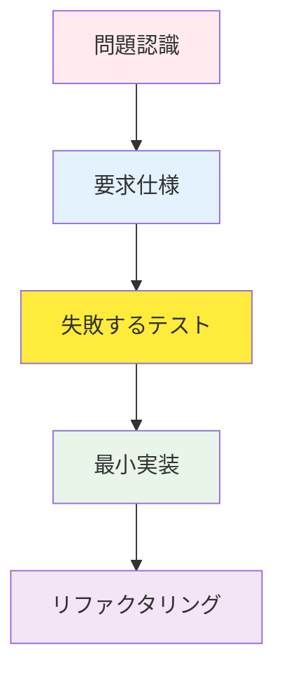
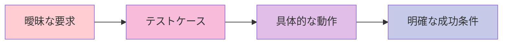

# TDD REDフェーズガイド：失敗するテストの哲学と実践

## 目次

1. [REDフェーズの哲学的背景](#redフェーズの哲学的背景)
2. [REDフェーズの重要性](#redフェーズの重要性)
3. [失敗するテストの作成方法](#失敗するテストの作成方法)
4. [テストケース設計戦略](#テストケース設計戦略)
5. [境界値テストと例外ケース](#境界値テストと例外ケース)
6. [実践コード例](#実践コード例)
7. [よくある間違いと防止方法](#よくある間違いと防止方法)
8. [Gitコミット戦略（REDフェーズ）](#gitコミット戦略redフェーズ)
9. [REDフェーズチェックリスト](#redフェーズチェックリスト)

______________________________________________________________________

## REDフェーズの哲学的背景

### なぜ失敗するテストから始めるのか？

TDDのREDフェーズは、単に「失敗するテストを書く」以上の深い哲学を持っています。これは、ソフトウェア開発の根本的なアプローチを変えるパラダイムシフトです。

#### 1. 問題定義優先の原則



従来の開発方式：

- 実装 → テスト → デバッグ（修正コスト大）

TDD方式：

- 仕様 → テスト → 実装（修正コスト小）

#### 2. 失敗の価値

**「失敗は成功のもと」という言葉は、TDDでは文字通り適用されます：**

- **意図的な失敗**：何を実装すべきかを明確に定義
- **予測可能な失敗**：テストが失敗することを既に知っている
- **学習的失敗**：失敗を通じてシステムの境界を理解

```python
# 良いREDフェーズの例
def test_user_authentication_with_valid_credentials():
    """有効な認証情報で認証した時、JWTトークンを返すべき"""
    # Given: 有効なユーザー認証情報
    valid_credentials = {
        "email": "user@example.com",
        "password": "correct_password"
    }

    # When: 認証リクエスト
    response = auth_service.authenticate(valid_credentials)

    # Then: JWTトークン返却
    assert response.status_code == 200
    assert "access_token" in response.json()
    assert response.json()["token_type"] == "bearer"
```

このテストは、すぐに実行すると失敗します。`auth_service`がまだ存在しないためです。**これがREDフェーズの核心です。**

#### 3. 認知負荷の削減

REDフェーズは、開発者の認知負荷を劇的に減らします：

- **一度に一つの問題だけ**：現在のテストケースのみに集中
- **明確な成功基準**：「テストが通過すること」が唯一の目標
- **段階的な進行**：小さな成功体験の繰り返し

______________________________________________________________________

## REDフェーズの重要性

### 1. 要求の具体化



**例：**

| 曖昧な要求 | テストケースで具体化 |
| ------------------ | ------------------------------------------------- |
| "ユーザー認証機能" | "メールアドレスとパスワードでログインした時、JWTトークンを返す" |
| "データ検証" | "メール形式が間違っていると、400エラーを返す" |
| "権限管理" | "管理者のみが削除APIにアクセス可能" |

### 2. 設計の強制

テストを先に書くと、自然と良い設計が生まれます：

- **依存性注入**：テスト可能な構造
- **単一責任原則**：小さく焦点を絞った関数
- **インターフェース基盤設計**：テストと実装の分離

```python
# REDフェーズで強制される良い設計
class UserService:
    def __init__(self, user_repository: UserRepository, email_service: EmailService):
        self.user_repository = user_repository
        self.email_service = email_service

    def create_user(self, user_data: dict) -> User:
        # 実装はGREENフェーズで
        pass
```

### 3. リスクの軽減

| リスクタイプ | REDフェーズの解決策 |
| ------------------- | ---------------------------------- |
| **要求の誤解** | テストで明確な動作を定義 |
| **過剰エンジニアリング** | 最小限のテストから開始 |
| **統合問題** | 単体テストで隔離された環境で検証 |
| **回帰バグ** | テストスイートで継続的に検証 |

______________________________________________________________________

## 失敗するテストの作成方法

### 1. AAAパターン（Arrange-Act-Assert）

すべてのテストは明確な構造を持つべきです：

```python
def test_product_creation_with_valid_data():
    # Arrange (準備)
    valid_product_data = {
        "name": "Test Product",
        "price": 29.99,
        "category": "electronics"
    }

    # Act (実行)
    result = product_service.create_product(valid_product_data)

    # Assert (検証)
    assert result["id"] is not None
    assert result["name"] == "Test Product"
    assert result["price"] == 29.99
```

### 2. Given-When-Thenパターン

BDDスタイルのより記述的なアプローチ：

```python
def test_order_processing_with_sufficient_inventory():
    # Given: 在庫が十分な商品と注文情報
    product = create_product(name="Laptop", inventory=10)
    order_request = {"product_id": product.id, "quantity": 2}

    # When: 注文処理リクエスト
    order_result = order_service.process_order(order_request)

    # Then: 注文が正常に作成され、在庫が減少
    assert order_result.status == "confirmed"
    assert product.inventory == 8
```

### 3. テスト命名規則

良いテスト名は、ドキュメントの役割を果たします：

```python
# 良い例（明確な意図を伝える）
def test_user_registration_with_duplicate_email_should_return_409()
def test_password_reset_with_invalid_token_should_return_400()
def test_product_search_with_empty_query_should_return_all_products()

# 悪い例（曖昧な意図）
def test_user_registration()
def test_password_reset()
def test_product_search()
```

### 4. 失敗確認ステップ

REDフェーズでは、**必ずテストが失敗することを確認**する必要があります：

```bash
# テスト実行
pytest tests/test_user_service.py::test_user_registration_with_duplicate_email_should_return_409 -v

# 期待結果: FAILED
# 実際の結果: AssertionError: Expected 409 but got 201
```

この失敗確認は重要です：

- テストが実際に何かを検証しているかを確認
- 偽陽性（false positive）を防止
- 実装前に要求を再確認

______________________________________________________________________

## テストケース設計戦略

### 1. 境界値ベースのテスト（Boundary-Based Testing）

```python
def test_age_validation():
    """年齢検証: 0-120歳まで許可"""

    # 境界値テスト
    test_cases = [
        (-1, False),   # 境界以下（失敗予想）
        (0, True),     # 最小境界（成功予想）
        (1, True),     # 境界直上（成功予想）
        (119, True),   # 境界直下（成功予想）
        (120, True),   # 最大境界（成功予想）
        (121, False),  # 境界以上（失敗予想）
    ]

    for age, expected_valid in test_cases:
        result = user_service.validate_age(age)
        assert result.is_valid == expected_valid, f"Age {age} validation failed"
```

### 2. 同値分割（Equivalence Partitioning）

```python
def test_email_validation():
    """メール形式検証"""

    # 有効なメールグループ
    valid_emails = [
        "user@example.com",
        "user.name@example.co.kr",
        "user+tag@example.org",
        "123@example.com"
    ]

    # 無効なメールグループ
    invalid_emails = [
        "invalid-email",
        "@example.com",
        "user@",
        "user..name@example.com",
        "user@.com"
    ]

    for email in valid_emails:
        assert email_service.is_valid(email), f"Valid email {email} marked as invalid"

    for email in invalid_emails:
        assert not email_service.is_valid(email), f"Invalid email {email} marked as valid"
```

### 3. デシジョンテーブル（Decision Table）

```python
def test_user_permission_check():
    """ユーザー権限確認デシジョンテーブル"""

    test_cases = [
        # (role, is_active, has_subscription, expected_result)
        ("admin", True, True, True),    # 管理者は常にアクセス可能
        ("admin", False, True, True),   # 非アクティブな管理者もアクセス可能
        ("user", True, True, True),     # アクティブユーザー + サブスク = アクセス可能
        ("user", True, False, False),   # アクティブユーザー + 非サブスク = アクセス不可
        ("user", False, True, False),   # 非アクティブユーザー = アクセス不可
        ("guest", True, True, False),   # ゲスト = アクセス不可
    ]

    for role, is_active, has_subscription, expected in test_cases:
        user = create_user(role=role, is_active=is_active, has_subscription=has_subscription)
        result = permission_service.can_access_premium_content(user)
        assert result == expected, f"Permission check failed for {role}"
```

### 4. 状態遷移テスト

```python
def test_order_state_transitions():
    """注文状態遷移テスト"""

    # 有効な状態遷移
    valid_transitions = [
        ("pending", "confirmed"),
        ("confirmed", "processing"),
        ("processing", "shipped"),
        ("shipped", "delivered"),
        ("pending", "cancelled"),
        ("confirmed", "cancelled")
    ]

    # 無効な状態遷移
    invalid_transitions = [
        ("delivered", "processing"),
        ("cancelled", "confirmed"),
        ("shipped", "pending")
    ]

    for from_state, to_state in valid_transitions:
        order = create_order(state=from_state)
        result = order_service.transition_state(order, to_state)
        assert result.success, f"Valid transition {from_state} -> {to_state} failed"

    for from_state, to_state in invalid_transitions:
        order = create_order(state=from_state)
        result = order_service.transition_state(order, to_state)
        assert not result.success, f"Invalid transition {from_state} -> {to_state} should fail"
```

______________________________________________________________________

## 境界値テストと例外ケース

### 1. 数値境界値テスト

```python
def test_product_price_validation():
    """商品価格検証: 0.01 ~ 999999.99"""

    boundary_tests = [
        # (price, expected_valid, description)
        (0, False, "0円は不可"),
        (0.009, False, "0.01円未満は不可"),
        (0.01, True, "最小金額"),
        (0.011, True, "最小金額超過"),
        (999999.99, True, "最大金額"),
        (1000000, False, "最大金額超過"),
    ]

    for price, expected, description in boundary_tests:
        result = product_service.validate_price(price)
        assert result.is_valid == expected, f"Price validation failed: {description}"
```

### 2. 文字列境界値テスト

```python
def test_username_length_validation():
    """ユーザー名長さ検証: 3-20文字"""

    test_cases = [
        ("", False, "空文字列"),
        ("ab", False, "2文字（最小未満）"),
        ("abc", True, "3文字（最小）"),
        ("a" * 19, True, "19文字（最大-1）"),
        ("a" * 20, True, "20文字（最大）"),
        ("a" * 21, False, "21文字（最大超過）"),
        ("あいう", True, "日本語3文字"),
        ("あ" * 20, True, "日本語20文字"),
        ("あ" * 21, False, "日本語21文字"),
    ]

    for username, expected, description in test_cases:
        result = user_service.validate_username(username)
        assert result.is_valid == expected, f"Username validation failed: {description}"
```

### 3. 日付/時刻境界値テスト

```python
def test_event_registration_deadline():
    """イベント登録締切テスト"""

    now = datetime.now()

    test_cases = [
        # (registration_time, event_deadline, expected_result, description)
        (now - timedelta(days=1), now, False, "締切後1日経過"),
        (now - timedelta(seconds=1), now, False, "締切後1秒経過"),
        (now, now, True, "締切時"),
        (now - timedelta(seconds=1), now + timedelta(seconds=1), True, "締切1秒前"),
        (now - timedelta(days=1), now + timedelta(days=1), True, "締切1日前"),
    ]

    for reg_time, deadline, expected, description in test_cases:
        result = event_service.can_register(reg_time, deadline)
        assert result == expected, f"Deadline test failed: {description}"
```

### 4. 例外ケースの体系的アプローチ

```python
def test_file_upload_edge_cases():
    """ファイルアップロード例外ケース"""

    exception_cases = [
        # (file_input, expected_exception, description)
        (None, ValueError, "None ファイル入力"),
        ("", ValueError, "空文字列ファイルパス"),
        ("/invalid/path", FileNotFoundError, "存在しないファイル"),
        ("./large_file.txt", FileTooLargeError, "ファイルサイズ超過"),
        ("./virus.exe", SecurityError, "セキュリティリスクファイル"),
        ("./malformed.jpg", InvalidFileFormatError, "誤ったファイル形式"),
    ]

    for file_input, expected_exception, description in exception_cases:
        with pytest.raises(expected_exception):
            file_service.upload(file_input)
```

______________________________________________________________________

## 実践コード例

### Python例（FastAPI + Pytest）

#### REDフェーズ：ユーザー認証API

```python
# tests/test_auth.py
import pytest
from fastapi.testclient import TestClient
from src.main import app

client = TestClient(app)

def test_login_with_valid_credentials_should_return_jwt_token():
    """
    WHEN 有効な認証情報でログインリクエストすると
    THEN JWT アクセストークンを返すべき
    """
    # Given
    login_data = {
        "email": "test@example.com",
        "password": "correct_password_123"
    }

    # When
    response = client.post("/auth/login", json=login_data)

    # Then
    assert response.status_code == 200
    response_data = response.json()
    assert "access_token" in response_data
    assert response_data["token_type"] == "bearer"
    assert len(response_data["access_token"]) > 100  # JWT トークン長検証

def test_login_with_invalid_email_should_return_401():
    """
    WHEN 誤ったメールアドレスでログインリクエストすると
    THEN 401 Unauthorized エラーを返すべき
    """
    # Given
    login_data = {
        "email": "invalid@example.com",
        "password": "some_password"
    }

    # When
    response = client.post("/auth/login", json=login_data)

    # Then
    assert response.status_code == 401
    assert response.json()["detail"] == "Invalid credentials"

def test_login_with_invalid_password_should_return_401():
    """
    WHEN 誤ったパスワードでログインリクエストすると
    THEN 401 Unauthorized エラーを返すべき
    """
    # Given
    login_data = {
        "email": "test@example.com",
        "password": "wrong_password"
    }

    # When
    response = client.post("/auth/login", json=login_data)

    # Then
    assert response.status_code == 401
    assert response.json()["detail"] == "Invalid credentials"

def test_login_with_missing_fields_should_return_422():
    """
    WHEN 必須フィールドが欠落したログインリクエストすると
    THEN 422 Validation Error を返すべき
    """
    # Given: メールフィールド欠落
    login_data = {
        "password": "some_password"
    }

    # When
    response = client.post("/auth/login", json=login_data)

    # Then
    assert response.status_code == 422
    assert "email" in response.json()["detail"][0]["loc"]
```

これらのテストを実行すると、当然失敗します。まだ `/auth/login` エンドポイントが存在しないためです。

```bash
$ pytest tests/test_auth.py -v
============================ test session starts ============================
collected 4 items

tests/test_auth.py::test_login_with_valid_credentials_should_return_jwt_token FAILED
tests/test_auth.py::test_login_with_invalid_email_should_return_401 FAILED
tests/test_auth.py::test_login_with_invalid_password_should_return_401 FAILED
tests/test_auth.py::test_login_with_missing_fields_should_return_422 FAILED

============================= 4 failed in 0.12s ==============================
```

**これが完璧なREDフェーズの結果です！**

### TypeScript例（Jest + Express）

#### REDフェーズ：To-do管理API

```typescript
// tests/todo-api.test.ts
import request from 'supertest';
import app from '../src/app';

describe('Todo API', () => {
  describe('POST /todos', () => {
    it('should create a new todo with valid data and return 201', async () => {
      // Given
      const todoData = {
        title: 'Learn TDD',
        description: 'Master Test-Driven Development',
        dueDate: '2024-12-31'
      };

      // When
      const response = await request(app)
        .post('/todos')
        .send(todoData);

      // Then
      expect(response.status).toBe(201);
      expect(response.body).toHaveProperty('id');
      expect(response.body.title).toBe(todoData.title);
      expect(response.body.description).toBe(todoData.description);
      expect(response.body.completed).toBe(false);
    });

    it('should return 400 when title is missing', async () => {
      // Given
      const invalidTodoData = {
        description: 'Missing title field',
        dueDate: '2024-12-31'
      };

      // When
      const response = await request(app)
        .post('/todos')
        .send(invalidTodoData);

      // Then
      expect(response.status).toBe(400);
      expect(response.body.error).toContain('title is required');
    });

    it('should return 400 when title exceeds 200 characters', async () => {
      // Given
      const longTitle = 'a'.repeat(201);
      const invalidTodoData = {
        title: longTitle,
        description: 'Too long title'
      };

      // When
      const response = await request(app)
        .post('/todos')
        .send(invalidTodoData);

      // Then
      expect(response.status).toBe(400);
      expect(response.body.error).toContain('title must be less than 200 characters');
    });
  });

  describe('GET /todos', () => {
    it('should return empty array when no todos exist', async () => {
      // When
      const response = await request(app)
        .get('/todos');

      // Then
      expect(response.status).toBe(200);
      expect(response.body).toEqual([]);
    });

    it('should return all todos when todos exist', async () => {
      // This test would need setup in GREEN phase
      // For RED phase, we just define the expectation

      // When
      const response = await request(app)
        .get('/todos');

      // Then
      expect(response.status).toBe(200);
      expect(Array.isArray(response.body)).toBe(true);
    });
  });
});
```

### Java例（JUnit + Spring Boot）

#### REDフェーズ：ユーザー管理サービス

```java
// src/test/java/com/example/service/UserServiceTest.java
import org.junit.jupiter.api.Test;
import org.junit.jupiter.api.DisplayName;
import static org.junit.jupiter.api.Assertions.*;
import static org.assertj.core.api.Assertions.*;

class UserServiceTest {

    @Test
    @DisplayName("有効なユーザー情報で会員登録時、成功すべき")
    void createUser_WithValidData_ShouldReturnUser() {
        // Given
        UserCreationRequest request = new UserCreationRequest(
            "test@example.com",
            "password123!",
            "Test User"
        );

        // When
        User result = userService.createUser(request);

        // Then
        assertNotNull(result.getId());
        assertEquals(request.getEmail(), result.getEmail());
        assertEquals(request.getName(), result.getName());
        assertNotNull(result.getCreatedAt());
        assertFalse(result.isEmailVerified());
    }

    @Test
    @DisplayName("重複メールアドレスで会員登録時、例外が発生すべき")
    void createUser_WithDuplicateEmail_ShouldThrowException() {
        // Given
        UserCreationRequest request = new UserCreationRequest(
            "existing@example.com",
            "password123!",
            "Existing User"
        );

        // When & Then
        EmailAlreadyExistsException exception = assertThrows(
            EmailAlreadyExistsException.class,
            () -> userService.createUser(request)
        );

        assertEquals("Email already exists: existing@example.com", exception.getMessage());
    }

    @Test
    @DisplayName("誤ったメール形式で会員登録時、例外が発生すべき")
    void createUser_WithInvalidEmail_ShouldThrowException() {
        // Given
        UserCreationRequest request = new UserCreationRequest(
            "invalid-email",
            "password123!",
            "Test User"
        );

        // When & Then
        ValidationException exception = assertThrows(
            ValidationException.class,
            () -> userService.createUser(request)
        );

        assertTrue(exception.getMessage().contains("Invalid email format"));
    }

    @Test
    @DisplayName("弱いパスワードで会員登録時、例外が発生すべき")
    void createUser_WithWeakPassword_ShouldThrowException() {
        // Given
        UserCreationRequest request = new UserCreationRequest(
            "test@example.com",
            "123",
            "Test User"
        );

        // When & Then
        ValidationException exception = assertThrows(
            ValidationException.class,
            () -> userService.createUser(request)
        );

        assertTrue(exception.getMessage().contains("Password too weak"));
    }
}
```

### Go例（Go Testing）

#### REDフェーズ：商品在庫管理

```go
// product_service_test.go
package service

import (
    "errors"
    "testing"
)

func TestProductService_CreateProduct(t *testing.T) {
    service := NewProductService()

    t.Run("有効な商品情報で生成時、成功", func(t *testing.T) {
        // Given
        product := &Product{
            Name:        "Test Product",
            Price:       29.99,
            Category:    "electronics",
            Stock:       100,
        }

        // When
        result, err := service.CreateProduct(product)

        // Then
        if err != nil {
            t.Fatalf("Expected no error, got %v", err)
        }

        if result.ID == "" {
            t.Error("Expected product ID to be generated")
        }

        if result.Name != product.Name {
            t.Errorf("Expected name %s, got %s", product.Name, result.Name)
        }
    })

    t.Run("価格が0以下の商品生成時、失敗", func(t *testing.T) {
        // Given
        product := &Product{
            Name:     "Invalid Product",
            Price:    -10.0,
            Category: "electronics",
            Stock:    100,
        }

        // When
        _, err := service.CreateProduct(product)

        // Then
        if err == nil {
            t.Error("Expected error for invalid price")
        }

        if !errors.Is(err, ErrInvalidPrice) {
            t.Errorf("Expected ErrInvalidPrice, got %v", err)
        }
    })

    t.Run("在庫がマイナスの商品生成時、失敗", func(t *testing.T) {
        // Given
        product := &Product{
            Name:     "Invalid Product",
            Price:    29.99,
            Category: "electronics",
            Stock:    -5,
        }

        // When
        _, err := service.CreateProduct(product)

        // Then
        if err == nil {
            t.Error("Expected error for negative stock")
        }

        if !errors.Is(err, ErrInvalidStock) {
            t.Errorf("Expected ErrInvalidStock, got %v", err)
        }
    })
}

func TestProductService_UpdateStock(t *testing.T) {
    service := NewProductService()

    t.Run("在庫減少時、正常に動作", func(t *testing.T) {
        // Given
        product := &Product{Name: "Test", Price: 10.0, Stock: 100}
        created, _ := service.CreateProduct(product)

        // When
        err := service.UpdateStock(created.ID, 90) // 100 -> 90

        // Then
        if err != nil {
            t.Fatalf("Expected no error, got %v", err)
        }

        updated, err := service.GetProduct(created.ID)
        if err != nil {
            t.Fatalf("Expected no error, got %v", err)
        }

        if updated.Stock != 90 {
            t.Errorf("Expected stock 90, got %d", updated.Stock)
        }
    })

    t.Run("在庫をマイナスに減少時、失敗", func(t *testing.T) {
        // Given
        product := &Product{Name: "Test", Price: 10.0, Stock: 5}
        created, _ := service.CreateProduct(product)

        // When
        err := service.UpdateStock(created.ID, -10) // 5 -> -5

        // Then
        if err == nil {
            t.Error("Expected error for negative stock")
        }

        if !errors.Is(err, ErrInsufficientStock) {
            t.Errorf("Expected ErrInsufficientStock, got %v", err)
        }
    })
}
```

______________________________________________________________________

## よくある間違いと防止方法

### 1. テストが大きすぎる場合

**問題：**

```python
# 悪い例：一つのテストが多すぎることを検証
def test_user_complete_flow():
    # ユーザー作成
    # ログイン
    # プロフィール更新
    # 投稿作成
    # コメント作成
    # ログアウト
    # ... 数十行のコード
```

**解決策：**

```python
# 良い例：各テストは一つの動作に集中
def test_user_registration_with_valid_data()
def test_user_login_with_valid_credentials()
def test_user_profile_update()
def test_post_creation()
def test_comment_creation()
```

### 2. 実装詳細に依存するテスト

**問題：**

```python
# 悪い例：データベーススキーマに依存
def test_user_creation():
    user = User(name="John", email="john@example.com")
    assert user._password_hash.startswith("bcrypt$")
    assert user.created_at.microsecond == 0  # データベース精度に依存
```

**解決策：**

```python
# 良い例：公開インターフェースにのみ依存
def test_user_creation():
    user = User(name="John", email="john@example.com")
    assert user.name == "John"
    assert user.email == "john@example.com"
    assert user.is_password_valid("some_password")  # 公開メソッド使用
```

### 3. テストデータの過度な再利用

**問題：**

```python
# 悪い例：テスト間の依存関係が発生
@pytest.fixture
def sample_user():
    return User.objects.create(name="John", email="john@example.com")

def test_user_update(sample_user):
    sample_user.name = "Jane"
    sample_user.save()
    # このテストがsample_userを変更して他のテストに影響

def test_user_delete(sample_user):
    # 前のテストの影響を受ける可能性がある
    pass
```

**解決策：**

```python
# 良い例：各テストが独立したデータを使用
def test_user_update():
    user = User.objects.create(name="John", email="john@example.com")
    # テストロジック
    pass

def test_user_delete():
    user = User.objects.create(name="John", email="john@example.com")
    # 独立したテスト
    pass
```

### 4. 不適切なMock/Stubの使用

**問題：**

```python
# 悪い例：過度なモックで実際の動作を検証しない
def test_email_service():
    with patch('email_service.send_email') as mock_send:
        mock_send.return_value = True

        result = user_service.send_welcome_email("user@example.com")

        assert result is True
        # 実際のメールロジックが全く検証されない
```

**解決策：**

```python
# 良い例：実際のロジック検証または統合テスト
def test_email_service_with_real_provider():
    # 実際のメールプロバイダーまたはテスト用プロバイダーを使用
    service = EmailService(test_mode=True)
    result = service.send_welcome_email("test@example.com")

    assert result is True
    assert len(service.sent_emails) == 1
    assert service.sent_emails[0].to == "test@example.com"
```

### 5. assertのないテスト

**問題：**

```python
# 悪い例：検証のないテスト
def test_user_creation():
    user = user_service.create_user({
        "name": "John",
        "email": "john@example.com"
    })
    # assertがない！このテストは常に通過
```

**解決策：**

```python
# 良い例：明確な検証
def test_user_creation():
    user = user_service.create_user({
        "name": "John",
        "email": "john@example.com"
    })

    assert user is not None
    assert user.name == "John"
    assert user.email == "john@example.com"
    assert user.id is not None
```

______________________________________________________________________

## Gitコミット戦略（REDフェーズ）

### 1. コミットメッセージの規則

REDフェーズのコミットは、失敗するテストを追加したことを明確に示す必要があります：

```bash
# 良いコミットメッセージ例
git commit -m "🔴 test(AUTH-001): add failing authentication tests

- Add login with valid credentials test
- Add login with invalid email test
- Add login with invalid password test
- Add validation error test for missing fields

All tests currently failing as authentication service not implemented yet."

# 簡潔版
git commit -m "🔴 test(AUTH-001): add failing auth API tests"
```

### 2. コミット単位

**良いコミット単位：**

- 一つの機能/ストーリーに対するテストケースグループ
- 論理的に関連するテスト群
- 一つの完全なテストスイート

**悪いコミット単位：**

- 各テストケースごとに分離されたコミット
- 多すぎる機能を一度にコミット

### 3. ブランチ戦略

```bash
# 機能ブランチ作成
git checkout -b feature/user-authentication

# REDフェーズテスト追加
# ... テストファイル作成 ...

# REDフェーズコミット
git add tests/test_auth.py
git commit -m "🔴 test(AUTH-001): add failing user authentication tests"

# 次にGREENフェーズへ移動
```

### 4. コードレビューポイント

REDフェーズでのコードレビュー時に確認すべき事項：

```markdown
## REDフェーズレビューチェックリスト

### テスト品質
- [ ] テスト名が明確で記述的か？
- [ ] AAA/Given-When-Thenパターンに従っているか？
- [ ] 一つのテストが一つの動作のみを検証しているか？
- [ ] 境界値と例外ケースを含んでいるか？

### 失敗確認
- [ ] テストが実際に失敗するか？
- [ ] 失敗の理由が明確か？
- [ ] 偽陽性（false positive）の可能性がないか？

### カバレッジ
- [ ] 主要シナリオがすべてカバーされているか？
- [ ] エッジケースが考慮されているか？
- [ ] ビジネスロジックのすべてのパスがテストされているか？
```

### 5. CI/CD連携

```yaml
# .github/workflows/test.yml
name: Test Suite

on:
  push:
    branches: [ main, develop ]
  pull_request:
    branches: [ main ]

jobs:
  test:
    runs-on: ubuntu-latest

    steps:
    - uses: actions/checkout@v3

    - name: Set up Python
      uses: actions/setup-python@v4
      with:
        python-version: '3.11'

    - name: Install dependencies
      run: |
        pip install -r requirements.txt
        pip install -r requirements-test.txt

    - name: Run tests
      run: |
        pytest tests/ -v --tb=short --cov=src --cov-report=xml

    - name: Check that tests are failing in RED phase
      # REDフェーズでは意図的に失敗するテストがある可能性
      run: |
        if [ "$PHASE" = "RED" ]; then
          echo "RED phase: expecting some test failures"
          pytest tests/test_new_feature.py -v || true
        else
          pytest tests/ -v
        fi
```

______________________________________________________________________

## REDフェーズチェックリスト

### テスト設計チェックリスト

- [ ] **要求の明確性**：各テストが明確なビジネス要求を反映しているか？
- [ ] **単一責任**：各テストが一つの動作/シナリオのみを検証しているか？
- [ ] **独立性**：テストが互いに依存せず、独立して実行できるか？
- [ ] **可読性**：テストコードが理解しやすく、ドキュメントとして使えるか？
- [ ] **再現性**：テストが常に同じ結果を生成するか？

### テストケースカバレッジチェックリスト

- [ ] **正常シナリオ**：ハッピーパスがすべてテストされているか？
- [ ] **境界値**：最小/最大値、境界近辺値がテストされているか？
- [ ] **例外ケース**：エラー状況と例外処理がテストされているか？
- [ ] **無効入力**：誤った入力値の処理がテストされているか？
- [ ] **権限/セキュリティ**：認証/認可シナリオがテストされているか？

### テスト実装チェックリスト

- [ ] **AAAパターン**：Arrange-Act-Assert構造に従っているか？
- [ ] **明確な検証**：assert文が具体的で明確か？
- [ ] **意味のある名前**：テストと変数名が意図をよく表現しているか？
- [ ] **適切なテストデータ**：テストに必要な最小限のデータのみを使用しているか？
- [ ] **設定クリーンアップ**：テスト後にリソースが適切にクリーンアップされるか？

### REDフェーズ確認チェックリスト

- [ ] **失敗確認**：すべての新しいテストが実際に失敗するか？
- [ ] **失敗理由**：失敗の原因が明確で予測可能か？
- [ ] **偽陽性防止**：テストが常に通過することはないか？
- [ ] **エラーメッセージ**：失敗時に意味のあるエラーメッセージを提供するか？
- [ ] **実行時間**：テスト実行が適切な時間内に完了するか？

### Gitワークフローチェックリスト

- [ ] **コミットメッセージ**：REDフェーズであることを明確に表示したか？
- [ ] **タグ含む**：@TAG:ID形式で関連SPECを接続したか？
- [ ] **ブランチ**：適切な機能ブランチで作業しているか？
- [ ] **プッシュ**：変更をリモートリポジトリにプッシュしたか？
- [ ] **PR準備**：コードレビューの準備ができているか？

### 品質保証チェックリスト

- [ ] **リンティング**：コードスタイルガイドに従っているか？
- [ ] **型チェック**：型ヒントが正しく使用されているか？（TypeScript/Python）
- [ ] **ドキュメント**：複雑なテストロジックにコメントが追加されているか？
- [ ] **パフォーマンス**：テストが不必要に遅くないか？
- [ ] **リソース使用**：テストが過度にメモリ/CPUを使用していないか？

______________________________________________________________________

## 結論

REDフェーズは、TDDの最も重要な基礎です。よく設計された失敗するテストは：

1. **明確な要求定義**を通じて開発方向を提示し
2. **良い設計を強制**して保守性を高め
3. **リスクを早期発見**して開発コストを削減し
4. **段階的開発**を通じて複雑な問題を小さく分けて解決します

REDフェーズで十分な時間を投資し、徹底的にテストを設計することは、全体の開発プロセスの品質を決定する核心要素です。

**覚えておいてください：良いREDフェーズは、成功するTDDの半分です！** 🎯

______________________________________________________________________

## 次のステップ

REDフェーズを完了したら、次のステップに進んでください：

- [**GREENフェーズガイド**](./green.md) - 最小実装でテストを通過させる
- [**REFACTORフェーズガイド**](./refactor.md) - コード品質改善とリファクタリング
