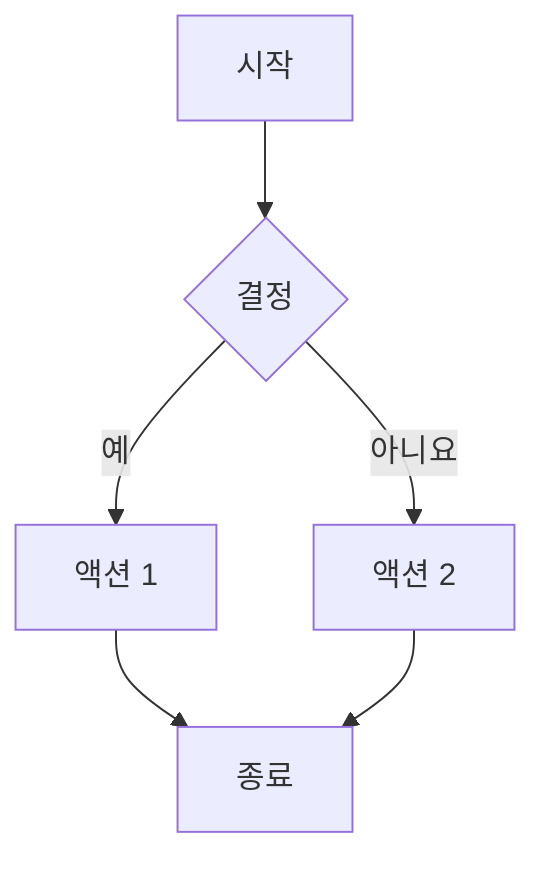
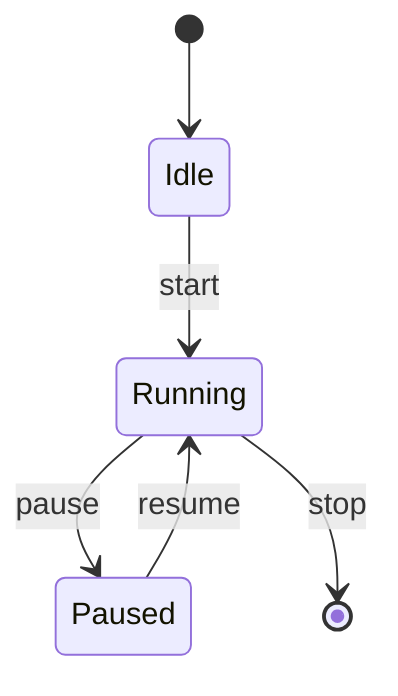
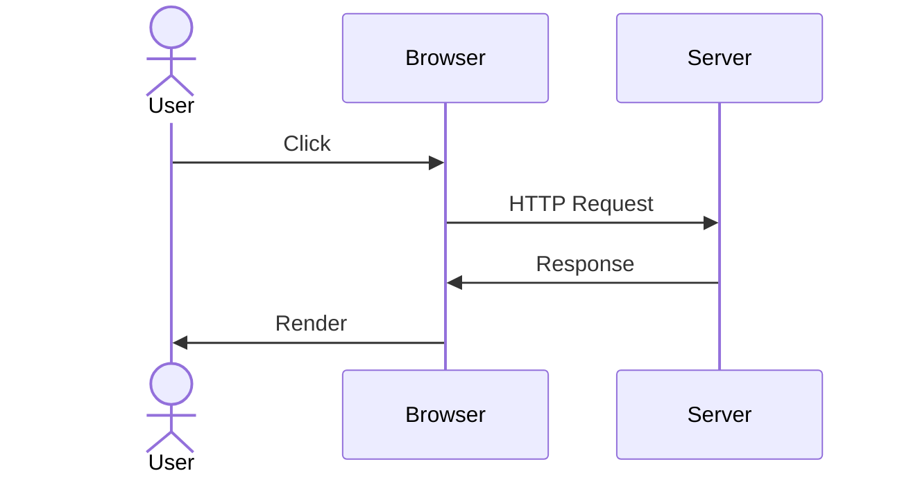

# 스크립트 상세 가이드

각 검증 스크립트의 심화 사용법입니다.

## 스크립트 목록

```
Phase 1: lint_korean_docs.py           (마크다운 린팅)
Phase 2: validate_mermaid_diagrams.py  (Mermaid 검증)
Phase 2.5: extract_mermaid_details.py  (Mermaid 코드 추출)
Phase 3: validate_korean_typography.py (한글 타이포그래피)
Phase 4: generate_final_comprehensive_report.py (종합 리포트)
```

---

## Phase 1: lint_korean_docs.py

**위치**: `.claude/skills/moai-docs-unified/scripts/lint_korean_docs.py`

### 기본 사용법

```bash
# 기본값으로 실행 (docs/src/ko)
uv run .claude/skills/moai-docs-unified/scripts/lint_korean_docs.py

# 커스텀 경로
uv run .claude/skills/moai-docs-unified/scripts/lint_korean_docs.py \
  --path docs/src/ko/guides \
  --output my_report.txt
```

### 검증 항목 상세

#### 1. 제목(Header) 검증

**규칙**:
- H1 (#): 파일당 **정확히 1개**
- H2-H6: 여러 개 허용
- 계층 구조: 레벨 스킵 금지 (# → ## → ### 순서)
- 중복 금지: 같은 레벨에서 중복된 제목 없음

**예시 (정상)**:
```markdown
# Main Title

## Section 1
### Subsection 1.1

## Section 2
### Subsection 2.1
```

**예시 (오류)**:
```markdown
# Title 1
# Title 2        ❌ H1 중복

### Deep         ❌ H2 건너뜀
```

#### 2. 코드 블록 검증

**규칙**:
- 언어 선언 필수 (``` python```, ```javascript```)
- 시작/종료 구분자 일치 필수
- 별도 라인에 배치

**정상**:
```markdown
\`\`\`python
def hello():
    print("Hello")
\`\`\`
```

**오류**:
```markdown
\`\`\`
def hello():
\`\`\`python  ❌ 구분자 불일치
```

#### 3. 링크 검증

**규칙**:
- 상대 경로 사용 (내부 링크)
- HTTPS 프로토콜 (외부 링크)
- 파일 존재 확인
- 앵커 링크 유효성

**정상**:
```markdown
[로컬 파일](../path/to/file.md)
[외부 링크](https://example.com)
[섹션 링크](#header-anchor)
```

**오류**:
```markdown
[깨진 링크](../nonexistent.md)      ❌ 파일 없음
[비보안](http://example.com)        ❌ HTTP
[잘못된 앵커](#invalid)             ❌ 헤더 없음
```

#### 4. 리스트 검증

**규칙**:
- 마커 일관성 (- 또는 *, 섞지 말 것)
- 들여쓰기 일관성 (공백 2-4개)
- 탭 금지

**정상**:
```markdown
- Item 1
- Item 2
  - Nested 2.1
  - Nested 2.2
- Item 3
```

**오류**:
```markdown
- Item 1
* Item 2      ❌ 마커 섞임
	- Item 3  ❌ 탭 사용
```

#### 5. 테이블 검증

**규칙**:
- 모든 행의 열 개수 일치
- 헤더 구분선 필수 (|---|)
- 정렬 기호 일치

**정상**:
```markdown
| Header 1 | Header 2 |
|----------|----------|
| Cell 1   | Cell 2   |
| Cell 3   | Cell 4   |
```

**오류**:
```markdown
| Header 1 | Header 2
| Cell 1   | Cell 2 | Cell 3  ❌ 열 개수 불일치
```

### 커스텀 옵션

```bash
# 특정 언어 문서만 검사
uv run .claude/skills/moai-docs-unified/scripts/lint_korean_docs.py \
  --path docs/src/ko

# 특정 디렉토리만
uv run .claude/skills/moai-docs-unified/scripts/lint_korean_docs.py \
  --path docs/src/ko/guides

# 상세 출력
uv run .claude/skills/moai-docs-unified/scripts/lint_korean_docs.py \
  --output detailed_report.txt
```

### 결과 해석

```
📋 결과 분류

✅ 정상 (Pass)
  - 코드블록: 정상
  - 리스트: 241개 항목 검증됨

❌ 오류 (Fail)
  - 깨진 링크: 351개 (대부분 거짓양성)
  - 중복 헤더: 1,241개 (HTML 스팬)

⚠️  경고 (Warning)
  - 후행 공백: 12개 발견
```

---

## Phase 2: validate_mermaid_diagrams.py

**위치**: `.claude/skills/moai-docs-unified/scripts/validate_mermaid_diagrams.py`

### 기본 사용법

```bash
# 모든 문서에서 Mermaid 검색
uv run .claude/skills/moai-docs-unified/scripts/validate_mermaid_diagrams.py

# 특정 경로만 검사
uv run .claude/skills/moai-docs-unified/scripts/validate_mermaid_diagrams.py \
  --path docs/src/ko/guides
```

### 지원 다이어그램 타입

#### 1. Graph (플로우차트)



**검증**:
- 노드 정의: `A[텍스트]`
- 엣지 (연결): `A --> B`
- 방향: TD(위아래), LR(좌우), BT(아래위), RL(우좌)

#### 2. State Diagram



**검증**:
- 상태: `Idle`, `Running` 등
- 전이: `Idle --> Running: label`
- 시작/종료: `[*]`

#### 3. Sequence Diagram



**검증**:
- 참여자: `participant Name`
- 메시지: `Actor->>Service: message`
- 활성화: `activate`, `deactivate`

### 검증 프로세스

1. **타입 감지**: `graph`, `stateDiagram-v2`, `sequenceDiagram` 등
2. **문법 검증**: 규칙 위반 확인
3. **노드/엣지 검증**: 정의된 노드만 연결 확인
4. **구성 블록 처리**: `%%{init: ...}%%` 설정 제거

### 결과 해석

```
[1] index_diagram_1
    파일: ko/guides/alfred/index.md:125
    타입: 📊 Graph
    라인 수: 15
    상태: ✅ 유효한 다이어그램 타입
    문법: ✅ 검증됨
```

---

## Phase 2.5: extract_mermaid_details.py

**위치**: `.claude/skills/moai-docs-unified/scripts/extract_mermaid_details.py`

### 기본 사용법

```bash
# 모든 Mermaid 코드 추출
uv run .claude/skills/moai-docs-unified/scripts/extract_mermaid_details.py

# 결과 파일 확인
cat .moai/reports/mermaid_detail_report.txt
```

### 렌더링 테스트 가이드

**목적**: 추출된 Mermaid 코드를 온라인에서 테스트

**절차**:

1. **코드 복사**
   ```
   리포트 파일에서 "코드:" 섹션 전체 복사
   ```

2. **Mermaid Live 접속**
   ```
   https://mermaid.live
   ```

3. **코드 붙여넣기**
   - 좌측 편집기에 붙여넣기
   - 자동으로 렌더링됨

4. **결과 확인**
   - 우측에 다이어그램 표시
   - 콘솔에 오류 메시지 표시 (있을 경우)

### 출력 예시

```
[1] 다이어그램 #1
    라인: 45
    타입: 📊 Graph
    높이: 12 줄

    코드:
    ────────────────────────────────────
    graph TD
        A[시작] --> B{결정}
        B -->|예| C[액션]
        C --> D[종료]
    ────────────────────────────────────
```

---

## Phase 3: validate_korean_typography.py

**위치**: `.claude/skills/moai-docs-unified/scripts/validate_korean_typography.py`

### 기본 사용법

```bash
# 한글 문서만 검사
uv run .claude/skills/moai-docs-unified/scripts/validate_korean_typography.py

# 샘플 파일 상세 분석 포함
uv run .claude/skills/moai-docs-unified/scripts/validate_korean_typography.py \
  --output detailed_typography_report.txt
```

### 검증 항목

#### 1. UTF-8 인코딩

**확인 방법**:
```bash
# 파일 인코딩 확인
file -i docs/src/ko/guides/file.md
# 출력: ... charset=utf-8

# 또는
hexdump -C docs/src/ko/guides/file.md | head
```

**문제 해결**:
```bash
# ISO-8859-1 → UTF-8 변환
iconv -f ISO-8859-1 -t UTF-8 old_file.md > new_file.md
```

#### 2. 전각 공백 (U+3000)

**문제**:
```
❌ "한글　테스트"  (전각 공백 U+3000)
✅ "한글 테스트"   (반각 공백)
```

**찾기 및 교체**:
```bash
# grep으로 찾기
grep -n $'\u3000' docs/src/ko/guides/*.md

# sed로 교체
sed -i 's/\u3000/ /g' docs/src/ko/guides/*.md
```

#### 3. 전각 괄호

**문제**:
```
❌ （아래 첨자）     전각 괄호
❌ 「인용」         전각 따옴표
✅ (아래 첨자)      반각 괄호
✅ "인용"          반각 따옴표
```

**변환 규칙**:
```
（ → (
） → )
「 → "
」 → "
```

#### 4. 마침표/쉼표

**문제**:
```
❌ "문장。"        한글 마침표
❌ "항목、항목"     한글 쉼표
✅ "문장."        영문 마침표
✅ "항목, 항목"    영문 쉼표
```

#### 5. 한영 공백

**규칙**: 한글과 영문 사이에 공백 추가

**정상**:
```markdown
버전 1.0
최신 API
Python 3.11
한글 English Korean
```

**오류**:
```markdown
버전1.0          ❌ 숫자 공백 없음
최신API          ❌ 영문 공백 없음
Python3.11       ❌ 영문-숫자 공백 없음
```

### 통계 정보

```
📊 파일 통계

제목 구조:
  - H1: 1개
  - H2: 4개
  - H3: 8개

문자 통계:
  - 한글 문자: 2,345개
  - 영문 단어: 234개
  - 숫자: 12개

인코딩:
  - UTF-8: 100%
  - 기타: 0%
```

---

## Phase 4: generate_final_comprehensive_report.py

**위치**: `.claude/skills/moai-docs-unified/scripts/generate_final_comprehensive_report.py`

### 기본 사용법

```bash
# 종합 리포트 생성 (모든 Phase 결과 통합)
uv run .claude/skills/moai-docs-unified/scripts/generate_final_comprehensive_report.py

# 커스텀 리포트 디렉토리
uv run .claude/skills/moai-docs-unified/scripts/generate_final_comprehensive_report.py \
  --report-dir custom_reports_dir \
  --output custom_report.txt
```

### 리포트 구조

#### 1. Executive Summary (요약)

```
🎯 종합 품질 점수: 8.5/10

✅ 완료된 항목
  - Phase 1 마크다운 린팅 ✅
  - Phase 2 Mermaid 검증 ✅
  - Phase 3 한글 타이포그래피 ✅
```

#### 2. Phase 결과

```
🔴 Priority 1 (긴급): 즉시 수정 필요
  - 거짓양성 오류 (HTML 스팬)

🟡 Priority 2 (높음): 중요 개선 사항
  - 상대경로 링크 검증

🟢 Priority 3 (낮음): 선택사항
  - 타이포그래피 미세 조정
```

#### 3. Action Items (실행 항목)

```
Immediate (즉시):
  ☐ 생성된 리포트 검토
  ☐ 거짓양성 필터링
  ☐ 우선순위 항목 정렬

Short-term (1주):
  ☐ 오류 수정
  ☐ CI/CD 통합

Long-term (지속적):
  ☐ 다언어 확대
  ☐ 대시보드 구축
```

### 품질 점수 계산

```
품질 점수 공식:

Quality = (
    Spec_Compliance * 0.25 +
    Content_Accuracy * 0.25 +
    Completeness * 0.20 +
    Readability * 0.15 +
    Formatting * 0.15
) * 10

범위:
  9.0-10.0  ⭐⭐⭐⭐⭐ 탁월 (Excellent)
  8.0-8.9   ⭐⭐⭐⭐   우수 (Good)
  7.0-7.9   ⭐⭐⭐     양호 (Fair)
  6.0-6.9   ⭐⭐      개선 필요
  < 6.0     ⭐       긴급 (Critical)
```

---

## 성능 특성

| 스크립트 | 실행 시간 | 메모리 | 파일 수 | 항목 수 |
|---------|----------|--------|--------|--------|
| Phase 1 | 30초 | 30MB | 53 | 241 (리스트) |
| Phase 2 | 20초 | 20MB | 9 | 16 (다이어그램) |
| Phase 2.5 | 5초 | 10MB | 9 | 16 (코드) |
| Phase 3 | 40초 | 40MB | 43 | 28,543 (라인) |
| Phase 4 | 10초 | 20MB | - | - |
| **전체** | **2-3분** | **50-100MB** | **53-43** | **~28,800** |

---

## 일반적인 문제

### "FileNotFoundError" 발생

```
오류: FileNotFoundError: /path/to/docs/src
```

**해결책**:
```bash
# 경로 확인
ls -la docs/src/

# 경로 지정 후 재실행
uv run ... --path docs/src/ko
```

### 거짓양성 오류 무시하기

**문제**: 실제 오류가 아닌데 리포트됨

**해결책**:
1. 리포트 파일 열기
2. 실제 오류 찾기 (반복되는 패턴 제외)
3. 해당 항목만 수정

### 리포트 파일 크기가 큼

**분석**:
```bash
# 리포트 파일 크기 확인
ls -lh .moai/reports/*.txt

# 특정 리포트의 라인 수
wc -l .moai/reports/lint_report_ko.txt
```

**최적화**:
```bash
# 압축
gzip .moai/reports/lint_report_ko.txt

# 요약만 추출
head -100 .moai/reports/korean_docs_comprehensive_review.txt
```

---

## 다음 단계

- **[통합 가이드](index.md)** - 전체 개요로 돌아가기
- **[에이전트 가이드](agent.md)** - docs-manager 활용법
- **[FAQ](faq.md)** - 자주 묻는 질문

